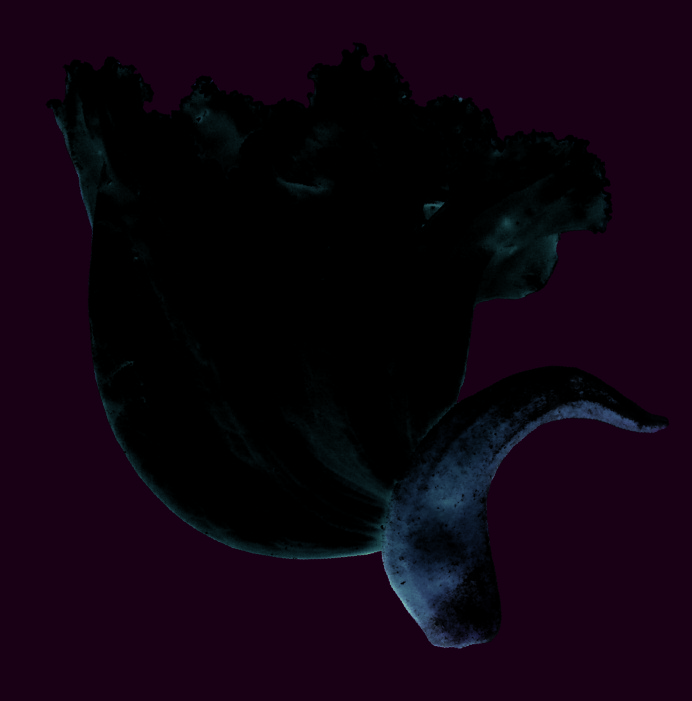
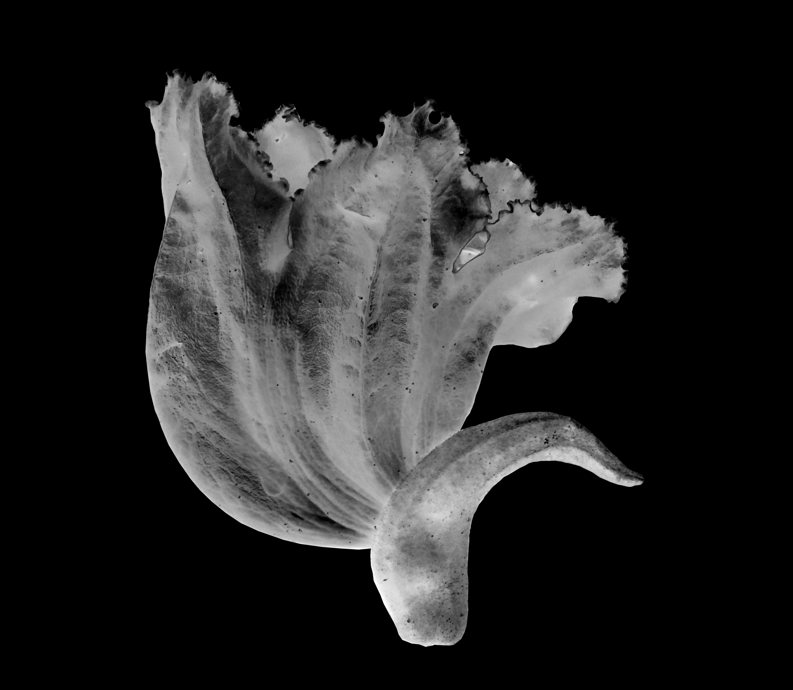
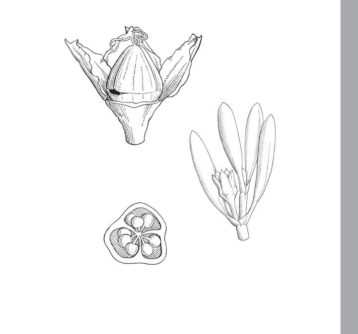
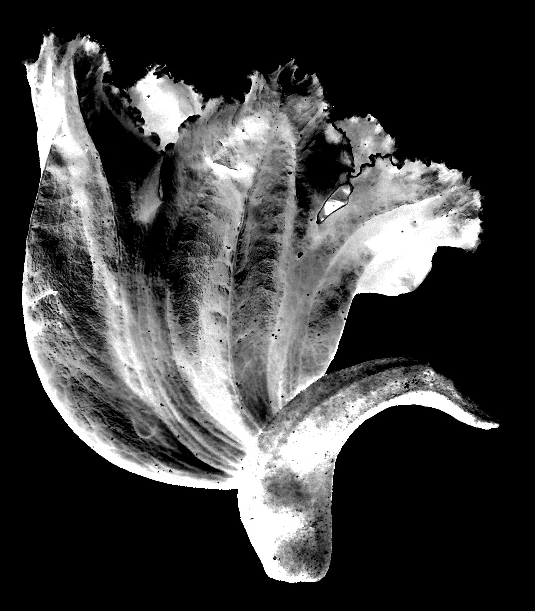
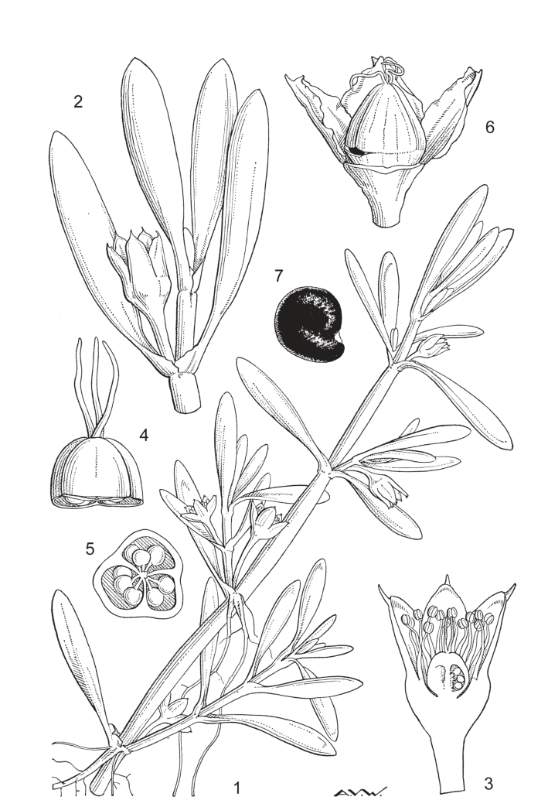
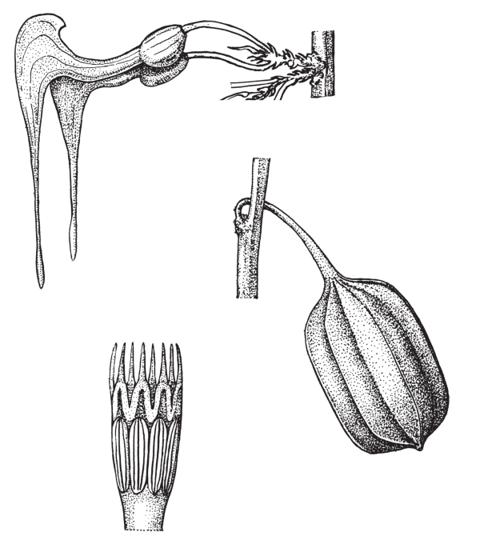

## Figure 0 (page 2)

*Caption:* (no caption)

---

## Figure 1 (page 2)

*Caption:* (no caption)

---

## Figure 2 (page 2)

*Caption:* (no caption)

---

## Figure 3 (page 4)

*Caption:* (no caption)

---

## Figure 4 (page 4)

*Caption:* (no caption)

---

## Figure 5 (page 8)

*Caption:* (no caption)

---

## Figure 6 (page 8)

*Caption:* (no caption)

---

## Figure 7 (page 10)

*Caption:* Planche 1. Sesuvium portulacastrum : 1. Plante (× 1). – 2. Fleur (× 2). – 3. Fleur, section longitudi- nale (× 4). – 4. Couvercle (× 8). – 5. Ovaire, coupe transversale (× 8). – 6. Fruit déhiscent (× 4). – 7.

---

## Figure 8 (page 12)

*Caption:* (no caption)

---
