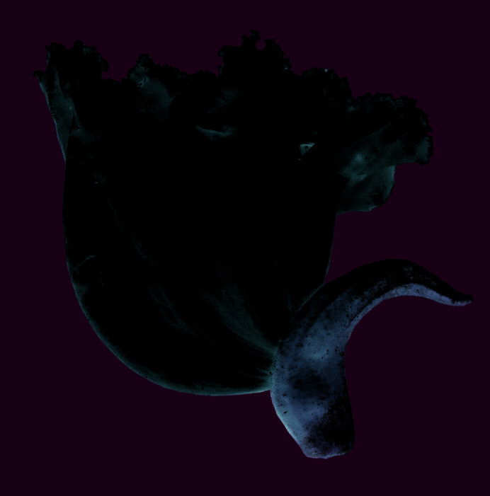
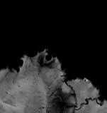
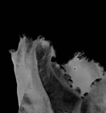
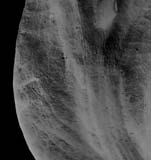
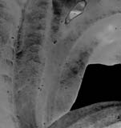
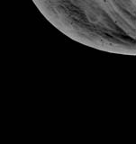
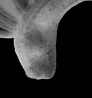
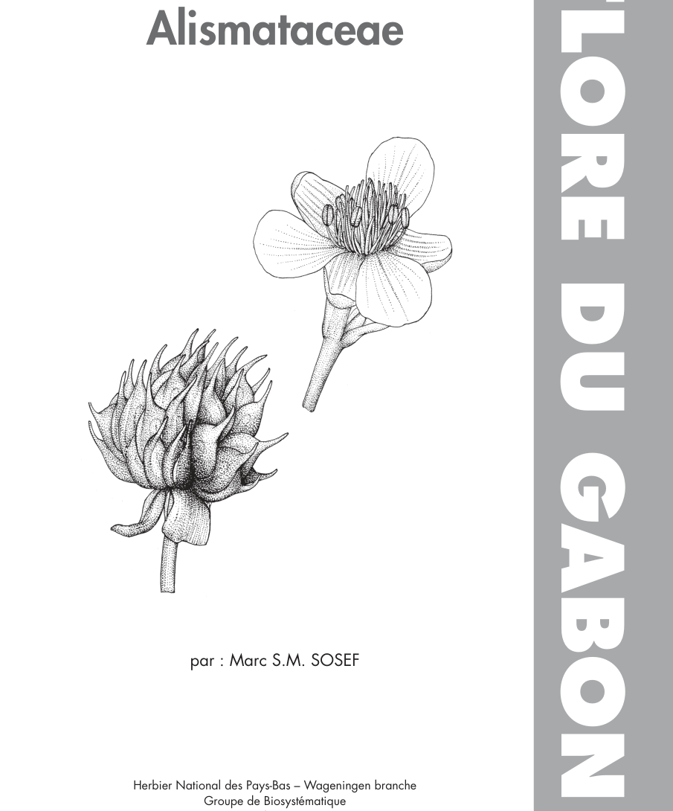
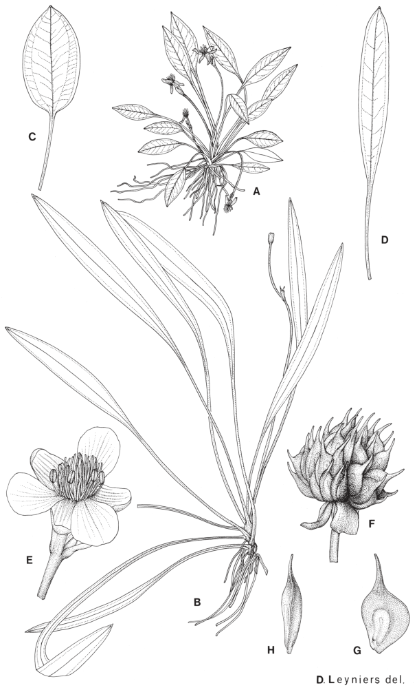

## Figure 0 (page 2)

*Caption:* (no caption)

---

## Figure 1 (page 2)

*Caption:* (no caption)

---

## Figure 2 (page 2)

*Caption:* (no caption)

---

## Figure 3 (page 3)

*Caption:* (no caption)

---

## Figure 4 (page 3)

*Caption:* (no caption)

---

## Figure 5 (page 3)

*Caption:* (no caption)

---

## Figure 6 (page 3)

*Caption:* (no caption)

---

## Figure 7 (page 3)

*Caption:* (no caption)

---

## Figure 8 (page 3)

*Caption:* (no caption)

---

## Figure 9 (page 7)

*Caption:* (no caption)

---

## Figure 10 (page 9)

*Caption:* Planche 1. Ranalisma humile : A. Plante, forme sur vase. – B. Plante, forme submergée. – C-D.

---
