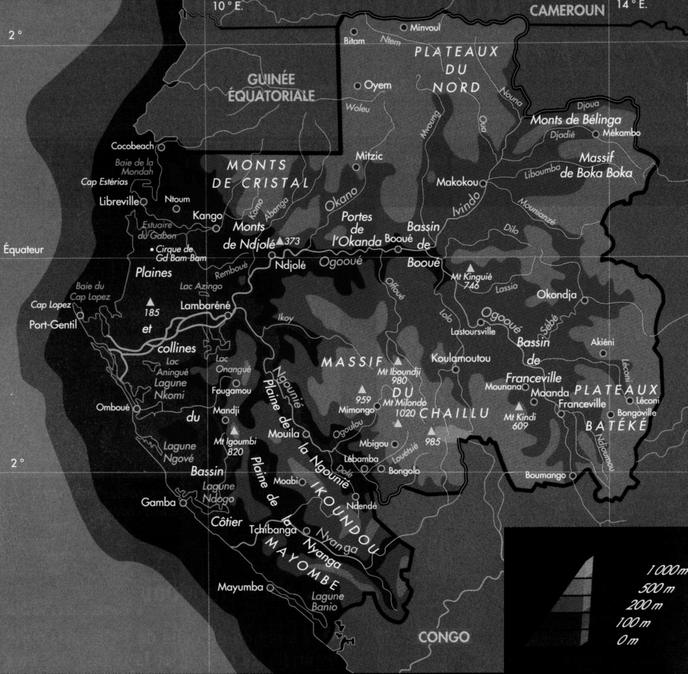
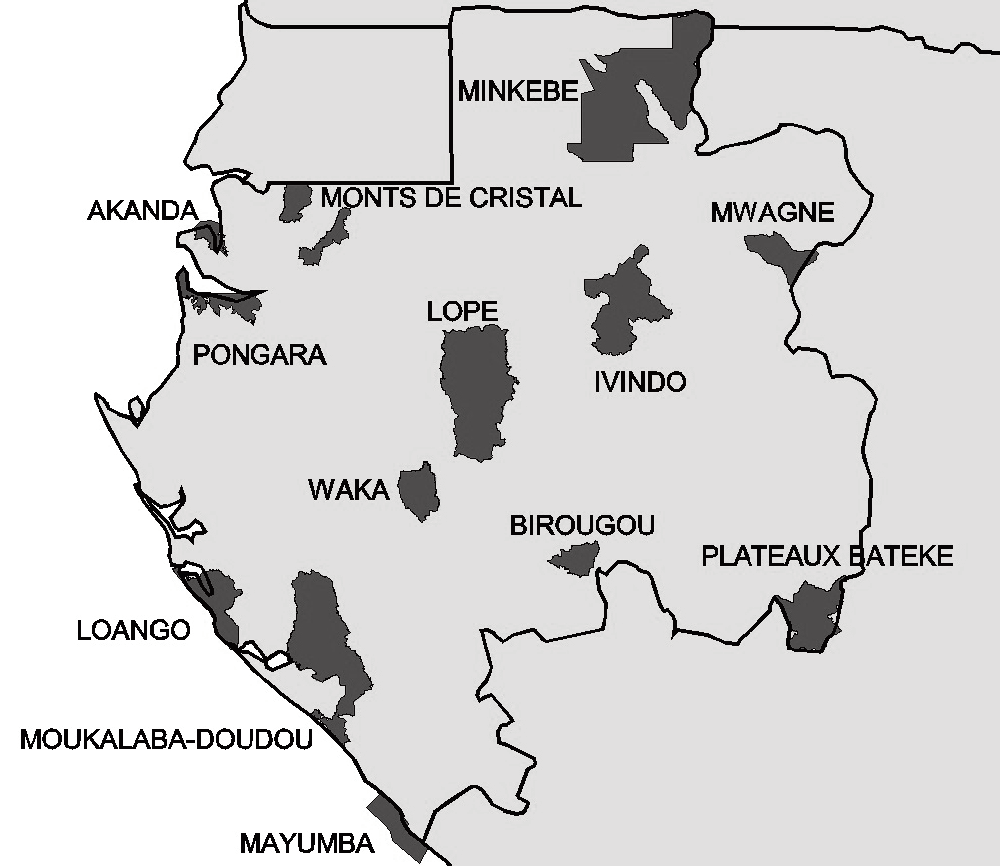
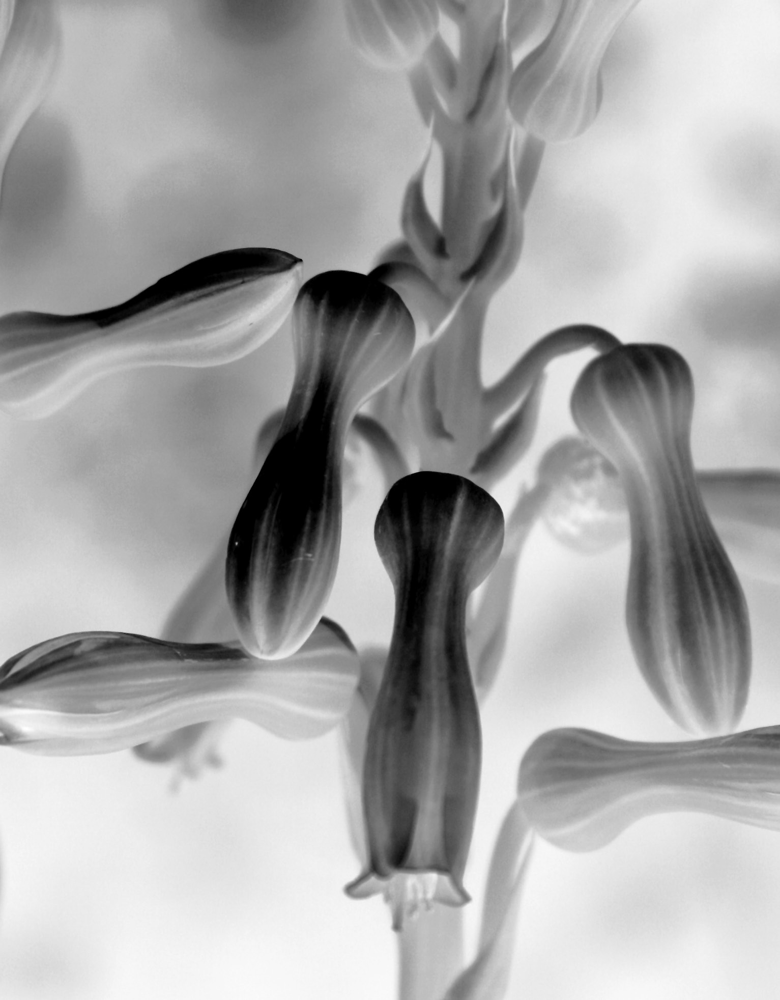
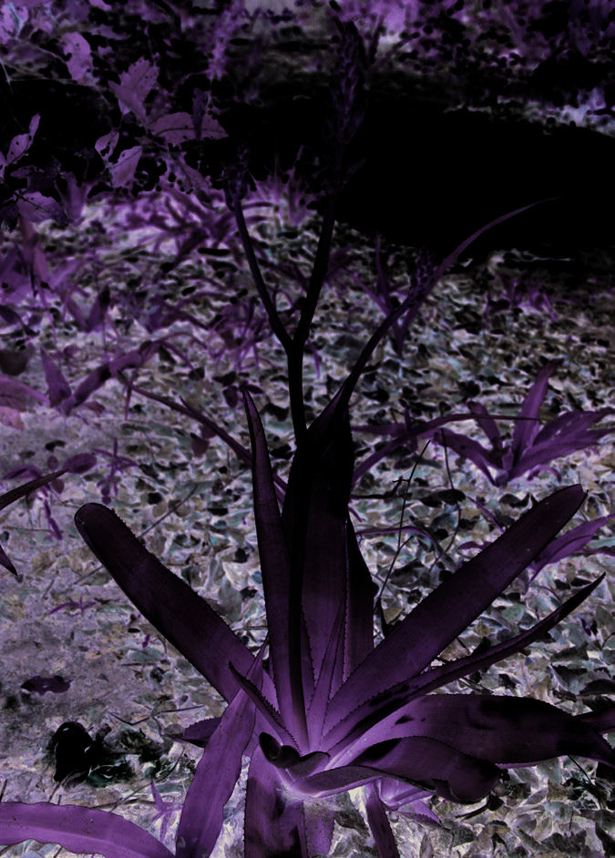
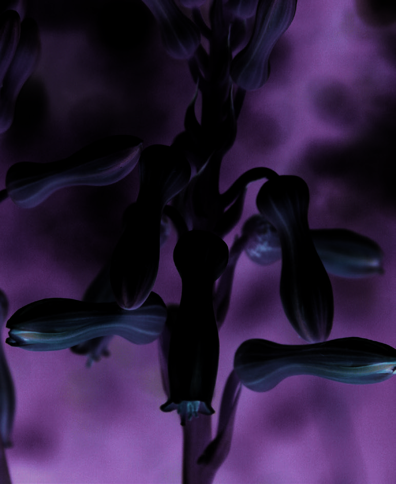

## Figure 0 (page 2)

*Caption:* (no caption)

---

## Figure 1 (page 2)

*Caption:* (no caption)

---

## Figure 2 (page 2)

*Caption:* (no caption)

---

## Figure 3 (page 2)

*Caption:* (no caption)

---

## Figure 4 (page 3)

*Caption:* (no caption)

---

## Figure 5 (page 3)

*Caption:* (no caption)

---

## Figure 6 (page 3)

*Caption:* (no caption)

---

## Figure 7 (page 4)

*Caption:* (no caption)

---

## Figure 8 (page 4)

*Caption:* (no caption)

---

## Figure 9 (page 8)

*Caption:* (no caption)

---

## Figure 10 (page 8)

*Caption:* (no caption)

---

## Figure 11 (page 11)

*Caption:* Figure 1. Aloe buettneri : 1. Port de la plante. – 2. Fleurs. Photos par Katharina Schumann (©), repro - duites avec permission à partir de Dressler et al. (2014).

---

## Figure 12 (page 11)

*Caption:* (no caption)

---
