## Figure 0 (page 2)

*Caption:* (no caption)

---

## Figure 1 (page 2)

*Caption:* (no caption)

---

## Figure 2 (page 2)

*Caption:* (no caption)

---

## Figure 3 (page 2)
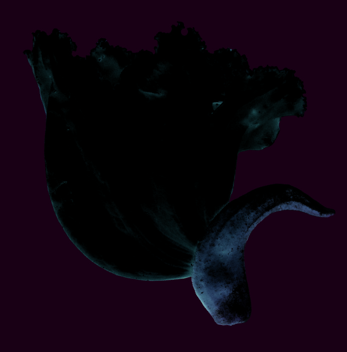
*Caption:* (no caption)

---

## Figure 4 (page 3)

*Caption:* (no caption)

---

## Figure 5 (page 3)
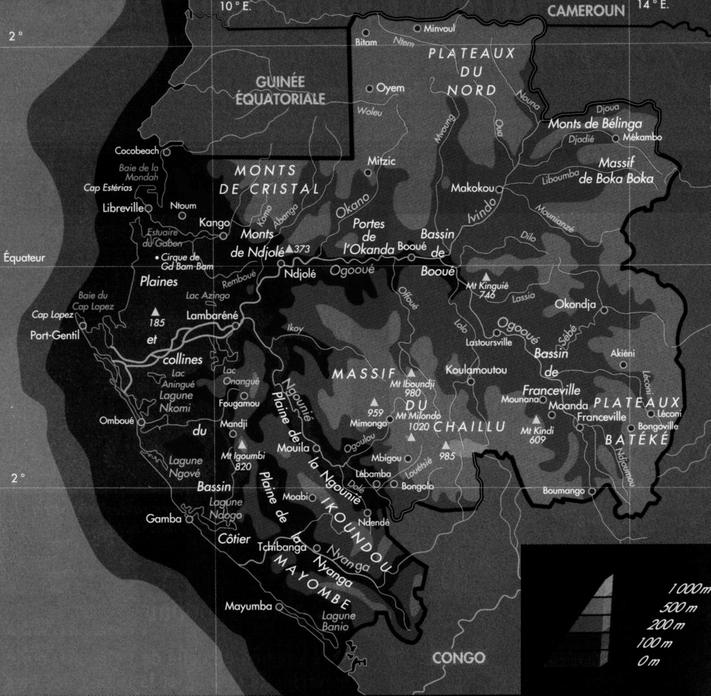
*Caption:* (no caption)

---

## Figure 6 (page 3)
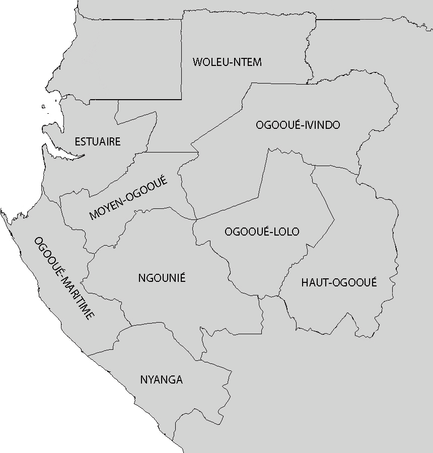
*Caption:* (no caption)

---

## Figure 7 (page 4)
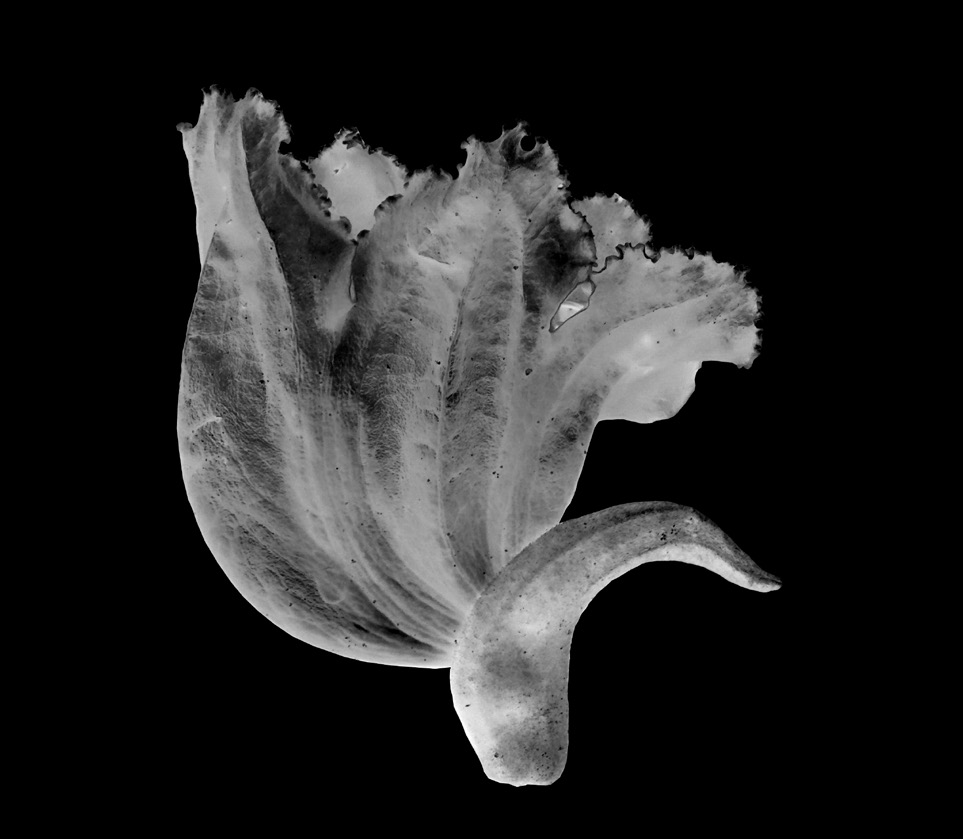
*Caption:* (no caption)

---

## Figure 8 (page 4)
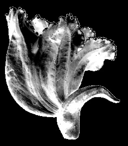
*Caption:* (no caption)

---

## Figure 9 (page 8)
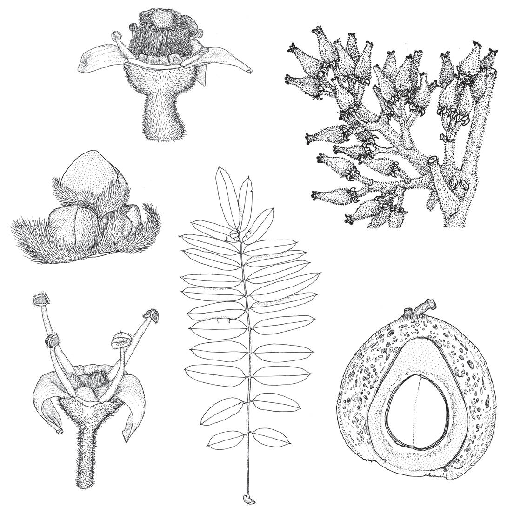
*Caption:* (no caption)

---

## Figure 10 (page 8)

*Caption:* (no caption)

---

## Figure 11 (page 12)
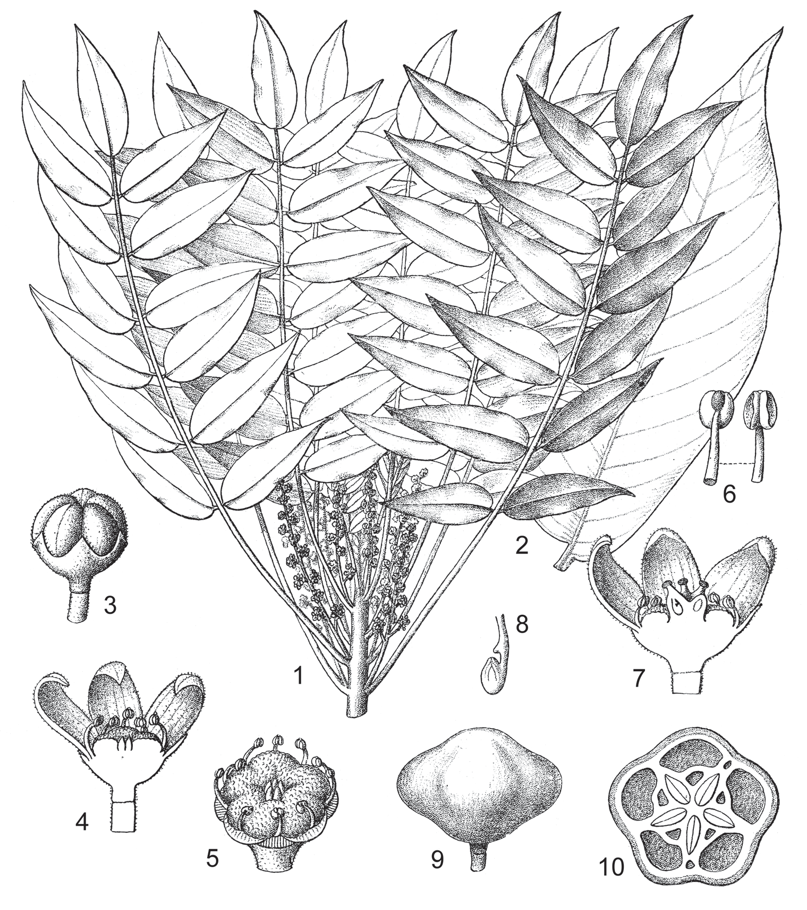
*Caption:* Planche 1 . Antrocaryon klaineanum : 1. Rameau florifère (× ¼). – 2. Foliole (× 1). – 3. Fleur mâle en bouton (× 6). – 4. Idem, coupe longitudinale (× 6). – 5. Idem, sans sépales, ni pétales (× 8). – 6. Étamines, vue frontale et dorsale (× 10). – 7. Fleur femelle, coupe longitudinale (× 7). – 8. Ovule (× 25). – 9. Fruit (× 1). – 10. Idem, coupe transversale (× 1). Dessin reproduit à partir d’Engler (1921). lule ± canaliculé, 1–4 mm, le terminal jusqu’à 1,5 cm, à limbe oblong-lancéolé à étroitement oblong-elliptique, 6–13 × 2,5–4 cm, obliquement arrondi à subcordé à la base, longuement acuminé-aigu au sommet, papyracé, avec 20 à 30 paires de nervures latérales . Inflorescence en panicule assez lâche, à fleurs ± glomérulées, 10–30 cm de longueur, pubérulente ; bractées et bractéoles rapidement caduques, ± lancéolées, 1–3 mm de longueur. Fleur mâle : pédicelle 1–2 mm, articulé ± au milieu ; calice pubérulent, à lobes ovales, 1 mm de longueur ; pétales étalés, oblongs-ovales, 2 × 1,2 mm ; étamines légèrement incurvées, 1,5 mm de longueur, anthères 0,5 mm de longueur ; disque épais, lobulé-ondulé, 2 mm de diamètre, glabre ; pis-

---

## Figure 12 (page 13)
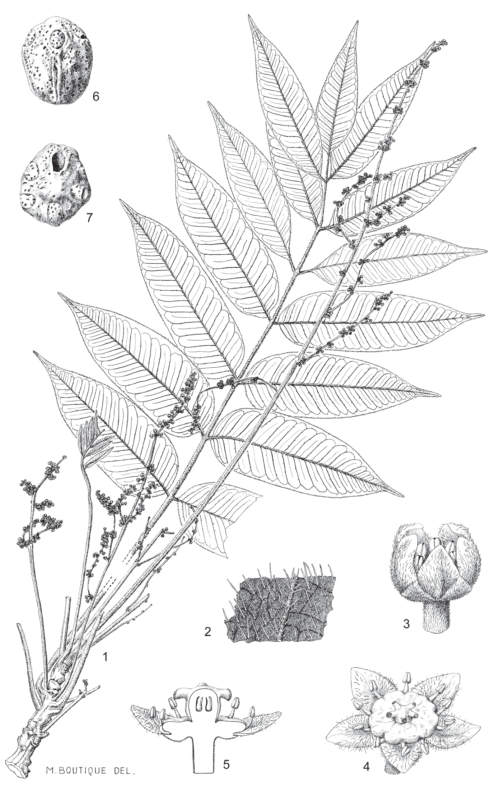
*Caption:* Planche 2. Antrocaryon nannanii : 1. Rameau florifère mâle (× ½). – 2. Partie de foliole, face inférieure (× 10). – 3. Fleur mâle jeune (× 8). – 4. Fleur femelle épanouie (× 6). – 5. Fleur femelle, coupe longitudi- nale (× 6). – 6. Noyau, vu de face (× ½). – 7. Noyau, vu de dessus (× ½). (1, 3 : Louis 11388 ; 2 : Toussaint 368 ; 4, 5 : Louis 10201 ; 6, 7 : Louis 4143 ). Dessin par M. Boutique, Jardin botanique Meise (©).

---

## Figure 13 (page 15)
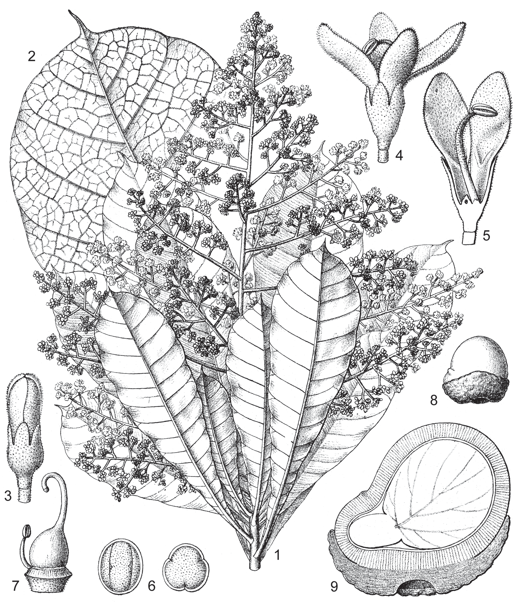
*Caption:* Planche 3 . Fegimanra africana : 1. Rameau florifère (× ⅓). – 2. Feuille, face supérieure (× 1). – 3. Bou- ton floral (× 5). – 4. Fleur mâle (× 5). – 5. Idem, coupe longitudinale (× 5). – 6. Grains de pollen (× 300). – 7. Pistil et staminode de la fleur femelle (× 6). – 8. Fruit jeune (× 1). – 9. Fruit mûr avec cupule, coupe transversale (× 2½). Dessin reproduit à partir d’Engler (1921).

---

## Figure 14 (page 18)
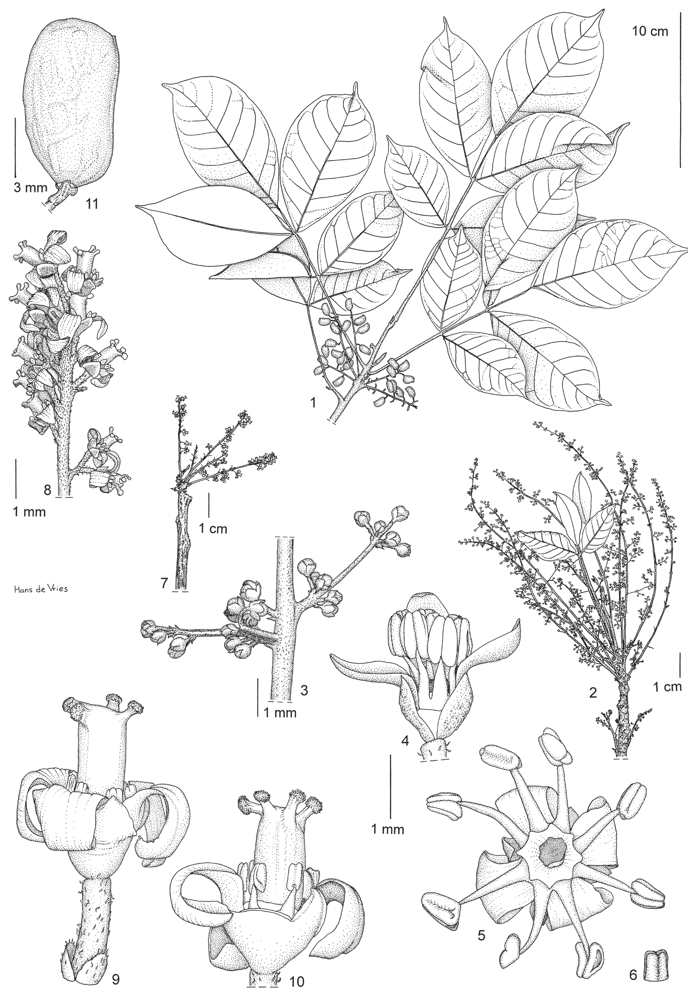
*Caption:* Planche 4 . Lannea glabrescens : 1. Rameau fructifère. – 2. Rameau à inflorescences mâles. – 3. Détail de l’inflorescence mâle. – 4. Fleur mâle, 1 sépale et 1 pétale enlevés. – 5. Fleur mâle, vue du haut. – 6. Détail du pistillode. – 7. Rameau à inflorescences femelles. – 8. Détail de l’inflorescence femelle. – 9. Fleur femelle. – 10. Fleur femelle, 1 sépale et 1 pétale enlevés. – 11. Fruit. (1, 11 : Harris et al. 8532 ; 2–6 :

---

## Figure 15 (page 20)
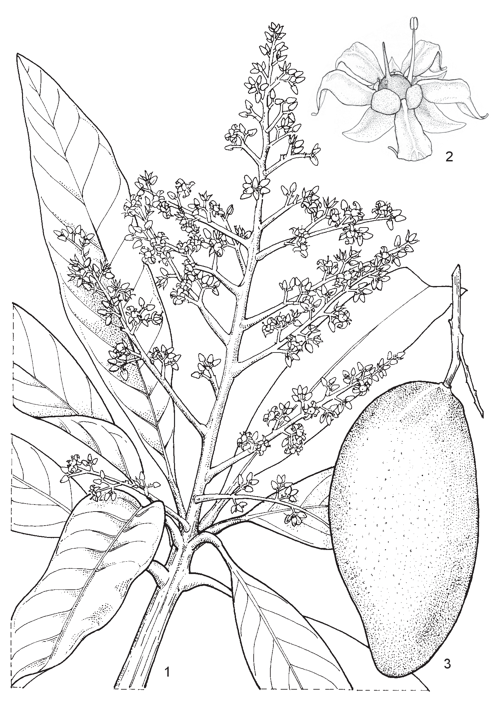
*Caption:* Planche 5 . Mangifera indica : 1. Rameau florifère. – 2. Fleur mâle. – 3. Fruit. Dessin reproduit avec permission à partir de Woodson et al. (1967 ; 2) et Sukonthasing et al. (1991 ; 1, 3).

---

## Figure 16 (page 23)
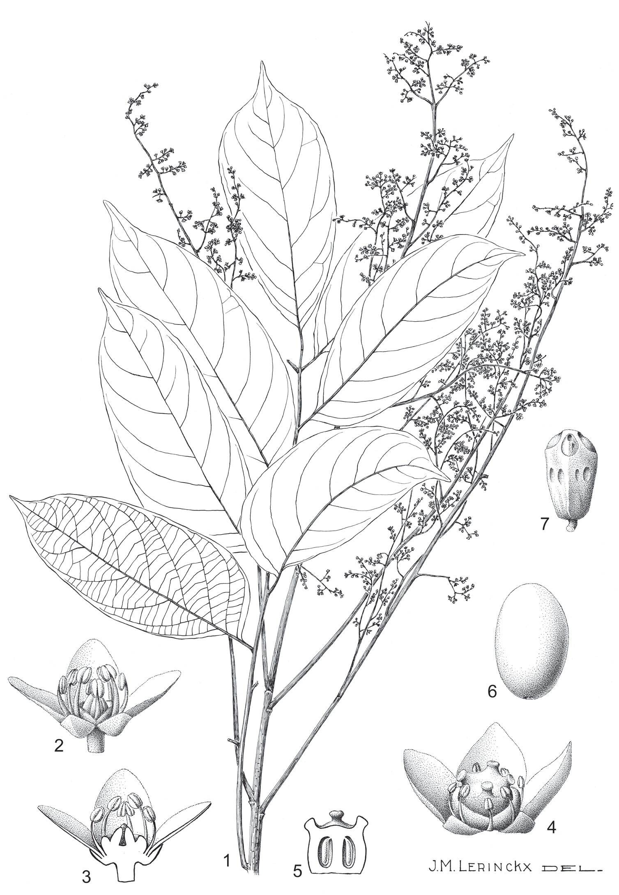
*Caption:* Planche 6 . Pseudospondias microcarpa : 1. Rameau florifère mâle (× ⅓). – 2. Fleur mâle épanouie, un pétale enlevé (× 10). – 3. Fleur mâle, coupe longitudinale (× 10). – 4. Fleur femelle épanouie, un pétale enlevé (× 10). – 5. Pistil, coupe longitudinale (× 10). – 6. Drupe (× 1). – 7. Noyau (× 1). (1-3 : Louis 11428 ; 4, 5 : Gille 251 ; 6 : Louis 16187 ; 7 : Robyns 242 ). Dessin par J.M. Lerinckx, Jardin botanique

---

## Figure 17 (page 26)
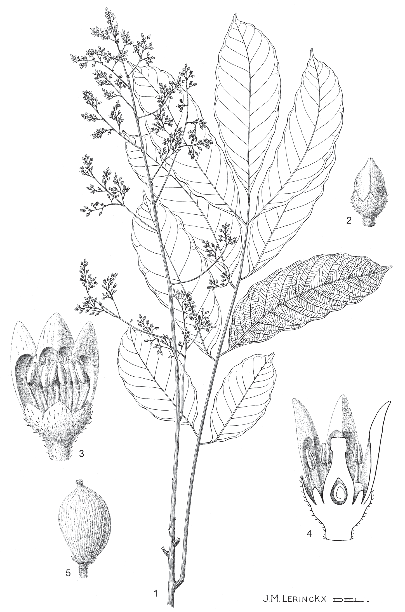
*Caption:* Planche 7 . Sorindeia africana : 1. Rameau florifère femelle (× ½). – 2. Bouton floral (× 5). – 3. Fleur mâle épanouie, 2 pétales enlevés (× 12). – 4. Fleur femelle épanouie, coupe longitudinale (× 12). – 5.

---

## Figure 18 (page 28)
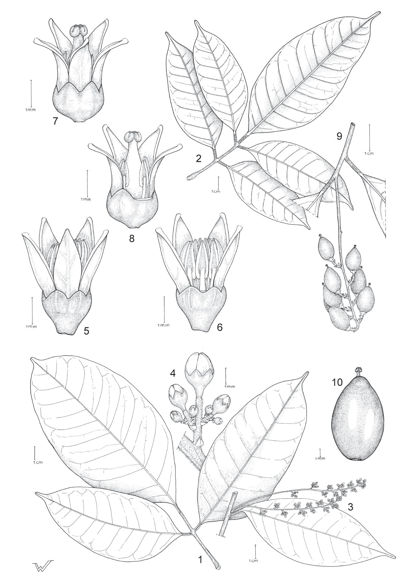
*Caption:* Planche 8 . Sorindeia gabonensis : 1. Feuille 5-foliolée, face inférieure. – 2. Feuille 3-foliolée, face supérieure. – 3. Feuille 1-foliolée avec inflorescence mâle. – 4. Détail de l’inflorescence mâle. – 5. Fleur mâle. – 6. Idem, 1 pétale enlevé. – 7. Fleur femelle. – 8. Idem, 1 pétale enlevé. – 9. Infrutescence. – 10.

---

## Figure 19 (page 29)
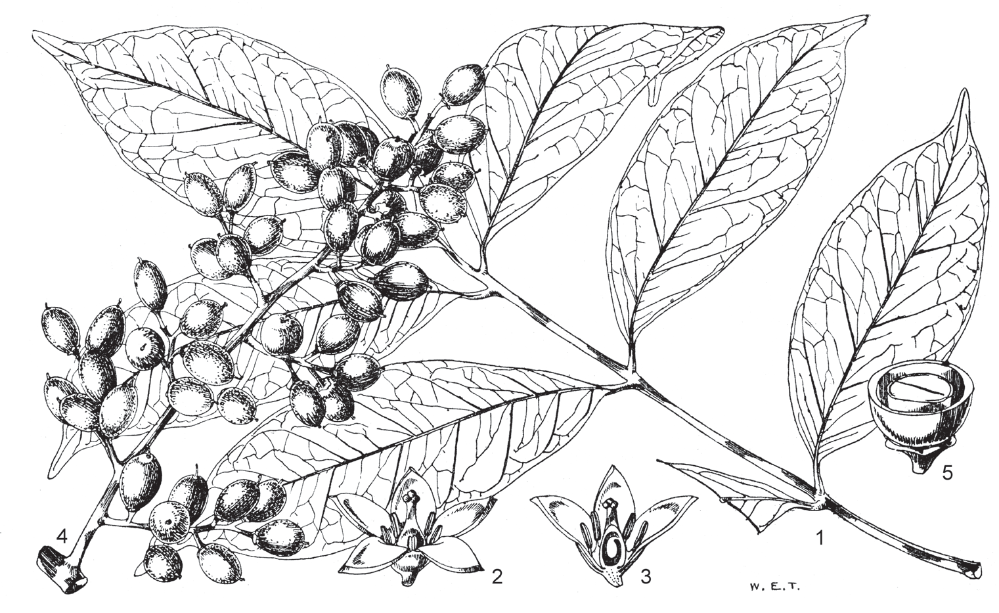
*Caption:* Planche 9 . Sorindeia juglandifolia : 1. Feuille. – 2. Fleur. – 3. Fleur, coupe longitudinale. – 4. Infru- tescence. – 5. Fruit, section transversale. Dessin par William E. Trevithick, Royal Botanic Gardens, Kew (©), reproduit avec permission à partir de Keay (1958).

---

## Figure 20 (page 31)
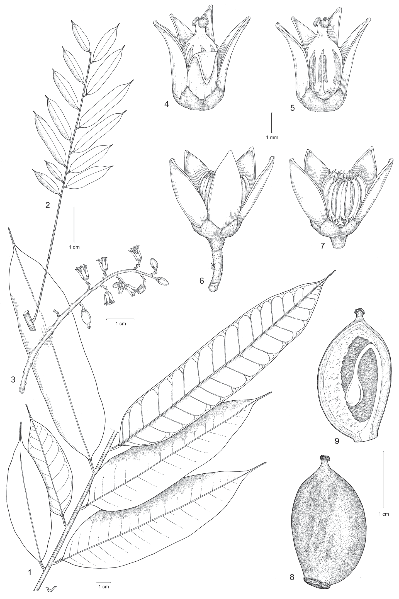
*Caption:* Planche 10 . Sorindeia oxyandra : 1. Folioles. – 2. Feuille entière. – 3. Inflorescence femelle. – 4. Fleur femelle. – 5. Idem, un pétale enlevé. – 6. Fleur mâle. – 7. Idem, un pétale enlevé. – 8. Fruit. – 9. Idem, coupe longitudinale. (1, 2, 6, 7 : Breteler & de Wilde 50 ; 3–5, 8, 9 : Breteler & de Wilde 51 ). Dessin par Wil Wessel, Naturalis Biodiversity Center (©), reproduit à partir de Bourobou-Bourobou & Breteler (1999).

---

## Figure 21 (page 32)
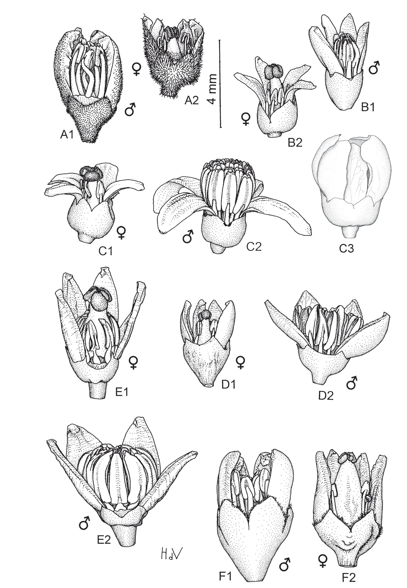
*Caption:* Planche 11 . Sorindeia spp., fleurs mâles et femelles : A. S. africana . – B. S. gabonensis . – C. S. grandifo- lia . – D. S. juglandifolia . – E. S. oxyandra . – F. S. winkleri . (A1 : Breteler & Jongkind 10225 ; A2 : Louis et al. 1208 ; B1 : Breteler & Jongkind 10730 ; B2 : Breteler et al. 8731 ; C1 : Leeuwenberg 9265 ; C2,

---

## Figure 22 (page 33)
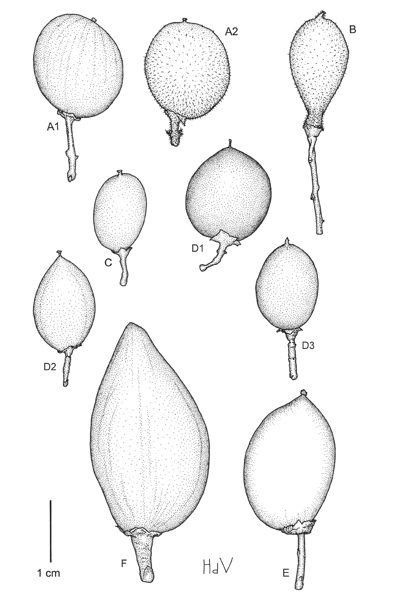
*Caption:* Planche 12 . Sorindeia spp., fruits : A. S. africana. – B. S. batekeensis . – C. S. gabonensis . – D. S. juglandifolia . – E. S. oxyandra . – F. S. winkleri . (A1 : Breteler et al. 14735 ; A2 : Breteler et al. 15033 ;

---

## Figure 23 (page 38)
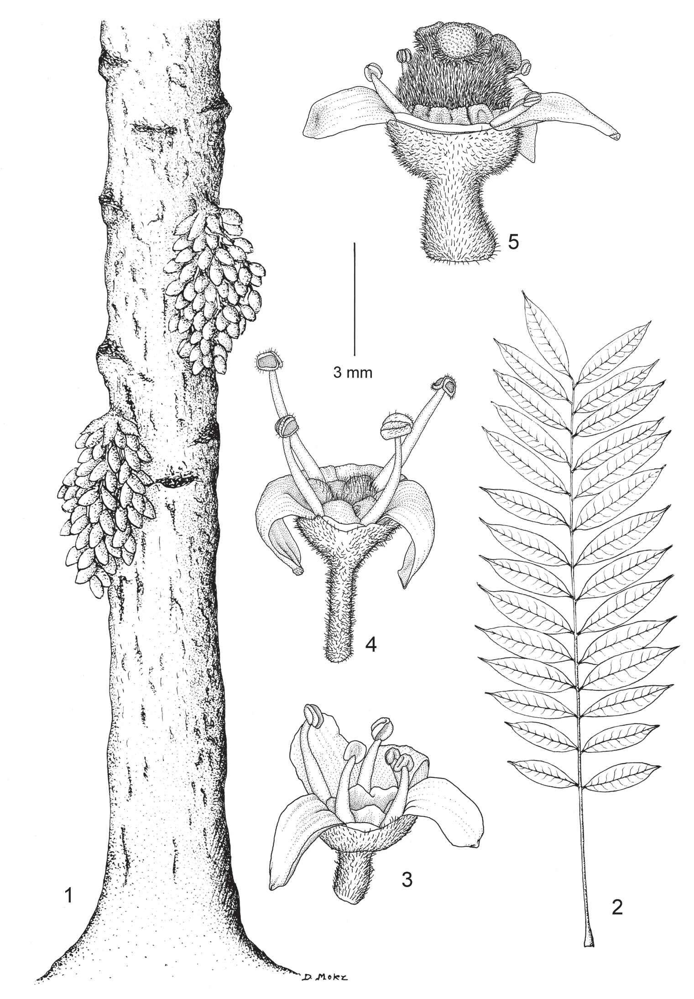
*Caption:* Planche 13 . Trichoscypha acuminata : 1. Tronc avec infrutescences. – 2. Feuille. – 3, 4. Fleurs mâles, un pétale enlevé. – 5. Fleur femelle, un pétale enlevé. (1 : Breteler 15670 , 2 : Sosef et al. 516, 3 : Breteler 15680 ). Dessin par Danièle Molez (1, 2), reproduit à partir de Ake Assi et al. (1978) et Hans de Vries (3–5), Jardin botanique Meise (©).

---

## Figure 24 (page 40)
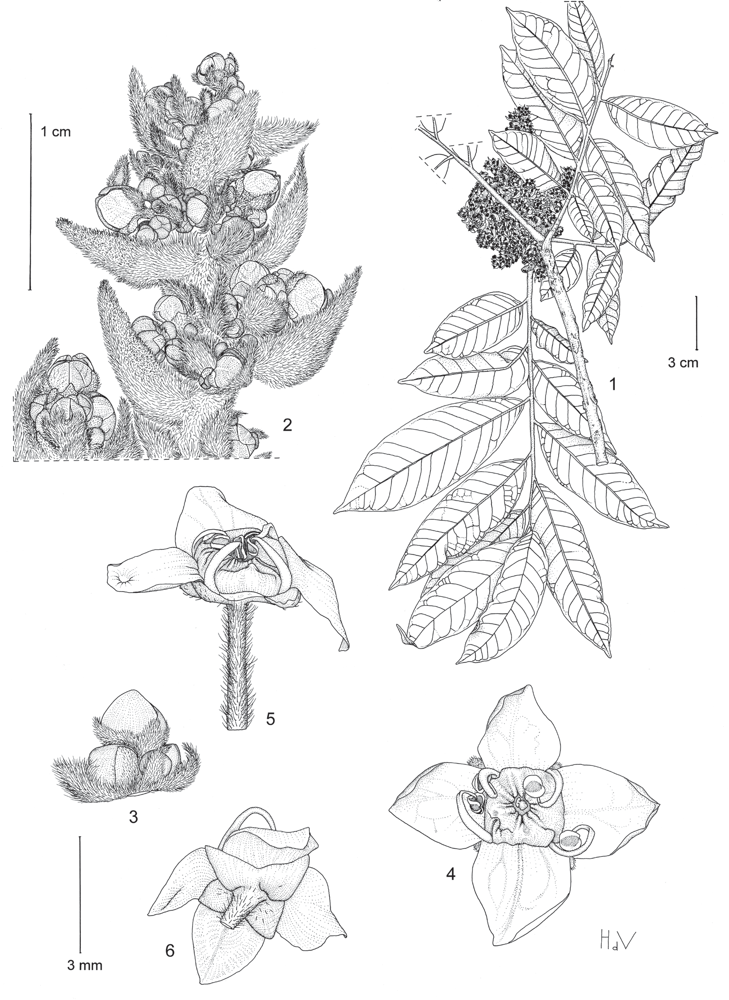
*Caption:* Planche 14 . Trichoscypha bracteata : 1. Rameau florifère. – 2. Partie de l’inflorescence. – 3. Détail de l’inflorescence montrant le calice pubescent. – 4. Fleur, vue du dessus. – 5. Fleur, 1 pétale enlevé. – 6.

---

## Figure 25 (page 42)
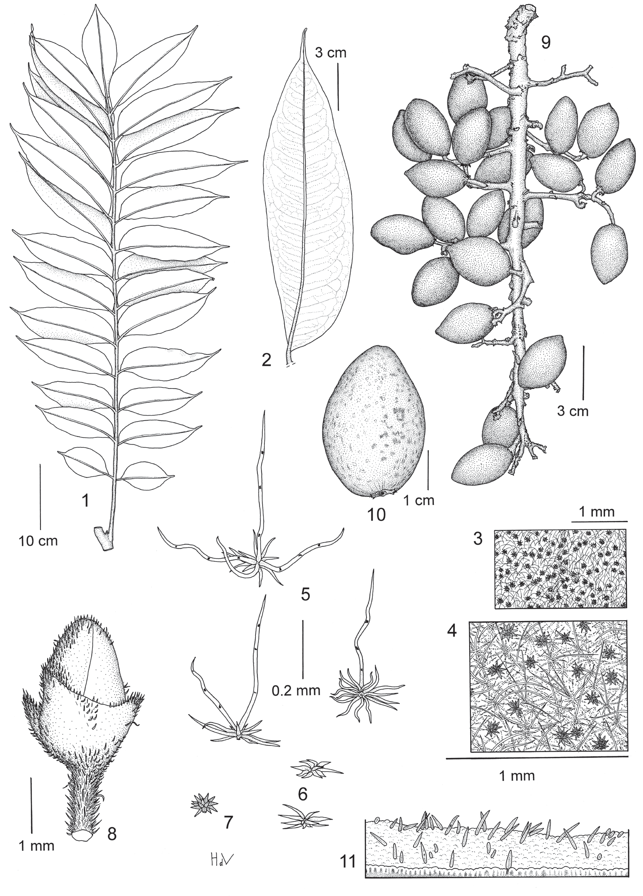
*Caption:* Planche 15 . Trichoscypha debruijnii : 1. Feuille. – 2. Foliole, face inférieure. – 3, 4. Idem, détail. – 5–7.

---

## Figure 26 (page 45)
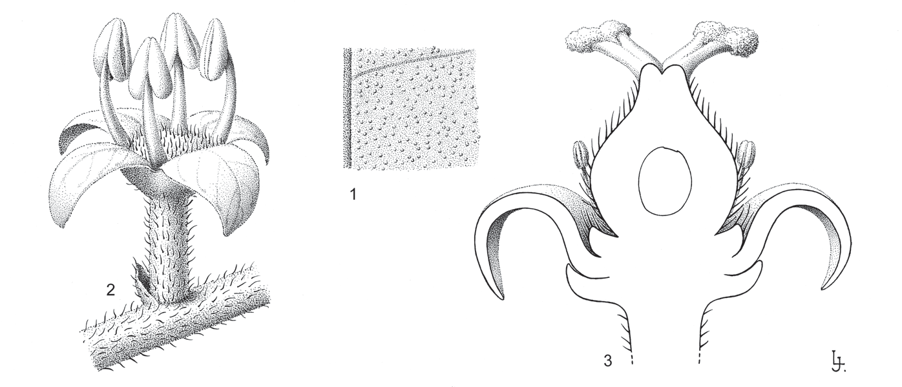
*Caption:* Planche 16 . Trichoscypha lucens : 1. Foliole, détail de la face supérieure (× 5). – 2. Fleur mâle (× 10). – 3. Fleur femelle, coupe longitudinale (× 10). (1, 3 : Pierlot 2881 ; 2 : Pierlot 2882 ). Dessin par J.M.

---

## Figure 27 (page 46)
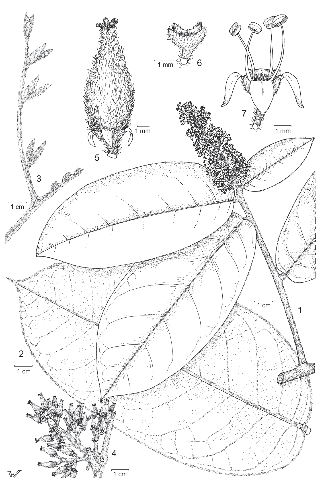
*Caption:* Planche 17 . Trichoscypha mannii : 1. Rameaux florifère à feuilles unifoliolées. – 2. Foliole, face infé- rieure. – 3. Ramille jeune. – 4. Infrutescence. – 5. Fruit jeune. – 6. Calice de la fleur mâle. – 7. Fleur mâle. (1, 6, 7 : Wieringa 1242 ; 2, 3 : Breteler et al. 9746 ; 4, 5 : Reitsma & Reitsma 1359 ). Dessin par Wil

---

## Figure 28 (page 48)
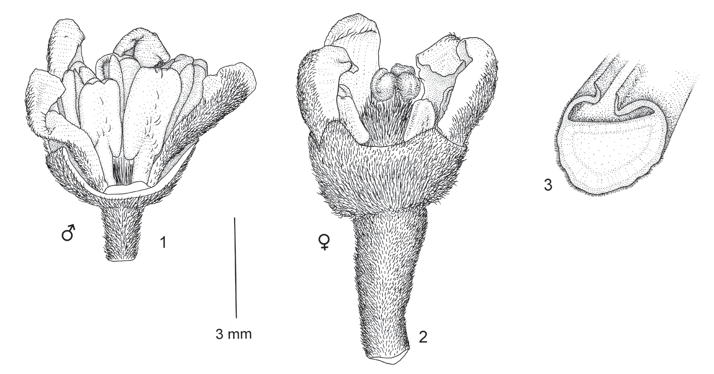
*Caption:* Planche 18 . Trichoscypha nyangensis : 1. Fleur mâle, un pétale enlevé. – 2. Fleur femelle, un pétale enlevé. – 3. Détail du pétiole. ( Le Testu 2034 ). Dessin par Hans de Vries, Jardin botanique Meise (©).

---

## Figure 29 (page 52)
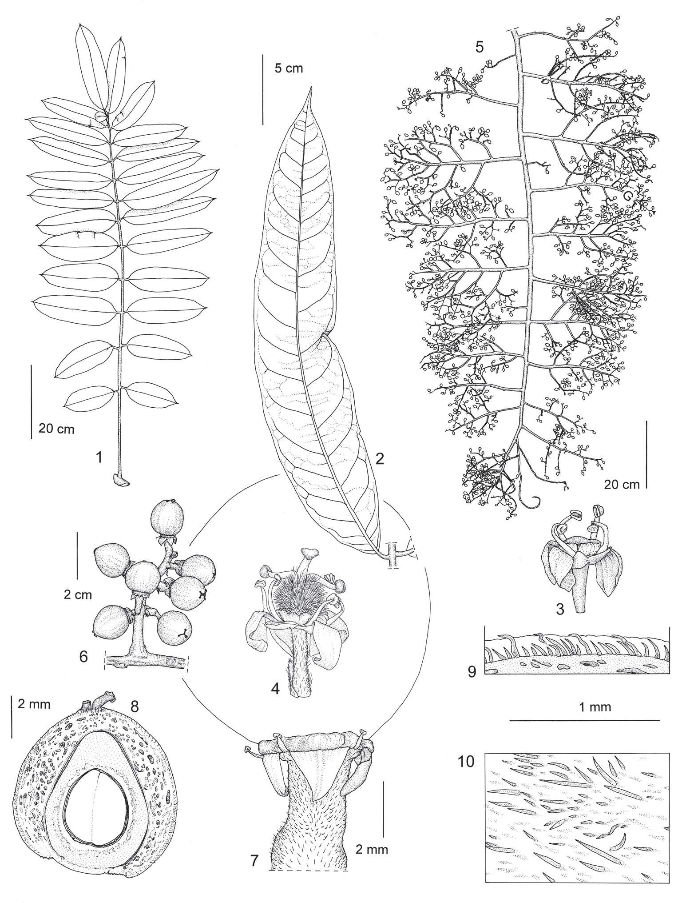
*Caption:* Planche 19 . Trichoscypha rubicunda : 1. Feuille. – 2. Foliole, face inférieure. – 3. Fleur mâle. – 4. Fleur femelle. – 5. Infrutescence jeune. – 6. Jeune fruit. – 7. Idem, montrant les vestiges de la fleur. – 8. Jeune fruit, coupe longitudinale. – 9, 10. Détail de la pilosité du fruit. (1, 2, 5–10 : Reitsma et al. 862 ; 3 : Le

---

## Figure 30 (page 54)
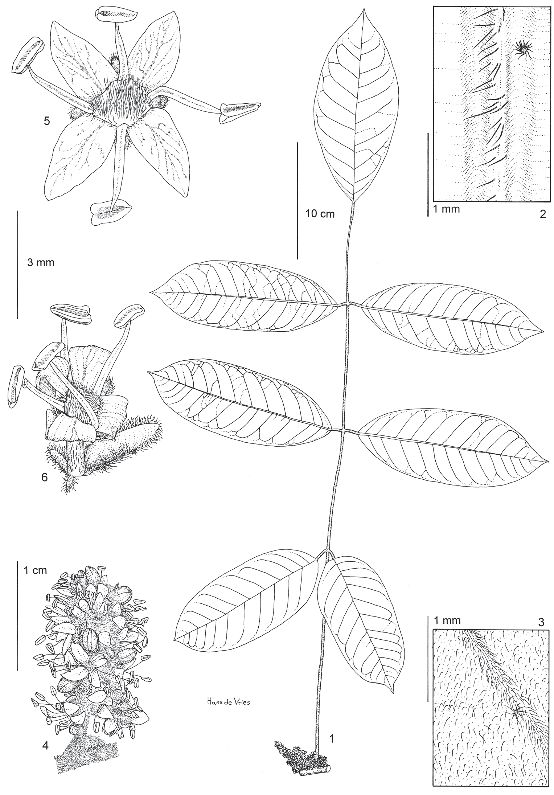
*Caption:* Planche 20 . Trichoscypha wilksii : 1. Feuille et inflorescence. – 2. Détail de la face supérieure de la feuille, nervure principale. – 3. Idem, face inférieure, nervure latérale. – 4. Partie de l’inflorescence. – 5.

---

## Figure 31 (page 55)
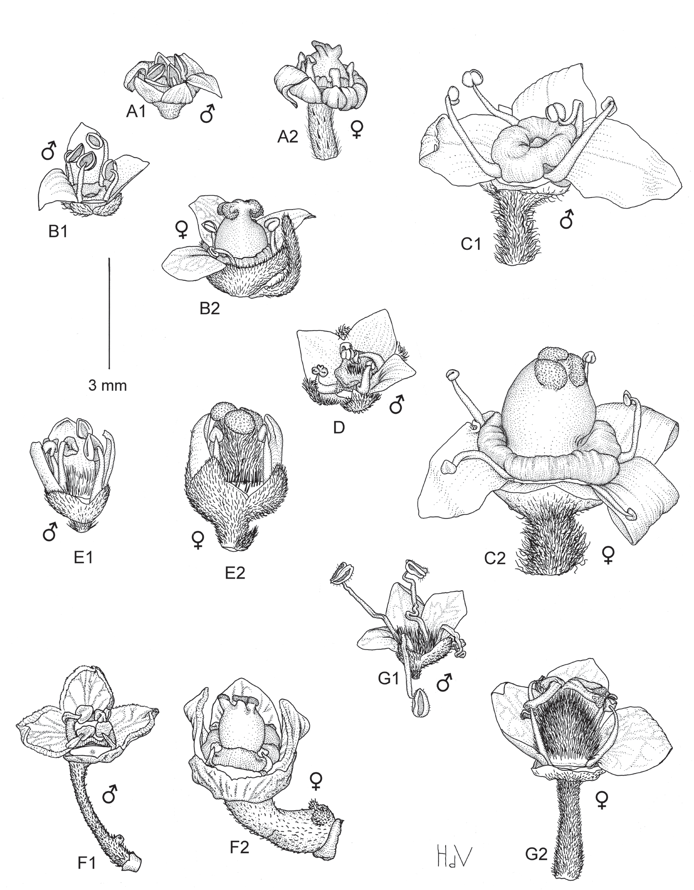
*Caption:* Planche 21 . Trichoscypha spp., fleurs mâles et femelles (sauf pour T. hallei ), souvent un pétale enlevé :

---

## Figure 32 (page 56)
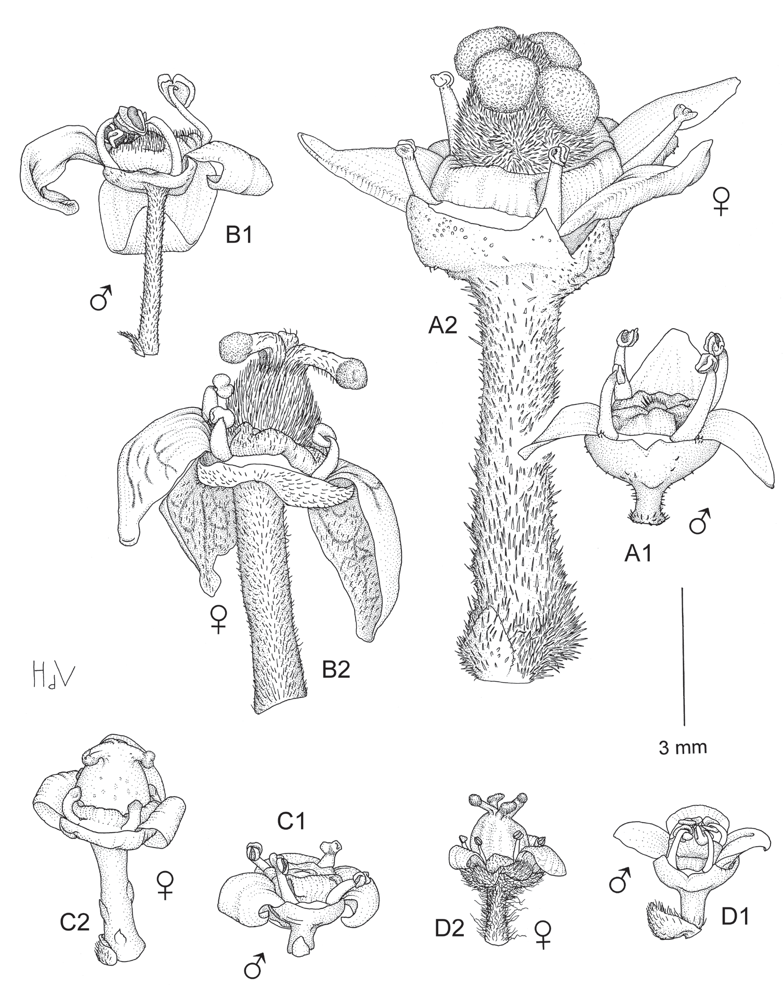
*Caption:* Planche 22 . Trichoscypha spp., fleurs mâles et femelles, un pétale enlevé : A. T. oddonii . – B. T. oliveri . – C. T. patens . – D. T. reygaertii . (A1 : J.J. de Wilde 11197 ; A2 : J.J. de Wilde 11196 ; B1 : Tchouto et al.

---
