## Figure 0 (page 2)

*Caption:* (no caption)

---

## Figure 1 (page 2)

*Caption:* (no caption)

---

## Figure 2 (page 2)

*Caption:* (no caption)

---

## Figure 3 (page 2)

*Caption:* (no caption)

---

## Figure 4 (page 2)

*Caption:* (no caption)

---

## Figure 5 (page 2)

*Caption:* (no caption)

---

## Figure 6 (page 2)
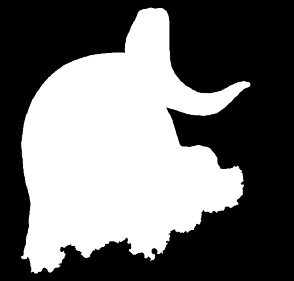
*Caption:* (no caption)

---

## Figure 7 (page 2)
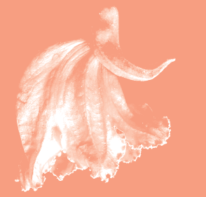
*Caption:* (no caption)

---

## Figure 8 (page 3)
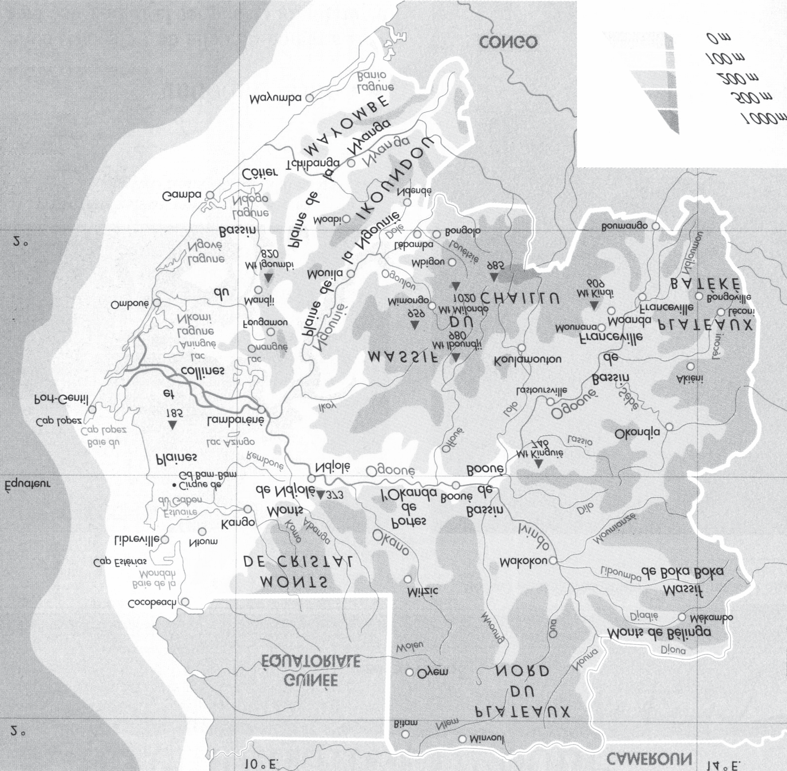
*Caption:* (no caption)

---

## Figure 9 (page 3)

*Caption:* (no caption)

---

## Figure 10 (page 3)
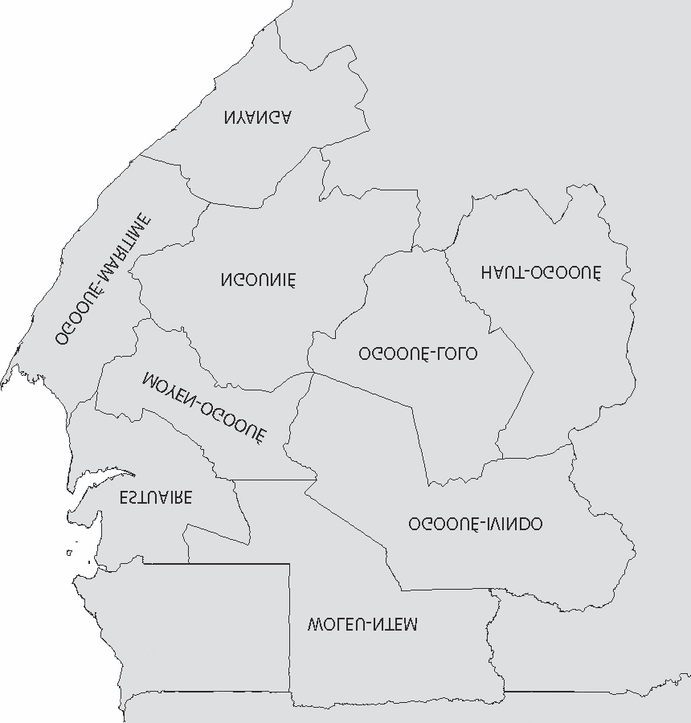
*Caption:* (no caption)

---

## Figure 11 (page 3)

*Caption:* (no caption)

---

## Figure 12 (page 3)
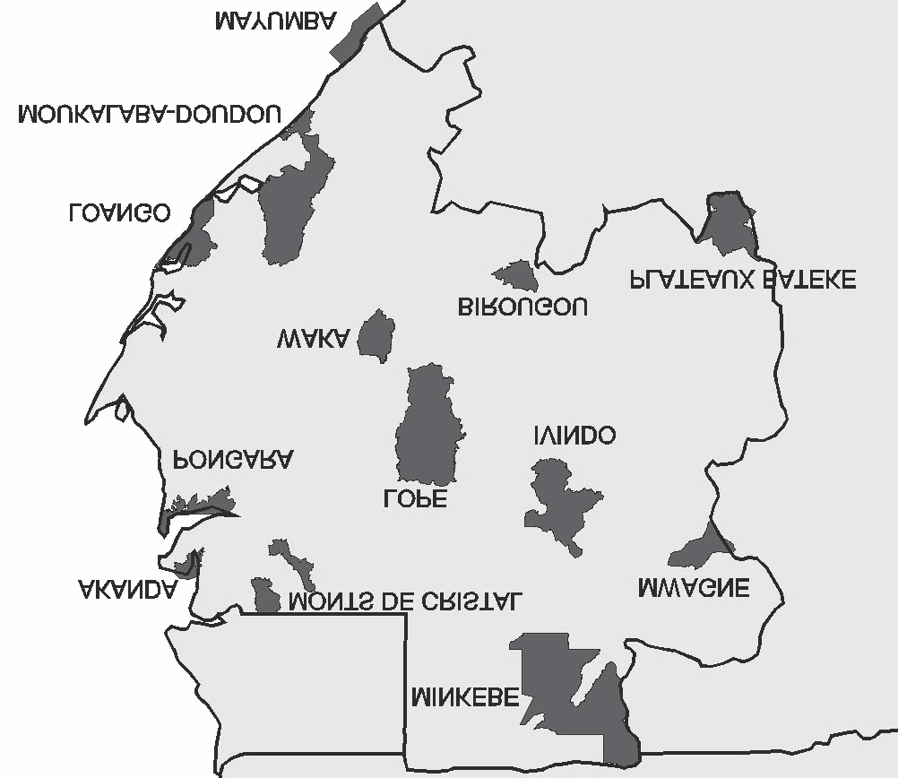
*Caption:* (no caption)

---

## Figure 13 (page 3)

*Caption:* (no caption)

---

## Figure 14 (page 4)
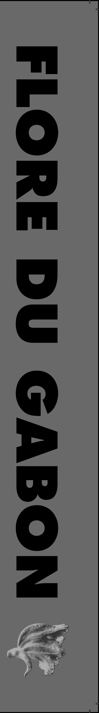
*Caption:* (no caption)

---

## Figure 15 (page 4)

*Caption:* (no caption)

---

## Figure 16 (page 4)
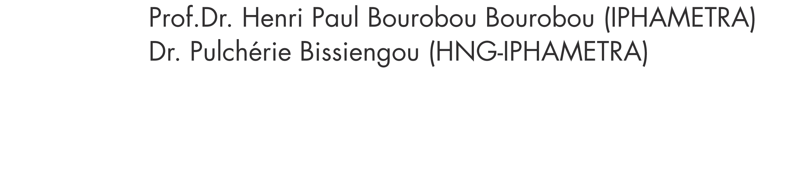
*Caption:* (no caption)

---

## Figure 17 (page 4)

*Caption:* (no caption)

---

## Figure 18 (page 4)

*Caption:* (no caption)

---

## Figure 19 (page 4)

*Caption:* (no caption)

---

## Figure 20 (page 8)
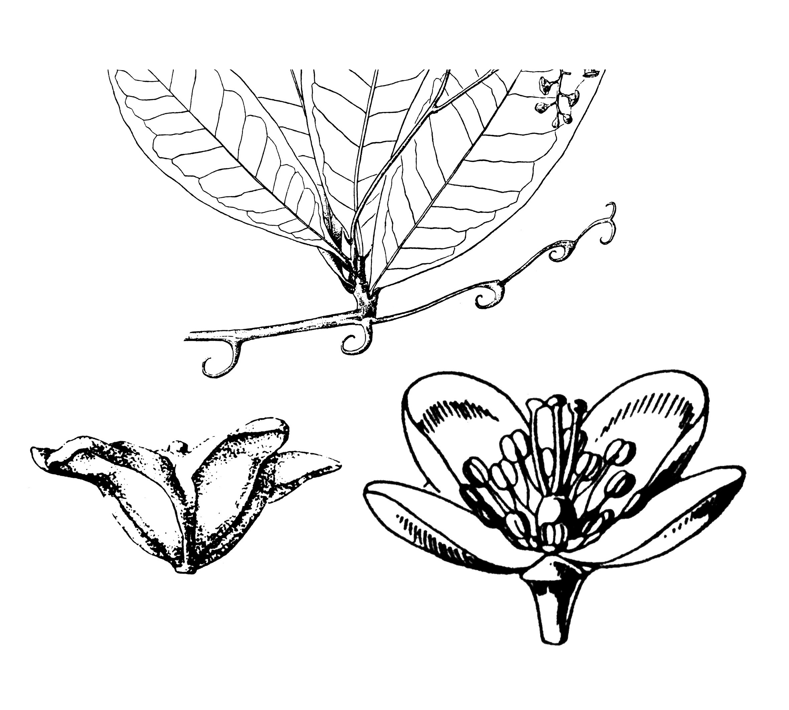
*Caption:* (no caption)

---

## Figure 21 (page 8)
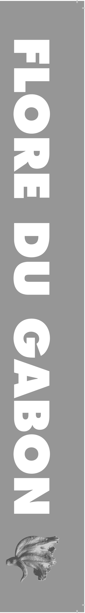
*Caption:* (no caption)

---

## Figure 22 (page 11)
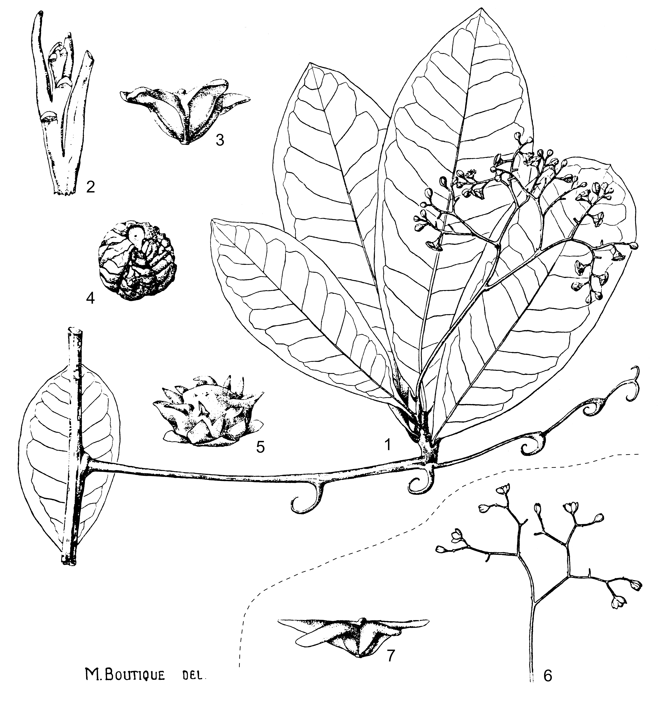
*Caption:* Planche 1 . Ancistrocladus congolensis : 1. Tige avec feuille et crochets supportant un rameau feuillé flo - rifère (× ½). – 2. Extrémité d’une jeune pousse feuillée (× 5). –3. Fruit (× 1). – 4. Graine (× 2). – 5. Galle (× 1). – Ancistrocladus ealaensis : 6. Inflorescence (× ½). – 7. Fruit (× 1). D’après Léonard 1513 (1),

---

## Figure 23 (page 12)
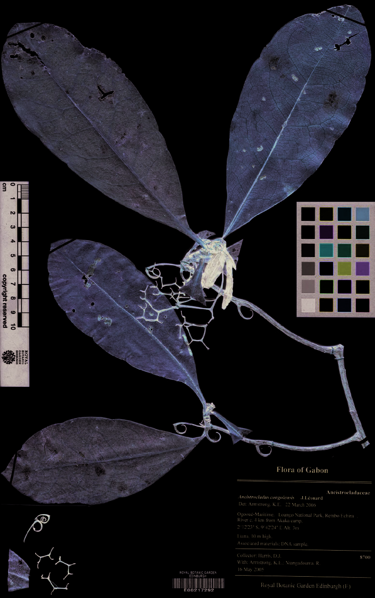
*Caption:* Figure 1 . Ancistrocladus congolensis : A. Feuilles, crochets et axes de l’inflorescence ramifiée ; B. Face supérieure du limbe foliaire, montrant les grands cratères circulaires. – Ancistrocladus ealaensis : C. Tige florifère ; D. Fleurs ; E. Fruit. Photos par David Harris (A : image numérique de l’échantillon Harris 8700 , Gabon, P.N. de Loango ; B : Harris 8531 , Gabon, P.N. de Loango) et par Ehoarn Bidault (C-E :

---

## Figure 24 (page 12)
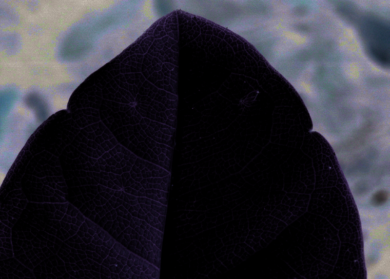
*Caption:* (no caption)

---

## Figure 25 (page 12)
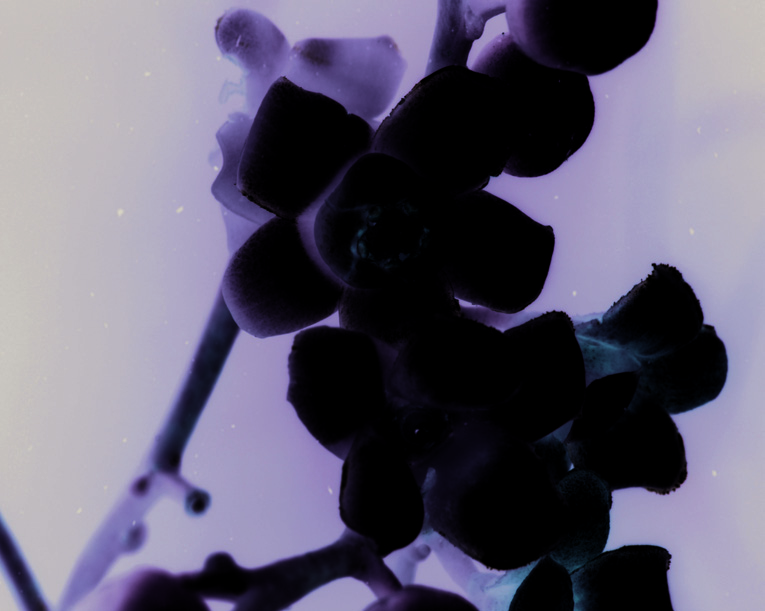
*Caption:* (no caption)

---

## Figure 26 (page 12)
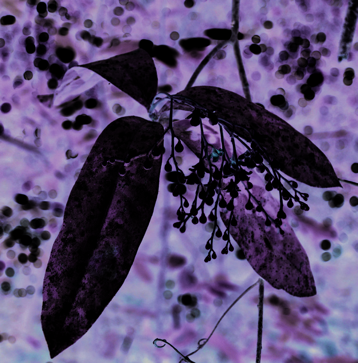
*Caption:* (no caption)

---

## Figure 27 (page 12)
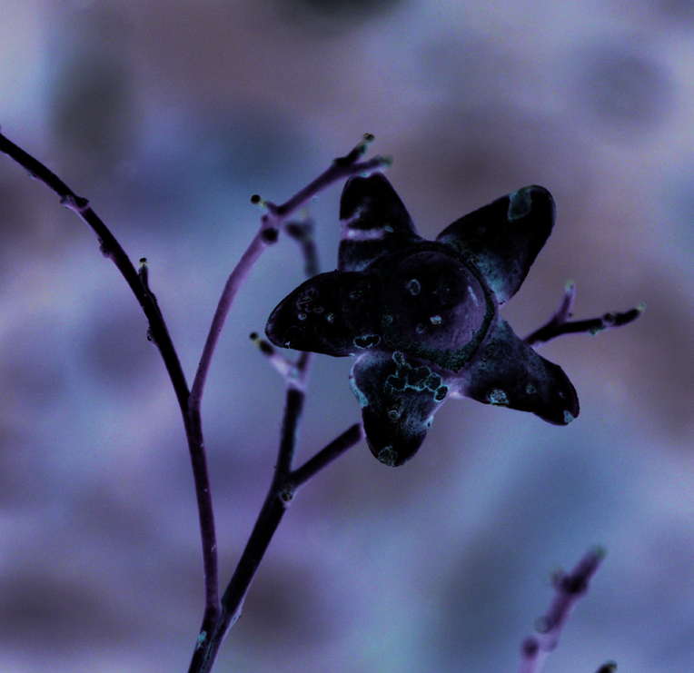
*Caption:* (no caption)

---

## Figure 28 (page 14)
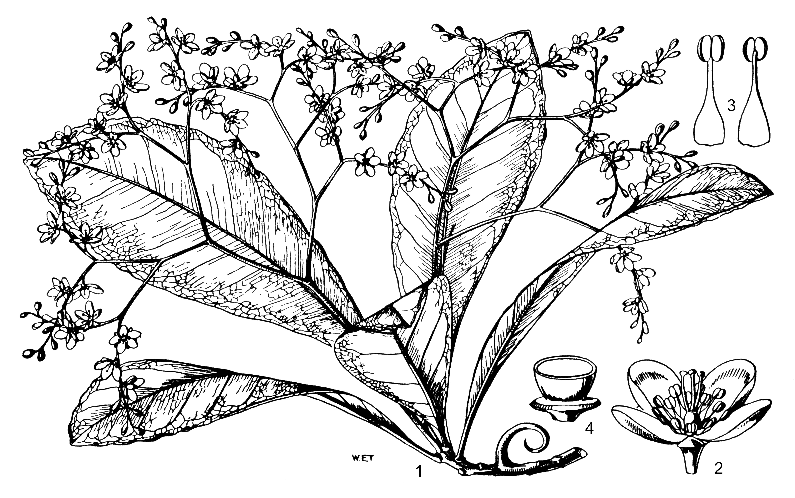
*Caption:* Planche 2 . Ancistrocladus guineensis . 1. Tige florifère. – 2. Fleur. – 3. Étamines. – 4. Ovaire, coupe transversale. Dessin par W.E. Trevithick, Royal Botanic Gardens, Kew (©), reproduit avec permission à partir de Hutchinson, Dalziel & Keay (1954).

---
