## Figure 1

![PL.3.—Toussaintia Hallei A.Le Thomas :I,rameau florifere × 2/3；2,détail de la pubescence face inferieure de_la feuille X 2；3,schema d'une inflorescence； 4,bouton，vue apicale × 4,5；5,fleur,gr.nat.；6,coupe de l'androgynophore × 4,5；7,étamines × 8;8,carpelle,et coupe × 4;9,diagramme floral;10,11, diagrammes montrant le nombre et Ia position variables des pétales (N.Hallé 4189,d'apres un sujet vivant).- T.congolensis Boutique :I2,bouton floral et bractées,gr.nat.；13, bouton floral,vue apicale × 1,5 (Wagemans 1677).- Planche extraite de Adansonia 7,1 (1967).](figures/fig_055.jpg)

*Caption:* PL.3.—Toussaintia Hallei A.Le Thomas :I,rameau florifere × 2/3；2,détail de la pubescence face inferieure de_la feuille X 2；3,schema d'une inflorescence； 4,bouton，vue apicale × 4,5；5,fleur,gr.nat.；6,coupe de l'androgynophore × 4,5；7,étamines × 8;8,carpelle,et coupe × 4;9,diagramme floral;10,11, diagrammes montrant le nombre et Ia position variables des pétales (N.Hallé 4189,d'apres un sujet vivant).- T.congolensis Boutique :I2,bouton floral et bractées,gr.nat.；13, bouton floral,vue apicale × 1,5 (Wagemans 1677).- Planche extraite de Adansonia 7,1 (1967).

---

## Figure 2

![PL.4.-- Balonga Buchholzii(Engl.et Diels）Le Thomas :I,rameau fleuri × 2/3; 2,calice et bractée × 1,5；3,pétale externe × 4,5;4, pétale interne × 1,5；5, coupe du réceptacle × 4,5;6,étamine × 10;7,grain de pollen;8,coupe longitudinale du carpelle × 8；9,diagramme floral (Zenker 4926)；10,fruit × 2/3；11, 12,méricarpe vu de profil et par-dessus gr.nat.;13,méricarpe en partie dépouillé de son péricarpe,montrant Iinsertion de la graine,gr. nat.;I4,graine gr.nat. (Klaine 2658bis)；15,coupe d'un méricarpe biséminé gr.nat.(Buchholz 403).](figures/fig_003.jpg)

*Caption:* PL.4.-- Balonga Buchholzii(Engl.et Diels）Le Thomas :I,rameau fleuri × 2/3; 2,calice et bractée × 1,5；3,pétale externe × 4,5;4, pétale interne × 1,5；5, coupe du réceptacle × 4,5;6,étamine × 10;7,grain de pollen;8,coupe longitudinale du carpelle × 8；9,diagramme floral (Zenker 4926)；10,fruit × 2/3；11, 12,méricarpe vu de profil et par-dessus gr.nat.;13,méricarpe en partie dépouillé de son péricarpe,montrant Iinsertion de la graine,gr. nat.;I4,graine gr.nat. (Klaine 2658bis)；15,coupe d'un méricarpe biséminé gr.nat.(Buchholz 403).

---

## Figure 3

*Caption:* PL.5.- Uvaria versicolor Pierre ex Engl.et Diels:1,rameau florifere × 2/3 (Le Testu 1812)；2,boutons floraux × 2/3 (Le Testu 8491)；3,coupe du réceptacle × 3;4,étamine × 6；5,carpelle et coupe × 6 (Le Testu 1812);6,fruit × 2/3; 7, graine gr.nat.(Klaine 68o).-Uvaria angolensis Welw.ex Oliver:8, rameau florifere × 2/3;9,étamine × 6；10,fruit × 2/3 (Letouzey 7486)；11,coupe d'un méricarpe × 2/3.

---

## Figure 4

*Caption:* PL.6.- Uvaria clavata Pierre ex Engl.et Diels:I,rameau fleuri × 2/3；2,bouton floral × 4,5;3,étamine × 6;4,fruit × 2/3;5,graine gr.nat.(N.Hallé et J.F. Villiers 5594).- U.heterotricha Pellegr.:6,rameau fleuri × 2/3 (Le Testu 8610); 7,detail de la pubescence,face inférieure de la feuille × 6;8,fleur,vue par-dessous X 2/3;9,étamine X 6 (Le Testu 9481).

---

## Figure 5

*Caption:* PL.7.- Uvaria muricata (Pierre) Engl.et Diels var.muricata :1, fruit × 2/3 (Klaine 55o).- var.yalingensis Tisserant :2,rameau florifere × 2/3；3,fleur, pétales enlevés × 2；4,pétales externe et interne gr.nat.；5,étamine ×6；6, carpelle et coupe × 6 (Le Testu 4647)；7,fruit × 2/3;8,coupe d'un mericarpe X 2/3；9,graine gr.nat. (Letouzey 6167).- var.suaveolens (Louis ex Boutique) Le Thomas :10, rameau florifere X 2/3 (Le Testu 8486).

---

## Figure 6

*Caption:* PL.8.- Uvaria gabonensis Engl.et Diels :1,rameau fleuri × 2/3 (Soyaux 308); 2,fruit × 2/3;3 graine × 2 (Soyaux 217).-U.Comperei Le Thomas:4,fleur X 4,5;5,étamine × 8;6,carpelle et coupe × 6(Klaine 3070)；7,feuille et fruit ×2/3;8,grainc × 2(N.Hallé 3267).-U.Poggei Engl.et Diels var.anisotricha Le Thomas:9,feuille et bouton floral × 2/3;10,pubescence de la face inférieure des feuilles X 8 (N.Hallé et A.Le Thomas 484).

---

## Figure 7

*Caption:* PL.9.-Uvaria Baumannii Engl.et Diels :I,rameau florifere X 2/3；2,pubescence de la face inférieure des feuilies × 48 (Le Testu 4421)；3,bouton floral vu pardessus × 4,5;4,5,fleur ouverte vue par-dessous et par-dessus,gr.nat.;6,étamine X 8；7,carpelle et coupe × 8 (Le Testu 8384);&,rameau fructifére × 2/3;9, coupe longitudinale d'un méricarpe × 4,5；10,graine × 2 (N.Hallé et A.Le Thomas 11).

---

## Figure 8

*Caption:* PL.40.-Uvaria Klaineana Engl.et Diels:1,rameau florifere × 2/3；2,pubescence dela face inferieure des feuilles X 6；3,bractée vue de profil et face interne × 3; 4,fleur,vue par-dessus gr.nat.;5,pétale externe gr.nat.;6,fleur,pétales et étamines enlevés × 2；7,étamine × 6;8,carpelle vu de face et de 3/4 × 6;9,fruit X 2/3；I0,coupe du méricarpe gr.nat.;I1,graine vue de face et de profil × 2 (Klaine 235).

---

## Figure 9

*Caption:* PL.41.- Uvaria Klainei Pierre ex Engl.et Diels :1,feuille × 2/3；2,poils,face inférieure de la feuille × 4； 3,bouton floral gr.nat.; 4,fleur, vue par-dessous gr. nat.;5, fleur,vue par-dessus gr.nat.; 6,pétale interne × 4,5；7,gynecee et réceptacle,étamines enlevées × 2；8,étamine × 4；9,carpelle et coupe × 4(Klaine 304)；10,fruit × 2/3；11,coupe transversale d'un méricarpe × 2/3；12,graine gr.nat.(Klaine 840).

---

## Figure 10

*Caption:* PL.12.-Uvaria lastourvillensis Pellegr.:1,rameau florifere × 2/3；2,pubescence de la face inférieure de la feuille × 4；3,étamine × 8;4,carpelle et coupe × 6 (Le Testu 8441).- U.ngounyensis Pellegr.:5,rameau florifere × 2/3；6,7, pubescence de la feuille,faces supérieure et inférieure X 4;8,étamine vue de face et de profil × 8;9,carpelle et coupe × 6 (Le Testu 6076).

---

## Figure 11

*Caption:* PL.43.-Uvaria scabrida Oliver:I,rameau florifere × 2/3；2,3,poils,face infé- rieure et supérieure de la feuille × 4;4,poil étoilé × 50 (Le Testu 9356)；5,fleur gr. nat.;6,coupe du réceptacle × 3;7, étamine × 8;8,carpelle et coupe × 12 (Pobéguin 142);9,feuille et fruit × 2/3;10,coupe du fruit × 2/3;11,graine × 4,5 (dessin in vivo N.Hallé,d'aprés N.Hallé etA.Le Thomas30).

---

## Figure 12

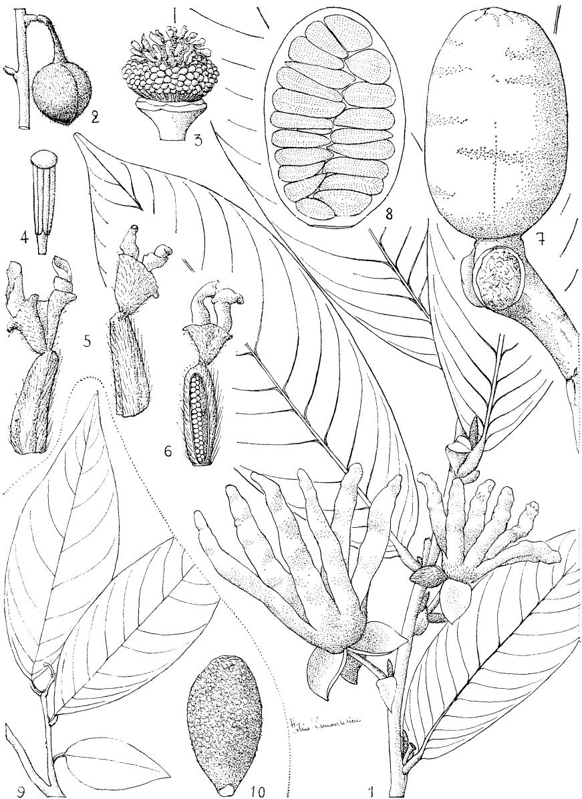

*Caption:* 

---

## Figure 13

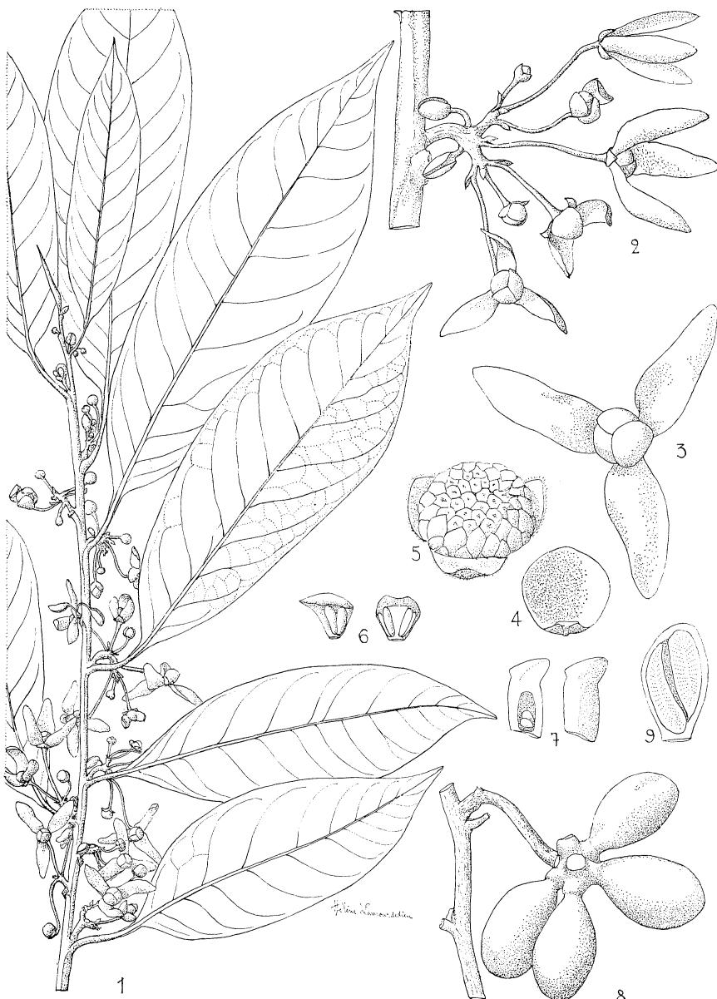

*Caption:* 

---

## Figure 14

*Caption:* PL.16.- Cleistopholis Staudtii Engl. et Diels :1,feuilles et inflorescences × 2/3; 2,fleur × 2；3,étamine × 10;4,carpelle et coupe × 40 (Letouzey 4149).- Cleistopholis patens Engl.et Diels:5,feuille et inflorescence × 2/3;6,fleur × 2; 7 étamine × 10;8,carpelle et coupe × 40 (Jacques Felix 4630);9, fruit × 2/3; 10,coupe d'une méricarpe × 2/3 (Chevalier 22379).

---

## Figure 15

*Caption:* PL.17.-Letestudoxa lanuginosa Le Thomas:1,feuilles et fleurs × 4/2；2,détail de la pilosité,face inférieure de la feuille × 4；3,fleur vue par-dessous × 4/2;4, étamine × 4;5,carpelle × 3;6,Coupe longitudinale du réceptacle;7,diagramme floral.-Letestudoxa bell Pellegrin :8,détail de la pilosité,face inférieure de la feuille × 4；9,bouton floral × 2/3 (1-7,Letestu 9320;8-9,Les Testu 8362）- Planche extraite de Adansonia 6,2 (1966).

---

## Figure 16

![PL.48.- Pachypodanthium Staudtii Engl.et Diels ：1,feuilles et inflorescences ×4/2；2,detail de la feuille,face inferieure × 4;3,bouton floral × 2/3;4,carpelle X 8 (Letouzey 4438);5,fruit × 2/3;6,coupe du fruit X 2/3 (Chevalier 46224).- Pachypodanthium confine Engl.et Diels:7,feuille et inflorescence × 4/2；8, détail de la feuille,face inférieure X 4 (Le Testu 1774)；9,bouton floral × 2/3; 10,bouton floral,sépales enleves × 2/3;I1,pétale externe × 2;12,pétale interne × 2;13,étamine × 40;14,carpelle × 8(Klaine 217)；15,coupe du fruit × 2/3 (Lecomte s.no);16,graine × 1,5 (Klaine 217).](figures/fig_024.jpg)

*Caption:* PL.48.- Pachypodanthium Staudtii Engl.et Diels ：1,feuilles et inflorescences ×4/2；2,detail de la feuille,face inferieure × 4;3,bouton floral × 2/3;4,carpelle X 8 (Letouzey 4438);5,fruit × 2/3;6,coupe du fruit X 2/3 (Chevalier 46224).- Pachypodanthium confine Engl.et Diels:7,feuille et inflorescence × 4/2；8, détail de la feuille,face inférieure X 4 (Le Testu 1774)；9,bouton floral × 2/3; 10,bouton floral,sépales enleves × 2/3;I1,pétale externe × 2;12,pétale interne × 2;13,étamine × 40;14,carpelle × 8(Klaine 217)；15,coupe du fruit × 2/3 (Lecomte s.no);16,graine × 1,5 (Klaine 217).

---

## Figure 17

*Caption:* PL.49.-- Piptostigma calophyllum Mildbr.et Diels :I,sommet de la feuille × 2/3; 2,base de la feuille × 2/3；3,détail de la pubescence,face inférieure de la feuille × 4；4,disposition des bractées sur les pédoncules de I'inflorescence gr. nat.；5,inflorescence gr.nat.；6,fleur，vue par-dessus × 2；7,coupe du receptacle × 4;8,étamine × 10；9,carpelle et coupe × 8 (N.Halle 2263).

---

## Figure 18

*Caption:* PL.20.—Piptostigma pilosum Oliver (Le Testu 8465):1,feuille × 2/3；2,inflorescence × 2/3;3,fleur gr.nat.;4,pistil et gynécée × 2;5,étamine× 6;6,carpelle et coupe × 6.- Piptostigma glabrescens Oliver (Letouzey 4167）:7,feuille X 2/3:8,inflorescence X 2/3;9,fleur gr.nat.;10,pistil et gynecee × 2.

---

## Figure 19

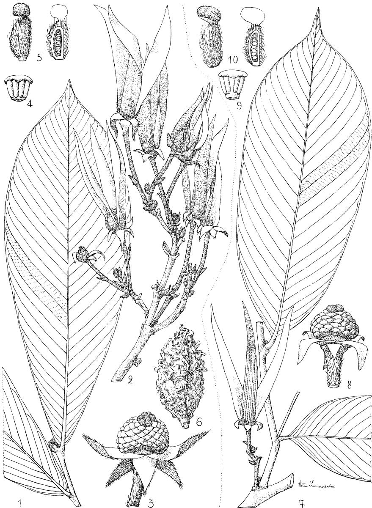

*Caption:* 

---

## Figure 20

*Caption:* PL.22.-Piptostigma fasciculata (De Wild.） Boutique：1,feuille et inflorescences ×2/3 (Aubréville 45o0)；2,fleur vue de dessous× 2；3,fleur vue par-dessous X2;4,fleur,pétales enleves ×4;5,coupe du receptacle × 4;6,étamine × 6; 7,carpelle et coupe × 6 (N.Hallé 3466);8,fruit × 2/3 (Germain 2396).

---

## Figure 21

*Caption:* PL.23.- Artabotrys Pierreanus Engl.et Diels :1,feuille et fleur × 2/3; 2,pétale externe gr.nat.；3,pétale interne gr.nat；4，fleur，pétales enlevés × 3；5,étamine × 6;6,carpelle × 12 (Klaine 3425)； 7,méricarpe gr. nat.(Klaine 3231).- Artabotrys rufus De Wild.:8,feuilles et fleur × 2/3；9, fleur,un pétale externe enlevé × 2；I0,pétale externe × 2；11,pétale interne × 2;12,fleur,pétales enlevés × 3；13,étamine × 40；I4,carpelle et coupe × 8 (N.Hallé 3193);15,fruit gr.nat.(N.Hallé 3582).

---

## Figure 22

![PL.24.- Artabotrys Le-Testui Pellegrin (Le Testu 9449):1,feuille et inflorescence × 2/3；2,détail de la feuille,face inférieure × 2;3,fleur,un pétale externe enlevé X 2;4,pétale externe × 3;5,pétale interne × 3;6,fleur,pétales enlevés × 3; 7,étamine × 12；8,carpelle × 8.- Artabotrys lastoursvillensis Pellegrin (Le Testu 8678):9,feuille et inflorescence × 2/3；I0,fleur,un pétale externe enlevé ×2；I1,pétale externe × 3；12,pétale interne × 3;13,étamine face externe et profil × 10;14,carpelle et coupe × 8.](figures/fig_026.jpg)

*Caption:* PL.24.- Artabotrys Le-Testui Pellegrin (Le Testu 9449):1,feuille et inflorescence × 2/3；2,détail de la feuille,face inférieure × 2;3,fleur,un pétale externe enlevé X 2;4,pétale externe × 3;5,pétale interne × 3;6,fleur,pétales enlevés × 3; 7,étamine × 12；8,carpelle × 8.- Artabotrys lastoursvillensis Pellegrin (Le Testu 8678):9,feuille et inflorescence × 2/3；I0,fleur,un pétale externe enlevé ×2；I1,pétale externe × 3；12,pétale interne × 3;13,étamine face externe et profil × 10;14,carpelle et coupe × 8.

---

## Figure 23

![PL.25.- Artabotrys rhopalocarpus Le Thomas :1, feuille et inflorescence × 2/3; 2,sépale,face externe et interne X4,5；3,pétale externe,face externe et interne X 1,5;4,un pétale externe et deux pétales internes gr.nat.montrant la disposition et la soudure des uns par rapport aux autres;5,pétale interne,face externe et interne × 1,5;6,étamine × 4 (Tisserant 2242)；7,fruit × 2/3;8,coupe longitudinale d'un méricarpe × 2/3 (N.Hallé 3751;d'apres un dessin de N.Hallé) —Planche extraite de Adansonia 6,4 (1966).](figures/fig_060.jpg)

*Caption:* PL.25.- Artabotrys rhopalocarpus Le Thomas :1, feuille et inflorescence × 2/3; 2,sépale,face externe et interne X4,5；3,pétale externe,face externe et interne X 1,5;4,un pétale externe et deux pétales internes gr.nat.montrant la disposition et la soudure des uns par rapport aux autres;5,pétale interne,face externe et interne × 1,5;6,étamine × 4 (Tisserant 2242)；7,fruit × 2/3;8,coupe longitudinale d'un méricarpe × 2/3 (N.Hallé 3751;d'apres un dessin de N.Hallé) —Planche extraite de Adansonia 6,4 (1966).

---

## Figure 24

![PL.26.- Artabotrys aurantiacus Engl.et Diels :1,feuille et inflorescence × 2/3; 2,3,pétales externe et interne × 1,5；4,fleur,tous les petales enleves × 4；5, étamine × 8；6,carpelle et coupe × 10 (Le Testu 8499)；7,fruit gr.nat.(Le Testu 443o,R.C.A.).- A.aurantiacus var.multiflorus Pellgr.ex Le Thomas (Le Testu 7116) :8,inflorescence × 2/3.— Artabotrys insignis Engl.et Diels : 9,feuille et fleur × 2/3;I0,11,pétales externe et interne ×1,5;12,fleur,pétales externes enleves gr.nat.;13,étamine × 8；I4,carpelle et coupe × 8 (Le Testu 8674)；15,fruit × 2/3 (Breteler 2956).](figures/fig_071.jpg)

*Caption:* PL.26.- Artabotrys aurantiacus Engl.et Diels :1,feuille et inflorescence × 2/3; 2,3,pétales externe et interne × 1,5；4,fleur,tous les petales enleves × 4；5, étamine × 8；6,carpelle et coupe × 10 (Le Testu 8499)；7,fruit gr.nat.(Le Testu 443o,R.C.A.).- A.aurantiacus var.multiflorus Pellgr.ex Le Thomas (Le Testu 7116) :8,inflorescence × 2/3.— Artabotrys insignis Engl.et Diels : 9,feuille et fleur × 2/3;I0,11,pétales externe et interne ×1,5;12,fleur,pétales externes enleves gr.nat.;13,étamine × 8；I4,carpelle et coupe × 8 (Le Testu 8674)；15,fruit × 2/3 (Breteler 2956).

---

## Figure 25

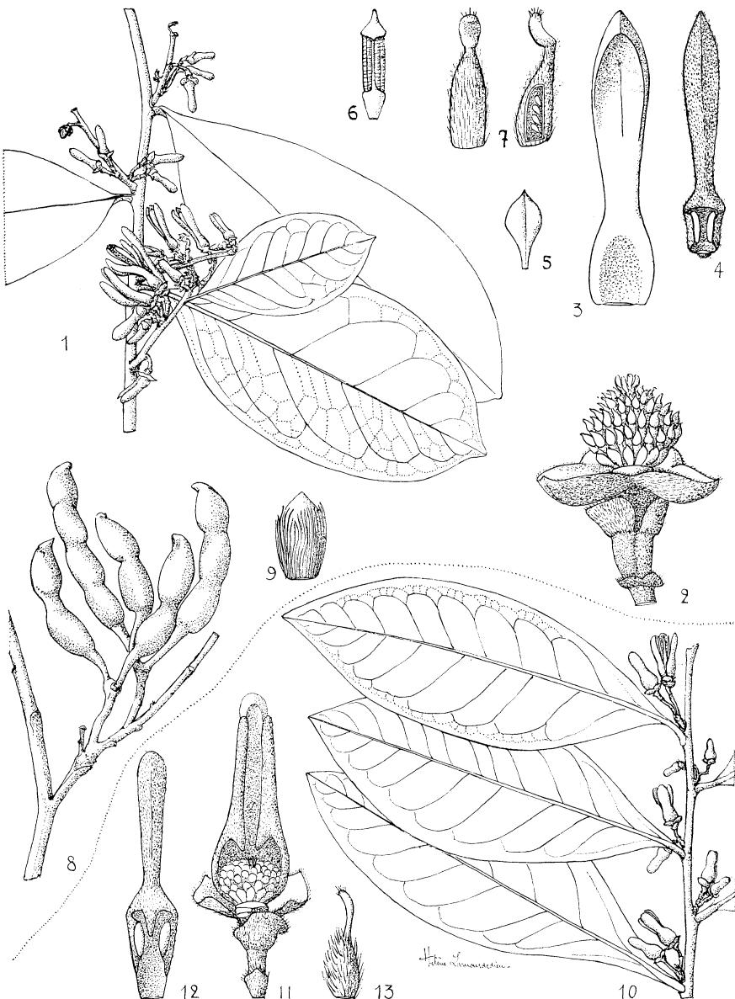

*Caption:* 

---

## Figure 26

*Caption:* PL.28.-Xylopia rubescens Oliver:I,rameau florifere × 2/3;2,fleur,pétales externes enlevés × 3；3,androcée et gynécée × 3；4,pétale externe × 3；5,pétale interne,faces externe et interne × 3;6,étamine ×6；7,staminode externe × 6; 8,carpelle et coupe × 6 (Le Testu 9019)；9,fruit × 2/3 (Aubréville 1511).- X.rubescens var.Klaineana Pellegr.:Io,detail de la nervation des feuilles,face inférieure × 4,5；11,méricarpe × 2/3；12,graine gr.nat.;13,corps constituant P'arille × 8 (Klaine 1327).

---

## Figure 27

*Caption:* PL.29.- Xylopia Staudtii Engl. et Diels :1,rameau florifere X 2/3 (Letouzey 5404)；2,bouton floral × 2；3,fleur,pétales enleves × 4；4,pétale externe 2; 5,pétale interne × 2；6,étamine × 8；7,staminode externe × 8;8,staminode interne × 8;9,carpelle et coupe × 6 (Le Testu 9287)；10,fruit × 2/3；11, graine × 4,5；12,corps constituant 'argile × 6 (Aubréville 4941).

---

## Figure 28

*Caption:* PL.30.-Xylopia ethiopicaA.Rich.:1,rameau florifere × 2/3；2,3,petales externe et interne gr.nat.;4,fleur,pétales enlevés × 4;5,étamine × 10;6,7,staminodes externe et interne × 10;8,carpelle et coupe de l'ovaire X 8 (Le Testu 7960); 9,fruit × 2/3(d'apres photo N.Hallé,N.H.et A.Le Thomas 581)；I0,graine × 1,5.

---

## Figure 29

*Caption:* PL.31.- Xylopia parviflora (A.Rich.) Benth.:1,rameau florifere × 2/3 2, fleur, pétales enleves × 3；3,4,pétales externe et interne ×4,5;(Pobéguin 48)；5,fruit et coupe × 2/3 (Chevalier 28389).-Xylopia acutiflora (Dunal) A.Rich. :6, rameau florifere × 2/3；7,fleur,pétales enlevés × 3；8,9,pétales externe et interne × 4,5 (Bates 1&52);10,fruit × 2/3 (Le Testu 1179).

---

## Figure 30

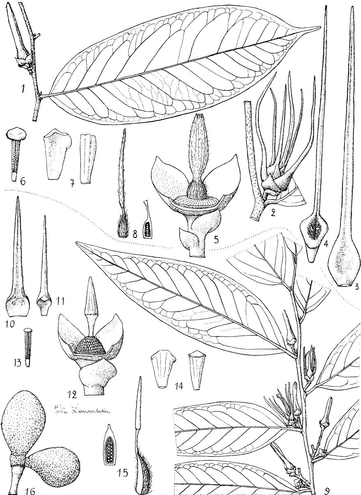

*Caption:* 

---

## Figure 31

![PL.33.-Xylopia Le-TestuiPellegr.:1,rameau florifere × 2/3;2,poils,face inférieure delafeuille ×8；3,4,pétales externe et interne,face interne ×2；5,fleur,pétales enlevés× 3;6,réceptable,étamines enlevées× 3;7,étamine×8;8,staminodes externe et interne × 8;9,carpelle,et coupe de lovaire × 8 (Le Testu 5975).- X.Le-Testui var.longepilosa Le Thomas:Io,rameau florifére et bourgeon terminal ×2/3；1I,poils,face inférieure de la feuille × 4(N.Hallé et A Le Thomas 422). - X.Pynaertii De Wild.:12, feuilles × 2/3；13,poils,face inférieure de la feuille × 4；14,fruit × 2/3；15,coupe d'un méricarpe × 2/3;16,graine × 2/3 (A.Le Thomas 23).](figures/fig_046.jpg)

*Caption:* PL.33.-Xylopia Le-TestuiPellegr.:1,rameau florifere × 2/3;2,poils,face inférieure delafeuille ×8；3,4,pétales externe et interne,face interne ×2；5,fleur,pétales enlevés× 3;6,réceptable,étamines enlevées× 3;7,étamine×8;8,staminodes externe et interne × 8;9,carpelle,et coupe de lovaire × 8 (Le Testu 5975).- X.Le-Testui var.longepilosa Le Thomas:Io,rameau florifére et bourgeon terminal ×2/3；1I,poils,face inférieure de la feuille × 4(N.Hallé et A Le Thomas 422). - X.Pynaertii De Wild.:12, feuilles × 2/3；13,poils,face inférieure de la feuille × 4；14,fruit × 2/3；15,coupe d'un méricarpe × 2/3;16,graine × 2/3 (A.Le Thomas 23).

---

## Figure 32

*Caption:* PL.34.- Xylopia hypolampra Mildbr.:I,rameau florifere × 2/3；2,pubescence de la feuille,fac inférieure × 2；3,fleur × 4,5;4,fleur,pétales enleves × 6；5, pétale externe × 1,5;6,pétale interne × 1,5；7,étamine × 10;8,9,staminodes externe et interne × 10；I0,I1,carpelle et coupe × 10;(Le Testu 8094)；12, fruit × 2/3；13,coupe du méricarpe × 2/3;14,graine × 1,5 (Tisserant 4385).

---

## Figure 33

*Caption:* PL. 35.—Neostenanthera myristicifolia (Oliver) Excell :1,rameau florifere × 2/3; 2,3,pétales externe et interne,gr.nat.;4,fleur,pétales enleves × 2；5,étamine X 6;6,carpelle et coupe × 6;7,fruit × 2/3;8,coupe d'un méricarpe,gr. nat. (N.Hallé et A.Le Thomas 382).

---

## Figure 34

*Caption:* PL.36.-Neostenanthera gabonensis (E.et Diels) Excell :I,rameau florifere × 2/3; 2,pétale externe × 2；3, fleur debarrassée des pétales externes × 2；4,pétale interne,faces externe et interne × 3;5,étamine × 6;6,carpelle × 6；7, fruit ×2/3(N.Hallé et J.F.Villiers 4799).— Neostenanthera Robsonii Le Thomas : 8,feuille × 2/3;9,pubescence,face inférieure de la feuille × 3；10,fruits × 2/3 (N.Hallé et Cours 6094).

---

## Figure 35

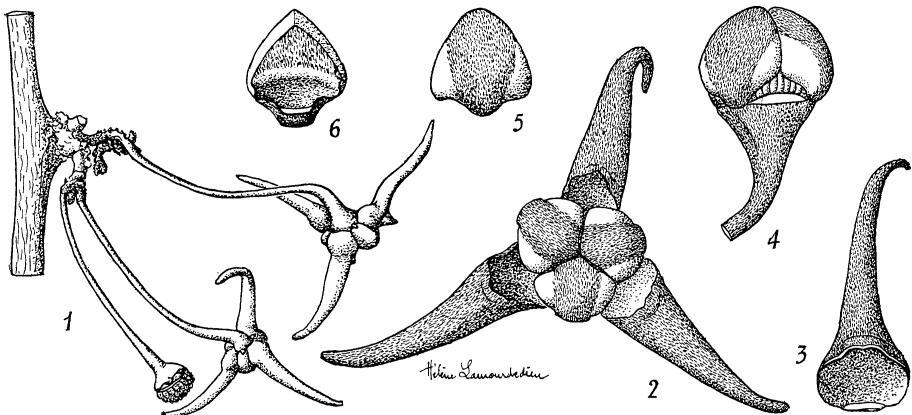

*Caption:* 

---

## Figure 36

*Caption:* PL.37.-Polyalthia suaveolens Engl.et Diels :1,rameau florifere × 2/3；2,bouton floral × 3;3,fleur× 2;4,petale externe ×2；5,fleur,pétales elevés × 6; 6,étamine ×6 (Le Testu 9408)；7,fleur ,pétales enlevés × 6;8,carpelle et coupe × 8 (Gilbert 936);9,fruits × 2/3;I0,coupe d'un méricarpe gr.nat.,11,12, graines gr.nat.(Letouzey 5322).

---

## Figure 37

![PL.38.- Popowia cauliflora Chipp (Lebrun 6134） :1,feuille et inflorescence × 2/3;2,3,pétales externe et interne × 6；4,fleur ,petales enleves ×8；5, étamine,face externe et profil × 10.- Popowia diclina Sprague emend.Chipp ： 6,feuilles et inflorescences×2/3;7,fleur,un pétale externe enlevé × 6;8,pétaie interne × 8;9,étamine × 10;10,staminode ×10(Klaine 2881)；11,12,pétales externe et interne de la fleur  × 6；I3,carpelle et coupe × 8 (Klaine 4382); 14,fruits X 2/3(Klaine 404).-Popowia glomerulata Le Thomas (Le Testu 8700): 15,inflorescence gr.nat.；I6,fleur ,un pétale enlevé × 4；17,I8,petales externe et interne × 4;I9,carpelle et coupe × 8.](figures/fig_044.jpg)

*Caption:* PL.38.- Popowia cauliflora Chipp (Lebrun 6134） :1,feuille et inflorescence × 2/3;2,3,pétales externe et interne × 6；4,fleur ,petales enleves ×8；5, étamine,face externe et profil × 10.- Popowia diclina Sprague emend.Chipp ： 6,feuilles et inflorescences×2/3;7,fleur,un pétale externe enlevé × 6;8,pétaie interne × 8;9,étamine × 10;10,staminode ×10(Klaine 2881)；11,12,pétales externe et interne de la fleur  × 6；I3,carpelle et coupe × 8 (Klaine 4382); 14,fruits X 2/3(Klaine 404).-Popowia glomerulata Le Thomas (Le Testu 8700): 15,inflorescence gr.nat.；I6,fleur ,un pétale enlevé × 4；17,I8,petales externe et interne × 4;I9,carpelle et coupe × 8.

---

## Figure 38

*Caption:* PL.39.-Popowia Klainii Pierre ex Engl.et Diels :1,feuills × 2/3；2,bouton floral vu par-dessus × 4；3,4,pétales externe et interne × 4；5,fleur,pétales enleves×6;6,étamine × 10;7,staminode× 10;8,carpelle et coupe×8(Klaine 2662);9,fruits × 2/3(Klaine 1539).-Popowia congensis (Engl.et Diels )Engl.et Diels(Le Testu 4512）:I0,rameau florifere × 2/3；II,12,pétales externe et interne × 4；13,bractée et fleur,pétales enlevés × 6；14,étamine × 10；15, carpelle et coupe × 6.

---

## Figure 39

![PL.— 40.Popowia littoralis Bagshawe et Bak.f.:1,inflorescence × 1；2,étamine × 8；3,carpelle × 8 (Koechlin 671)；4,rameau fructifére × 2/3 (Thollon 938). -P.lucidula Engl.et Diels :5,inflorescence X 1;6,bouton floral vu par-dessous, sépales enlevés × 3;7,bouton floral,vu par-dessus × 3;8,étamine × 8;9,carpelle × 8 (Bouquet 792);10,rameau fructifere X 2/3 (Hallé 3539).-P.ferruginea (Oliv.）Engl.et Diels:11,rameau florifere ×1;12,bouton floral × 3；13,fleur épanouie,vue deface×3;14,étamine×8;15,carpelle×8;16,rameau fructifére X2/3;17,coupe du fruit × 4(d'apres Hallé 3081 et 3103,in vivo).](figures/fig_058.jpg)

*Caption:* PL.— 40.Popowia littoralis Bagshawe et Bak.f.:1,inflorescence × 1；2,étamine × 8；3,carpelle × 8 (Koechlin 671)；4,rameau fructifére × 2/3 (Thollon 938). -P.lucidula Engl.et Diels :5,inflorescence X 1;6,bouton floral vu par-dessous, sépales enlevés × 3;7,bouton floral,vu par-dessus × 3;8,étamine × 8;9,carpelle × 8 (Bouquet 792);10,rameau fructifere X 2/3 (Hallé 3539).-P.ferruginea (Oliv.）Engl.et Diels:11,rameau florifere ×1;12,bouton floral × 3；13,fleur épanouie,vue deface×3;14,étamine×8;15,carpelle×8;16,rameau fructifére X2/3;17,coupe du fruit × 4(d'apres Hallé 3081 et 3103,in vivo).

---

## Figure 40

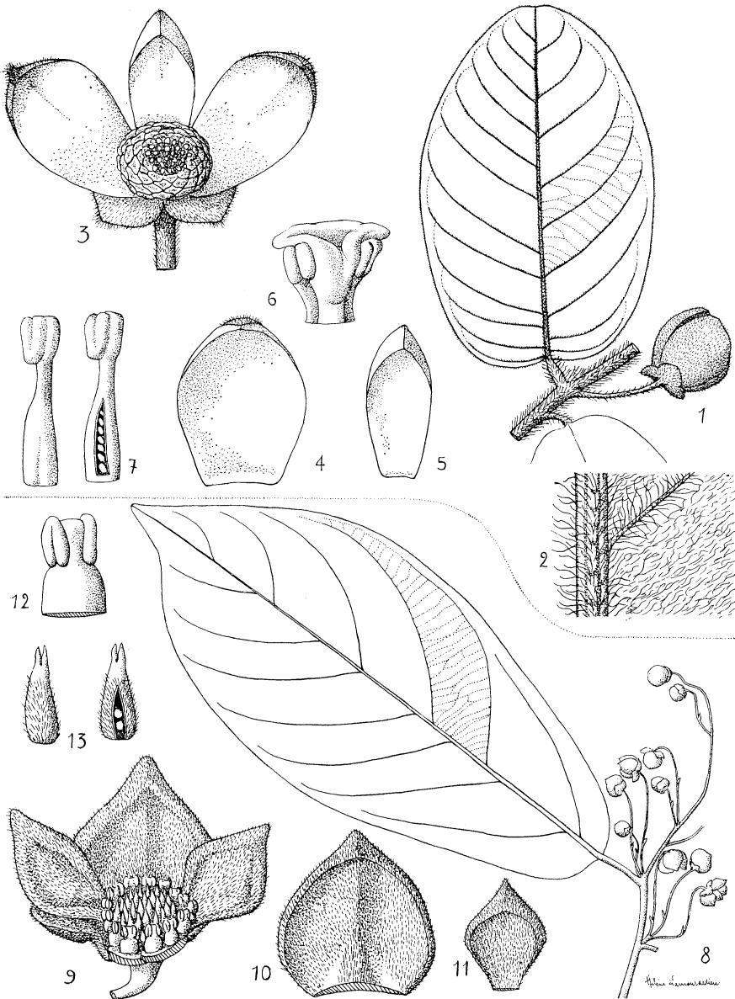

*Caption:* 

---

## Figure 41

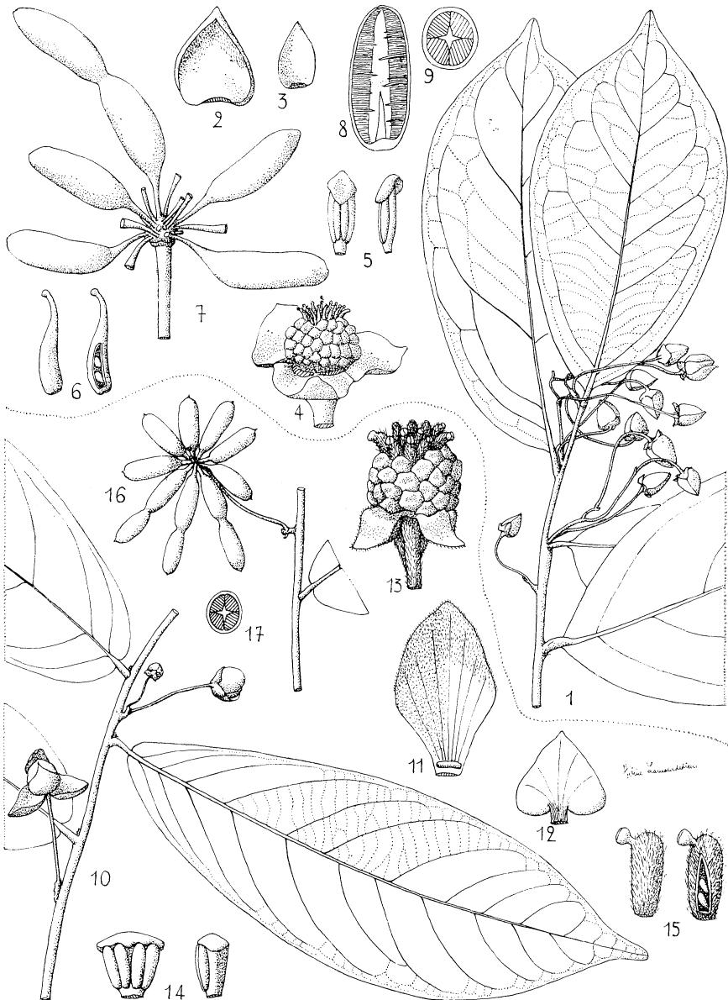

*Caption:* 

---

## Figure 42

*Caption:* PL 43.-Friesodielsia Enghiana (Diels) Verdc.:1,feuilles et fruit × 2/3 (Sillans, 1701)；2,detail de la feuille,face inférieure × 2；3,inflorescence gr.nat.;4,5 pétales externe et interne gr.nat.;6,fleur,tous les pétales enleves × 4；7,étamine X6：8,carpelle et coupe × 6 (Tisserant 4941)；9,I0,coupes longitudinale et transversale du fruit × 2 (Sillans 4701).

---

## Figure 43

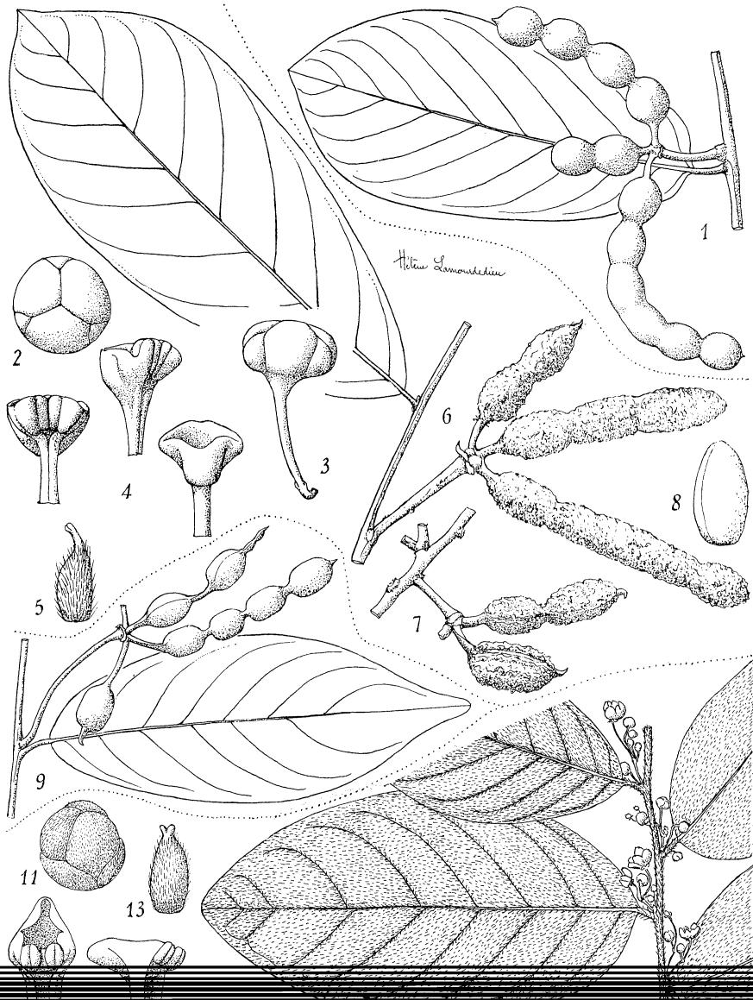

*Caption:* 

---

## Figure 44

*Caption:* PL.45.-Monanthotaxis congoensis Baillon (Thollon 813):1,feuille et inflorescence X 2/3；2,pétale,face externe et interne × 8;3,fleur,3 pétales enleves × 8;4, étamine × 44;5,staminode × 14;6,carpelle et coupe × 14;7,coupe du fruit × 2. -Monanthotaxis Le-Testui Pellegrin (Le Testu 7845)；8, rameau florifere × 2/3; 9,fleur,3 pétales enleves × 4；10,pétale,face interne × 4；11,étamine × 8; 12,carpelle et coupe × 8.

---

## Figure 45

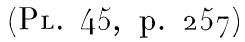

*Caption:* 

---

## Figure 46

![PL.46.- Monanthotaxis Le-Testui Pellegrin var.Hallei Le Thomas:I,feuille et inflorescence X 2/3；2,face inférieure du limbe × 3；3,fleur vue par-dessous × 4; 4,fleur normale vue par-dessus × 4；5,fleur a 4 sepales et 8 pétales vue par-dessus ×4;6,fleur,1 sépale et 1 pétale enlevés × 6:7,8,pétale de profil et face interne × 6;9,ensemble des étamines et des carpelles vus par-dessus × 8；10 a 13,étamine,face externe,profil,et face interne 20；I4,carpelle × 20；15,coupe du carpelle × 20；16,fruit × 2/3;17,18,graine × 3；19,coupe transversale du méricarpe × 4.-1,2,6,a8,10,a 12,15,N.Hallé 3508,sur le sec；3 a 5,9,13,14,16,a 19,N.Hallé sur le vivant.](figures/fig_030.jpg)

*Caption:* PL.46.- Monanthotaxis Le-Testui Pellegrin var.Hallei Le Thomas:I,feuille et inflorescence X 2/3；2,face inférieure du limbe × 3；3,fleur vue par-dessous × 4; 4,fleur normale vue par-dessus × 4；5,fleur a 4 sepales et 8 pétales vue par-dessus ×4;6,fleur,1 sépale et 1 pétale enlevés × 6:7,8,pétale de profil et face interne × 6;9,ensemble des étamines et des carpelles vus par-dessus × 8；10 a 13,étamine,face externe,profil,et face interne 20；I4,carpelle × 20；15,coupe du carpelle × 20；16,fruit × 2/3;17,18,graine × 3；19,coupe transversale du méricarpe × 4.-1,2,6,a8,10,a 12,15,N.Hallé 3508,sur le sec；3 a 5,9,13,14,16,a 19,N.Hallé sur le vivant.

---

## Figure 47

*Caption:* PL.47.- Exelia scammopetala (Excell） Boutique ：I,rameau florifere × 2/3; 2,bouton floral,vu par-dessus et par-dessous × 3；3,fleur ouverte,vue par-dessus X3；4,5,pétales externe et interne,face externe et face interne X 3;6,fleur, pétales enleves × 3；7,étamines × 6;8,carpelle et coupe × 4;9,diagramme floral (N.Hallé et A.Le Thomas 463)；10,fruit gr.nat.(Donis 2386)；1I,coupe longitudinale du méricarpe × 2/3 (Flamigny 6371)；I2,graine × 2/3 (Evrard 2004).

---

## Figure 48

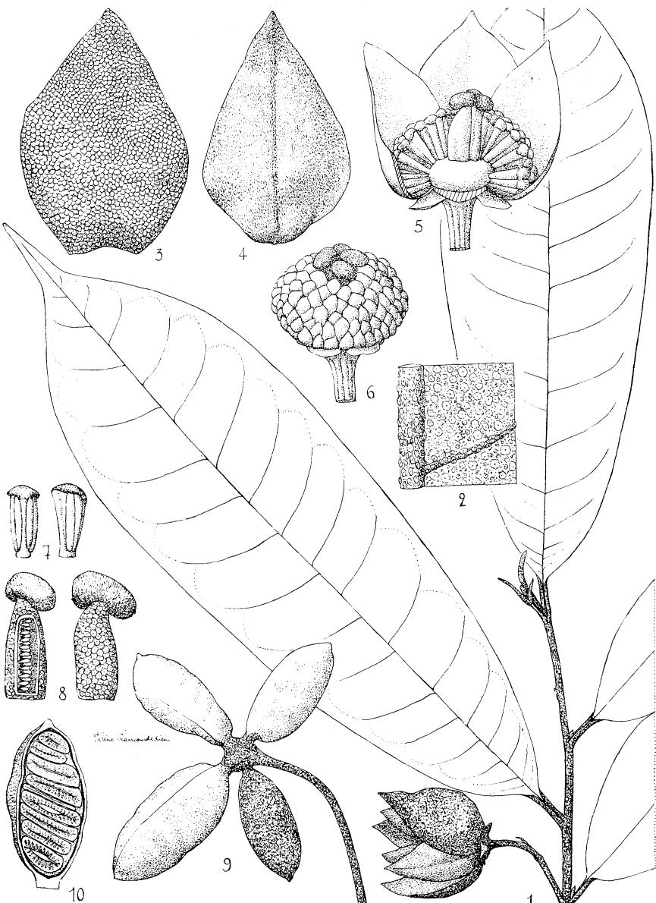

*Caption:* 

---

## Figure 49

![PL.49．- Polyceratocarpus Pellgrinii Le Thomas (Le Testu 7754）:I,rameau florifere × 2/3；2,fleur,3 pétales enleves× 2；3,étamine ×6;4,carpelle et coupe × 6；5,fleur,3 pétales enleves.-Polyceratocarpus parviflorus (Engl.et Diels)Ghesq.: 6,fleur ;3 petales enleves × 2；7,8, petales externe et interne × 2; 9,étamine × 6;10,carpelle et coupe × 6 (Le Testu 8549);11,fruit × 2/3 (Chevalier 21343).-Polyceratocarpus microtrichus (Engl. et Diels) Ghesq.ex Pelegr. : 12,inflorescence × 2/3；I3,fleur,3 petales enleves × 2；14,étamine × 6 (N. Halle 2279).](figures/fig_025.jpg)

*Caption:* PL.49．- Polyceratocarpus Pellgrinii Le Thomas (Le Testu 7754）:I,rameau florifere × 2/3；2,fleur,3 pétales enleves× 2；3,étamine ×6;4,carpelle et coupe × 6；5,fleur,3 pétales enleves.-Polyceratocarpus parviflorus (Engl.et Diels)Ghesq.: 6,fleur ;3 petales enleves × 2；7,8, petales externe et interne × 2; 9,étamine × 6;10,carpelle et coupe × 6 (Le Testu 8549);11,fruit × 2/3 (Chevalier 21343).-Polyceratocarpus microtrichus (Engl. et Diels) Ghesq.ex Pelegr. : 12,inflorescence × 2/3；I3,fleur,3 petales enleves × 2；14,étamine × 6 (N. Halle 2279).

---

## Figure 50

*Caption:* PL.50.--Uvariodendron giganteum(Engl.）R.E.Fries :1,feuille × 4/3；2,bouton floral gr.nat.；3,fleur,bractées enlevées gr.nat ；4,fleur,2 sépales et 3 pétales enleves × 2；5.pétale externe × 2;6,pétale interne × 2；7,étamine × 8;8, carpelle et coupe × 8;9,coupe du réceptable × 2;I0,diagramme floral;II,fruit et coupe (in vivo,H. Hallé 3156).

---

## Figure 51

*Caption:* PL.51.- Uvariodendron molundense (Engl.et Diels)R.E.Fries:I,feuille × 2/3; 2,inflorescence gr.nat.;3,bouton floral vu par-dessous gr.nat.(Le Testu 9649); 4,fleur ouverte vue par-dessous gr.nat.(Le Testu 8437)；5,coupe du réceptacle × 4,5;6,étamine × 6；7,carpelle et coupe × S (Le Testu 9649);8,diagramme fleral:9,fruit (N. Hallé 3264 in vivo).

---

## Figure 52

![PL.52.- Uvariastrum Pynaertii De Wild.；I,rameau florifére × 2/3；2,sépale X 1;3 fleur,pétales et sépales enlevés × 2;4,étamine × 4；5,carpelle × 4 (Le Testu 8473);6,7,méricarpe et coupe × 2/3;8,coupe de la graine × 2/3 (Le Testu 7996 bis).-U. Zenkeri Engl.et Diels :9,bouton floral × 2/3；10,sépale ×1 (Letouzey 9121).- Mischogyne Elliotianum Spr.et Hutch．var.gabonensis Pellegr.ex Le Thomas:II,rameau florifére × 2/3；I2,fleur pétales et sépales enlevés × 3;13,étamine × 6;14,carpelle × 4 (Le Testu 1768).](figures/fig_033.jpg)

*Caption:* PL.52.- Uvariastrum Pynaertii De Wild.；I,rameau florifére × 2/3；2,sépale X 1;3 fleur,pétales et sépales enlevés × 2;4,étamine × 4；5,carpelle × 4 (Le Testu 8473);6,7,méricarpe et coupe × 2/3;8,coupe de la graine × 2/3 (Le Testu 7996 bis).-U. Zenkeri Engl.et Diels :9,bouton floral × 2/3；10,sépale ×1 (Letouzey 9121).- Mischogyne Elliotianum Spr.et Hutch．var.gabonensis Pellegr.ex Le Thomas:II,rameau florifére × 2/3；I2,fleur pétales et sépales enlevés × 3;13,étamine × 6;14,carpelle × 4 (Le Testu 1768).

---

## Figure 53

![PL.53.- Uvariasturm Pierreanum Engl.et Diels :I,feuille et fleur × 2/3 (Le Testu 6083)；2,bouton floral × 2/3 (Letouzey 2670)；3,sépale gr.nat.;4,pistil et gynécée × 2；5,coupe du réceptacle × 2;6,étamine × 6；7,carpelle et coupe × 3(Le Testu 6083);8,fruit × 2/3 (Klaine 99).- Uvariastrum insculptum (Engl. et Diels) Sprague et Hutch.:9,feuille et fleur × 2/3 (Aubréville 4331);10,bouton floral × 2/3 (Staudt 740)；11,sépale gr.nat.；12,étamine × 4;13,carpelle et coupe × 4 (Aubréville 4331);I4,méricarpe et coupe × 2/3 (Staudt 740).](figures/fig_027.jpg)

*Caption:* PL.53.- Uvariasturm Pierreanum Engl.et Diels :I,feuille et fleur × 2/3 (Le Testu 6083)；2,bouton floral × 2/3 (Letouzey 2670)；3,sépale gr.nat.;4,pistil et gynécée × 2；5,coupe du réceptacle × 2;6,étamine × 6；7,carpelle et coupe × 3(Le Testu 6083);8,fruit × 2/3 (Klaine 99).- Uvariastrum insculptum (Engl. et Diels) Sprague et Hutch.:9,feuille et fleur × 2/3 (Aubréville 4331);10,bouton floral × 2/3 (Staudt 740)；11,sépale gr.nat.；12,étamine × 4;13,carpelle et coupe × 4 (Aubréville 4331);I4,méricarpe et coupe × 2/3 (Staudt 740).

---

## Figure 54

![PL.54.-- Uvariopsis Solheidii (De Wild.） Rob.et Ghesq.:I,inflorescence × 2/3 (Tisserant 2422)；2,fleur ♀ un pétale enlevé × 2；3,pétale de la fleur ♀ × 3; 4, carpelle et coupe × 4; 5,fleurun pétale enlevé × 2;6,pétale de la fleur X3；7,étamine × 20 (Tisserant 8O4).- Uvariopsis Le-Testui Pellegrin :8,fleur × 2/3;9,petale de la fleur ♀ × 3;10,gynécee × 2;11,carpelle et coupe × 4; 12,fleurdun petale enlevé × 3；13,étamineX 20 (N.Hallé 3060);14,fruit × 4/2; 15,coupe du méricarpe × 4/2；(N. Hallé 2975).- Uvariopsis Vanderystii Rob. et Ghesq.(Le Testu 8525) :I6,inflorescence ♀× 2/3;17,fleur un pétale enlevé X 2;I8,petale de la fleur ♀ × 3；I9,carpelle et coupe × 4.](figures/fig_002.jpg)

*Caption:* PL.54.-- Uvariopsis Solheidii (De Wild.） Rob.et Ghesq.:I,inflorescence × 2/3 (Tisserant 2422)；2,fleur ♀ un pétale enlevé × 2；3,pétale de la fleur ♀ × 3; 4, carpelle et coupe × 4; 5,fleurun pétale enlevé × 2;6,pétale de la fleur X3；7,étamine × 20 (Tisserant 8O4).- Uvariopsis Le-Testui Pellegrin :8,fleur × 2/3;9,petale de la fleur ♀ × 3;10,gynécee × 2;11,carpelle et coupe × 4; 12,fleurdun petale enlevé × 3；13,étamineX 20 (N.Hallé 3060);14,fruit × 4/2; 15,coupe du méricarpe × 4/2；(N. Hallé 2975).- Uvariopsis Vanderystii Rob. et Ghesq.(Le Testu 8525) :I6,inflorescence ♀× 2/3;17,fleur un pétale enlevé X 2;I8,petale de la fleur ♀ × 3；I9,carpelle et coupe × 4.

---

## Figure 55

*Caption:* PL.55.— Uvariopsis congolana (De Wild.) Fries:1,feuille X 2/3 (N. Hallé 3039); 2,inflorescences caulinaires vers le base du tronc，pendantes ou ± couchées autour de son point d'appui;3,bouton floral gr.nat.;4,fleur × 2/3;5,coupe dela fleurδ × 2;6,étamine × 20 (N.Hallé 2817);7,fleur ♀ × 2/3 (N.Hallé 3039); 8,id.vue de dessous gr. nat.;9,coupe de la fleur gr.nat.;i0,carpelle × 3 (N. Halle 2817).

---

## Figure 56

*Caption:* PL.56.- Enantia Le-TestuiLe Thomas:1,rameau florifére × 2/3；2,détail de la feuille,face inferieureX6；3,poil étoilé vu au microscope;4,bouton floral ×4,5; 5,pétale gr.nat.;6,étamine × 6；7,carpelle et coupe × 6.8,diagramme floral (Le Testu 8432).-Enantia pilosa Exell:9,feuille et bouton floral × 2/3;I0,detail dela feuille,face inférieure X 6;II,fleur gr.nat.;I2,pétale gr.nat.;13,étamine X 6;14,carpelle et coupe × 6.

---

## Figure 57

*Caption:* PL.57.- Eaaztia chlorantha Oliver:1,feuille et fleur × 2/3；2,détail de la feuille, face intérieure × 6；3,bouton floral avec bractées × 3(Le Testu 1783);4,pétale gr.nat.；5,fleur,pétales enlevés × 3；6,étamines externe et interne × 8；7, carpelle et coupe × 8；8,fruit × 2/3 (Letouzey 5412).- Enantia kwiluensis Rob.et Ghesq.:9,feuille × 2/3；10,détail de la feuille,face inférieure × 6;11, bouton floral × 3;12,fruit × 2/3 (Sargos 193).

---

## Figure 58

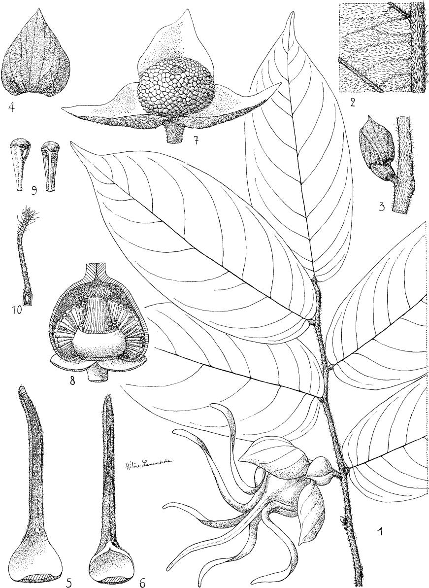

*Caption:* 

---

## Figure 59

![Pl.59.- Annona senegalensis Pers. ssp.senegalensis :1,feuille et fleur × 2/3; 2,pubescence de la face inférieure de la feuille × 2 (Aubréville 287)；3,4,feuille × 2/3,et pubescence de la face inférieure × 4,montrant la variation dans la sousespece (Jacques-Félix 3532);5,coupe longitudinale de la fleur × 2;6,étamine × 6; 7, carpelle_ et coupe × 8(Aubréville 287); 8, graine gr. nat.(Vaillant 45).- ssp. oulotricha Le Thomas:9,10,feuille × 2/3,et pubescence de la face inférieure × 4; 11,fruits × 2/3 (Letouzey 3i87).-A. glabra L.:12,feuille,face superieure × 2/3; 13,coupe du fruit × 2/3；14,graine gr.nat.(Chevalier 26714).](figures/fig_000.jpg)

*Caption:* Pl.59.- Annona senegalensis Pers. ssp.senegalensis :1,feuille et fleur × 2/3; 2,pubescence de la face inférieure de la feuille × 2 (Aubréville 287)；3,4,feuille × 2/3,et pubescence de la face inférieure × 4,montrant la variation dans la sousespece (Jacques-Félix 3532);5,coupe longitudinale de la fleur × 2;6,étamine × 6; 7, carpelle_ et coupe × 8(Aubréville 287); 8, graine gr. nat.(Vaillant 45).- ssp. oulotricha Le Thomas:9,10,feuille × 2/3,et pubescence de la face inférieure × 4; 11,fruits × 2/3 (Letouzey 3i87).-A. glabra L.:12,feuille,face superieure × 2/3; 13,coupe du fruit × 2/3；14,graine gr.nat.(Chevalier 26714).

---

## Figure 60

*Caption:* PL.60.- Anonidium Mannii (Oliv.) Engl.et Diels:1,feuille × 2/3 (Le Testu 9169); 2,inflorescence × 2/3；3,fleurδ,petales enleves × 2/3；4,étamine de la fleur X4 (Le Testu 9509)；5,feur ,3 pétales enlevés × 2/3;6,coupe du réceptable X 2;7,étamine X 4;8,carpelles× 6 (Le Testu 7269);9,fruit (d'apres Nigerian trees)；I0,graine × 2/3 (Le Testu ss.no).- Anonidium Mannii var.Brieyi:11, fleur X 2/3 (Le Testu 1641).

---

## Figure 61

*Caption:* PL.61.- Anonidium floribundum Pellgr. :1, feuille × 2/3；2,inflorescence X 2/3;3,étamine de la fleur§ × 4 (Le Testu 5877);4,coupe du réceptacle de la fleur× 2；5,étamine de la fleur ×4；6,carpelles ×6 (Le Testu 9149).- AnonidiumLe-Testui Pellegr.:7,feuilles × 2/3;8,inflorescence ♀× 2/3;9,coupe de la fleur × 2；10,étamine stérile × 4;11,carpelles × 6 (Le Testu 9615).

---

## Figure 62

*Caption:* PL.62.- Monodera tenuifolia Benth.:1,rameau florifére × 2/3 (SRFK 1928); 2,fleur vue par-dessus × 2/3;3,sépale × 4,5;4,pétale interne × 1,5;5,androcée et gynécee × 4;6,étamine × 16 (Le Testu 1245)；7,coupe longitudinale du fruit X 2/3;8,graine gr.nat.(Chevalier 18342).

---

## Figure 63

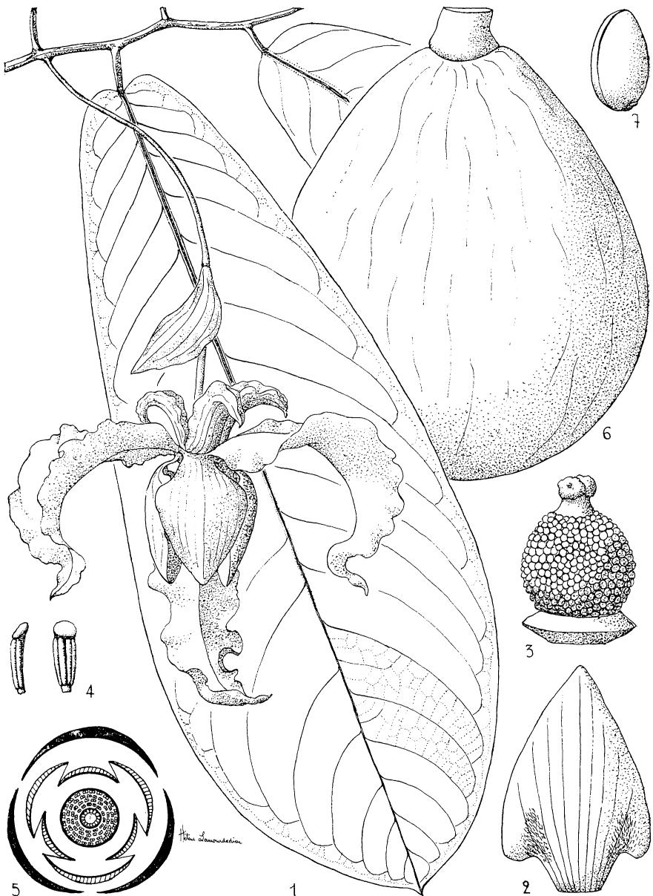

*Caption:* PL.63.- Monodora myristica (Gaertn.) Dunal :1,rameau florifere × 2/3；2,pétale interne × 1,5；3,androcee et gycénée × 3;4,étamine × 8 (Letouzey 3899); 5,diagramme floral;6,fruit × 2/3；7,graine gr.nat.

---

## Figure 64

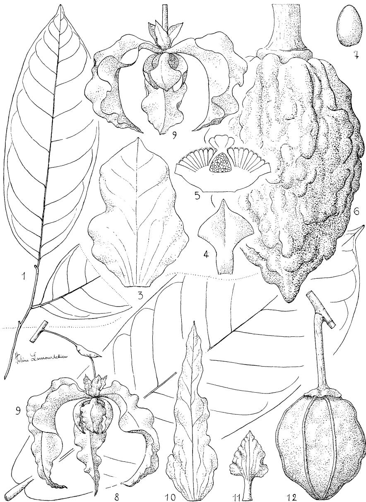

*Caption:* 

---

## Figure 65

*Caption:* PL.65.—Isolona Le-TestuiPellegr.:I,feuilles et fleurX 2/3；2,fleur,corolle écartée et coupée × 2;3,sépale × 2；4,5,étamines externe et interne × 6;6,ovaire et coupe × 6 (Le Testu 1252).-Isolona pilosa Diels :7,feuille et fleur × 2/3 (Le Testu 8740)；8,fleur,corolle écartee × 2；9,sépales × 2；10,I1,ctamines externe et interne × 6 (Le Testu 8602).

---

## Figure 66

*Caption:* PL.66.—Isolona hexaloba (Pierre）Engl.et Diels:I,feuille et fleur × 2/3 (Le Testu 5836)；2,feuilles et fleurs × 2/3；3,fleur vue par-dessous gr.nat.;4,coupe de la fleur × 3;5,étamine interne,face et profil × 8;6,étamine externe × 8;7,carpelle et coupe × 4(Le Testu 5862);8,diagramme floral;9,fruit × 2/3;10,fruit ouvert montrant la disposition des graines × 2/3;11,graine et coupe gr.nat.(Klaine 360).

---

## Figure 67

*Caption:* PL.67.—Isolona Zenkeri Engler :1,feuille et fleur × 2/3 (Le Testu 5117)；2, fleur ×4,5 (Le Testu 8001)；3,fruit × 2/3 (Klaine 2678).- Isolona campanulata Engl.et Diels :4,rameau florifére × 2/3；5,fleur × 4,5;6,corolle developpee gr.nat.;7,fruit × 2/3 (Aubréville s.n.C. I.).

---
