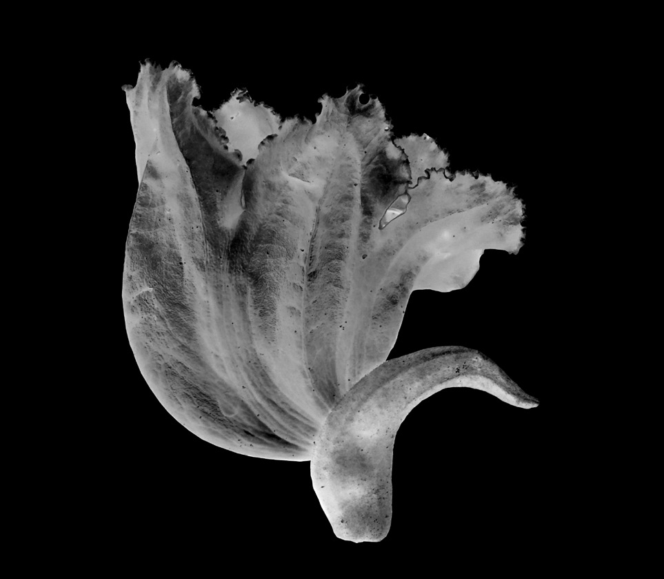
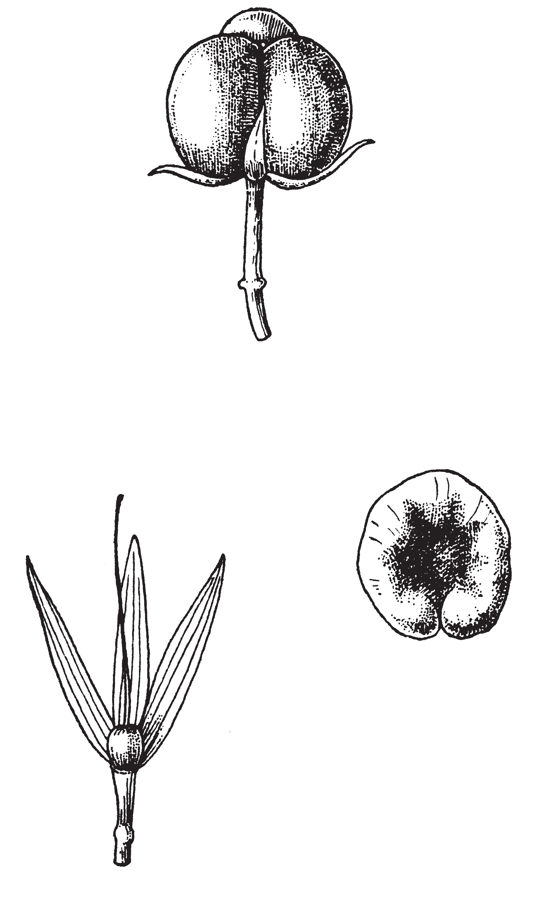
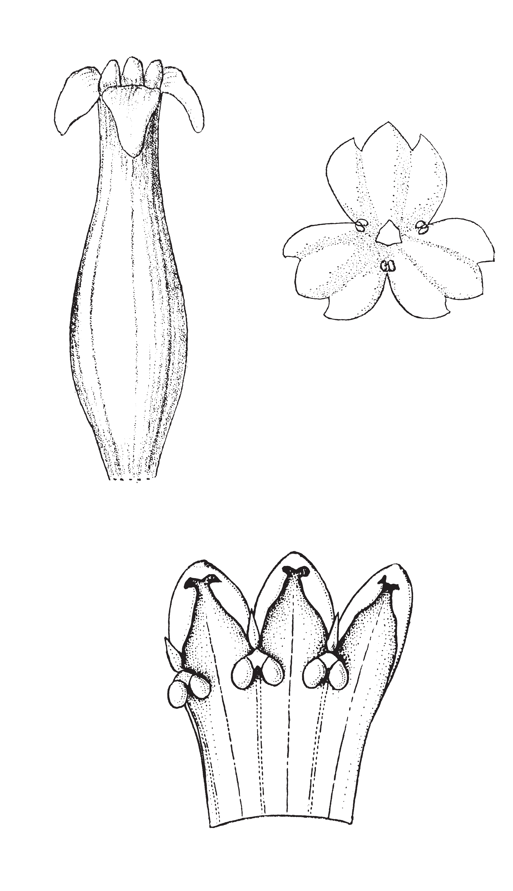

## Figure 0 (page 2)

*Caption:* (no caption)

---

## Figure 1 (page 2)

*Caption:* (no caption)

---

## Figure 2 (page 2)

*Caption:* (no caption)

---

## Figure 3 (page 3)

*Caption:* (no caption)

---

## Figure 4 (page 3)

*Caption:* (no caption)

---

## Figure 5 (page 7)

*Caption:* (no caption)

---

## Figure 6 (page 7)

*Caption:* (no caption)

---

## Figure 7 (page 13)

*Caption:* Planche 1. Chlorophytum orchidastrum : 1. Feuille et inflorescence (× 0,5). – 2. Tépales externes et gynécée (× 4). – 3. Étamine (× 7). – 4. Gynécée (× 8). – 5. Fruit (× 3). – 6. Graine dessus (× 8). – 7.

---

## Figure 8 (page 17)

*Caption:* (no caption)

---

## Figure 9 (page 17)

*Caption:* (no caption)

---
