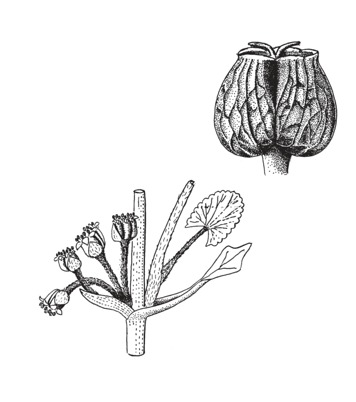
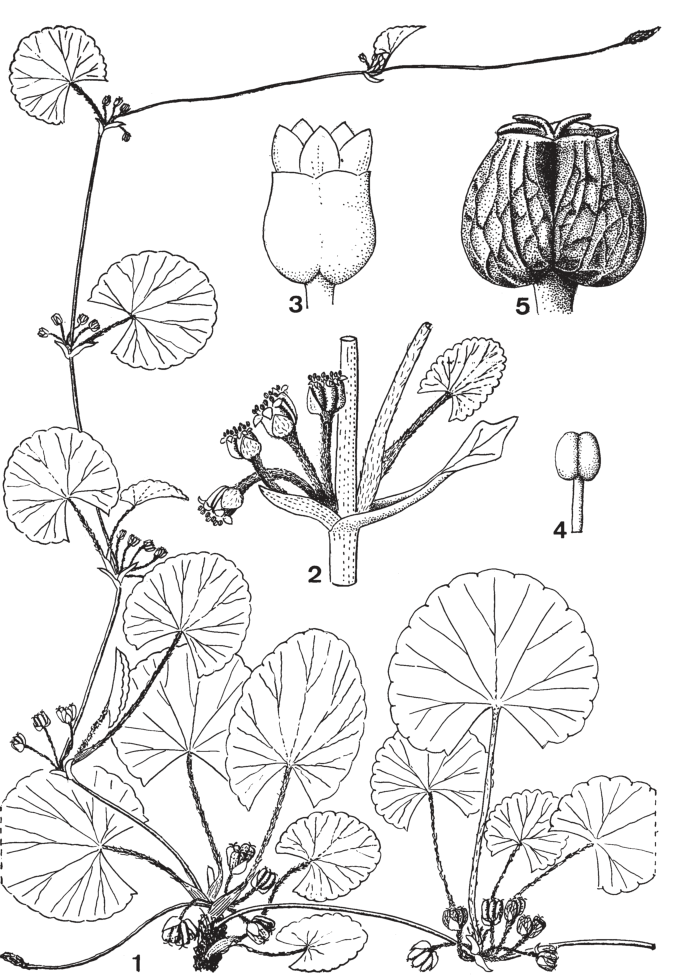

## Figure 11 (page 11)

*Caption:* (no caption)

---

## Figure 12 (page 13)

*Caption:* Planche 2. Centella asiatica : 1. Partie de la plante. – 2. Nœud de stolon avec bourgeon de feuilles normales et fascicule de fleurs à l’autre aiselle. – 3. Fleur. – 4. Étamine. – 5. Fruit (vue latérale).

---
