## Figure 0 (page 2)
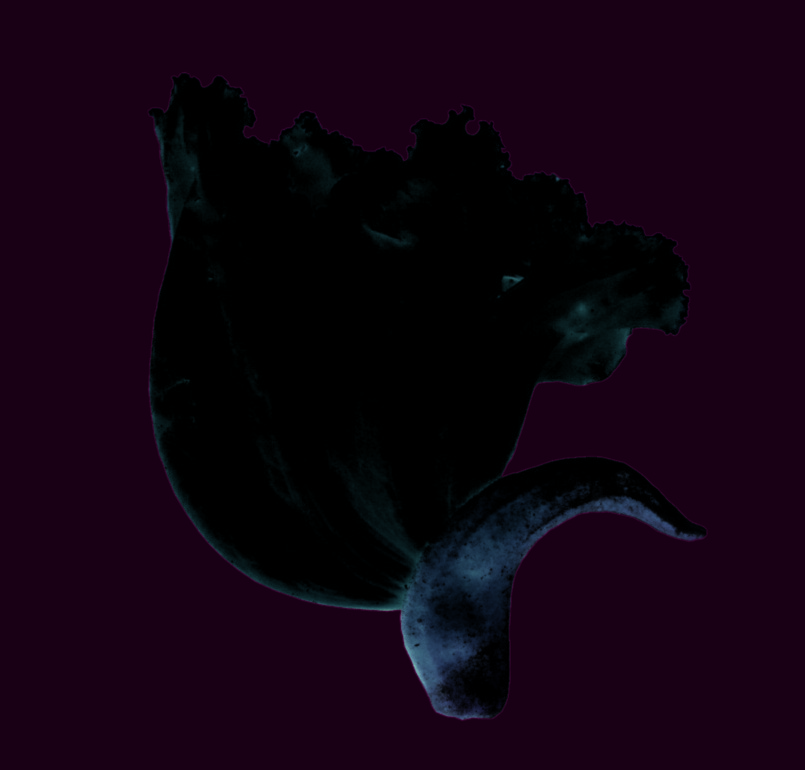
*Caption:* (no caption)

---

## Figure 1 (page 2)

*Caption:* (no caption)

---

## Figure 2 (page 2)

*Caption:* (no caption)

---

## Figure 3 (page 3)
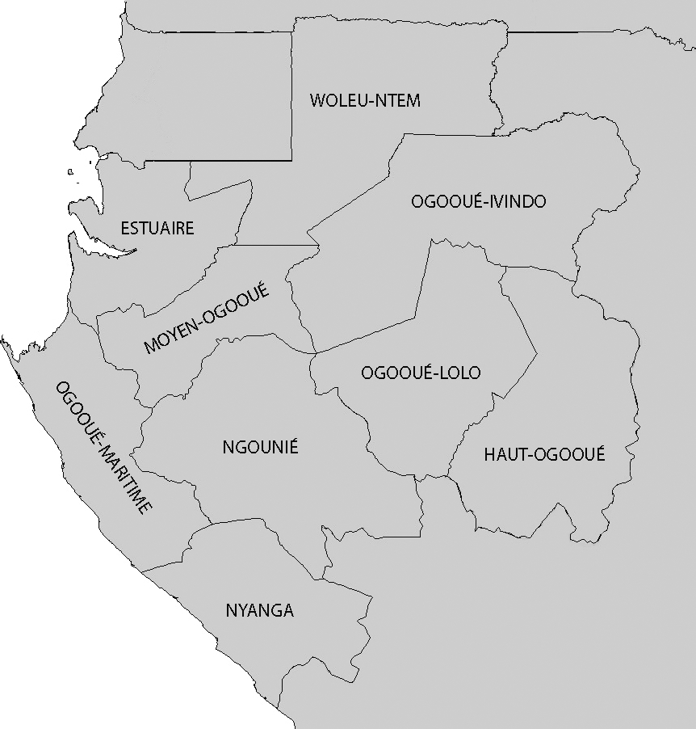
*Caption:* (no caption)

---

## Figure 4 (page 3)
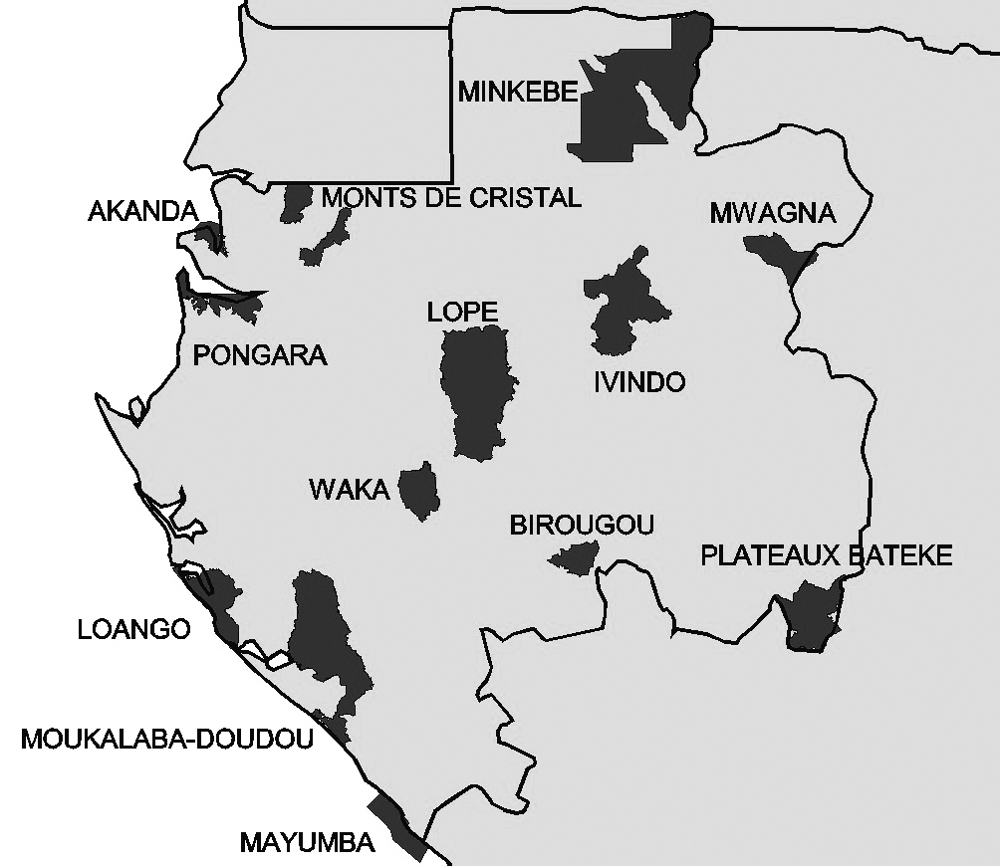
*Caption:* (no caption)

---

## Figure 5 (page 3)
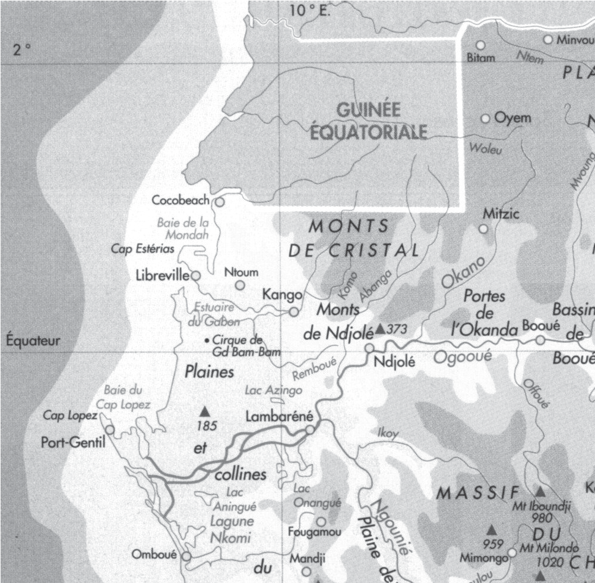
*Caption:* (no caption)

---

## Figure 6 (page 3)
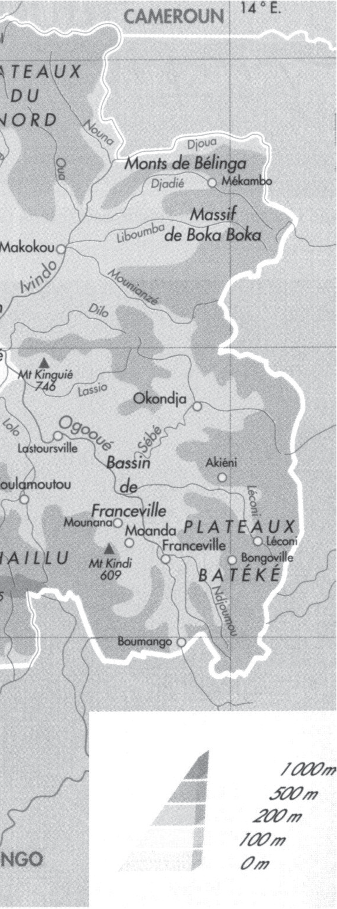
*Caption:* (no caption)

---

## Figure 7 (page 3)

*Caption:* (no caption)

---

## Figure 8 (page 8)
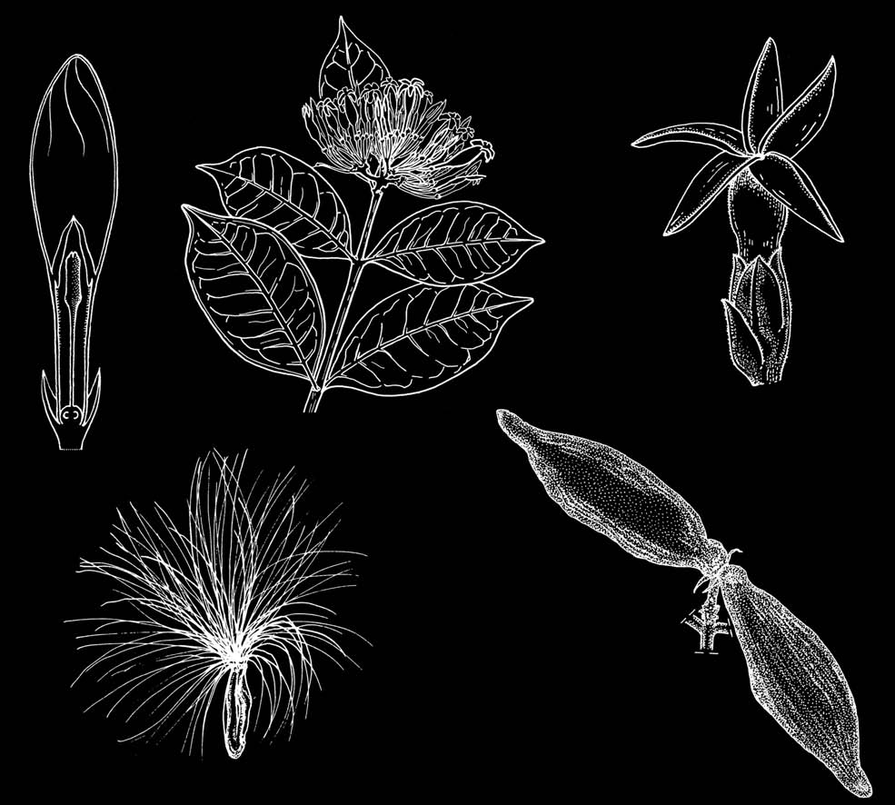
*Caption:* (no caption)

---

## Figure 9 (page 8)
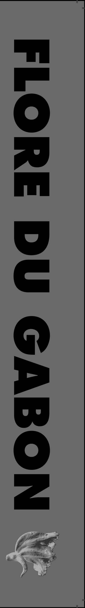
*Caption:* (no caption)

---

## Figure 10 (page 17)
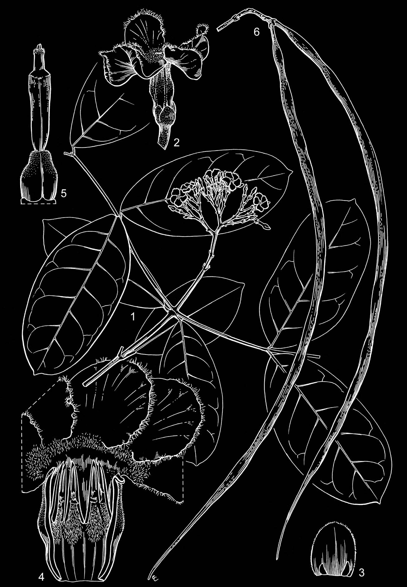
*Caption:* Planche 1 . $OD¿DEDUWHUL 5DPHDXÀRULIqUHîҀ±)OHXUî±/REHGXFDOLFHIDFHLQWHUQH (× 10). – 4. Corolle ouverte (× 6). – 5. Pistil (× 10). – 6. Fruit (× ½). (1, 6 : Brenan 9428 ; 2-5 : Leeuwen- berg 12156 ). Dessin par Eleanor Catherine (©), reproduit avec permission à partir de Leeuwenberg (1997a).

---

## Figure 11 (page 18)
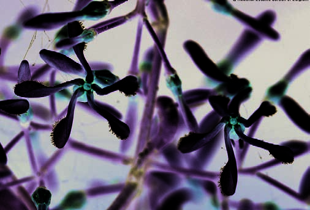
*Caption:* Figure 1 . $OD¿DEHQWKDPLL : A. Fleurs. – Allamanda cathartica : B. Fleurs ; C. Fruit. – Alstonia boonei : '7URQF()HXLOOHV),QÀRUHVFHQFHHWJ\Qpfph*)OHXUV3KRWRVSDU%DUW:UVWHQ$/RPDPL 5pSGpP&RQJR'LHJR0RQVRUHV%310*5LRGH-DQHLUR%UD]LO*RUGRQ0F3KHUVRQ&5LR &DLPLWR3DQDPD&DUHO-RQJNLQG'(0WV1LPED*XLQpHHW'DYLG+DUULV)*6DQJKD5pS

---

## Figure 12 (page 18)
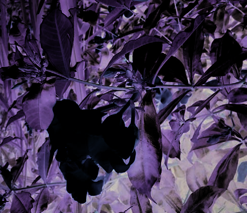
*Caption:* (no caption)

---

## Figure 13 (page 18)
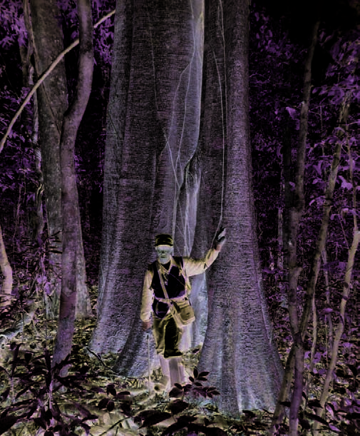
*Caption:* (no caption)

---

## Figure 14 (page 18)
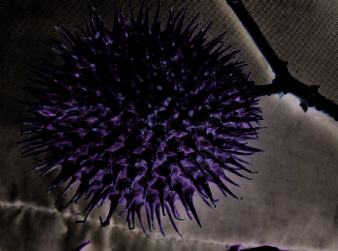
*Caption:* (no caption)

---

## Figure 15 (page 18)
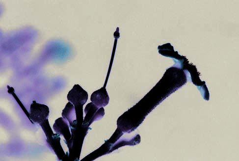
*Caption:* (no caption)

---

## Figure 16 (page 18)
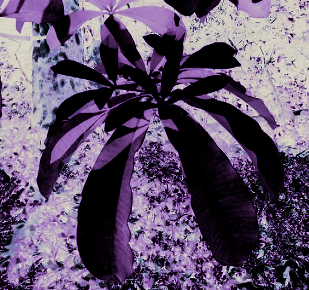
*Caption:* (no caption)

---

## Figure 17 (page 18)
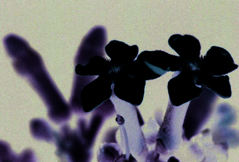
*Caption:* (no caption)

---

## Figure 18 (page 20)
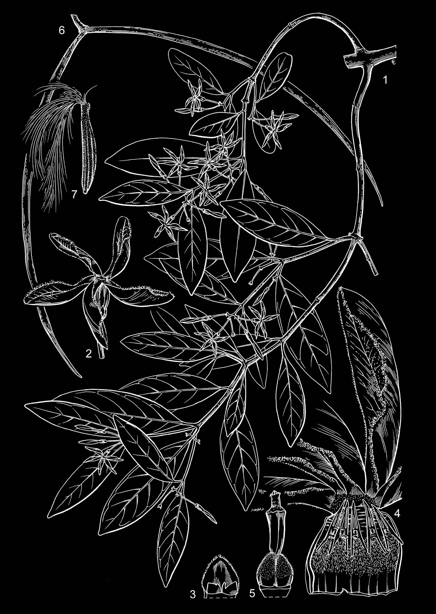
*Caption:* Planche 2 . $OD¿D benthamii 5DPHDXÀRULIqUHîҀ±)OHXUî±/REHGXFDOLFHIDFHLQWHUQH (1-5 : Letouzey 11906 ; 6-7 : J. Louis 7891 ). Dessin par Eleanor Catherine (©), reproduit avec permission à partir de Leeuwenberg (1997a).

---

## Figure 19 (page 21)
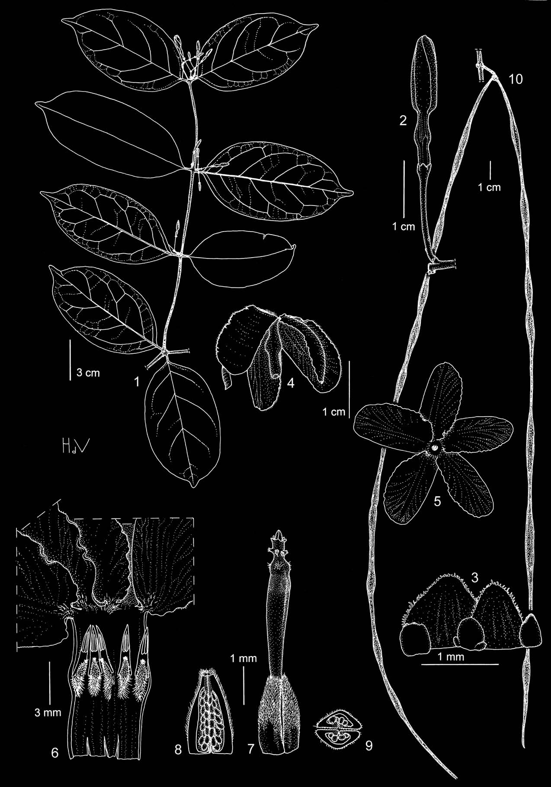
*Caption:* Planche 3 . $OD¿D caudata 5DPHDXÀRULIqUH±%RXWRQÀRUDO±/REHGXFDOLFHIDFHLQWHUQHDYHF collétères. – 4. Corolle. – 5, Idem, vue du dessus. – 6. Face interne du tube de la corolle. – 7. Pistil. – 8.

---

## Figure 20 (page 23)
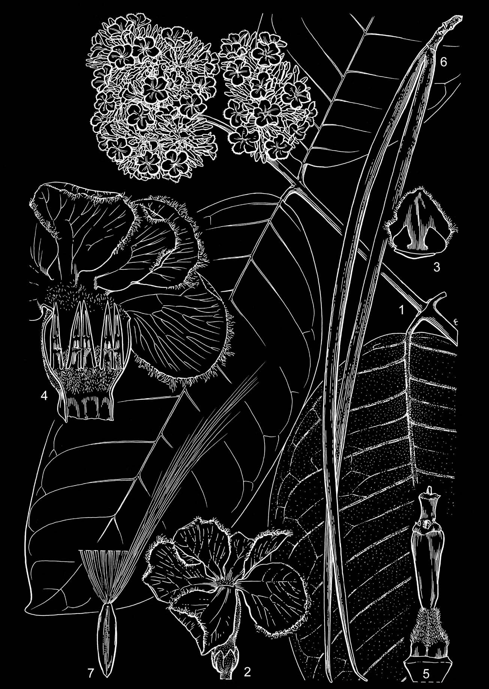
*Caption:* Planche 4 . $OD¿D erythrophthalma - tiellement enlevé (× ϰ ). (1-5 : J. Louis 8735 ; 6, 7 : Tisserant 1928 ). Dessin par Eleanor Catherine (©), reproduit avec permission à partir de Leeuwenberg (1997a).

---

## Figure 21 (page 24)
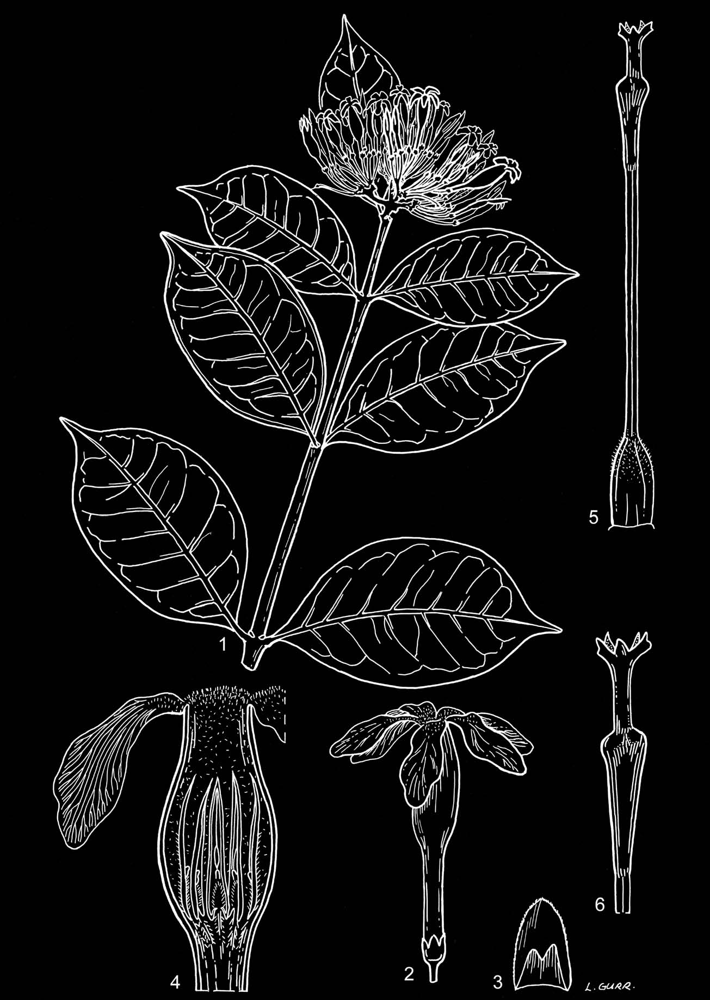
*Caption:* Planche 5 . $OD¿DIDOFDWD 5DPHDXÀRULIqUHîҀ±)OHXUî±/REHGXFDOLFHIDFHLQWHUQH montrant les collétères (× 5). – 4. Partie supérieure de la corolle, coupe longitudinale (× 4). – 5. Pistil (× 6). – 6. Tête du pistil (× 8). (1-6 : Le Testu 5827). Dessin par Linda Gurr (©), reproduit avec permission à partir de Leeuwenberg (1997a).

---

## Figure 22 (page 26)
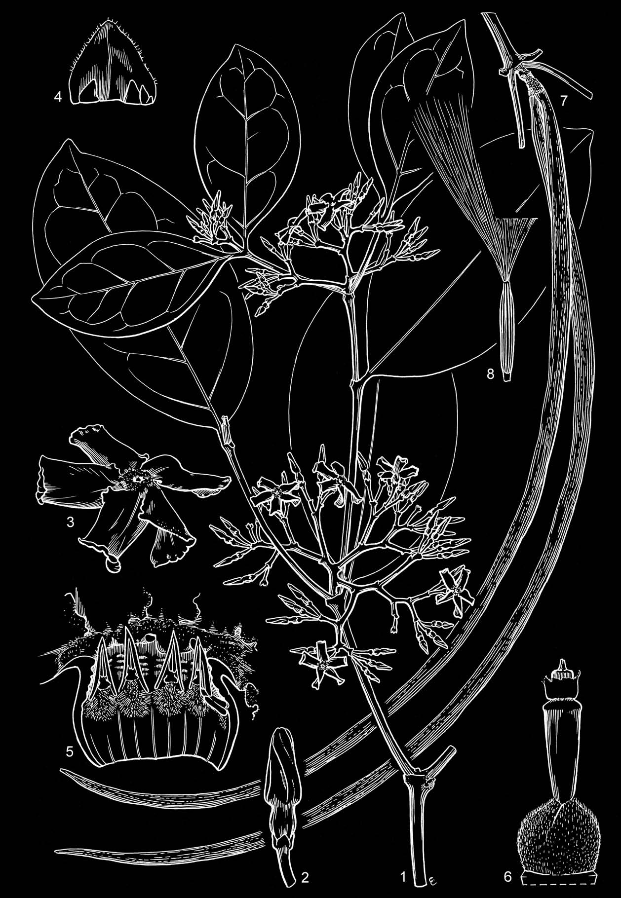
*Caption:* Planche 6 . $OD¿D lucida du calice, face interne montrant les collétères (× 15). – 5. Tube de la corolle ouverte (× 6). – 6. Pistil (× 12). – 7. Fruit (× ½). – 8. Graine (× 1). (1-6 : Leeuwenberg 8650 ; 7 : Garnier PG/UB 135 ; 8 : Baldwin 14184 ). Dessin par Eleanor Catherine (©), reproduit avec permission à partir de Leeuwenberg (1997a).

---

## Figure 23 (page 28)
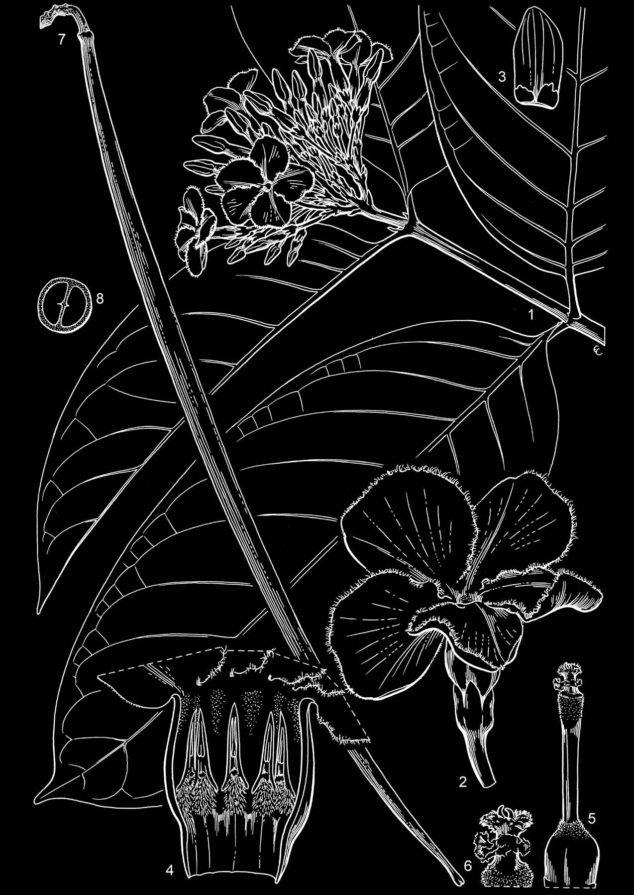
*Caption:* Planche 7 . $OD¿D PXOWLÀRUD 5DPHDXÀRULIqUHîҀ±)OHXUî±/REHGXFDOLFHIDFHLQWHUQH montrant les collétères (× 4). – 4. Tube de la corolle ouverte (× 3). – 5. Pistil (× 5). – 6. Tête du pistil

---

## Figure 24 (page 29)
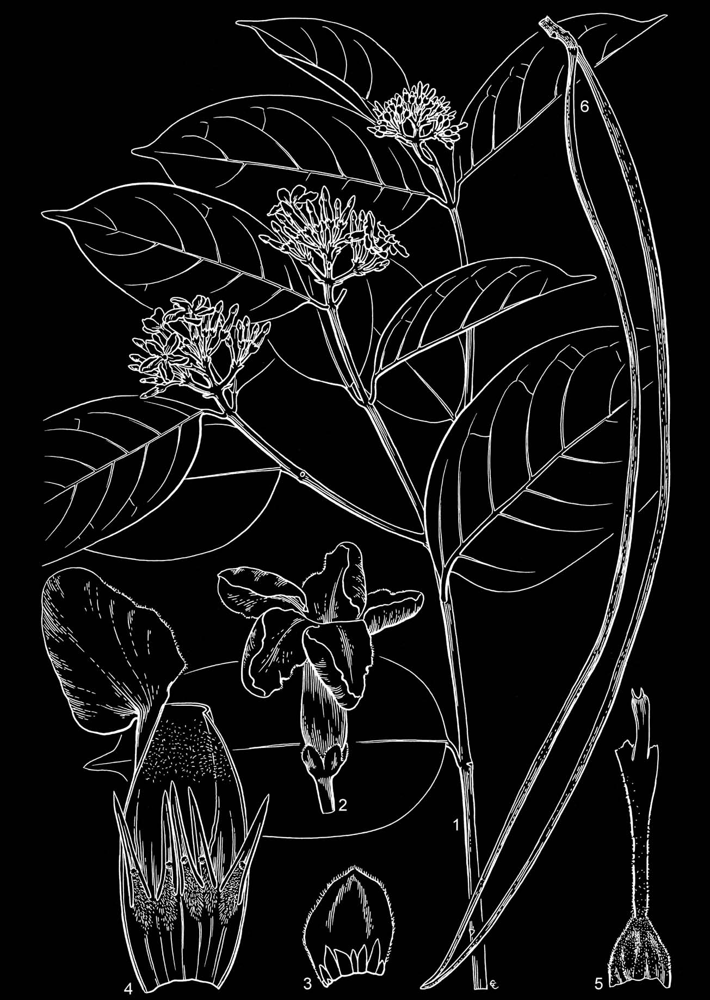
*Caption:* Planche 8 . $OD¿D schumannii 5DPHDXÀRULIqUHîҀ±)OHXUî±/REHGXFDOLFHIDFHLQ - terne montrant les collétères (× 8). – 4. Partie de corolle ouverte (× 4). – 5. Pistil (× 8). – 6. Fruit (× ϱ ). (1-5 : Dawe 251 ; 6 : J. Louis 3229 ). Dessin par Eleanor Catherine (©), reproduit avec permission à partir de Leeuwenberg (1997a).

---

## Figure 25 (page 32)
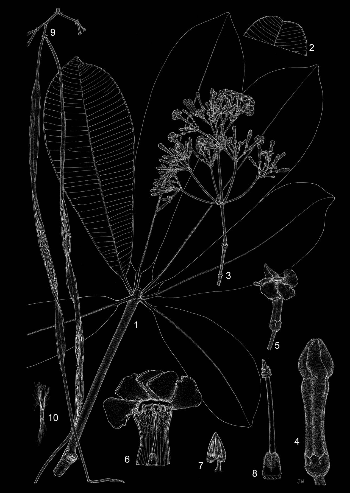
*Caption:* Planche 9 . Alstonia boonei 9HUWLFLOOHIROLDLUHîҀ±6RPPHWG¶XQHIHXLOOHîҀ±,QÀRUHV -

---

## Figure 26 (page 34)
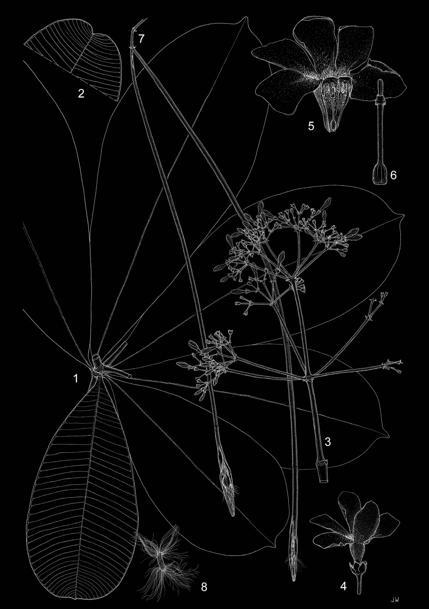
*Caption:* Planche 10 . Alstonia congensis 9HUWLFLOOHIRODLUHîҀ±6RPPHWGHODIHXLOOHîҀ±,QÀR - – 8. Graine (× 1). (1 : Leeuwenberg 11209 ; 2, 7-8 : Devred 2828 ; 3 : Jans 305 ; 4-6 : Ghesquière 3366 ).

---

## Figure 27 (page 37)
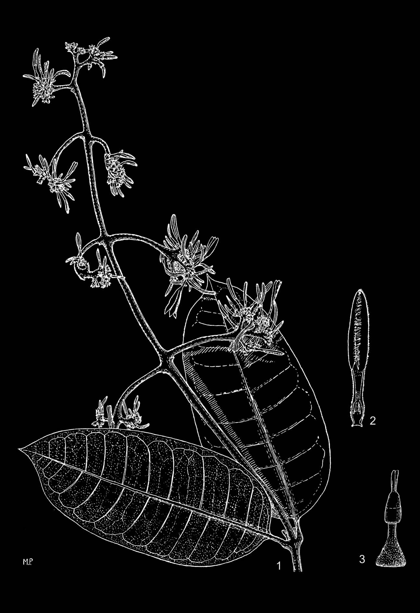
*Caption:* Planche 11 . Ancylobothrys pyriformis 7LJHÀRULIqUHîҀ±-HXQHFRUROOHFRXSHORQJLWXGLQDOH (× 2). – 3. Pistil (× 10). (1 : Le Testu 9511 ; 2, 3 : Le Testu 6054 'HVVLQSDU*XLGR03LFKRQ0XVpXP national d’Histoire naturelle, Paris (©), reproduit à partir de Pichon (1953).

---

## Figure 28 (page 38)
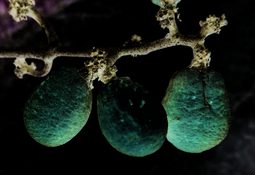
*Caption:* Figure 2 . Ancylobothrys pyriformis : A. Fruits. – Ancylobothrys scandens : B. Fruit. – Baissea congen- sis &7LJHÀRULIqUH')DFHLQIpULHXUHG¶XQHIHXLOOHDYHFGRPDWLHV(,QÀRUHVFHQFH))OHXU± Bais- sea gracillima *7LJHÀRULIqUH+3DUWLHG¶XQHLQÀRUHVFHQFH3KRWRVSDU1LFRODV7H[LHU$0RQWV %LURXJRX*DERQ(KRDUQ%LGDXOW%VXGGHO¶,OH0DQGML*DERQ&)HQWUH0DEDQGDHW1GHQGp *DERQ*+0RQWV%LURXJRX*DERQ

---

## Figure 29 (page 38)
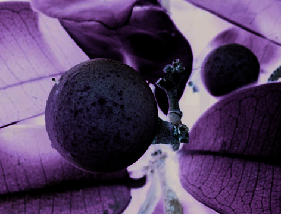
*Caption:* (no caption)

---

## Figure 30 (page 38)
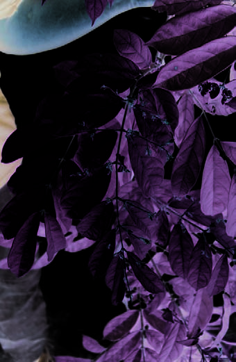
*Caption:* (no caption)

---

## Figure 31 (page 38)
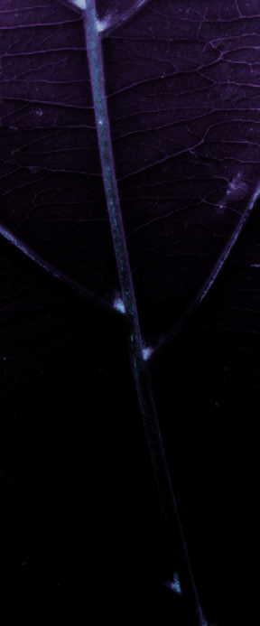
*Caption:* (no caption)

---

## Figure 32 (page 38)
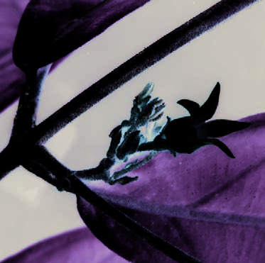
*Caption:* (no caption)

---

## Figure 33 (page 38)
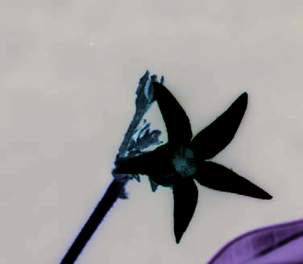
*Caption:* (no caption)

---

## Figure 34 (page 38)
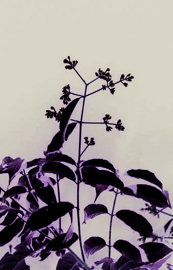
*Caption:* (no caption)

---

## Figure 35 (page 38)
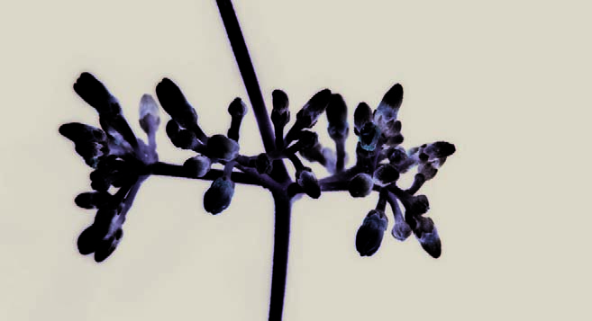
*Caption:* (no caption)

---

## Figure 36 (page 39)
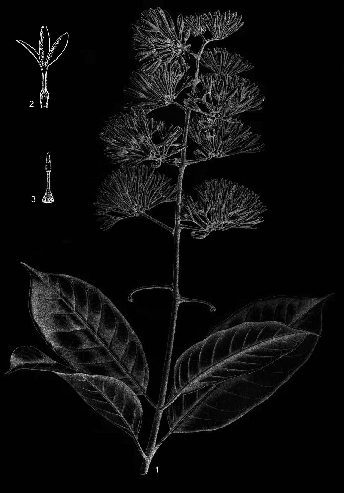
*Caption:* Planche 12 . Ancylobotrys robusta 5DPHDXÀRULIqUH±&RUROOHRXYHUWHDYHFpWDPLQHVîò±

---

## Figure 37 (page 41)
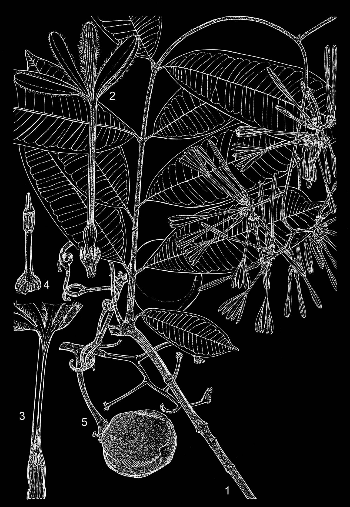
*Caption:* Planche 13 . Ancylobothrys scandens 5DPHDXÀRULIqUHîҀ±)OHXUî±&RUROOHRXYHUWH

---

## Figure 38 (page 44)
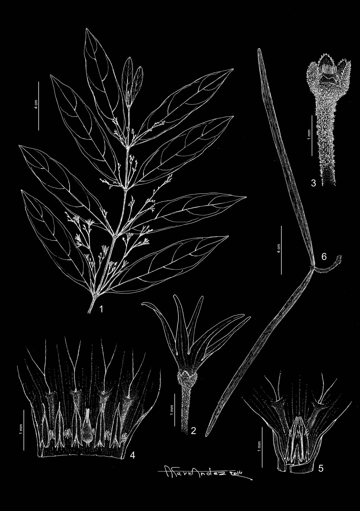
*Caption:* Planche 14 . Baissea atrobrunnea 5DPHDXÀRULIqUH±)OHXU±&DOLFHXQOREHHQOHYp±&R - rolle ouverte, avec étamines et pistil. – 5. Idem, avec étamines attachées au pistil. – 6. Fruit. (1-6 : Bous- sengui-Nongo & Bouango 245 'HVVLQSDU$QWRQLR)HUQDQGH]-DUGLQERWDQLTXHGH0HLVHUHSURGXLW à partir de Lachenaud & Jongkind (2022).

---

## Figure 39 (page 46)
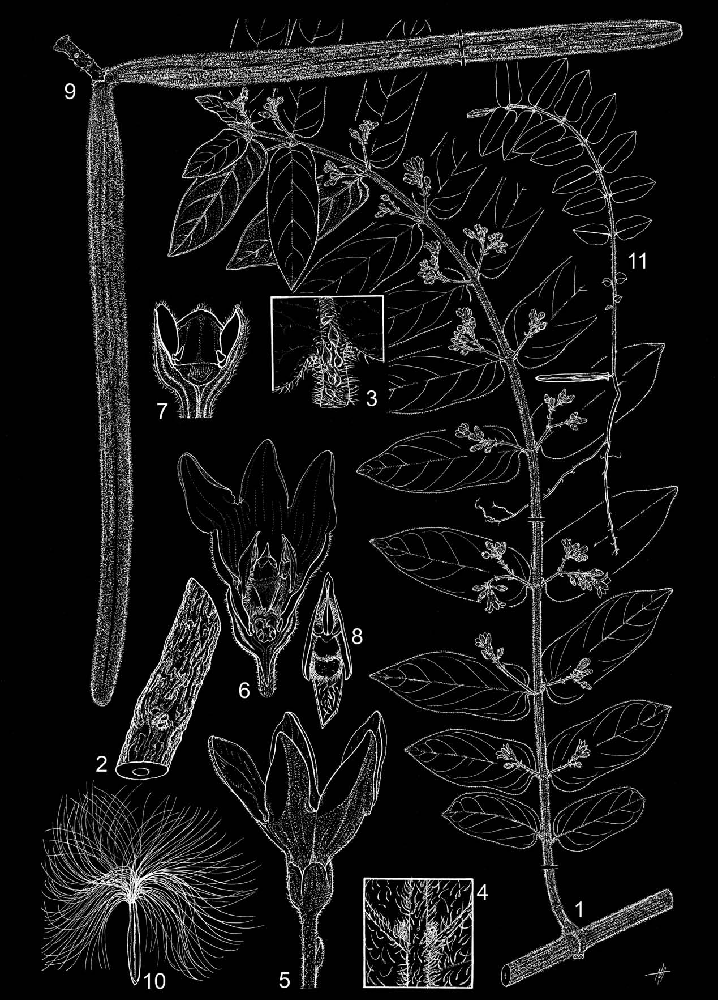
*Caption:* Planche 15 . Baissea axillaris 5DPHDXÀRULIqUHîҀ±3DUWLHG¶XQHEUDQFKHîҀ±-RQFWLRQ pétiole-limbe avec collétères (× 6). – 4. Détail de la face inférieure du limbe foliaire, avec domaties (× 6). – 5. Fleur (× 4). – 6. Idem, coupe longitudinale (× 4). – 7. Calice, coupe longitudinale (× 10). – 8. Éta-

---

## Figure 40 (page 48)
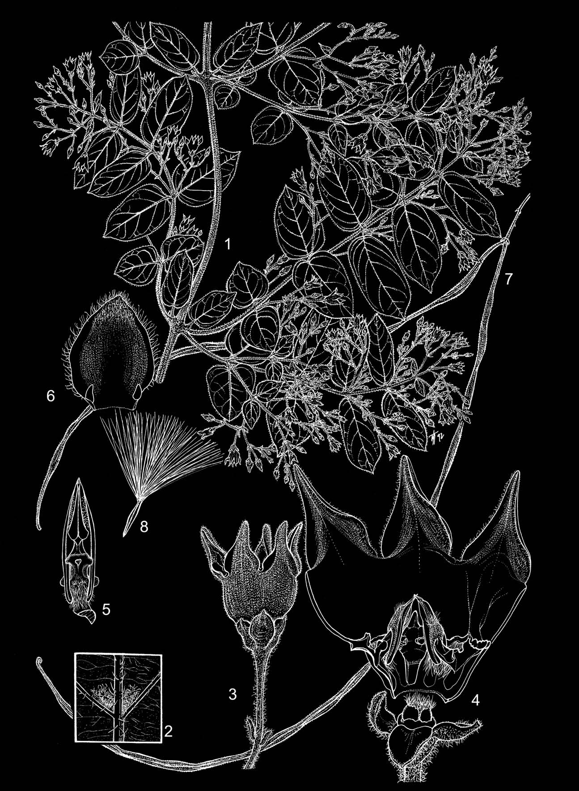
*Caption:* Planche 16 . Baissea baillonii 5DPHDXÀRULIqUHîҀ±'pWDLOGHODIDFHLQIpULHXUHGXOLPEHIR - liaire, avec domaties (× 4). –3. Fleur (× 4). – 4. Idem, à calice séparé de la corolle en coupe longitudinale (× 8). – 5. Anthère, vue ventrale (× 8). – 6. Lobe du calice, face interne avec collétères (× 20). – 7. Fruit

---

## Figure 41 (page 49)
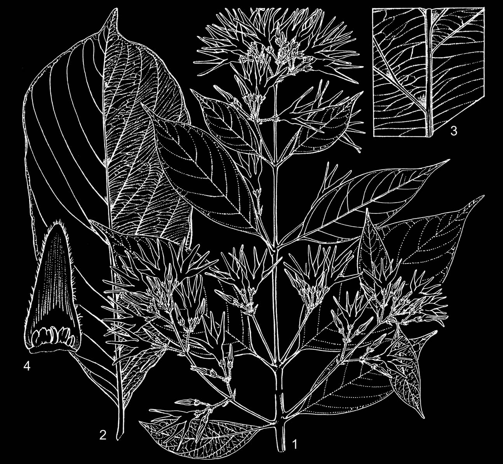
*Caption:* Planche 17 . Baissea welwitschii Baissea calophylla :

---

## Figure 42 (page 50)
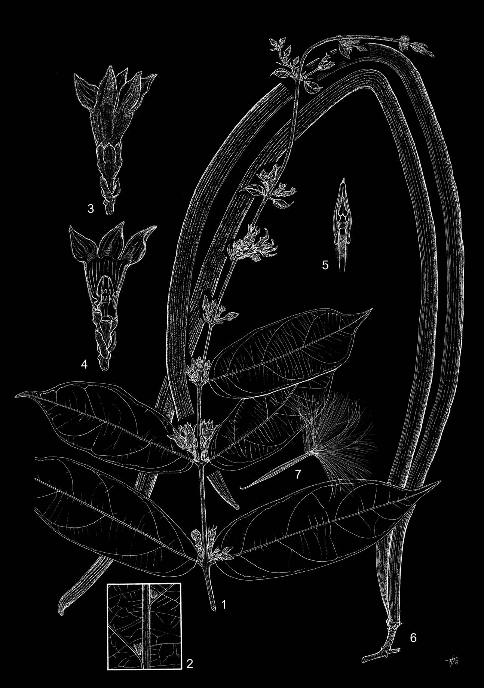
*Caption:* Planche 18 . Baissea campanulata 5DPHDXÀRULIqUHîҀ±'pWDLOGHODIDFHLQIpULHXUHGXOLPEH foliaire, avec domaties (× 2). – 3. Fleur (× 2). – 4. Idem, coupe longitudinale (× 2). – 5. Étamine, vue

---

## Figure 43 (page 53)
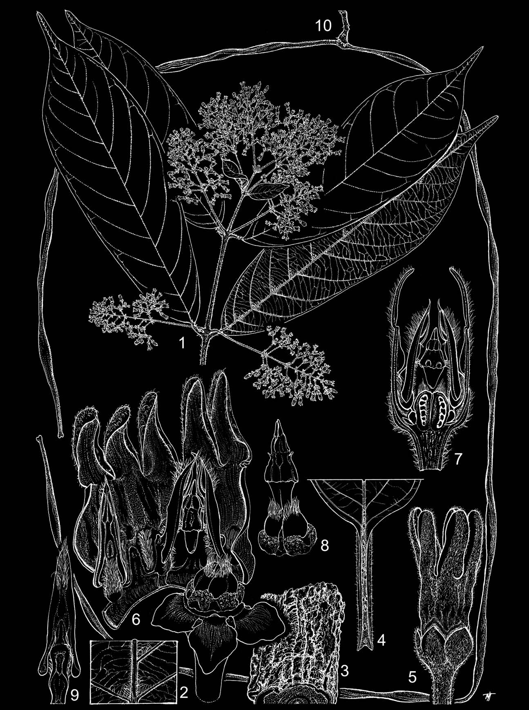
*Caption:* Planche 19 . Baissea gracillima 5DPHDXÀRULIqUHîҀ±'pWDLOGHODIDFHLQIpULHXUHGXOLPEH

---

## Figure 44 (page 55)
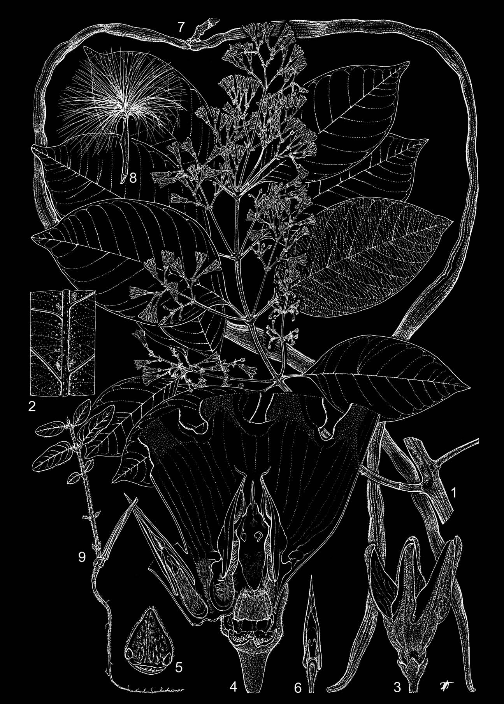
*Caption:* Planche 20 . Baissea leonensis 5DPHDXÀRULIqUHîҀ±'pWDLOGHODIDFHLQIpULHXUHGXOLPEHIR - liaire, avec domaties (× 2) – 3. Fleur (× 4). – 4. Idem, ouverte (× 14). – 5. Lobe du calice, face interne avec (1, 2 : Leeuwenberg et al. 11048 ; 3-6 : Beentje 84 ; 7, 8 : Lisowski 52003 ; 9 : de Koning 5454 ). Dessin par Yuen Fang Tan, Naturalis Biodiversity Center (©), reproduit à partir de van Dilst (1995).

---

## Figure 45 (page 56)
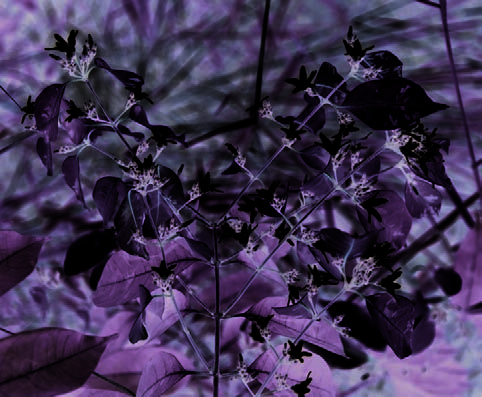
*Caption:* Figure 3 . Baissea leonensis $7LJHVÀRULIqUHV%,QÀRUHVFHQFH&)OHXU± Baissea odorata : D. 7LJHÀRULIqUH± Callichilia bequaertii : E. Fleur à jeune fruit. – Calocrater preussii : F. Port ; G. Fruit ; +,QÀRUHVFHQFH3KRWRVSDU(KRDUQ%LGDXOW$&0WV%LURXJRX*DERQ(5LYLqUH/RXHWVL*DERQ )*0DERXQLp*DERQ&DUHO-RQJNLQG'QRUGHVWGH5REHUWVSRUW/LEpULDHW'DY\,NDEDQJD+

---

## Figure 46 (page 56)
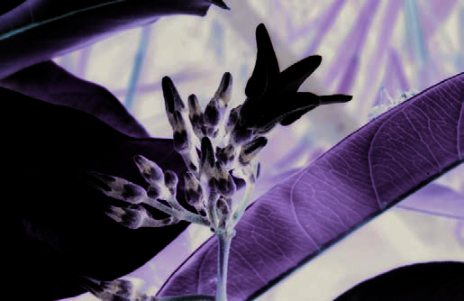
*Caption:* (no caption)

---

## Figure 47 (page 56)
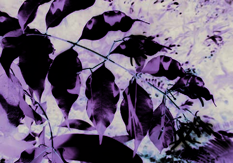
*Caption:* (no caption)

---

## Figure 48 (page 56)
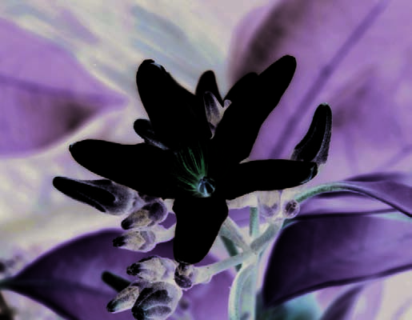
*Caption:* (no caption)

---

## Figure 49 (page 56)
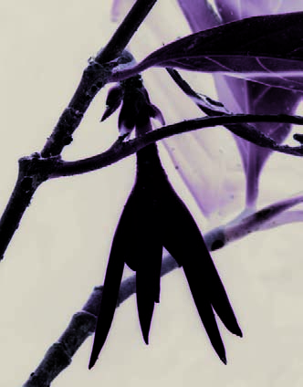
*Caption:* (no caption)

---

## Figure 50 (page 56)
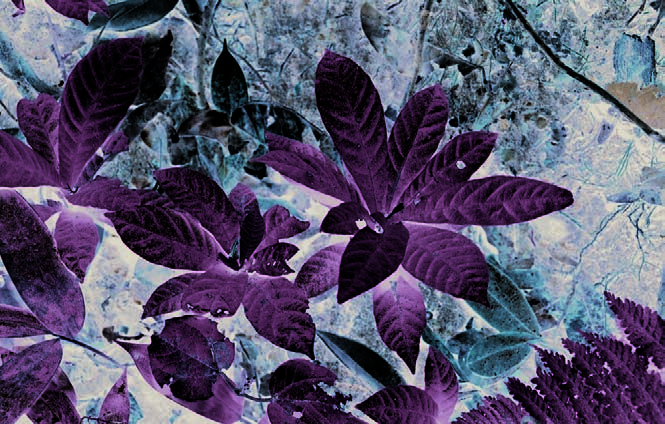
*Caption:* (no caption)

---

## Figure 51 (page 56)
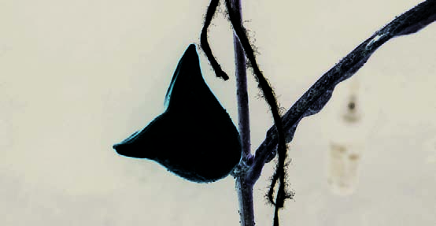
*Caption:* (no caption)

---

## Figure 52 (page 56)
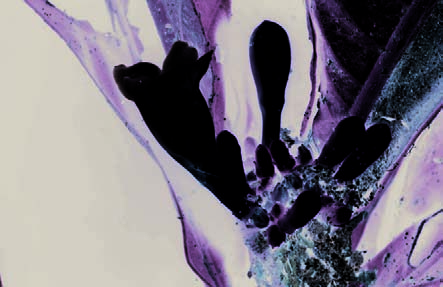
*Caption:* (no caption)

---

## Figure 53 (page 58)
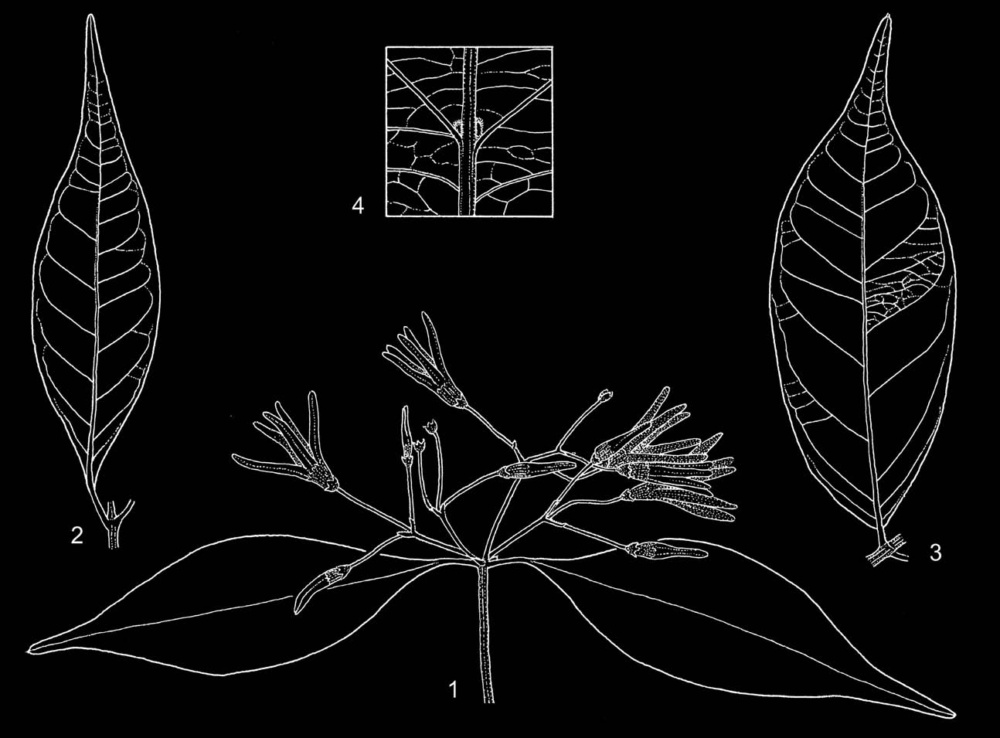
*Caption:* Planche 21 . Baissea odorata 7LJHÀRULIqUH±)HXLOOHV±,GHPGpWDLOGHODIDFHLQIpULHXUH avec domaties. (1, 2 : Voorhoeve 1119 ; 3, 4 : Jongkind 4501 'HVVLQSDU0DUMROHLQ6SLWWHOHU1DWXUDOLV

---

## Figure 54 (page 59)
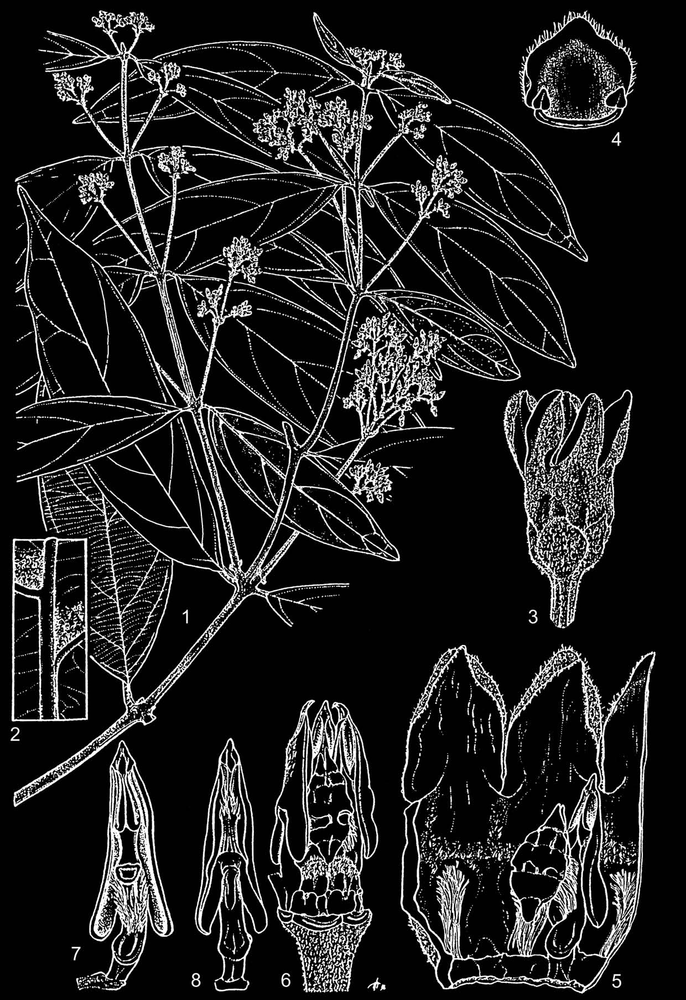
*Caption:* Planche 22 : Baissea subrufa 5DPHDXÀRULIqUHîҀ±)HXLOOHGpWDLOGHODIDFHLQIpULHXUHDYHFGR - maties (× 2). – 3. Fleur (× 8). – 4. Lobe du calice, face interne avec collétères (× 20). – 5. Corolle ouverte, montrant étamines et pistil (× 17). – 6. Pistil et étamines (× 17). – 7. Étamine, face ventrale (× 20). – 8.

---

## Figure 55 (page 62)
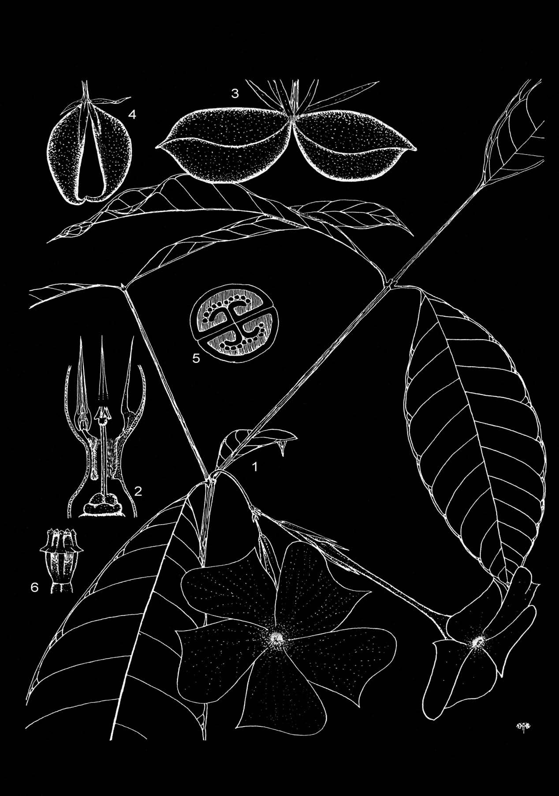
*Caption:* Planche 23 . Callichilia bequaertii 5DPHDXÀRULIqUHîò±&RXSHORQJLWXGLQDOHGHODEDVHGHOD corolle, avec pistil (× 3). – 3, 4. Fruit (× 1). – 5. Ovaire, coupe transversale (× 10). – 6. Tête du pistil (× 8). (1 : W.J.J.O. de Wilde 1940 ; 2 : W. Robyns 486 ; 3 : J. Louis 8902 ; 4 : Germain 8523 ; 5 : W. Robyns 766 ; 6 : Leeuwenberg 9083 ). Dessin par Henk Beentje, Naturalis Biodiversity Center (©), reproduit à partir de Beentje (1978).

---

## Figure 56 (page 64)
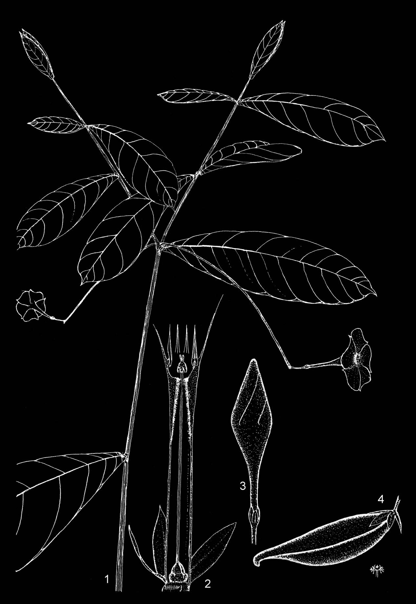
*Caption:* Planche 24 . Callichilia inaequalis 5DPHDXÀRULIqUHîò±&RXSHORQJLWXGLQDOHSDUWLHOOHGHOD

---

## Figure 57 (page 66)
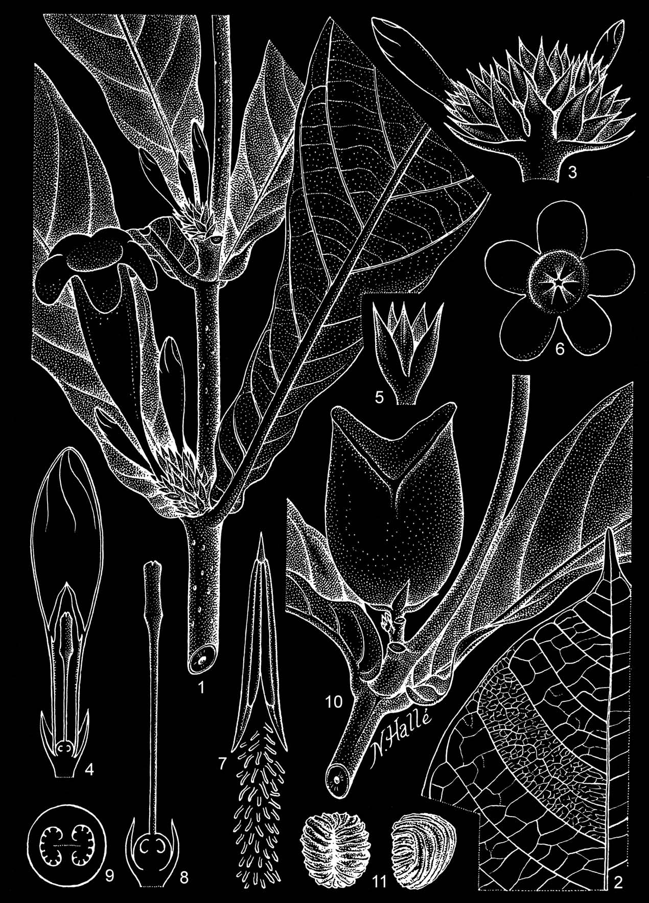
*Caption:* Planche 25 . Calocrater preussii 5DPHDXÀRULIqUH±1HUYDWLRQHWVRPPHWGXOLPEHIROLDLUHîҀ± ,QÀRUHVFHQFHSpGRQFXOHPP±&RXSHVFKpPDWLTXHGXERXWRQ±&DOLFHjOREHVORQJVGHPP – 6. Corolle épanouie, vue du dessus. – 7. Anthère sessile et pubescence infrastaminale. – 8. Pistil à l’an- thèse, ovaire, coupe longitudinale. – 9. Ovaire, coupe transversale (diam. 2,2 mm). – 10. Fruit mûr. – 11.

---

## Figure 58 (page 68)
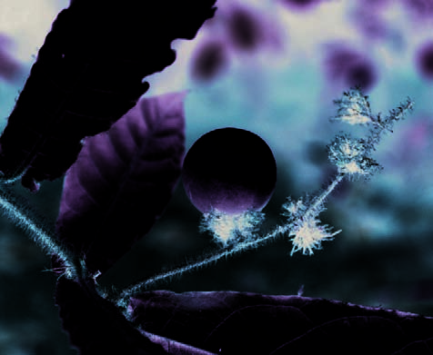
*Caption:* Figure 4 . Catharanthus roseus $3ODQWHÀHXULH± Clitandra cymulosa %,QÀRUHVFHQFH&)UXLWVHQ coupe longitudinale. – &ULRFHUDVGLSODGHQLLÀRUXV ',QÀRUHVFHQFH()OHXUYXHGXGHVVXV))UXLW – Dictyophleba setosa *7LJHIUXFWLIqUH3KRWRVSDU/XFLXV2XSD$$IULTXHGX6XG1LFRODV7H[LHU %0RQWV%LURXJRX*DERQ0DULH&DNXSHZD)XQGLNR&5pSGpPGX&RQJRHW(KDRUQ%LGDXOW ')31$NDQGD*DERQ*VXGHVWGX/DF(]DQJD*DERQ

---

## Figure 59 (page 68)
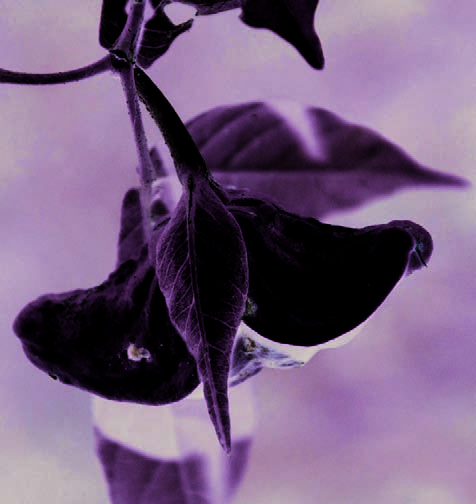
*Caption:* (no caption)

---

## Figure 60 (page 68)
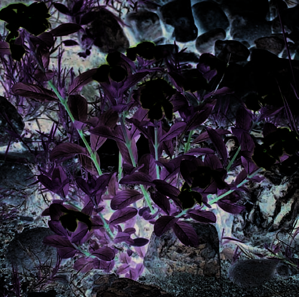
*Caption:* (no caption)

---

## Figure 61 (page 68)
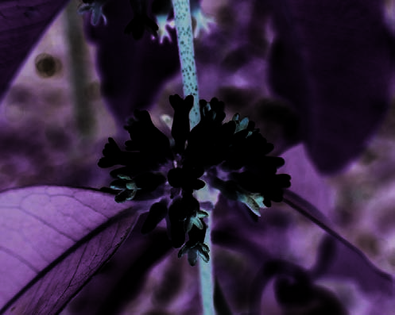
*Caption:* (no caption)

---

## Figure 62 (page 68)
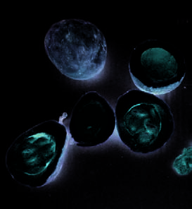
*Caption:* (no caption)

---

## Figure 63 (page 68)
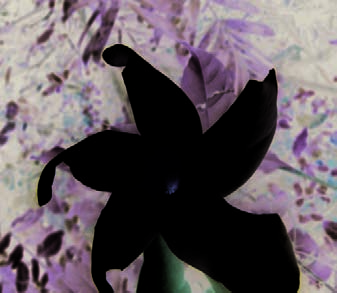
*Caption:* (no caption)

---

## Figure 64 (page 68)
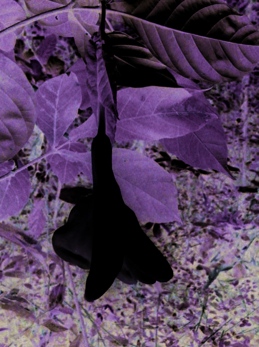
*Caption:* (no caption)

---

## Figure 65 (page 70)
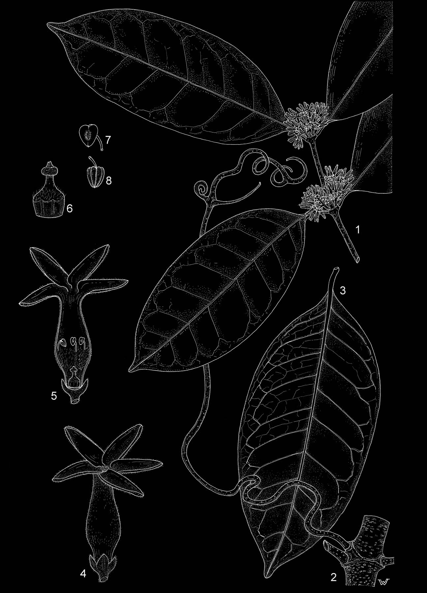
*Caption:* Planche 26 . Clitandra cymulosa 5DPHDXÀRULIqUHîҀ±1°XGDYHFYULOOHîҀ±)HXLOOH ventrale et dorsale d’une étamine (× 18). (1, 4-8 : Hart 282 ; 2 : J.J.F.E. de Wilde 8236 ; 3 : Staner 1341 ).

---

## Figure 66 (page 72)
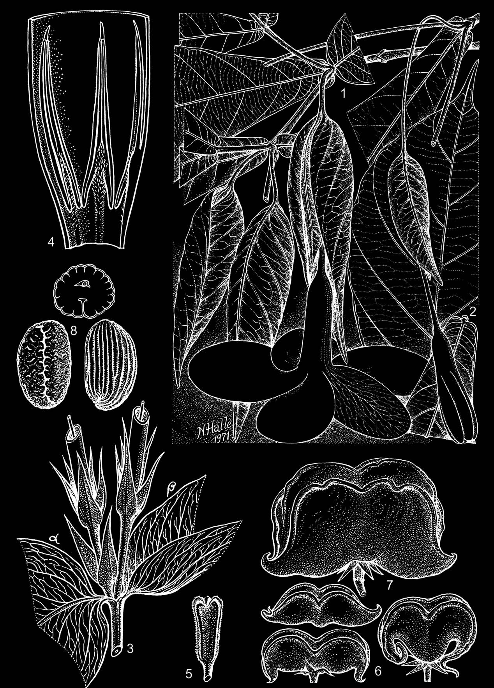
*Caption:* Planche 27 . &ULRFHUDV GLSODGHQLLÀRUXV 5DPHDX[ j LQÀRUHVFHQFHV XQLÀRUHV DYHF LQYROXFUH ± )HXLOOH±,QÀRUHVFHQFHELÀRUHLQYROXFUHVpWDOpVHWÀHXUVFRXSpHVî±eWDPLQHVî±7rWH du pistil (× 4). – 6. Jeunes fruits (× ϰ ). – 7. Fruit mûr (× ϰ ). – 8. Graine, face dorsale (gauche), ventrale (droite) et coupe transversale (× 2½). (1, 2 : Le Testu 5218 & Klaine 1789 ; 3, 4 : Le Testu 7133 ; 5, 6 :

---

## Figure 67 (page 74)
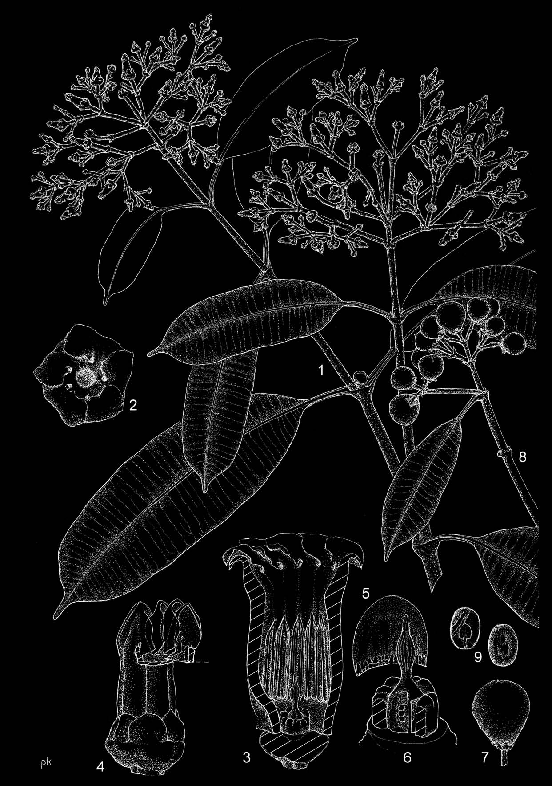
*Caption:* Planche 28 . Cyclocotyla congolensis )OHXURXYHUWHFDOLFHUHWLUpî±%RXWRQÀRUDOSDUWLHOOHPHQWRXYHUWî±/REHGXFDOLFHIDFH

---

## Figure 68 (page 75)
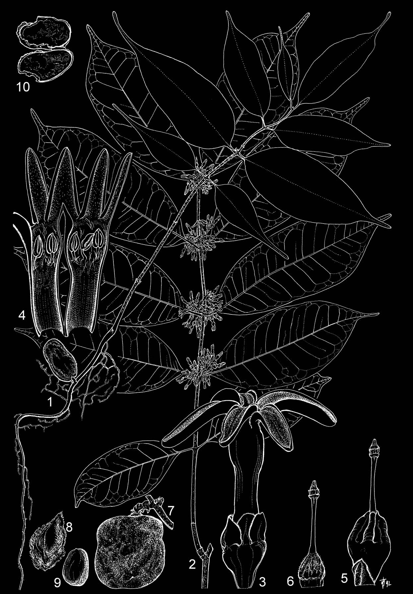
*Caption:* Planche 29 . Cylindropsis parvifolia

---

## Figure 69 (page 78)
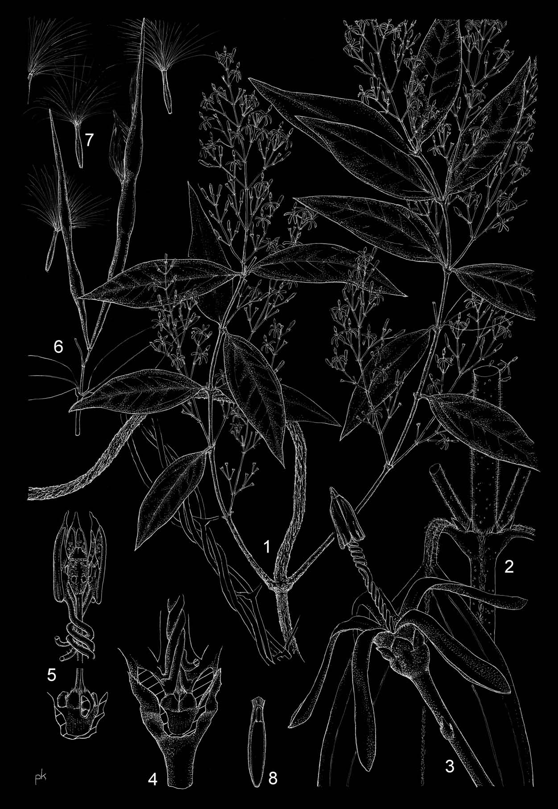
*Caption:* Planche 30 . Dewevrella cochliostema 5DPHDXÀRULIqUHîҀ±$LVVHOOHIROLDLUHDYHFFROOpWqUHV î±)OHXUî±%DVHGHODÀHXUFRXSHORQJLWXGLQDOHPRQWUDQWOHGLVTXHOREpî± 3LVWLOWrWHGXSLVWLOHWWURLVpWDPLQHVî±)UXLWîҀ±*UDLQHVîҀ±'pWDLOGHODJUDLQH et de l’embryon (× ¾). (1-2 : J. Louis 5540 ; 3-5 : J. Louis 12857 ; 6-8 : J. Louis 2103 ). Dessin par Piet

---

## Figure 70 (page 80)
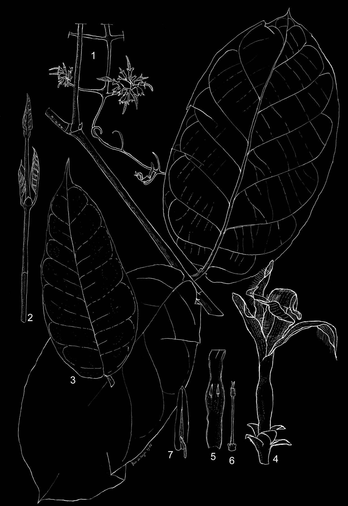
*Caption:* Planche 31 . Dictyophleba ochracea 5DPHDXÀRULIqUHî±-HXQHSRXVVHDYHFVWLSXOHVî±

---

## Figure 71 (page 82)
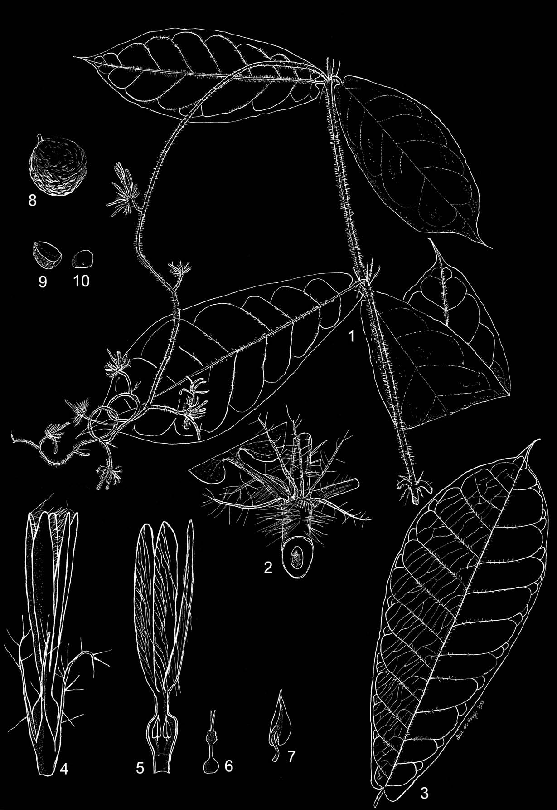
*Caption:* Planche 32 . Dictyophleba setosa 5DPHDX ÀRULIqUH ± 1°XG G¶XQ UDPHDX DYHF VWLSXOHV (× 10). – 3. Feuille (× 1). – 4. Fleur (× 10). – 5. Corolle ouverte (× 10). – 6. Pistil (× 10). – 7. Étamine, vue dorsale (× 20). – 8. Fruit (× 1). – 9, 10. Graine (× 1). (1 : Bos 5390 & Satabié 478 ; 2, 3 : Bos 5390 ; 4-7 : Satabié 478 ; 8-10 : J.J.F.E. de Wilde 7810 ). Dessin par Ben de Hoogh, Naturalis Biodiversity Center (©), reproduit à partir de de Hoogh (1989).

---

## Figure 72 (page 83)
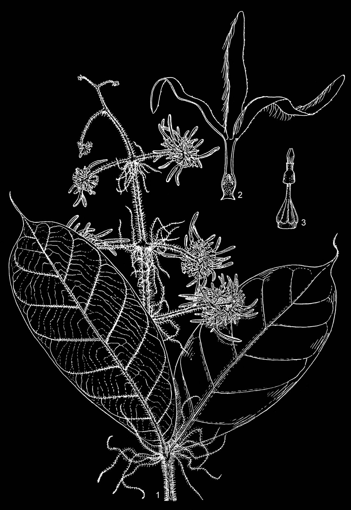
*Caption:* Planche 33 . Dictyophleba stipulosa 5DPHDXÀRULIqUHîҀ±&RUROOHFRXSHORQJLWXGLQDOHî – 3. Pistil (× 10). (1, 3 : Le Testu 6396 ; 2 : Le Testu 7347bis 'HVVLQSDU*XLGR03LFKRQ0XVpXP national d’Histoire naturelle, Paris (©), adapté et reproduit avec permission à partir de Pichon (1953).

---

## Figure 73 (page 84)
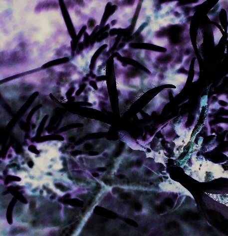
*Caption:* Figure 5 . Dictyophleba stipulosa $,QÀRUHVFHQFH%)HXLOOHVHWVWLSXOHV± Funtumia africana : C. ,QÀRUHVFHQFHHQERXWRQV',QÀRUHVFHQFH()HXLOOHIDFHLQIpULHXUH± +RODUUKHQDÀRULEXQGD : F. Tige

---

## Figure 74 (page 84)
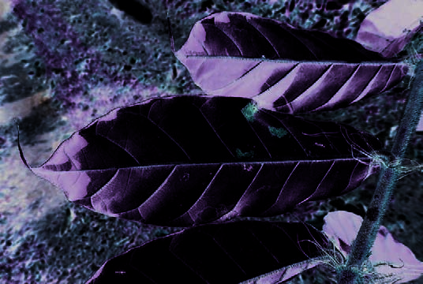
*Caption:* (no caption)

---

## Figure 75 (page 84)
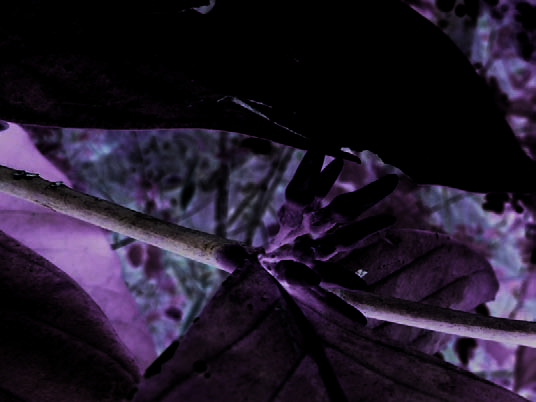
*Caption:* (no caption)

---

## Figure 76 (page 84)

*Caption:* (no caption)

---

## Figure 77 (page 84)
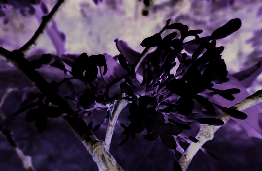
*Caption:* (no caption)

---

## Figure 78 (page 84)
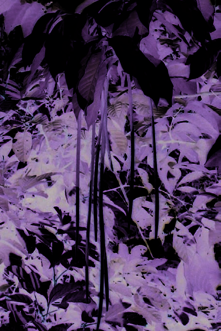
*Caption:* (no caption)

---

## Figure 79 (page 84)
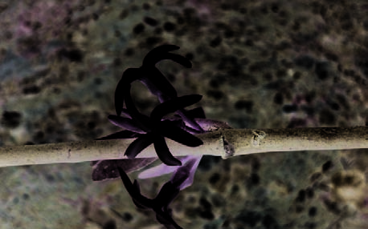
*Caption:* (no caption)

---

## Figure 80 (page 86)
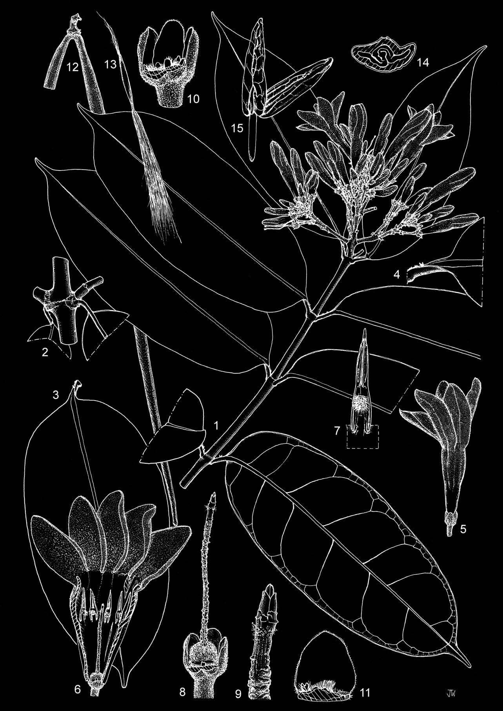
*Caption:* (no caption)

---

## Figure 81 (page 89)
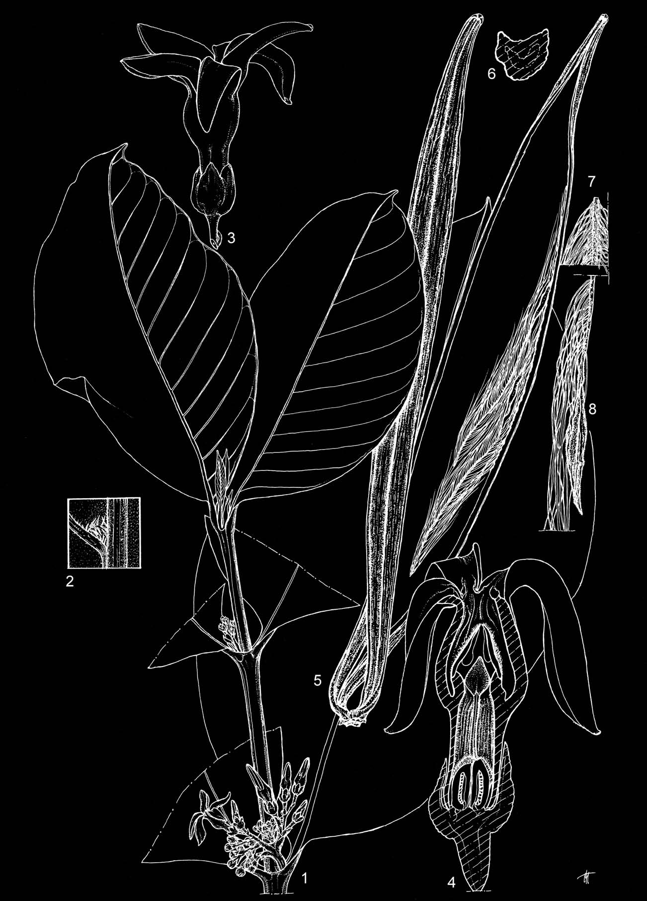
*Caption:* Planche 35 . Funtumia africana 5DPHDX ÀRULIqUH ± 'RPDWLH j O¶DLVVHOOH G¶XQH QHUYXUH

---

## Figure 82 (page 91)
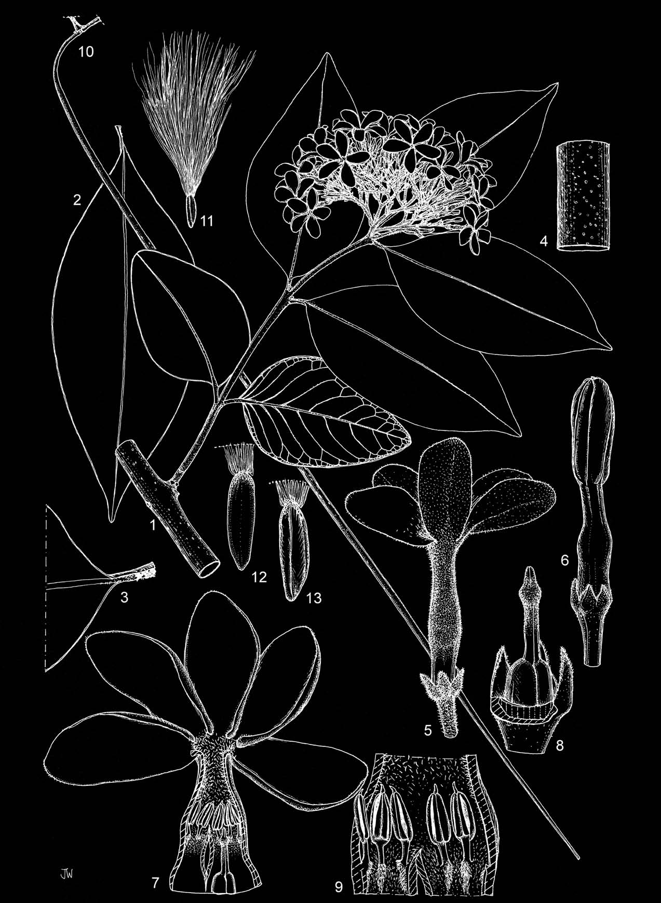
*Caption:* Planche 36 . +RODUUKHQDÀRULEXQGD 5DPHDXÀRULIqUHîҀ±)HXLOOHîҀ±%DVHGHODIHXLOOH

---

## Figure 83 (page 94)
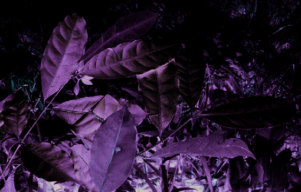
*Caption:* Figure 6 . Hunteria macrosiphon )HXLOODJH % ,QÀRUHVFHQFH ± Hunteria ballayi : C : Fruits. –

---

## Figure 84 (page 94)
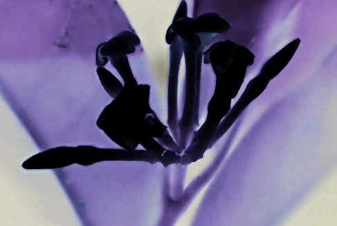
*Caption:* (no caption)

---

## Figure 85 (page 94)
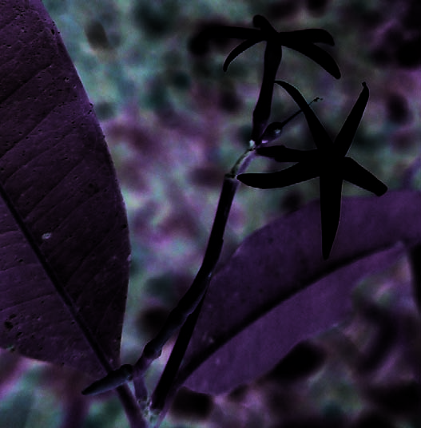
*Caption:* (no caption)

---

## Figure 86 (page 94)
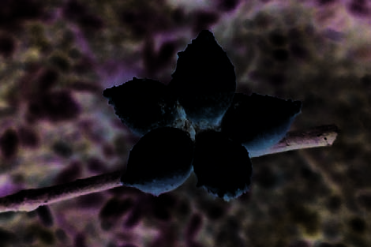
*Caption:* (no caption)

---

## Figure 87 (page 94)
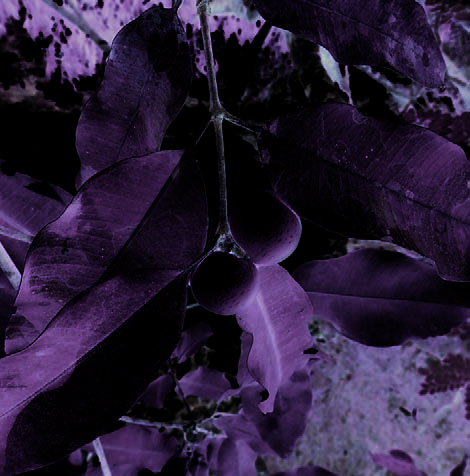
*Caption:* (no caption)

---

## Figure 88 (page 94)
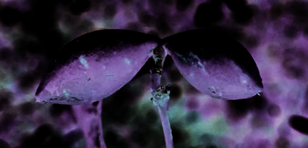
*Caption:* (no caption)

---

## Figure 89 (page 94)
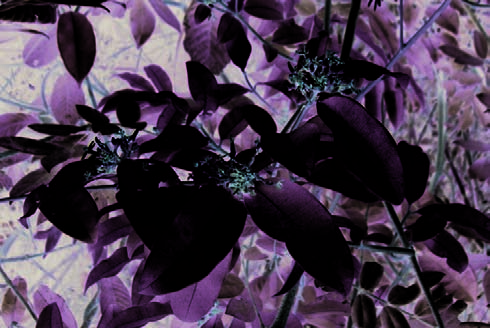
*Caption:* (no caption)

---

## Figure 90 (page 94)
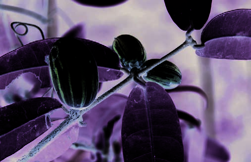
*Caption:* (no caption)

---

## Figure 91 (page 95)
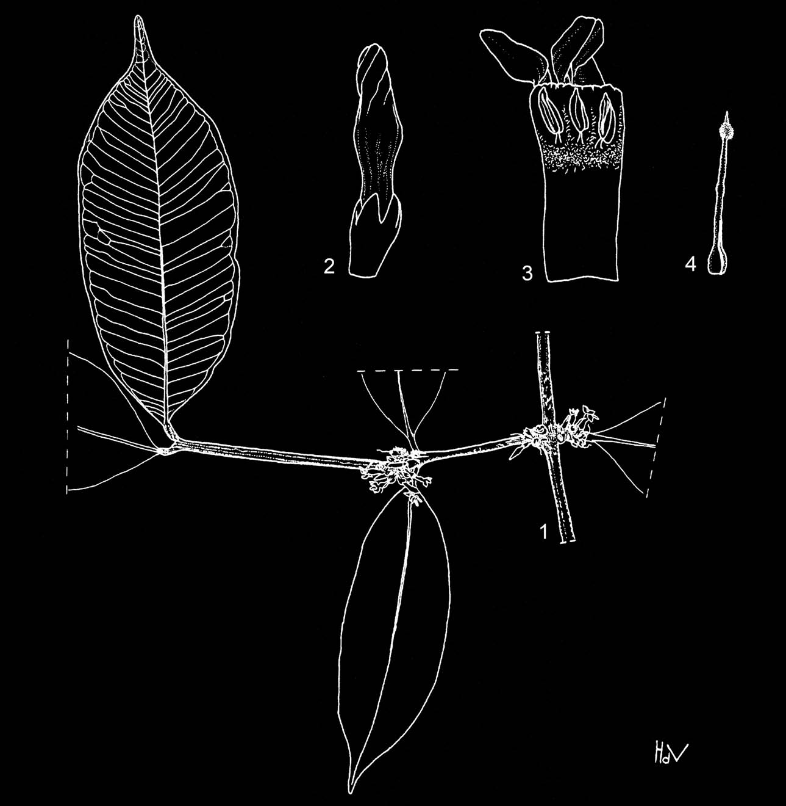
*Caption:* Planche 37 . Hunteria ballayi : 5DPHDXÀRULIqUHîҀ±%RXWRQÀRUDOî±3DUWLHGHODFRUROOH ouverte, avec étamines (× 4). – 4. Pistil (× 4). (1 : Le Testu 8558 ; 2-4 : van der Maesen et al. 5579 ). Des- sin par Hans de Vries, Naturalis Biodiversity Center (©), reproduit à partir de Omino (1996).

---

## Figure 92 (page 97)
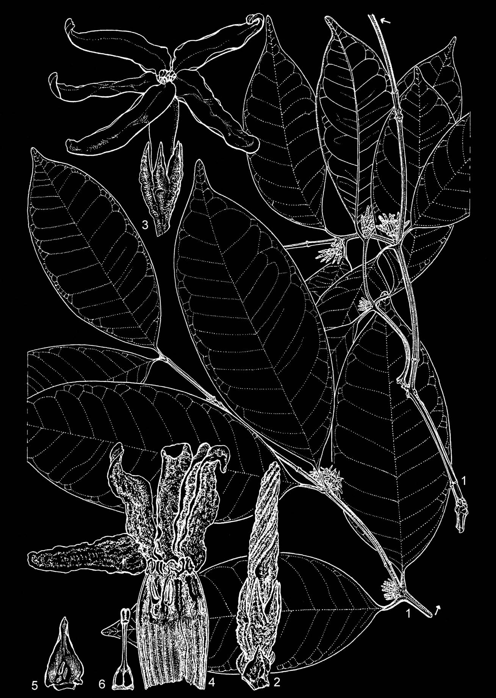
*Caption:* Planche 38 . Hunteria camerunensis (× 10). – 4. Corolle ouverte, avec étamines (× 10). – 5. Lobe du calice, face interne (× 14). – 6. Pistil (× 14). (1-6 : Zenker 1211 ). Dessin par Yuen Fang Tan, Naturalis Biodiversity Center (©), reproduit à partir de Omino (1996).

---

## Figure 93 (page 98)
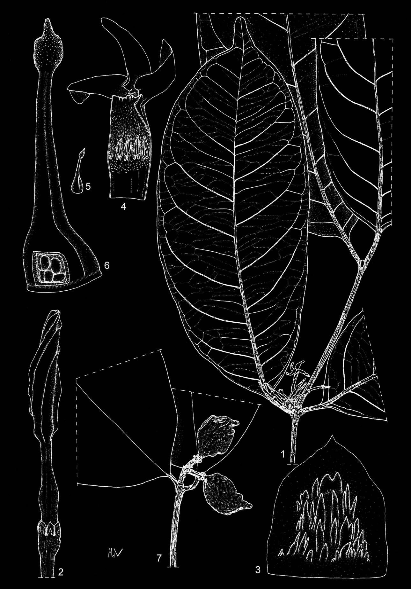
*Caption:* Planche 39 . Hunteria hexaloba 5DPHDXÀRULIqUHîҀ±%RXWRQÀRUDOî±/REHGXFDOLFH face interne (× 30). – 4. Corolle, coupe longitudinale, avec étamines (× 4). – 5. Pistil (× 4). – 6. Idem,

---

## Figure 94 (page 100)
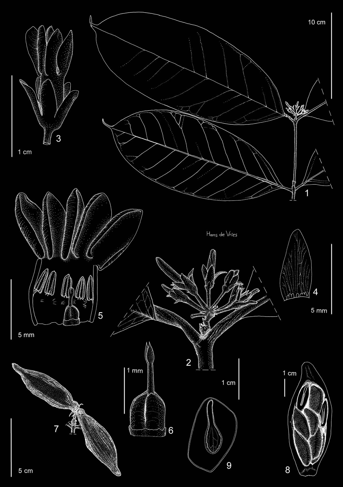
*Caption:* Planche 40 . Hunteria maasiorum 5DPHDXÀRULIqUH±,QÀRUHVFHQFH±)OHXU±/REHGXFDOLFH face interne montrant les collétères. – 5. Corolle ouverte, avec étamines et pistil. – 6. Pistil. – 7. Fruit. – 8. 0pULFDUSHFRXSHWUDQVYHUVDOHPRQWUDQWOHVJUDLQHV±*UDLQHFRXSHWUDQVYHUVDOHPRQWUDQWO¶HPEU\RQ (1-6 : Maas et al. 9964 ; 7-9 : Maas et al. 10415 'HVVLQSDU+DQVGH9ULHV-DUGLQERWDQLTXHGH0HLVH

---

## Figure 95 (page 101)
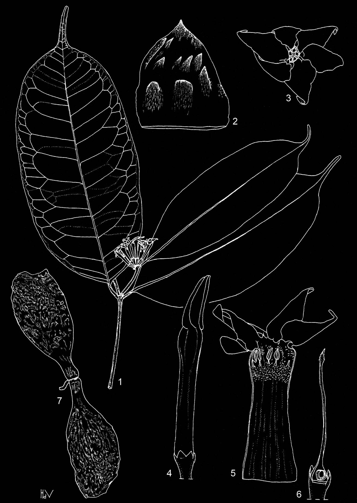
*Caption:* Planche 41 . Hunteria macrosiphon 5DPHDXÀRULIqUHîҀ±/REHGXFDOLFHIDFHLQWHUQHî± )OHXUYXHGXGHVVXVî±%RXWRQÀRUDOî±,GHPFRUROOHRXYHUWHDYHFpWDPLQHVî±

---

## Figure 96 (page 103)
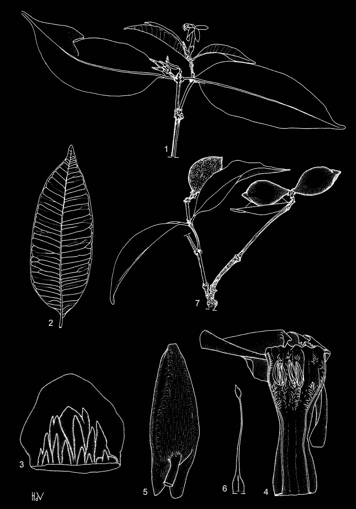
*Caption:* Planche 42 . Hunteria oxyantha 5DPHDXÀRULIqUHîҀ±)HXLOOHIDFHLQIpULHXUHîҀ±/REH du calice, face interne, avec collétères (× 30). – 4. Corolle ouverte, avec étamines (× 4). – 5. Étamine, vue

---

## Figure 97 (page 104)
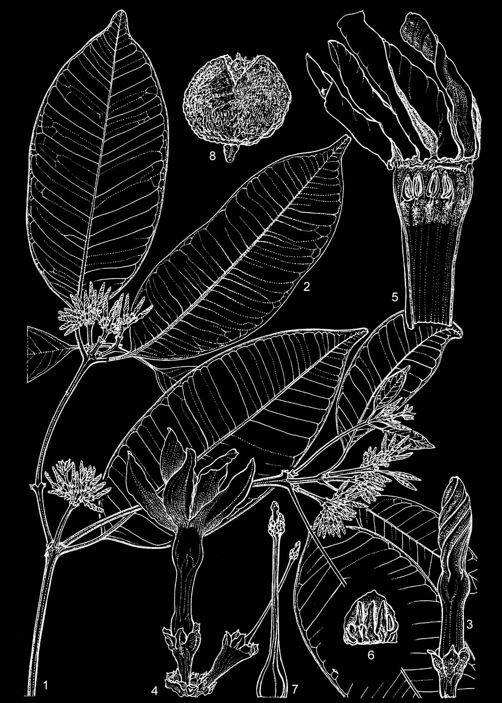
*Caption:* Planche 43 . Hunteria umbellata 5DPHDXÀRULIqUHîҀ±)HXLOOHIDFHLQIpULHXUHîҀ±%RX -

---

## Figure 98 (page 107)
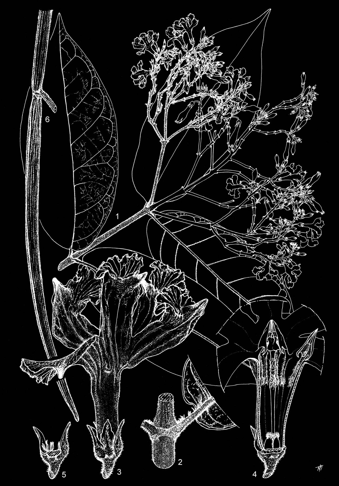
*Caption:* Planche 44 . ,VRQHPDLQIXQGLEXOLÀRUXP 5DPHDXÀRULIqUHîҀ±3pWLROHDYHFFROOpWqUHVî±

---

## Figure 99 (page 112)
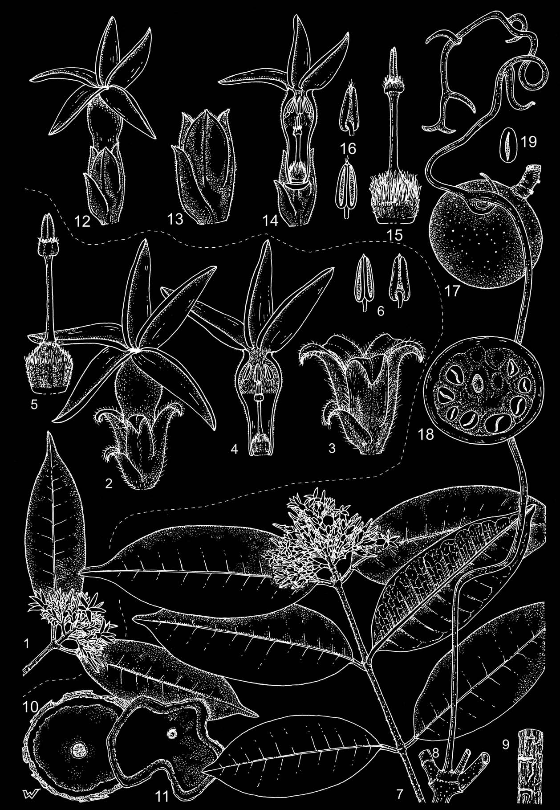
*Caption:* (no caption)

---

## Figure 100 (page 113)
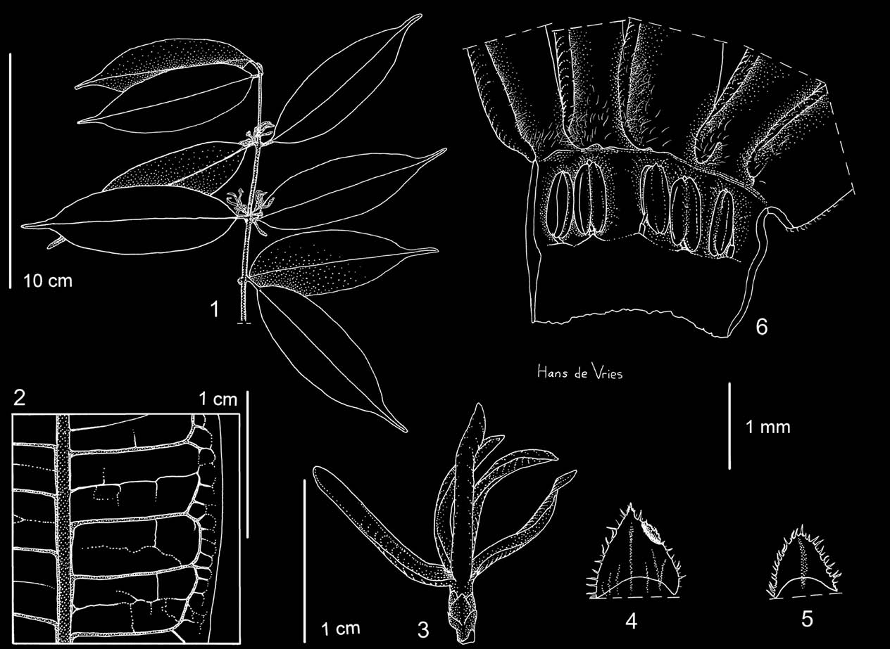
*Caption:* Planche 46 . Landolphia anthonii 5DPHDXÀRULIqUH±)HXLOOHIDFHLQIpULHXUH±)OHXU±/REH du calice, face interne. – 5. Bractée, face inférieure. – 6. Partie de la corolle ouverte, avec étamines. (1-6 :

---

## Figure 101 (page 114)
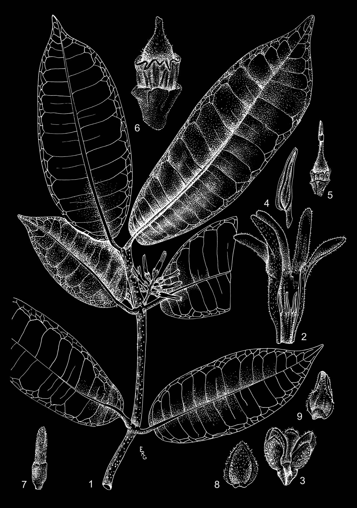
*Caption:* Planche 47 . Landolphia axillaris : 5DPHDXÀRULIqUHîҀ±&RUROOHRXYHUWHDYHFpWDPLQHVî – 3. Calice (× 4). – 4. Étamine ouverte, vue latérale (× 12). – 5. Pistil (× 6). – 6. Ovaire (× 14). – 7. Tête du pistil (× 20). – 8, 9. Lobe du calice, face externe et interne (× 6). (1-9 : Le Testu 1847 ). Dessin par

---

## Figure 102 (page 116)
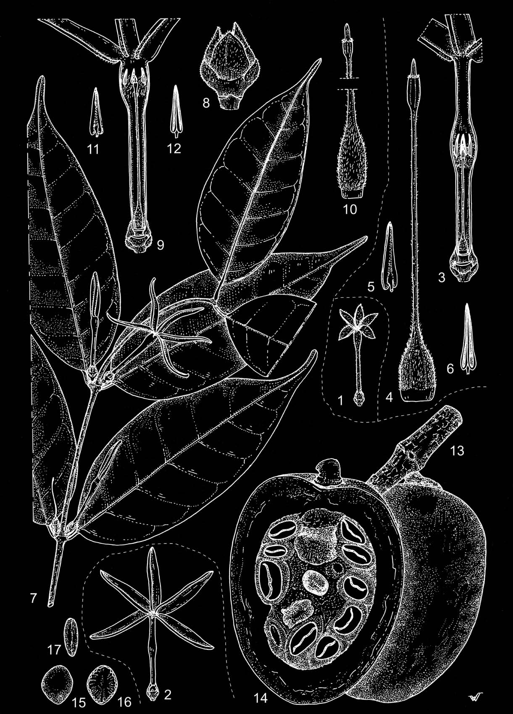
*Caption:* Planche 48 . Landolphia breviloba : 1. Fleur. – Landolphia bruneelii : longitudinale, lobes partiellement coupés (× 2). – 4. Pistil (× 6). – 5, 6. Étamine, vues dorsale et ventrale (× 6). – Landolphia ligustrifolia 5DPHDXÀRULIqUHîҀ±&DOLFHî±)OHXUFRXSHORQJLWXGL -

---

## Figure 103 (page 118)
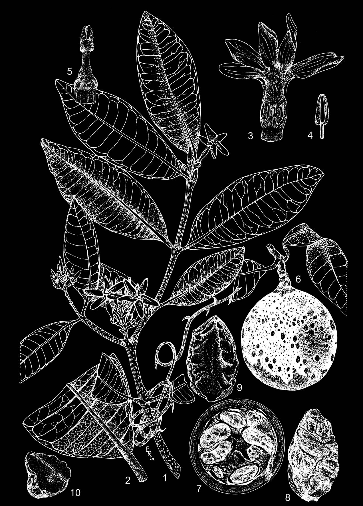
*Caption:* Planche 49 . Landolphia buchananii 5DPHDXÀRULIqUHîҀ±3pWLROHHWEDVHGXOLPEHIDFHLQ - férieure (× 1). – 3. Corolle ouverte, avec étamines (× 4). – 4. Étamine (× 10). – 5. Pistil (× 8). – 6. Fruit îҀ±,GHPFRXSHWUDQVYHUVDOHîҀ±*UDLQHî±,GHPFRXSHORQJLWXGLQDOHHWWUDQV - versale (× 2). (1, 2 : Corner 14-9-1952 ; 3, 4 : Robson 588 ; 5 : J.J.F.E. de Wilde 6355 ; 6-10 : Vuyk 426 ).

---

## Figure 104 (page 119)
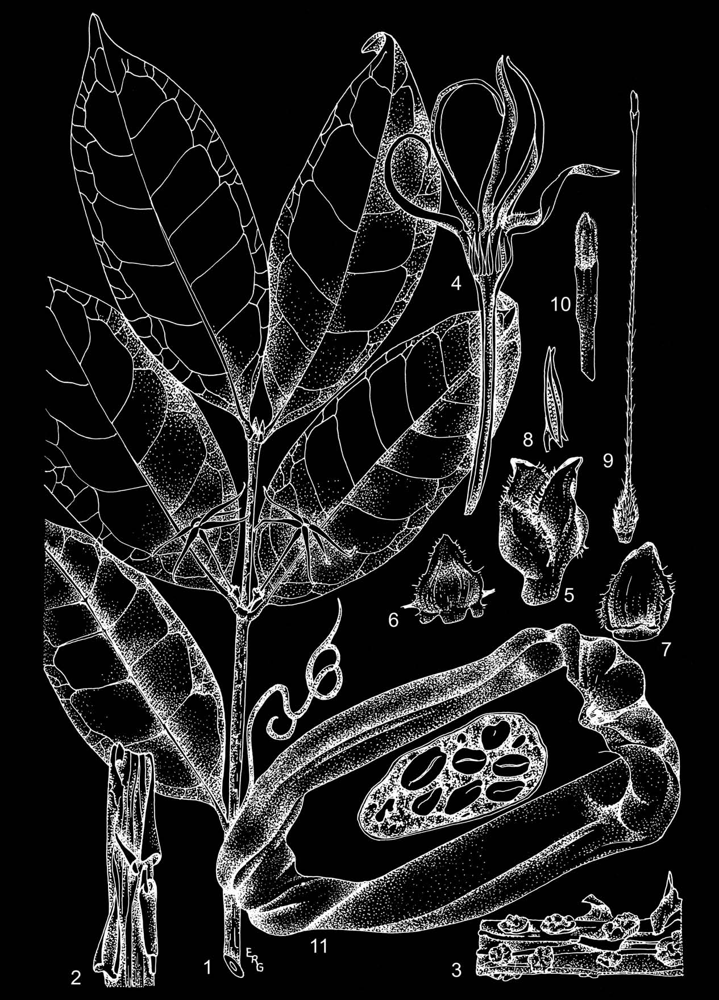
*Caption:* Planche 50 . Landolphia congolensis 5DPHDXÀRULIqUHîҀ±3DUWLHG¶XQUDPHDXjpFRUFHH[IR - liée (× 2). – 3. Idem, avec lenticelles (× 2). – 4. Corolle ouverte, avec étamines (× 4). – 5. Calice (× 6). – 6, 7. Lobe du calice, face externe et interne (× 6). – 8. Étamine ouverte, vue latérale (× 8). – 9. Pistil (× 8). – 7rWHGXSLVWLOî±)UXLWDYHFIHQrWUHVXUGHVJUDLQHVîҀ Le Testu 4125 ; 3 : Bokdam 4221 ; 4 : Leeuwenberg 6712 & Gentil 41 ; 5-10 : Gentil 41 ; 11 : Breteler 1800 , en alcool). Dessin par

---

## Figure 105 (page 124)
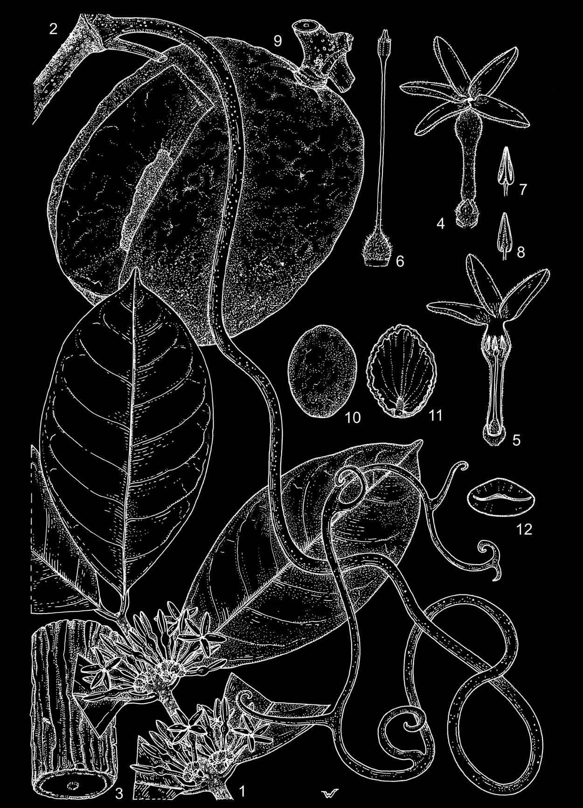
*Caption:* Planche 52 . Landolphia foretiana 5DPHDXÀRULIqUHîҀ±9ULOOHîҀ±3DUWLHG¶XQHYLHLOOH

---

## Figure 106 (page 125)
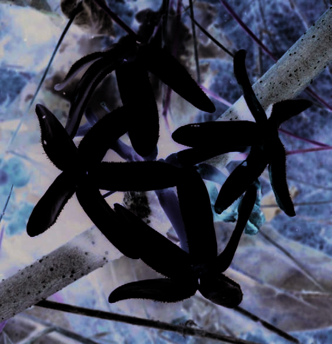
*Caption:* Figure 7 . Landolphia foretiana $,QÀRUHVFHQFH%6RPPHWG¶XQHWLJH± Landolphia incerta : C : ,QÀRUHVFHQFH± Landolphia letestui '7LJHÀRULIqUH(,QÀRUHVFHQFH± Landolphia subrepanda : F :

---

## Figure 107 (page 125)
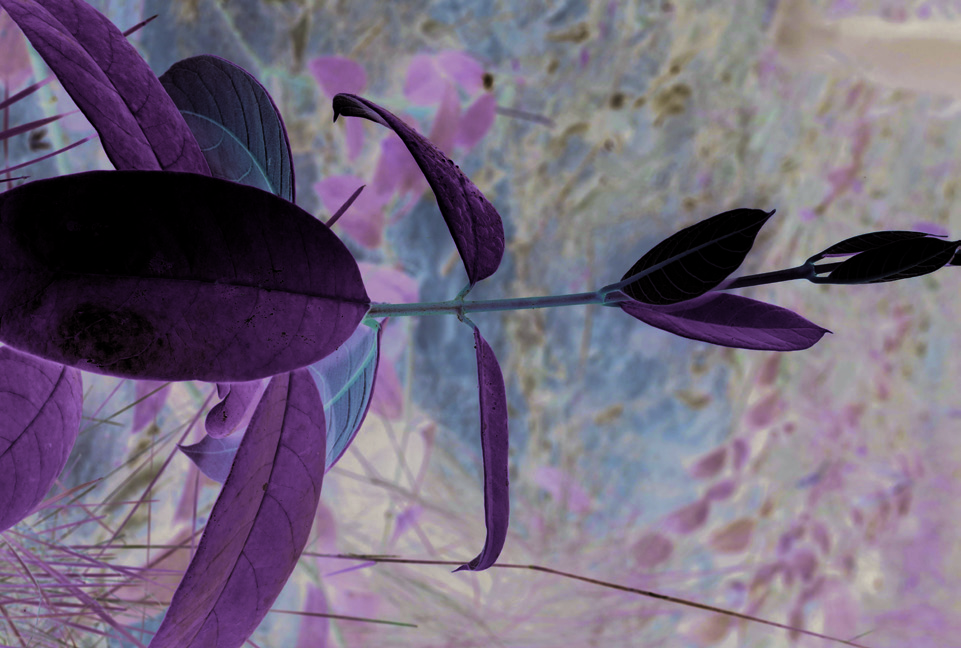
*Caption:* (no caption)

---

## Figure 108 (page 125)
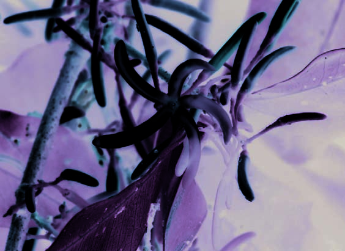
*Caption:* (no caption)

---

## Figure 109 (page 125)
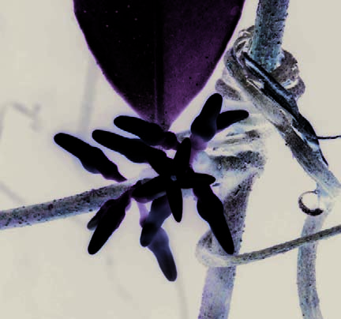
*Caption:* (no caption)

---

## Figure 110 (page 125)
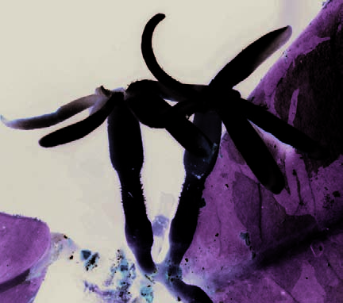
*Caption:* (no caption)

---

## Figure 111 (page 125)
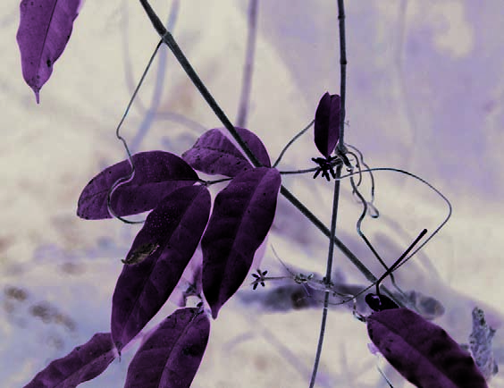
*Caption:* (no caption)

---

## Figure 112 (page 128)
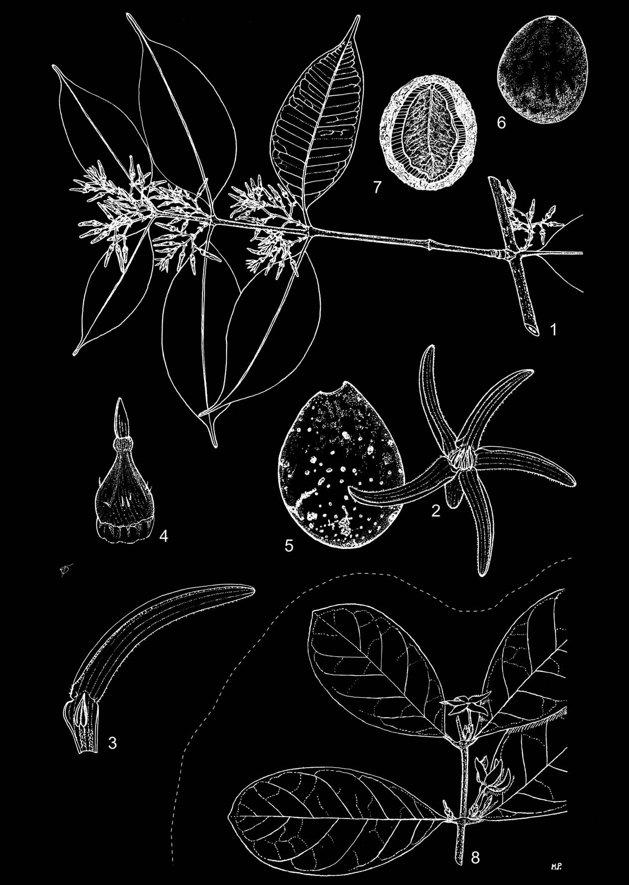
*Caption:* Planche 53 . Landolphia incerta : 5DPHDXÀRULIqUHîҀ±&RUROOHî±3DUWLHGHFRUROOHDYHF étamine (× 6). – 4. Pistil (× 20). – 5. Fruit (× 1). – 6. Graine (× 2). – 7. Idem, coupe longitudinale montrant l’embryon (× 2). – Landolphia glandulosa Leeuwenberg 9027 ; 5-7 :

---

## Figure 113 (page 130)
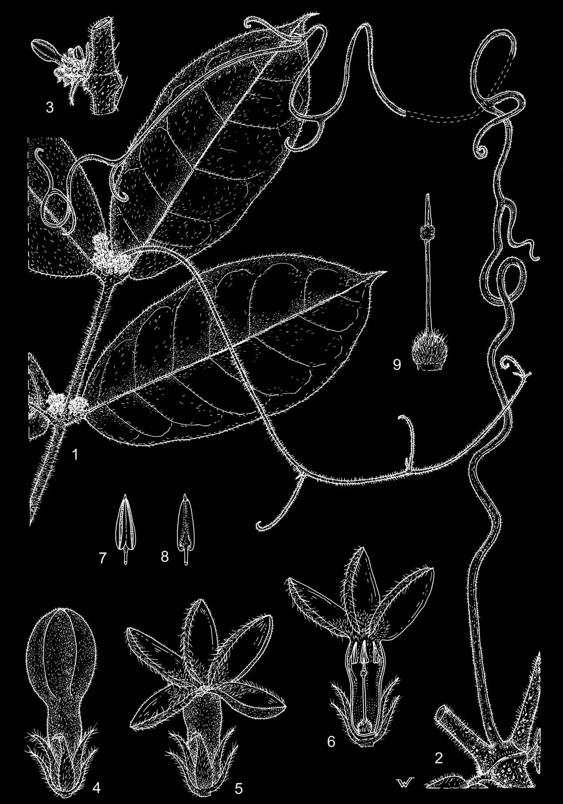
*Caption:* Planche 54 . Landolphia jumellei 5DPHDXÀRULIqUHîҀ±1°XGDYHFXQHYULOOHîҀ±,Q -

---

## Figure 114 (page 131)
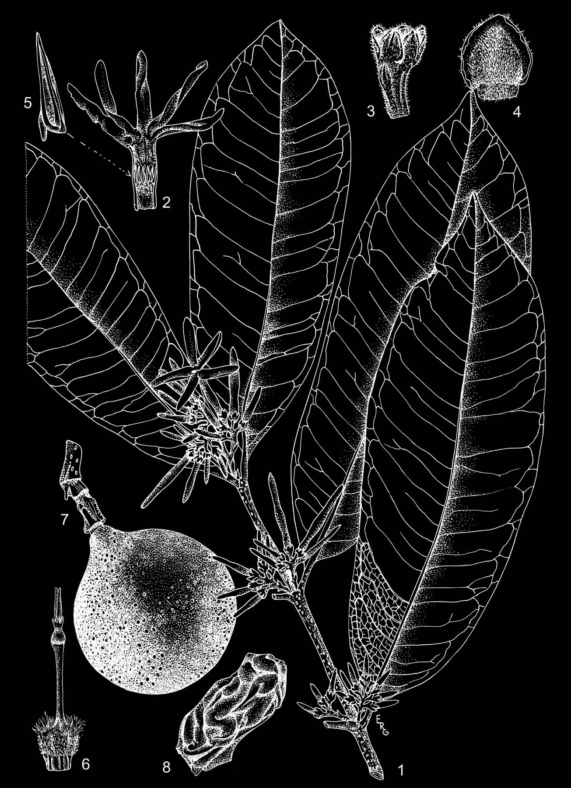
*Caption:* Planche 55 . Landolphia landolphioides 5DPHDXÀRULIqUHîҀ±&RUROOHRXYHUWHDYHFpWDPLQHV (× 1). – 3. Calice (× 2). – 4. Lobe du calice, face externe (× 6). – 5. Étamine ouverte (× 10). – 6. Pistil

---

## Figure 115 (page 133)
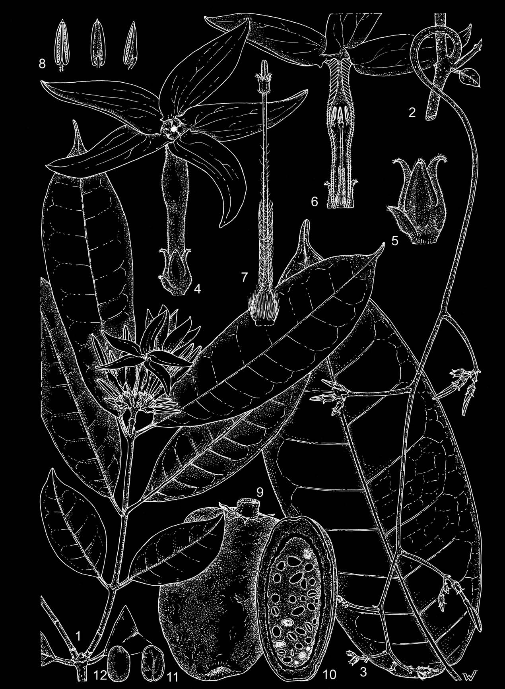
*Caption:* Planche 56 . Landolphia lecomtei 5DPHDXÀRULIqUHîҀ±,QÀRUHVFHQFHHQYULOOHîҀ± )HXLOOHIDFHLQIpULHXUHîҀ±)OHXUî±&DOLFHî±)OHXUFRXSHORQJLWXGLQDOHî±

---

## Figure 116 (page 135)
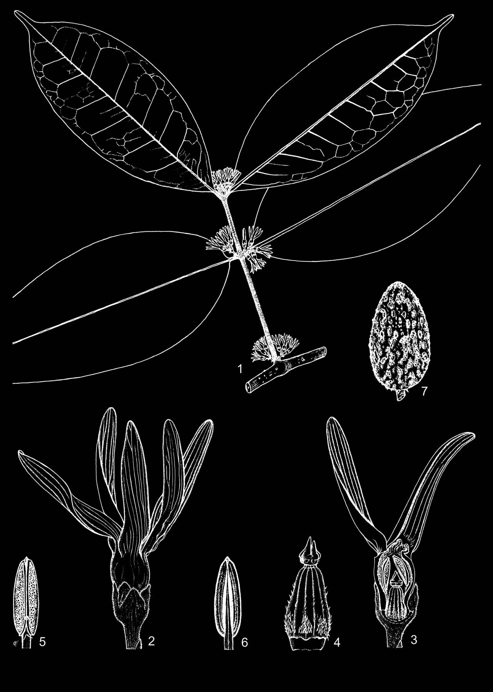
*Caption:* Planche 57 . Landolphia leptantha 5DPHDXÀRULIqUHîҀ±)OHXUî±,GHPFRXSHORQJL - tudinale (× 6). – 4. Pistil (× 20). – 5, 6. Étamine, vues ventrale et dorsale (× 20). – 7. Fruit (× 1). (1-6 :

---

## Figure 117 (page 136)
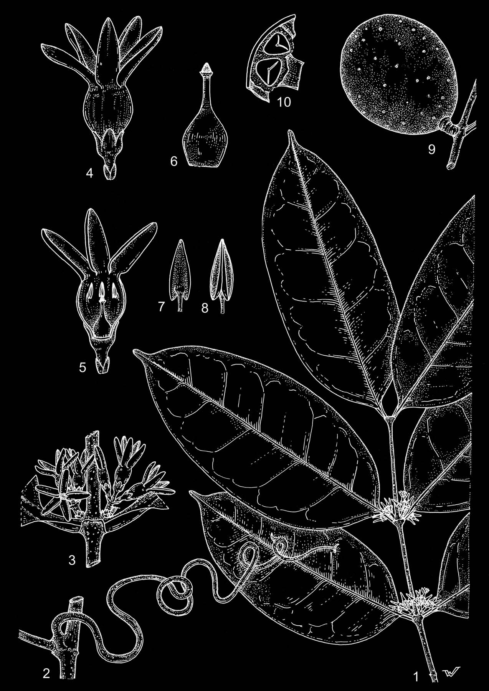
*Caption:* Planche 58 . Landolphia letestui – 4. Fleur (× 6). – 5. Idem, coupe longitudinale (× 6). – 6. Pistil (× 18). – 7, 8. Étamine, vues dorsale et

---

## Figure 118 (page 138)
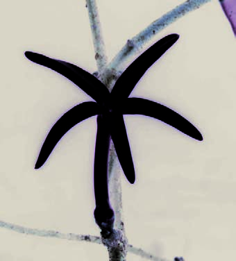
*Caption:* Figure 8 . Landolphia ligustrifolia : A. Fleur ; B. Fruit. – Landolphia pyramidata &,QÀRUHVFHQFH'

---

## Figure 119 (page 138)
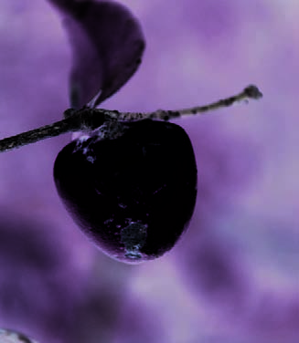
*Caption:* (no caption)

---

## Figure 120 (page 138)
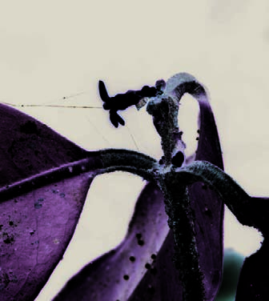
*Caption:* (no caption)

---

## Figure 121 (page 138)
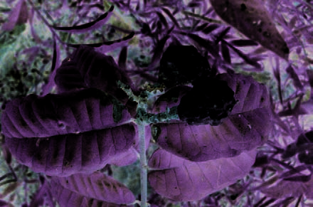
*Caption:* (no caption)

---

## Figure 122 (page 138)
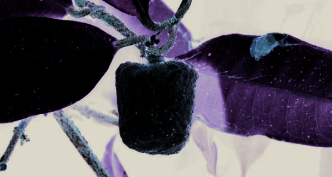
*Caption:* (no caption)

---

## Figure 123 (page 138)
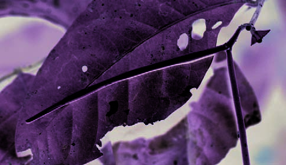
*Caption:* (no caption)

---

## Figure 124 (page 138)
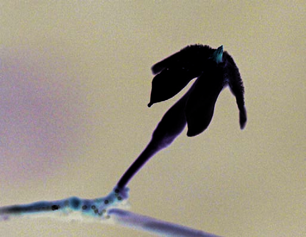
*Caption:* (no caption)

---

## Figure 125 (page 138)
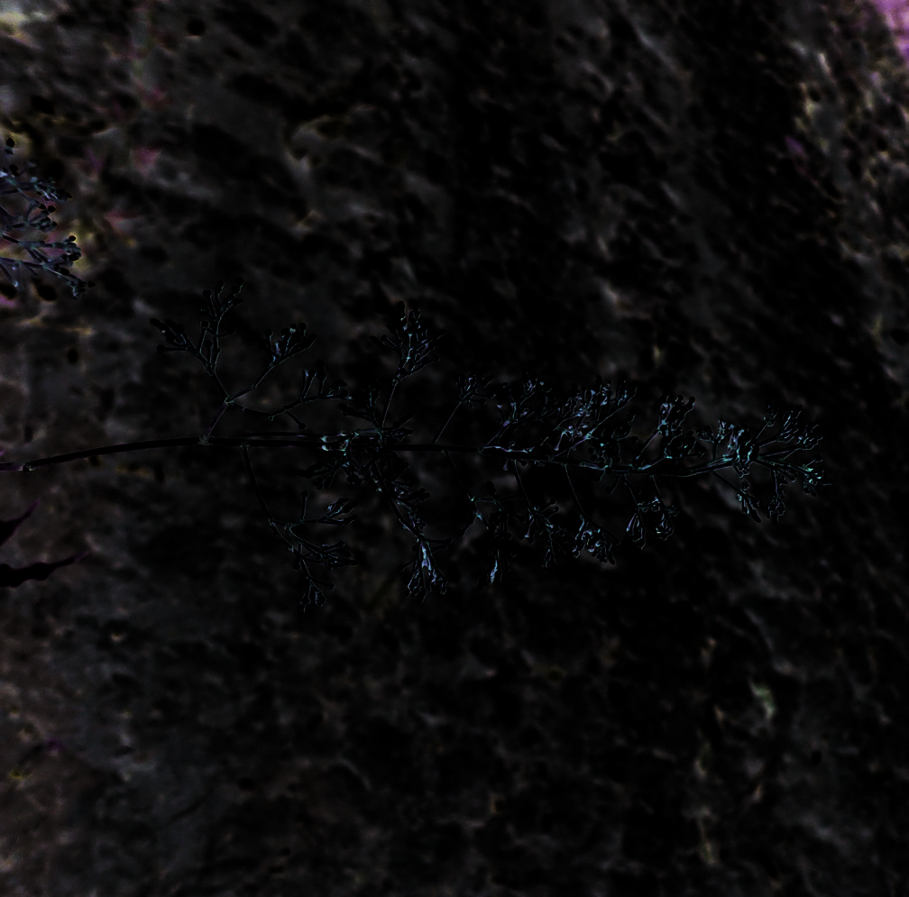
*Caption:* (no caption)

---

## Figure 126 (page 138)
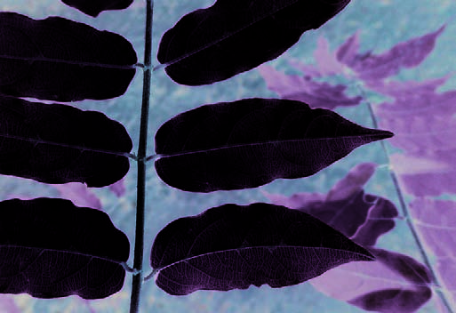
*Caption:* (no caption)

---

## Figure 127 (page 139)
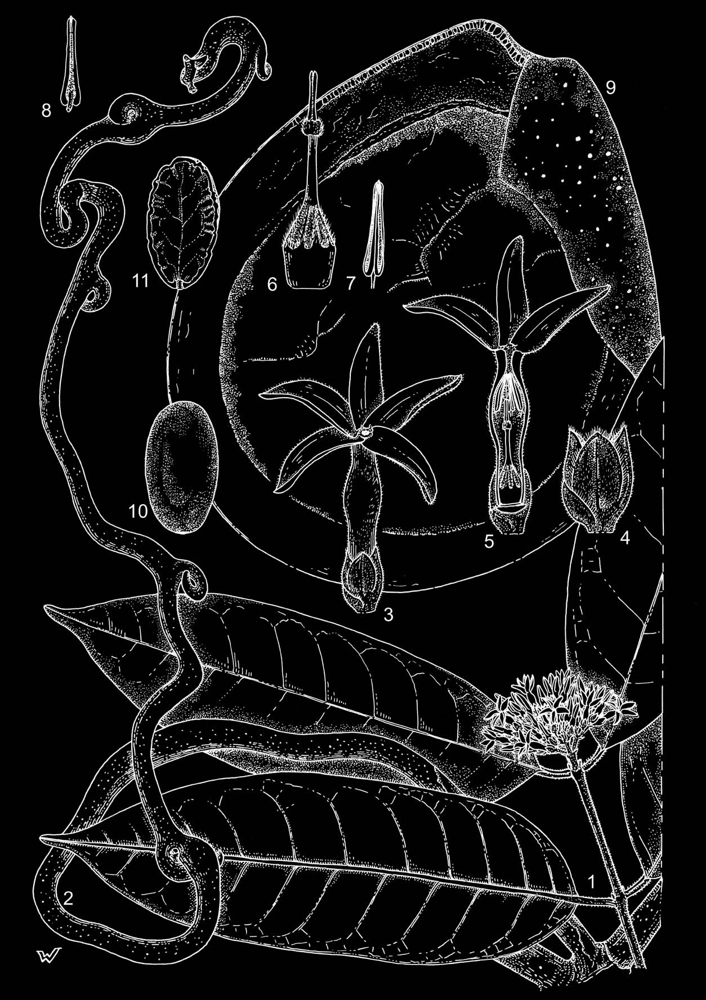
*Caption:* Planche 59 . Landolphia mannii (× 6). – 5. Fleur, coupe longitudinale (× 4). – 6. Pistil (× 8). – 7, 8. Étamine, vues ventrale et dorsale (× 8). ±)UXLWSDUWLHHQVHFWLRQORQJLWXGLQDOHîҀ±*UDLQHîҀ±,GHPVHFWLRQORQJLWXGLQDOHPRQ -

---

## Figure 128 (page 141)
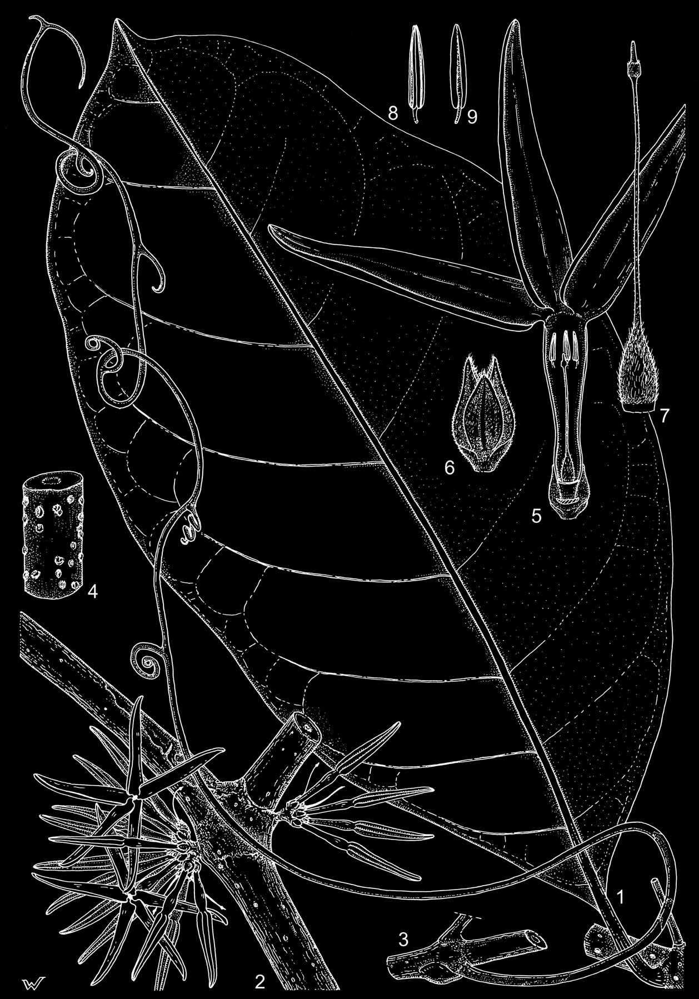
*Caption:* Planche 60 . Landolphia maxima )HXLOOHIDFHLQIpULHXUHîҀ±,QÀRUHVFHQFHVîҀ±9ULOOH îҀ±'pWDLOG¶XQUDPHDXOHQWLFHOOpîҀ±)OHXUFRXSHORQJLWXGLQDOHî±&DOLFHî± 7. Pistil (× 6). – 8, 9. Étamine, vues ventrale et dorsale (× 6). (1, 4 : Leeuwenberg & Persoon 13705 ; 2, 3, 5-9 : Bos 3759 ). Dessin par Wil Wessel-Brand, Naturalis Biodiversity Center (©), reproduit à partir de

---

## Figure 129 (page 142)
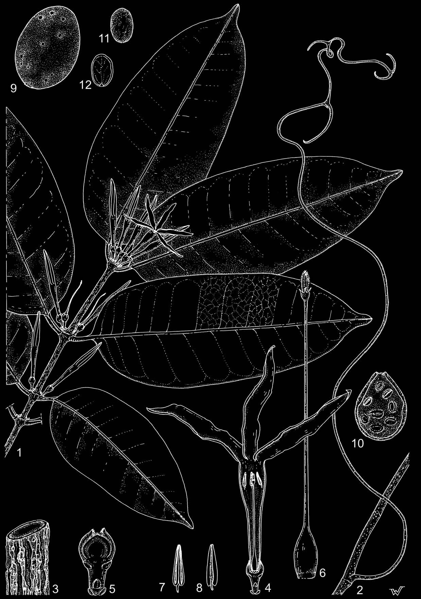
*Caption:* Planche 61 . /DQGROSKLDQRFWLÀRUD : 5DPHDXÀRULIqUHîҀ±9ULOOHîҀ±'pWDLOGHO¶pFRUFH d’un rameau (× 4). – 4. Fleur, coupe longitudinale (× 2). – 5. Calice (× 4). – 6. Pistil (× 6). – 7, 8. Étamine,

---

## Figure 130 (page 144)
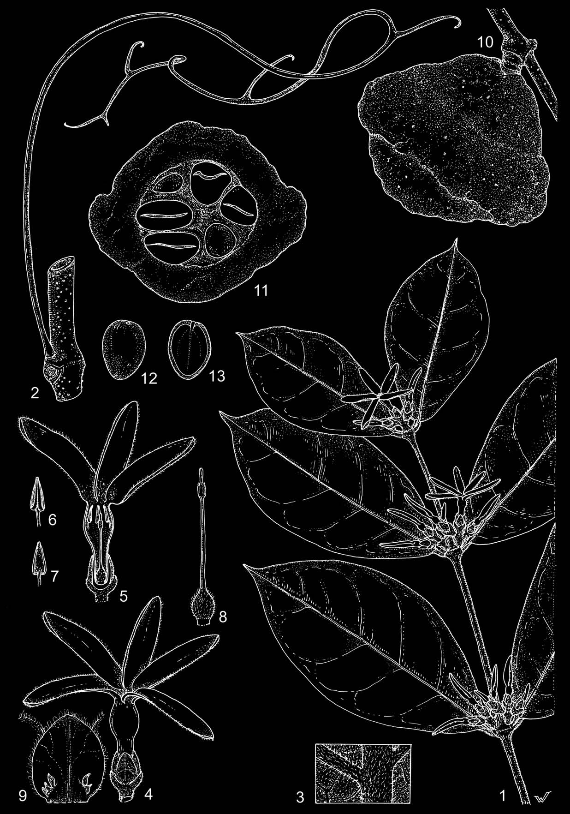
*Caption:* Planche 62 . Landolpia obovata : 5DPHDXÀRULIqUHîҀ±9ULOOHîҀ±'pWDLOGXOLPEHIROLDLUH face inférieure (× 4). – 4. Fleur (× 2). – 5. Idem, coupe longitudinale (× 2). – 6, 7. Étamine, vues ventrale

---

## Figure 131 (page 146)
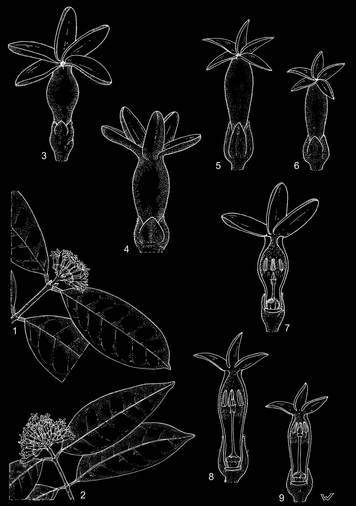
*Caption:* Planche 63 . Landolpia owariensis coupe longitudinale (× 4). (1, 5, 8 : Reitsma 1450 ; 2 : Gossweiler 7616 ; 3, 7 : Leeuwenberg & Persoon 13643 ; 4 : Leeuwenberg & Persoon 13646 ; 6, 9 : Attims 179 ). Dessin par Wil Wessel-Brand, Naturalis

---

## Figure 132 (page 148)
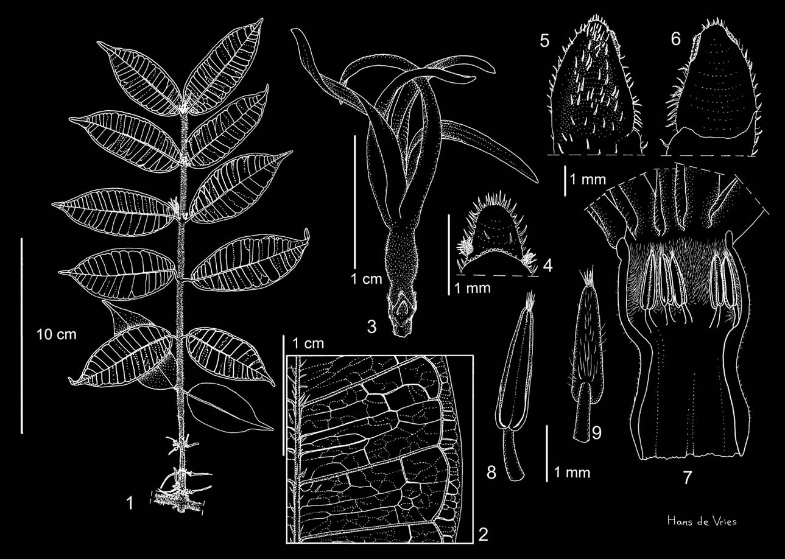
*Caption:* Planche 64 . Landolpia persooniana 5DPHDXÀRULIqUH±'pWDLOGXOLPEHIROLDLUHIDFHLQIpULHXUH± 3. Fleur. – 4. Bractée, face interne. – 5. Lobe du calice, face externe. – 6. Idem, face interne. – 7. Corolle, ouverte. – 8. Étamine, vue ventrale. – 9. Idem, vue dorsale. (1-9 : Wieringa, van Proosdij & Nzabi 7454 ). 'HVVLQSDU+DQVGH9ULHV-DUGLQERWDQLTXHGH0HLVH

---

## Figure 133 (page 149)
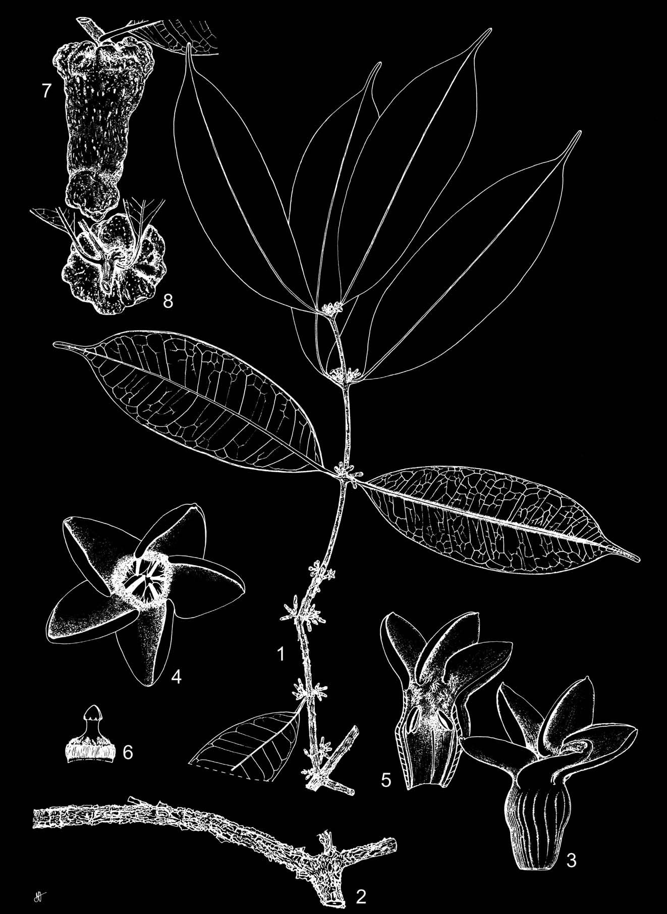
*Caption:* Planche 65 . Landolpia pyramidata 5DPHDXÀRULIqUHîò±5DPHDXPRQWUDQWO¶pFRUFHH[IROLpH (× ½). – 3. Corolle (× 10). – 4. Fleur, vue du dessus (× 10). – 5. Corolle, coupe longitudinale (× 10). – 6.

---

## Figure 134 (page 151)
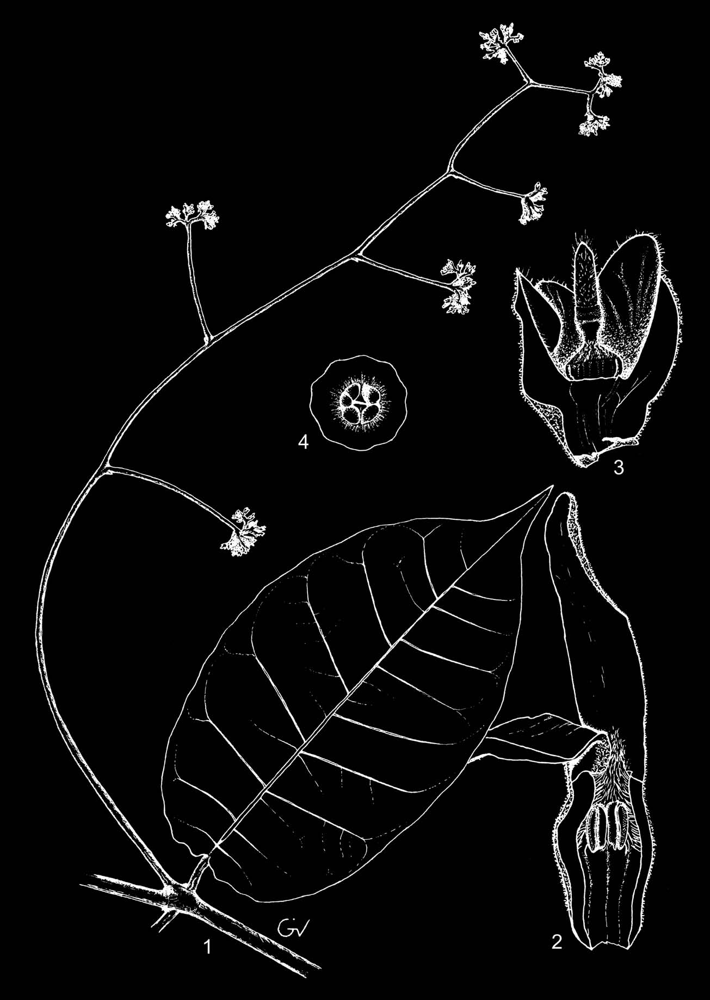
*Caption:* Planche 66 . Landolphia reticulata 5DPHDXjMHXQHLQÀRUHVFHQFHîҀ±&RUROOHFRXSHORQJL -

---

## Figure 135 (page 152)
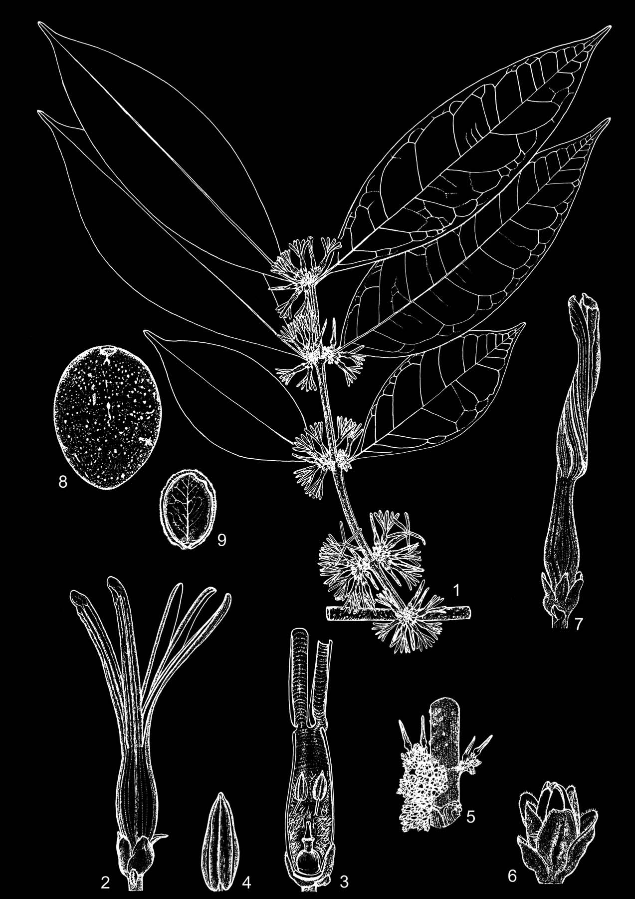
*Caption:* Planche 67 . Landolphia robustior 5DPHDXÀRULIqUHîҀ±)OHXUî±,GHPFRXSHORQJLWX -

---

## Figure 136 (page 154)
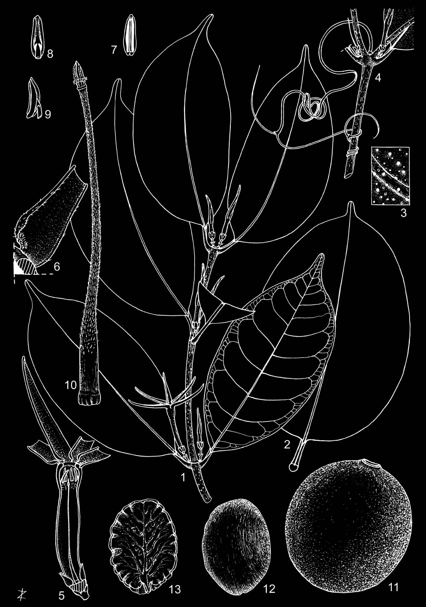
*Caption:* Planche 68 . Landolphia stenogyna : 5DPHDXÀRULIqUHîҀ±)HXLOOHîҀ±'pWDLOGXOLPEH

---

## Figure 137 (page 155)
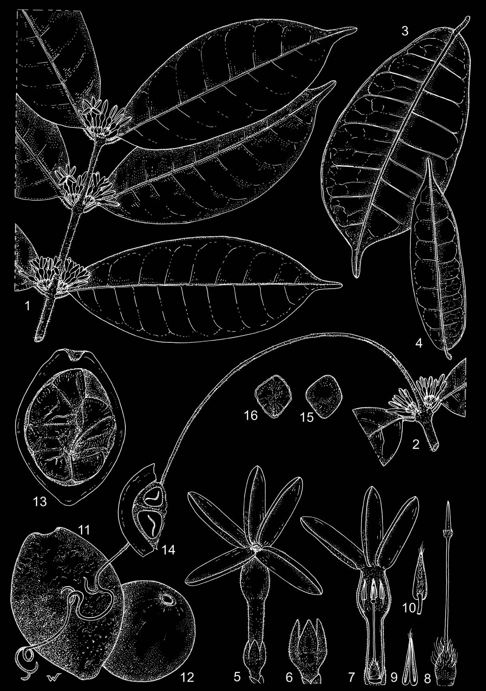
*Caption:* Planche 69 . Landolphia subrepanda )HXLOOHVIDFHLQIpULHXUHîҀ±)OHXUî±&DOLFHî±)OHXUFRXSHORQJLWXGLQDOHî

---

## Figure 138 (page 157)
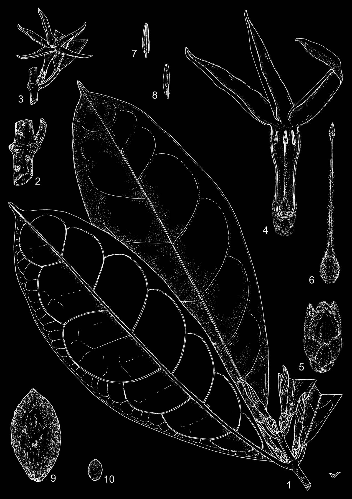
*Caption:* Planche 70 . /DQGROSKLDXQLÀRUD 5DPHDXÀRULIqUHîҀ±3DUWLHG¶XQUDPHDXîҀ±)OHXU

---

## Figure 139 (page 158)
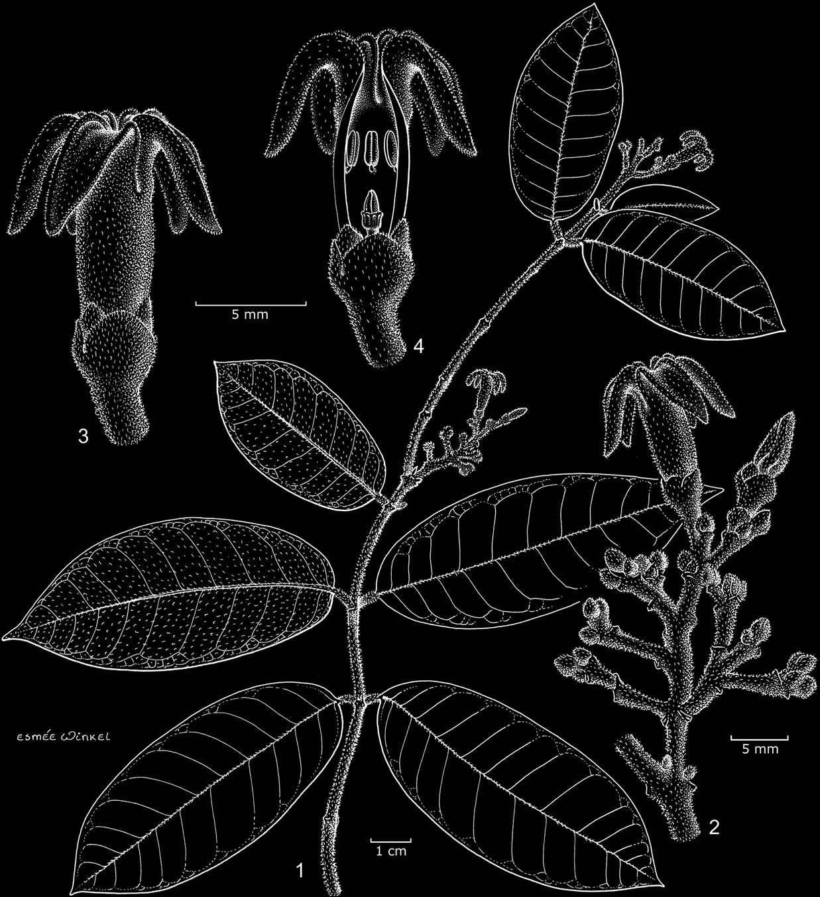
*Caption:* Planche 71 . Landolphia verrucosa 5DPHDXÀRULIqUH±,QÀRUHVFHQFH±)OHXU±,GHPFRUROOH en coupe longitudinale. (1-4 : Breteler, Jongkind & Wieringa 11133 ). Dessin par Esmée Winkel, Naturalis

---

## Figure 140 (page 160)
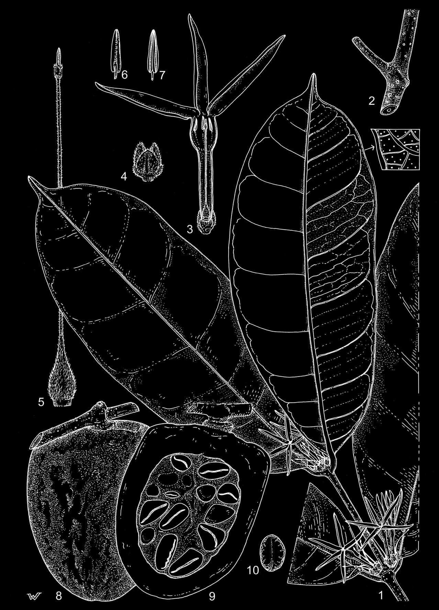
*Caption:* Planche 72 . Landolphia violacea : 5DPHDXÀRULIqUHîҀDYHFGpWDLOGXOLPEHIROLDLUHIDFHLQIpULHXUH î±3DUWLHG¶XQUDPHDXOHQWLFHOOpîҀ±)OHXUFRXSHORQJLWXGLQDOHî±&DOLFHî± 3LVWLOî±eWDPLQHYXHVGRUVDOHHWYHQWUDOHî±)UXLWîҀ±,GHPFRXSHORQJLWXGLQDOH îҀ±*UDLQHFRXSHORQJLWXGLQDOHPRQWUDQWO¶HPEU\RQîҀ Le Testu 5965 ; 2 : Seret 1011 ; 3, 5-7 : Le Testu 7101 ; 4 : Donis 2160 ; 8-10 : Germain 5129 ). Dessin par Wil Wessel-Brand, Naturalis

---

## Figure 141 (page 162)
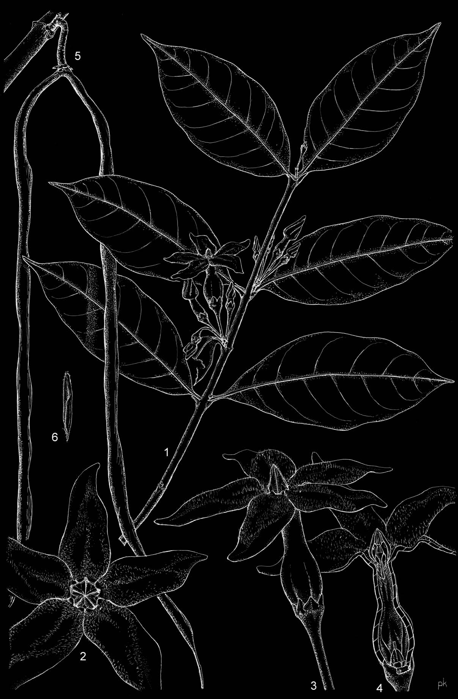
*Caption:* Planche 73 . Malouetia bequaertiana )OHXUî±,GHPFRXSHORQJLWXGLQDOHSDUWLHGXVW\OHHQOHYpHî±)UXLWîҀ±*UDLQH

---

## Figure 142 (page 164)
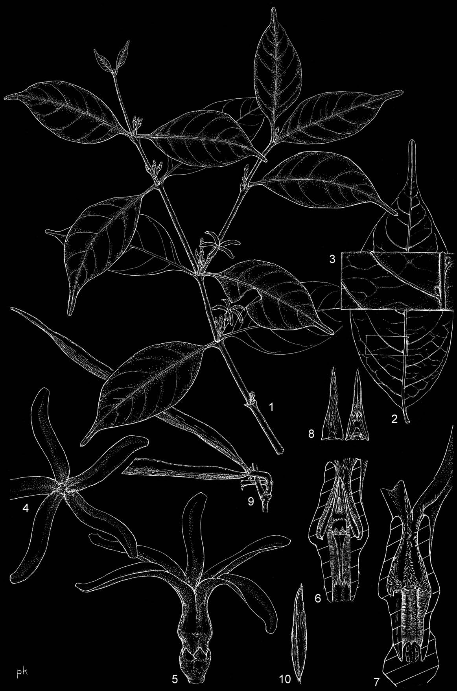
*Caption:* Planche 74 . Malouetia mildbraedii 5DPHDXÀRULIqUHîҀ±)HXLOOHIDFHLQIpULHXUHîҀ± ,GHPGpWDLODYHFGRPDWLHVî±)OHXUYXHGXGHVVXVî±)OHXUî±3DUWLHG¶XQHÀHXU coupe longitudinale, calice enlevé (× 8). – 7. Idem, cône stylo-staminal enlevé (× 8). – 8. Étamine, vues

---

## Figure 143 (page 166)
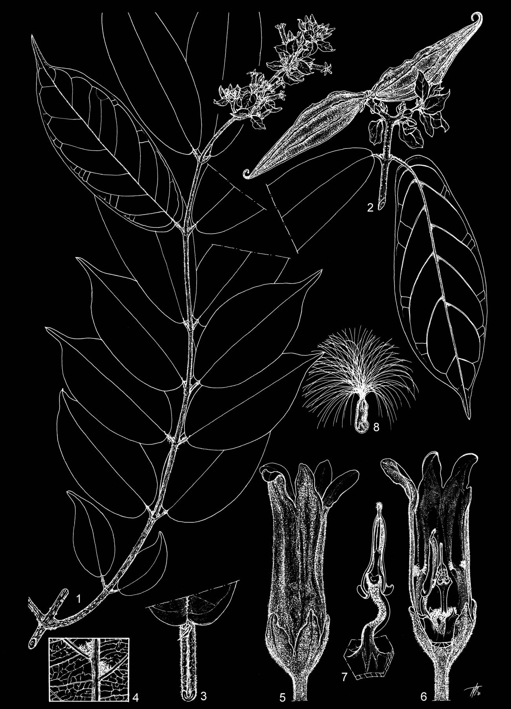
*Caption:* Planche 75 . Motandra lujaei 5DPHDXÀRULIqUHîҀ±5DPHDXIUXFWLIqUHîҀ±%DVHGX pétiole et du limbe, face supérieure (× 4). – 4. Domatie (× 2). – 5. Fleur (× 6). – 6. Idem, coupe longitu-

---

## Figure 144 (page 168)
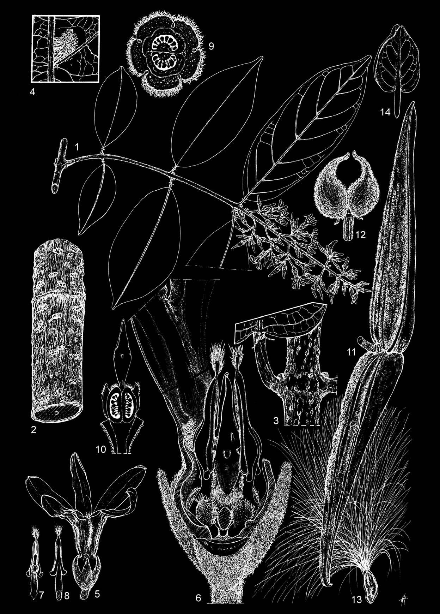
*Caption:* Planche 76 . Motandra paniculata 5DPHDXÀRULIqUHîҀ±3DUWLHG¶XQHEUDQFKHDYHFOHQWLFHOOHV coupe longitudinale, partie de la corolle enlevée (× 20). – 7, 8. Étamine, vues ventrale et dorsale (× 6). – 9. 2YDLUHFRXSHWUDQVYHUVDOHî±3LVWLOFRXSHORQJLWXGLQDOHî±)UXLWîҀ±)UXLW

---

## Figure 145 (page 169)
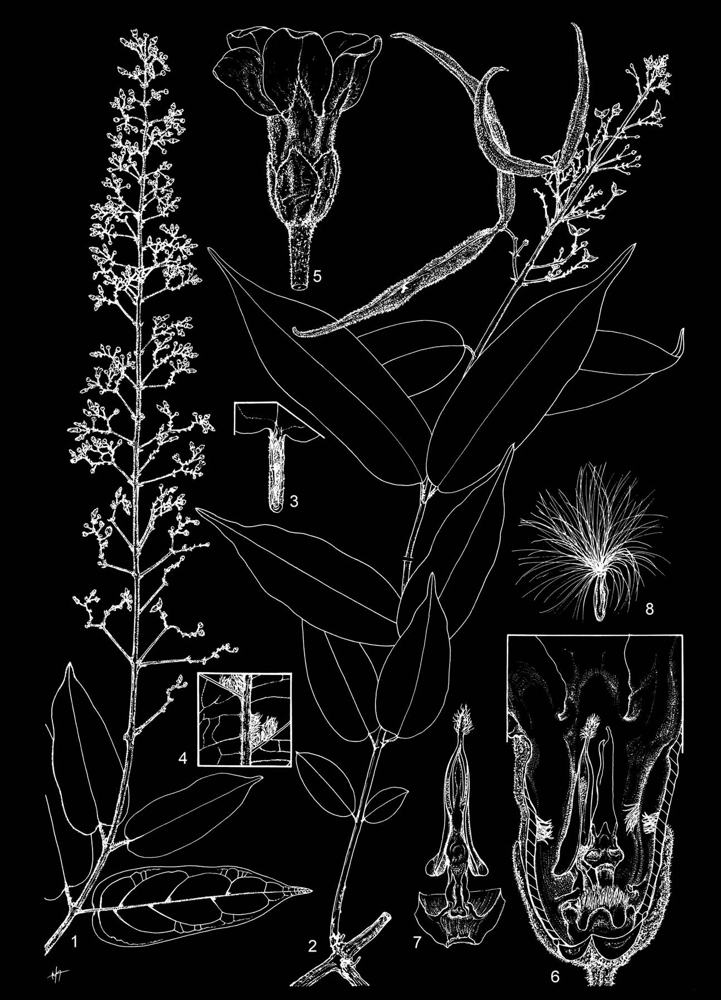
*Caption:* Planche 77 . Motandra poecilophylla 5DPHDXÀRULIqUHîҀ±5DPHDXIUXFWLIqUHîҀ±3p - tiole et base du limbe, face supérieure (× 2). – 4. Domaties (× 2). – 5. Fleur (× 10). – 6. Idem, coupe lon- gitudinale, montrant une étamine et le pistil, lobes de la corolle coupés (× 20). – 7. Étamine, vue ventrale

---

## Figure 146 (page 171)
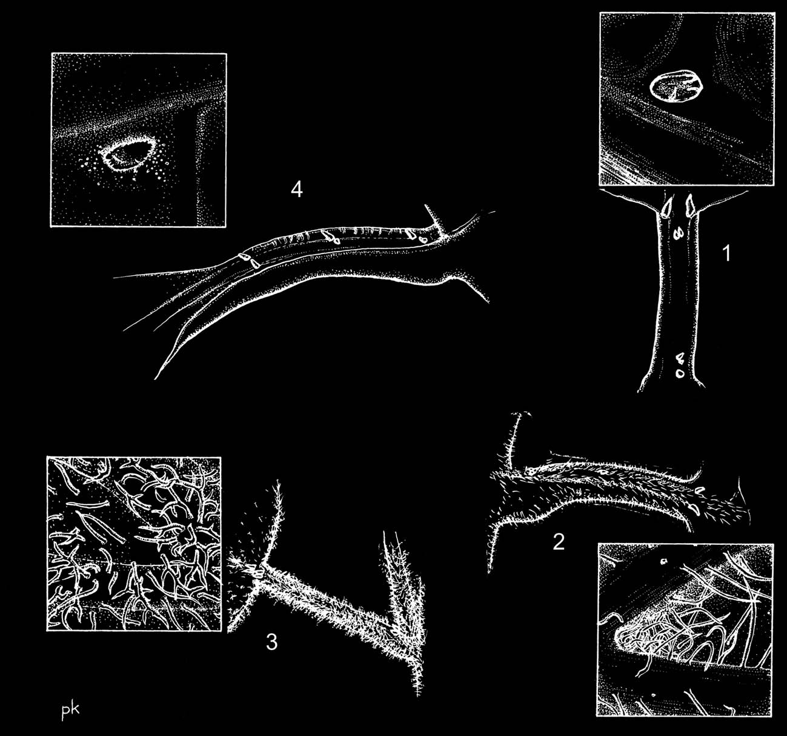
*Caption:* Planche 78 . Oncinotis spp. : Pétioles faces supérieures (× 2,7) et domaties (× 27). 1. O. glabrata . – 2. O. gracilis . – 3. O. hirta . – 4. O. pontyi . (1 : De Kruif 663 ; 2 : De Kruif 659 ; 3 : Gérard 5497 ; 4 : De Kruif 666 ). Dessin par Piet Kostense, Naturalis Biodiversity Center (©), reproduit à partir de de Kruif (1985).

---

## Figure 147 (page 172)
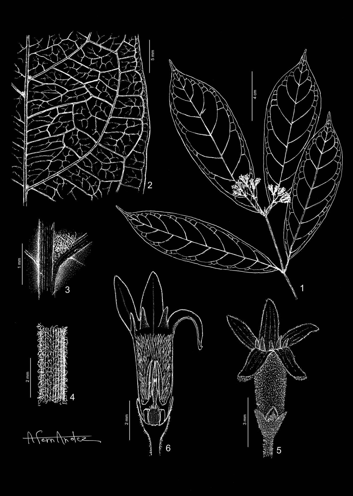
*Caption:* Planche 79 . Oncinotis gabonica 5DPHDXÀRULIqUH±'pWDLOGXOLPEHIROLDLUHIDFHLQIpULHXUH±

---

## Figure 148 (page 173)
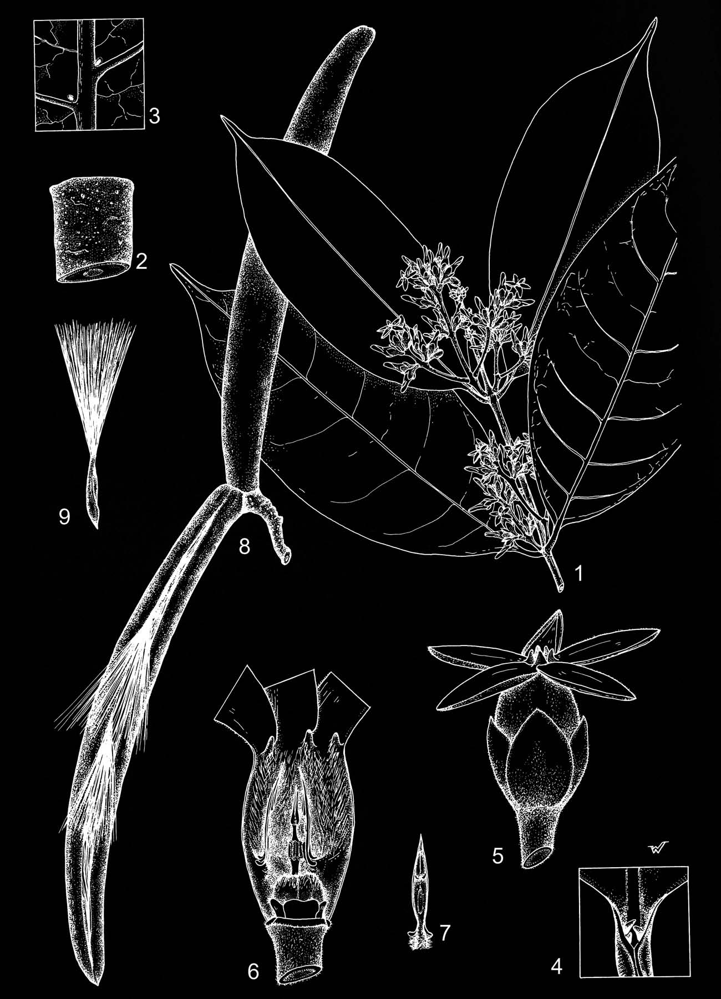
*Caption:* Planche 80 . Oncinotis glabrata 5DPHDXÀRULIqUHîҀ±'pWDLOG¶XQUDPHDXîҀ±'RPDWLH (× 4). – 4. Base du limbe foliaire, face supérieure (× 4). – 5. Fleur (× 6). – 6. Tube de la corolle, coupe

---

## Figure 149 (page 175)
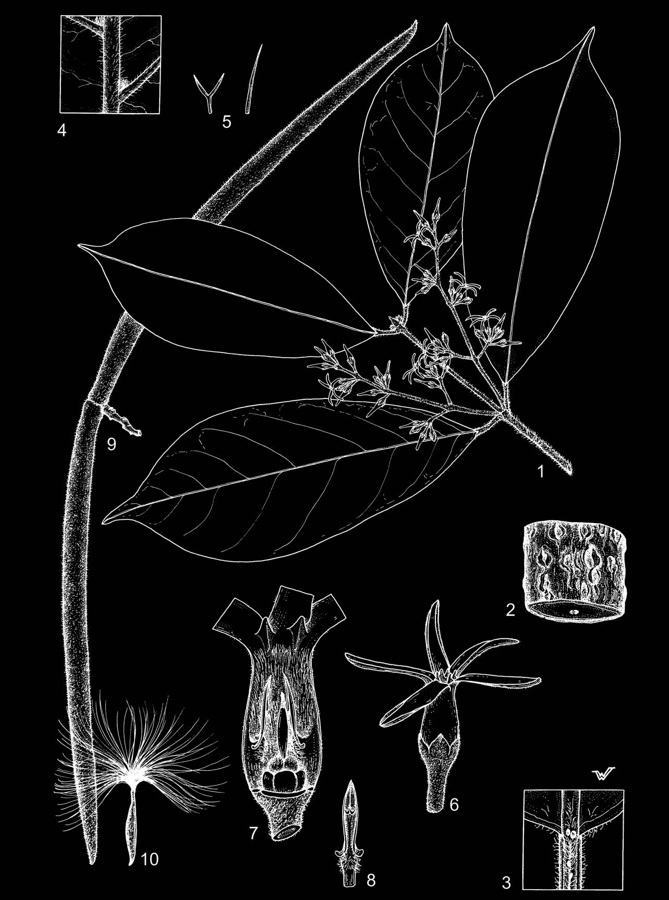
*Caption:* Planche 81 . Oncinotis gracilis 5DPHDXÀRULIqUHîҀ±'pWDLOGHO¶pFRUFHG¶XQHEUDQFKHîҀ – 3. Sommet de pétiole et base de limbe, avec collétères, face supérieure (× 4). – 4. Domatie (× 4). – 5.

---

## Figure 150 (page 177)
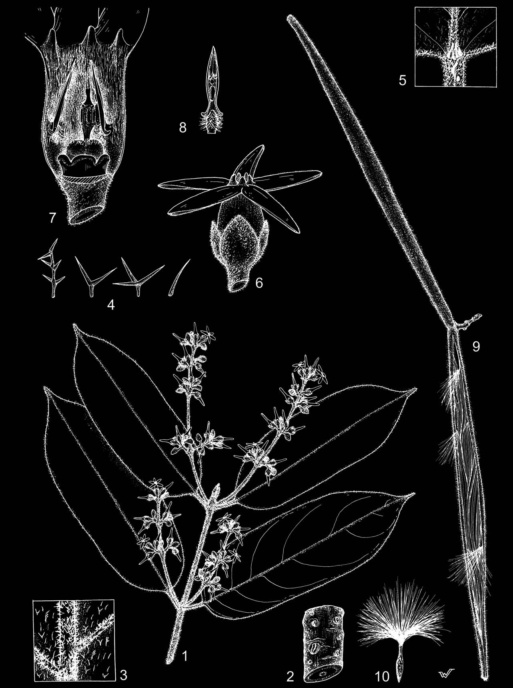
*Caption:* Planche 82 . Oncinotis hirta 5DPHDXÀRULIqUHî ϰ ±'pWDLOGHEUDQFKHîҀ±'pWDLOGX limbe foliaire, face inférieure (× 4). – 4. Poils de la feuille (× 25). – 5. Base du limbe, avec collétères, face supérieure (× 4). – 6. Fleur (× 6). – 7. Idem, à tube de la corolle en coupe longitudinale, montrant deux étamines et le pistil, calice et partie de la corolle enlevés (× 12). – 8. Étamine, face ventrale (× 12). – 9.

---

## Figure 151 (page 178)
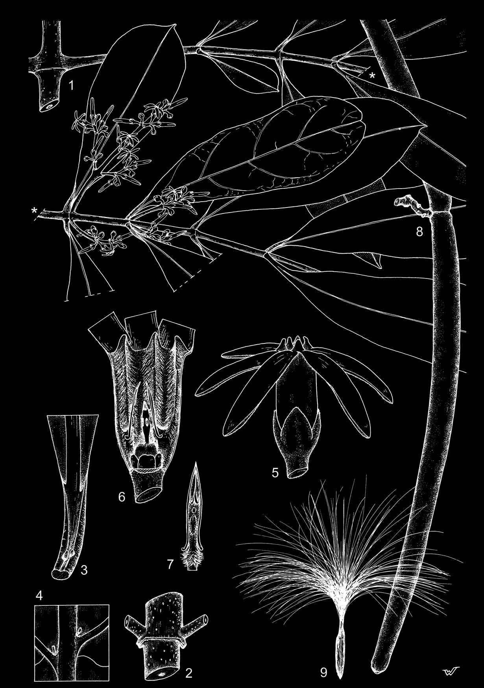
*Caption:* Planche 83 . Oncinotis pontyi 5DPHDXÀRULIqUHîҀ±'pWDLOG¶XQHEUDQFKHîҀ±%DVHG¶XQ limbe et sommet du pétiole, avec collétères, face supérieure (× 4). – 4. Détail d’un limbe foliaire, face inférieure, avec domaties (× 4). – 5. Fleur (× 6). – 6. Idem, tube de la corolle en coupe longitudinale, montrant deux étamines et le pistil, le calice et une partie de la corolle enlevés (× 8). – 7. Étamine, face

---

## Figure 152 (page 181)
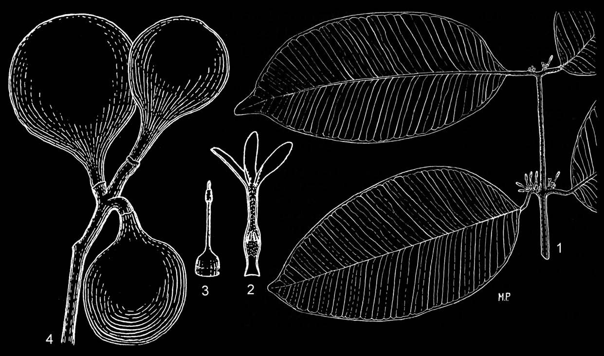
*Caption:* Planche 84 . Orthopichonia barteri 5DPHDXÀRULIqUHîò±&RUROOHFRXSHORQJLWXGLQDOHDYHF

---

## Figure 153 (page 183)
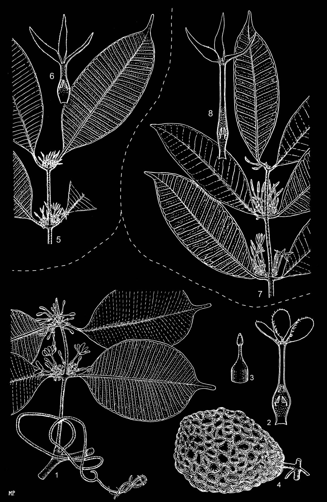
*Caption:* Planche 85 . Orthopichonia cirrhosa 5DPHDXÀRULIqUHîҀ±&RUROOHFRXSHORQJLWXGLQDOHDYHF

---

## Figure 154 (page 186)
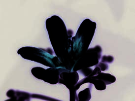
*Caption:* Figure 9 . Picralima nitida : A. Fruits ; B. Feuille, face inférieure. – Petchia africana &,QÀRUHVFHQFH±

---

## Figure 155 (page 186)
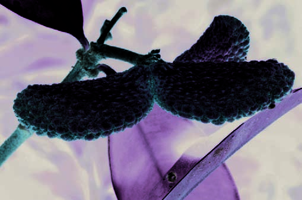
*Caption:* (no caption)

---

## Figure 156 (page 186)
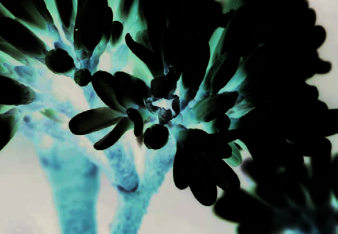
*Caption:* (no caption)

---

## Figure 157 (page 186)
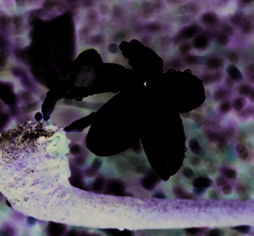
*Caption:* (no caption)

---

## Figure 158 (page 186)
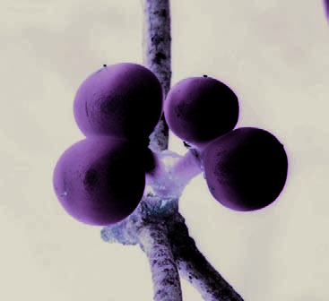
*Caption:* (no caption)

---

## Figure 159 (page 186)
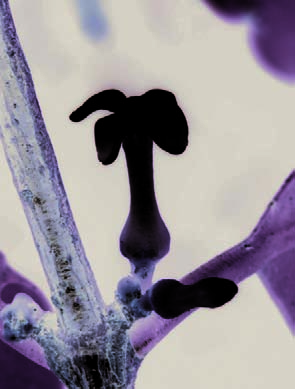
*Caption:* (no caption)

---

## Figure 160 (page 186)
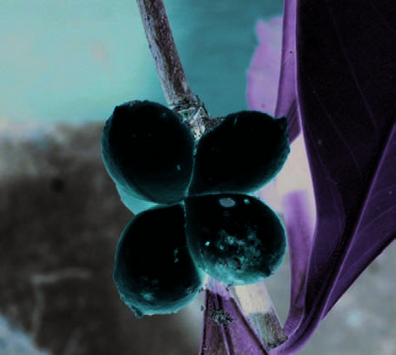
*Caption:* (no caption)

---

## Figure 161 (page 186)
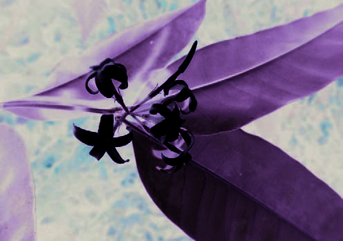
*Caption:* (no caption)

---

## Figure 162 (page 186)
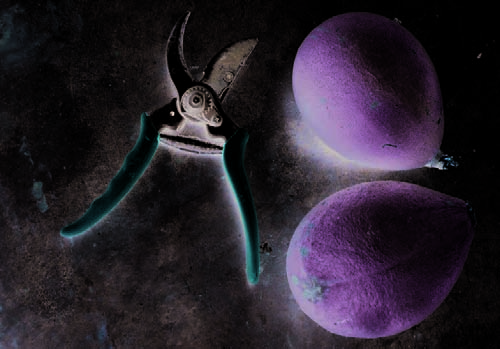
*Caption:* (no caption)

---

## Figure 163 (page 186)
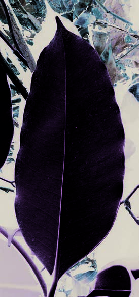
*Caption:* (no caption)

---

## Figure 164 (page 187)
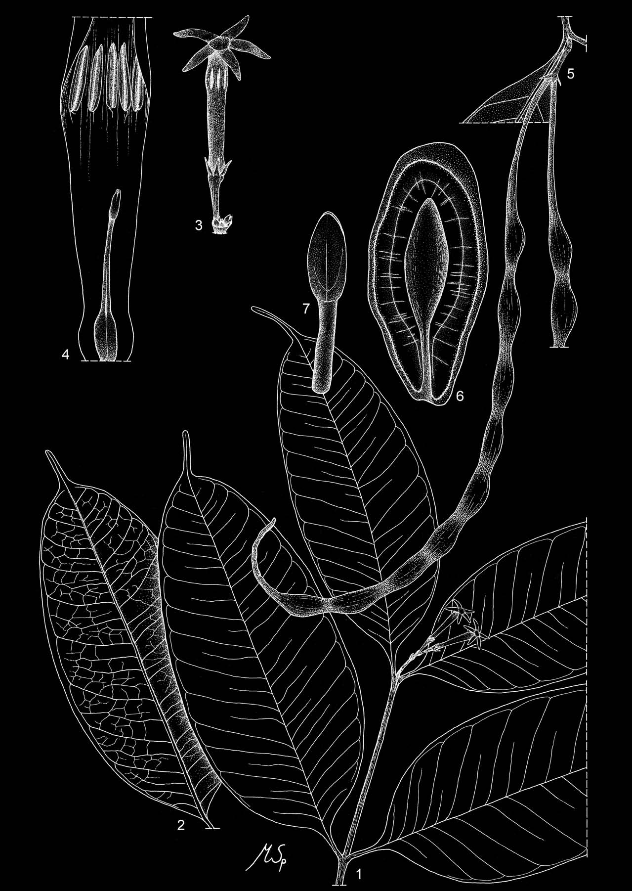
*Caption:* Planche 86 . Petchia africana

---

## Figure 165 (page 189)
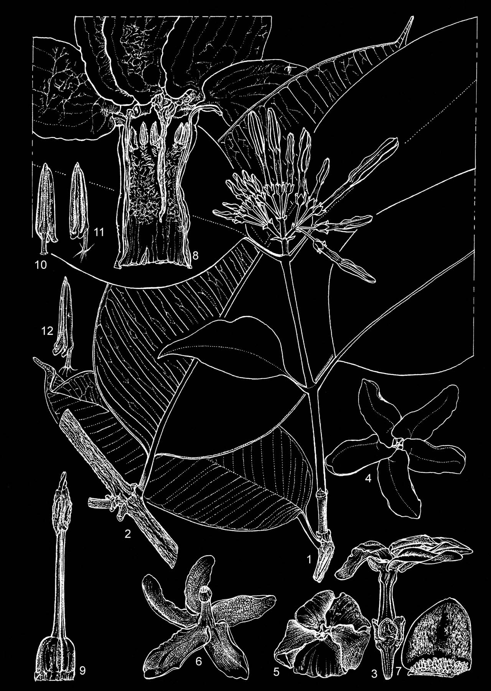
*Caption:* Planche 87 . Picralima nitida – 4, 5. Fleur, vue du dessus (× 1). – 6. Corolle, vue du dessous (× 1). – 7. Lobe du calice, face interne avec collétères (× 2). – 8. Partie de la corolle ouverte, avec étamines (× 2). – 9. Pistil (× 4,6). – 10-12.

---

## Figure 166 (page 192)
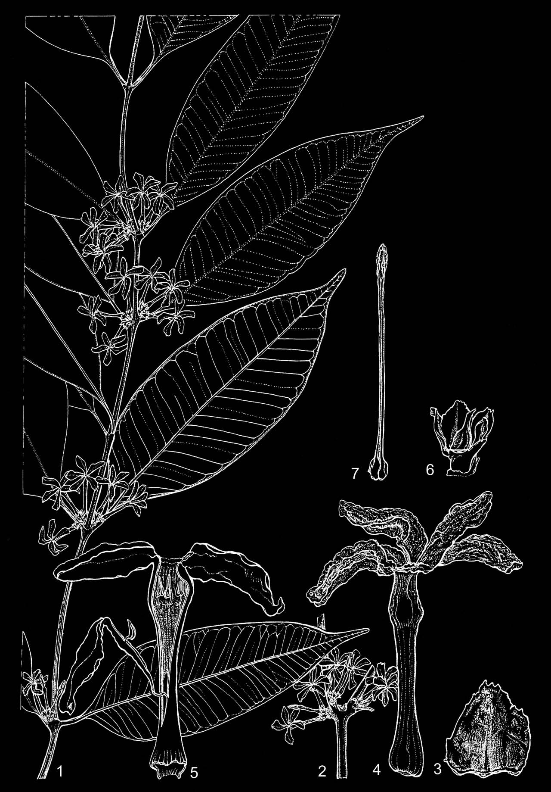
*Caption:* Planche 88 . Pleiocarpa bicarpellata : 5DPHDXÀRULIqUHîҀ±,QÀRUHVFHQFHVîҀ±/REHGX calice, face externe (× 20). – 4. Corolle (× 4). – 5. Idem, ouverte, avec étamines (× 4). – 6. Calice et ovaire (× 6). – 7. Pistil (× 6). (1-2 : Zenker II 242 ; 3-7 : Zenker 1660 ). Dessin par Yuen Fang Tan, Naturalis

---

## Figure 167 (page 193)
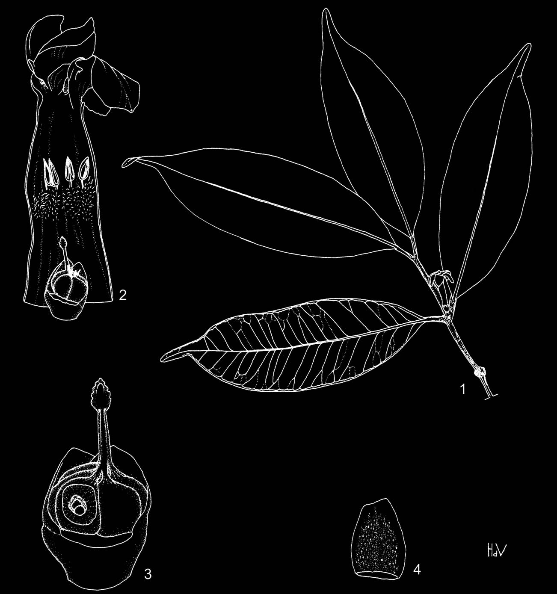
*Caption:* Planche 89 . Pleiocarpa brevistyla 5DPHDXÀRULIqUHîҀ±&RUROOHRXYHUWHDYHFpWDPLQHVHWSLV - til avec partie du calice (× 4). – 3. Pistil avec partie du calice, une loge ouverte (× 12). – 4. Lobe du calice (× 12). (1 : Wieringa 1267 ; 2-4 : van der Burgt 48 ). Dessin par Hans de Vries, Naturalis Biodiversity

---

## Figure 168 (page 195)
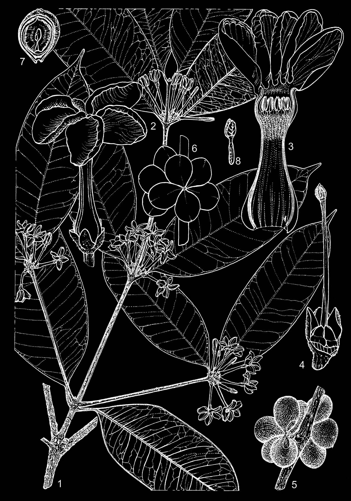
*Caption:* Planche 90 . Pleiocarpa mutica 5DPHDXÀRULIqUHîҀ±)OHXUî±&RUROOHRXYHUWHDYHF pWDPLQHVî±3DUWLHGXFDOLFHDYHFSLVWLOî±,QIUXWHVFHQFHîҀ*UDLQHFRXSHORQJLWX - dinale (× 1). – 8. Embryon (× 2). (1 : J.J.F.E. de Wilde 7548 ; 2-4 : Leeuwenberg 12219 ; 5-10 : de Koning 5790 ). Dessin par Yuen Fang Tan, Naturalis Biodiversity Center (©), reproduit à partir de Omino (1996).

---

## Figure 169 (page 197)
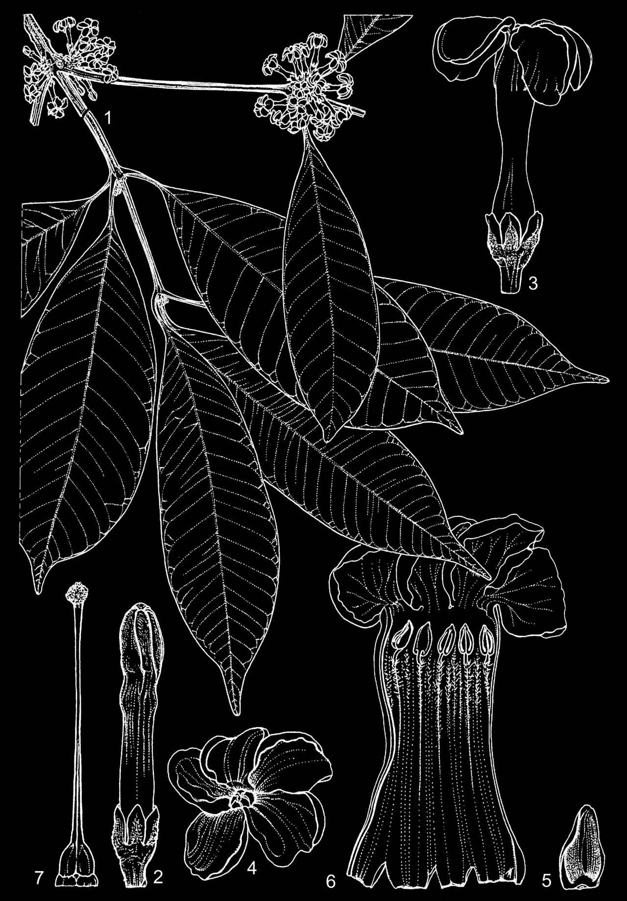
*Caption:* Planche 91 . Pleiocarpa pycnantha – 4. Idem, vue du dessus (× 4). – 5. Lobe du calice, face interne (× 8). – 6. Corolle ouverte, avec étamines (× 6). – 7. Pistil (× 8). (1 : J. Louis 12898 ; 2-7 : Breteler & De Wilde 636 ). Dessin par Yuen Fang Tan,

---

## Figure 170 (page 199)
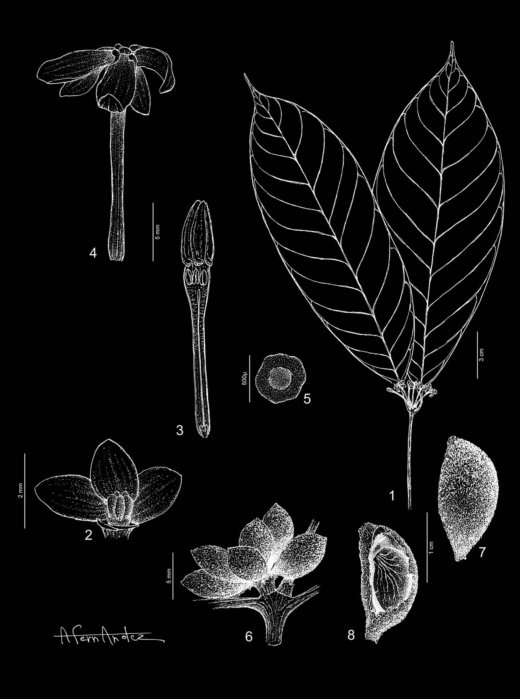
*Caption:* Planche 92 . Pleiocarpa robusta 5DPHDXÀRULIqUH±&DOLFHHWRYDLUHVpSDOHVHQOHYpV±%RX -

---

## Figure 171 (page 200)
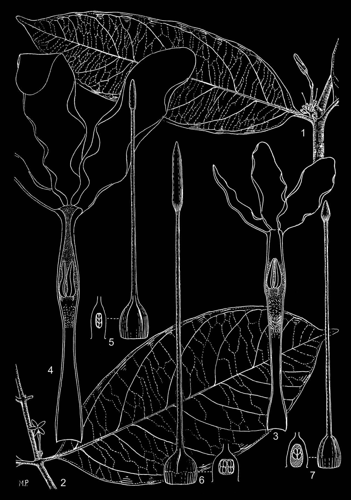
*Caption:* Planche 93 . Pleiocarpa rostrata : 5DPHDXÀRULIqUHîҀ±&RUROOHRXYHUWHDYHFpWDPLQHV (× 5). – 5-7. Pistil avec ovaire en coupe longitudinale (× 10). (1, 4, 5 : Talbot 1037 ; 2 : Zenker 1181b ; 3, 7 : Zenker 4362 2 6 : Le Testu 8871 'HVVLQSDU*XLGR03LFKRQ0XVpXPQDWLRQDOG¶+LVWRLUHQDWXUHOOH

---

## Figure 172 (page 203)
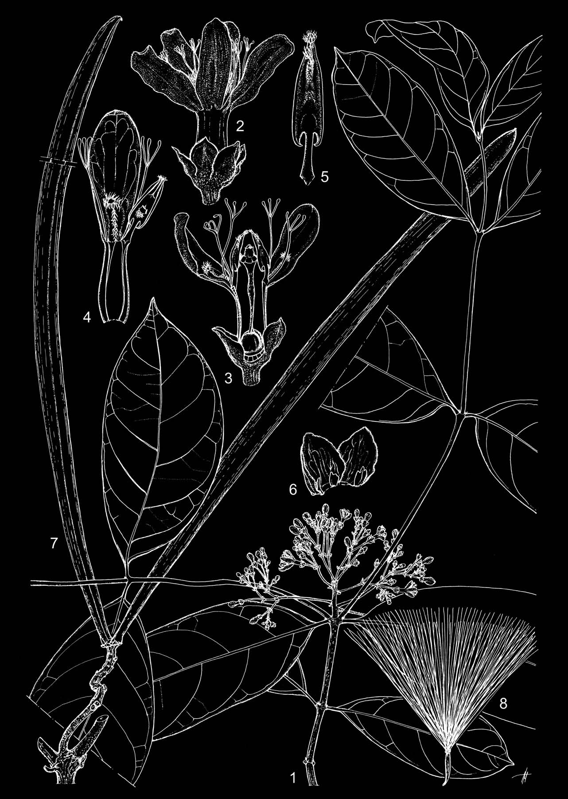
*Caption:* Planche 94 . Pleioceras gilletii 5DPHDXÀRULIqUHîҀ±)OHXUî±,GHPFRUROOHHQFRXSH longitudinale, avec deux paires d’appendices, deux étamines et le pistil (× 4). – 4. Partie de la corolle avec une étamine et une paire d’appendices (× 6). – 5. Étamine, vue dorsale (× 12). – 6. Lobes du calice, face

---

## Figure 173 (page 204)
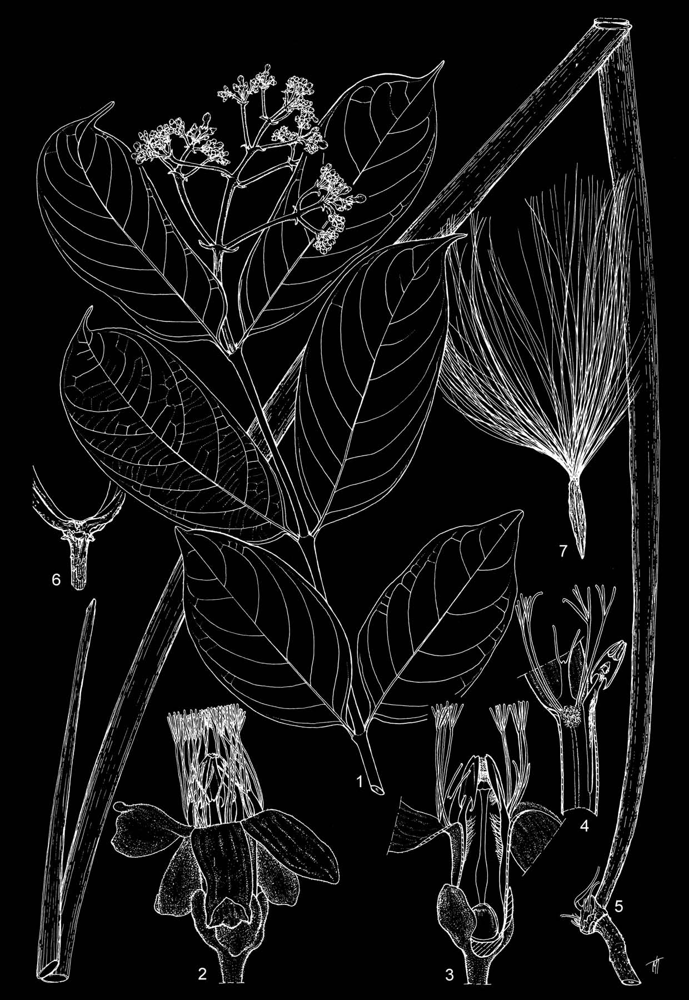
*Caption:* Planche 95 . Pleioceras zenkeri 5DPHDXÀRULIqUHîҀ±)OHXUî±)OHXUFRXSHORQJLWXGL - nale, montrant deux paires d’appendices, deux étamines et le pistil (× 6). – 4. Partie de la corolle montrant

---

## Figure 174 (page 206)
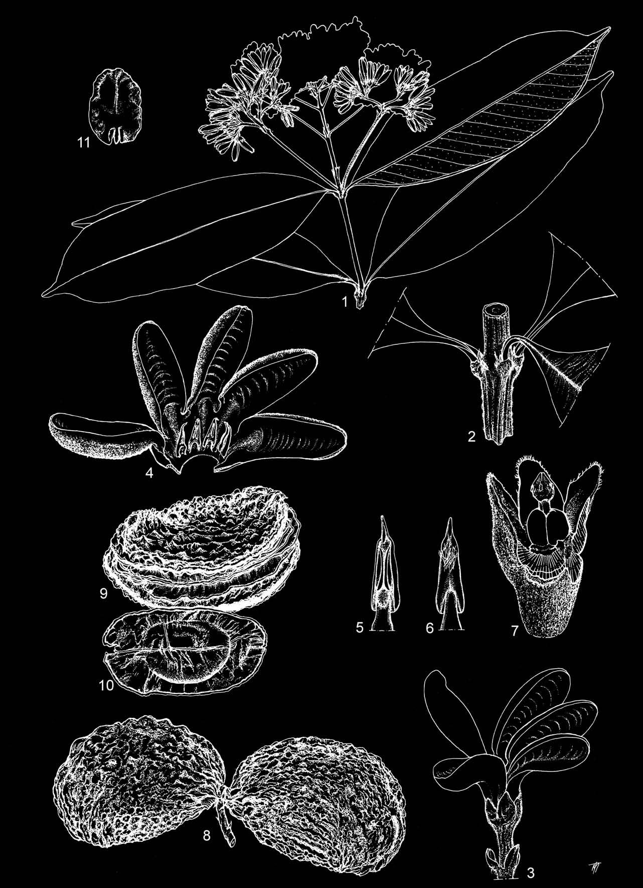
*Caption:* Planche 96 . Pycnobotrya nitida 5DPHDXÀRULIqUHîҀ±'pWDLOGXQ°XGG¶XQUDPHDXjIHXLOOHV ternées (× 2). – 3. Fleur (× 6). – 4. Corolle ouverte, avec étamines (× 6). – 5, 6. Étamine, vues ventrale

---

## Figure 175 (page 210)
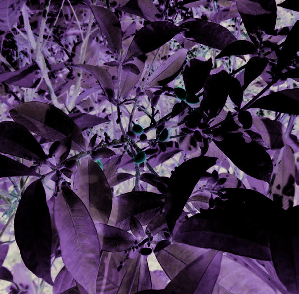
*Caption:* Figure 10 . 5DXYRO¿DOHWRX]H\L : A, Fleurs ; B, Fruit. – 5DXYRO¿DOHXFRSRGD : C, Feuilles, face inférieure. – 5DXYRO¿DPDQQLL ',QÀRUHVFHQFH()UXLWV± 5DXYRO¿DREVFXUD : F, Tige fructifère, à méricarpes

---

## Figure 176 (page 210)
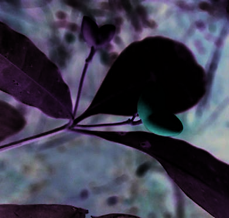
*Caption:* (no caption)

---

## Figure 177 (page 210)
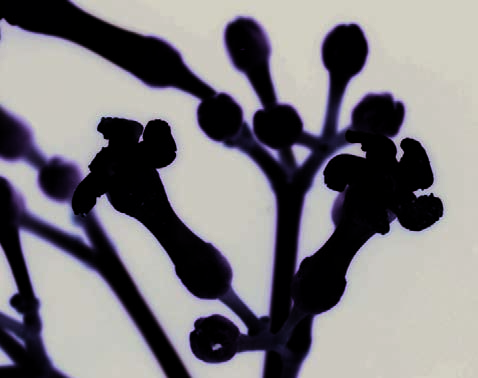
*Caption:* (no caption)

---

## Figure 178 (page 210)
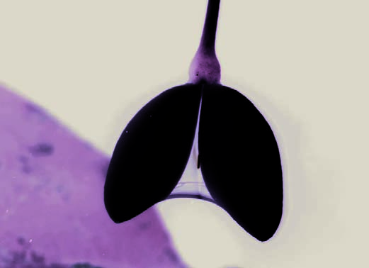
*Caption:* (no caption)

---

## Figure 179 (page 210)
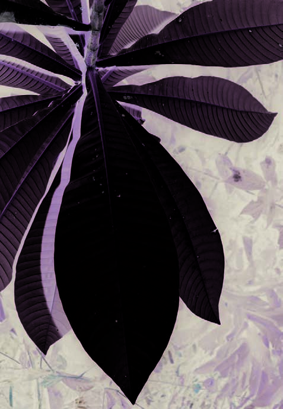
*Caption:* (no caption)

---

## Figure 180 (page 210)
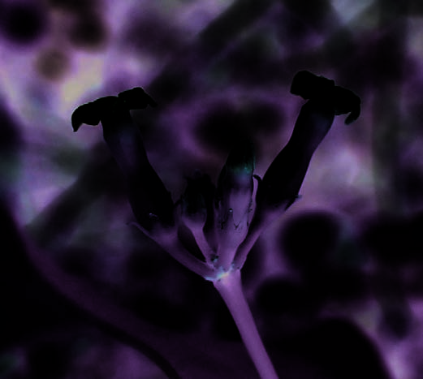
*Caption:* (no caption)

---

## Figure 181 (page 211)
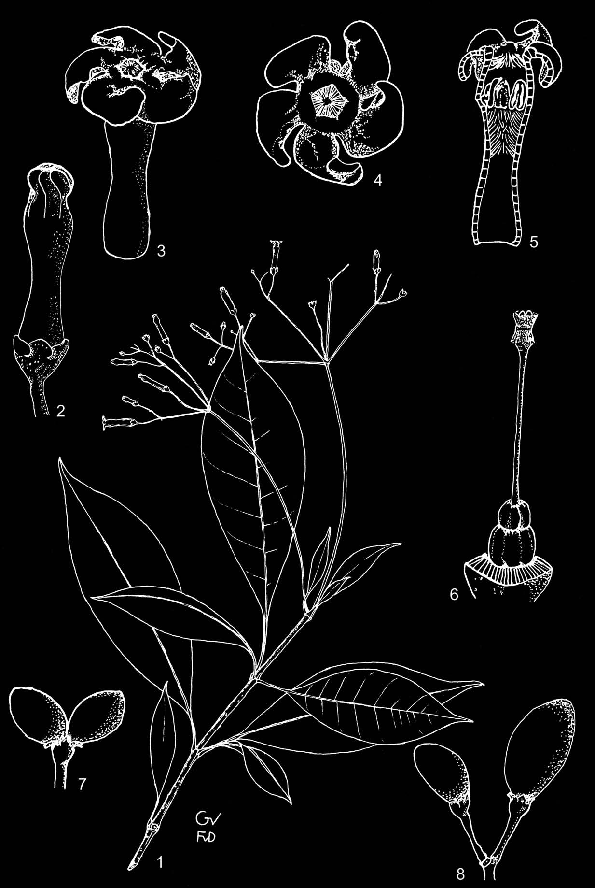
*Caption:* Planche 97 . 5DXYRO¿DOHWRX]H\L ±,GHPYXHGXGHVVXVîѿ±,GHPRXYHUWHPRQWUDQWOHVpWDPLQHVîѿ±3LVWLOî±

---

## Figure 182 (page 214)
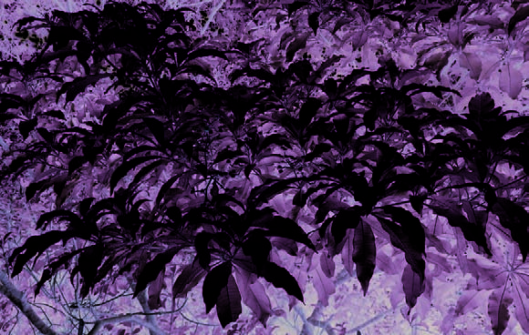
*Caption:* Figure 11 . 5DXYRO¿DYRPLWRULD $3RUWGHODSODQWH%7LJHÀRULIqUH&)OHXUV± Saba comorensis : D. ,QÀRUHVFHQFH± Strophanthus bullenianus : E, F : Fleur, vues frontale et latérale. – Strophanthus congen- sis : G : Fleur. – Strophanthus gratus +,QÀRUHVFHQFH3KRWRVSDU&DUHO-RQJNLQG$*XLQpD% 6LQR&RXQW\/LEpULD%DUW:UVWHQ&<DQJDPEL5pSGpP&RQJR'/RPDPL5pSGpP&RQJR ;DQGHUYDQGHU%XUJW()31.RUXS&DPHURXQ(KRDUQ%LGDXOW*)HUQDQ9D]*DERQHW1LFRODV

---

## Figure 183 (page 214)
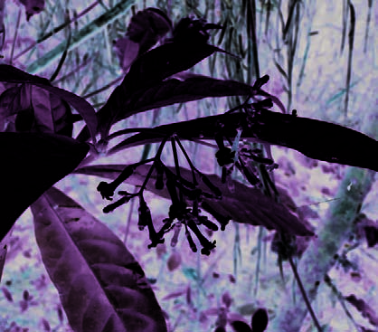
*Caption:* (no caption)

---

## Figure 184 (page 214)
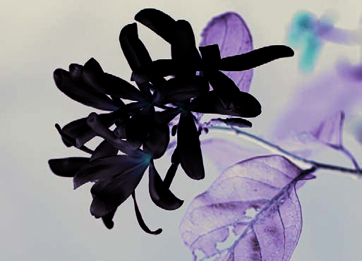
*Caption:* (no caption)

---

## Figure 185 (page 214)
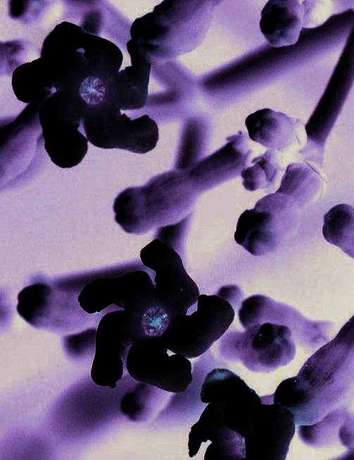
*Caption:* (no caption)

---

## Figure 186 (page 214)
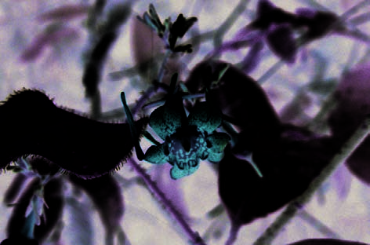
*Caption:* (no caption)

---

## Figure 187 (page 214)
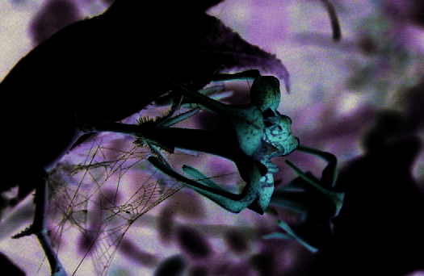
*Caption:* (no caption)

---

## Figure 188 (page 214)
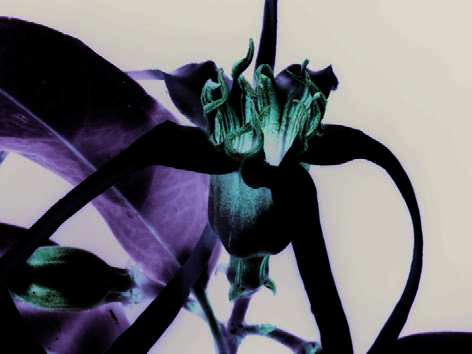
*Caption:* (no caption)

---

## Figure 189 (page 214)
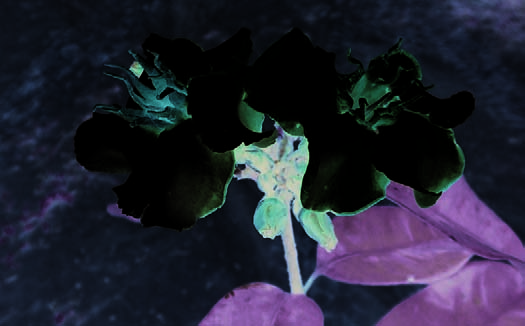
*Caption:* (no caption)

---

## Figure 190 (page 215)
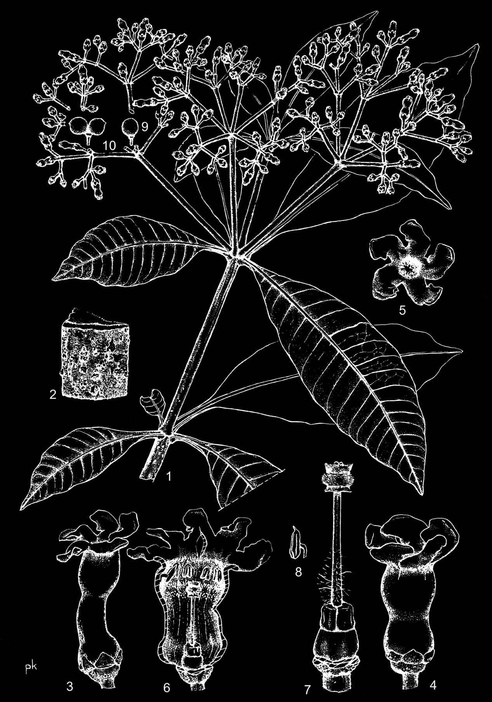
*Caption:* Planche 98 . 5DXYRO¿DYRPLWRULD - rolle, vue du dessus (× 4). – 6. Corolle ouverte, montrant les étamines et pistil (× 4). – 7. Pistil (× 8). – 8.

---

## Figure 191 (page 217)
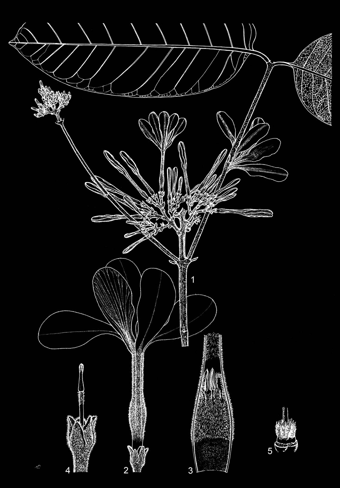
*Caption:* Planche 99 . Saba comorensis 5DPHDXÀRULIqUHî±)OHXUî±&RXSHORQJLWXGLQDOHGHOD partie du tube de la corolle comprenant les étamines (× 6). – 4. Calice et pistil (× 6). – 5. Ovaire (× 6). (1 :

---

## Figure 192 (page 221)
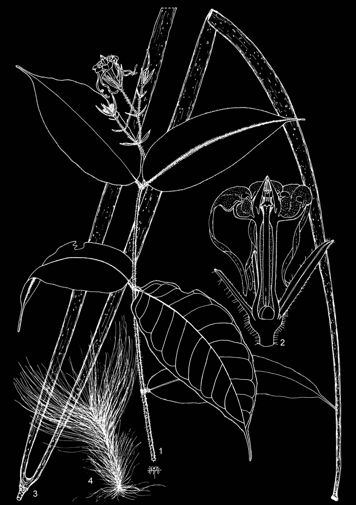
*Caption:* Planche 100 . Strophanthus bullenianus 7LJHÀRULIqUHîҀ±)OHXUFRXSHORQJLWXGLQDOHî± )UXLWXQIROOLFXOHSOLpHQGHX[îҀ±*UDLQHîҀ Soyaux 55 ; 2 : Leeuwenberg 8646 ; 3 :

---

## Figure 193 (page 223)
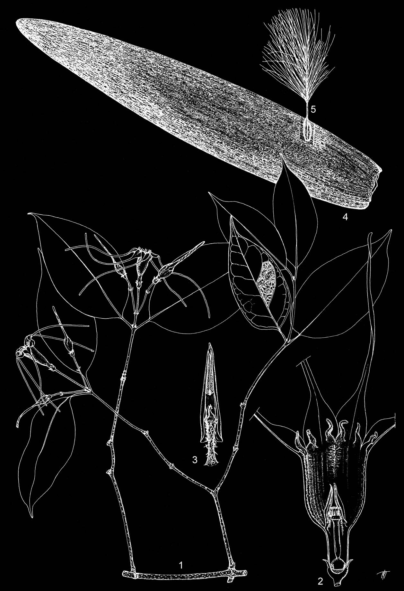
*Caption:* Planche 101 . Strophanthus congoensis 7LJHÀRULIqUHîҀ±)OHXUFRXSHORQJLWXGLQDOHî±

---

## Figure 194 (page 224)
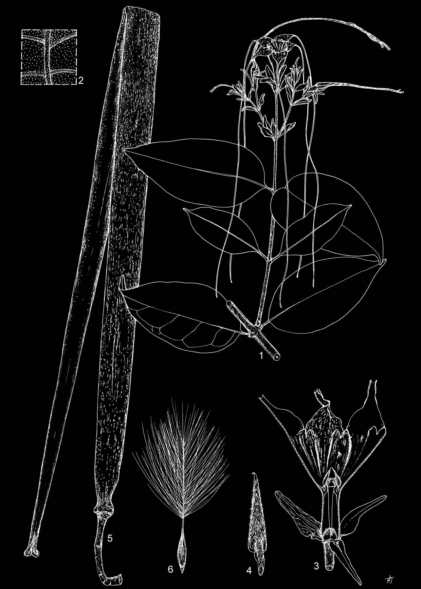
*Caption:* Planche 102 . Strophanthus gracilis 5DPHDXÀRULIqUHîҀ±'pWDLOGXOLPEHIROLDLUHIDFHLQIp - rieure (× 2). – 3. Fleur, coupe longitudinale, lobes partiellement coupés (× 2). – 4. Étamine, vue dorsale

---

## Figure 195 (page 226)
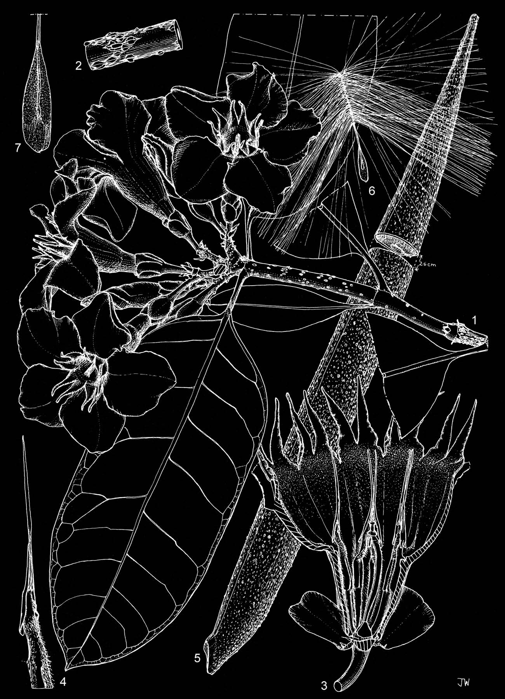
*Caption:* Planche 103 . Strophanthus gratus 5DPHDXÀRULIqUHîҀ±'pWDLOG¶XQUDPHDXîҀ±3DUWLH de la corolle, base et couronne, coupe longitudinale (× 1). – 4. Étamine, vue dorsale (× 2). – 5. Follicule,

---

## Figure 196 (page 227)
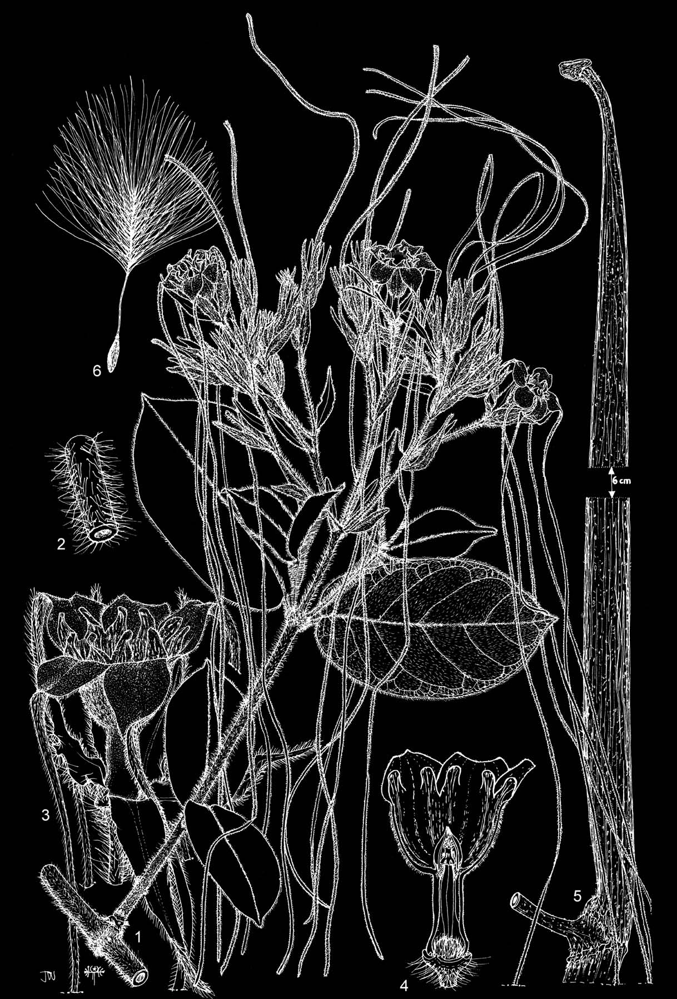
*Caption:* Planche 104 . Strophanthus hispidus 5DPHDXÀRULIqUHîҀ±'pWDLOGHUDPHDXî±)OHXU

---

## Figure 197 (page 229)
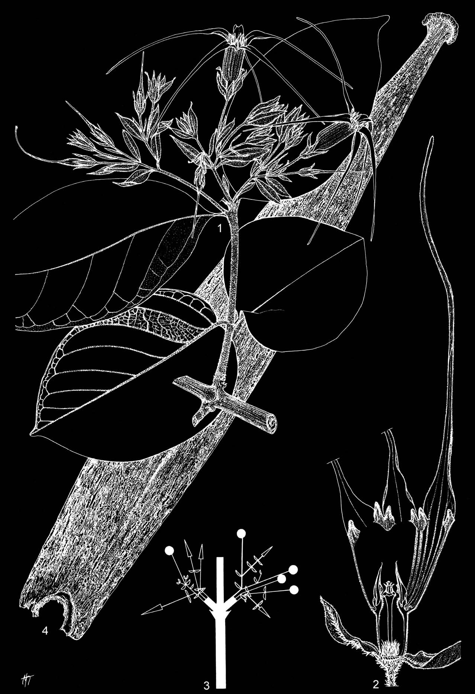
*Caption:* Planche 105 . Strophanthus mortehanii 5DPHDXÀRULIqUHîҀ±)OHXUFRXSHORQJLWXGLQDOHî ±,QÀRUHVFHQFHVFKpPDWLTXH±)ROOLFXOHîҀ Breteler 2068 ; 2, 3 : Gérard 5403 ; 4 : Krukoff 235 ). Dessin par Yuen Fang Tan, Naturalis Biodiversity Center (©), reproduit à partir de Beentje (1982).

---

## Figure 198 (page 230)
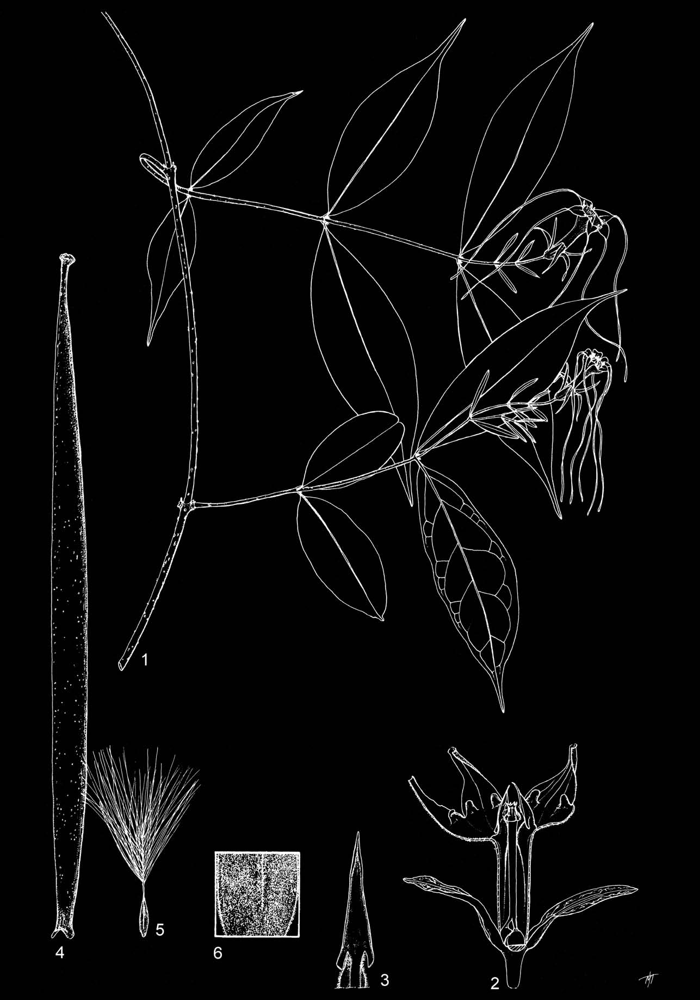
*Caption:* Planche 106 . 6WURSKDQWKXVSDUYLÀRUXV 7LJHÀRULIqUHîҀ±)OHXUFRXSHORQJLWXGLQDOHFRUROOH

---

## Figure 199 (page 232)
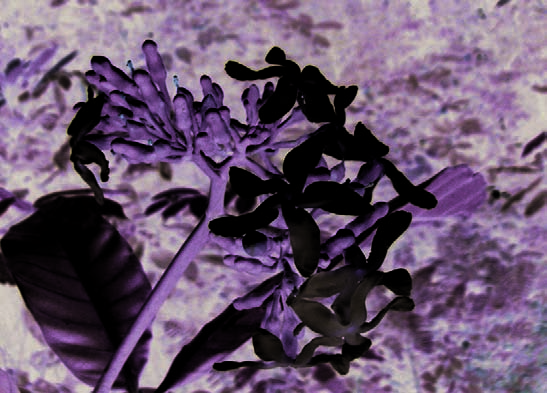
*Caption:* Figure 12 . Strophanthus preussii : A, B. Fleurs montrant la variation en couleurs. – Strophanthus sar- mentosus &7LJHVÀRULIqUHV± Tabernaemontana brachyantha ',QÀRUHVFHQFH± Tabernaemontana brachypoda (,QÀRUHVFHQFH± Tabernaemontana crassa ))HXLOOHHWÀHXUVHQERXWRQ*)OHXUV+ )UXLW3KRWRVSDU(ULN.RHQHQ$1]pUpNRUp*XLQpH(ULN6LPRQV%RXHVWGX31/RSp*DERQ &DUHO-RQJNLQG&/RID/LEpULD)+/LEDVVD/LEpULD;DQGHUYDQGHU%XUJW'31.RUXS&DPH -

---

## Figure 200 (page 232)
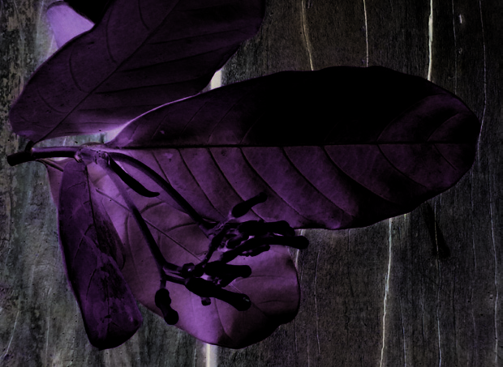
*Caption:* (no caption)

---

## Figure 201 (page 232)
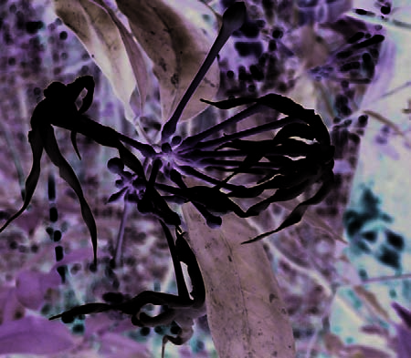
*Caption:* (no caption)

---

## Figure 202 (page 232)
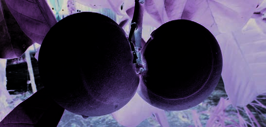
*Caption:* (no caption)

---

## Figure 203 (page 232)
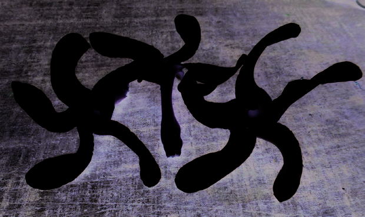
*Caption:* (no caption)

---

## Figure 204 (page 232)
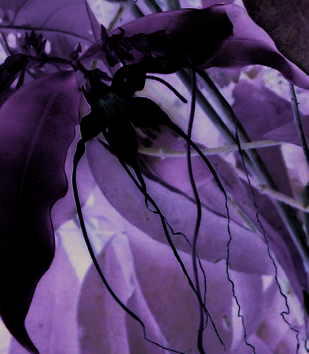
*Caption:* (no caption)

---

## Figure 205 (page 232)
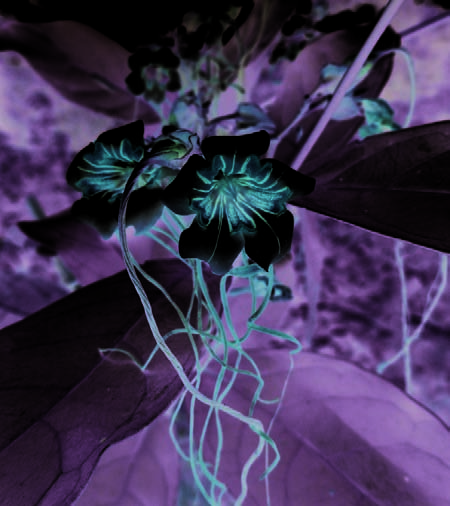
*Caption:* (no caption)

---

## Figure 206 (page 232)
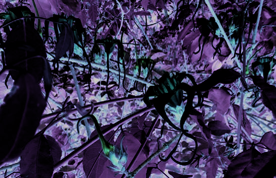
*Caption:* (no caption)

---

## Figure 207 (page 233)
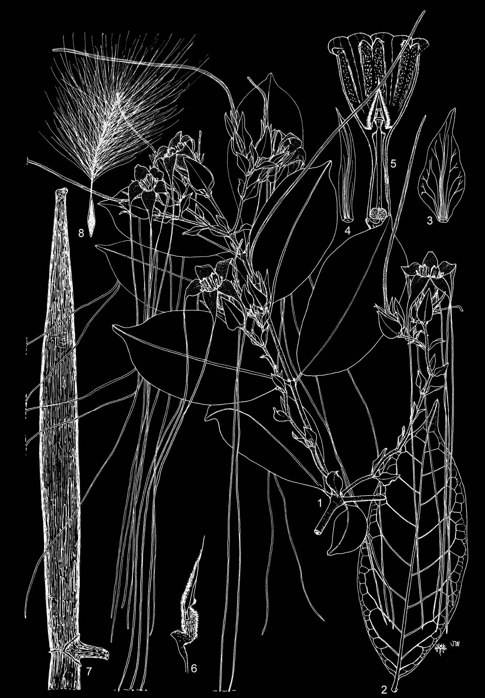
*Caption:* Planche 107 . Strophanthus preussii 5DPHDXÀRULIqUHîҀ±)HXLOOHîҀ±6pSDOHH[WHUQH î±6pSDOHLQWHUQHî±&RUROOHFRXSHORQJLWXGLQDOHFRUROOHXQLTXHPHQWDYHFEDVHGHVOREHV

---

## Figure 208 (page 235)
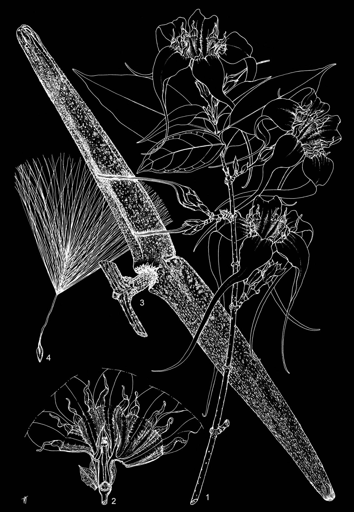
*Caption:* Planche 108 . Strophanthus sarmentosus var. sarmentosus 5DPHDXÀRULIqUHîҀ±)OHXURXYHUWH

---

## Figure 209 (page 236)
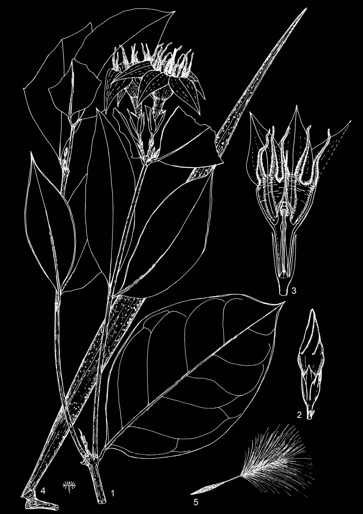
*Caption:* Planche 109 . Strophanthus thollonii 5DPHDXÀRULIqUHîҀ±%RXWRQÀRUDOî±)OHXUFRXSH

---

## Figure 210 (page 239)
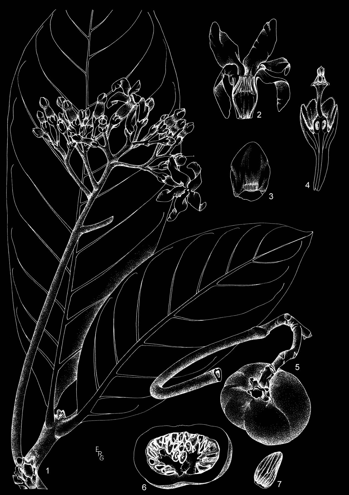
*Caption:* Planche 110 . Tabernaemontana brachyantha 5DPHDX ÀRULIqUH ± &RUROOH RXYHUWH DYHF étamines (× 1). – 3. Lobe du calice, face interne (× 3). – 4. Calice et pistil, coupe longitudinale (× 2). – 5.

---

## Figure 211 (page 242)
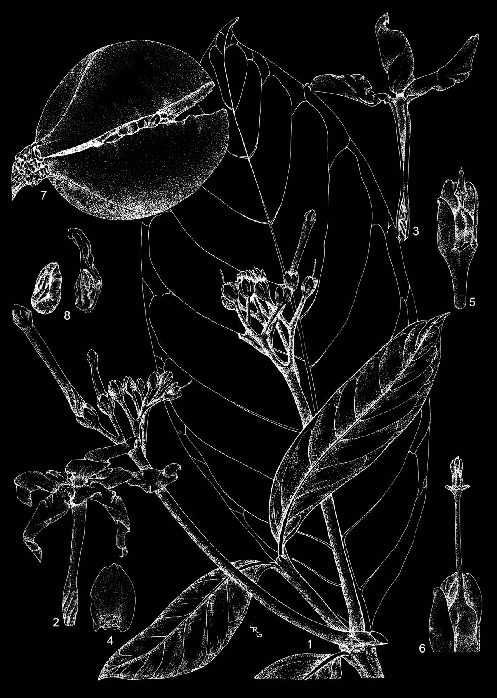
*Caption:* Planche 111 . Tabernaemontana crassa 5DPHDXÀRULIqUHîò±&RUROOHîò±,GHPFRXSH longitudinale (× ½). – 4. Lobe du calice, face interne (× 2). – 5. Partie du calice et jeune pistil (× 1½). – 6.

---

## Figure 212 (page 243)
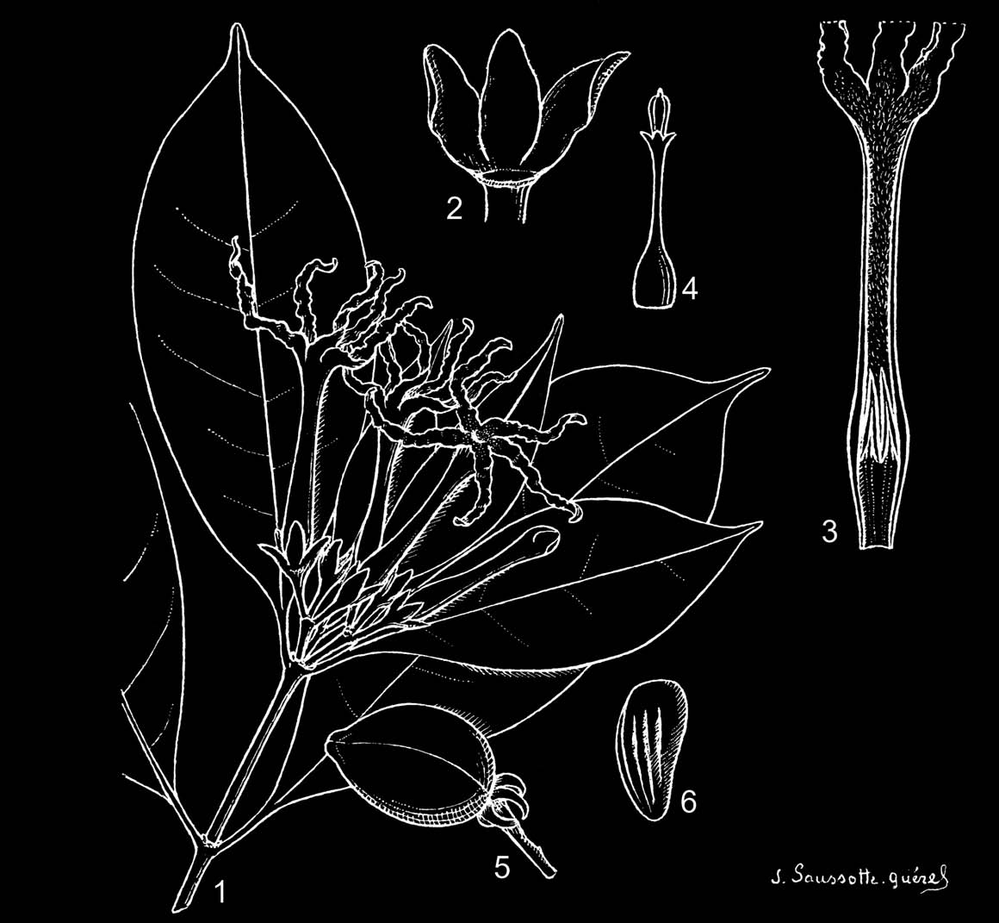
*Caption:* Planche 112 . 7DEHUQDHPRQWDQDFULVSLÀRUD 5DPHDXÀRULIqUHîҀ±&DOLFHFRXSHORQJLWXGLQDOH (× 2). – 3. Partie de la corolle, coupe longitudinale avec étamines (× 1½). – 4. Pistil (× 3). – 5. Fruit

---

## Figure 213 (page 244)
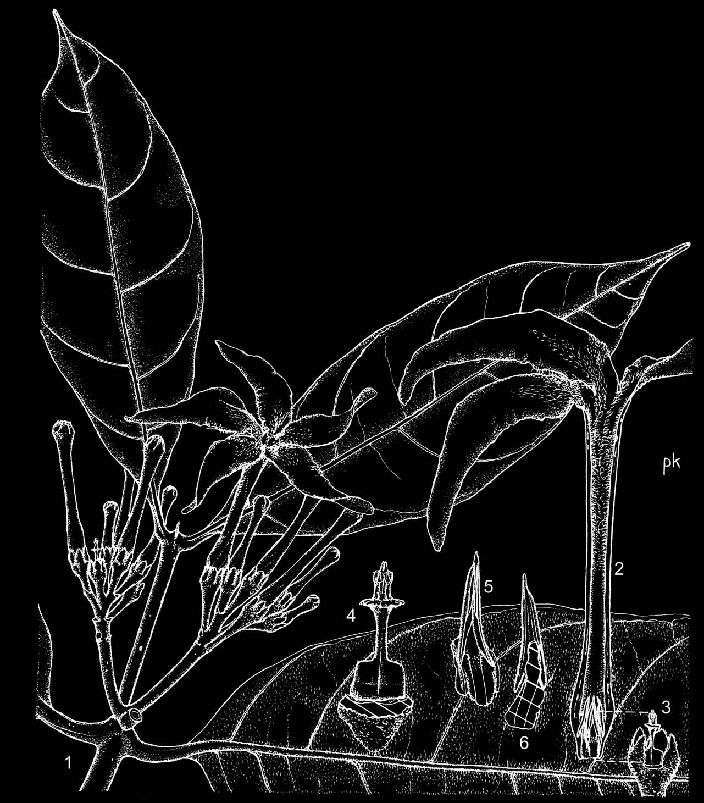
*Caption:* Planche 113 . Tabernaemontana eglandulosa 5DPHDXÀRULIqUHîҀ±&RUROOHFRXSHORQJLWXGL -

---

## Figure 214 (page 246)
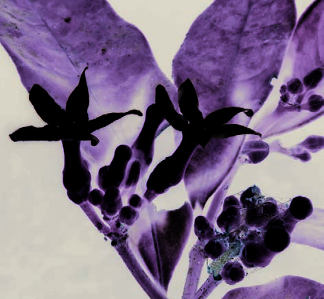
*Caption:* Figure 13 . Tabernaemontana eglandulosa $,QÀRUHVFHQFHHQERXWRQ%)UXLW± Tabernaemontana inconspicua : C. Fruit. – Tabernaemontana letestui : D. Fruit. – 7DEHUQDHPRQWDQDSHQGXOLÀRUD : E. Fruit. – Tabernaemontana psorocarpa ),QÀRUHVFHQFH*)UXLW3KRWRVSDU9LQFHQW'URLVVDUW$5pVHUYH d’Ebo, Cameroun), Ehoarn Bidault (B : Kouilou, Rép. Congo ; F, G : Rive droite du Komo, Gabon),

---

## Figure 215 (page 246)
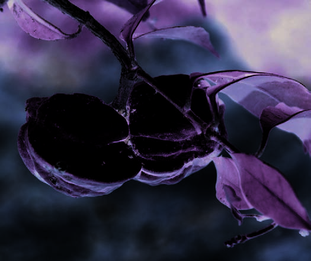
*Caption:* (no caption)

---

## Figure 216 (page 246)
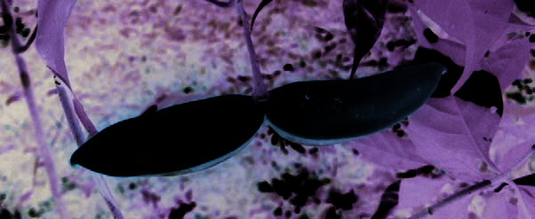
*Caption:* (no caption)

---

## Figure 217 (page 246)
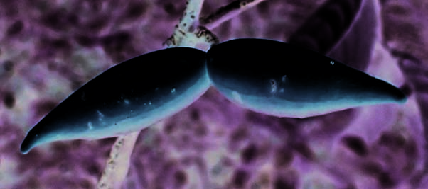
*Caption:* (no caption)

---

## Figure 218 (page 246)
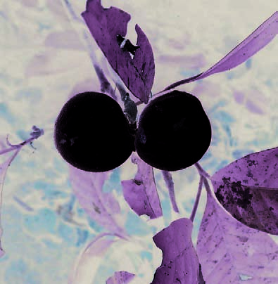
*Caption:* (no caption)

---

## Figure 219 (page 246)
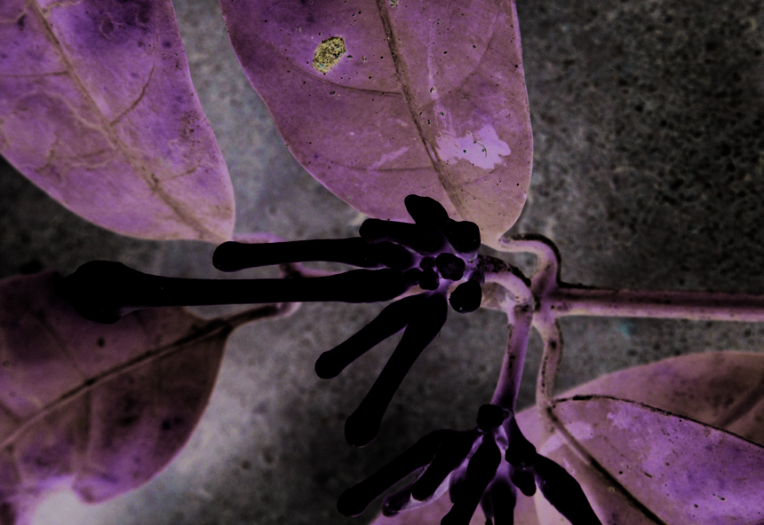
*Caption:* (no caption)

---

## Figure 220 (page 246)
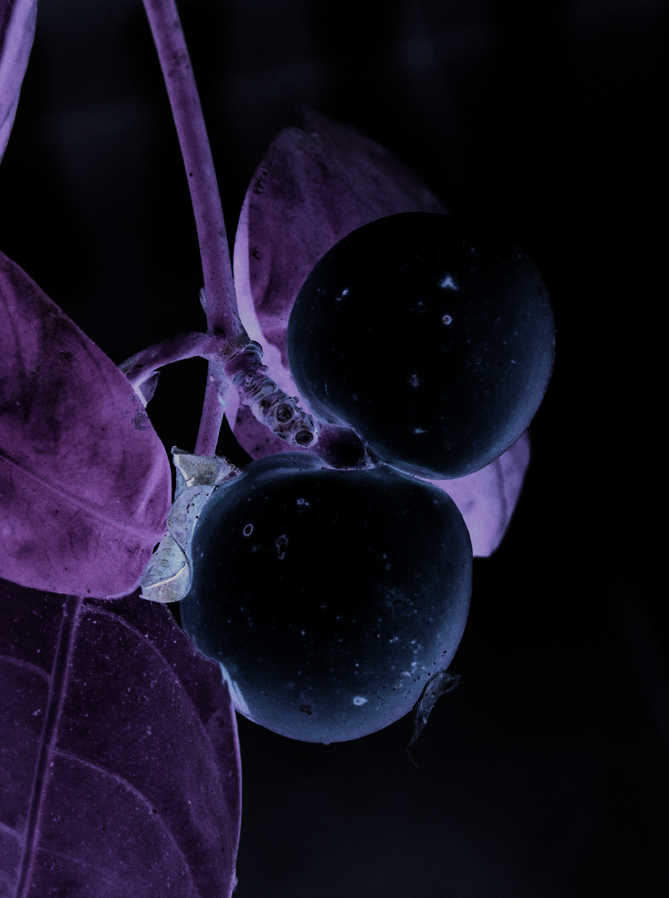
*Caption:* (no caption)

---

## Figure 221 (page 247)
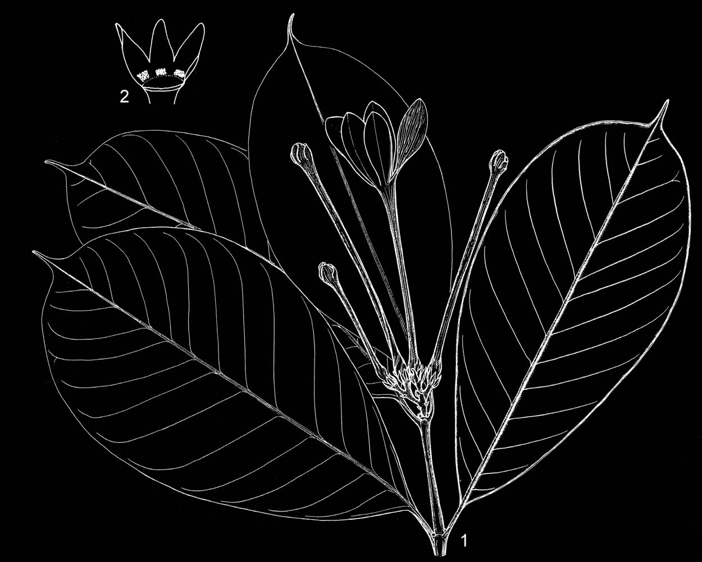
*Caption:* Planche 114 . Tabernaemontana hallei 5DPHDXÀRULIqUHîѿ±&DOLFHFRXSHORQJLWXGLQDOHDYHF collétères (× 2). (1 : J.J.F.E. de Wilde 7525 EUDQFKHÀHXULHHQERXWRQ N. Hallé 2703 ÀHXURXYHUWH 2 : N. Halle 2703 'HVVLQSDU-DFTXHOLQH6DXVVRWWH*XpUHO0XVpXPQDWLRQDOG¶+LVWRLUHQDWXUHOOH3DULV (©), adapté et reproduit avec permission à partir de Leeuwenberg (1991).

---

## Figure 222 (page 248)
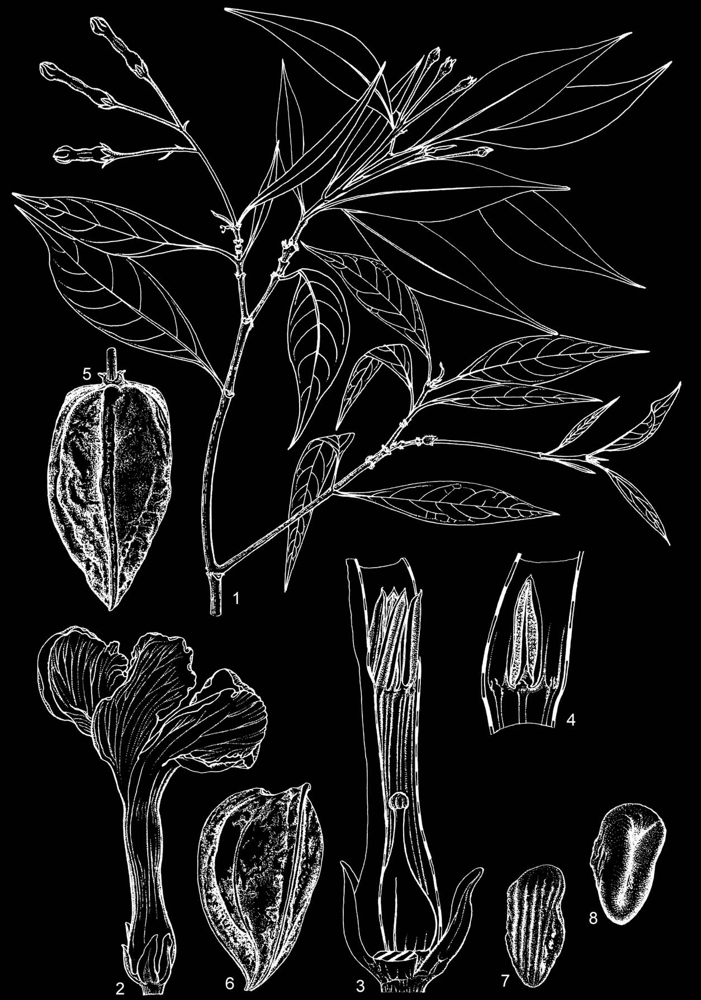
*Caption:* Planche 115 . Tabernaemontana inconspicua coupe longitudinale, une grande partie de la corolle enlevée (× 6). – 4. Étamine sur tube de la corolle

---

## Figure 223 (page 250)
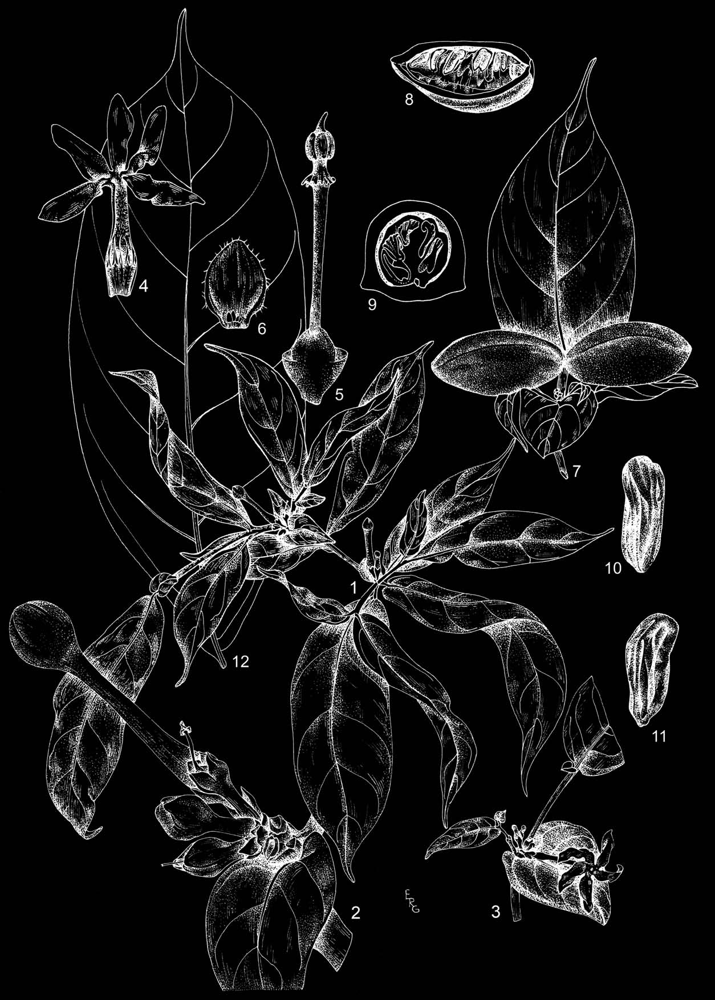
*Caption:* Planche 116 . Tabernaemontana letestui 5DPHDXÀRULIqUHîò±,QÀRUHVFHQFHDYHFERXWRQPU î±,QÀRUHVFHQFHîò±&RUROOHRXYHUWHDYHFpWDPLQHVî±3LVWLOîò±/REH

---

## Figure 224 (page 252)
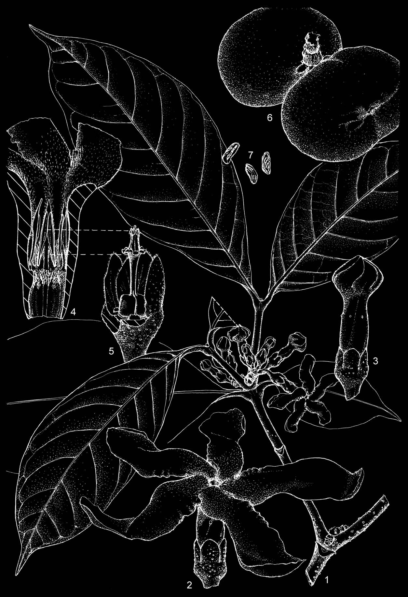
*Caption:* Planche 117 . 7DEHUQDHPRQWDQDSHQGXOLÀRUD

---

## Figure 225 (page 253)
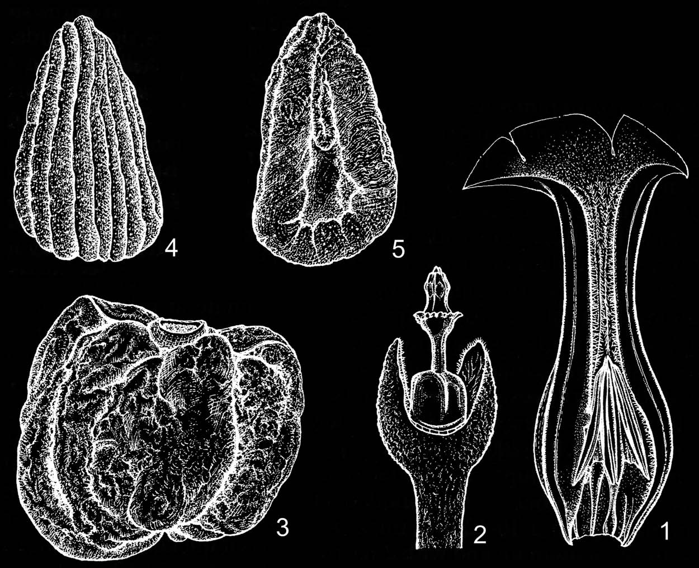
*Caption:* Planche 118 . Tabernaemontana psorocarpa : 1. Tube de la corolle ouvert (× 4). – 2. Partie du calice et

---

## Figure 226 (page 255)
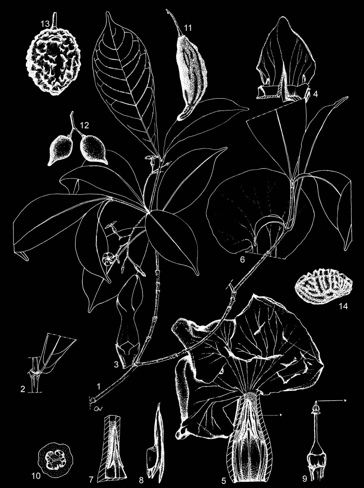
*Caption:* Planche 119 . Tabernanthe iboga %UDQFKHÀRULIqUHîò±%DVHG¶XQHIHXLOOHVXEVHVVLOHî± %RXWRQÀRUDOPUîò±/REHGXFDOLFHIDFHLQWHUQHî±&RUROOHFRXSHORQJLWXGLQDOH (× 5). – 6. Lobe de la corolle (× 5). – 7. Étamine, vue dorsale (× 5). – 8. Idem, vue latérale (× 10). – 9.

---

## Figure 227 (page 256)
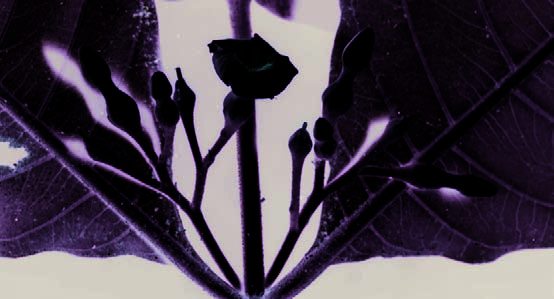
*Caption:* Figure 14 . Tabernanthe iboga $,QÀRUHVFHQFH%)UXLW± Vahadenia laurentii : C. Tige fructifère ; D.

---

## Figure 228 (page 256)
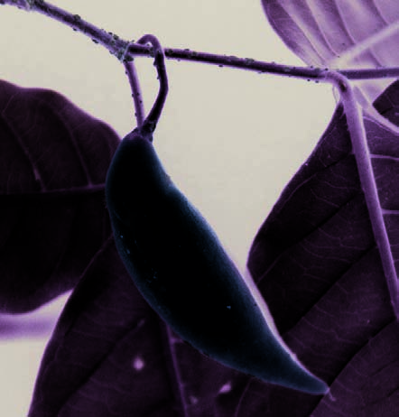
*Caption:* (no caption)

---

## Figure 229 (page 256)
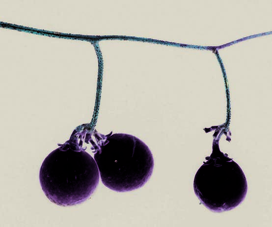
*Caption:* (no caption)

---

## Figure 230 (page 256)
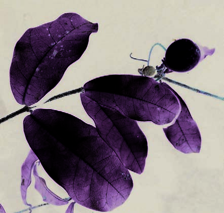
*Caption:* (no caption)

---

## Figure 231 (page 256)
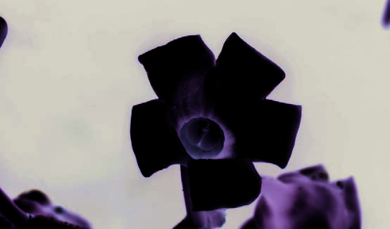
*Caption:* (no caption)

---

## Figure 232 (page 256)
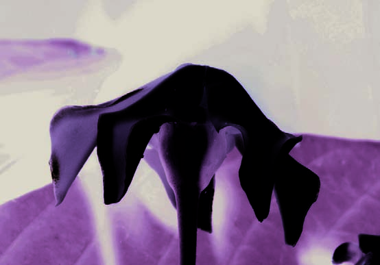
*Caption:* (no caption)

---

## Figure 233 (page 256)
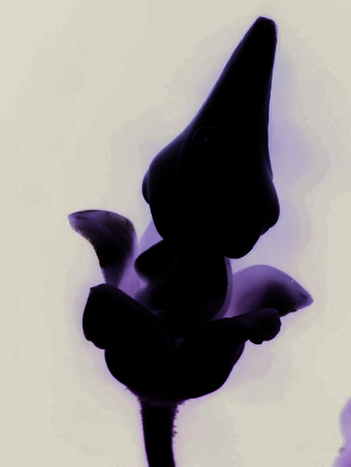
*Caption:* (no caption)

---

## Figure 234 (page 259)
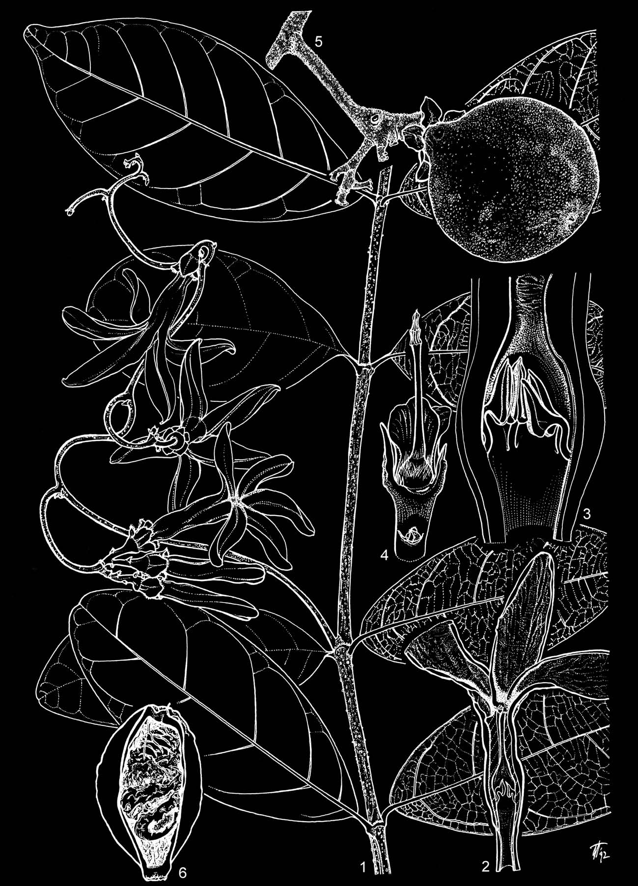
*Caption:* Planche 120 . Vahadenia laurentii %UDQFKHÀRULIqUHîҀ±&RUROOHFRXSHORQJLWXGLQDOHî± 3. Coupe longitudinale d’une partie de la corolle, montrant les étamines (× 4). – 4. Coupe longitudinale

---

## Figure 235 (page 264)
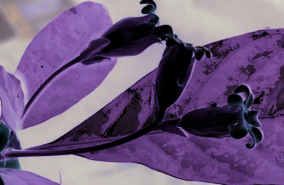
*Caption:* Figure 15 . Voacanga bambidiensis $,QÀRUHVFHQFH%)OHXUYXHGHIDFH± Voacanga bidaultii : C.

---

## Figure 236 (page 264)
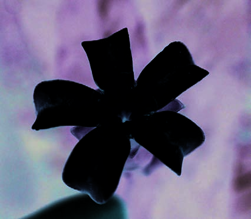
*Caption:* (no caption)

---

## Figure 237 (page 264)
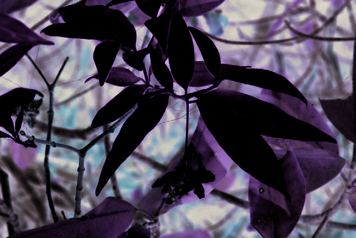
*Caption:* (no caption)

---

## Figure 238 (page 264)
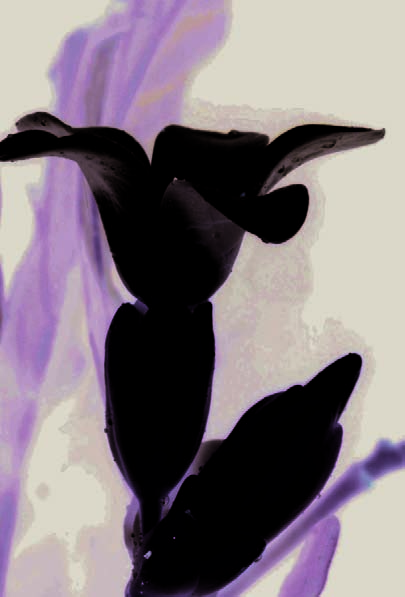
*Caption:* (no caption)

---

## Figure 239 (page 264)
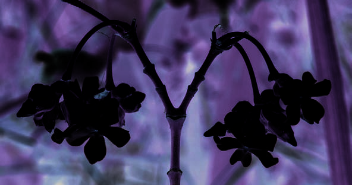
*Caption:* (no caption)

---

## Figure 240 (page 264)
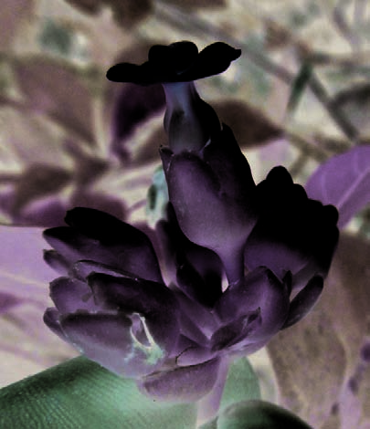
*Caption:* (no caption)

---

## Figure 241 (page 264)
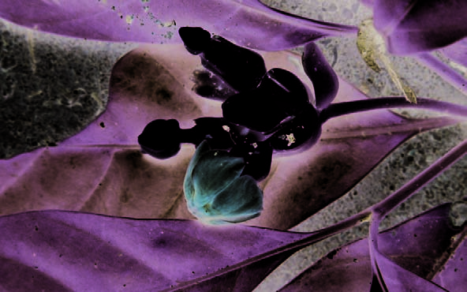
*Caption:* (no caption)

---

## Figure 242 (page 266)
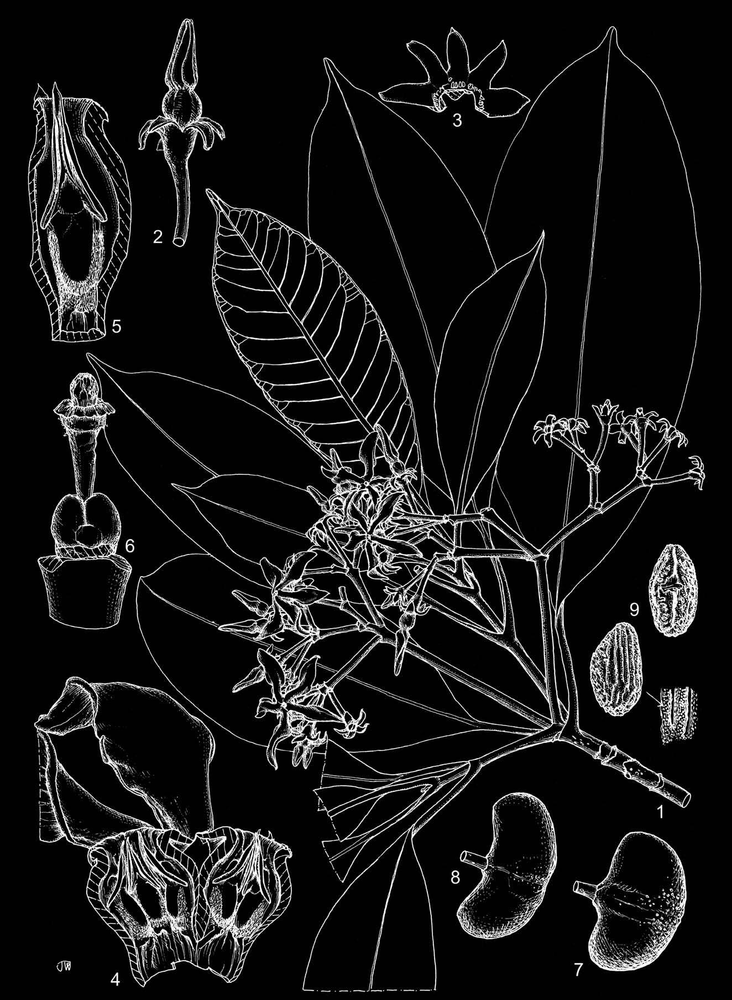
*Caption:* Planche 122 . Voacanga chalotiana 5DPHDX ÀRULIqUH ± %RXWRQ ÀRUDO ± &DOLFH ouvert, avec collétères (× 2). – 4. Corolle, coupe longitudinale, avec étamines (× 4). – 5. Étamine, vue

---

## Figure 243 (page 268)
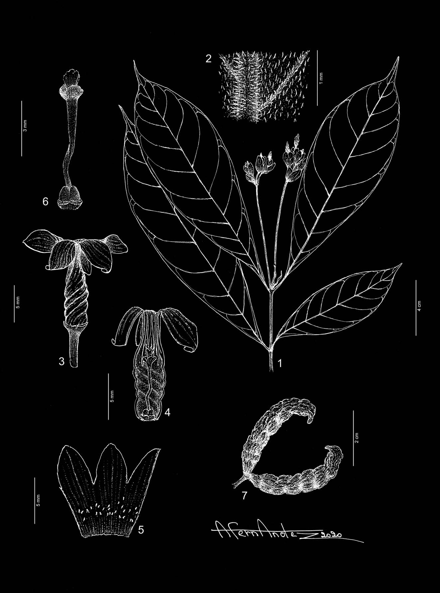
*Caption:* Planche 123 . Voacanga cornuta 5DPHDXÀRULIqUH±'pWDLOGXOLPEHIROLDLUHIDFHLQIpULHXUH±

---

## Figure 244 (page 270)
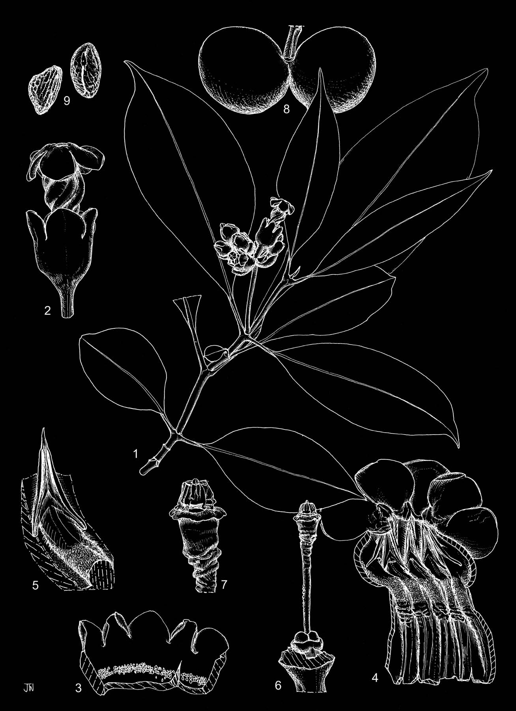
*Caption:* Planche 124 . Voacanga lanceolata 5DPHDXÀRULIqUHîҀ±)OHXUî±&DOLFHRXYHUWIDFH interne avec collétères (× 2). – 4. Corolle ouverte, avec étamines (× 3). – 5. Étamine, vue ventrale (× 6).

---

## Figure 245 (page 272)
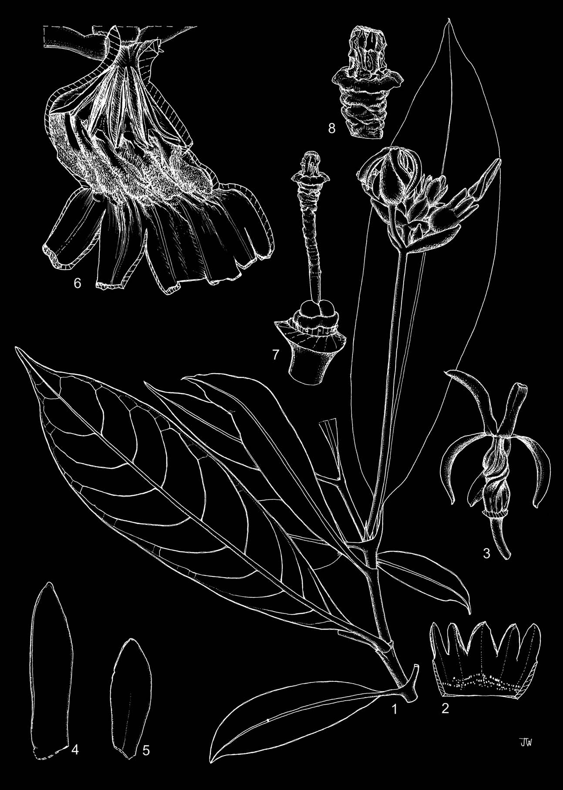
*Caption:* Planche 125 . Voacanga psilocalyx 5DPHDXÀRULIqUHîҀ±&DOLFHRXYHUWDYHFFROOpWqUHVî – 3. Fleur, calice enlevé (× 1). – 4, 5. Lobes de la corolle (× 2). – 6. Corolle ouverte, avec étamines (× 3). – 7. Pistil (× 3). – 8. Tête du pistil (× 6). (1-4, 6-8 : van Meer 1265 ; 5 : Leeuwenberg 5571 ). Dessin par

---

## Figure 246 (page 274)
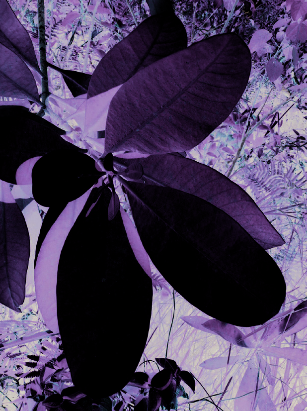
*Caption:* Figure 16 . Voacanga thouarsii : A. Feuillage ; B. Tige fructifère ; C. Fleur, vue de face. – Voacanga wie- ringae ',QÀRUHVFHQFH(&DOLFHFRXSpPRQWUDQWODEDQGHGHFROOpWqUHV))OHXUYXHGHIDFH*)UXLW +,QÀRUHVFHQFHHQERXWRQ3KRWRVSDU&DUHO-RQJNLQG$&*UDQG&DSH0RXQW/LEpULD%/RID /LEpULD2OLYLHU/DFKHQDXG')0DVVLIGX0D\RPEH*DERQ7DULT6WpYDUW*.RXODPRXWRX3DQD

---

## Figure 247 (page 274)
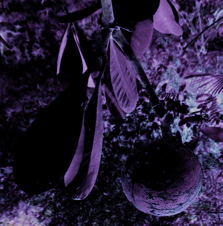
*Caption:* (no caption)

---

## Figure 248 (page 274)
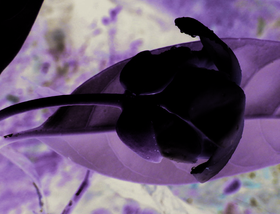
*Caption:* (no caption)

---

## Figure 249 (page 274)
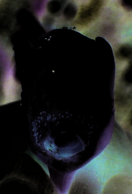
*Caption:* (no caption)

---

## Figure 250 (page 274)
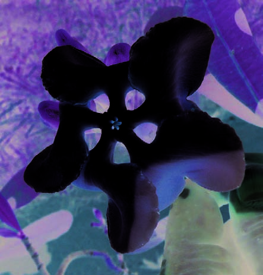
*Caption:* (no caption)

---

## Figure 251 (page 274)
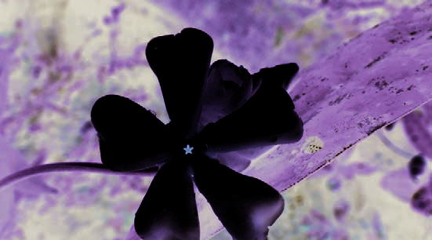
*Caption:* (no caption)

---

## Figure 252 (page 274)
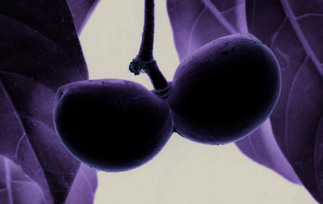
*Caption:* (no caption)

---

## Figure 253 (page 274)
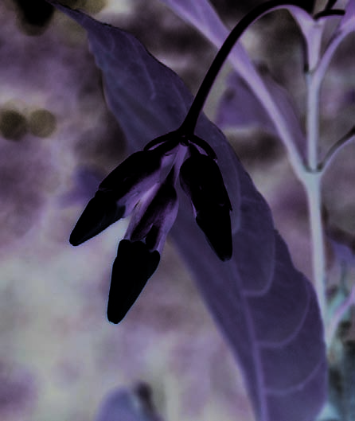
*Caption:* (no caption)

---

## Figure 254 (page 275)
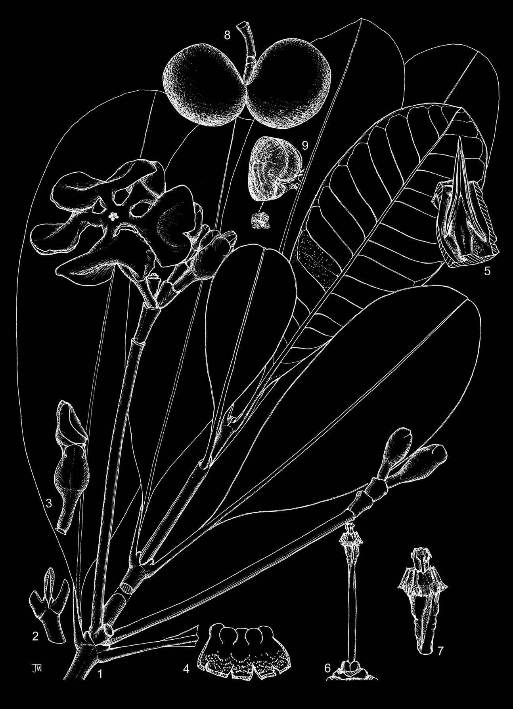
*Caption:* Planche 126 . Voacanga thouarsii 5DPHDX ÀRULIqUH ± 6RPPHW G¶XQ UDPHDX ± %RXWRQÀRUDOîҀ±&DOLFHRXYHUWDYHFFROOpWqUHVîҀ±eWDPLQHIDFHYHQWUDOHî±3LVWLO

---

## Figure 255 (page 284)

*Caption:* (no caption)

---

## Figure 256 (page 284)

*Caption:* (no caption)

---

## Figure 257 (page 284)

*Caption:* (no caption)

---

## Figure 258 (page 284)

*Caption:* (no caption)

---

## Figure 259 (page 284)
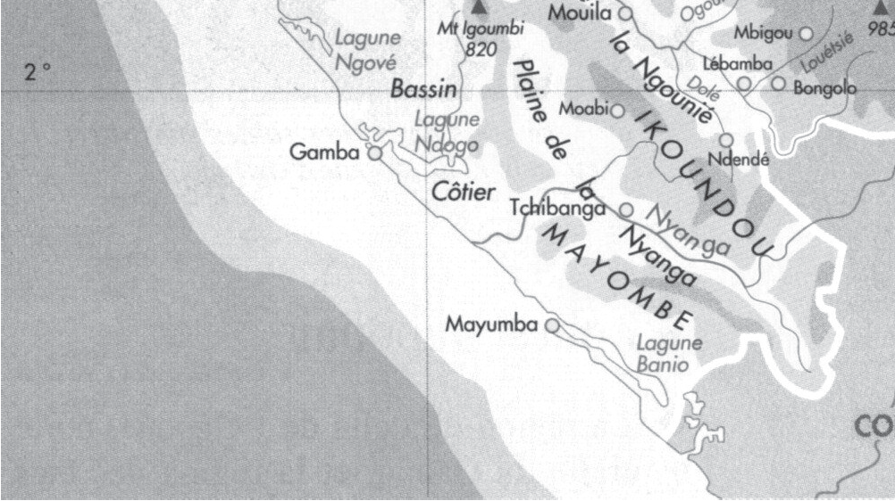
*Caption:* (no caption)

---
