## Figure 0 (page 2)

*Caption:* (no caption)

---

## Figure 1 (page 2)
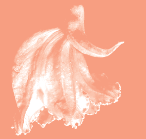
*Caption:* (no caption)

---

## Figure 2 (page 2)

*Caption:* (no caption)

---

## Figure 3 (page 2)
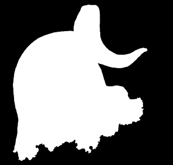
*Caption:* (no caption)

---

## Figure 4 (page 2)
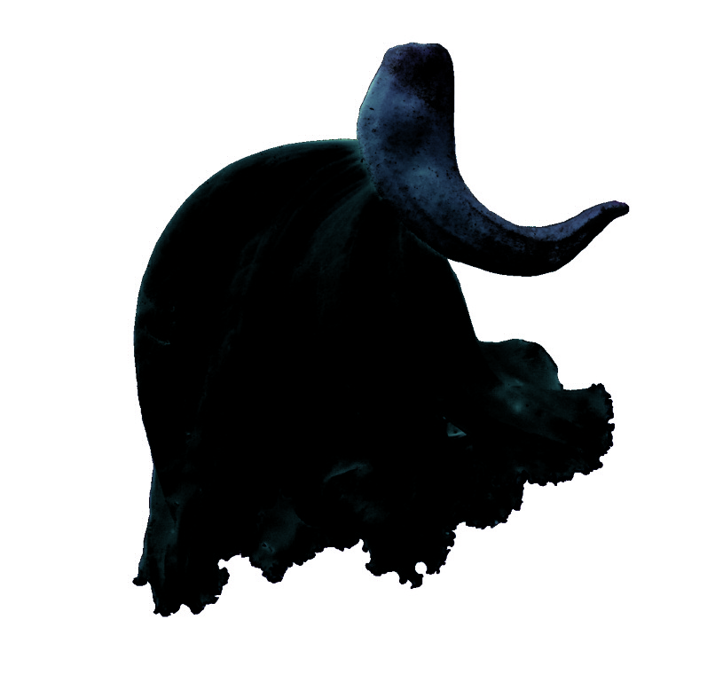
*Caption:* (no caption)

---

## Figure 5 (page 2)

*Caption:* (no caption)

---

## Figure 6 (page 3)

*Caption:* (no caption)

---

## Figure 7 (page 3)
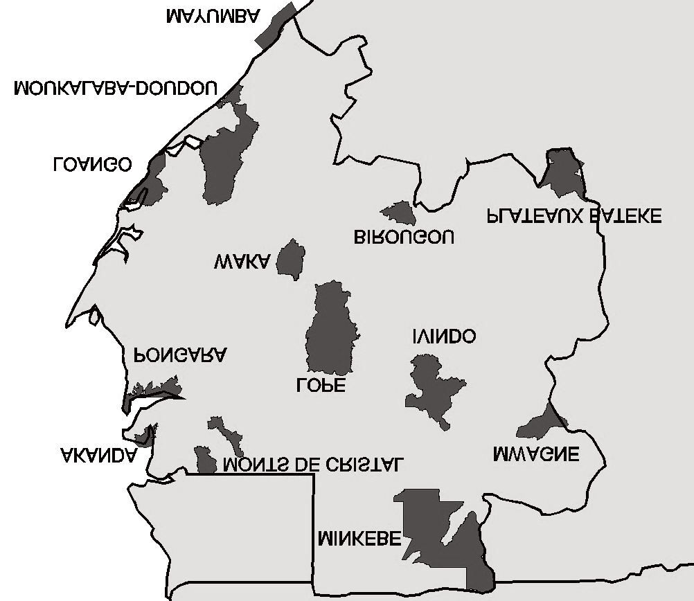
*Caption:* (no caption)

---

## Figure 8 (page 3)

*Caption:* (no caption)

---

## Figure 9 (page 3)

*Caption:* (no caption)

---

## Figure 10 (page 3)
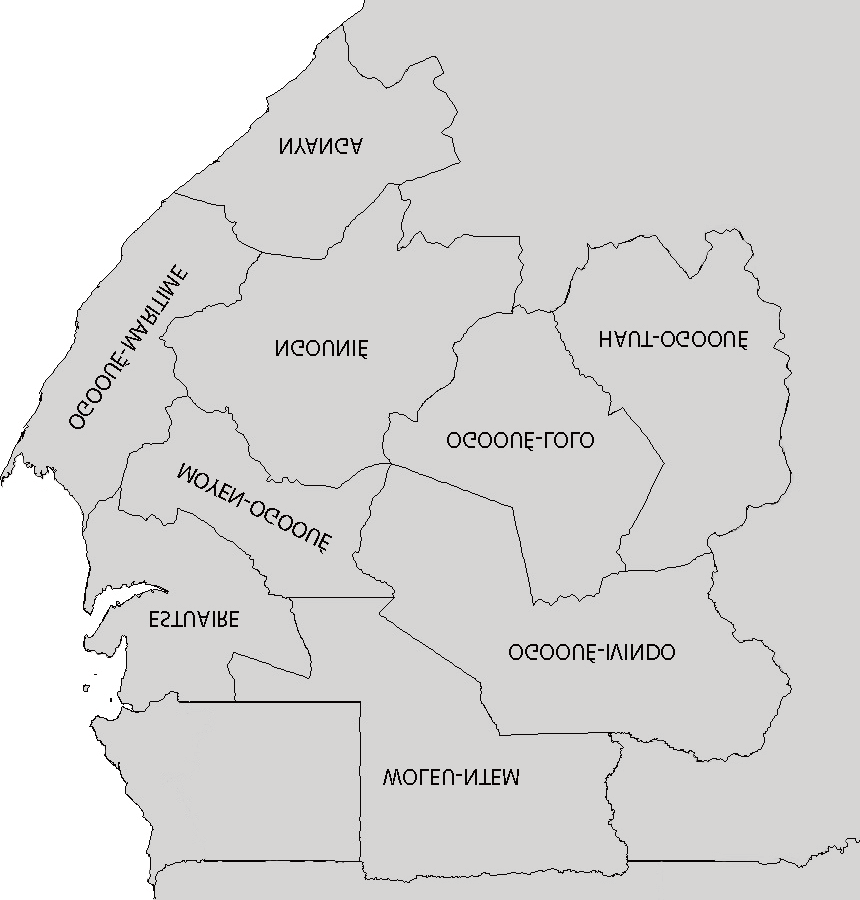
*Caption:* (no caption)

---

## Figure 11 (page 3)
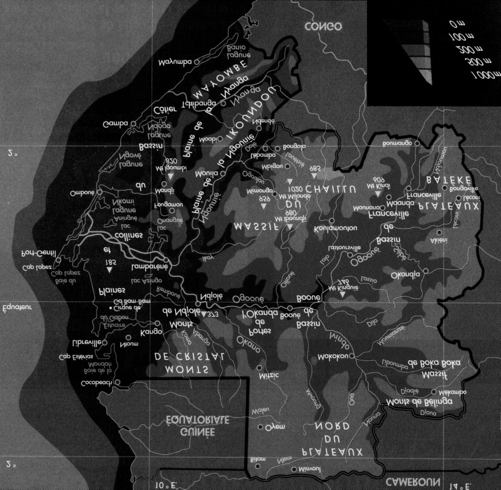
*Caption:* (no caption)

---

## Figure 12 (page 4)

*Caption:* (no caption)

---

## Figure 13 (page 4)
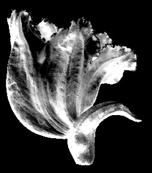
*Caption:* (no caption)

---

## Figure 14 (page 12)
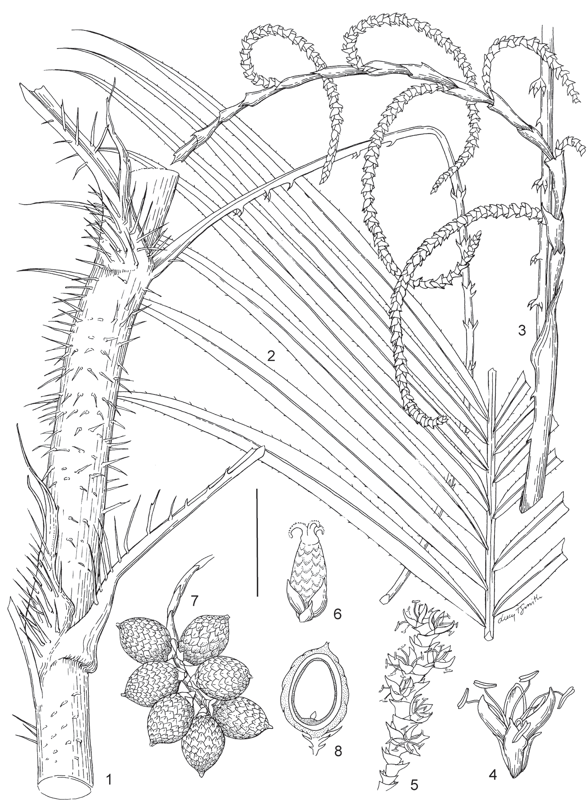
*Caption:* Planche 1 . Calamus deerratus : 1. Stipe mature. – 2. Partie de la feuille. – 3. Inflorescence et partie du flagelle. – 4. Fleur mâle. – 5. Rameau florifère mâle. – 6. Fleur femelle. – 7. Fruits. – 8. Fruit, coupe lon - gitudinale. Barre d’échelle : 1 = 8 cm, 2 = 5 cm, 3 = 10 cm, 4 = 7 mm, 5 = 5 cm, 6 = 5 mm, 7 = 2 cm, 8 = 1,5 cm. (1, 2 : Sunderland 22 ; 3-5 : Sunderland 1754 ; 6 : Deighton 1847 ; 7, 8 : Eggeling 1626 ). Dessin par Lucy T. Smith, reproduit avec permission à partir de Sunderland (2012).

---

## Figure 15 (page 14)
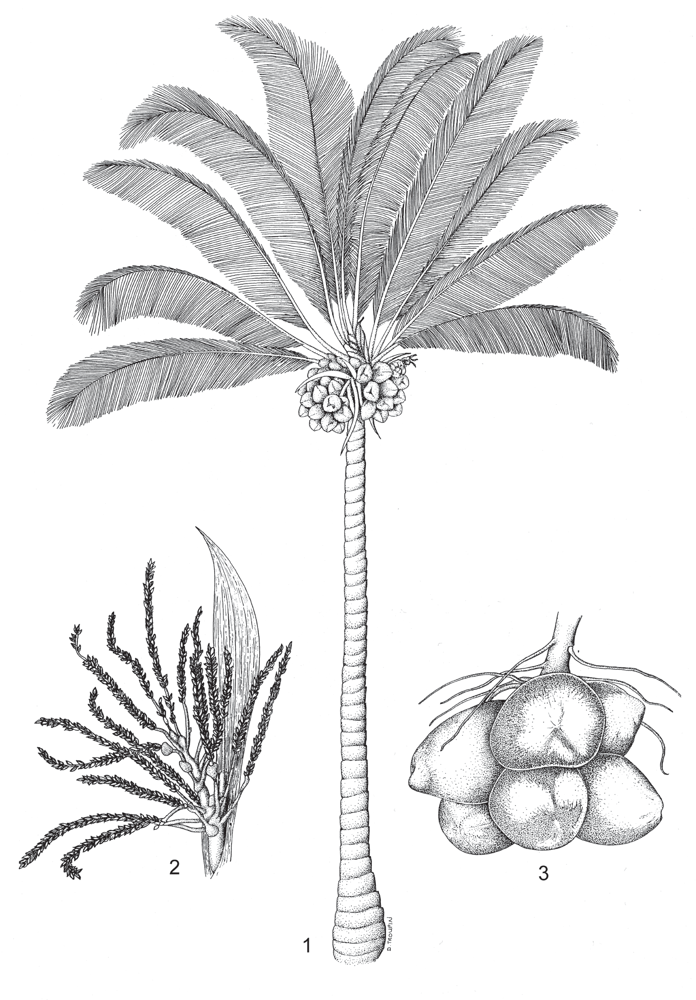
*Caption:* Planche 2 . Cocos nucifera : 1. Port. – 2. Inflorescence. – 3. Infrutescence. Dessin par Dominique Trou - pin, Agence Générale de Coopération et Développement de Belgique (©), reproduit avec permission à partir de Raemakers (2001).

---

## Figure 16 (page 16)
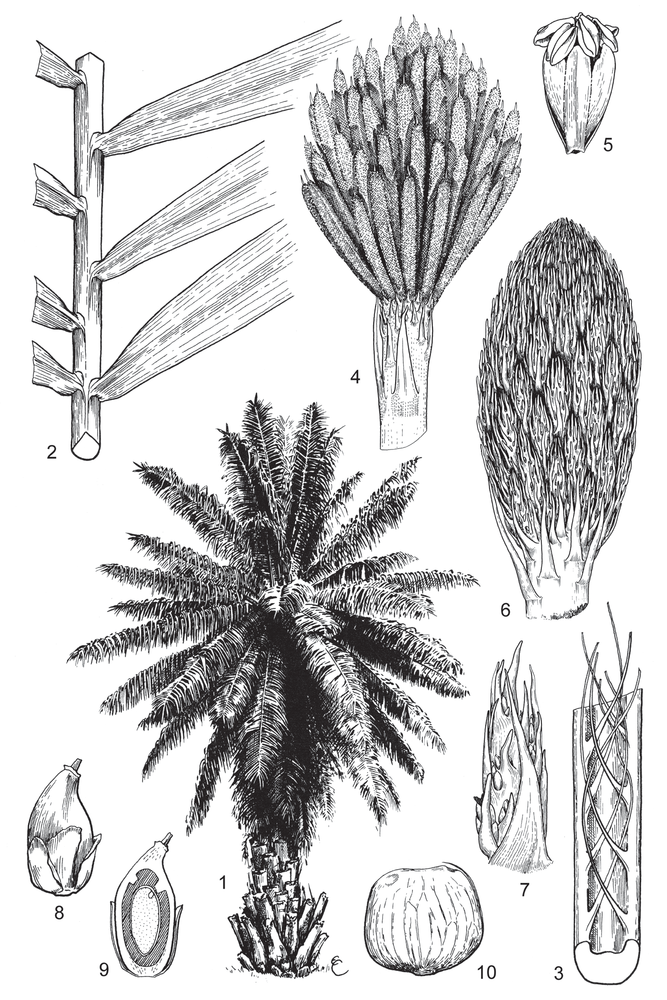
*Caption:* Planche 3 . Elaeis guineensis : 1. Port (× 1/100). – 2. Section du milieu de la feuille (× ⅔). – 3. Partie du pétiole avec épines (× ⅔). – 4. Inflorescence mâle (× / – 5. Fleur mâle (× 6). – 6. Inflorescence femelle 1 5). (× / – 7. Rameau florifère femelle (× / – 8. Fruit (× ⅔). – 9. Idem, coupe longitudinale (× ⅔). – 10. 1 5). 3 5).

---

## Figure 17 (page 19)
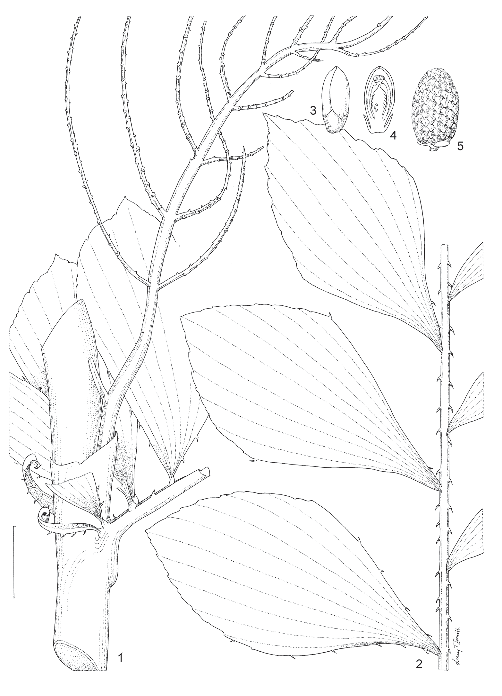
*Caption:* Planche 4 . Eremospatha cabrae : 1. Stipe mature et inflorescence. – 2. Folioles. – 3. Fleur. – 4. Idem, coupe longitudinale. – 5. Fruit. Barre d’échelle : 1 = 3 cm, 2 = 6 cm, 3, 4 = 8 mm, 5 = 3 cm. (1 : Leonard 929 ; 2-4 : Louis 3804 ; 5 : Louis 5656 ). Dessin par Lucy T. Smith, reproduit avec permission à partir de

---

## Figure 18 (page 21)
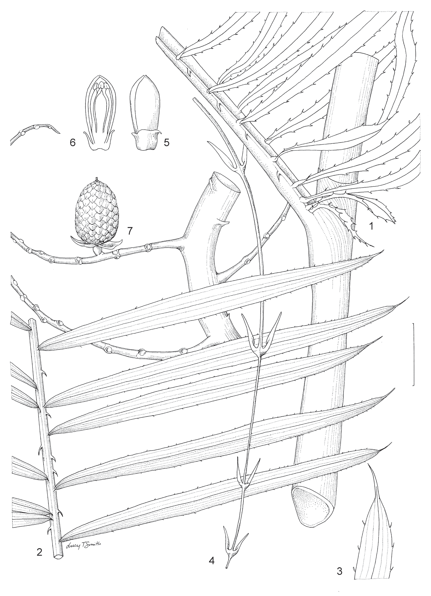
*Caption:* Planche 5 . Eremospatha cuspidata : 1. Stipe mature. – 2. Folioles. – 3. Sommet d’une foliole. – 4.

---

## Figure 19 (page 23)
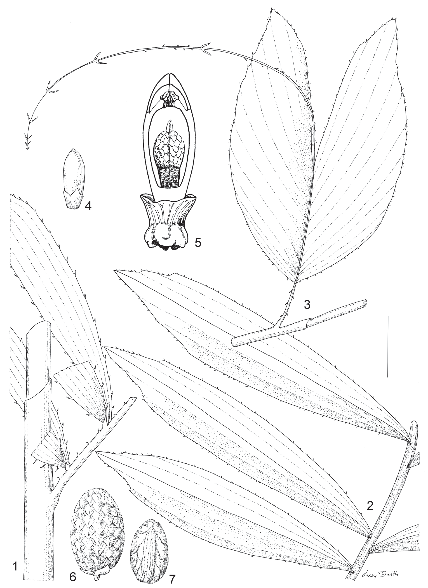
*Caption:* Planche 6 . Eremospatha haullevilleana : 1. Stipe mature. – 2. Folioles. – 3. Jeune feuille. – 4. Bouton floral. – 5. Fleur, corolle en coupe longitudinale. – 6. Fruit. – 7. Graine. Barre d’échelle : 1 = 1,5 cm, 2, 3 = 5 cm, 4 = 1 cm, 5 = 0,3 cm, 6, 7 = 2,5 cm. (1-3 : Bidgood et al. 2924 ; 4 : Evrard 5511 ; 5 : Gossweiler 10087 ; 6, 7 : Louis 9560 . Dessin par Lucy T. Smith, reproduit avec permission à partir de Sunderland (2012).

---

## Figure 20 (page 24)
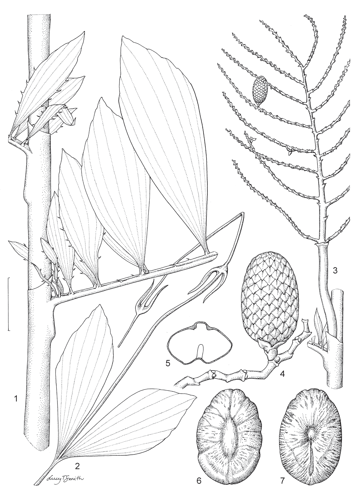
*Caption:* Planche 7 . Eremospatha hookeri : 1. Stipe mature. – 2. Folioles et cirrhe. – 3. Infrutescence. – 4. Idem, détail avec fruit. – 5. Graine, coupe longitudinale. – 6, 7. Idem, vue ventrale et dorsale. Barre d’échelle : 1-3 = 5 cm, 4 = 2,5 cm, 5 = 1,5 cm, 6, 7 = 1,2 cm. (1-7 : Mann 451 ). Dessin par Lucy T. Smith, reproduit avec permission à partir de Sunderland (2012).

---

## Figure 21 (page 26)
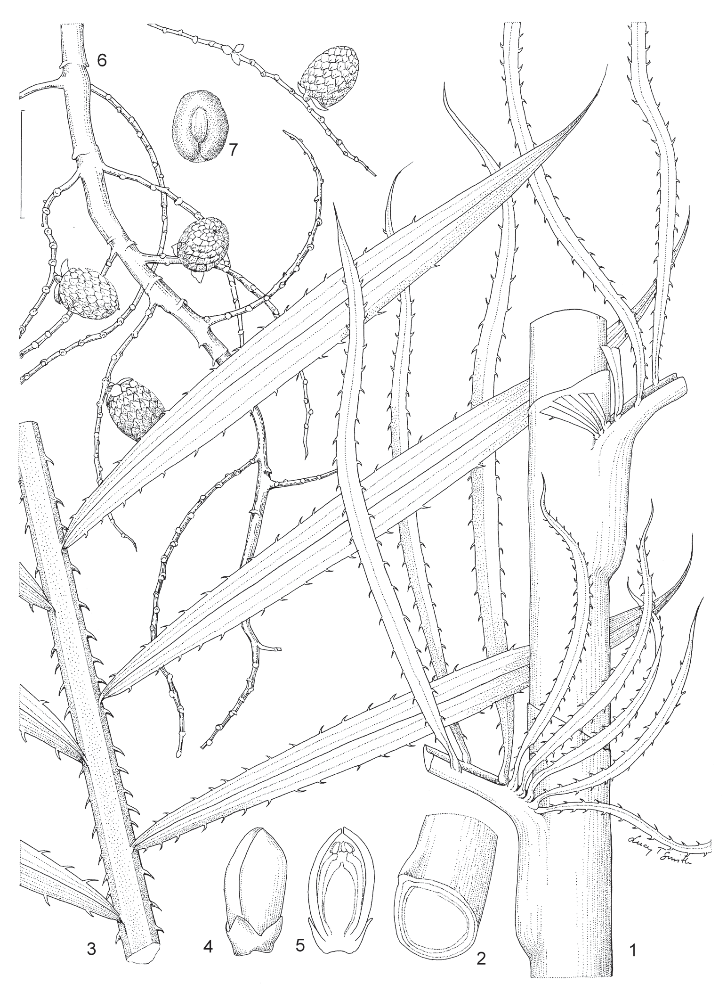
*Caption:* Planche 8 . Eremospatha laurentii : 1. Stipe mature. – 2. Idem, coupe transversale. – 3. Folioles. – 4.

---

## Figure 22 (page 28)
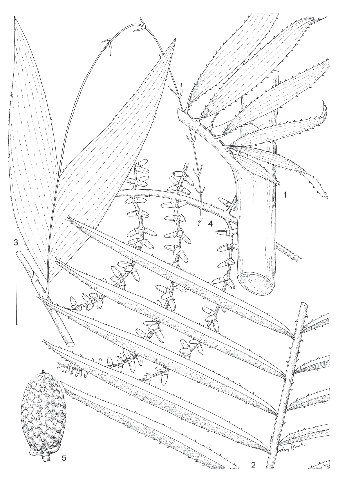
*Caption:* Planche 9 . Eremospatha macrocarpa : 1. Stipe mature. – 2. Folioles. – 3. Jeune feuille. – 4. Inflorescence. – 5. Fruit. Barre d’échelle : 1 = 3 cm, 2-4 = 5 cm, 5 = 2,5 cm. (1, 2, 4 : Sunderland 1886 ; 3 : Sunderland 1901 ; 5 : Sunderland 1956 ). Dessin par Lucy T. Smith, reproduit avec permission à partir de Sunderland (2012).

---

## Figure 23 (page 30)
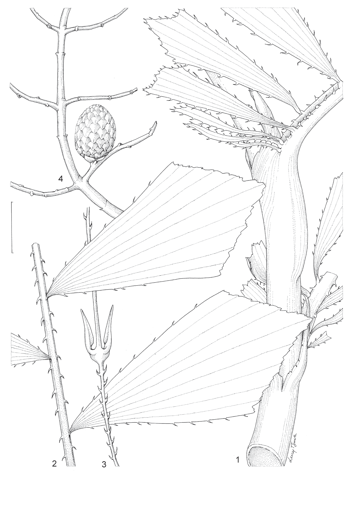
*Caption:* Planche 10 . Eremospatha wendlandiana : 1. Stipe mature. – 2. Folioles. – 3. Folioles-épines. – 4. Fruit et infrutescence. Barre d’échelle : 1 = 6 cm, 2 = 5 cm, 3 = 2 cm, 4 = 2,5 cm. (1-3 : Sunderland 1798 ; 4 :

---

## Figure 24 (page 35)
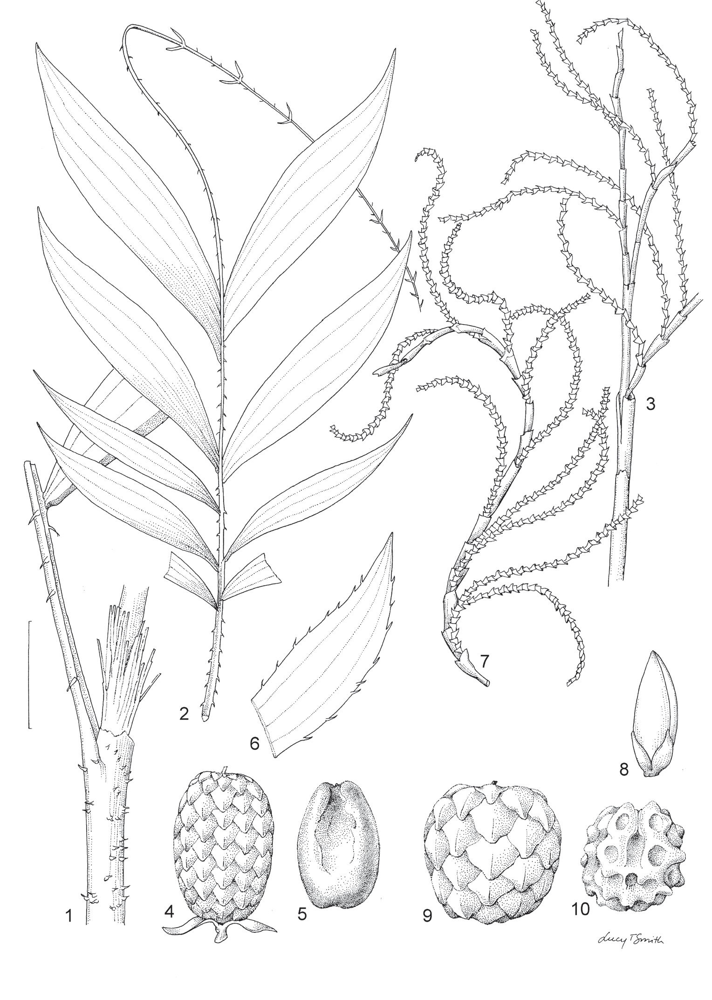
*Caption:* Planche 11 . Laccospermum laeve : 1. Stipe mature. – 2. Feuille. – 3. Inflorescence. – 4. Fruit. – 5. Graine. – Laccospermum opacum : 6. Partie d’une foliole. – 7. Inflorescence. – 8. Fleur en bouton. – 9. Fruit. – 10.

---

## Figure 25 (page 36)
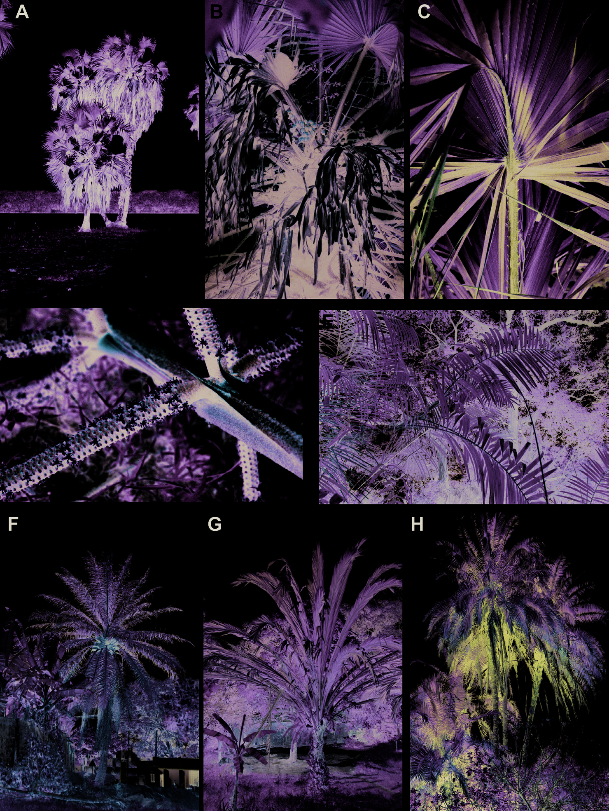
*Caption:* Figure 1 . Hyphaene guineensis (Iguéla, Gabon) : A. Habitat général, B. Détail des feuilles et infru - tescences, C. Détail de la feuille, notez la nature costapalmée de la feuille, D. Détail de l’inflorescence et fleurs. – Calamus deeratus (Obut, Cameroun) : E. Habitat général. – Elaeis guineensis (Kribi, Came- roun) : F. Habitat général. – Elaeis guineensis , forme idolatrica (Bipindi, Cameroun) : G. Folioles sou - dées. – Phoenix reclinata (Belo, Cameroun) : H. Habitat général. (Photos A-D par Johan van Valkenburg © ; E-H par Thomas L.P. Couvreur ©).

---

## Figure 26 (page 37)
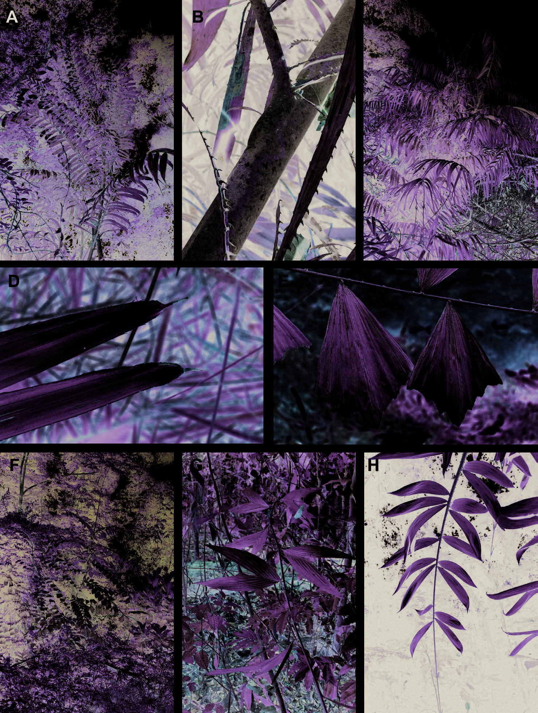
*Caption:* Figure 2 . Eremospatha laurentii (près de Bambidie, Lastoursville) : A. Habitat général, B. Détail de la base des feuilles avec présence d’un genou, ou renflement proéminent. – Eremospatha cuspidata (forêt de la Mondah) : C. Habitat général, D. Détail de l’apex cuspidée (en pointe) d’une foliole. – Eremospatha wendlandiana (Bambidie, Lastoursville) : E. Détail des feuilles rhomboïdales (en queue de poisson), F.

---

## Figure 27 (page 38)
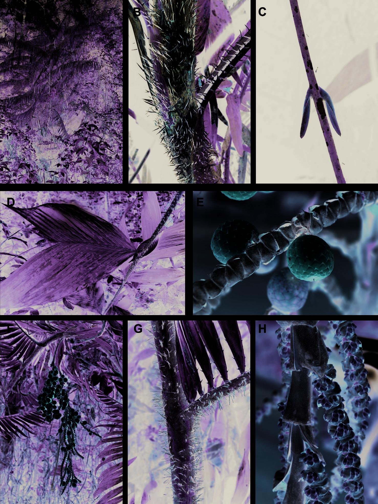
*Caption:* Figure 3 . Laccosperma robustum (Bambidie, Lastoursville) : A. Habitat général, notez les folioles tom - bantes, B. Détail de la base d’une feuille, notez les épines nombreuses et rondes, C. détail d’une foliole- épine sur le cirrhe. – Oncocalamus macrospathus (près de Mandji) : D. Forme juvénile en sous-bois,

---

## Figure 28 (page 39)
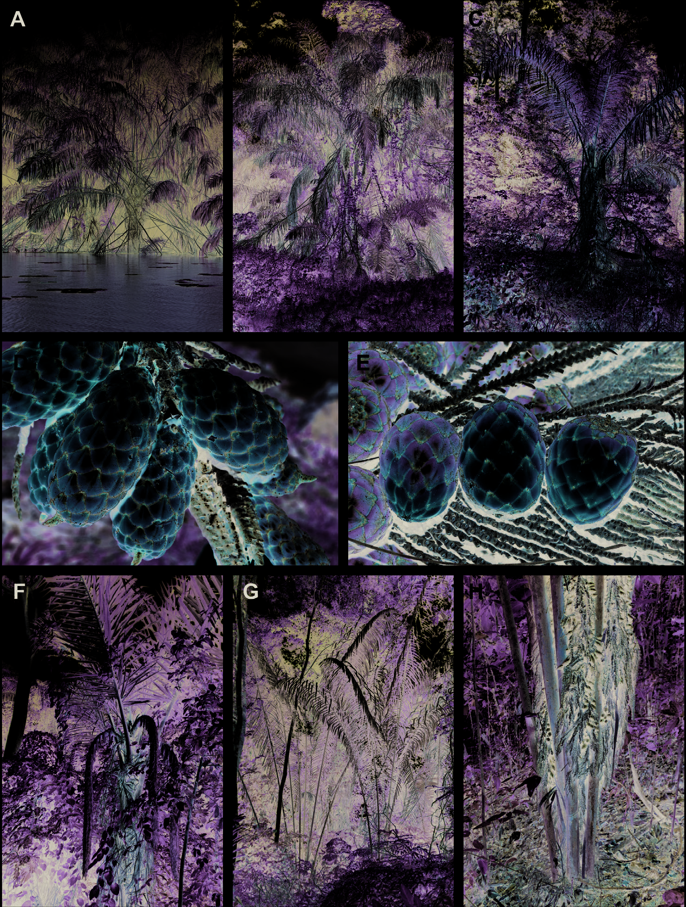
*Caption:* Figure 4 . Raphia hookeri en zone périodiquement inondable (près de Mouila) : A. Habitat général, B.

---

## Figure 29 (page 40)
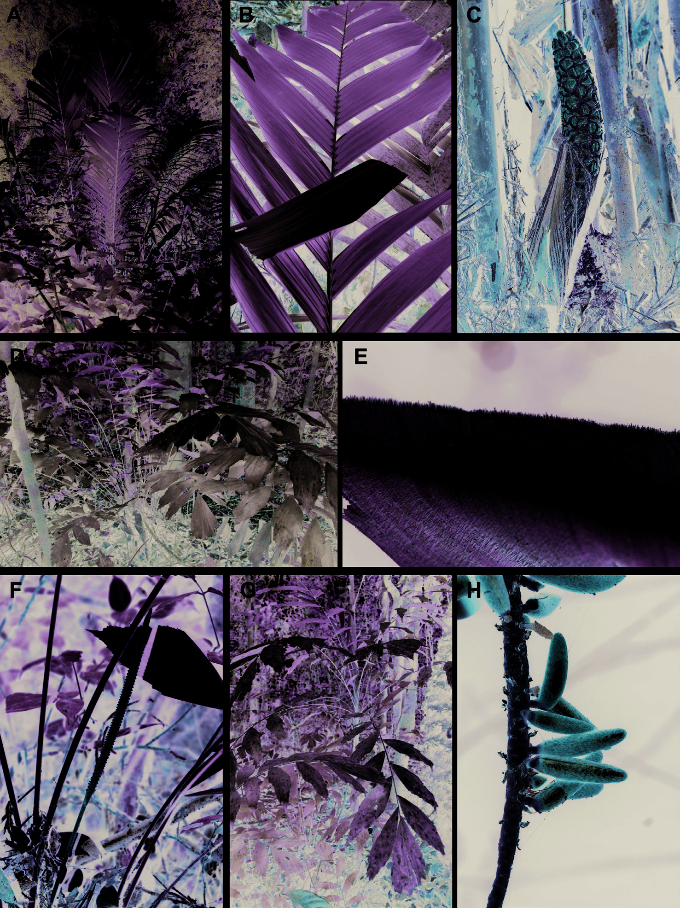
*Caption:* Figure 5 . Sclerosperma walkeri (près de Lastoursville, Gabon) : A. Port et habitat, B. Folioles. – Scle- rosperma mannii (Otottomo, Cameroun) : C. Inflorescence spiciforme et érigée partant de la base des feuilles. – Podococcus acaulis (Ndjolé, Gabon) : D. Port, plante acaule, E. Détail du dessous d’une foliole pubescente, F. Jeune inflorescence spiciforme et érigée partant de la base des feuilles. – Podococcus bar- teri (Mondah, Gabon) : G. Port avec stipe, H. Fruits. (photos par Thomas L.P. Couvreur ©).

---

## Figure 30 (page 42)
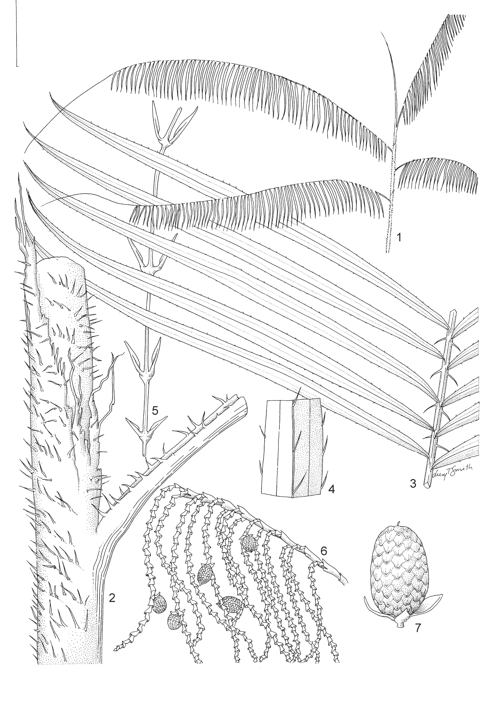
*Caption:* Planche 12 . Laccosperma robustum : 1. Port. – 2. Stipe mature. – 3. Folioles. – 4. Idem, détail. – 5.

---

## Figure 31 (page 44)
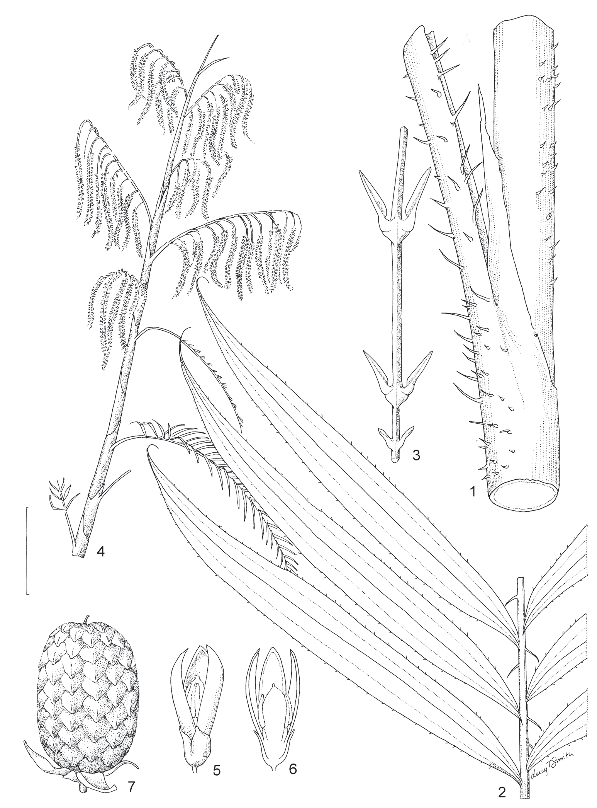
*Caption:* Planche 13 . Laccospermum secundiflorum : 1. Stipe mature. – 2. Folioles. – 3. Folioles-épines. – 4.

---

## Figure 32 (page 47)
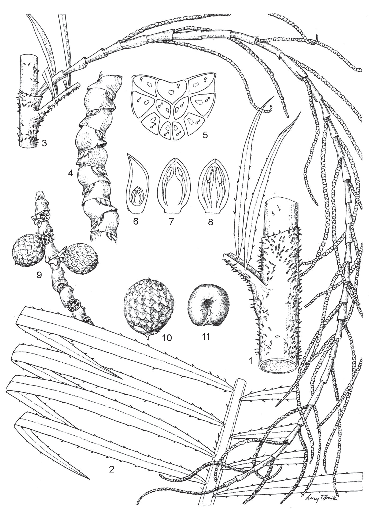
*Caption:* Planche 14 . Oncocalamus macrospathus : 1. Stipe mature. – 2. Folioles. – 3. Inflorescence. – 4. Partie du rameau florifère immature. – 5. Diagramme d’un amas de fleurs. – 6. Fleur femelle avec préfeuille. – 7.

---

## Figure 33 (page 48)
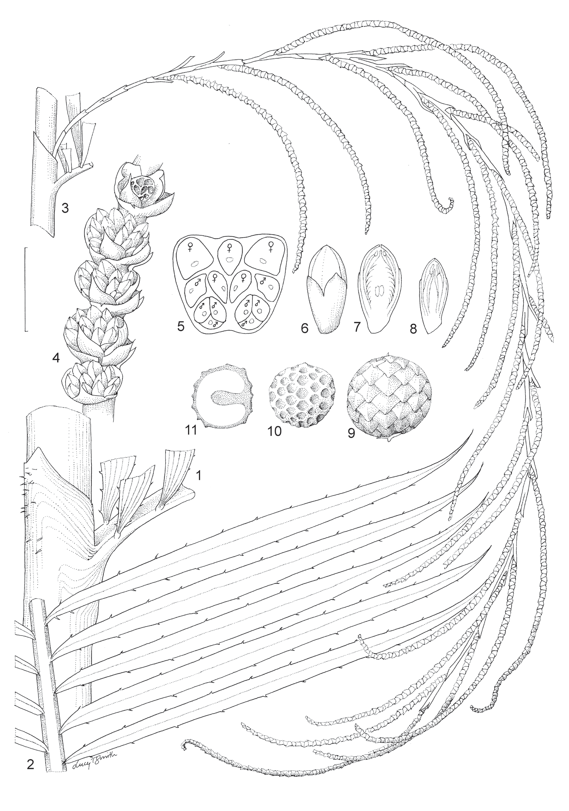
*Caption:* Planche 15 . Oncocalamus mannii : 1. Stipe mature. – 2. Folioles. – 3. Inflorescence. – 4. Partie du rameau florifère. 5. Diagramme d’un amas de fleurs. – 6. Fleur femelle. – 7. Idem, coupe longitudinale. – 8. Fleur mâle. – 9. Fruit. – 10. Graine. – 11. Idem, coupe longitudinale. Barre d’échelle : 1, 2 = 2,5 cm, 3 = 3 cm, 4 = 2,5 cm, 5 = 0,4 cm, 6-8 = 0,5 cm, 9-11 = 1 cm. (1-3 : Sunderland 1921 ; 4-8 : Sunderland 1923 ; 9-11 :

---

## Figure 34 (page 50)
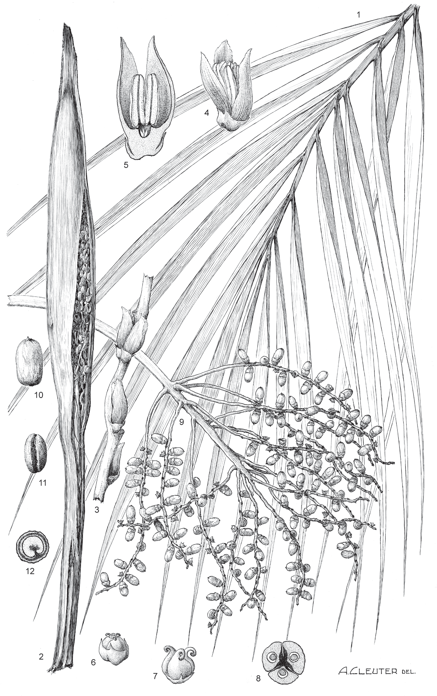
*Caption:* Planche 16 . Phoenix reclinata : 1. Partie supérieure d’une feuille (× ½). – 2. Préfeuille et inflorescence mâle (× ½). – 3. Partie du rameau florifère mâle (× 1,8). – 4. Fleur mâle (× 2,7). – 5. Idem, coupe lon - gitudinale (× 2,7). – 6. Fleur femelle (× 2,7). – 7. Gynécée et staminodes (× 4,5). – 8. Gynécée, coupe transversale (× 9). – 9. Infrutescence jeune (× ½). – 10. Fruit jeune (× 1,4). – 11. Graine (× 0,9). – 12.

---

## Figure 35 (page 53)
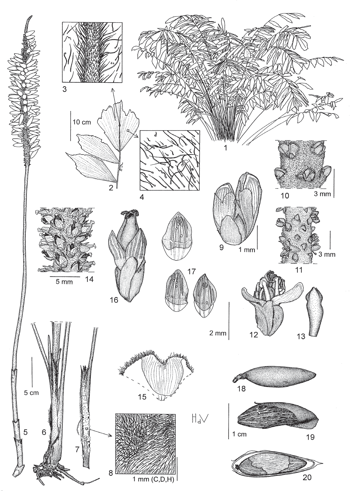
*Caption:* Planche 17 . Podococcus acaulis : 1. Port. – 2. Sommet d’une feuille. – 3, 4. Détail de l’indument sur la face inférieure de la foliole. – 5. Infrutescence. – 6. Pousse, partie basale. – 7. Gaine. – 8. Idem, détail de l’indument. – 9. Triade de deux fleurs mâles et une femelle en bouton. – 10. Partie de l’inflorescence avant l’anthèse mâle. – 11. Idem, à l’anthèse mâle. – 12. Fleur mâle. – 13. Gynécée. – 14. Partie de l’inflorescence à l’anthèse femelle. – 15. Bractée, détail de la surface supérieure. – 16. Fleur femelle. – 17. Pétales, vue de l’intérieur. – 18. Fruit. – 19. Idem, péricarpe partiellement enlevé. – 20. Fruit, coupe longitudinale et avec péricarpe partiellement enlevé. (1 : Sunderland 3032 ; 2-5, 7, 8, 18-20 : Wieringa 5126 ; 6 : van Valkenburg 3134 ; 9, 10 : Wieringa 2917 ; 11-17 : Mcpherson 15078 ). Dessin par Hans de Vries, Naturalis Biodiversity Center (©), reproduit avec permission à partir de van Valkenburg &

---

## Figure 36 (page 54)
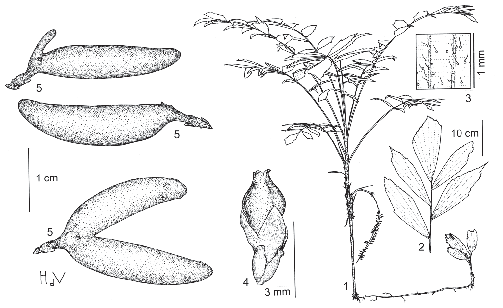
*Caption:* Planche 18 . Podococcus barteri : 1. Port et stolon. – 2. Sommet d’une feuille. – 3. Détail de l’indument sur la face inférieure de la foliole. – 4. Fleur femelle. – 5. Fruits. (1 (port), 3, 5 : van Valkenburg 3236 ; 1 (stolon) : Moore 9900 ; 4 : Bos 2995 ). Dessin par Hans de Vries, Naturalis Biodiversity Center (©), reproduit avec permission à partir de van Valkenburg & Sunderland (2008).

---

## Figure 37 (page 57)
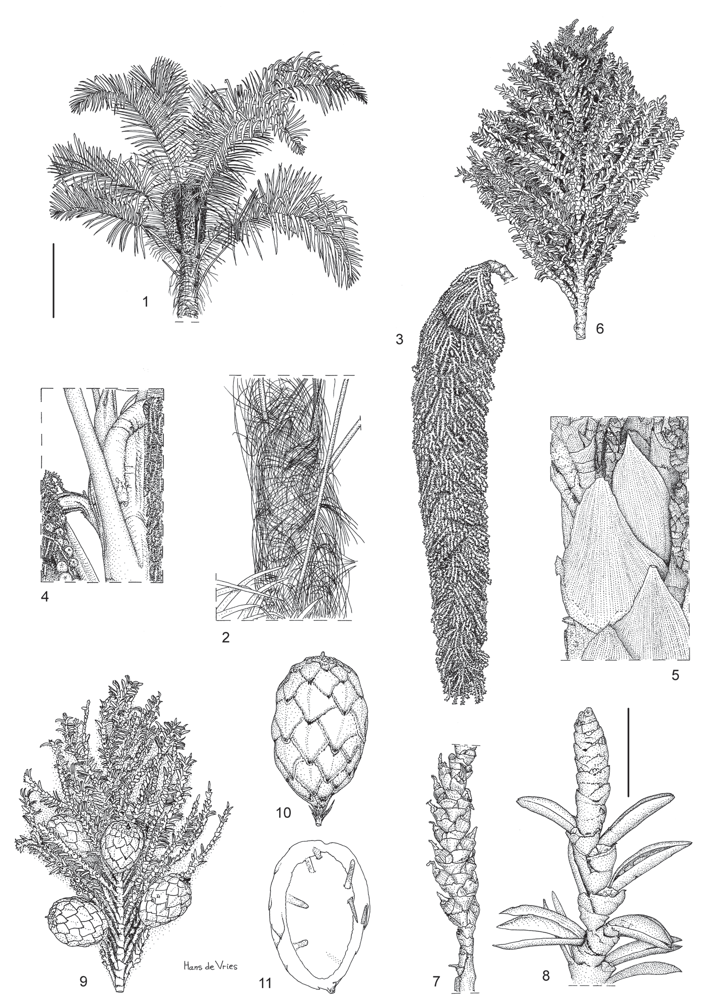
*Caption:* Planche 19 . Raphia gabonica : 1. Habitat (bar = 1 m). – 2. Détails du tronc, notez les fibres faiblement bouclées. – 3. Détail de l’inflorescence. – 4. Détail de la base de l’inflorescence. – 5. Bractées pédon - culaires. – 6. Inflorescence partielle avec des vieilles fleures. – 7. Détail de la partie basale des rameaux florifères avec des vieilles fleures. – 8. Détail de la partie apicale des rameaux florifères avec des vieilles fleures (bar = 1 cm). – 9. Inflorescence partielle avec des vieux fruits. – 10. Fruit. – 11. Coupe longitudi - nale du fruit. (1 : Mogue 22 ; 2-11 : Mogue 23 ). Dessin par Hans de Vries, Naturalis Biodiversity Center (©), reproduit avec permission à partir de Mogue et al. (2018)

---

## Figure 38 (page 59)
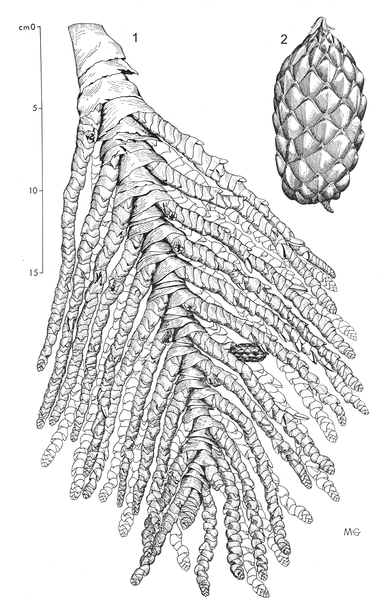
*Caption:* Planche 20 . Raphia hookeri : 1. Partie de l’inflorescence à rameau florifère de deuxième ordre. – 2. Fruit.

---

## Figure 39 (page 61)
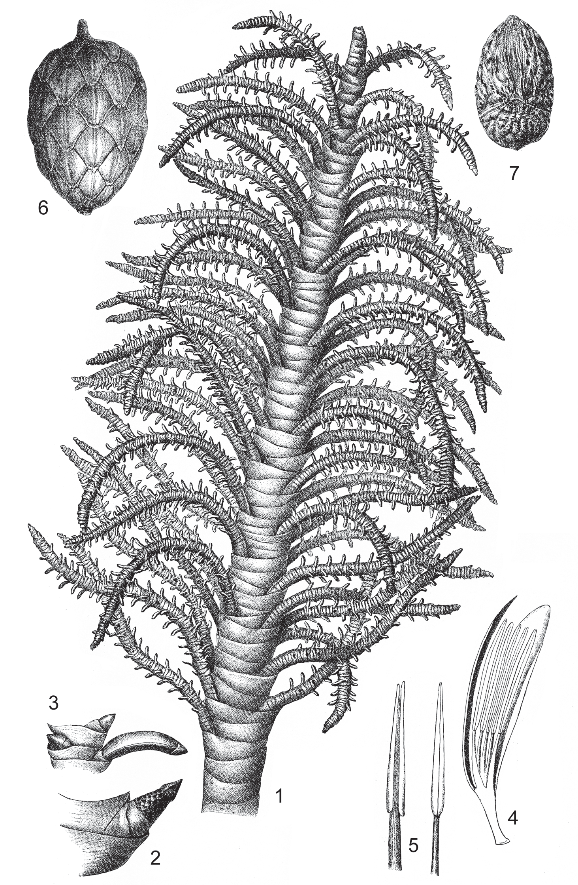
*Caption:* Planche 21. Raphia laurentii : 1. Partie de l’inflorescence à rameau florifère de deuxième ordre. – 2. Fleur femelle. – 3. Fleur mâle. – 4. Idem, coupe longitudinale. – 5. Étamines. – 6. Fruit. – 7. Graine. Dessin par

---

## Figure 40 (page 63)
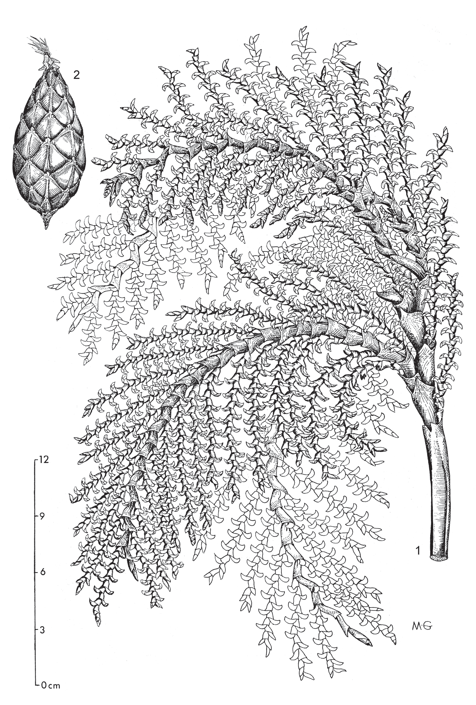
*Caption:* Planche 22 . Raphia regalis : 1. Partie de l’inflorescence. – 2. Fruit (× 0,6). (Barre d’échelle uniquement pour l’inflorescence.) Dessin par M. Grierson, reproduit avec permission à partir de Russel (1965).

---

## Figure 41 (page 66)
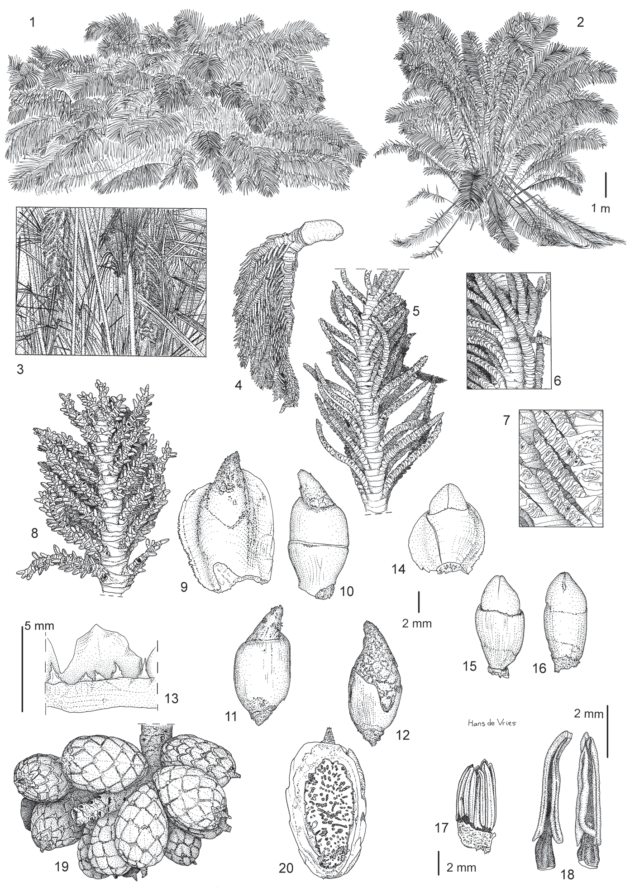
*Caption:* Planche 23 . Raphia zamiana : 1. Habitat en savane. – 2. Habitat en forêt, tronc non visible. – 3. Détail du tronc, avec inflorescence et fibres linéaires et pointues. – 4. Inflorescence. – 5. Inflorescence partielle, jeune. – 6. Détail des rameaux florifères. – 7. Détail de la partie basale des rameaux florifères de 2 ème ordre, montrant les bractées des rameaux florifères encerclant les jeunes fleures. – 8. Détail de l’inflores - cence partielle (× 5). – 9. Fleur femelle (× 5). – 10. Bractée intérieure femelle (× 5). – 11. Calice femelle (× 5). – 12. Corolle femelle (× 5). – 13. Détail des anneaux staminodiales et des staminodes. – 14. Fleur mâle (× 5). – 15. Calice mâle (× 5). – 16. Corole mâle (× 5). – 17. Étamines mâles (× 6). – 18. Détail des étamines mâles (× 12). – 19. Infrutescence. – 20. Fruit, coupe longitudinale. (1 : Couvreur 1122 ; 2-4, 19, 20 : Mogue 17 ; 5-18 : Mogue 44 ). Dessin par Hans de Vries, Naturalis Biodiversity Center (©), reproduit avec permission à partir de Mogue et al . (2018).

---

## Figure 42 (page 68)
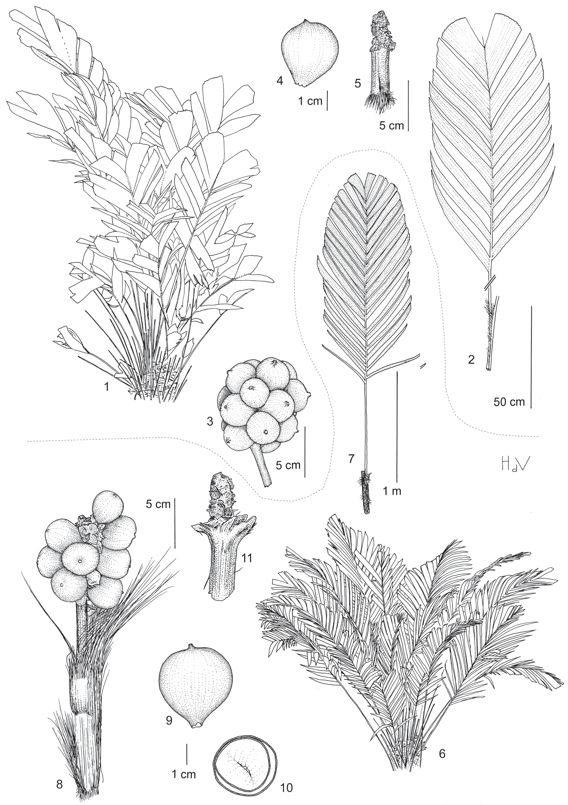
*Caption:* Planche 24 . Sclerosperma mannii : 1. Port. – 2. Feuille. – 3. Infrutescence. – 4. Fruit. – 5. Reste d’une infrutescence. – Sclerosperma walkeri : 6. Port. – 7. Feuille. – 8. Infrutescence. – 9. Fruit. – 10. Idem, coupe transversale. – 11. Reste d’une infrutescence. (1 : photo de van Valkenburg 3234 ; 2, 4, 5 : van

---

## Figure 43 (page 70)
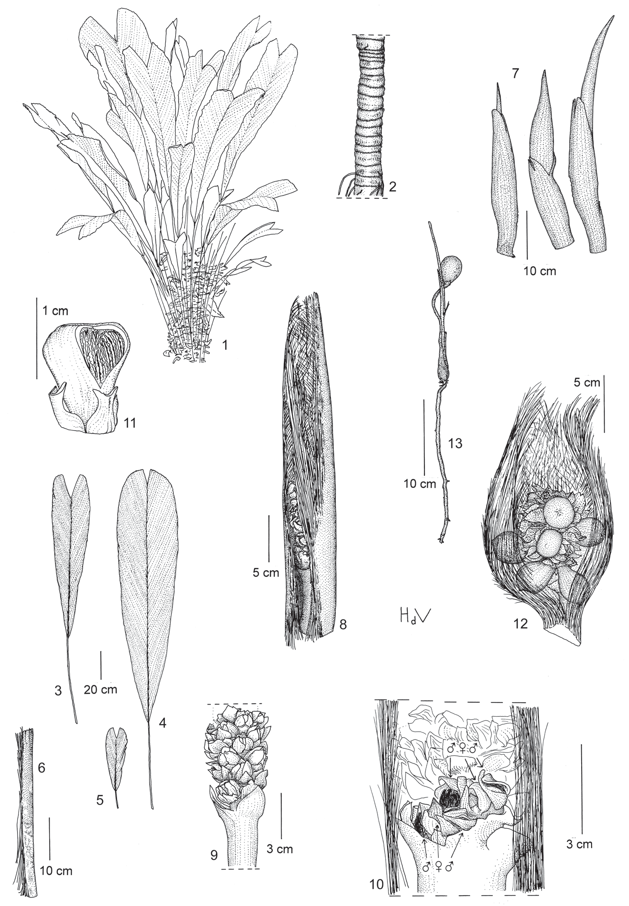
*Caption:* Planche 25 . Sclerosperma profiziana : 1. Port. – 2. Détail du stipe. – 3-5. Feuilles. – 6. Partie basale du pétiole avec gaine. – 7. Stades divers du développement de l’inflorescence immature. – 8. Inflorescence, préfeuille enlevée. – 9. Partie de l’inflorescence avec fruits jeunes. – 10. Partie basale de l’inflorescence en stade mâle, bractée pédonculaire partiellement enlevée. – 11. Fleur mâle de la partie supérieure de l’inflorescence. – 12. Infrutescence à fruits immatures, bractée pédonculaire ouverte. – 13. Plantule. (1 : phot de Hall & Enti GC 36150 ; 2 : photo de Moore 9883 ; 3-5 : Profizi 840 ; 6, 8-10, 11, 13 : Gillet 279a ; 7, 12 : Laurent 1054 ). Dessin par Hans de Vries, Naturalis Biodiversity Center (©), reproduit avec permission à partir de van Valkenburg et al. (2008).

---

## Figure 44 (page 76)

*Caption:* (no caption)

---

## Figure 45 (page 76)

*Caption:* (no caption)

---

## Figure 46 (page 76)

*Caption:* (no caption)

---

## Figure 47 (page 76)

*Caption:* (no caption)

---

## Figure 48 (page 76)

*Caption:* (no caption)

---

## Figure 49 (page 76)

*Caption:* (no caption)

---
