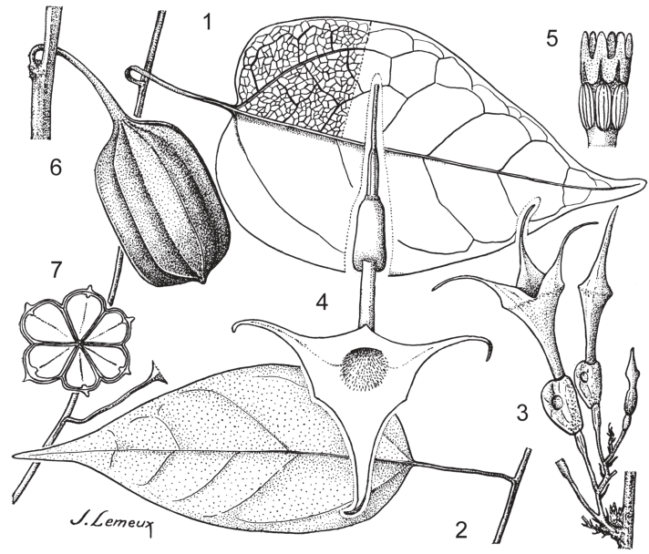
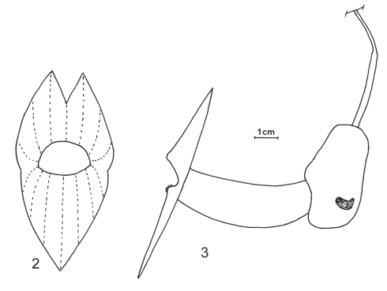
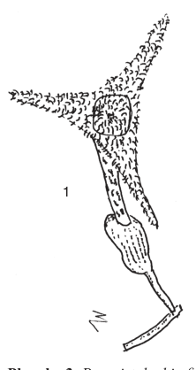
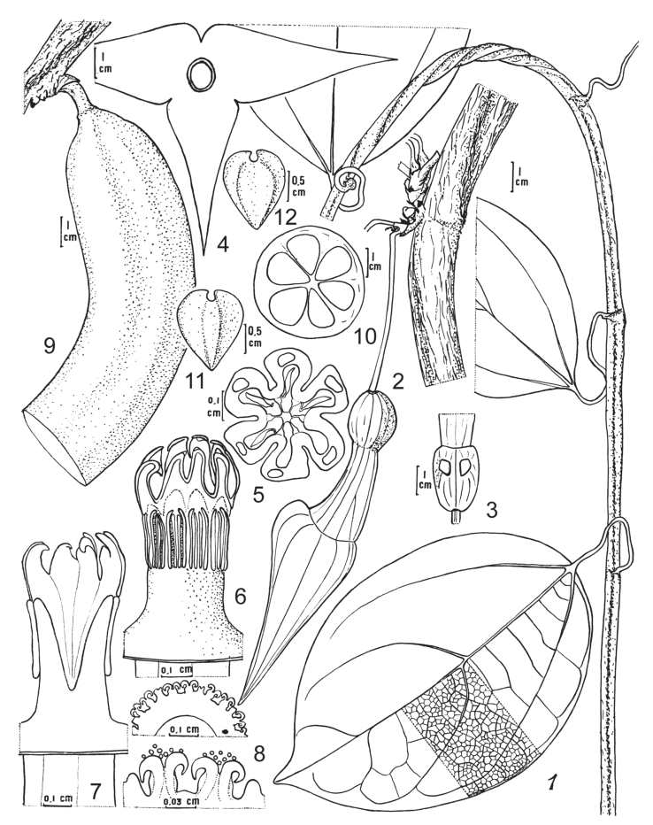
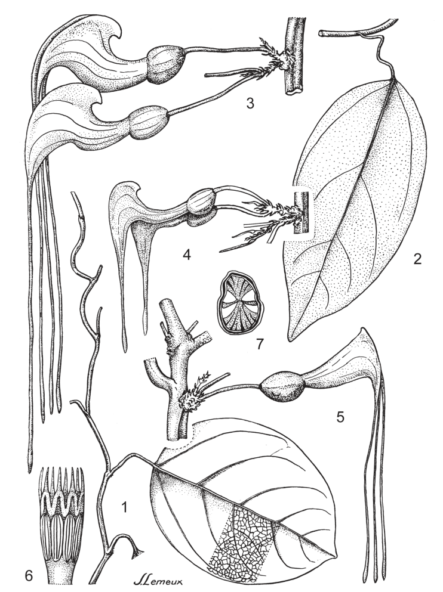
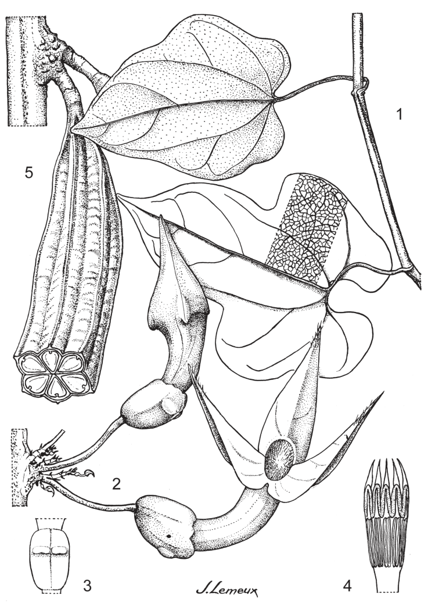
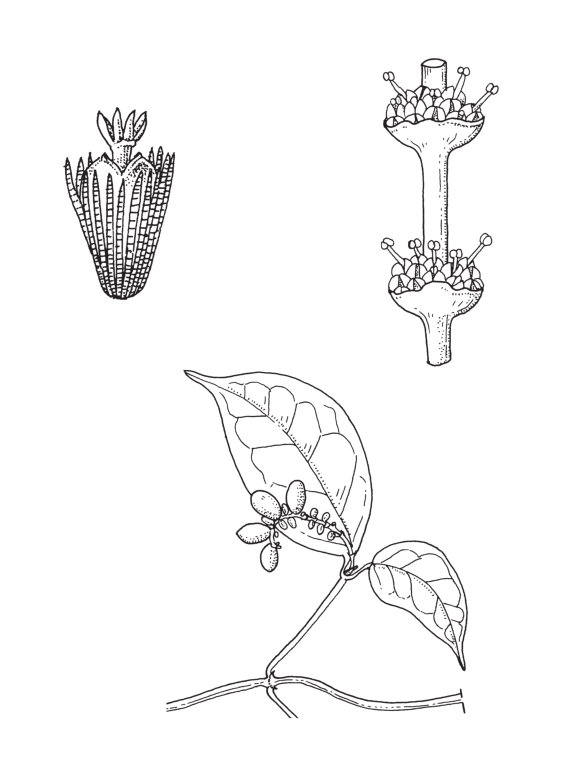

## Figure 9 (page 15)

*Caption:* Planche 2. Pararistolochia ceropegioides . 1, 2. Feuille (× ⅓). – 3. Inflorescence (× ½). – 4. Fleur pendant, vue de face (× 1). − 5. Gynostème (× 10). – 6. Fruit (× ½). – 7. Fruit, coupe transversale (× ½). Dessin par J. Lemeux, reproduit avec permission du Muséum national d’Histoire naturelle (©) à partir de Poncy (1978).

---

## Figure 10 (page 16)

*Caption:* Planche 3. Pararistolochia fimbriata. 1. Fleur. – Pararistolochia incisiloba . 2. Fleur, vue frontale. – 3. Fleur, vue latérale. Dessins par Miguel Leal (1) et Carel Jongkind (2, 3), NCB Naturalis, section

---

## Figure 11 (page 16)

*Caption:* (no caption)

---

## Figure 12 (page 18)

*Caption:* Planche 4. Pararistolochia macrocarpa . 1. Rameau feuillé. – 2. Tige âgée avec inflorescence. – 3.

---

## Figure 13 (page 20)

*Caption:* Planche 5. Pararistolochia promissa . 1, 2. Rameaux feuillés (× ½). – 3–5. Inflorescences, mon- trant la variation du périanthe (× ½). – 6. Gynostème (× 4). – 7. Tige âgée, coupe transversale (× 1). Dessin par J. Lemeux, reproduit avec permission du Muséum national d’Histoire naturelle (©) à partir de Poncy (1978).

---

## Figure 14 (page 22)

*Caption:* Planche 6. Pararistolochia triactina. 1. Jeune rameau feuillé (× ½). – 2. Inflorescence (× ½). – 3. Utricule, vue postérieure montrant les glandes (× ½). – 4. Gynostème (× 4). – 5. Fruit (× ½). Dessin par J. Lemeux, reproduit avec permission du Muséum national d’Histoire naturelle (©) à partir de Poncy (1978).

---

## Figure 15 (page 24)

*Caption:* (no caption)

---
