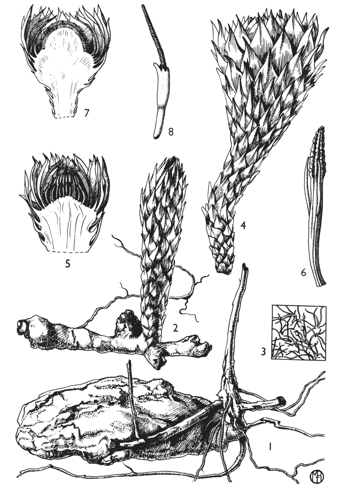
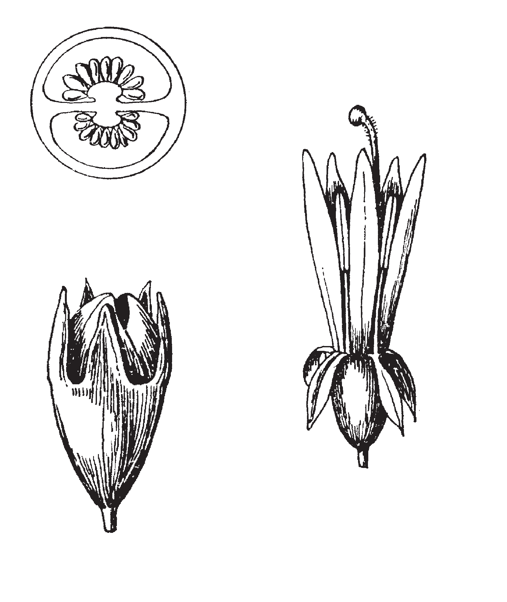
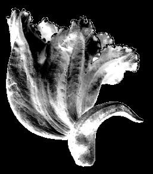

## Figure 14 (page 13)

*Caption:* Planche 2. Thonningia sanguinea : 1. Tubercule au point de contact avec l’hôte (× 1 / ). – 2. Tuber- 1 3 cule avec jeune inflorescence (× ⅔). – 3. Pubescence de la surface du tubercule (× 20). – 4. Inflo- rescence (× ⅔). – 5. Capitule mâle, section longitudinale (× ⅔). – 6. Fleur mâle (× 6). – 7. Capitule femelle, section longitudinale (× ⅔). – 8. Fleur femelle (× 6). (1, 3 : matériel d’origine inconnu ; 2, 4 : Benton 2 ; 5, 6 : Milne-Redhead & Taylor 3745 ; 7, 8 : Milne-Redhead & Taylor 3875 ). Planche par Olive Milne-Redhead (©), reproduite avec permission à partir de Hansen (1993).

---

## Figure 15 (page 15)

*Caption:* (no caption)

---

## Figure 16 (page 15)

*Caption:* (no caption)

---
