## Figure 0 (page 2)

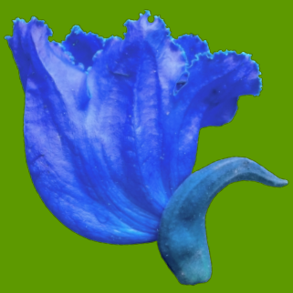

*Caption:* *(no caption detected)*

---

## Figure 1 (page 2)

*Caption:* *(no caption detected)*

---

## Figure 2 (page 3)

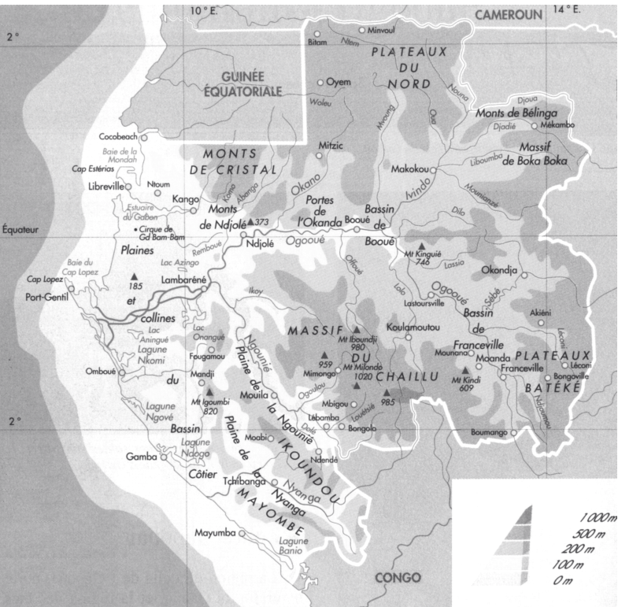

*Caption:* *(no caption detected)*

---

## Figure 3 (page 4)

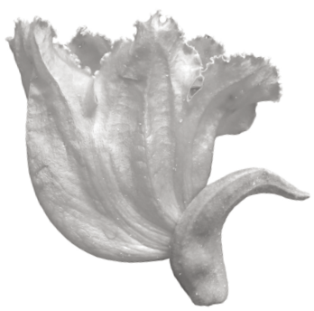

*Caption:* *(no caption detected)*

---

## Figure 4 (page 5)

*Caption:* *(no caption detected)*

---

## Figure 5 (page 5)

*Caption:* *(no caption detected)*

---

## Figure 6 (page 5)

*Caption:* *(no caption detected)*

---

## Figure 7 (page 5)

*Caption:* *(no caption detected)*

---

## Figure 8 (page 8)

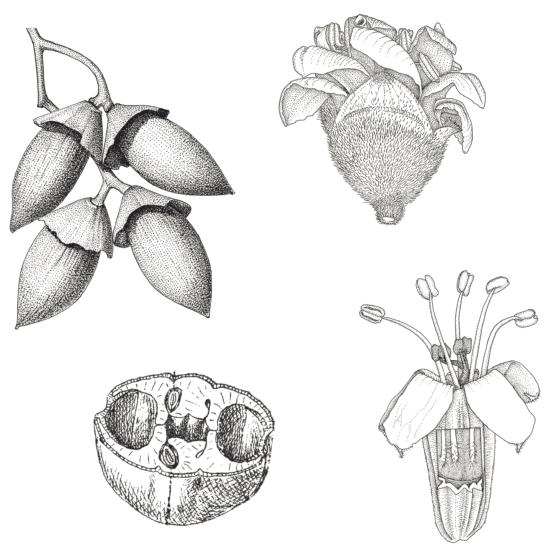

*Caption:* *(no caption detected)*

---

## Figure 9 (page 13)

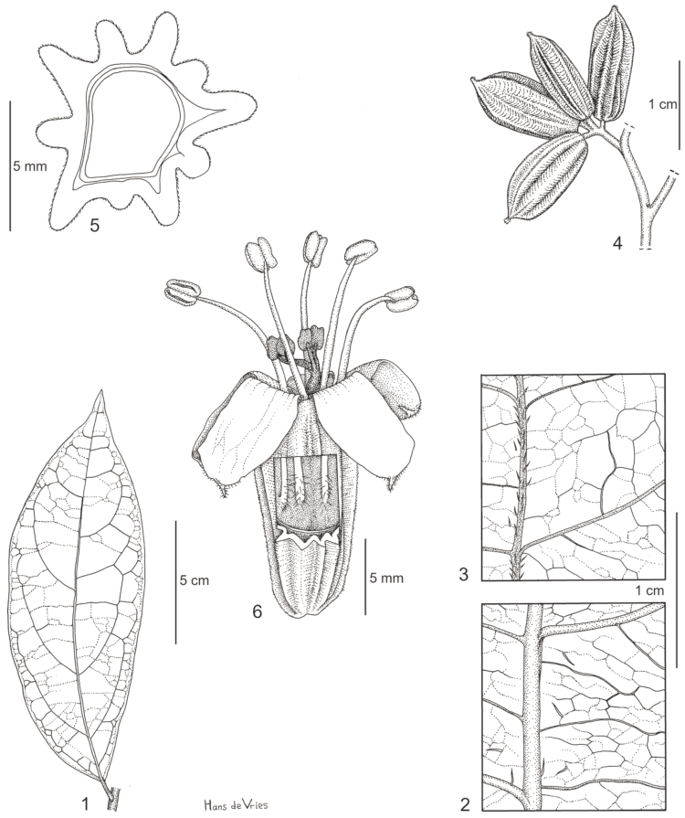

*Caption:* Planche 1. Cordia aurantiaca: 1. Feuille. – 2. Idem, détail de la face supérieure. – 3. Idem, face inférieure. – 4. Boutons floraux. – 5. Bouton floral, section transversale. – 6. Fleur, avec ‘fenêtre’ montrant les bases des filets. (1-6 : Klaine 323). Dessin par Hans de Vries, Jardin botanique de Meise (©).

---

## Figure 10 (page 14)

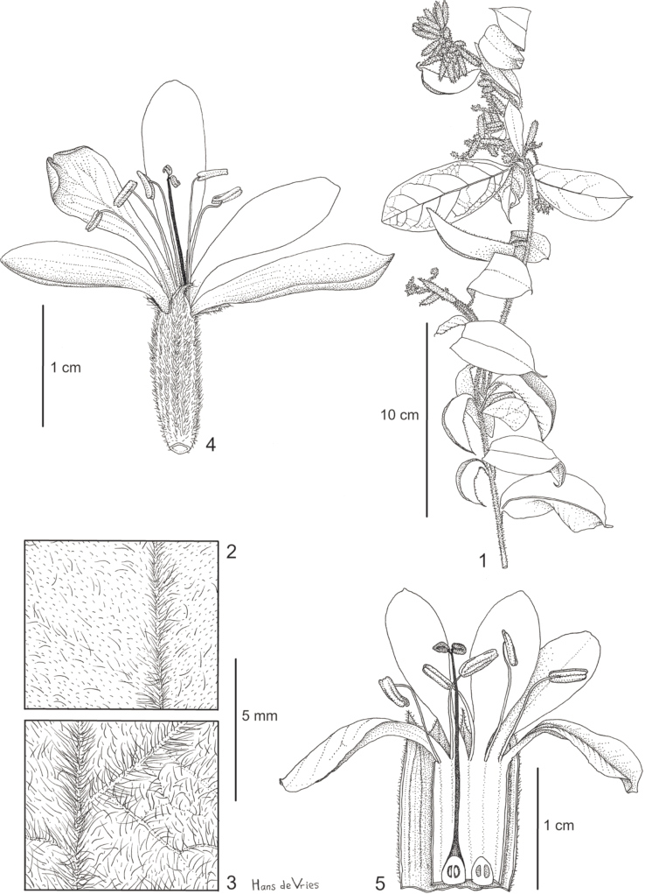

*Caption:* Planche 2. Cordia letestui : 1. Rameau florifère. – 2. Feuille, détail de la face supérieure. – 3. Idem, face inférieure. – 4. Fleur. – 5. Idem, calice et corolle ouverts. (1-5 : Le Testu 9446). Dessin par Hans de Vries, Jardin botanique de Meise (©).

---

## Figure 11 (page 16)

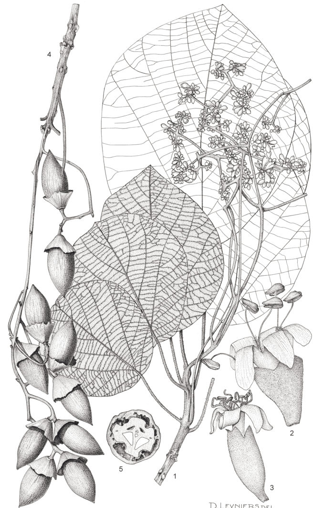

*Caption:* Planche 3. Cordia millenii : 1. Rameau florifère (× ½). – 2. Fleur mâle (× 3). – 3. Fleur femelle (× 3). – 4. Infrutescence (× ½). – 5. Fruit, coupe transversale (× 1). (1: Ghesquière 4409; 2: Luja 3; 3: Ghesquière 1156; 4, 5: Louis 11289). Dessin par D. Leyniers, Jardin botanique de Meise (©), reproduit à partir de Taton (1971).

---

## Figure 12 (page 19)

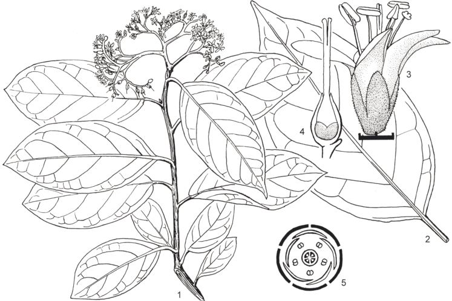

*Caption:* Planche 4. Ehretia cymosa: 1. Rameau florifère. – 2. Feuille. – 3. Fleur. – 4. Gynécée. – 5. Diagramme floral. (1-5: à partir du matériel vivant). Dessin par William Burger (©), reproduit avec permission à partir de Burger (1967).

---

## Figure 13 (page 22)

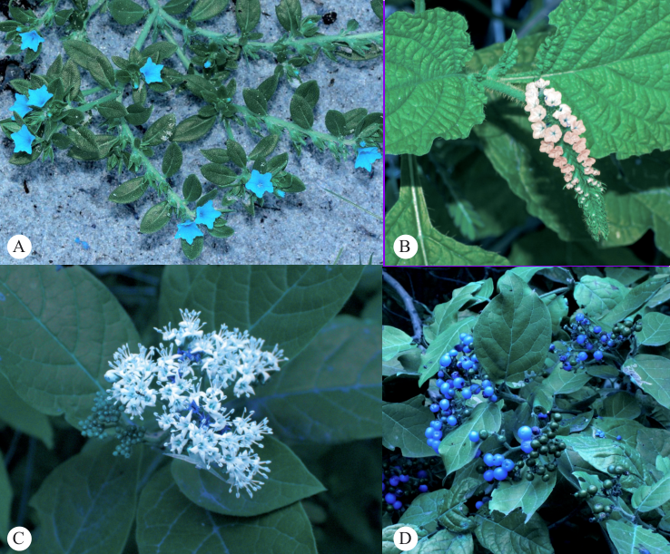

*Caption:* Figure 1. Euploca katangensis: A. Port (Zimbabwe). – Heliotropium indicum: B. Inflorescence (P.N. de Loango, Gabon). – Ehretia cymosa: C. Inflorescence (Rép. dém. Congo); D. Infrutescence (Bas-Congo, Rép. dém. Congo). Photos par Bart Würsten (A, ©), Jean Pierre Vande weghe (B, ©), Francesca Lanata (C, ©) et Paul Latham (D, ©).

---

## Figure 14 (page 23)

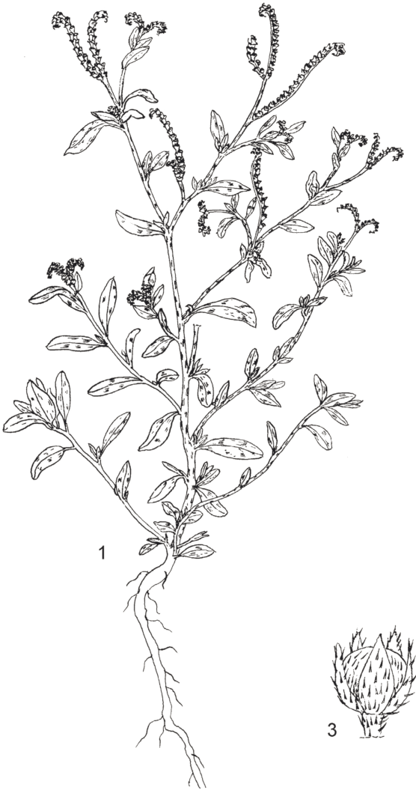

*Caption:* *(no caption detected)*

---

## Figure 15 (page 23)

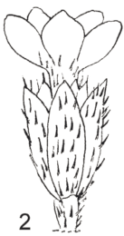

*Caption:* *(no caption detected)*

---

## Figure 16 (page 23)

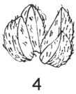

*Caption:* Planche 5. Euploca ovalifolia: 1. Port. – 2. Fleur. – 3. Fruit. – 4. Akènes. Dessin par Iskak Syamsudin, PROTA Foundation (©), reproduit avec permission à partir de Gurrib-Fakim (2006b).

---

## Figure 17 (page 26)

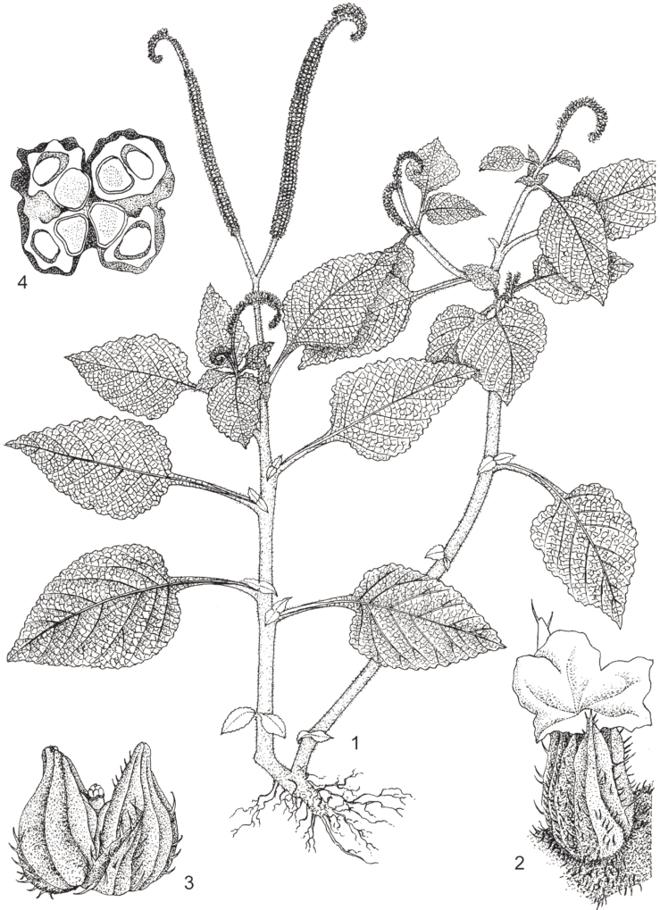

*Caption:* Planche 6. Heliotropium indicum: 1. Port. – 2. Fleur. – 3. Fruit. – 4. Idem, section transversale. Dessin par Iskak Syamsudin, PROSEA Foundation (©), reproduit avec permission à partir de Chuakul et al. (1999).

---

## Figure 18 (page 29)

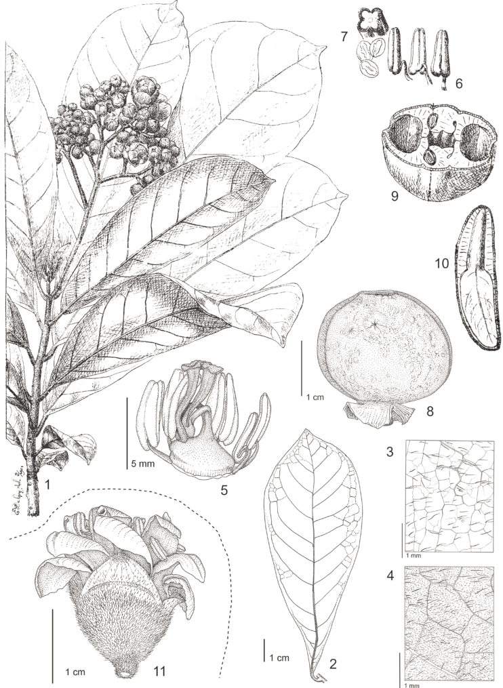

*Caption:* Planche 7. Hoplestigma klaineanum : 1. Rameau florifère. – 2. Feuille (dessous). – 3. Détail de la feuille (dessus). – 4. Détail de la feuille (dessous). – 5. Ovaire, styles et étamines. – 6. Anthères. – 7. Coupe transversale d'une anthère et grains de pollen. – 8. Fruit. – 9. Idem, coupe transversale du fruit. – 10. Graine, coupe longitudinale. – Hoplestigma pierreanum : 11. Fleur. (1-10: Klaine 2043; 11: Zenker 361). Dessin par E. Delpy (1, 6, 7, 9, 10), Muséum nationale d'Histoire naturelle, Paris (©), et par Hans de Vries, Jardin botanique de Meise (©).