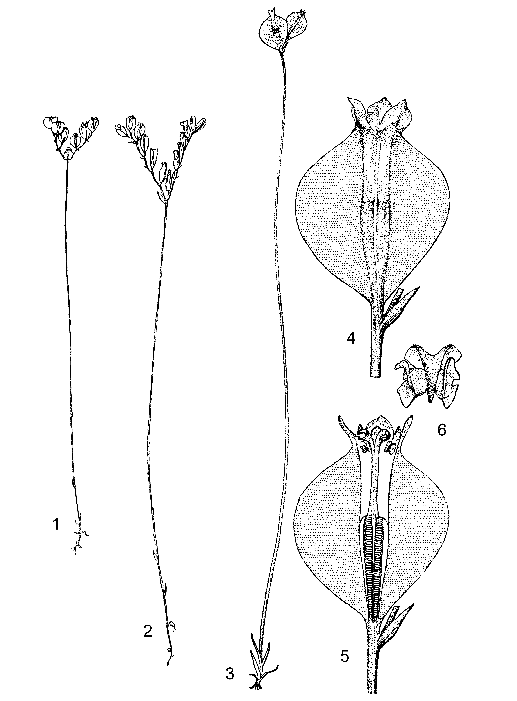
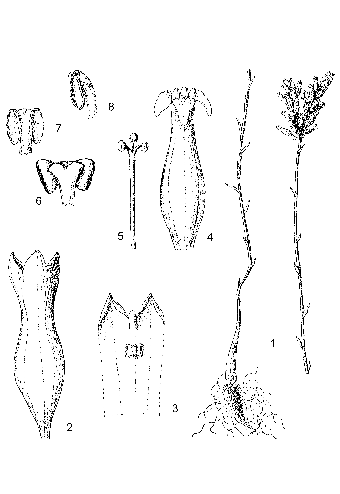
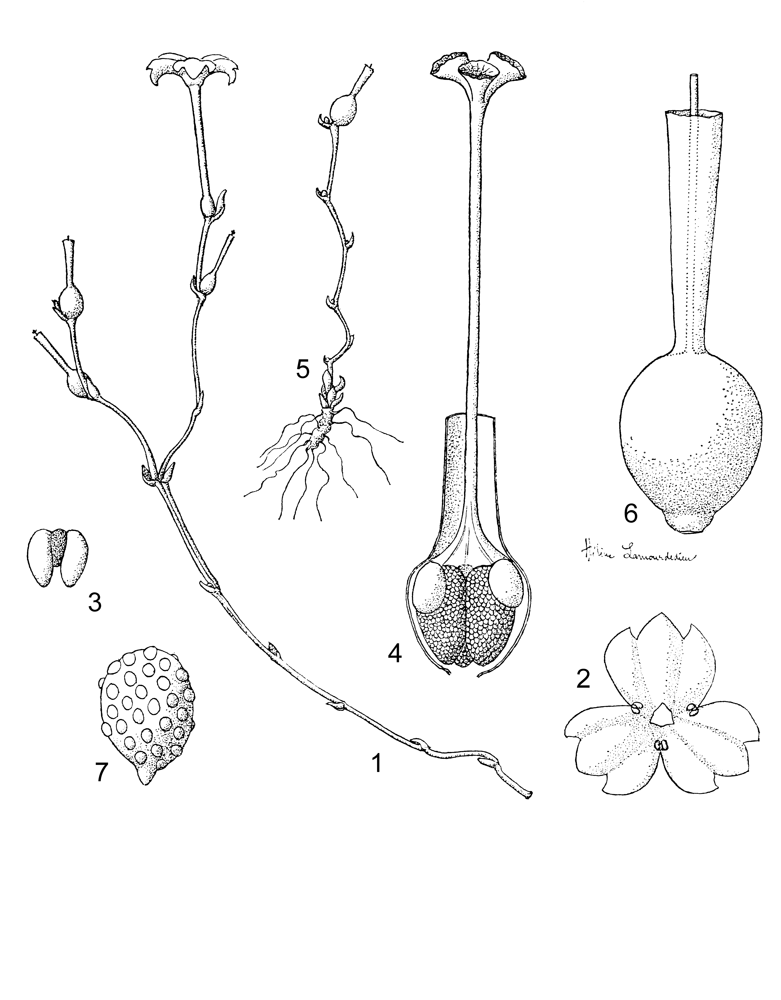
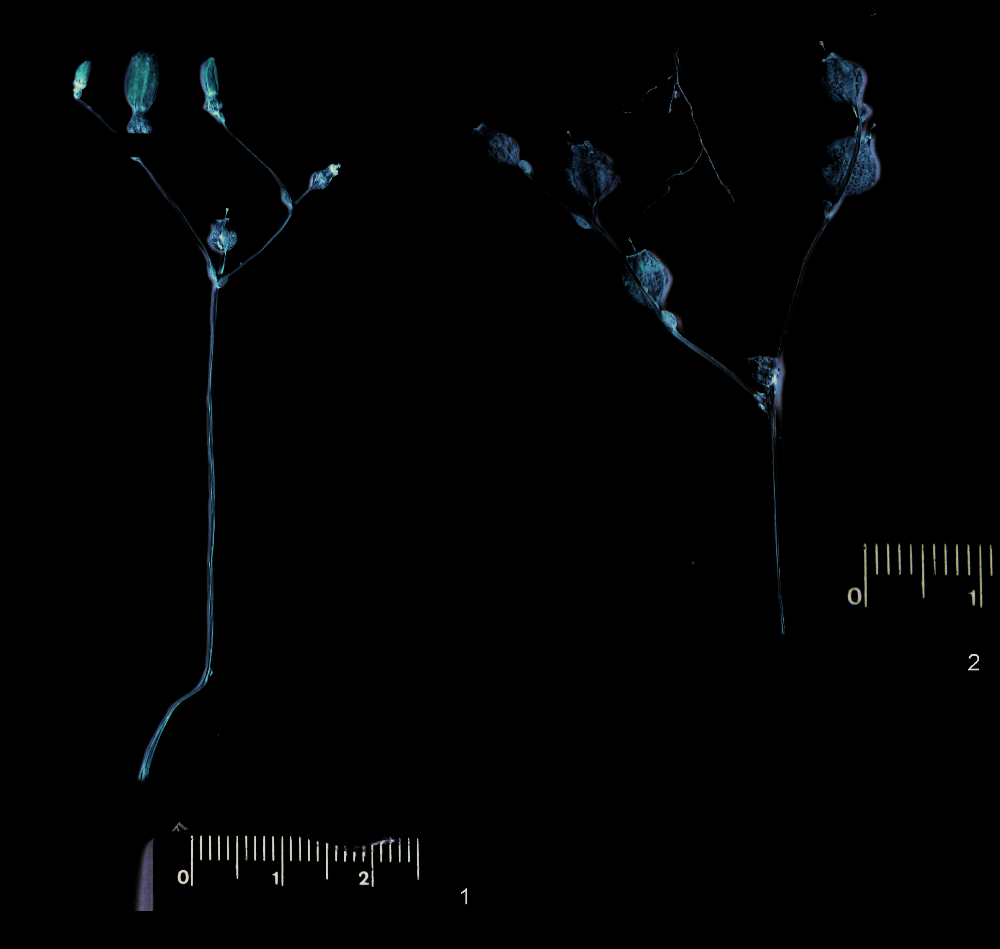
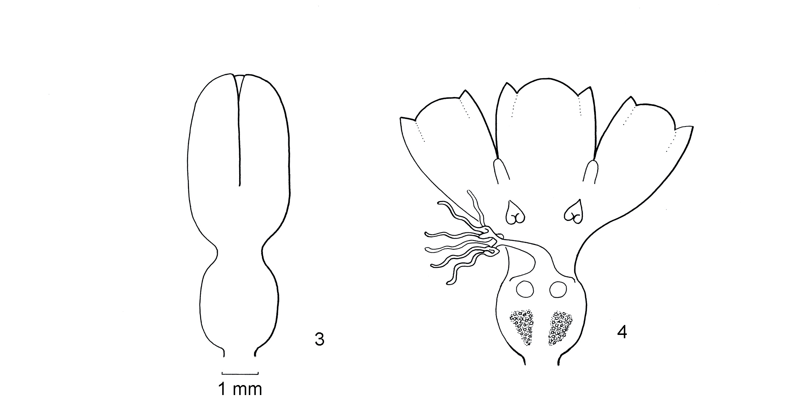
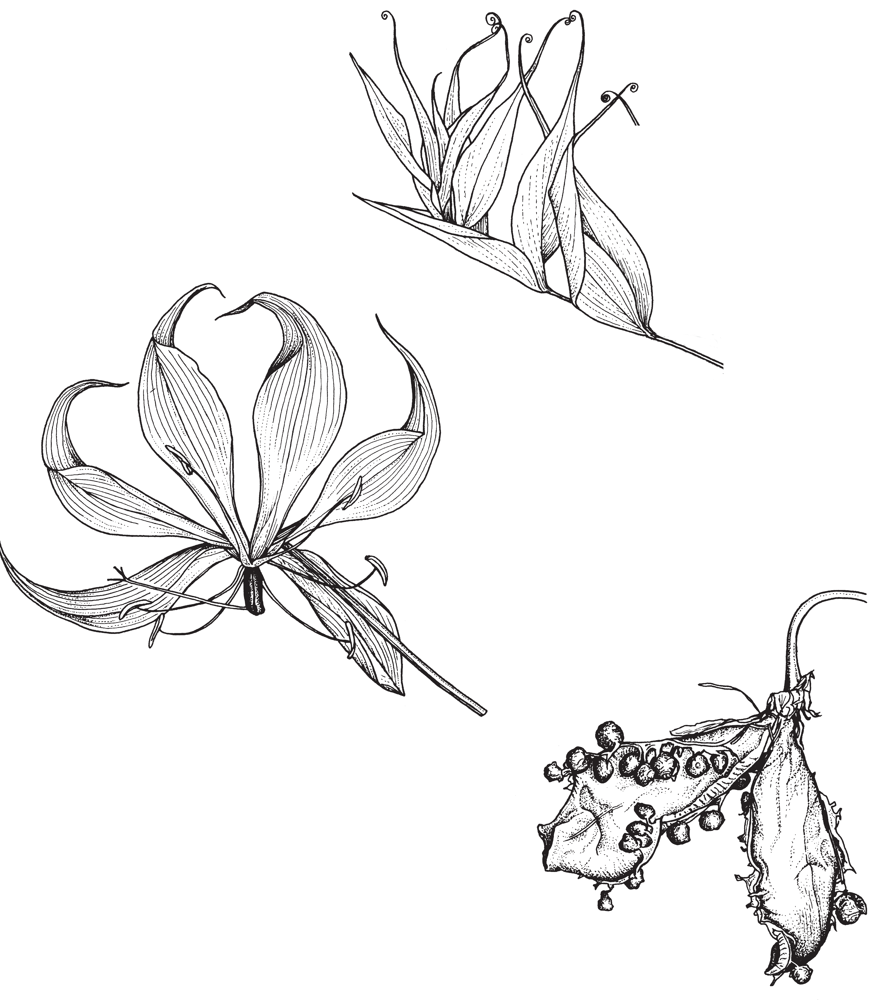

## Figure 10 (page 19)

*Caption:* Planche 2. Burmannia madagascariensis : 1, 2. Plantes (× 0,75). – 3. Plante à inflorescence pau - ciflore (× 1). – 4. Fleur (× 4). – 5. Fleur, coupe longitudinale (× 4). – 6. Étamine (× 30). Dessin par

---

## Figure 11 (page 21)

*Caption:* Planche 3. Campylosiphon congestus : 1. Plante (× 1). – 2. Fleur jeune (× 8). – 3. Sommet du péri - gone, face interne (× 9). – 4. Fleur mature (× 7). – 5. Style (× 10). – 6. Étamine, face dorsale (× 20). – 7. Idem, face ventrale. – 8. Idem, vue de côté. Dessin reproduit à partir de Schlechter (1906) l.c.

---

## Figure 12 (page 23)

*Caption:* Planche 4. Gymnosiphon bekensis : 1. Plante avec fleur et fruits (× 2). – 2. Périgone et étamines, vue de dessus (× 3). – 3. Étamine (× 16). – 4. Gynécée avec ovaire ouvert (× 10). – 5. Plante fructi - fère (× 2). – 6. Fruit (× 8). – 7. Graine (× 60). (1, 2 : N. Hallé 4002 ; 3–7 : Tisserant 2050 ). Dessin par Hélène Lamourdedieu, reproduit avec permission, © Publications Scientifiques du Muséum national d’Histoire naturelle, Paris, à partir de Letouzey (1967) l.c.

---

## Figure 13 (page 25)

*Caption:* Planche 5. Gymnosiphon constrictus : 1. Plante et inflorescence avec bouton floral. – 2. Infructes - cence. – 3. Bouton floral. – 4. Reconstruction d’une fleur sur la base d’un bouton en alcool. (1 :

---

## Figure 14 (page 25)

*Caption:* (no caption)

---

## Figure 15 (page 27)

*Caption:* Planche 6. Gymnosiphon longistylus : 1. Plante (× 0,7). – 2. Plante (× 2). – 3. Fleur, coupe longi - tudinale (× 20). – 4. Fleur, vue par-dessus (× 4). – 5. Périgone, fendu longitudinalement et ouvert (× 10). – 6. Gynécée (× 7). – 7. Ovaire, coupe transversale (× 20). Dessin par D. Leyniers (1) et M.-

---

## Figure 16 (page 29)

*Caption:* (no caption)

---

## Figure 17 (page 29)

*Caption:* (no caption)

---
