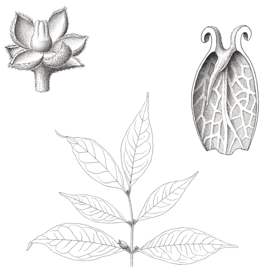
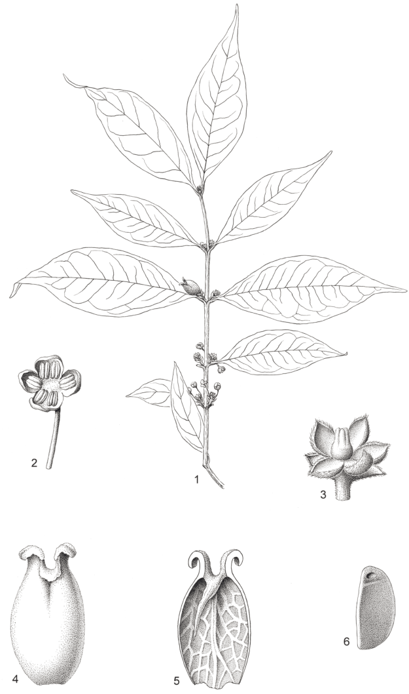

## Figure 19 (page 30)

*Caption:* *(no caption detected)*

---

## Figure 20 (page 33)

*Caption:* J.M.LERINCKX
Planche 8. Buxus acutata: 1. Rameau florifère et fructifère (× ½). − 2. Fleur mâle épanouie (× 3). − 3. Fleur femelle épanouie (× 3). − 4. Valve de la capsule, face externe (× 3). − 5. Idem, face interne (× 3). − 6. Graine, vue de profil (× 3). (1-6: Stuhlmann 2647). Dessin par J.M. Lerinckx, Jardin botanique de Meise (©), reproduit à partir de Robyns (1960).