## Figure 29 (page 16)
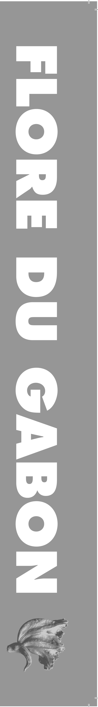
*Caption:* (no caption)

---

## Figure 30 (page 16)
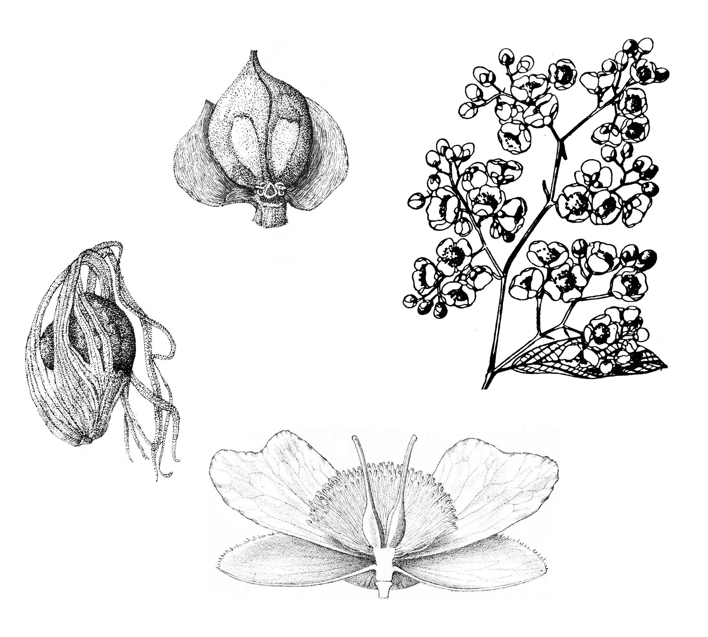
*Caption:* (no caption)

---

## Figure 31 (page 20)
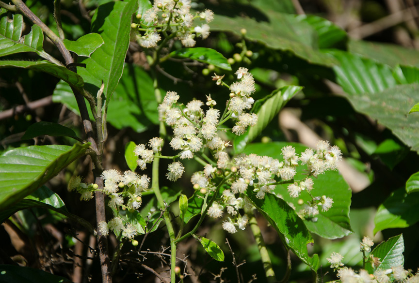
*Caption:* Figure 2 . Tetracera alnifolia : A. Tige fructifère ; B. Feuille, vue de dessus ; C. Fleur en bouton, avec un pétale sorti ; D. Fruits. – Tetracera podotricha : E. Tige florifère ; F. Fleurs ; G. Fruits. Photos par Ehoarn

---

## Figure 32 (page 20)
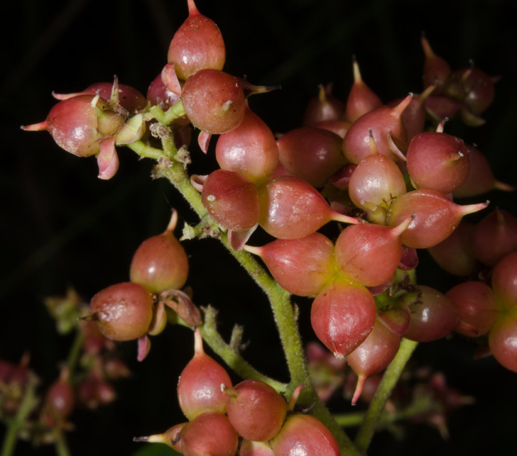
*Caption:* (no caption)

---

## Figure 33 (page 20)
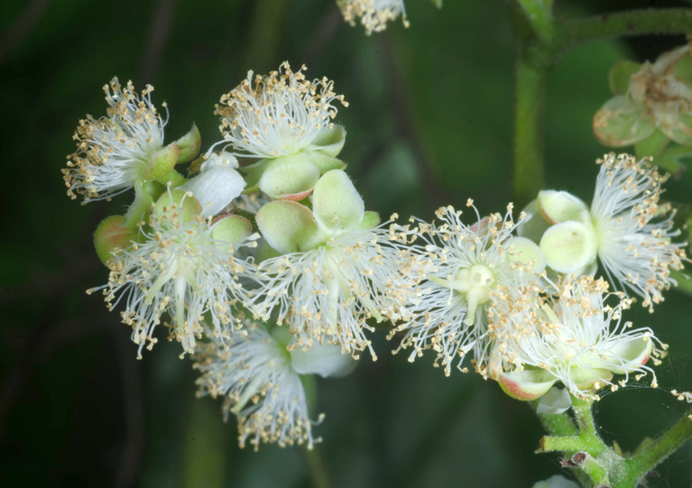
*Caption:* (no caption)

---

## Figure 34 (page 20)
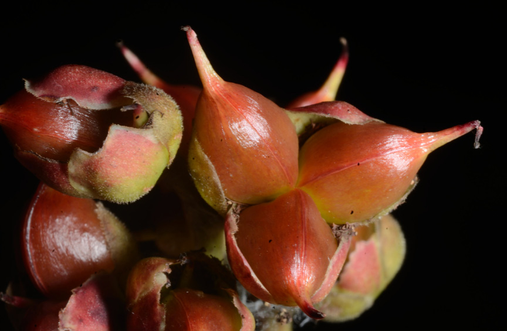
*Caption:* (no caption)

---

## Figure 35 (page 20)
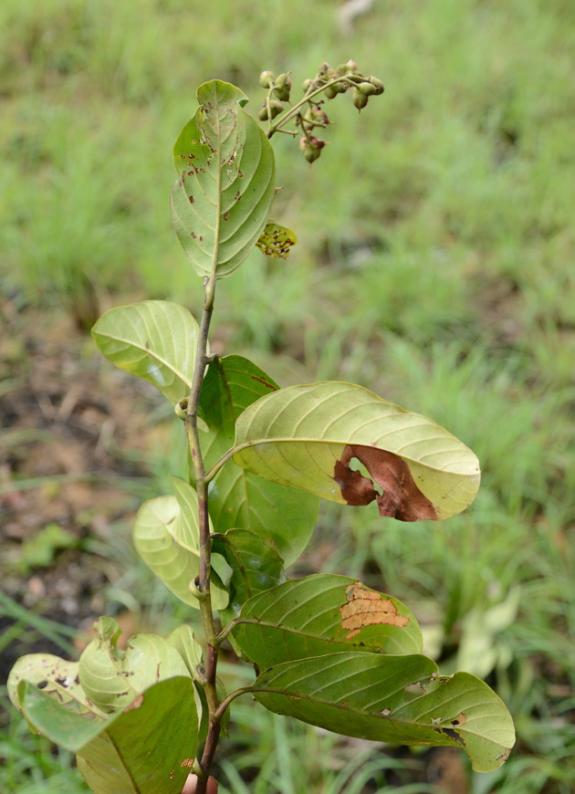
*Caption:* (no caption)

---

## Figure 36 (page 20)
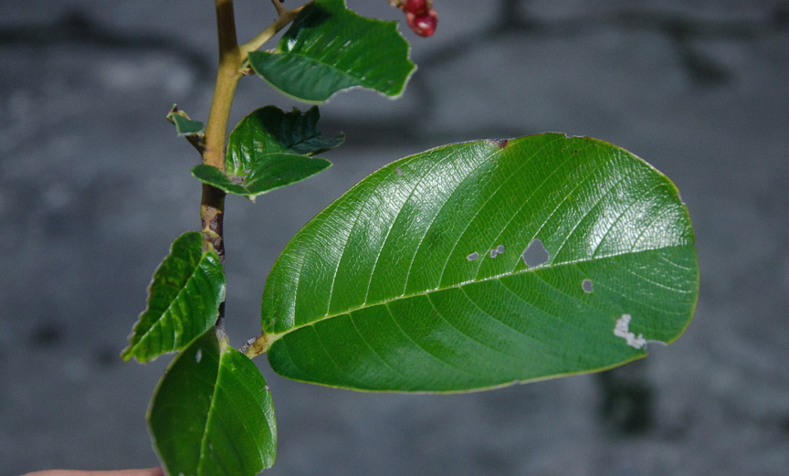
*Caption:* (no caption)

---

## Figure 37 (page 20)
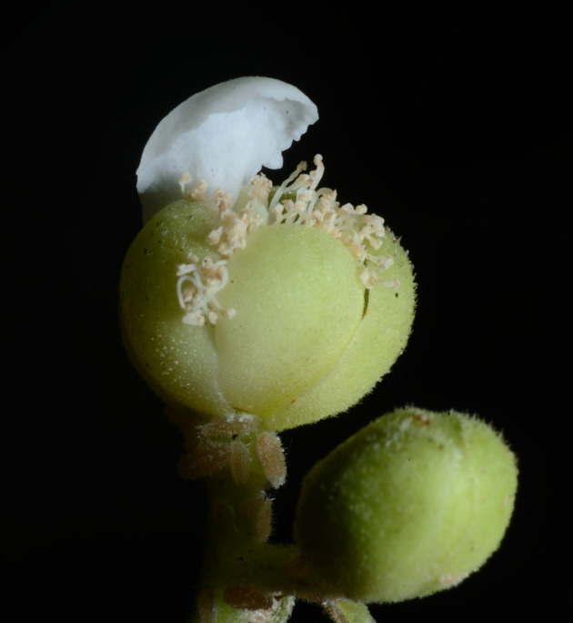
*Caption:* (no caption)

---

## Figure 38 (page 21)
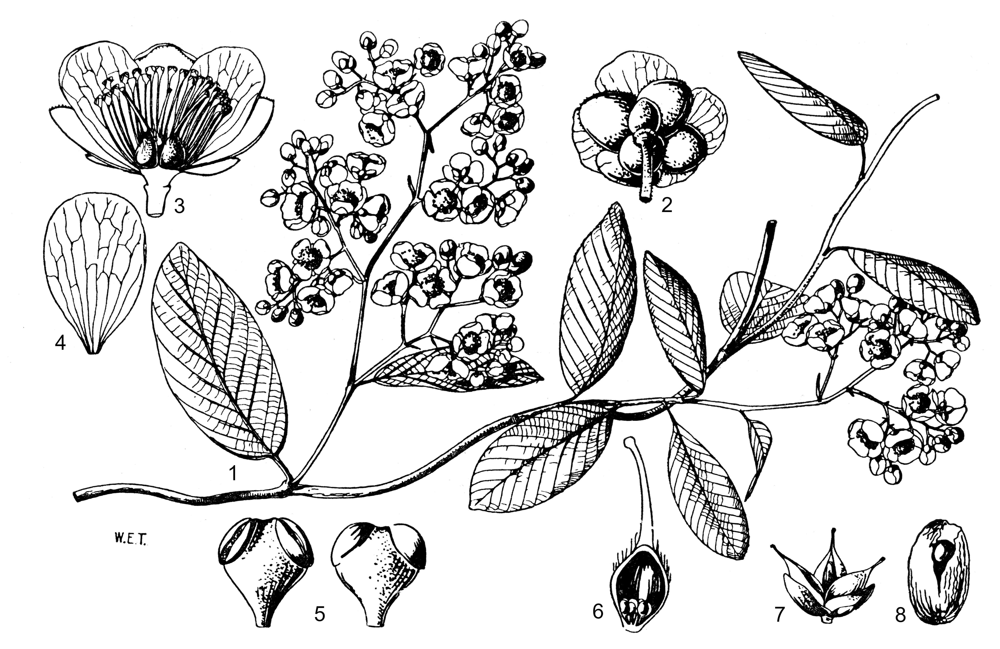
*Caption:* Planche 3 . Tetracera alnifolia subsp. alnifolia : 1. Tige florifère. – 2. Fleur, vue de dessous. – 3. Idem, coupe longitudinale. – 4. Pétale. – 5. Sommet d’une étamine, en vue ventrale et dorsale. – 6. Carpelle, coupe longitudinale. – 7. Fruit avec sépales persistants. – 8. Graine entourée de l’arille. Dessin par

---

## Figure 39 (page 24)
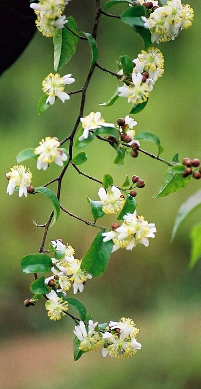
*Caption:* Figure 3 . Tetracera poggei : A. Tige florifère ; B. Tige fructifère. – Tetracera rosiflora : C. Tige florifère. – Tetracera breteleri : D. Détail de la face inférieure du limbe foliaire ; E. Fleur. Photos par Paul Latham (A : Rép. dém. Congo, Bas-Congo, Kinsambi), par Jos Stevens (B : Rép. dém. Congo, Katanga, Ferme

---

## Figure 40 (page 24)
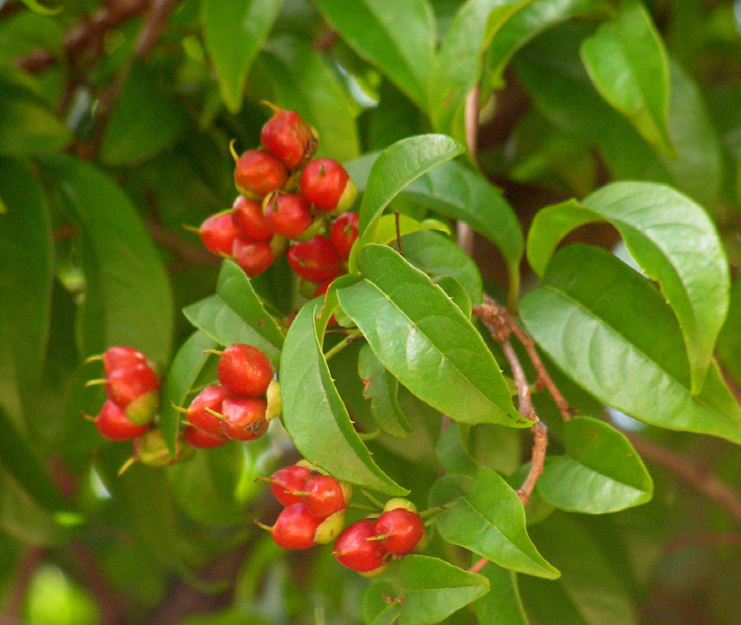
*Caption:* (no caption)

---

## Figure 41 (page 24)
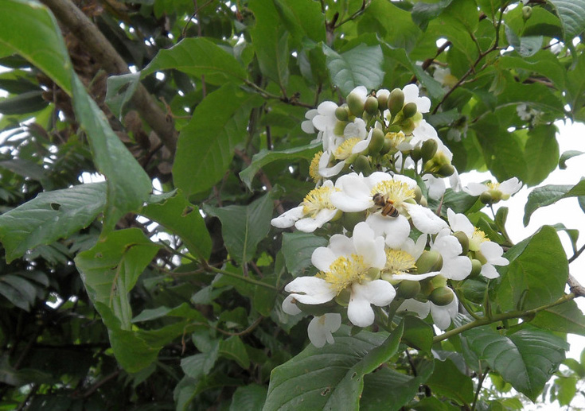
*Caption:* (no caption)

---

## Figure 42 (page 24)
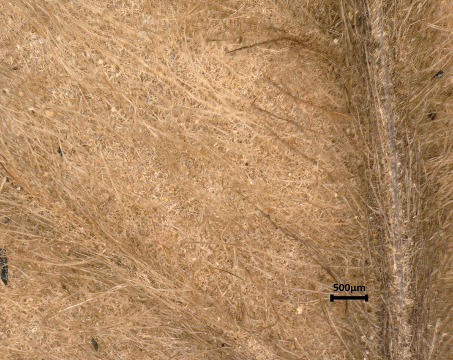
*Caption:* (no caption)

---

## Figure 43 (page 24)
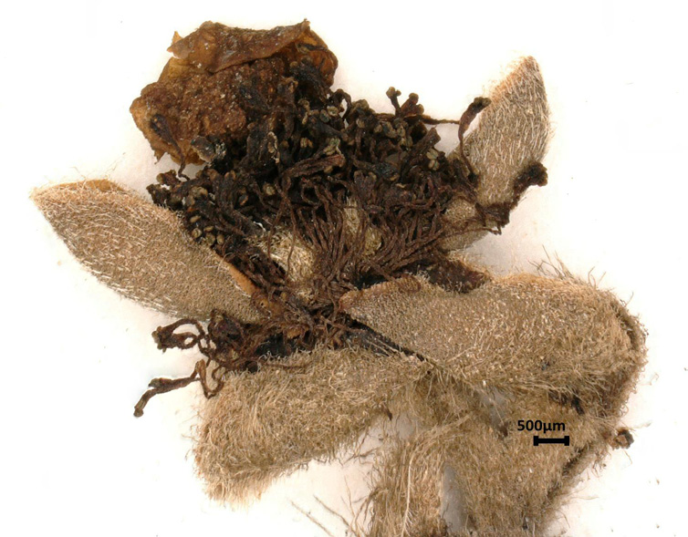
*Caption:* (no caption)

---

## Figure 44 (page 25)

*Caption:* Planche 4 . Tetracera poggei : 1. Tige florifère (× ⅔). – 2. Fleur, coupe longitudinale (× 2). – 3. Pétale (× 2⅔). – 4. Gynécée (× 3⅓). – 5. Étamine (× 6⅔). – 6. Sommet de l’étamine (× 20). – 7. Carpelle, coupe longitudinale (× 4). Dessin par A. d’Apreval, Jardin botanique de Meise (©), reproduit à partir de De

---

## Figure 45 (page 27)

*Caption:* Planche 5 . Tetracera rosiflora : 1. Rameau florifère (× ½). – 2. Fleur, vue de dessus (× 1). – 3. Base de la fleur, coupe longitudinale (× 5). – 4. Étamine (× 10). – 5. Fruit et sépales persistants, vus de dessus (× 1). – 6. Follicule et sépales (× 1). – 7. Graine avec arille (× 4). (1-4 : J. Louis 14280 ; 5-7 : J. Louis 15185 ).

---
