# EBENACEES

(avec compléments concernant les especes camerounaises)

par

RENE LETOUZEY,Laboratoire de Phanérogamie, Muséum national d'Histoire naturelle, Paris

et

FRANK WHITE, Department of Forestry,

Commonwealth Forestry Institute, Oxford.

Publication honorée d'une subvention du Centre National de la Recherche Scientifique.

MUSEUM NATIONAL D'HISTOIRE NATURELLE

Laboratoire de Phanérogamie

16, rue Buffon, Paris 5e

1970

# SOMMAIRE

Famille des Ebenaceæ.

Caracteres généraux.. 3   
Caracteres du genre Diospyros... 4

Clefs des especes camerounaises et gabonaises

d'apres les caractéres végétatifs .. 8   
d'apres des échantillons avec fleurs  ..... 14   
d'apres des échantillons avec fleurs ♀. ....* 19   
d'apres des échantillons avec fruits ... 23

Etude des especes avec planches illustratives...... 29   
Carte de répartition des diverses especes ...   
Especes introduites... 179   
Especes exclues.. 180   
Index des échantillons.. 181   
Index des Ebenaceæ.. 185

Illustrations de H. LAMoURDEDIEU.

# ABREVIATIONS

Les échantillons mentionnés sont parfois cités d'apres des références bibliographiques mais en regle générale ont été examinés et sont représentés dans les Herbiers de Paris (P) et d'Oxford (FHO)，parfois encore en d'autres Herbiers indiques par les sigles conventionnels de P'Index Herbariorum,en particulier :Berlin (B),British Museum (BM)，Ibadan (FHI)，Hambourg (HBG)，Kew (K),Wageningen (WAG)，Yaoundé (YA),Zürich (Z).

FTA:Flora of Tropical Africa.

FWTA :Flora of West Tropical Africa.

NoTE:Pour la famille des Ebénacees,une méme rédaction est donnee dans la Flore du Cameroun et dans la Flore duGabon.Environ 75 % des especes étant communes aux deux territoires,ceci parait_ justifier- dans un souci d'économie de moyens - cette présentation exceptionnelle.

# EBENACEE

(l genre, 38 especes dont 36 pour le Cameroun et 30 pour le Gabon, soit 28 especes communes)

Arbres et arbustes ä feuilles presque toujours alternes,exstipulées,simples,ä marge entiere.Fleurs solitaires ou disposées en cymes le plus souvent contractées,axillaires,ramiflores ou cauliflores. Fleursordinairementunisexuées， actinomorphes, hypogynes； calice 3-7-lobé ou subentier, toujours persistant et souvent accrescent；corolle souvent charnue,3-7-lobée,a préfloraison contournee；2-I 2o étamines,a filets souvent courts,parfois connés par paires,fixés sur le réceptacle et/ou sur le tube de la corolle,antheres souvent apiculées ä déhiscence longitudinale; ovaire syncarpe，supére，2-8 loges presque toujours divisées en 2 par une fausse cloison délimitant des compartiments garnis d'un seul ovule pendant vers le sommet de l'axe de l'ovaire; styles séparés ou ± soudés au moins ä la base,stigmates toujours distincts. Baies souvent entourées ä la base par le calice accru; graines d'assez grande taille,ä albumen abondant,corné,parfois ruminé,ä embryon de taille moyenne avec cotylédons foliacés.

Famille tropicale groupant 2 genres et 45o especes, fournissant essentiellement des bois (ébénes） et des fruits comestibles,repré- sentée au Cameroun et au Gabon par le seul genre Diospyros Linné groupant â lui seul dans le monde entier la grande majorite des espéces d'Ebénacées alors que seul le genre Euclea Murr. se rencontre aussi en Afrique.

# DIOSPYROS Linné

Gen.Plant.: 143,383,n. 4o3(1737),d'apres DALEcH.,Hist.Lib.3,cap.2I 349 (1587).

Arbres et arbustes parfois multicaules,atteignant rarement 3o m de hauteur totale et 5o cm de diamétre ä la base,ä tronc régulier ou cannelé,dépourvu de contreforts á la base,parfois muni d'excroissances dans les cas de cauliflorie. Rhytidome quelquefois lisse et papyracé,ou le plus souvent densément fissuré verticalement et parfois horizontalement ± profondément et se desquamant alors en plaquettes rectangulaires,exceptionnellement rhytidome se desquamant en plaquettes irrégulieres ou circulaires ; tranche de l'écorce présentant toujours un cerne extérieur noir au niveau du rhytidome (caractére commun avec la plupart des Annonacées mais celles-ci ont le plus souvent une écorce odorante); écorce de consistance parfois tres dure et á section jaunatre ou rougeätre，ou panachée,avec presque toujours cerne jaune au contact de laubier;bois ä grain fin,blanc,rosé ou jaunatre avec bois de coeur souvent distinct,noir et dur ou veiné,marbré ou taché de noir.

Rameaux avec feuilles souvent distiques,alternes,a pétiole peu développé et rarement nettement canaliculé；marge entiere, parfois ondulée；base rarement nettement cordée et sommet ä acumen parfois peu distinct；nervures latérales camptodromes, formant des boucles d'anastomose ± visibles；nervures tertiaires et nervilles souvent ± perpendiculaires á la nervure médiane; face inférieure du limbe parfois recouvert d'un revétement épidermique minéralisé donnant une teinte caractéristique glauque suréchantillons fraiset blanchatre sur échantillonssecs; pubescence foliaire absente ou présente et dans ce cas soit de type apprimé,soit formée de poils courts obliques ou dressés,rarement de poils hispides,cette pubescence se retrouvant fréquemment sur rameaux,inflorescences et pedicelles floraux. Au-dessous du limbe vers la base,au long de la nervure médiane,vers l'acumen,

# EBENACEE

pres de la marge,éparsement sur toute la surface,se rencontrent, chez presque toutes les especes, des glandes - ou qualifiécs comme telles dans cette étude - qui sont en réalité,d'apres D.NoRMAND (comm. verb.) des poches á tannins; il parait exceptionnel que ces glandes ne se trouvent pas sur au moins quelques feuilles d'un échantillon et l'intérét de ces glandes pour des déterminations spécifiques ne parait pas devoir étre négligé. Non signalées par P. PARMENTIER (Histologie comparée des Ebénacées， dans ses rapports avec la morphologie et l'histoire généalogique de ces plantes；These, Paris,1892)，ces glandes furent nettement mises en évidence par P. BuscH AUs CREFELD (Anatomisch-systematische Untersuchung der Gattung Diospyros； These， Erlangen, 1913)；cet auteur leur attribua en fait un role assez minime au point de vue systématique,se contentant de noter leur présence ou leur absence pour différentes especes examinées; il les considé- rait (p.27） comme des ‘ nectaires extra-floraux o,en relation vraisemblable avec des fourmis,mais n'a pu préciser exactement leur contenu chimique.

Inflorescences unisexuées avec toujours semble-t-il diécie incontestable; fleurs ♀ en général un peu plus grandes que fleurs et groupees en inflorescences plus pauvres en fleurs,voire fleurs solitaires,celles-ci étant beaucoup plus exceptionnelles pour les fleurs δ；cymes contractées,exceptionnellement pseudoracémiformes ou pédonculées,parfois gloméruliformes ou ä fleurs subfasciculees； bractées et bractéoles difficilement distinctes mais presque toujours présentes,de petite taille,pubescentes et caduques,sur des axes ou des pédicelles courts. Pédicelles dépassant exceptionnellement I cm et presque toujours articulés au sommet, surtout chez les fleurs ♀. Calice des fleurs  parfois prolongé en un faux pédicelie ne dépassant cependant pas ± 1 mm;calice ä marge tronquée，ou légerement lobée (pouvant étre considérée comme subtronquée),ou profondément lobée (entre 1 /3 et 2/3 de la profondeur du calice)，ou trés profondément lobée (plus des 3/4 de la profondeur du calice),avec lobes de forme variable,de type triangulaire ou arrondi,garni d'une pubescence fréquente et surtout externe chez les fleurs &,externe et interne-apprimée

chez les fleurs ,la pubescence externe étant seule prise en considération dans les clefs de détermination ci-apres. Corolle á peine lobée,ou profondément lobée,ou tres profondément lobée comme le calice,avec lobes de forme variable,parfois pubescente exterieurement,de teinte verdatre puis blanchatre ou jaunatre et parfois rougeatre en extrémité. Androcée avec étamines sur I-2-3 verticilles et fixées soit sur le réceptacle, soit sur la base du tube de la corolle,soit sur les deux (avec séparation 士 nette de ces positions respectives)，soit sur le tube méme de la corolle ä différentes hauteurs,ces étamines étant solitaires ou soudées par 2 (-3) par leurs filets â la base,rarement sur une hauteur notable; filets en général tres courts et antheres lancéolées ou linéaires, l'étamine étant glabre ou garnie d'une pubescence de divers types (Nota : Les études palynologiques concernant les Diospyros africains font défaut jusqu'a ce jour mais sont en cours); pistillode chez les fleurs  rudimentaire,ou réduit â une touffe de poils,ou absent.Staminodes chez les fleurs ♀ semblables aux étamines mais rudimentaires, le plus souvent moins nombreux qu'elles et fixés sur le tube de la corolle ou autour de 'ovaire;celui-ci globuleux ou ovoide,rarement allongé,glabre ou variablement pubescent,rarement creusé semble-t-il de plus de 5-6 loges divisées en 2; tres exceptionnellement fausse cloison incompletement développée et loges biovulées dans ce cas; styles tres rarement soudés sur toute leur hauteur,le plus souvent seulement á la base mais parfois aussi stigmates séparees subsessiles.

Baies globuleuses ou ovoides， souvent apiculées,ou oblongoides,exceptionnellement fusiformes, ne mesurant guere parfois que I ou 2 cm et dépassant rarement Io cm dans leur plus grande dimension, glabres ou avec pubescence le plus souvent et rapidement ± caduque; teinte en général verte, puis jaune,puis rouge, puis noire;péricarpe mince et papyracé ä coriace ou épais et subligneux a ligneux;chaire fibreuse entourant des loges rayonnantes individualisées ou pulpe gluante enrobant directement les graines; celles-ci le plus généralement en forme de “ tranche d'orange ), a tégument souvent dur,a albumen corné parfois légerement ruminé. Pédicelle parfois accru et robuste;calice souvent accru,

# EBENACEE

pouvant entourer le fruit 士 completement et alors tronqué ou lobé,avec lobes á marge plane ou ondulée.

EsPECE-TYPE :Diospyros Lotus Linné.

Le genre Diospyros Linn. groupe au Cameroun 36 espéces et au Gabon 3o especes,28 d'entre elles étant communes aux deux territoires et présentes,sous forme de petits arbres ou d'arbustes de sous-bois,parfois ripicoles,dans les foréts denses humides de type sempervirent ou semi-décidu,plus rarement existant simultanément dans ces 2 types schématiques de foret.

Au Cameroun se rencontrent quelques especes particulieres ä la lisiere septentrionale du massif de foret dense humide (D. abyssinica,D.monbuttensis)； deux autres especes (D.mespiliformis et D.ferrea) se localisent exclusivement,au moins la premiere d'entre elles,dans les régions soudaniennes nettement seches；au Gabon a aussi été rencontrée une espece particuliere,commensale habituelle des fourrés littoraux (D. tricolor） dont la présence sur la cote du Cameroun est tres vraisemblable. On trouvera ci-apres des cartes indiquant la distribution connue au Cameroun et au Gabon de toutes les especes citées; plusieurs d'entre elles se retrouvent en Afrique occidentale,d'autres en Afrique centrale,particulierement celles rencontrées dans la région de Lastoursville au Gabon，mais quelques unes, tel D. cinnabarina, peuvent jusqu'a ce jour étre considérées comme particulieres a la forét dense humide sempervirente qui entoure la baie de Biafra;certaines (D.alboflavescens, D. Soyauxii） n'ont encore été signalées que dans les régions assez bien prospectées de Douala et de Kribi au Cameroun et de Libreville au Gabon,ainsi que dans leur arriere pays planitiaire,mais elles peuvent aussi exister dans la province de Calabar,moins bien connue,en Nigeria orientale.

Tres peu de noms vernaculaires ont été citeés dans cet ouvrage car de nombreuses confusions et imprécisions existent quant aux Diospyros parmi les diverses langues camerounaises ou gabonaises et meme d'un prospecteur a 'autre; il est apparu plus inopportun

# R.LETOUZEY & F.WHITE

qu'utile de citer des noms ainsi établis sur des bases mouvantes et d'autre part ne s'appuyant jusqu'a ce jour que sur des déterminations erronées,ou le plus souvent douteuses,compte tenu de la complexité de la nomenclature du genre Diospyros.

De méme les propriétés et usages font l'objet de peu de commentaires pour les mémes motifs que ci-dessus et pour la raison supplémentaire que peu d'espéces semblent en fait jouir de proprietés particulieres ou étre d'usages courants.Quelques especes ont des fruits réputés comestibles (D.canaliculata,D. mespiliformis,D. tricolor）mais plusieurs (dont D.crassiflora) sont a loccasion consommés； ceux de D. piscatoria sont utilises comme ichthyotoxiques. En ce qui concerne les bois,certaines tiges ou troncs permettent la confection d'arbalétes ou de menus objets de teinte noire (D. bipindensis,D.Hoyleana,D. mespiliformis）et si l'ébéne d'Afrique centrale est essentiellement fourni parD.crassiflora (voir renseignements plus détaillés a cette espéce), il semble que d'autres Diospyros (D. mespiliformis, peut-étre D.Dendo,D. gracilescens). aient fourni par le passé ou fournissent encore des bois commercialement réputés；des renseignements plus précis restent a recueillir ^ la lumiere des récentes mises au point nomenclaturales.

# CLEFS DES ESPECES CAMEROUNAISES ET GABONAISES

# I.D'APRES LES CARACTEREL FOLIAIRES，ACCESSOIREMENT VEGETATIFS ET ECOLOGIQUES.

I.Limbes foliaires non juvéniles glabres á la face inférieure,mais parfois pubescence courte sous la nervure médiane et les nervures latérales,jamais sous les nervilles et entre celles-ci (voir aussi I1.D. ferrea).

2. Limbe oblique-losangique,de 3-5 × 1,5-2,5 cm，a sommet aigu ä peine acuminé,plus rarement obtus,á apex émarginé；3-4 paires de nervures latérales en général totalement indistinctes..

16.D.Hoyleana.

# EBENACEE

2'.Limbe non oblique-losangique.

3.Limbe caudé-acuminé avec acumen á bords paralleles ou spatulé.

4.Limbe á bords presque paralleles sur une assez grande longueur;I2-2o paires de nervures latérales ....26.D.piscatoria.   
4'.Limbe ä bords non presque paralleles sur une assez grande longueur.

5.Nervilles indistinctes；3-5 paires de nervures latérales se réunissant en boucles peu distinctes ...... 21.D.melocarpa.   
5'. Nervilles bien visibles；2-5 paires de nervures latérales anastomosées en larges boucles assez loin de la marge.. 38.D.Zenkeri.

3'.Limbe non caudé-acuminé mais avec acumen 士 triangulaire, parfois étroit,parfois peu individualisé.

6.2 glandes ä la base du limbe pres de la jonction avec Ie pétiole.

7.Rhytidome sedesquamant en pelliculespapyracées; jeunes rameaux couverts d'une pubérulence fauve doré; limbe de forme et de taille assez variables,fréquemment de 10-15 × 4-5 cm... ： 10.D.Dendo.   
7'. Rhytidome ne se desquamant pas en pellicules papyracecs.

8.Limbe dépassant le plus souvent 2o cm de longueur, â base généralement obtuse，méme arrondie,voire cordée,parfois glandes peu distinctes.. I3.D.gabunensis.   
8'.Limbe mesurant généralement de Io-2o cm de longueur,ä base ± cuneiforme.   
9．4-8 paires de nervures latérales finement anastomosées vers la marge du limbe;sommet du limbe nettement acuminé.. 5.D.Boala.   
9'.6-1o (-I2) paires de nervures latérales évanescentes vers la marge du limbe；sommet du limbe peu nettement acuminé.. .14.D.Gilletii.

6'.Pas de glandes ä la base du limbe pres de la jonction avec le pétiole (voir aussi 13.D. gabunensis).

I0. Plus de I2 paires de nervures latérales,souvent mal individualisées et peu distinctes des nervilles；limbe mesurant généralement moins de 5 cm de longueur; quelques poils sous les nervilles,visibles seulement ä fort grossissement... I1.D.ferrea.

Io'.Moins de I2 paires de nervures latérales,rarement plus, distinctes des nervilles.

II.Rhytidome se desquamant en écailles circulaires mesurant jusqu'ä I2 cmde diamétre; limbe oblong-elliptique ou oblong-lanceolé,de 7,5-11,5 × 3-4,5 cm；2 glan-

# R．LETOUZEY & F.WHITE

des ± constamment présentes vers la base du limbe.

27.D.platanoides.

II'.Rhytidome ne se desquamant pas en écailles circulaires.

I2. Limbe dépassant généralement 2o cm de longueur.

13.Glandes situées au long de la nervure médiane et surtout ä 'aisselle des nervures latérales.....

19.D. longiflora.

13'.Glandes non localisées comme ci-dessus.

I4.Limbe oblong；rameaux couverts de pustules liégeuses noiratres (voir aussi 25.D.physocalycina)... 6．D．canaliculata.

I4'.Limbeoblanceoléouoblancéolé-elliptique; excroissances sur le tronc (cauliflorie)；parfois jusqu'a I5 paires de nervures latérales.... 29.D. Preussii.

I2'.Limbe mesurant généralement moins de 2o cm de longueur.

15.Absence presque constante de glandes.

16.Nervures latérales nettement anastomosées loin de la marge；présence tres fréquente de renflements ellipsoides,plus rarement sphéroides, sur les rameaux；limbes atteignant parfois 26 cm de longueur ..........4.D.bipindensis.

I6' Nervures latérales discretement anastomosées prés de la marge；rameaux garnis de consoles proéminentes a la base des pétioles，ceux-ci atteignant 1,5-2 cm，tres exceptionnellement 0,5 cm seulement..... ...37.D.viridicans.

15'.Présence presque constante de glandes non basilaires.

17.Rameaux couverts de fines pustules liegeuses éparses；limbe elliptique ou plus souvent oblong-elliptique atteignant parfois 25 cm de longueur.... .．25.D.physocalycina.

17'.Ramcaux dépourvus de fines pustules liegeuses éparses.

18.Acumen en pointe étroite；nervures latérales évanescentes vers la marge du limbe.

19.Pétiole visiblement pubérulent.. 28.D.polystemon.

I9'.Pétiole glabre ou avec quelques poils visibles seulement ä fort grossissement.. ..9.D.crassiflora.

# EBENACEE

8'.Acumen en triangle assez large á la base,ou sommet du limbe peu nettement acuminé.

20.Limbe dépassant généralement 4 cm de largeur.

21．Glandes éparses sous le limbe,entourées chacune de fines stries rayonnantes sur échantillons secs.... 17.D.iturensis.   
21'.Glandes au voisinage de la nervure médiane,surtout vers la base du limbe, â l'aisselle des premieres nervures laté- rales.... 2.D.alboflavescencens.

20.Limbe mesurant généralement moins de 4 cm de largeur.

22．4-5 paires de nervures latérales，parfois pubescentes au-dessous comme la nervure médiane........36.D.Vermoesenii.   
22'.5-12 paires de nervures latérales， glabres 1.D.abyssinica.

I'.Limbes foliaires au moins juvéniles couverts á la face inférieure d'une pubescence de types variés recouvrant nervures,nervilles et surfaces entre celles-ci.

23.Pubescence foliaire formée de poils manifestement apprimés et épars (voir aussi 23.D.monbuttensis)；feuilles de teintes cendrées，verdatres， glauques， grisatres， jaunatres，rosatres.. au-dessous.   
24.± 2O paires de nervures latérales avec réseau de nervilles intercalaire étiré transversalement；apex du limbe arrondi, tronqué ou un peu échancré；quelques glandes de part et d'autre mais á 'écart de la nervure médiane vers le milieu du limbe;arbres des régions séches,ä rhytidome se découpant en plaquettes carrées.. 22.D.mespiliformis.   
24'.Moins de 2o paires de nervures latérales et autres caracteres ci-dessus non simultanément présents.   
25.Base du limbe obtuse ou largement arrondie et acumen en pointe tres aigué;excroissances sur le tronc (cauliflorie), rhytidome papyracé；nombreuses et fines glandes au long de la nervure médiane... 12.D.fragrans.   
25'.Base du limbe cunéiforme ou si obtuse acumen non en pointe tres aigué；especes généralement non cauliflores.   
26.Nervures latérales évanescentes vers la marge du limbe, nervilles fort peu visibles ä la face inférieure du limbe; nombreuses et fines glandes au long de la nervure médiane.

# R.LETOUZEY & F.WHITE

27.3-6 paires de nervures latérales non fourchues...

7.D.cinnabarina

(cf.D.simulans, voir note ä cette espece).

27'. 5-8 paires de nervures latérales tres souvent pour

partie fourchues.. 15.D. gracilescens.

26'.Nervures latérales ± visiblement anastonosées vers la marge du limbe.

28.Limbe lancéolé-oblong á lancéolé-elliptique，environ

3-4 fois plus long que large, de I2-27 X 3-10 cm;

7-12 paires de nervures latérales；glandes dispersées sous le limbe.. .31.D.Sanza-Minika.

28'.Limbe ± elliptique ä tendance lancéolée ou ovale,

environ I 1 /2-2 fois plus long que large,de 7-24 X

3-15 cm；5-8 paires de nervures latérales,nervilles

visibles a la face supérieure du limbe.

29. Glandes concentrées au voisinage de la nervure

médiane. 33.D.Soyauxii.

29'.Glandes dispersées sous le limbe et en général parais-

sant situées latéralement en bordure de nervilles.

32.D.simulans

(cf.D.cinnabarina,voir note a cette espece).

23'.Pubescence foliaire formée de poils non manifestement apprimés et épars.

3o.Pubescence foliaire formée de poils couchés densément serres.

31. Petiole dépassant 5 mm de longueur,mesurant parfois jusqu'a

2 cm;limbe lancéolé,ovale ± oblong ou elliptique,attei-

gnant I5-2o × 5-9 cm,a base obtuse,a sommet graduel-

lement acuminé en longue pointe triangulaire,tres fine

en extrémité;4-8 paires de nervures latérales anastomosées

vers la marge du limbe; quelques glandes dispersées sous

le limbe；pubescence des jeunes feuilles de teinte remar-

quablement roux doré.. 18.D.kamerunensis.

3t'. Petiole ne dépassant pas 5 mm de longueur.

32.Inflorescences non axillaires,sur les branches et le haut

du tronc,d'ou excroissances； Iimbe oblong ou lancéolé,

± ellptique parfois,de ± 8 (-17,5) × 3,5 (-5） cm，a

base arrondie ou légerement cordée,ä sommet acuminé́;

±5 paires de nervures latérales concentrées vers la base

du limbe 34.D. suaveolens.

32'.Inflorescences axillaires.

33.Limbe largement elliptique ou ovale,de 3-9 X 2,5 cm,

a base obtuse-arrondie，a sommet non acuminé,

obtus ou un peu aigu;3-5 paires de nervures latérales

# EBENACEE

peu marquées；arbuste tres branchu，en général de o,5o-2 m de hauteur,des fourrés arbustifs littoraux.   
35.D.tricolor.

33'.Limbe en forme de parallélogramme ou de rectangle

avec nervure diagonale,de 1-5 × o,5-2,5 cm,a sommet   
obtus ou arrondi mucronulé；2-3 paires de nervures   
latérales. 24.D.obliquifolia.

3o'.Pubescence foliaire ± abondante,formée de poils ni couchés ni densément serres.   
34.Présence constante de feuilles écailleuses anormales carénées,

a la base des récentes pousses feuillées,servant d'abri a des fourmis；limbe oblong,souvent un peu obovale,de   
18-25 × 5-9 cm,ä base cordée et sommet a acumen assez aigu；6-8 (-Io) paires de nervures latérales；pubescence   
jaune rougeatre hispide sur rameaux,pétioles et souvent   
plus rare sous les nervures.. 8.D.conocarpa.

34'.Absence des feuilles anormales ci-dessus et des autres caractéres mentionnés en leur ensemble.   
35.Limbe oblanceolé ä obovale,de Io-28 × 5-1I cm；± 6-8

paires de nervures latérales;présence fréquente de pointes épineuses sur branches et rameaux；pubescence foliaire   
formée parfois de poils pouvant paraitre apprimés.....   
23.D.monbuttensis.

35'.Limbe non oblancéolé-obovale.

36.Pétiole ne dépassant pas 5 mm de longueur,limbe ovale   
a elliptique,atteignant 16 (+ acumen 3 cm) × 7,5 cm,   
arrondi et surtout cordé ä la base,acuminé et apiculé   
au sommet；nervures et nervilles enfoncées á la face   
supérieure du limbe；pubescence hispide brun roux   
doré sur rameaux et face inférieure des feuilles..   
3.D.Barteri.

36'.Petiole dépassant 5 mm de longueur.

37.6-8 paires de nervures latérales,les 2-3 paires infé- rieures rapprochées 士 flabellées;pétiole de 6-8 mm;   
limbe elliptique，plus rarement lancéolé-elliptique, de Io-28 × 3-io cm；pubescence hispide ou courte   
± caduque sur rameaux,pétioles et face inférieure   
des feuilles. 20.D.Mannii.

37'. 7-I2 paires de nervures latérales,les paires inférieures

non rapprochées et ± flabellées；pétiole de I0- I2 mm；limbe oblong ou oblancéolé-elliptique,

de 18 (-3o) × 6 (-1o) cm;pubescence formée de

# R.LETOUZEY & F.WHITE

poils courts,rigides,épars,dressés ± obliquement

et parfois en apparence fasciculés par 2-3....

3o.D.pseudomespilus.

# II. D'APRES DES ECHANTILLONS AVEC FLEURS *.

1.Lobes de la corolle aussi longs ou plus longs que le tube de la corolle; antheres souvent exsertes hors de la gorge de la corolle.

2．Calice cupuliforme,tronqué,non lobé mais parfois irrégulierement fendu;corolle au moins 4 fois aussi longue que le calice avec lobes au moins 3 fois aussi longs que le tube；étamines insérées sur le réceptacle.   
3.Calice éparsement strigilleux；corolle 4-5-lobée,strigilleuse pres de l'apex； I2-15 étamines strigilleuses..... 19. D. longiflora.   
3'.Calice glabre；corolle 3-lobée，glabre；9 étamines glabres.. 2.D.alboflavescens.

2'.Calice non tronqué,toujours distinctement lobé ou exceptionnellement ä marge garnie de petites dents.

4.Fleurs petites,ä corolle ne dépassant pas 8 mm de hauteur.

5.Bouton floral avec calice fermé,irrégulierement lobé lors de 'anthese； lobes de la corolle dressés,densément strigilleux; filets insérés sur le réceptacle,anthéres seulement légercment exsertes hors de la gorge de la corolle... I1.D.ferrea.

5'.Calice ä préfloraison ouverte ou imbriquée,régulierement lobé；corolle rotacée,glabre；filets insérés sur le tube de la corolle，antheres completement exsertes.

6.Lobes du calice hémi-orbiculaires,imbriqués；45-I2o étamines 28.D.polystemon.

6'.Lobes du calice deltés,á préfloraison ouverte；Io-3o étamines.

7. Cymes laches á pédoncule de 4 mm de longueur； calicc glabre mais a marge ciliee;corolle 4-lobée;feuilles brusquement et brievement acuminées au sommet.. 37.D.viridicans.

7'. Cymes plutot contractées a pedoncule ne dépassant pas 2 mm de longueur.

8.Calice densément strigilleux exterieurement; corolle (4-) 5 (-6)-lobée.

9. Calice avec poils fauve doré; feuilles assez nettement acuminées avec acumen ± allongé.... Io.D.Dendo.

*1.Soyauxii (no 33) dont les fleurs sont inconnues ne figure pas dans cette clef.

# EBENACEE

9'.Calice avec poils noiratres；feuilles peu nettement acuminéesa apex arrondi... 14.D. Gilletii.   
8'.Calice glabre extérieurement mais avec quelques petits cils marginaux;corolle 3 (-4)-lobée.   
Io.Limbes foliaires oblongs-elliptiques a bords presque paralleles，avec sommet caudé-acuminé et I2- 20 paires de nervures secondaires;fleurs distinctementpédicellées.... ：：： 26.D.piscatoria.   
I0'.Limbes foliaires ± elliptiquee,bricvcmcnt subacu" minés,avec 5-I2 paires de nervures secondaires; fleurs subsessiles.. 1.D.abyssinica.

4'.Fleurs grandes,ä corolle de plus de I5 mm de hauteur;antheres incluses ou seulement légerement exsertes.

I1．Inflorescences axillaires en pseudoracémes laches de 3- 5 fleurs；pédicelles atteignant jusqu'a 2o mm de longueur; calice 4-lobé presque jusqu'a la base,papyracé,avec marge hispide et nervation marquee; ramilles avec soies atteignant 5 mm de longueur; feuilles écailleuses anormales carénées, ä la base des récentes pousses feuillées,servant d'abri â des fourmis 8.D．conocarpa.   
II'.Inflorescences en fascicules ou cymes contractées,ou en cymes laches tres fleuries nées sur le vieux bois;lobes du calice diversement soudés；poils sur les ramilles ne dépassant jamais 2 mm de longueur;pas de feuilles écailleuses anormales.

12．Corolle pubescente.

13.Corolle hypocratériforme,couverte d'un fin et dense tomentum fauve,ä tube d'environ 8 mm,contracté au sommet；étamines insérées sur le réceptacle,entierement incluses... 18.D.kamerunensis.   
13'. Corolle infundibuliforme,glabre ä l'exception du milieu des pétales densément couvert d'une bande de poils strigueux;tube d'environ 5 mm largement ouvert au sommet；étamines insérées sur le tube de la corolle, exsertes... ...20.D.Mannii.

12'.Corolle glabre.

I4.Feuilles pubescentes au-dessous；inflorescences toujours surle tronc et les branches,jamais axillaires;pédicelles de plus de 3 mm de longueur;corolle (4-) 5-lobée.   
15.Fleurs en fascicules; pédicelles de 3-5 mm de longucur; calice éparsement pubérulent；tube de la corolle aussi long ou presque aussi long que les 5 lobes, contracté au sommet... 12.D.fragrans.

# R．LETOUZEY & F.WHITE

15'.Fleurs en cymes laches tres fleuries;pédicelles de 8- 13 mm de longueur;calice tomentelleux;tube de la corolle beaucoup plus court que les (4-） 5 lobes,non contracté au sommet.. 34.D.suaveolens.

I4'.Feuilles_glabres au-dessous；quelques inflorescences axillaires,d'autres sur rameaux aoutés,mais jamais sur le tronc et les branches principales；pédicelles de I-3 mm de longueur;corolle 4-lobée.   
16. Calice de 8 mm de hauteur,a4 lobes étroitement triangulaires,de 5 mm de hauteur;nervilles des limbes foliaires lachement réticulées....... 4.D.bipindensis.   
16'. Calice de 2-4 mm de hauteur,ä marge entiere munie de 4 petites dents；nervilles des limbes foliaires tres densément réticulées.... 25.D.physocalycina.

I'.Lobes de la corolle presque toujours moins longs que le tube de la corolle;antheres ordinairement completement incluses.

17． Corolle tomenteuse ou tomentelleuse,ou avec de longs poils facilement visibles ä l'ceil nu.

18.Ramilles densément couvertes de longs poils ferrugineux d'environ 1,5 mm de longueur; limbes foliaires arrondis et le plus souvent cordés á la base;calice lobé presque jusqu'a la base avec lobes lancéolés;corolle de Io-I2 mm de hauteur,conique dans le bouton floral,a lobes de 2,5 mm de hauteur.3.D.Barteri.   
18'.Ramilles dépourvues de longs poils; limbes foliaires cunéiformes ou arrondis ä la base.   
I9. Corolle de plus de I2 mm de hauteur.

20.Calice lobé presque jusqu'a la base avec lobes étroitement triangulaires; tube de la corolle garni de 5 bandes longitudinales tomentelleuses et ailleurs éparsement pubescent,presque aussi long que les lobes de la corolle..... 3o.D.pseudomespilus.   
20'.Calice lobé seulement dans la partie supérieure ou non lobé́; corolle uniformément tomentelleuse.   
21． Calice cupuliforme,tronqué,non lobé mais parfois irré- gulierement fendu,de 6-8 mm de hauteur；corolle d'environ 2o mm de hauteur,densément couverte de poils réfractés vers le bas,ä tube de Io-I2 mm de hauteur.. 31：D. Sanza-Minika.   
21'.Calice distinctement lobé,de 士 Io mm de hauteur.   
22.Calice éparsement et finement pubérulent,ä lobes arrondis;corolle de 25-3o mm de hauteur,ellipsoide, a tube de 22-28 mm de hauteur; 40-IIo étamines ... 9.D.crassiflora.

# EBENACE/E

22'.Calice densément couvert d'un tomentum brun chocolat ou noiratre,ä lobes triangulaires;corolle de 18- 22 mm de hauteur,infundibuliforme；2o-3o étamines... 13.D.gabunensis.

19'. Corolle de 6-8 mm de hauteur.

23.Inflorescences distinctement pédonculées,en cymes de 3- 9 fleurs et plus.. 22.D.mespiliformis.   
23'.Inflorescences sessiles en fascicules ou cymes contractées.   
24.Corolle étroitement conique dans le bouton floral; limbes foliaires arrondis ou subaigus au sommet,densément pubescents ou tomenteux au-dessous..... 35.D.tricolor.   
24'.Corolle botuliforme; limbes foliaires acuminés au sommet, finement strigilleux au-dessous avec des poils noirs apprimés.. 15.D.gracilescens.

17'. Corolle glabre ou avec de minuscules poils invisibles ä l'ceil nu.

25.Branches,avec écorce se desquamant en fines pellicules papyracées，garnies de pointes épineuses；fleurs subsessiles groupées en cymules de 3(-5) fleurs,situées äI'extrémité de pédoncules aplatis et élargis vers le haut de 5-18 mm de longueur; calice fermé dans le bouton floral et 士 botuliforme,atteignant jusqu'ä 2o mm de hauteur.. 23.D.monbuttensis.   
25'.Branches sans écorce se desquamant en fines pellicules papyracées et sans pointes épineuses；fleurs en fascicules ou courtes cymes；calice ä préfloraison ouverte,non botuliforme.   
26. Calice tronqué ou seulement légerement indenté.

27.Etamines avec de longs poils strigueux visibles á l'oeil nu recouvrant le filet et au moins la moitié inférieure du connectif；antheres avec apicule de I mm de longueur; feuilles seches de teinte brun rougeatre;nervures secondaires peu distinctes,non imprimées á la face supérieure et nervilles invisibles..... 21.D.melocarpa.   
27'.Etamines glabres ou avec de minuscules poils sétuleux; antheres avec apicule ne dépassant pas o,5 mm de longueur；nervures secondaires profondément imprimées ä la face supérieure du limbe.   
28.Feuilles séches de teinte vert noiratre ou noiratre,ä sommet caudé et acuminé,parfois spatulé,avec apex arrondi；2-5 paires de nervures secondaires,les nervures tertiaires et les nervilles formant un réseau assez lache,bien marqué;calice,corolle et étamines glabres. 38.D.Zenkeri.   
28'.Feuilles séches de teinte fauve olivacée á brun rougeätre, á sommet subacuminé ou garni d'un court acumen

# R.LETOUZEY & F.WHITE

delté;(4-) 5-8 (-9) paires de nervures secondaires,les nervures tertiaires et les nervilles formant un réseau lache，peu marqué；calice et corolle ordinairement strigilleux,anthéres pubérulentes,au moins sur le connectif... 17.D.iturensis.

26Calice nettement lobé.

29.Lobes de la corolle de 4-6 mm de hauteur.

3o. Calice atteignant presque la moitié de la hauteur de la corolle,tomentelleux. 5.D. Boala.

3o'. Calice ne dépassant pas le tiers de la hauteur de la corolle, glabre ou éparsement strigilleux.

31． Calice glabre,de 2,5 mm de hauteur,enserrant étroitement la base du tube de la corolle et régulieremcnt lobé jusqu'au milieu de sa hauteur;tube de la corolle non contracté au sommet；antheres en partie exsertes 29.D.Preussii.

31'.Calice éparsement et finement strigilleux,de 4-5 mm de hauteur,nettement séparé de la base du tube de la corolle et irrégulierement lobé dans son tiers supé- rieur；tube de la corolle contracté au sommet; antheres incluses.... 6.D.canaliculata.

29'. Lobes de la corolle ne dépassant pas 3 mm de hauteur.

32. Feuilles tres petites, ne dépassant pas 5 cm de longucur, tres asymétriques,ä apex soit émarginé,soit garni d'un mucron filiforme.

33.Feuilles émarginées et nervures latérales non ou ä peinc visibles；lobes du calice arrondis..I6.D.Hoyleana.

33'. Feuilles avec un mucron filiforme et 2-3 paires de nervures latérales visibles;lobes du calice triangulaires . 24.D.obliquifolia.

32'.Feuilles ordinairement plus grandes, non ou á peine asymétriques,ä apex ni émarginé,ni mucroné.

34. Corolle urcéolée ou botuliforme.

35. Corolle urcéolée； filet plus long que l'anthere; antheres sétuleuses,brievement apiculées.. ．27.D.platanoides.

35'.Corolle botuliforme；filet plus court que 'anthere; antheres glabres avec apicule de ± I mm de longueur.. 36.D.Vermoesenii.

34'.Corolle étroitement conique dans le bouton floral..... 7.D.cinnabarina & 32.D.simulans (Voir note a ces 2 especes).

# EBENACEE

# III. D'APRES DES ECHANTILLONS AVEC FLEURS Q *.

1. Feuilles tres petites,ne dépassant pas 5 cm de longueur,tres asymé- triques,a apex soit émarginé,soit garni d'un mucron filiforme.

2．Feuilles émarginées et nervures latérales non ou á peine visibles; lobes du calice arrondis.. 16.D.Hoyleana.   
2'.Feuilles avec un mucron filiforme et 2-3 paires de nervures latérales visibles;lobes du calice triangulaires.. 24.D.obliquifolia.

I'.Feuilles ordinairement plus grandes,non ou á peine asymétriques.ä apex ni émarginé,ni mucroné.   
3.Corolle densément pubérulente ä tomenteuse ou tomentelleuse.

4.Calice fermé dans le bouton floral, tomentelleux,se fendant irré- gulierement pour former 3 lobes largement ovales；tube du calice beaucoup plus long que les lobes du calice et plus long que le tube de la corolle;ovaire avec 3 loges,chacune contenant généralement 2 ovules.. I1.D. ferrea.

4'.Calice non fermé dans le bouton floral;ovaire avec 4,6,8 loges ou plus,chacune contenant un seul ovule.   
5.Calice cupuliforme,d'abord tronqué puis fendu peu profondé- ment;poils surla corolle réfractés vers le bas.. 31.D.Sanza-Minika.   
5'.Calice non cupuliforme,non tronqué,toujours nettement lobé; poils sur la corolle non réfractés vers le bas.

6.Lobes du calice ä marge ondulée ou ondulée-aliformc.

7.Corolle d'environ I5 mm de hauteur；poils sur le calice non apprimés；ovaire ä 8-1o loges3o.D.pseudomespilus.   
7'.Corolle de moins de I2 mm de hauteur;poils sur le calice apprimés；ovaire a 4(-6) loges... 22.D.mespiliformis.

C'.Lobes du calice ä marge non ondulée.

8． Tube de Ia corolle plus court ou ä peine plus long que les lobes de la corolle.   
9.Fleurs sessiles;poils sur le calice brun chocolat ou noiratres;tube du calice beaucoup plus long que les lobes du calice；styles soudés á la base..I3.D.gabunensis.   
9'.Fleurs distinctement pédicellées；poils sur le calice jaunatres ou rougeatres; tube du calice non plus long que les lobes du calice;styles libres ä la base.   
Io.Inflorescences axillaires， contractées；pedicelles

# R.LETOUZEY & F.WHITE

de 2 mm de longueur;tube de la corolle de méme

longueur que les lobes de la corolle;ovaire densé-

ment soyeux.. 18.D.kamerunensis.

Io'.Inflorescences nées sur les vieux rameaux et les bran-

ches；pédicelles de Io mm de longueur；tube de

la corolle beaucoup plus court que les lobes de

la corolle；ovaire densément hispide 2o.D.Mannii.

8'.Tube de la corolle au moins 2 fois plus long que les

lobes de la corolle.

I1. Ramilles hispides avec poils ferrugineux d'environ

1,5 mm de longueur; limbes foliaires arrondis et le

plus souvent cordés á la base；2 styles 3.D.Barteri.

II'.Ramilles non hispides；limbes foliaires non cordés

a la base.

I2.Limbes foliaires arrondis ou subaigus au sommet,

densément pubescents ou tomenteux au-dessous;

2 styles... 35.D. tricolor.

I2'.Limbes foliaires acuminés au sommet,glabres ou

éparsement strigilleux au-dessous.

13． Tube du calice beaucoup plus court que les lobes,

ceux-ci triangulaires； corolle et ovaire étroite-

ment coniques；2 styles presque totalement

soudés avec de tres petits stigmates...

33.D. Soyauxi.

13'.Tube du calice plus long que les lobes，ceux-ci

arrondis； corolle ellipsoide ou botuliforme;

ovaire ovoide ou globuleux-déprimé; 3-5 styles,

libres ou, si soudés,avec de larges stigmates

charnus.

14. Corolle de 25-3o mm de hauteur；4-5 styles

ordinairement, aussi longs que 'ovaire,

libres 9.D.crassiflora.

I4'. Corolle ne dépassant pas 8 mm de hauteur;

styles soudés， beaucoup plus courts que

l'ovaire.. 15.D.gracilescens.

3'.Corolle glabre ou avec des poils strigilleux tres localisés ou tres

épars.

15.Tube de la corolle au moins (2-)3 fois aussi long que les lobes

de la corolle.

16. Calice tronqué ou au plus peu profondément et indistinc-

tement lobé；feuilles glabres.

17．Limbes foliaires caudés-acumines au sommet.

18.Limbes foliaires (acumen non compris) atteignant jusqu'a

# EBENACEE

9 × 5,5 cm，de teinte brun rougeatre sur le sec;

nervures secondaires peu distinctes,non imprimées ä

la face supérieure et nervilles invisibles21. D.melocarpa.

18'.Limbes foliaires (acumen non compris) atteignant jusqu'a

12 (-16)× 6,5 cm,de teinte vert noiratre ou noiratre

sur le sec;2-5 paires de nervures secondaires tres dis-

tinctes,profondément imprimées a la face supérieure,

les nervures tertiaires et les nervilles formant un réseau

assez lache bien marqué... 38.D.Zenkeri.

I7'.Limbes foliaires,subacuminés ou garnis d'un court acumen

delté,de teinte fauve olivacée ä brun rougeatre sur

le sec 17.D. iturensis.

16'.Calice non tronqué,toujours distinctement lobé.

19.Fleursdistinctementpédicellées；corolle étroitement

conique dans le bouton floral...

7.D.cinnabarina & 32.D.simulans

(Voir note a ces 2 especes).

I9'. Fleurs subsessiles；corolle urcéolée dans le bouton floral...

36.D.Vermoesenii.

15'.Tube de la corolle au plus 2 fois auss long que les lobes de la

corolle.

20. Tube de la corolle moins de 2 mm de hauteur;ovaire glabre;

styles soudés, beaucoup plus courts que l'ovaire,se termi-

nant en un stigmate charnu.capité.irrégulierement lobé

ou 3-4-lobé.

21.Ovaire á 4 loges；stigmate capité,irrégulierement lobé.

22. Calice densément strigilleux extérieurement avec poils

noiratres,a lobes deltés et marges plates； feuilles peu

nettement acuminées ä apex arrondi...14.D.Gilletii.

22'. Calice densément strigilleux extérieurement avec poils

fauve doré,a lobes triangulaires avec marges latérales

士rédupliquées；feuills assez nettement acuminées

avec acumen ± allongé... 10.D.Dendo.

21'.Ovaire á 6-8-1o loges；stigmate distinctement 3-4-5-lobé.

23.Inflorescences ordinairement á 8 fleurs et plus，tres

branchues,laches，avec pédicelles floraux atteignant

jusqu'a 4 mm de longueur; réseau de nervilles paral-.

leles， sensiblement perpendiculaires á la nervure

médiane,finement saillant sur les 2 faces du limbe...

37.D.viridicans.

23'.Inflorescences de 1-5 (-8) fleurs,subfasciculées.

24. Calice avec (4-） 5-6 lobes hémi-orbiculaires,imbriqués

28.D.polystemon.

# R.LETOUZEY & F.WHITE

24'.Calice 3 4-lobe.

25.Limbes foliaires brievement subacuminés,5-I2 paircs de nervures secondaires;inflorescences de (1-) 3-5 (-8)fleurs；lobesdu caliccsuborbiculaircs, fortement imbriques.... 1.D.abyssinica.

25'.Limbes foliaires caudés-acuminés，I2-2o paires de nervures secondaires； inflorescences de I-3 fleurs; lobes du calice largement ovales,ä peine imbriqués 26.D.piscatoria.

20'.Tube de la corolle de plus de 4 mm de hauteur;styles libres ou soudés seulement ä la base (exception pour D.monbuttensis et D.canalicuta)，presque aussi longs ou plus longs que l'ovaire (exception pour D.monbuttensis).

26.Ovaire densément pubescent.

27． Calice plus long que le tube de la corole et lobé presquc jusqu'a la base；ramilles avec soies atteignant 5 mm de longueur；feuilles écailleuses anormales carénées, ä la base des récentes pousses feuillées,servant d'abri ä des fourmis.. ...8. D.conocarpa.

27'. Calice aussi long ou plus court que le tube de la corolle, lobé seulement dans sa partie supérieure;poils sur les ramilles ne dépassant jamais 2 mm de longueur; pas de feuilles écailleuses anormales.

28.Feuilles glabres； inflorescences de 1-3 fleurs,axillaires surrameaux feuillés ou defeuillés;pédicelles de 4 mm de longueur .. 5.D.Boala.

28'.Feuilles pubescentes au-dessous；inflorescences de 5 fleurs et plus,toujours sur le tronc et les branches; pédicclles de 5-15 mm de longueur.

29．Fleurs fasciculées;pédicelles ne dépassant pas Io mm de longueur; tube de la corolle presque aussi long que les lobes de la corolle.... 12.D.fragrans.

29'.Fleurs en cymes laches branchues；pédicelles de I2- 15 mm de longueur; tube de la corolle beaucoup plus court que les lobes de la corolle 34.D.suaveolens.

26'. Ovaire glabre.

3o．Pédicelles aplatis et élargis au sommet,supra-axillaires a 2-6 mm au-dessus de I'aisselle des feuilles；calice subtronqué,irrégulierement fendu；ovaire surmonté presque directement par 4 stigmates foliacés.... ..．23.D.monbuttensis.

3o'.Pedicelles non aplatis et élargis au sommet,ni supra-

# EBENACEE

axilliaires；calice régulierement lobé；ovaire surmonté par4(-5)styles bien développés,libres ou soudés.

31．Lobes du calice plus longs que le tube du calice.

32.Fleurs solitaires ou par 2-3,axillaires ou sur de jeunes rameaux aoutés；limbes foliaires avec réseau de nervilles assez lachement réticulé.4.D. bipindensis.

32'.Inflorescences tres fleuries,sur les vieux rameaux et sur le tronc;limbes foliaires avec réseau de nervillesserre 29.D.Preussii.

31'.Lobes du calice plus courts que le tube du calice.

33. Calice urcéolé-cordiforme avec plus grande largeur juste au-dessus de sa base,ä lobes largement triangulaires；4 styles soudés seulement a leur base... .．25.D.physocalycina.

33'. Calice urceolé-quadrangulaire,avec plus grande largeur vers le milieu de sa hauteur,a lobes largement arrondis；styles soudés en une colonnette robuste avec 2 stigmates.......6.D.canaliculata.

# IV. D'APRES DES ECHANTILLONS AVEC FRUITS *.

IJobes du calice nettement ondulés ou ondulés-plies；calice de plus de Io mm de hauteur.

2.Calice ne dépassant pas la moitié de la hauteur du fruit,de IO-I2 mm de hauteur,couvert extérieurement d'une pubérulence fauve,ä 4-5 lobes ovales-triangulaires de 5-6 mm de hauteur, avec marge ondulée garnie d'au moins une large ondulation dansle tiers inférieur；fruit subglobuleux,d'environ 2,5-3 cm, un peu verruqueux,presque glabre a maturité22.D.mespiliformis.

2'. Calice presque aussi long ou plus long que le fruit.

3．Calice glabre,ordinairement avec 4 lobes.

4.Calice sans nervation distincte,ä lobes (au moins dans le jeune fruit) valvaires-rédupliqués;réseau serré de nervilles foliaires sur les 2 faces du limbe.. 29.D.Preussii.

4'.Calice avec nervation flabellée distincte,a lobes non valvairesrédupliqués;réseau lache de nervilles foliaires sur les 2 faces du limbe... 4.D.bipindensis.

3'.Calice pubérulent,lobé presque jusqu'a la base et ordinairement avec 5 lobes.

* D.alboflavescens (no 2),D. longiflora (no19) et D.platanoides (no 27) dont les fruits sont inconnus ne figurent pas dans cette clef.

# R．LETOUZEY & F.WHITE

5.Fruit ovoide-conique,atteignant jusqu'a 1,5 × I,2 cm,glabre, renfermant 2-4 graines. 10.D.Dendo   
5'.Fruit globuleux-déprimé,d'au moins 2 X 2 cm,d'abord pubescent puis subglabre；ordinairement 6 graines ou plus.

6.Feuilles glabres；lobes du calice cachant completement le fruit,avec marges nettement incurvées vers l'intérieur.. 5.D.Boula.

6'.Feuilles pubérulentes au-dessous;lobes du calice ne cachant pas complétement le fruit,avec marges non incurvées versl'intérieur. 3o.D.pseudomespilus.

I'.Lobes du calice non ou seulement tres légérement ondulés.

7.Pubescence du fruit formée au moins en partie de longs poils soyeux nettement visibles ä 'ceil nu.

8.Calice cupuliforme,le tube cachant completement la moitié infé- rieure du fruit,tomenteux avec des poils brun chocolat ou noirs，a 5-7 lobes á peine développés ou irrégulierement développés,atteignant 15 mm de hauteur；fruit tomenteux brun chocolatou noir...... ...．13.D.gabunensis.

8'. Calice non cupuliforme,le tube ne cachant pas la moitié infé- rieure du fruit.

9.Fruit éparsement soyeux.

Io Calice presque aussi long que le fruit,lobé presque jusqu'a la base；fruit ovoide-conique；feuille écailleuses anormales carénées,a la base des récentes pousses feuillées, servant d'abri ä des fourmis... 8.D.conocarpa.

Io'. Calice ne dépassant pas la moitié de la longueur du fruit, non lobé jusqu'au milieu；pas de feuilles écailleuses anormales.. 12.D.fragrans.

9'.Fruit tomenteux.

I1.Fruit presque 2 fois aussi long que large,tomenteux avec longues soies jaunätres mélangées á un court revétement brun chocolat 34.D.suaveolens.

I1'. Fruit non ou seulement légérement plus long que large, densément couvert de soies rousses,puis glabre... 34. D. Mannii.

7'.Pubescence du fruit formée de poils minuscules visibles avec loupe x 20,ou fruit glabre.

I2. Calice plus long que le fruit,de 3o-4o mm de hauteur.

13. Calice urcéolé-cordiforme,avec plus grande largeur juste audessus de sa base,ä lobes deltes beaucoup plus courts que le tube... 25.D．physocalycina.

I3'. Calice urcéolé-quadrangulaire,avec plus grande largeur vers le milieu de sa hauteur,ä lobes largement arrondis avec

# EBENACEE

marges redupliquées formant 4 arétes vives qui se continuent sur la partie supérieure du tube du calice..

6.D.canaliculata.

I2'. Calice beaucoup plus court que le fruit.

I4.Fruit s'amincissant du milieu ou de sa partie inférieure jusqu'a l'apex pointu，ordinairement fusiforme，conique, ovoide-conique ou ellipsoide-conique,rarement subglobuleux (D.simulans).

15. Ramilles hispides avec poils ferrugineux d'environ 1,5 mm de longueur； limbes foliaires arrondis et le plus souvent cordés ä la base; fruit atteignant jusqu'a 4,2 X 2-3 cm..   
3.D.Barteri.

15'.Ramilles non hispides; limbes foliaires non cordes ä la base.

16. Feuilles tres petites,ne dépassant pas 5 cm de longueur, tres asymétriques,ä apex soit émarginé,soit garni d'un mucron filiforme.   
[7．Feuilles émarginées et nervures latérales non ou á peine   
visibles； lobes du calice arrondis..I6.D.Hoyleana  
(Voir ci-dessous).   
I7'.Feuilles avec un mucron filiforme et 2-3 paires de nervures latérales visibles； lobes du calice triangulaires   
24.D.obliquifolia.

I6'.Feuilles ordinairement plus grandes,non ou á peine asymétriques,á apex ni émarginé,ni mucroné.

18. Calice cupuliforme,a tube plus long que les lobes, ceux-ci irréguliers，largement triangulaires,plus larges que longs... 11.D. ferrea   
(Voir ci-dessous).

18'. Calice non cupuliforme,lobé presque jusqu'a la base.

I9. Fruit fusiforme ± tétragone,atteignant jusqu'a   
7×3cm. 33.D. Soyauxii.

I9'.Fruit conique,ovoide-conique ou ellipsoide-conique (ou pour D.simulans parfois subglobuleux),netement aminci jusqu'a l'apex pointu.

20. Limbes foliaires arrondis ou subaigus au sommet, densément pubescents ou tomenteux au-dessous;fruit de 2,5 -3 × 1,5 - 2 cm...   
35.D.tricolor.

20'.Limbes foliaires acuminés au sommet,glabres ou presque.

21. Fruit de plus de 3 cm de diametre,verruqueux,

# R.LETOUZEY & F.WHITE

densément pubérulent au moins vers le

sommet.

7.D.cinnabarina & 32.D.simulans

(Voir note a ces 2 especes)

21'. Fruit de moins de 1,5 cm de diametre.

22.Fruit atteignant jusqu'a 2,5 × 1,5 cm,ovoide-

conique，± verruqueux．36.D.Vermoesenii.

22'.Fruit atteignant jusqu'a 1,4 X o,9 cm, ellip-

soide-conique，non verruqueux..

1.D.abyssinica

(Voir ci-dessous).

14'.Fruitellipsoide，globuleux，globuleux-déprimé,ovoide,

obovoide ou cylindrique，parfois mucroné ou umboné,

mais jamais aminci jusqu'a un apex pointu.

23.Fruit jeune entierement tomentelleux,puis fruit tomentel-

leux par places，globuleux-déprimé,d'environ 4 × 5 cm;

8 (-10) graines... 18.D.kamerunensis.

23'.Fruit glabre ou presque,au moins á maturité.

24. Fruit tres grand,d'environ Io × 6,5 cm，± ellipsoide,

éparsement strigilleux-pubérulent pres de 'apex,ailleurs

glabre .9.D.crassiflora.

2.4'.Fruit plus petit,ne dépassant jamais 5 cm de longueur ct

4,5 cm diametre.

25. Fruit elipsoide-cylindrique ou legerement tétragone,

atteignant jusqu'a 5 × 4,5 cm,a péricarpe lignifié....

31.D.Sanza-Minika.

25'.Fruit globuleux,ellipsoide ou ovoide,plus petit,á péricarpe non lignifie.

26.Feuilles émarginées et nervures latérales non ou ä

peine visibles 16.D.Hoyleana

(Voir ci-dessus).

26'.Feuilles non émarginées et nervures latérales toujours

visibles.

27． Fruit ellipsoide ou oblongoide,petit,atteignant jus-

qu'a 1,5 cm de longueur et I cm de diametre；I-

2 graines.

28.Calice，glabre exterieurement mais avec quelques

minuscules cils marginaux,profondément lobé

presque jusqu'a la base,ä lobes suborbiculaires;

fruit sec noir,glabre....... 1.D.abyssinica

(Voir ci-dessus).

28'. Calice tomentelleux,peu profondément et irrégu-

lierement lobé,ä lobes largement triangulaires;

# EBENACEE

fruit sec brun pale avec quelques poils pres de l'apex.. I1.D. feri (Voir ci-dessu

2 j'Fruit globuleux,atteignant toujours au moins I,5 cm de longueur et 1,5 cm de diametre;4-6-8 graines ou quelquefois moins par avortement.

29.Calice cupuliforme entourant la moitié inférieure dufruit,ä marge tronquée mais souvent irrégulierement cassée;fruit atteignant jusqu'a ±3 × 2,5-4 cm.... 23.D.monbuttensis.

29'.Calice non cupuliforme. 3o．Albumen ruminé.

31.Calice a 4 lobes de 4-6 × 2,5-3 mm,reflcchis; réseau de nervilles paralleles,sensiblement perpendiculaires ä la nervure médiane, finement saillant sur les 2 faces du limbe..... ...37.D. viridicans.

31'.Calice á 3-4 lobes irréguliers de 3 mm de longueur,étalés；nervures secondaires peu distinctes,non imprimées á la face supé- rieure et nervilles invisibles2I.D.melocarpa.

3o'.Albumen non ruminé.

32．Lobes du calice de 6-8 mm de longueur,nettement plus longs que larges.

33.Ramilles densément pubérulentes avec des poils noirs;feuilles peu nettement acuminées ä apex arrondi;tube du calice environ aussi long que les lobes,ceux-ci garnis d'une nervation flabellee...14.D.Gilletii.

33'.Ramillespubérulentes avec despoils fauves；feuilles abruptement caudéesacuminées； tube du calice beaucoup plus court que les lobes..26.D.piscatoria.

32'. Lobes du calice ne dépassant guere 3 mm de longueur,non plus longs que larges，ou calice non lobé.

34.Limbes foliaires finement strigilleux audessous,au moins vers la base de la nervure médiane.

35.Calice non lobé， patelliforme；fruit d'environ 2,6 × 3 cm；nervures tertiaires et nervilles des feuilles difficilement visibles......15.D.gracilescens.

# R.LETOUZEY & F.WHITE

35'.Calice avec 4-6 lobes hémi-orbiculaires; fruit d'environ 2 × 2 cm；nervures tertiaireset nervillesdesfeuilles formant un réseau lache proéminent ..． 28.D.polystemon.

34'.Limbes foliaires glabres.

36.Limbes foliaires de teinte vert noiratre ou noiratre sur le sec,ä sommet caudé et acuminé,parfois spatulé,avec apex arrondi；2-5 paires de nervures secondaires,les nervures tertiaires et les nervilles formant un réseau bien marqué 38.D.Zenkeri.

36'.Limbes foliaires de teinte fauve olivacée á brun rougeätre sur le sec,a sommet subacuminé ou garni d'un court acumen delté;(4-) 5-8- (-9) paires de nervuressecondaires,lesnervures tertiaires et les nervilles formant un réseau peu marqué...I7.D.iturensis.

# 1.Diospyros abyssinica (Hiern） F. White

Bull.Jard.Bot.Brux.26:239,240,24I et 294,tab.76,F-L et 77,C D et 80 (1956); FWTA ed. 2,2 :10 (1963);Nigerian Trees 2 : 337 (1964).   
-Maba abyssinica HiERN，Monogr.Eben.,Trans.Camb．Phil. Soc.12：132(1873)；FTA3:516(1877).—JAEGER,Ic.PI. Afric.6:143 et tab.(1964).  
- Ebenus abyssinica (HIERN) O.KuNTzE,Rev. Gen. Pl. 2: 4o8 (1891).   
- Maba Mualala WELw.ex HIERN,loc.cit. :III (1873)； loc.cit. :515 (1877).   
—Diospyros Welwitschii HIERN, Cat. Welw.Afr. Pl.3: 653 (1898).   
-Diospyros ubanghensis A. CHEv.，Sudania 1:I9I (19II） (Chevalier no 11029),nom.nud.   
Maba ubanghensis A. CHEv., Et.Fl.Afr.centr.fr.1:184 (1913)(Chevalier no 11029),nom nud.   
- Maba Warneckei GURkE, Bot. Jahrb.46 : 151 (1911).   
- Diospyros piscatoria auct. non GüRkE : A. CHEv.， Expl. bot. Afr.occ. fr.1: 397 (1920).   
Diospyros ferrea auct. non (WILLD.） BAkHuizEN,Bull Jard. bot. Buiten., ser.3,15:376 (1941),p.p.,quoad syn.Maba Mualala tantum.

Arbuste atteignant 4o cm de diamétre, ä tige verticale garnie de quelques petites pattes a la base; rhytidome brun violacé tres foncé，fissuré longitudinalement et horizontalement, formant ainsi de petites écailles rectangulaires hautes de 2 cm et larges de I cm；section oblique de 'écorce avec cerne brun foncé,puis couche fibreuse orangé sale, puis couche orangé vif au contact de l'aubier blanc.

Feuilles ä pétiole de ± 5 mm,ä limbe elliptique a lancéolé- ellptique atteignant 1o X 3 cm,cuneiforme a la base et au sommet, celui-ci fort peu acuminé ; limbe subcoriace brun-noiratre sur échantillons secs; 5-12 paires de nervures secondaires évanescentes sur la marge, celle-ci ondulée pour les feuilles des jeunes rameaux; nervures tertiaires latérales et nervilles serrées, finement proéminentes,au moins ä la face inférieure du limbe;quelques glandes

noires éparses sous le limbe, souvent ä l'écart de la nervure médiane au moins vers le milieu de celle-ci.

D'apres la description et les caracteres de cette espece donnés par F. WH1TE (loc. cit. : 295 (1956),et 1963,et 1964), le scul spécimen récolté au Cameroun étant stérile mais rattaché cependant avec grande certitude a l'espéce en cause :

Atteindrait 75 cm de diametre et 35 m de hauteur,mais des arbustes de 2 m de hauteur pourraient fleurir et fructifier.Bois de ceur blanc avec quelques trainées noires,ou entierement noir au centre. Feuilles mesureraient jusqu'a 12 X 4 cm,avec jusqu'a I2paires de nervures secondaires. Fleurs  3-4-méres réunies en cymes contractées de 15-18 fleurs subsessilles a I'aisselle des feuilles sur les jeunes pousses,ou ä 'aisselle des cicatrices foliaires sur les rameaux de 2-3 ans；bractéoles persistantes, lanceolées, a sommet recourbé, tres brievement sétuleuses；calice atteignant le 1 /3 de la corolle,a lobes triangulaires aigus,± ciliolés sur la marge, ä préfloraison ouverte; bouton floral (renflé d pointe obtuse) ; corolle creme de 5-6 mm, profondement divisée en 3-4 lobes, presque jusqu'a la base,largement eliptiques, obtus au sommet, glabres; 10-16 étamines glabres, insérées a la base de la corolle sur 2 rangs, a filets de o,5-3 mm, a antheres de 1,5-3 mm,apiculées；pistillode rudimentaire ou absent. Fleurs ♀ 3-4-meres,ordinairement en cymules de (1-） 3-5 (-8) fleurs axillaires,ä pédicelle ligneux de ±2 mm，non accrescent；bractéoles pubescentes，concaves, caduques,calice florifere glabre de 2 mm， divisé presque jusqu'a labase en lobes suborbiculaires parfois apiculés, fortement imbriqués,ciliolés sur la marge；corolle creme semblable â celle de la fleur &；o-4 staminodes filiformes,rudimentaires;ovaire conique 4 × 2 mm，glabre,a 6 loges,avec styles soudes en une courte colonne légerement tribolée au sommet. Fruits elipsoidesconiques, jaunes puis rouges puis noirs et glabres a maturité, atteignant 1,4 X 0,9 cm, avec vestige du style persistant, entourés a la base du calice α peine accru ; l (rarement 2) graine, globuleuse á subellipsoide de 9 X 6 mm.

LECTOTYPE de F.WHITE (1956) : Beccari 55, Erythrée (K; iso-FI).

# EBENACEE

Cette espéce a une tres large distribution car elle s'étend de la Guinée ex francaise a l'Ethiopie,d'ici au Mozambique et de la a l'Angola,en contournant toute la cuvette congolaise;elle affectionne en effet les foréts de type sec,en s'élevant aussi sur les pentes de montagne,et est absente des foréts denses humides de type sempervirent de l'Afrique occidentale et centrale.Il en est de méme au Cameroun ou elle n'a été rencontrée qu'en lisiere de la forél dense humide semi-décidue,au Nord de Bertoua, sur coline rocheuse，en compagnie de Celtis Zenkeri， espece typique des formations septentrionales de cette foret semi-décidue； cette localisation est donc identique a celles signalées pour des exemplaires du Ghana,de Cote d'Ivoire,de Nigeria,de République Centrafricaine, du Congo Kinshasa...

Il est ä noter que D. abyssinica (Hiern) F. White,morphologiquement voisin de D. piscatoria Gürke des foréts denses humides de type sempervirent,en différe donc d'une maniere assez nette au point de vue écologique.

MATERIEL CAMEROUNAIS ETUDIE：

Letouzey 2981，mont Sangembam entre Letta et Viali，4o km N Bertoua (ster.).

L'échantillon, stérile dans l'Herbier de Paris, Letouzey 5070, récolté a 2o km au Sud de Mboy I(45 km E Yokadouma),doit tres certainement étre rattaché ä cette espéce. C'est un petit arbre, dénommé“Djama ） en pygmée bibaya,atteignant au maximum 40-5o cm de diamétre,ä bois dur jaune pale avec quelques taches noires au coeur;il est tres abondant dans la forét dense humide semi-décidue ä Sterculiacées et Ulmacées de la région située ä PEst et au Sud Est de Yokadouma.

# 2.Diospyros alboflavescens (Gurke） F. White

Bull.Jard.Bot.Brux.26:24I (1956),p.p.(cf.D.iturensis (GURkE) R.LET. et F.WHITE).

- Maba alboflavescens GURkE,Bot.Jahrb.43 :199 (1909).

Des échantillons de cette espece figurent en divers herbiers sous le nom suivant:D.alboflavescens (GURKE ms.)；cf.DE WILDEMAN,Pl.Bequaert. 3 : 532 (1926).

$$
\mathrm {P L .} 2 0, I I - I 5, \mathrm {p .} 1 3 3, \text {e t} \mathrm {C A R T E} 2 8, \mathrm {p .} 1 6 9.
$$

Arbre atteignant jusqu'a 2o m de hauteur; rameaux glabres, lisses et noirs sur échantillons secs.

Feuilles á pétiole ne dépassant guere I cm de longueur, souvent canaliculé en gouttiere assez refermée sur elle-méme; limbe ovaleoblong ä elliptique-oblong,de Io-2o × 6-1o cm,ä base arrondie, a sommet aigu,± nettement garni d'un large acumen triangulaire a pointe obtuse; limbe coriace,glabre,avec ± 6 paires de nervures latérales arquées ascendantes；réseau de nervilles lache et peu marqué； sur échantillons secs, limbe brun rougeatre tres foncé ；au voisinage de la nervure médiane et surtout vers la base du limbe, ä l'aisselle des premieres nervures latérales, présence de quelques glandes cratériformes.

Inflorescences  en cymes contractées,comportant jusqu'a 20 fleurs,rarement axillaires et normalement sur les rameaux âgés et sur le tronc. Fleurs  subsessiles,avec calice cupuliforme de 3 mm de hauteur,α bord tronqué,parfois un peu déchiré et paraissant alors lobé,glabre；corolle en tube allongé,obtus au sommet,dans le bouton floral,jaunätre，glabre,de I2 mm de hauteur dans la fleur épanouie,avec 3 lobes épais,lancéolés, atteignant les 3/4 de la profondeur de la corolle； 9 étamines, glabres，insérées sur le réceptacle,a filet ne dépassant guere 1 /2 mm de hauteur,ä anthére allongée,d'environ 2,5 mm,obtuse au sommet, pas de pistillode semble-t-il.

Inflorescences Ω, fleurs  et fruits inconnus.

LECTOTYPE de F. WHITE (1956) : Zenker 2273, Cameroun (P).

# EBENACEE

Cette espéce,représentée seulement par 3échantillons Zenker provenant de la région de Kribi au Cameroun,est fort mal connue et devra faire lobjet de nouvelles recherches, tant pour les caracteres de l'arbre in situ que pour obtenir fleurs ♀et fruits.

# MATERIEL CAMEROUNAIS ETUDIE：

Zenker 567,Bipindi (fl.,mars I914) P,B；2273 (lectotype),Bipindi (fl., avr.)；3464 (syntype de Maba alboflavescens GüRkE)，Mimfia pres Bipindi (fl., juin) BM,K.

# 3.Diospyros Barteri Hiern

Monogr.Eben.,Trans.Camb.Phil.Soc.12:187 (1873);FTA3:521 (1877).- OLIv.in Hook.Ic.Pl.23:tab.230o (1894).- IRvINE，Woody pl.Ghana : 576,tab.II2 (1961).—F.WHITE,FWTA ed.2,2:I2,tab.202 A，4 et 202 B,4 (1963).   
— Diospyros rubicunda GURkE, Bot. Jahrb. 43 : 2o6,tab. 3,A-J (1909).   
— Diospyros hirta GURKE ex HuTcH.et DALz., FWTA ed.1,2:4(1931).

Arbuste atteignant 15 m de hauteur,parfois sarmenteux, ä jeunes pousses hispides garnies de poils brun-roux doré attei-gnant 1,5 mm de longueur, assez longtemps persistants, puis rameaux glabres，de teinte gris tres foncé，cylindriques； cette pubescence hispide se retrouve en permanence sur diverses partics de la plante.

Feuilles a pétiole de 2-3 mm, á limbe ovale a elliptique, atteignant 19(dont acumen 3） × 7,5 cm,arrondi et le plus souvent cordé a la base,acuminé et apiculé au sommet, subcoriace,vert foncé (puis brun violacé au séchage) et glabre au-dessus, sauf sur la nervure médiane enfoncée et avec des nervures latérales,au nombre de 5-6 paires，et des nervilles également enfoncees,audessus； face inférieure vert päle avec revetement épidermique blanc pulvérulent souvent constellé d'aggrégats punctiformes,

remarquablement gris violacé sur échantillons secs,hispide, spécialement au-dessous des nervures,celles-ci proéminentes, les nervilles étant par contre souvent marquées mais non saillantes; au-dessous du limbe quelques glandes,souvent en léger relief et non déprimées,au voisinage de la nervure médiane,plus rares vers I'acumen，quelquefois entourées de poils hispides formant touffes.

Fleurs & en fascicules axillaires， pauciflores,hispides；pédicelles de 2-3 mm，garnis de petites bractéoles linéaires-lanceolées de 5-6 mm; calice de 7-9 mm, plus court que la corolle, ä 4-5 segments lancéolés de 5 × 3 mm environ,glabres intérieurement; corolle de Io-I2 mm avec tube épais,tres pubescente extérieurement,glabre intérieurement,garnie au sommet de 4-5 dents étroitement triangulaires,aigues；I2-15 étamines fixées sur le réceptacle et sur la base du tube de la corolle,de 5-6 mm,ä filets pileux de 1-2 mm et antheres linéaires-lancéolées,apiculées，glabres; pas de pistillode.

Fleurs ?(mal connues) solitaires,axillaires,hispides,subsessiles，avec bractéoles aciculaires caduques；calice de 6-9 mm，a 4-5 lobes linéaires-lancéolés, étalés-recourbés,et a peine agrandis dans le fruit, ä longue pubescence couchée intérieurement；corolle hispide extérieurement avec tube de 7-8 mm， garni au sommet de 4-5 lobes aigus de 2,5 mm； 12 staminodes environ,pubescents; ovaire conique,glabre sauf vers le sommet, ä 4 loges et ä 2 styles bilobés, pubescents vers le haut,aussi longs que le jeune ovaire.

Fruits a pédicelle de 5 mm environ,oblongoides,acuminés souvent avec bec,atteignant 4 X 2-3 cm, jaune pale ou orangé brillant a maturité, glabres sauf au sommet ou persiste ± longtemps une dense pubescence dorée hispide,renfermant en général 2-3 graines allongées, de forme plan convexe a trigone,atteignant 1,5 cm de longueur.

TYPE:Barter 2I94 (2oI94 d'apres HIERN loc. cit.,sphalm.),Nigeria.

Cette espéce est connue seulement au Ghana,en Nigeria et au Cameroun，dans les forets denses humides de type sempervirent.

# EBENACEE

MATERIEL CAMEROUNAIS ETUDIE :

Mpom 96 (= SRFCam 2o31),Mangombé pres Edéa (stér.).

Zenker 49 (?),Bipindi (?) (fl.p.p.) B；72,Bipindi (fl.♀,fr.,oct.I918)；1756 et 1798 (syntypes p.p.deD.rubicunda Gürke),Bipindi (fl.δ);185g,Bipindi (j.fr.)BM,K；3558,Mimfia (fr.) BM,K；45o5,Bipindi (stér.,P；fl.BM, K)；4524,Bipindi (fl.δ)；s.n.,Mimfia (fl.δ).

# 4. Diospyros bipindensis Gurke

Bot.Jahrb.26 ：7O (r8g8).— M1LDBRAED，Notizbl.Bot.Gart.Berl.9：1051 (1926).-F.WHITE,FWTA ed.2,2:11,tab.202B,3 (1963).

-D.Büsgenii GURkE,Bot.Jahrb.46:153(1911).

-D. flavovirens GURkE in MILDBRAED,Wiss. Ergebn.Deutsche Zentral-Afr.Exped. 1907-08,2 : 525 (1914).

PL.1,p.37,et CARTE 32,p.173.

Arbuste ne dépassant guere 2o m de hauteur,a fut cannelé superficiellement; écorce brun foncé,en apparence lisse mais avec des fissures verticales anastomosées tres serrées, tres dure,se pulvé- risant sous les coups de matchette；en section oblique,cerne noir du rhytidome puis tranche de teinte creme tachée de jaune vers l'extérieur,de teinte jaune ocre vers l'intérieur；aubier blanc puis jaune päle；bois de coeur blanc a jaunatre,parfois noir. Cime arrondie avec branches arquées. Jeunes rameaux verts cylindriques puis gris noiratre et densément fissurés,ces rameaux portant tres fréquemment des renflements ellipsoides,plus rarement sphé- roides.

Feuilles a pétiole de 5-10 (-15) mm, a limbe subcoriace oblong, parfois un peu obovale,atteignant 1o-15 (-26) X 4-6 (-1o) cm, en coin le plus souvent obtus á la base mais un peu décurrent sur le haut du pétiole, terminé brusquement au sommet par un acumen mesurant jusqu'a 2,5 cm de longueur,obtus â l'extrémité;nervure médiane un peu enfoncée au-dessus du limbe,de méme les 5- 8 paires de nervures latérales anastomosées en boucles assez loin de la marge du limbe,réseau de nervilles assez lache； limbe de

teinte brun olive sur échantillons secs;pas de glandes nettes audessous du limbe semble-t-il, parfois cependant quelques glandcs dispersées de part et d'autre et au long de la nervure médiane, au moins vers l'aisselle des nervures latérales inférieures.

Fleurs tres odorantes,ä corolle de teinte creme jaunätre, isolées a 'aisselle des feuilles et sur de jeunes rameaux aoutés (parfois par 2-3 pour les fleurs 早ou rarement 2-4 pour les fleurs 8), brievement pédicellées (1-3 mm).Fleur δ,pendantes sous les rameaux,a calice vert clair,de ± 8 mm，cyathiforme mais rétréci et prolongé a la base sur 1-1 1/2 mm jusqu'a l'articulation du pédicelle,a 4 lobes étroitement triangulaires de 5 × 4 mm, obtus au sommet,en apparence glabres mais munis cependant extérieurement et intérieurement de poils noirs courts et épais, pointus,apprimés,ascendants,les mémes poils formant touffe ä I'extrémité de chaque lobe; corolle de 2 cm,ä 4 lobes de Io-12 mm, oblongs et obtus au sommet,glabres；I6 étamines en 2 séries, insérées sur le tube de la corolle,ä filets de I-2 mm un peu pubescents,de méme la base des antheres lanceolées-linéaires de 3 mm de hauteur,cette pubescence de poils noirs comme sur le calice s'étendant sur la base du tube de la corolle intérieurement； pas de pistillode semble-t-il. Fleur ♀ ä calice de 1o mm，découpé presque jusqu'a la base en 4 lobes triangulaires, cordés,acumines, en apparence glabres ou munis parfois de poils noirs comme sur le calice des fleurs &,le calice devenant accrescent et brun rouge, avec des lobes alors papyracés ä subcoriaces，dressés et atteignant 3-4 cm de hauteur,a marges ondulées avec bords non rédupliqués et nervation flabellée；corolle glabre de I8-20 mm avec tube de 4-5 mm et 4 lobes ovales,de 14-15 mm × 7-8 mm,obtus au sommet；8 staminodes rudimentaires；ovaire ovoide-conique de 3-4 mm，glabre,ä 8 loges surmonté de 4 styles linéaires,avec stigmates lanceolés,dressés,aussi longs que l'ovaire.

Fruits avec pédicelle de ± 5 mm,ä maturité de teinte blanchätre pruineuse (puis orangée?),d'abord globuleux et enfermés dans le calice accrescent (cf. ci-dessus)，puis troncpyramidaux ä 4(-5) cotes,apiculés aussi longs (2,5 cm) que le calice et enfermant 7-8 graines atteignant 18 mm de longueur.

[Figure 1 — see figures.md]

# R.LETOUZEY & F.WHITE

SYNTYPEs : Zenker 746 et 864 (),933 (Ω), Cameroun (864 et 933 : iso- P).   
Espece répandue au Cameroun, au Gabon, aux deux Congo, en Angola (Lunda) et en Ouganda,dans les foréts denses humides de type sempervirent, mais aussi a proximité des forets de type semi-decidu.   
Le bois serait utilisé pour la confection des arcs d'arbaletes.

MATERIEL CAMEROUNAIs ETUDIE ：(* cit.in Notizbl.Bot.Gart.Berl.9 ：1052 (1926):

Annet 143,Bipindi (fr., juin).   
Binuyo et Daramola FHI 355g5,Banga pres Kumba (fl.,mai) FHO,K.   
Brenan 94I8, Banga, South.Bakundu for.res. pres Kumba (fl. ,mars).   
Büsgen I57 (type de D. Büsgeni Gürke)，Compenda pres Mundame，pres Kumba (fr., nov.) B.   
Daramola FHI 298o4,Mbalangi (fl.♀,avr.) FHO.   
Davies FHI 29682,Bambuko (fl.,avr.) FHO.   
De Wilde W. 13o3,5o km NW Eséka,pres riviere Kelé (fl.,nov.)； 1500, eod.loc.(fr.,déc.)；2o5o,Nkoemvone,15 km S Ebolowa (fl.,mars)；2836, 65 km SSW Eséka，pres du Nyong (fr.,juil.)；385o,6o km SSW Eséka (fl.,nov.);omn. WAG.   
Jeme 28/38,Iloana (fr.,oct.）FHO.   
Keay FHI 3744I et 37445,Bambuko (ster.) FHO.   
Leeuwenberg 5i97 et 52I1,Masok pres Kopongo (fl.&,mars);5371,confluent Ouem-Sanaga pres Masok (fl.,avr.)；55g8,6o km S Edéa，pres Mboké (fl.,avr.);omn.WAG.   
Letouzey SRFCam，I267,km 28 route Kribi-Lolodorf (fl. &,avr.) YA; SRFCam 1313，Koumou pres Yaoundé (fl.，avr.）YA；945o,colline Nkolesesan pres Mbanga,km 81 route Kribi-Ebolowa,pres sous-préfecture Akom II (fl.δ,avr.)； 9951,Ababendoman,65 km SE Ebolowa,sur piste d'Evindissi (stér.).；Io182,colline Ebon pres Nkobiyo,25 km ENE Ambam (fl.δ,mars).   
Mildbraed 8o26, Yaoundé (fl.&,févr.)*.   
Mpom 98 (= SRFCam 2184),Mangombé pres Edéa (stér.).   
Olorunfemi FHI 3o7o3,South.Bakundu for.res.pres Kumba (fr.,aout) K. Preuss I222,entre Victoria et Bimbia (fl.♀,avr.） (cit.in Bot.Jahrb.26 ：70 (1898).   
SRFCam 15687 (leg IRCAM), sin. loc., YA.   
Surville 8o6,sin.loc. (fr., juin) YA.

# EBENACEE

Zenker 2 (?)，Bipindi (?) (fl.δ) B；352，Yaoundé (fl. ♀)*；746 (syntype - “ 764） sphalm.in*),Yaoundé (fl.,févr.) (cit.in Bot. Jahrb.26:7o (1898) (stér.)BM;864 et g33 (syntypes),Bipindi (fl. et fl. ♀,avr.et mai);échantillons suivants tous de Bipindi, soit δ:1668,18o9,2355 P,B,2938 BM,K, 3701,4398,4570,s0it ♀:1779 b,1865 (fr.)，4194*,4546,s.n.

# MATERIEL GABONAIS ETUDIE :

Le Testu 2I4o,Ipoungou pres Mouila (fl.&,oct.)；5478,entre Dicouca et Moubana pres Mouila (fl.,sept.)；843o,Ikembélé pres Koulamotou pres Lastoursville (fl.♀,oct.)；8485,Lastoursville (fl.,oct.)；9134，Abangh pres Oyem (fl. ♀,mai)；9383，Nzec pres Mitzic (fl.,nov.)；9527,Oyem (fl.,mars); 9562,Bitam (fl.,avr.).

# 5.Diospyros Boala De Wildeman

$$
\mathrm {P L .} 2, \mathrm {p .} 4 \mathrm {I}, \text {e t C a r t e} 3 6, \mathrm {p .} 1 7 7.
$$

Arbre atteignant 25 m de hauteur avec tronc légerement cannelé; rhytidome rugueux, fissuré longitudinalement, se desquamant par petites plaques noiratres.(Nota : Les observations sur le terrain concernant cette espece sont actuellement assez sommaires). Ecorce a tranche orangé sale puis un peu jaune au niveau du cambium. Rameaux aoutés cylindriques couverts d'une écorce grise irrégulierement et superficiellement fissurée, les rameaux juvéniles étant ± anguleux,de teinte noire sur échantillons secs et glabres (d'abord pubescents?).

Feuilles a pétiole assez grele de ± Io mm de longueur, canaliculé a la face supérieure, glabre； limbe lancéolé ou elliptique, ou legerement obovale,atteignant jusqu'a 18 (acumen non compris)X 8 cm,cunéiforme a la base et un peu décurrent au long du pétiole,cunéiforme ou arrondi acuminé au sommet avec acumen assez étroit a la base (5 mm),de ± I cm de longueur,obtus en extrémité, limbe de consistance subcoriace, glabre sur les 2 faces

et 士 luisant, prenant une teinte brune un peu rougeatre sur échantillons secs; (4-） 5-8 paires de nervures latérales un peu arquées et assez finement anastomosées en boucles pres de la marge; nervures tertiaires ± perpendiculaires ä la nervure médiane et nervilles peu visibles ä la face supérieure,relativement saillantes ä la face inférieure.L'extréme base du limbe présente souvent de chaque cóté un repli ondulé en relation avec 2 petites glandes cratériformes ± circulaires ou elliptiques situees en général tres pres de la nervure médiane;quelques semblables glandes se retrouvent au-dessus de celles-ci, tres pres aussi de la nervure médiane ou plus exceptionnellement vers la marge;parfois d'autres glandes, tres petites, se rencontrent dans l'acumen au-dessous du limbe；fréquemment la face inférieure de celui-ci est garnie de minuscules glandes épidermiques cireuses jaunätres； la présence de cochenilles est peut-étre en relation avec ces dernieres glandes.

Fleurs δ en courtes cymes axillaires de 5-6 fleurs â pedicelle atteignant 5-6 mm de longueur,garni a la base de quelques bractées et bractéoles ovales pubescentes,articulé au sommet et couvert d'une dense pubescence jaunätre apprimée et dirigée vers le haut; calice campanulé atteignant 6 mm，au-dessus d'une base rétrécie de 2 mm de hauteur,ä 4-5 lobes ovales-triangulaires de 4 mm,couvert extérieurement d'une lache pubescence jaunatre apprimée et dirigée vers le haut,cette pubescence se retrouvant aussi intérieurement,au moins vers la marge des lobes；corolle ä tube subcylindrique glabre,assez large,de Io mm de hauteur, a 4(-5)lobes orbiculaires de 5 mm de diamétre，± ciliolés cä et la sur leur marge vers la base；± 2o-28 étamines,insérées sur le réceptacle,de taille un peu irréguliere,ä filets et antheres ne dépassant pas respectivement 2 et 6 mm,brievement pubescentes,avec touffe de poils assez nette autour de la pointe；pistillode rudimentaire globuleux couvert d'une dense pubescence dressée.

Fleurs Ω solitaires axillaires ou par 2-3 ä la jonction de rameaux,garnies de quelques bractées et bractéoles largement ovales et concaves，couvertes extérieurement d'une pubescence appriméedirigéeverslehaut, remarquablement épaisses, caduques et laissant ainsi des cicatrices en U caractéristiques ála

[Figure 2 — see figures.md]

base du pédicelle；celui-ci de 4 mm de longueur,robuste, densément couvert d'une pubescence jaunatre couchée vers le haut et articulé au sommet；calice accrescent,d'abord campanulé,de I cm de hauteur,á 4-5 lobes,plus épais que dans la fleur δ,atteignant la moitié de cette hauteur,ovales,，tout le calice étant couvert extérieurement et intérieurement,comme le pédicelle,d'une dense pubescence jaunatre apprimée et dirigée vers le haut； corolle a tube en tonnelet, haut de 8 mm,dépassant les pointes du calice d'environ 2 mm et surmonté de 4 (-5) lobes largement ovales de 8 × 6 mm； 12 (-15) staminodes,fixés sur le tube de la corolle, de taille un peu irréguliere (± 4 mm),pubescents au niveau de la pseudo-anthere; ovaire globuleux, de 2-3 mm, garni de 8 cotes 士 nettes,couvert d'une dense pubescence de poils dressés et surmonté de 4 styles courbés d'environ 3 mm,également pubescents, leur extrémité se terminant en une piece bifide aplatie garnie d'un revetement foliacé 士 en pointe au sommet de chaque branche stigmatique; 8 loges.

Fruits,avec pédicelles de Io-2o mm,enveloppés dans le calice largement accru, a lobes subcoriaces de 4,5 X 2,5 cm,cordes a la base, a marge et sommet ondulés recourbés vers l'intérieur, a large nervure médiane aplatie encore pubescente vers la base; fruits proprement dits,rouges,de forme tronc-pyramidale a 4 faces ± bilobées,atteignant 2 cm de hauteur et 2 cm de diametre,d'abord strigueux-pubescents puis subglabres, surmontés de la base des styles tronquee et renfermant 8 graines atteignant 16 mm de longueur.

TyPE : Vermoesen 261, Congo Kinshasa (BR).

Cette espece est connue au Cameroun, au Gabon et au Congo Kinshasa.

MATERIEL CAMEROUNAIS ETUDIE :

Letouzey Io2o7,colline Ongongondjé pres Akonékyé,15km NWAmbam (stér.).

MATERIEL GABONAIS ETUDIE :

Le Testu 755g，Lastoursville (fl. ♀，oct.)； 7976,Lastoursville (fr.，mars); 8039,Moulounda pres Mbigou (fr.,avr.)；8417,Libéla,6o km NE Mbigou (fl.,oct.); 9486,Oyem (fl., févr.).

# 6.Diospyros canaliculata De Wildeman

PI.Bequaert.3 :357 (aout I926).—F.WHITE,Bull. Jard.Bot.Brux. 26 ：240 (1956)；FWTA ed.2,2 ：14，tab.202 B,8 (1963)；Nigerian Trees 2：336 (1964).  
- Maba coriacea CummINs, Kew Bull. : 76 (1898).   
Diospyros cauliflora DE WiLD.,Bull. Jard. Bot.Brux.5 :63 (1915）et 387 (non 357) (19I9)， nec BLUME (1825),nec MARTIUs ex MIQ. (1856).- PELLEGRIN,Fl.Mayombe 2:16 (1928).   
-Maba nutans HiERN,Journ.Bot.56:I28 (192I),nonD.nutans KiNG et GAMBLE (1906).   
Diospyros molundensis MiLDBR.,Wiss.Ergebn. Zweite Deutsche Zentral-Afr.Exped.2:79 (1922),nom.nud.   
-Diospyros chlamydocarpa MiLDBR.,Notizbl. Bot. Gart. Berl.9 :Io52. (15 nov. 1926).   
- Diospyros Bequaerti De Wild., Pl. Bequaert.3 : 533 (1926),syn. nov.   
Diospyros Bequaerti var. Imbimbo DE WILD.,Pl.Bequaert.3: 534 (1926), syn. nov.   
-Diospyros Kimba-Kimba DE WILD., P1. Bequacrt.3 : 543 (1926),syn nov.   
Diospyros mayumbensis ExELL in GREvEs，Journ.of Bot.67,suppl.2: 78(1929)，syn. nov.,non Maba mayombensis PELLEGR.,Bull. Mus.nat. Hist.nat.3i:384 (1925),et Fl. Mayombe2:19 (1928).   
Cyclostemon gabonense auct.non PIERRE ex HuTcH.:A CHEv.,Expl.bot. Afr.fr.1:561 (1920).   
-Diospyros xanthochlamys auct.non GURkE:AuBREv.,Fl.for.Cote d'Ivoire ed.2,3: 159,tab.309,6-8 (1959).

Petit arbre atteignant 15-2o m de hauteur et 15-2o (-3o) cm de diametre,ä tronc tortueux,branchu á faible hauteur,avec de nombreuses petites branches arquées vers le sol supportant une ample cime tres feuillée,les jeunes feuilles,pendantes,étant de teinte orangé-rosé-verdatre. Rhytidome du tronc tres noir ; écorce assez tendre mais cassante; en section oblique : cerne noir du rhytidome puis tranche de teinte jaune tres pale vers l'exté- rieur et de teinte jaune soufre vers l'intérieur, toute cette section de lécorce prenant rapidement une teinte jaune d'ceuf a I'air, puis violette ä la longue;bois jaunätre virant également â la teinte

jaune d'euf. Ecorce des rameaux aoutés gris foncé, remarquablement couverte,méme sur les rameaux de tres faible diamétre,de pustules liegeuses noiratres.

Feuilles a pétiole noir sur échantillons secs,atteignant jusqu'a 2 cm de longueur,canaliculé ä la face supérieure； limbe oblong d'environ 20 (-28） (acumen de Io-15 mm de longueur compris)× 8(-II) cm,ä base ± arrondie mais un peu décurrente sur le haut du pétiole,ä sommet en général brusquement acuminé, avec acumen d'environ 5 mm de largeur á la base,obtus á l'extré- mité et souvent oblique par rapport au limbe；nervure médiane un peu canaliculée ä la face supérieure; 8-1o paires de nervures latérales,tres discretement anastomosées en boucles vers la marge du limbe,faisant un angle assez ouvert（± 6oo）avec la nervure médiane et se trouvant accompagnées de quelques autres nervures latérales plus courtes et plus effacées; réseau de nervilles tres dense, les principales d'entre elles étant orientées presque transversalement；sur échantillons secs :limbe á marge souvent finement retournée,de consistance subcoriace et de teinte vert olive,plus päle au-dessous,exceptionnellement de teinte brunätre ou noiratre ; quelques glandes noires se rencontrent souvent，comme chez D.physocalycina Gurke dont la feuille est tres semblable,audessous du limbe,ä la jonction de nervures,pres de la base de la nervure médiane et encore au voisinage ou méme á coté de la marge,au moins dans la partie inférieure du limbe,parfois tout autour de celui-ci et souvent vers la base de I'acumen et sous celui-ci.

Fleurs odorantes,groupées en cymes contractées d'une dizaine de fleurs et plus, portées exceptionnellement surles jeunes rameaux, le plus souvent sur les rameaux aoutés,sur les branches et méme sur le tronc.

Inflorescences  garnies de petites bracteoles ovales, concaves, aigués, ciliolées.Pédicelles extrémement courts (1-2 mm),couverts d'une pubescence caduque,articulés au sommet. Calice ä préfloraison ouverte,cupuliforme et assez écarté de la corolle,garni de 4 lobes,largement ovales et obtus,± marques mais ne s'étendant guére plus bas que le 1 /3 de la profondeur du calice,celui-ci

[Figure 3 — see figures.md]

atteignant 4-5 mm et étant éparsement et finement garni exté- rieurement de poils courts,raides,apprimés,un peu de méme intérieurement,cette pubescence étant ± rapidement caduque (Le calice de D. physocalycina Gürke,a fleur δ presque semblable, est parfois en apparence assez analogue car, normalement tronqué et denticulé, il peut se fendre spontanément et apparaitre ainsi lobé). Corolle ä tube un peu renflé,de 8-1o mm de hauteur, légé- rement contracté au-dessous de 4 lobes obliquement étalés de 4-5 × 2-3 mm,á sommet obtus;bouton floral rouge á l'extrémité et au début pubescent au long des marges des lobes,la corolle épanouie étant d'un blanc jaunatre teinté de rose.Androcée formé de 16 étamines disposées ± régulierement sur 2 séries fixées vers la base de la corolle,avec filets ± pubérulents de 2 mm pour les étamines inférieures internes et de 4 mm pour les étamines supé- rieures externes,les antheres lanceolées, ä pointe aigué,atteignant 3-4 mm de hauteur；pistillode en petit massif rudimentaire un peu cotelé.

Inflorescences Ω également garnies de bractéoles.Pédicelles mesurant jusqu'a 5-8 mm de longueur, glabres,épaissis et articulés au sommet；fleur 4-mere， plus exceptionnellement 3- ou 5-mére. Calice d'environ Io mm de hauteur mais rapidement accrescent,urceolé-quadrangulaire,a base formant pyramide arrondie renversée et á lobes,connés ä la base,largement arrondis et apiculés au sommet，ä préfloraison valvaire profondément rédupliquée, le calice étant quelquefois extérieurement tres éparsement et finement pubescent comme le calice des fleurs mais le plus souvent glabre cependant. Corolle ne dépassant pas 15 mm de hauteur,á lobes obliquement ovales,de 5-7 × 3- 4 mm，a sommet obtus,d'abord exserts puis caducs (sous la pression des lobes du calice semble-t-il). Pas de staminodes. Ovaire globoide, de 2 mm de diamétre,glabre,ä 4 loges et surmonté de styles soudés en une colonnette robuste de 2 mm de hauteur, terminee par 2 stigmates en languette largement triangulaire.

Fruits (comestibles)，avec pédicelle teinté de rougeätre de 5-15 mm de longueur,largement ovoides,de 3 cm de hauteur,

# EBENACEE

jaunes ä maturité avec teinte rouge ä la base, termines par un apicule et completement entourés et masques par le calice accrescent jaune päle puis brun violacé, les lobes du calice étant refermés au-dessus du fruit； le péricarpe de celui-ci, un peu charnu,est remarquablement caustique；2-4 graines ± trigones，pointues au sommet,de 2o × 8 mm environ.

TyPE :Em.et L.Laurent,Congo Kinshasa.

Cette espéce est répandue en Afrique occidentale,du Liberia ä la Nigeria,en Afrique centrale jusqu'en Angola mais au Cameroun,en République Centrafricaine,aux deux Congo,au Gabon (oú elle n'a encore été récoltée que dans la région méridionale de la Nyanga，pres de Tchibanga)，elle parait éviter les foréts denses humides de type sempervirent. Ses exigences écologiques expliquent que cette espéce n'ait été rencontrée au Cameroun que dans les régions de (Ndikinimeki?)， Yaoundé, Deng Deng, Bertoua,Yokadouma,Moloundou; elle se trouve parfois á proximité des cours d'eau,dans les forets éventuellement soumises a inondation périodique,mais elle fréquente aussi les foréts de terre ferme ou elle est quelquefois assez abondante.

Elle est fort voisine de D. physocalycina Gurke qui parait se cantonner plus volontiers dans les forets denses humides de type sempervirent,les deux especes ne se distinguant bien entre elles que par leur calice fructifére.

# MATERIEL CAMEROUNAIS ETUDIE :

Bates I266,Bityé (fr.) BM.   
Breteler I681,Bertoua (fl., juill.)；2I45 et 2I46,mont Febé pres Yaoundé, I000 m (fl.δ et j.fr.,déc.)；217I,Bertoua (fl. Q,fr.,déc.) P,WAG.   
Breteler c.s. 2329,mont Eloumden pres Yaoundé,Io65 m (fl.,déc.). Hédin 83o,Ntam pres Yokadouma (fr.,avr.).   
Jacques-Félix 25I9,d'apres le cahier de récolte ce numéro serait une Apocynacée (?)，Ndikiniméki (?） (fl.δ)；46o3,Deng Deng (fl.，juill.)；4908, Yokadouma (fl.♀,fr.,sept.);49i3,Yokadouma (fl.δ,sept.).

# R．LETOUZEY & F.WHITE

Leeuwenberg 6I91,bord de la Boumba pres Madjwé,km 36 route Yokadouma-Moloundou (fl.δ, juill.） WAG.   
Letouzey 26g6,entre Beliga et Moyenam pres Bertoua (fr.， janv.)； 5200, Momjépom pres Yokadouma (fl. δ, juin)；54o8,15 km W Masea,village situé 5o km SSW Yokadouma (fr., juill.).   
Mildbraed 3991 (type ♀et fr.de D.chlamydocarpa Mildbr.),Moloundou (fl. , fr.,déc.) HBG; 4o72,Moloundou (fl.,dec.)HBG;411o(type  de D.chlamydocarpa Mildbr.)，Moloundou (fl.&，déc.）HBG；4I23，entre Moloundou et Nginda (fl.♀，déc.） HBG；4529，pres Bangé,entre rivieres Lokomo, Boumba et Bangé,Ioo km N Moloundou (fl.,févr.）HBG;85o9,confluent du Lom et du Djérem pres Deng Deng (fr.,mars) (cit.in Notizbl. Bot. Gart.Berl.9:1053-1054 (1926).   
Nana 349 (= SRFCam 2028),km 55 route Ndemba II-Bertoua (fl.&, nov.).

MATERIEL GABONAIS ETUDIE：

Le Testu 2o26, Tchibanga (fl.,févr.).

# 7.Diospyros cinnabarina (Gürke） F. White *

Bull. Jard.Bot.Brux.26 : 239 et 242 (1956), FWTA ed. 2,2 : 15 (1963); Bull.Jard.Bot.Brux.33:355,tab.2o (1963).   
- Maba cinnabarina GURkE,Bot.Jahrb.43 :199 (1909).   
—Diospyros bicolor H.WiNkL.,Bot.Jahrb.4l : 283 (1go8)，non D.bicolor KLOTZSCH (1861).   
- Maba bicolor M1LDBR.， Notizbl. Bot. Gart. Berl.9 :1044 (1926) p.p.   
- ? Diospyros Winkleri GURkE,Bot. Jahrb. 43 : 21I (1909), nom. illegit.   
- Diospyros hylobia GüRkE, Bot. Jahrb.46 :154 (1911).   
— Diospyros subcanescens GURkE ex DE WILD., Pl. Bequaert.3 : 554 (1926), nom.nud.   
-Diospyros cinnabarina GURkE ex DE WID., Pl. Bequaert.3 : 538 (1926), nom.nud.   
- Diospyros Heudeloti auct. non HIERN : FWTA ed. 1, 2 : 6 (1931)， p.p. quoad syn.Maba cinnabarina tantum.

* Des rapprochements certains s'imposent entre cette espece et D.simulans (no 32). Les differences constatees (portant sur la pubescence du calice,de la corolle,du style, sur la dimension et la glabrescence des feuilles,'allure de la nervation,la répartition des glandes...） paraissent en définitive de peu de valeur ä 'échelon spécifique et amenent a la conclusion que D.simulans doit étre considéré comme synonyme de D.cinnabarina,des études sur le terrain et de répartition géographique pouvant permettre ultérieurement des distinctions infraspécifiques.

P1. 4, 1-10, p. 51, et CARTE 29, p. 170.

Arbuste atteignant 15 m de hauteur; écorce noire,en apparence lisse mais avec des fissures verticales superficielles anastomosées； section oblique de l'écorce avec cerne noir du rhytidome puis tranche rouge et fibreuse；aubier blanc passant ä un bois de ceur brun rougeatre. Jeunes rameaux de teinte olivatre, grisätre,noiratre ou noire,couverts d'une fine pubescence rapidement caduque.

Feuilles a pétiole mesurant jusqu'a 8 mm de longueur,ä limbe de forme ± ovale,elliptique ou souvent lancéolée,atteignant jusqu'a 14 × 6 cm (18 × 8 cm pour D. Winkleri Gürke), a base cuneiforme ou parfois un peu arrondie,a sommet terminé par un acumen aigu； nervure médiane légérement enfoncée sur le dessus du limbe;3-5 (-6) paires de nervures latérales fuyantes vers la marge du limbe；nervures tertiaires et nervilles pratiquement invisibles ； limbe papyracé,de teinte mate rougeätre ä la face supérieure et gris rosé ou violacé á la face inférieure sur échantillons secs mais en réalité de teinte vert glauque bleuté sur échantillons frais；cette face inférieure porte des poils courts, apprimés, plus densément répartis sur le dessous des nervures; petites glandes noires dispersées sous le limbe,au moins dans la moitié inférieure de celui-ci et surtout pres,mais á l'écart, de la nervure médiane.

Inflorescences  formées de 3-9 fleurs (peut-étre 15-25 d'apres diagnose originelle et sur vieux rameaux; 3o-4o pour D. Winkleri Gürke et sur vieux bois) fasciculées a l'aisselle des feuilles ou des cicatrices foliaires,accompagnées de minuscules bractéoles deltées pubescentes enchevetrées.Fleurs δ ä pédicelle pubescent de ± 2 mm (8 mm pour D. Winkleri Gurke)；calice campanulé de 3 mm,éparsement couvert de poils courts et épais extérieu" rement et densément á l'intérieur,ä 3-4 lobes triangulaires attei-gnant les 2 /3 de la profondeur du calice; corolle étroitement conique dans le bouton，étroitement botuliforme dans la fleur épanouie, mesurant alors I2 mm de longueur et 2,5 mm de largeur,á 3 lobes représentant le 1/4 de la hauteur de cette corolle,glabre sauf

au niveau des lobes,éparsement couverts de poils courts et épais；E-1o étamines de taille irréguliere insérées sur le réceptaclc, a filets longs de o,5-2 mm, pubescents a la base,a antheres glabres, hautes de 1,5-3,5 mm,avec net apicule de ± 1 mm; pas de pistillode semble-t-il.

Inflorescences£ forméesde 5-25 fleurs subfasciculées al'aisselle des cicatrices foliaires ou sur les rameaux ägés. Fleurs ? a pédicelles robustes de 2,5-5 (-1o) mm; calice campanulé de 4,5 mm，ä peine accrescent ultérieurement,á lobes largement ovales-triangulaires et autrement comme celui des fleursδ; corolle conique dans le bouton puis de 8 × 3 mm，a 3 lobes lancéolés représentant le 1/3 de la hauteur de cette corolle, coriaces,roses;6-7 staminodes lancéolés attachés a la base du tube de la corolle,de ± 5 mm，glabres；ovaire ovoide-conique de 4,5 × 3 mm，densément tomentelleux avec poils courts et épais,a 6 loges；styles soudés en une courte colonne terminée par 3 stigmates deltés， dressés-recourbés， glabres.

Fruits ä pédicelle robuste atteignant I cm de longueur, de forme largement ovoide-conique, mesurant 3,5-4 X 3-3,5 cm, de teinte rouge orangé,couverts de fines verrues et pubérulents, au moins vers le sommet,comme 'ovaire；6 graines,de 16 (24 d'apres diagnose) X 6 mm，noires.

LECTOTYPE de F.WHITE (I956) : Zenker 3466,Cameroun (BM；iso- BR, E, G, K,L, MO,W).

Cette espece est surtout connue au Cameroun et se localise dans la région de forét dense humide sempervirente littorale; elle a peut-étre été retrouvée par Mildbraed (no 5i32,non 5312, cf. F.WHITE (1963)，sphalm.） en forét congolaise de type également sempervirent,entre Assobam (Mpan actuel） et Lomié, bien que ce no 5i32 (HBG!) pourrait se rattacher aussi a D. simulans F. White (cf. F. WHITE， Bull. Jard. Bot. BruX. 33 :361 (1963). F. WHITE (loc. cit. : 358 (1963) suppose que cette espéce existe aussi dans le Sud Ouest de la Nigeria; sa présence est par contre certaine dans le Sud Est de ce terri-

[Figure 4 — see figures.md]

# R．LETOUZEY & F.WHITE

toire (Talbot s. n.，Oban)，ainsi qu'au Gabon，ou elle parait rare,dans la région de Fernan Vaz ä l'embouchure de P'Ogoué. Elle existe aussi au Congo-Brazzaville dans la région de Sibiti (Farron 4401).

MATERIEL CAMEROUNAIS ETUDIE :

Brenan (leg Onochie) 932o,pres Banga,South.Bakundu for.res. pres Kumba (fl.δ,mars).   
Endengle SRFCam 2046, pres Douala (fl.).   
Mildbraed Io531,Likomba,K；Io715,eod.loc.(cit.in Notizbl.Bot.Gart. Berl. 10:974 (1930).   
Winkler I287 (type deD.bicolor H.Winkler et de D.Winkleri GURkE)，pres Moliwe (fl.,févr.) (cit. in Bot.Jahrb.41: 283 (1908),et 43 : 211 (1909) (delet.？).   
Zenker 32,Bipindi (fl.,avr.I918);4o,Mimfia (fl.δ) (cit.in Bull.Jard.Bot. Brux.33 :356 (1g63)；2433 (paratype)，Bipindi (stér.；autres ex. : fr., aout)；3224 (syntype de D. hylobia GURkE)，Bipindi (stér.P,B；autres ex.:fr., juill.);336o (paratype) (in herb.P,ou 336i?;erreur de numérotation douteuse ou possible dans la liste de IHerbier Zenker de Zürich), bordure riviere Nkuambe pres Bipindi (fl.&)；3466 (lectotype)，Bipindi (fl.♀,fr.,juin) (cf.ci-dessus);3838 (syntype de D.hylobia GURkE),Nkuambe pres Bipindi (stér.P,Z；autres ex.:fr.,févr.)；4218,Mimfia (fl.,mai) BM,K.

MATERIEL GABONAIS ETUDIE ：

Lecomte 2,Fernan Vaz (stér.).

# 8.Diospyros conocarpa Gürke & K. Schumann

Bot.Jahrb.14 ：3II (1892).- MiLDBRAED,Notizbl.Bot.Gart.Berl.9：1048(1926).—F.WHITE,FWTA ed.2,2:II (1963); Nigerian Trees 2: 331(1964).  
- Diospyros Staudtii GURkE，Bot. Jahrb.26 :65 (18g8).- PELLEGRIN, Fl.Mayombe 2 :19 (1928),nom.illegit.   
- Diospyros setigera MILDBR.，Wiss. Ergebn. Zweite Deutsche Zentral-Afr.Exped.2:79 (1922),nom.nud.   
Des échantillons de cette espéce figurent en divers herbiers sous les noms suivants : Diospyros dasysepala (PIERRE ms.),D.hispidissima (PIERRE ms.).

P1. 5,p. 55,et CARTE 33,p. 174.

# EBENACEE

Arbuste élancé, a tige droite,atteignant jusqu'a Io m de hauteur et Io cm de diametre á la base,á branches disposées en pseudoverticilles vers le haut du fut. Ecorce vert foncé noiratre, garnie de craquelures verticales et de fines écailles papyracées qui,en se détachant, laissent apparaitre des plaques poudreuses de teinte pourpre; section de l'écorce avec cerne noir du rhytidome vers l'extérieur et tranche jaune pale fibreuse á l'intérieur；bois jaune creme pale,dur,avec des taches et des veines noirätres vers le centre.Jeunes rameaux verts avec feuilles juvéniles de teinte rose amarante. Rameaux aoutés, souvent un peu zigzagants, de teinte pourpre tres foncé, couverts,ainsi que les pétioles,le dessous des nervures, les axes des inflorescences,les pédicelles et calices, d'une courte pubescence entremélée de poils dispersés,longs,assez raides,jaune rougeätre.

Feuilles a pétiole de 5-8 mm de longueur, a limbe oblong, souvent un peu obovale, mesurant18-25 (acumen compris) X 5-9 cm，avec base cordée et acumen assez aigu atteignant 25 × 1o mm；6-8 (-1o) paires de nervures latérales,subopposées au moins pour les inférieures,courbées ascendantes et anastomosées en boucles pres de la marge; nervures enfoncees sur la face supérieure glabre du limbe,pubescentes et hirsutes,au moins chez les feuilles juvéniles ä la face inférieure;limbe papyracé ä subcoriace, vert foncé brillant au-dessus et vert pale au-dessous sur échantillons frais,souvent de teinte brun rougeätre sur échantillons secs; quelques glandes brunes, relativement grandes, dispersées sous le limbe,surtout au long et un peu â l'écart de la nervure médiane, depuis la base jusqu'a l'acumen.

Entre les feuilles normales,ca et la,petites feuilles anormales, tres brievement pétiolées,ne dépassant guere 3 cm de longueur, repliees au long de leur nervure médiane courbée, la face supé- rieure devenue interne étant glabre et la face inférieure externe pubescente et hirsute；cette morphose carénee est renflée vers la base et forme cavité.

L'observation in situ montre - ce qui est difficile ä percevoir sur du matériel d'herbier non spécialement recueilli - que les jeunes pousses sont enfermées dans des écailles rosées qui entou-

rent les tres jeunes feuilles hirsutes, celles-ci d'un splendide rouge amarante. Lors de l'élongation de ce bourgeon les.écailles basales proximales tombent et ne subsistent que les 2 écailles distales, ä la base de la jeune pousse,qui verdissent et forment ces “ feuilles anormales )ou nichent des fourmis (de la sous-famille des Dolichodérines des Formicidés - détermination TERRoN,Faculté des Sciences Yaoundé)；ces fourmis apparaissent au voisinage de la jeune pousse lors de I'élongation du bourgeon. Les feuilles écailleuses anormales persistent pendant une ou deux périodes de végétation,a la base des pousses correspondantes.

Fleurs  groupées par 3-5,a l'aisselle des feuilles supérieures, normales ou anormales， en cymes laches pseudoracemiformes, pendantes, a axes rose pale, atteignant jusqu'a 5 cm de longueur; bractées et bractéoles ovales-lancéolées,de 5-1o mm environ，ä la fois pubescentes et sétiferes. Pédicelle rose pale mesurant jusqu'a 2 cm de longueur,pubescent et hispide.Calice vert rougeatre 4- lobé jusqu'a la base,avec lobes ovales-lancéolés, longs de ± 8- I2 mm,papyracés,nervurés,± pubescents et hispides au moins sur la marge. Corolle,d'abord en bouton conique allongé,puis a tube tres peu renflé de Io mm，4-lobé au sommet，avec lobes elliptiques,obtus en extrémité,de 15-2o mm environ,cette corolle étant blanche,parfois rosée,odorante et glabre.Androcée forme de I2 étamines incluses dans la corolle épanouie, fixées sur le réceptacle,a filets tres courts,pubescents au moins á l'extréme base et ne dépassant pas I mm de hauteur,avec antheres pointues, apiculées au sommet,de 士 5 mm.Pistillode nul semble-t-il.

Fleurs ♀ solitaires â 'aisselle des feuilles supérieures,normales ou anormales,avec bractées et bractéoles semblablesä celles des fleurs  et pédicelle court.Calice vert rougeätre,4-lobé presque jusqu'a la base, avec lobes largement ovales, a base ± cordée,a sommet aigu, longs de 2o mm，accrescents,papyracés, nervurés,pubescents et hispides.Corolle de méme taille que le calice,4-lobé sur les 2 /3 de la profondeur,á lobes oblongs,obtus en extrémité,ä tube un peu renflé,cette corolle étant blanche, parfois rosée,odorante et glabre.Androcée rudimentaire formé de 4 staminodes aplatis et spatulés,de ± 6 mm de longueur,

EBENACEE   
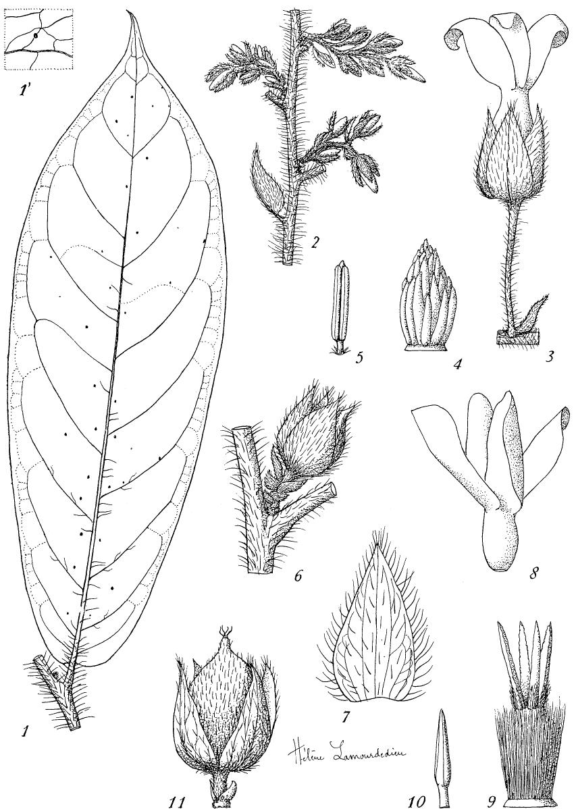  
P1.5.-Diospyros conocarpa Gurke et K.Schum.:1,feuille (face inf.）×_2/3; I',fragment de feuille (face inf).)X 6；2,inflor.et feuille anormale X 2/3；3, fleur×3/2;4et5,androcee etetamines×3;6,inflor.×1；7et8,sepale et corolle (fleur )× 3/2;9 et 10,gynecee et staminode × 4;11,fruit × 2/3. (1-1:Letouzey4212;2:LeTestu8942;3-5:Klaine1231et1410；6-10:Bates 1863；11:Breteler 2648 et Raynal 9924).

# R．LETOUZEY & F.WHITE

glabres, insérés a la base de la corolle. Ovaire conique de 5 mm, setifere, roux,a 8 loges et surmonté de 4 styles linéaires-lancéolés, strigueux a la base extérieurement, hauts d'environ 5 mm，â surface interne longuement stigmatifere, ondulée sur les marges.

Fruits,avec pédicelle de ± 5 mm， ovoides-coniques,acuminés,de 4 × 2,5 cm，sétiféres,de teinte rousse puis brun foncé, entourés du calice accrescent, papyracé,atteignant 3 cm de hauteur. 8 graines allongées, trigones, de 18 × 8 mm, brunes,a faces un peu ridées et ornementées dorsalement d'une nervure.

TYPE : Soyaux 57 (et I36 fide MILDBRAED loc.cit.),Gabon (holo-P).

Cette espéce est connue en Nigeria,au Cameroun,en Guinée équatoriale,au Gabon,aux deux Congo et au Cabinda,dans les zones de foret dense humide sempervirente,y compris en sous-bois des peuplements de Gilbertiodendron Dewevrei.

# MATERIEL CAMEROUNAIS ETUDIE :

Bates I426,Bitye sur Dja (fr.,sept.) BM;1863,eod.loc. (fl.).   
Binuyo et Daramola FHI 3563o,Kumba (fl.,mars).   
Brenan 9424,Banga,South.Bakundu for.res. (fl.,mars).   
Breteler 2648,25 km N Sangmelima,sur route de Mbalmayo (fr.,mars).   
Ledermann 761,Nkolebunde (2o km SE Kribi) (fl. ♀,oct.) (cit.in Notizbl. Bot.Gart.Berl.9 :1049 (1926).   
Letouzey SRFCam I133,Makak (fl.♀,mai)；1847,Essong pres Nanga Eboko (fl.δ,mai);42I2,Nkomo pres Ngoase au S de la riviere Lobo (stér.);4212 bis eod.loc.(fr.，févr.)；Io17o,colline Nkondo pres Enyantoum，2o km SW Ambam，(fr.,，mars)；Io247，colline SE Ndengué，15 km S Ebolowa (j. pousses).   
Mildbraed 5291,Mokumelos pres Lomié (fl.♀,mai);53o6,eod.loc.(fl.,mai); 5385,eod.loc.(fl.Q,mai)；54o1,eod.loc.(fl.,mai),omn.HBG；7729,entre Ebolowa et Yaoundé au S du Nyong (stér.) (cit.in Notizbl. Bot.Gart. Berl.9:1049 (1926).   
Raynal J. et A.9924,Mekoassi,25 km SW Ambam (fr.,févr.)； 10o58,Nkane, 25 km WNW Ambam (stér.).   
Staudt 273 (syntype de D. Staudtii Gürke),Mbangaberg (7oo m) pres Lolodorf (fl.,avr.).   
White 8567,rés. for.lac Ejaghan pres Mamfe (ster.) FHO.

# EBENACEE

Zenker 5g5,Bipindi (fl.δet fl. ♀,mai I914) P,B.;3548,Bipindi (fl. Ω,nov.) P,B；37oI a, Bipindi (fr., févr.） (cit. in Notizbl. Bot.Gart.Berl.9 :1049 (1926)；4471,Bipindi (fr.,févr.).   
Zenker et Staudt 664 (type de D. Staudtii Gürke)，Yaoundé (fl. ♀, j. fr., janv.).

# MATERIEL GABONAIS ETUDIE :

Breteler (et van Raalte) 5628,Gamba (5o km SE Setté Cama) (stér.); (et van Raalte) 565g,eod.loc. (fl.,sept.);5774，5o km SE Lambaréné (stér.), omn.WAG.   
Chevalier 26832,Assoukou pres Kango sur le Komo (fll. juv., oct.)； 27059, Aledjo sur le Ramboué (fl. δ,oct.).   
Hallé N. 2I92,Abanga (stér., juin).   
Halle N.et Villiers 5179,mont Mvelakéné (monts de Cristal) (stér.,févr.).   
Klaine 87,Libreville (fl.3)；147,sin. loc. (fl.,oct.)；229,sin. loc.(fr.)；287, sin.loc.(fl.et fr.,nov.et janv.); 5g2,Libreville (fl.,fl.,fr.,oct.,nov., fevr.);1231,sin.loc.(fl.,fl.♀,oct.)； 141o,sin.loc.(fl.,nov.)； 16g8,pres Libreville (fl.,oct.)；2o61,sin.loc.(fl.，nov.)；2164，sin.loc.(path., mars)；2262,sin.loc. (path.,mars)；2441,sin. loc.(fl.,nov.).   
Le Testu 2I3g,Ivoungou pres Mouila (fl.,oct.);2I59,Etamba pres Sindara (fl.,oct.)； 7577,Lastoursville (fl.,oct.)； 762g bis,Lastoursville (fl., nov.)；78o1，Youlou pres Lastoursville (fl.，déc.)；8541，Malendé pres Lastoursville (fl.δ,nov.)；857o,Maciya,a mi-distance entre Lastoursville et Sindara (fl.&,déc.)；8942，Mbangodécahoyo，75 km ESE Makokou (fl s,oct.).   
Soyaux 57 (et I36 fide MILDBRAED loc.cit.) (type de déc.188o de D.conocarpa Gürke et K.Schum.et syntype de janv.188o,par erreur,de D.Staudtii Gurke), Sibange farm (fl. ♀,fr., dec.).

# 9. Diospyros crassiffora Hiern

Monogr.Eben., Trans.Camb.Phil.Soc.12: 26o (1873); FTA3:525 (1877).— WALKER et SILLANs,Pl. utiles Gabon :tab.I5(I96I).- F.WHITE, FWTA ed. 2, 2: 12,tab. 202 A,5 (1963); Nigerian Trees 2: 336 (1964).   
-Diospyros ampullacea GuRkE,Bot. Jahrb. 43.:329 (19o9) (type :Mildbraed.3I2“ 8)?); in MILDBR.,Wiss. Ergebn.Deutsche Zentral-Afr.Exped. 1907-08,2 : 524 (191I) (type:Mildbraed；312“ 2 )?)，sp.aff.D.“ crassiflora）,non“ incrassata),sphalm.(“ incarnata )?),syn.nov.   
Diospyros incarnata GURKE,Bot.Jahrb.43 : 2I3 (I9O9).- PELLEGRIN, Fl. Mayombe 2 :16 (1928); Bull. Soc.Bot.France 8i: 327 (1934).

# R．LETOUZEY & F.WHITE

- Diospyros Evila P1ERRE ex CHEv., C.R.Ac. Sc. I56 :139I (1913)，nom, nud.;Vég.ut.Afr. trop.fr.,Forét Bois Gabon:234,tab. 25 (janv. 1917). descr.gall.；Mém.Soc.Bot.France 8 ：27o (févr. I917)，descr. lat.- PELLEGRIN,Bull. Soc. Bot.France 8l :327 (1934).   
-Diospyros flavescens auct. non GURkE: A. CHEvALIER, Vég.ut. Afr. trop. fr.,Foret Bois Gabon :238 (1917) (?).

Des échantillons de cette espece figurent en divers herbiers sous le nom suivant :Diospyros Lecomtei (PIERRE ms.).

Arbre atteignant 25 m de hauteur totale,a tronc cylindrique assez court (15 m) mais parfois assez volumineux (8o-12o cm de diamétre),légerement cannelé a la base avec quelques colonnettes ascendantes, surmonté de quelques grosses branches ± dressées. Ecorce d'un gris noiratre ou verdatre, finement striee longitudinalement, s'exfoliant en écailles assez épaisses；tranche relativement peu épaisse avec,en section oblique,vers l'extérieur une couche noire cassante correspondant au rhytidome et, vers l'inté- rieur,une tranche d'abord rose saumon pale avec des bandes cremes,puis jaunatre avec des tirets verticaux orangés, alors que le cambium est uniformément orangé.Aubier tres épais,de teinte créme ä jaune rougeatre,éventuellement avec bandes noires; bois de coeur noir, tres dur,qui ne se forme que chez les arbres atteignant au moins 3o cm de diamétre,les vieux arbres devenant en outre creux. Rameaux aoutés gris brun rougeatre,garnis de gercures superficielles longitudinales. Jeunes rameaux gréles, prenant une teinte noire en séchant, glabres. Bourgeons argentés pubescents a poils couchés. Jeunes feuilles rouge violacé puis vert tendre. Parfois groupe de petites feuilles elliptiques a la base de jeunes rameaux ± fascicules en extrémité d'une branche avortée.

Feuilles a pétiole canaliculé brun foncé mesurant jusqu'a 15 mm de longueur, glabre ou avec quelques poils visibles seulement a fort grossissement,ä limbe lancéolé,elliptique-lanceolé ou oblong-lancéolé,de Io-2I X 5-9 cm, a base largement cuneiforme et tres légerement décurrente sur le haut du pétiole；souvent

[Figure 5 — see figures.md]

pincée sur échantillon sec par suite d'une courbure de la nervure médiane et d'une légere asymétrie du limbe,un pincement analogue se retrouvant au sommet du limbe,celui-ci brusquement acuminé avec acumen tres étroit, fréquemment un peu torsadé, mesurant souvent de I2-18 mm de longueur,ä pointe obtuse en extrémité；limbe subcoriace,a marge tres étroitement enroulée au-dessous sur échantillon sec,a faces concolores brun verdatre sur échantillons secs,la supérieure brillante et glabre,l'inférieure munie,chez les jeunes feuilles,de quelques poils couches épais tres courts, plus abondants vers la base de la nervure médiane;quelques petites glandes noires orbiculaires,non loin de la marge vers la base du limbe,ä la jonction de nervures et surtout de nervilles; nervure médiane enfoncee sur le dessus du limbe, tres saillante en-dessous；5-8 paires de nervures latérales, légerement proéminentes au-dessous, tres ascendantes,un peu arquées,réunies par des nervures tertiaires ± perpendiculaires a la nervure médiane.

Inflorescences axillaires ou, particulierement pour les fleurs ?, au-dessous des feuilles, sur des rameaux agés； fleurs  groupées par 3-6,fleurs ♀ solitaires ou par 2,rarement plus,toutes ces fleurs étant subsessiles et la base de l'inflorescence ou de la fleur étant garnie de quelques bractées et bractéoles imbriquées largement triangulaires,ä sommet obtus,pubescentes extérieurement, ciliolees sur la marge.Calice et corolle semblables pour les fleurs et ?; le calice rouge rosé, fortement coriace,en coupe hémisphérique atteignant ± Io mm，éparsement pubérulent extérieurement, pubescent intérieurement,avec poils courts，serres et couchés, est découpé en 4-5 lobes largement triangulaires,a sommet obtus n'atteignant pas le milieu de la profondeur du calice; la corolle, couverte d'une pubérulence dense,courte et couchée,est blanche a la base,rose au sommet,charnue,ellipsoide et pointue vers le bas et vers le haut ou elle est surmontée de 4-6 petits lobes suborbiculaires de 2-4 mm,cette corolle atteignant au total 25-3o mm de long et 15 mm de diamétre au milieu.

Fleurs δ avec étamines blanches, tres nombreuses (4o-110), insérées sur le réceptacle,sur au moins 2 cercles,la base des filets de 2 étamines appartenant aux 2 cycles ± concentriques étant

souvent radialement soudée； filets tres courts (2-3 mm),antheres linéaires,de Io-I2 mm,aigués,quelque peu pubescentes dorsale-ment avec poils couchés vers le haut; pistillode conique, ne dépassant pas 2-3 mm de hauteur, pubescent.

Fleurs ? avec staminodes moins nombreux que les étamines des fleurs &,insérés a la base de la corolle sur 2 cercles,± soudés radialement 2 par 2,de forme générale plus fusiforme que celle des antheres,également plus courts (6-8 mm) et recouverts d'une pubescence de poils couchés vers le haut plus abondante；il ne semble pas exclu que ces staminodes soient parfois pourvus de loges polliniques；ovaire massif,cotelé, haut de 5 mm environ, creusé normalement de (6?-) 8-1O loges,couvert d'une pubérulence veloutee dressée de teinte dorée, surmonté de (3-)4-5 styles soudés a la base, hauts de ± 6 mm,spatules,leur face interne dressée, élargie,stigmatifere,devenant foliacée,ces styles étant en outre finement pubérulents.

Fruits ± ellipsoides,atteignant jusqu'a 1o X 6,5 cm, jaunes â maturité,éparsement pubérulents,avec poils courts et couchés, pres du sommet,entourés á la base du calice étalé en soucoupe et un peu accru,atteignant jusqu'a 4 cm de diamétre.Chaire blanc creme ou jaunätre renfermant 4-8 graines brunes,brillantes, oblongues,un peu réniformes, atteignant 4.5 × 1,5 × 1 cm.

TYPE：Thomson,Nigeria.

Cette espece, connue au Cameroun sous le nom de“ Mevini ) et au Gabon sous celui de“ Evila 》,est le principal fournisseur de bois d'ébene africain,ce bois étant commercialisé sous forme de buches de bois de cour,de faible longueur et excédant rarement 3o cm de diametre.D. crassiflora se rencontre en Nigeria,au Cameroun,en République Centrafricaine,aux deux Congo et au Gabon. L'amenuisement des transactions commerciales concernant le bois d'ébene au Cameroun et au Gabon provient peut-étre d'une surexploitation，au cours des années écoulées,dans les régions de Yabassi, d'Edéa,de Libreville mais,en fait,au Cameroun et au Gabon comme dans les autres territoires,il semble que

# R.LETOUZEY &F.WHITE

D.crassiflora ne soit pas réellement une essence de forét dense humide typiquement sempervirente et elle se rencontre plutót dans les ilots de vieille forét,méme de type semi-décidu, situés plus en arriere de la cóte,ou encore dans des ilots de type sempervirent situés au sein des foréts semi-décidues â Sterculiacées et Ulmacées；c'est ainsi que, bien que connue pres de Victoria et de Kribi, cette espéce se rencontre aussi vers Mamfe, Lomié, mais encore vers Bafia,Yaoundé,Abong Mbang,Bertoua,Yokadouma. De méme il semble qu'elle soit absente,ou sans doute assez rare dans la région de Libreville, s'écartant ainsi, comme au Cameroun,des foréts denses les plus humides.

# MATERIEL CAMEROUNAIS ETUDIE:

Aubréville 2779 (= 1 Ca)， Yaoundé (fl. ♀et j. pl.,avr.).  
Bates 16go,Bityé sur Dja (fl. ♀,avr.) BM.   
Breteler 2844 : ef.Letouzey 4785.   
Busgen 4o3,sin.loc. (stér.) B.   
Hedin 2o7,Mbet pres Bertoua (stér.);561,Essaoulo pres Yokadouma (stér.); 816,Mwapak，4o km WSW Yokadouma (fl.δ,avr.)； 999,Lomié (fl., mai);s.n.,Vimcli,actucl Mbalmayo (stcr.).   
Keay FHI 37442 et 37473,rés.for.Bambuko pres Kumba (stér.)FHO.   
Letouzey 288g,Pouté pres Bertoua (stcr.); 3713,2o km NW Ngola pres Abong Mbang (stér).；4785 (= Breteler 2844)，pres Meloundou，5o km SW Batouri (fl.,avr.);4832,pres Kapan, 5o km S Batouri (fl.，avr.)； 7912, Tchango,25 km NNE Bafia (fr.,sept.).   
Maitland 4o7,Victoria (fl.,févr.).   
Mildbraed 4489,embouchure de la riviere Bangé,55 km S Yokadouma (stér.) HBG；(?) 57o1,Ekuk,20 km E Ebolowa (stér.) (cit.in MiLDBRAED,Wiss. Ergebn.Zweite Deutsche Zentral-Afr.Exped.2:89 (1922);8339,14o km NE Yaoundé (fl. δ,févr.) K；8474，Ig5 km NE Yaoundé (fl.,févr.) HBG,K.   
Mpom Ioo (= SRFCam 2025)，Mangombé pres Edéa](stér.).   
Nana 57 (= SRFCam 2029),km 43 route Bertoua-Deng Deng (fl.,avr.) YA.   
Rosevear I/34,Mamfe (fl.δ,avr.) FHO.   
Service forestier s.n., Ototomo pres Yaoundé (fl.).   
Zenker 234o (type de D.incarnata Gurke),Mimfia pres Bipindi (fl.δ,mars) B.   
White 8546 a,rés.for.Nta Ali pres Mamfe (stér.)FHO.

# EBENACEE

MATERIEL GABONAIS ETUDIE ：

Fleury 265o8(“ D.flavescens ) ms.) et 265o8 bis in herb.Chevalier (type de D.Evila Pierre ex Chev.),pres Diobomagola *(d'apres toutes les étiquettes d'herbier) sur 'Orimbo affluent de l'Ogoué (stér.).

Le Testu 2I42,Ocounza,2o km NNE Mouila (fl.δ,oct.)；24o7 bis,Kalengové,vallée de la Bendolo affluent de la Ngounyé (stér.)； 24o8 bis, Pingo, vallée de la Waka affluent de la Ngounyé (fl.♀,j.fr.,oct.); 5o23,Saint Martin,25 km NNW Mouila (fl.δ,oct.)；5o28,Yombo,3o km NNW Mouila (fl.♀,j.fr.,oct.)；6o88,entre Mandji et Ndjolé au pied du mont Iboundji, a mi-chemin entre Lastoursville et Sindara (fl. ，sept.)；7479，Miporapossa pres Lastoursville (fl.,oct.)；7527,Lastoursville (fl.♀,j.fr.et fr. in carpoth.P)；8438,Nzocou, 75 km SSW Lastoursville (fl.,oct.).

Trilles 58, riviere Udzémé pres des monts de Cristal (fr.).

Walker 34822 in herb. Chevalier,Mokandé (bassn de la Louga) et Mobégo (bassin de la Waka) (stér.).

Lecomte s.n., Mayumba (fr. uniquement, sept.).

# 10.Diospyros Dendo Welwitsch ex Hiern

Monogr.Eben.,Trans.Camb.Phil. Soc.12：195,tab.1o(1873)；FTA3：523(1877).—F.WHITE,FWTA ed.2,2:IO,tab.202B,I (1963)；NigerianTrees 2 : 333 (1964).  
Diospyros atropurpurea GUrkE,Bot.Jahrb.26:67 (18g8)；loc.cit.43: 2I1,tab.4(1909).-MILDBRAED,Notizbl.Bot.Gart.Berl.9:1o51 (1926).   
--Diospyros flavescens GURkE,Bot. Jahrb.43 :2II (19O9).- CHEVALIER, Veg.ut.Afr.trop.fr., Forét Bois Gabon : tab. 26 (1917).-M1LDBRAED, Notizbl.Bot.Gart.Berl.9 :1o51 (1926).   
-- Diospyros mimfiensis GURkE, Bot.Jahrb.46 :153 (19I1).- MILDBRAED, Notizbl.Bot.Gart.Berl.9 :Io51 (1926).- PELLEGRIN,Fl.Mayombe 2 : 18 (1928).   
-- Diospyros nyangensis PELLEGR., Bull. Mus.nat. Hist. nat.31: 383 (1925); Fl. Mayombe 2:18 (1928),syn.nov.   
Diospyros temvoensis DE WiLD.,Pl.Bequaert.3:554 (1926),syn. nov. Des échantillons de cette espece figurent en divers herbiers sous le nom suivant :Diospyros coccinea (GURkE ms.).

P1.7,p. 65,et CARTE 32,p.173.

Petit arbre atteignant 15 (-25) m de hauteur et 2o (-3o) cm de diamétre ä la base,mais souvent de plus faible diamétre; tronc fréquemment tordu et légerement cannelé；écorce lisse,de teinte foncee gris noiratre ou gris verdatre, se desquamant en pellicules, minces et cassantes,recouvrant des surfaces fraiches de teinte gris violacé́ ;tranche de 'écorce avec un cerne noir vers l'extérieur et d'un jaune brillant vers l'intérieur;bois dur,blanc mais fréquemment noir au coeur. Branches effilées, lisses,de teinte gris cendreé foncé；jeunes rameaux gris tres foncé et noirs sur échantillons secs,couverts d'une fine et courte pubérulence assez lache, souvent ± couchée,de teinte fauve doré et ± caduque a la longue; jeune feuillage nuancé d'orangé et de rougeätre.

Feuilles ä pétiole ne dépassant guere 5-6 mm de longueur, pubérulent,avec poils couchés； limbe de forme et de taille assez variables:le plus souvent oblong-lancéolé, mais aussi parfois lancéolé ou elliptique,fréquemment de 1o-15 × 4-5 cm，mais parfois plus petit ou atteignant jusqu'a 18 × 7 cm; base en général arrondie ou obtuse mais un peu décurrente,voire aussi aigue, la marge étant retournée au-dessous vers cette base qui présente, en regle presque générale, de chaque coté de la nervure médiane, ä la face inférieure du limbe,une glande de teinte brun foncé ou noirätre,elliptique allongée dans le sens du limbe, souvent en dépression et ± perceptible a la face supérieure;quelques glandes analogues peuvent exceptionnellement se rencontrer de chaque cöté de la nervure médiane dans la partie inférieure de la feuille; sommet du limbe peu nettement acuminé chez les formes lancéolées,beaucoup plus nettement et brusquement chez les formes oblongues-lancéolées ou elliptiques,cet acumen pouvant atteindre 2 cm de longueur et 5 mm á la base,mesurant encore 2 mm de largeur sous le sommet tres obtus;a la face inférieure de I'acumen etä son voisinage,tres fréquemment,présence de quelques glandes arrondies； limbe finement coriace，glabre sauf vers la base,au moins sur les jeunes feuilles ou se retrouve,au-dessous, la pubé- rulence des pétioles,de teinte le plus souvent rougeatre sur échantil-

[Figure 6 — see figures.md]

lons secs,la face supérieure étant brillante et plus foncee; nervure médiane enfoncée sur le dessus du limbe, souvent pubérulente vers le sommet,cette pubérulence se rencontrant fréquemment aussi sous 'acumen et a son voisinage;(4-) 5-6 (-8) paires de nervures latérales，peu marquées au-dessus,exceptionnellement enfoncées, tres ascendantes et peu arquees pour les nervures infé- rieures, tres arquées pour les nervures médianes et supérieures discretement anaslomosées en boucles pres de la marge; nervilles effacées,surtout á la face supérieure,subparalleles entre elles.

Inflorescences axillaires ou légerement supra-axillaires, parfois au-dessous des feuilles,en courtes cymes contractées a axes pubescents avec poils fauves couchés ne dépassant guere 2 mm de longueur, avec quelques bractées et bractéoles caduques, ovales,d'environ 2 mm de longueur,concaves,obtuses au sommet, également pubescentes； fleurs  rassemblées par 5-2o,avec pédicelles pubescents articulés au sommet,de ± 2-3 mm,plus gréles et plus longs que chez les fleurs ♀,rassemblées par 2-5,avec pédicelles élargis en coussinet au sommet.

Fleurs & atteignant 6-8 mm de hauteur; calice de 3 mm, campanulé,pourvu, sur moitié de sa profondeur,de (4-）5-6 (-7) lobes,± égaux, étroitement ovales, a sommet aigu ou obtus, ce calice étant densément pubescent, avec courts poils raides, couchés vers le haut,de teinte fauve doreé,extérieurement et d'une pubescence plus molle intérieurement； corolle de teinte creme, glabre,ellipsoide dans le bouton floral,puis ä tube campanulé surmonté de (4-）5 (-6) lobes atteignant les 2/3 de la profondeur de cette corolle，avec lobes oblongs-obovales，refléchis lors de l'anthese; 20-24 (-26) étamines fixées pour moitié pres de la base du tube de la corolle, pour moitié non loin de la gorge du tube,ä filets de 1-3 mm，glabres (Cameroun et Gabon septentrional (Libreville，Lastoursville) semble-t-il） ou pubescents-sétuleux (Gabon méridional (Mayombe bayaka) et Angola semble-t-il), ä antheres oblongues de 5-3 mm,en pointe conique au sommet, glabres ou pubescentes-sétuleuses comme les filets；pistillode de petite taille,glabre,massif et ± cötelé.

Fleurs ♀ atteignant 8-1o mm de hauteur; calice accrescent,

# EBENACEE

analogue á celui des fleurs & mais plus profondément lobé, a 4- 6 segments plus étroits et plus aigus,avec marges latérales ± redupliquées; corolle analogue a celle des fleurs  mais a lobes dressés; pas de staminodes；ovaire a 4 loges, glabre,conique, de 2 mm, prolongé par 4 styles courts soudés,terminés chacun obliquement par un appendice stigmatifere foliacé finement découpé et plissé, largement épanoui et recourbé vers l'extérieur.

Fruit,avec pédicelle atteignant ± 5 mm de longueur,de forme ovoide et mesurant 1,5 × 1,2 cm,pointu au sommet avec base des styles tronquee,glabre,pourpre foncé luisant,renfermant 2-4 graines de Io-I2 mm,ce fruit étant entouré a la base par le calice accru,± largement ouvert, dont les lobes coriaces,lancéolés, cordés latéralement ä la base,mesurent alors jusqu'a 3 × 1,5- 1.8 cm, avec marge ondulée, pubescence interne primitive étirée et pubescence externe concentree seulement vers la base des lobes, au long de la partie médiane du lobe alors saillante vers l'intérieur du calice;nervation de ces lobes 士 flabellée et calice de teinte brun rougeatre fonce.

SYNTYPEs :Welwitsch 2537 (iso- P) et 2538,Angola.

Cette espéce s'étend de la Nigeria, par le Cameroun, le Gabon et le Mayombe, ä l'Angola (Golungo Alto)；elle fréquente semblet-il les forets denses humides sempervirentes dans son aire septentrionale;elle acquiert peut-étre quelques caracteres distinctifs (cf. androcée) et supporterait aussi une écologie un peu différente dans son aire méridionale (Mayombe bayaka，Angola). Cette espece parait cependant se retrouver plus ä 'intérieur des terres (Lastoursville,Bélinga) et méme dans la vallée de la Sangha (Sita 8o4)，au voisinage de Ouesso en République du Congo Brazzaville.

# MATERIEL CAMEROUNAIS ETUDIE：

Keay FHI 37474,Bambuko for.res. pres Kumba (ster.).

Leeuwenberg 5692，pres km 58 route Edéa-Kribi (fl.δ,mai) WAG.

Letouzey 9418,3o km ESE Kribi au N de la Kienké (j. fr., avr.).

# R.LETOUZEY & F.WHITE

Mbarga I4 (= SRFCam 2o19)，piste de Ngongos pres Eséka (fr., juin)；28 (= SRFCam 2o18),eod.loc. (stér.) YA.   
Mildbraed Io574，Likomba pres Victoria (ster.）K (non D. physocalycina Gurke,cf.FWTA ed. 2,2:IO (1963).   
Smith II A,Badshu Adagbe pres Mamfe (stér.) FHO.   
Zenker 378,Bipindi (fl.♀,j.fr.，janv.I913)P,B；532,Bipindi (fl.,mars 1914)P,B；914 (syntype de D.atropurpurea Gürke),Bipindi (j. fr.,mai); 1154 (syntype de D.atropurpurea Gurke), Comanchio pres Bipindi (j. fr., nov.)；1722 (syntype de D. flavescens Gurke)，Bipindi (fl.δ,mars) P,Z,B; 1888 b,Bipindi (fr.）P,B；19o4,Bipindi (fr.)；235o (type deD.mimfiensis Gurke),Mimfia pres Bipindi (fl.δ,mars);3o46,Bipindi (fl.♀);3351,Bipindi (fr.)P,B；3445,Bipindi (j.fr.);3533,Bipindi (fr.) BM,K;3746 (syntype de D.flavescens Gürke),Mimfia pres Bipindi (fl.,mars)P,Z,B；4187,Bipindi (stér.P et fl.Z；423o,Bipindi (j.fr.)；4312,Bipindi (fr.)P,B；4459 et 4508,Bipindi (fl.δ）P,B；47o3,Bipindi (fr.)；49g6,Bipindi (fl. δ)；s.n., Bipindi (j. fr., juin 1go7)； s.n.,Bipindi (fl.δ).

# MATERIEL GABONAIS ETUDIE：

Fleury s.n.,sin. loc. (stér.).   
Hallé N.3g62,Bélinga (fr., juin).   
Klaine118,sin.loc.(fl.♀,oct.);155,sin.loc.(fl.,oct.)； 586,Librevile (fl.5, fl.,oct.)；847,sin. loc.(fr.,mars)；1688,sin.loc.(fl.,oct.)；2532，pres Donghila (fr.,nov.)；28oo,pres Sibang (fr.,mars)；285o,sin. loc. (fr.,avr.); 3103,sin.loc,(fl.,oct.)；3525,Donghila (fl.♀,nov.)；s.n.,sin.loc. (fl.).   
Le Testu I46g，Tchibanga dans le Mayombe bayaka (fl.δ,nov.） (étamines pubescentes)；2I26 (type de D.nyangensis Pellegr.)，Tchibanga dans le Mayombe bayaka (fl.,nov.) (étamines pubescentes)；7177,Lastoursville (fl.,avr.)；7353,Lastoursville (fl.,mai)；7523,Lastoursville (fl.,oct.); 7555,Lastoursville (fl. δ,oct.） FHO；8436,Nzocou,75 km SSW Lastoursville (fl.,oct.)；8514,Lastoursville (fl. ♀,nov.)；8521,Lastoursville (fl., nov.).

A cette espéce doit étre rattachée semble-t-il une forme extréme, rencontrée ca et la au Cameroun (ainsi qu'au Congo Kinshasa)；elle est caractérisée essentiellement par des entreneuds resserrés,des feuilles de tres petite taille,au maximum 6,5 × 3 cm,ä ± 3 paires de nervures latérales et des fleurs de dimensions plus réduites,á corolle de 3,5-4 mm de hauteur. Des formes de passage,telles Daramola FHI 298o5，paraissent

# EBENACEE

relier ces échantillons particuliers ä Diospyros Dendo Welw. ex Hiern.Cette forme ä feuilles réduites peut correspondre ä une anomalie dans le comportement physiologique de la plante, mais de nouvelles observations in situ sont indispensables,d'autant plus que les échantillons en cause semblent présenter deux glandes foliaires assez discretes vers l'aisselle de la premiere paire de nervures latérales et non deux glandes nettes pres de l'extréme base du limbe; les étamines sont en outre á anthere de I mm, assez réduite par rapport au filet de I-2 mm，et cette anthere est ciliolée sur le bord.

A cette forme á feuilles réduites appartiennent les échantillons suivants :

Daramola FHI 298o5,Kumba (fl.δ,avr.) FHO. Letouzey SRFCam I13g,Makak (fl.δ,avr.). White 8592,lac Ejaghan pres Mamfe (ster.).

# 11.Diospyros ferrea （Willdenow） Bakhuizen

Gard.Bull. Str. S.7:162(1933)；Bull. Jard.Bot.Buitenz.,ser.3,15(2): 50(1937) et 15(4) : 431 (194I).—F.WHITE,FWTA ed.2,2:11 (1963); Nigerian Trees 2:338 (1964). -Ehretia ferrea WiLLD.,Phytogr.1:4,tab.2,2(1794).

PL.16,13-22,p.113,et CARTE 30,p. 171.

Cette espéce，extrémement polymorphe,est répandue dans tout le milieu paléotropical,de la Polynésie，par l'Australie etI'Asie, jusqu'en Afrique occidentale. Les travauxde R.C.BAKHUIZEN VAN DEN BRINK et de F.WHITE Ci-desSUS mentionnés fournissent,pour l'ensemble de 'aire et pour 'Afrique occidentale plus spécialement，de tres nombreuses références bibliographiques,de multiples synonymes (entre autres pour l'Afrique occidentale : Maba buxifolia Pers.,，Maba guineensis A.DC.,Maba lancea auct. non Hiern, Maba secundiflora Hutch.,

Maba Smeathmannii A. DC.,.. )， des descriptions de I'espéce et de ses varietés possibles， des listes d'échantillons,...

Alors qu'en Afrique occidentale l'espece parait localement bien représentée，avec d'assez nombreux exemplaires dans les Herbiers,il est curieux de constater que Diospyros ferrea (Willd.) Bakh.n'est connu au Cameroun que par deux seuls échantillons,de la région de Kumba (Staudt 617 et Keay FHI 37465), ä proximité de la frontiere nigérienne.Absent ailleurs au Cameroun,il n'est connu en République Centrafricaine que par un seul échantillon (Tisserant Io84).Quelques représentants sont mentionnés á Sao Tomé,au Bas Congo et en Angola; cette espéce se retrouve ensuite seulement en République du Sudan,en Tanzanie puis au Mozambique，avant de gagner Madagascar et la partie orientale de son aire.

Le spécimen Staudt 617 (avec fleurs &) est identique par ses feuilles ä des échantillons (avec fleurs et fruits) de Nigeria (cf.Meikle 7861 de Kaduna,Hepper Io6i de Jos),ces 3 échantillons représentant une forme assez typique,ä petite feuille étroitement rhomboédrique ä étroitement elliptique,que l'on retrouve cä et la en Afrique occidentale.Cet échantillon camerounais présente les caractéristiques suivantes :

Rameaux gris foncé, finement fendilles et plissotés longitudinalement， finement pubérulents；tres jeunes rameaux，un peu zigzaguant,couverts d'une pubescence roussätre assez dense de poils raides, couchés vers le haut;cette pubescence se retrouve, pour les feuilles juvéniles,sur les pétioles, le dessous de la nervure médiane, la marge du limbe et éparsement ä la face infé- rieure de celui-ci,en outre aussi sur les inflorescences,pédicelles et calices.

Feuilles a pétiole de 2-3 mm de longueur； limbe étroitement rhomboedrique ä étroitement elliptique,de 3-5 × 1-2 cm,en coin aigu ou obtus ä la base,ä sommet un peu acuminé avec pointe obtuse； limbe subcoriace,ä marge un peu épaissie et souvent un peu onduleuse,de teinte brun roux sur échantillons secs, garni d'une nervure médiane déprimée ä la face supérieure et

de nervures latérales peu marquees et individualisées, anastomosées a un réseau de nervilles aussi important qu'elles. (Au moins 2 glandes nettes,de part et d'autre de la nervure médiane dans la partie inférieure du limbe，caractérisent fréquemment cette espéce en Afrique occidentale；ailleurs，et en particulier au Cameroun, ces glandes paraissent plus sporadiques).

Inflorescences  axillaires sur les jeunes rameaux, en cymes pubescentes,atteignant I cm de longueur, de 3-5 fleurs,avec petites bractées et bractéoles ovales-lanceolées de I mm. Fleurs ä pédicelle pubescent,de 1,5 mm,tardivement articulé au sommet; calice tomentelleux, fermé dans le bouton floral puis cupuliforme, de 2 mm de hauteur, fendu pour former 3 lobes un peu inégaux, largement ovales,ä pointe obtuse,ne dépassant pas la moitié de cette hauteur；corolle blanche de 4 mm de hauteur,ä 3 lobes ascendants,elliptiques,ne dépassant pas la moitié de cette hauteur,remarquablement strigilleux extérieurement, mais particulierement et presque uniquement dans leur partie médiane,le tube cylindrique de cette corolle étant cependant glabre；8 étamines insérées sur le réceptacle，glabres，groupées par paires，ä filets de o,5-1 mm et a anthere lancéolées,apiculées,de I-1,5 mm; pistillode rudimentaire,hirsute.

Par ailleurs, en Afrique occidentale, Diospyros ferrea (Willd.) Bakh.serait un arbuste buissonnant ou un petit arbre ne dépassant pas 15 m de hauteur, avec des branches arquées et une cime légere, ä tronc atteignant Io cm de diametre,avec une écorce noiratre presque lisse,ä tranche rouge,et un bois de coeur noir.Les feuilles peuvent étre de forme ovale, lanceolee,elliptique voire obovale et atteindre 12,5 × 5 cm.Les fleurs peuvent renfermer 6-12 étamines.Fleurs ♀ solitaires et semblables aux fleurs  mais un peu plus grandes,en particulier quant au calice， subsessiles, dépourvues de staminodes et avec ovaire ovoide,de 3 mm，densément hirsute avec pubescence couchée vers le haut, a 3 loges garnies de I et plus généralement 2 ovules,avec fausse-cloison incompletement développée,ä styles soudés en une courte colonne légerement trilobée au sommet. Fruits oblongoides,d'environ 1,5 X I cm，apicules et avec quelques poils vers le sommet,

# R.LETOUZEY & F.WHITE

brun päle ä maturité,renfermant en général I ou 2 graines de I2 mm,ces fruits étant entourés á la base par le calice persistant et légerement accru.

TyPE:Koenig s.n.,Inde (Malabar).

Cette espece se rencontrerait en Afrique occidentale dans les fourrés littoraux， dans les sous-bois de foret de type peu humide,ainsi que dans les galeries forestieres et encore parmi les rochers des zones de savane.

MATERIEL CAMEROUNAIS ETUDIE :

Keay FHI 37465,rés.for.Bambuko pres Kumba (stér.) FHI.

Staudt 617 (sous le nom de Maba buxifolia Pers.)，Johann Albrechtshohe (actuel Kumba) (fl.δ).

# 12. Diospyros fragrans Gurke

Bot.Jahrb.46：154(19II).—MILDBRAED，Notizbl.Bot.Gart.Berl.9：1050 (1926).-F.WHITE,FWTA ed.2,2:11,tab.202A,3 (1963);non Mabafragrans HIERN ex GREVES.

Des échantillons de cette espece figurent en divers herbiers sous le nom suivant :Diospyros mucronata (PIERRE ms.).

PL.8,1-10,p. 73,et CARTE 28,p.169.

Petit arbre atteignant jusqu' 15 m de hauteur,parfois formé de plusieurs tiges verticales； tronc superficiellement et irrégulierement cannelé á la base (sur sol frais sablonneux, ce tronc peut étre garni de petites racines échasses ä la base)avec excroissances(cauliflorie)；rhytidome brun foncés'exfoliant en écailles papyracées de 5 × 2,5 cm; tranche noiratre extérieurement,ocre foncé intérieurement；bois de teinte creme jaunätre; petite cime avec longs rameaux supérieurs en apparence verti-

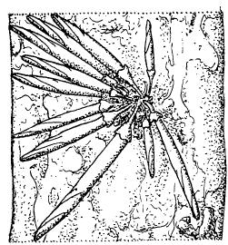

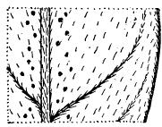  
2

[Figure 7 — see figures.md]

cillés,obliquement dressés et á ramification tres ouverte； jeunes rameaux graciles,verts tachés de noir puis uniformément noirätres sur le sec,couverts d'une fine pubescence de poils jaunätres apprimés,avec feuilles distiques.

Feuilles brievement (2-3 mm) pétiolées，a limbe oblonglancéolé, de 7-11,5 (acumen compris) × 3-4 cm,obtus ou largement arrondi â la base,caudé-acuminé,avec acumen de Io-i5 mm aigu et souvent mucroné au sommet； limbe papyracé,vert bleuté brillant et glabre au-dessus,vert bleuté blanchatre et mat audessous,avec nervure médiane et 3-5 paires de nervures latérales finement pubescentes,la surface méme du limbe n'étant qu'éparsement pubescente avec poils apprimés ； nervures latérales presque indistinctes sur le dessus du limbe,arquées et évanescentes vers la marge; pas de nervilles visibles ; sur échantillons secs, limbe gris-verdatre ou parfois brunatre au-dessus,gris blanchatre ou un peu jaunatre au-dessous, toute la surface inférieure étant constellée de fines ponctuations cristallines en apparence de 2 tailles,les plus grosses étant formées d'un amas des plus petites; nombreuses petites glandes noires déprimées tout au long et en général á proximité immédiate (1-2 mm) de la nervure médiane et jusque dans 'acumen.

Inflorescences  en cymes fasciculées,de 6-15 fleurs，nées sur le vieux bois,presque jusqu'au sol parfois,garnies de bractées et de bractéoles lancéolées de 2-3 mm，pubescentes extérieurement.Pédicelles de 3-5 mm de longueur, tardivement articulés au sommet，pubescents. Calice verdatre á veines rougeätres, de 3-4 mm de hauteur,éparsement pubérulent extérieurement, a (4-)5 lobes plus courts ou presque aussi longs que le tube, étroitement triangulaires ä deltés,ä sommet aigu,garni extérieurement d'au moins une grosse glande cratériforme vers ce sommet mais aussi par ailleurs, ces glandes， peut-étre d'origine pathologique, pouvant se retrouver aussi sur le tube de la corolle；corolle blanc nacré atteignant 35 mm de hauteur (“ 5 cm） d'apres la diagnose, mais avec tube de( I2-14 cm )et lobes de( 18 mm)),blanche, tres odorante,glabre,avec tube de Io-16 mm,contracté au sommet,et 5 lobes lanceoles de 2o-25 environ； 18-2o étamines glabres,

# EBENACEE

insérées sur la base du tube de la corolle par paires appartenant ä 2 cycles concentriques,á filets de 2-4 mm et ä antheres lineaires, longuement pointues au sommet,de ± 6 mm;pistillode en massif élevé couvert de poils raides dressés, le tout ne dépassant pas 2 mm de hauteur.

Les échantillons avec fleurs ♀ n'étant que maigrement repré- sentés dans l'Herbier de Paris et les fruits récoltés paraissant avoir disparu， les descriptions suivantes concernant ces élé- ments proviennent pour grande part des descriptions originales de GüRKE et de MILDBRAED.

Inflorescences 早 en cymes densément fasciculees de 5-8 fleurs, nées également sur le vieux bois, presque jusqu'au sol, garnies de bractées et de bractéoles lancéolées de 2 mm，pubescentes extérieurement. Pédicelle de 5-1o mm de longueur,avec poils courts et raides， patelliforme au sommet.Calice campanulé, â 5 lobes triangulaires á pointe rapidement recourbée vers l'exté- rieur，semblable ä celui des fleurs &,avec les mémes glandes et en outre pubescent intérieurement；corolle de 25 mm,blanche, avec tube renflé ä la base,de Io-1I mm de longueur × 9-l0 mm de largeur et lobes lancéolés de 12-13 mm × 4-5 mm；± 10 staminodes linéaires， pointus,de 8 mm de longueur;ovaire largement ovoide,de 4-6 mm,ä 1o loges,densément couvert de poils raides de teinte jaune brunätre et surmonté de tres courts styles soudés,avec 5 stigmates aplatis-subulés,courbés vers l'intérieur, de 2-4 mm de longueur,glabres intérieurement,hispides exté- rieurement.

Fruits ovoides-subglobuleux ± déprimés,d'environ 3-4 cm de diametre,apiculés,éparsement couverts de poils soyeux et en outre d'une breve pubescence ferrugineuse ± caduque provoquant des démangeaisons, le fruit étant entouré,a la base, du calice accru atteignant jusqu'a 1,5 cm de diamétre; Io graines d'environ 3o × 13 × 8 mm,a section transversale cuneiforme et ä face externe fortement convexe.

SYNTYPEs : Zenker I74o (iso-P),Ledermann 682 (delet.?),Hückstädt 137 (delet.?） du Cameroun,et Tessmann 36g (iso-HBG)，vraisemblablement de Guinée équatoriale et non du Gabon (cf.GURkE loc.cit.:155).

# R.LETOUZEY & F.WHITE

Cette espéce existe peut-étre en Nigeria (Benin) mais se trouve surtout localisée au Cameroun，en Guinée équatoriale, au Gabon et au Congo Brazzaville dans les zones de forét dense les plus humides.

# MATERIEL CAMEROUNAIS ETUDIE :

Binuyo et Daramola FHI 35629, South.Bakundu for.res. pres Kumba (fl., mars） FHO,K.   
Brenan 94o5, South. Bakundu for. res. pres Kumba (fl., mars).   
Hückstädt 137 (syntype),Manoka (cit. in Bot. Jahrb.46 :155 (1911).   
Ledermann 682 (syntype)，Ilende pres Elabi (fl.,sept.) (cit.in Bot.Jahrb. 46:155 (1911).   
Letouzey 9I02,45 km SSE Kribi (fl. ♀,j. fr., mars);1o3o8, Oveng pres Nyabessan (fl.,avr.).   
Mildbraed 6o49,Beson,45 km E Gross Batanga pres Kribi (fr., juill.) (cit.in Notizbl. Bot.Gart.Berl.9 :1o5o (1926).   
SRFCam 15688 (leg IRCAM), sin. loc., YA.   
White 8627,rés.for.lac Ejaghan pres Mamfe (stér.） FHO.   
Zenker I74o (syntype)，entre la cóte et Bipindi (fl.δ,avr.)；4538,colline de Mimfia pres Bipindi (fl. ♀,avr.) BM,K.

# MATERIEL GABONAIS ETUDIE ：

Klaine 788 (= 2oo6),sin.loc. (fl.,oct.+ fr.disparus,févr.)；134o,sin.loc. (fr.disparus,févr.)；134I,sin.loc.(fl.，oct.)；1818,sin.loc. (fr.,mars); 2006 (= 788)，sin. loc. (fl.δ)；2I22，sin. loc.(fr.disparus + gr.，janv.) (toutes récoltes certainement de Libreville).   
Le Ray s.n.,rés.for. de la Mondah pres du cap Esterias (fl.,oct.).   
Le Testu 5I2I,entre Moutéti et Malongo Mabey,7o km NW Mouila (fr.disparus，nov.)；5485,Bilengué，4o km ESE Mouila (fl.,sept.)；9346,la Lara,6o km SSW Mitzic (fl.δ,oct.)；9388,Mbolenzorc,2o km SW Oyem (fl.δ,nov.) FHO.   
Morel s.n.,rés. for.de la Mondah,route d'Idokogo,pres Libreville (fl., oct.).

# 13.Diospyros gabunensis Gurke

Bot.Jahrb.26:72(18g8).-F.WHITE,FWTA ed.2,2:12,tab.202 B,6 (1963)；Nigerian Trees 2:334 (1964).   
— Diospyros castaneifolia A. CHEv., Journ. de Bot.ser.2,2:I16 (1909).   
-Diospyros mamiacensis GüRkE,Bot. Jahrb.43:2o5 (1909).   
- Diospyros megaphylla GürkE,Bot. Jahrb.43: 2o5 (19o9)，syn. nov.   
- Diospyros Gilgiana GüRkE,Bot. Jahrb.43 : 2o6,tab.3,K-L (1909).   
- Diospyros Lujae DE WiLD., Pl. Bequaert.3: 547 (1926)，syn.nov.,non Maba Lujae DE WILD. (1926) = Diospyros deltoidea F. WHITE, cf.Bull. Jard.Bot.Brux.16 :24o (1956).

Arbuste ou petit arbre ne dépassant pas 2o m de hauteur, a tronc de 2o-3o cm de diamétre， vertical, cylindrique,élancé, peu branchu et garni de longs rameaux. Ecorce noire, lisse, parfois fissurée,dure et tres cassante,ä tranche noire vers l'extérieur et brun clair vers 'intérieur, la portion la plus interne étant jaune；aubier jaune pale,bois de coeur parfois veiné de noir. Rameaux aoutés 士 grisatres et finement striés. Jeunes rameaux et jeune feuillage densément veloutes et brun doré ou brun noiratre.

Feuilles a pétiole velouté brunatre puis glabre，de 5-10 (-15)mm de longueur,aplati ou parfois un peu canaliculé vers le haut ä la face supérieure； limbe de dimensions et de forme variables, soit oblong (parfois avec limbe 5 fois plus long que large)，soit oblong-lancéolé,soit oblong-oblancéolé, soit elliptique,parfois de 12 × 3 cm,en général de 2o-3o × 6-1o cm, parfois atteignant jusqu'a 48 X 2o cm; base aigué ou plus géné- ralement obtuse，méme arrondie voire cordée (D. megaphylla Gürke)，le limbe se prolongeant fréquemment sur le haut du pétiole et ayant tendance á former 2 oreillettes qui présentent alors chacune,ä la face inférieure,une glande entourée de la pubescence veloutée qui recouvre 'extréme base des limbes,

au moins chez les jeunes feuilles;quelquefois les 2 glandes sont peu distinctes pour les feuilles á limbe étroit；marge parfois un peu ondulée； sommet du limbe aigu ou plus généralement obtus ou méme arrondi,parfois garni de glandes éparses au-dessous, brusquement rétréci en un acumen triangulaire de 5-1o mm de largeur á la base et de 15-25 mm de longueur；nervure médiane aplatie ou un peu enfoncée ä la face supérieure du limbe,de méme les ± 8-1o paires de nervures latérales ± ascendantes et peu arquées,réunies par des nervures tertiaires ± paralleles et par un réseau de nervilles remarquablement saillant sur les 2 faces ; limbe subcoriace a coriace,brillant sur les 2 faces, souvent de teinte vert olive grisätre sur échantillons secs, glabre au-dessus, pubérulent ä la face inférieure,au moins sous les nervures chez les jeunes feuilles,puis glabre.

Fleurs odorantes en glomérules pauciflores axillaires, parmi les feuilles,ou au-dessous de celles-ci， ou méme exceptionnellement sur des rameaux ägés,ou sur le tronc, les & par I-10, subsessiles ou á pédicelles de 1-2 mm de longueur, les ♀ solitaires ou par 2-5,sessiles et accompagnées，comme les ,de bractées et bractéoles largement ovales (jusqu'a I cm pour certaines fleurs ?)，densément pubescentes. Calice et corolle assez semblables pour les 2 sexes, les fleurs ,de 2o mm de hauteur environ,étant un peu plus petites que les fleurs ♀,celles-ci de 25 mm environ; calice accrescent, subcampanulé ou tubuleux, de 8-1o (δ) á 15 (♀) mm de hauteur avec 5-7 dents triangulaires aigués ou obtuses de 3-4 mm，ce calice étant couvert extérieurement d'une remarquable pubescence finement veloutée de teinte brun chocolat ou noiratre，et intérieurement de poils courts apprimés tres serrés,plus rares et parfois seulement sur les lobes pour la fleur ；corolle blanche, infundibuliforme,tres épaisse, garnie extérieurement d'une dense pubescence couchée， soyeuse et argentée,glabre intérieurement,ä tube un peu plus long (1o mm) que les 4-6 lobes oblongs (8 mm) ovales ä sommet obtus.

Fleur  avec androcée de 20-30 étamines en 2-3 rangées. (Nota : La diagnose de D. megaphylla Gurke signale pour cette espece de 45-5o étamines； les échantillons de I'Herbier de Paris

[Figure 8 — see figures.md]

se rapportant a ce taxon ne paraissent avoir que 2o-3o étamines, rarement un peu plus),de Io mm de hauteur totale, leurs filets, de 3 mm environ,étant tous entierement soudés sur la base du tube de la corolle et les anthéres,en apparence sessiles，se trouvant toutes au méme niveau, ces anthéres étant linéaires, terminées en pointe obtuse au sommet et tres poilues,surtout a la base；pistillode rudimentaire,en masse discoide épaisse garnie de Io cotes á la périphérie et surmonté parfois de poils noirs en touffe dressée.

Fleur Ω avec 5-1o staminodes pubescents, linéaires,aussi longs que le tube de la corolle et semblables aux étamines mais plus gréles；ovaire ovoide-conique de 5-6 mm，recouvert d'une épaisse pubescence densément veloutée,creusé de 8-1o loges et surmonté de 4-5 styles dressés,de 3 mm, soudés á la base, pubescents,bibolés en extrémité avec surfaces papilleuses terminales et internes.

Fruits sessiles,globuleux,de 2,5 (-3） cm de diamétre,densément couverts d'une pubescence veloutée brun chocolat ou noire et enserrés étroitement sur pres de la moitié de leur hauteur par le calice accru,en cupule également veloutée,tronquée ou avec lobes irrégulierement développés； 8-1o graines de 15-2o mm de hauteur.

TYPE : Soyaux 36, Gabon.

Cette espece se rencontre en Sierra Leone,au Liberia,en Cote d'Ivoire,au Ghana, dans la province de Calabar en Nigeria, puis au Cameroun，en Guinée équatoriale et au Gabon；elle est connue aussi dans la région de Brazzaville au Congo et se retrouve au Congo Kinshasa ainsi qu'en Zambie； partout elle parait fréquenter essentiellement les foréts denses de type tres humide et n'est signalé ainsi au Cameroun que dans les régions de Kumba et de Kribi.

# EBENACEE

MATERIEL CAMEROUNAIS ETUDIE :

Brenan 94o8,Banga, South. Bakundu for.res. pres Kumba (fl.,mars).   
De Wilde W. 27o7 a et b,65 km SSW Eséka,pres du Nyong (j. fr., juin) WAG；2862,eod. loc. (fr., juill.） WAG.   
Leeuwenberg 5697,pres km 58 route Edéa-Kribi (j.fl.,mai) WAG.   
Letouzey 8g8o,pres de la riviere Kienké au NNW de Nkolbewa,km 36 route Kribi-Ebolowa (stér.).   
Mildbraed 583o，Fenda (cit.in Mildbraed,Wiss.Ergebn.Zwcitc Dcutschc Zentral-Afr. Exped.2: 98 (1922).   
Olorunfemi FHI 3o752, Bambuko for. res. pres Kumba (fr., sept.) K.   
Staudt 958 (syntype de D.Gilgiana Gürke)，Johann-Albrechtshohe,actuel Kumba (fl.δ,avr.) BM,K.   
Zenker 95,pres de la Lokundjé (j.fl., juin Ig18)；187 (?),Bipindi (stér.) B; 1718 (syntype de D. Gilgiana Gurke),Bipindi (fl.&,mars); 2828 (syntype de D.megaphylla Gürke)，Mimfia pres Bipindi (fl.,mars) BM,K,Z,B; 2954 (syntype de D.mamiacensis Gürke)，Mamiaca pres Bipindi (fl.Q, avr.)；3467 (syntype de D. megaphylla Gürke)，Makao pres Bipindi (fl. juin 1907,iso- P;en outre,in herb.P,Z,B,3467，stér.(?) 1908；s.n. (3467?):fl. (juin Igo6) et fr. (juin I9o7)；3688 (syntype de D.megaphyla Gürke)，Mimfia (fr.,févr.) BM,K (stér.),B；379I (syntype de D.mamiacensis Gurke)，Mimfia pres Bipindi (fl. ♀,avr.)；3867,Bipindi (fl.)P,BM,K,B；42I1,Bipindi (fl.)BM,K,B；452o,Bipindi P (stér.), B et Z (fl.δ)；s.n. (cf. 2954 ?)，Mamiaca pres Bipindi (fl. ♀,avr.)；s. n. (cf.3791 ?),Mimfia pres Bipindi (fl. ♀,avr.)；s.n.， Bipindi (stér.)； s. n., Bipindi (fl.δ); s. n., Klein Nsambi (fl.δ, juin).

# MATERIEL GABONAIS ETUDIE ：

Le Testu 5o98,Moutéti, 6o km SSW Sindara (fl. &,nov.) FHO;5476,entre Dicouca et Moubana,25 km ESE Mouila (fl.,sept.)；7574,Lastoursville (fl.,oct.)；7683,Micouma pres Lastoursville (fl.,nov.)；775g,Poungui, 20 km SSE Lastoursville (fl. ♀, j. fr.,déc.)；8423,Moucoundangoy,Ioo km SSW Lastoursville (fl. Q, oct.).   
Soyaux 36 (type), pres Sibange (fl., déc.).

# 14.Diospyros Gilletii De Wildeman

Bull. Jard. Bot.Brux.5 : 63 (1915),et 388 (1919).

- Diospyros Giletii var. Sapinii DE WILD., Pl. Bequaert. 3: 54o (1926).   
-Diospyros potamophila MiLDBr.,Notizbl.Bot.Gart.Berl.9 :Io54 (1926), syn. nov.

Arbuste n'atteignant que 6-8 m de hauteur mais á tronc pouvant mesurer jusqu'a 3o cm de diametre， supportant une ample cime globuleuse, tres feuillée,avec rameaux courbés garnis de nombreuses ramilles et de feuilles ± pendantes,les jeunes feuilles étant de teinte rouge；rhytidome noirätre,fendillé et s'exfoliant longitudinalement；écorce mince ä section oblique d'un noir brunätre vers l'extérieur,de teinte jaune d'ceuf vers lintérieur；bois blanc. Ramilles á section un peu anguleuse,noirätres et glabres,les rameaux juveniles étant couverts d'une dense pubérulence,analogue a celle des inflorescences， formée de poils obliques,brun noir，rigides,courts，pointus，caducs. Sur plusieurs échantillons,l'écorce des ramilles se montre garnie d'un dense revetement, sans doute mycélien et peut-étre spécifique,formé de poils capilliformes,de taille irréguliere,dressés, branchus en extrémité.

Feuilles ä pétiole de Io-12 mm de longueur,nettement canaliculé au-dessus dans sa partie supérieure； limbe elliptiquelanceolé, souvent un peu falciforme,rarement largement ovale ou elliptique,atteignant jusqu'a 2o X 9 cm,largement cunéiforme, rarement obtus,ä la base,peu nettement acuminé au sommet avec acumen en pointe obtuse;6-1o (-12） paires de nervures latérales un peu arquées, plus proéminentes au-dessous qu'audessus,évanescentes vers la marge du limbe；nervures tertiaires ± paralleles et finement visibles ä la face inférieure; limbe papyracé ä subcoriace, brunatre a l'état sec,glabre sur les 2 faces, les jeunes feuilles présentant cependant au voisinage de la base,

[Figure 9 — see figures.md]

au-dessous, des poils épars,analogues ä ceux des rameaux juvé- niles et des inflorescences. A noter que la marge,a I'extréme base du limbe,est retournee au-dessous et enserre 2 glandes elliptiques ou fusiformes étirées longitudinalement；quelques minuscules glandes circulaires se retrouvent aussi presque toujours a la face inférieure du limbe,sous l'acumen et plus bas.

Inflrescences  axillaires, et parfois sur des rameaux ages, d'environ 2 cm de diametre, pouvant grouper jusqu'a une cinquantaine de fleurs,± contractées et a ramifications courtes, les rameaux principaux atteignant cependant parfois pres de I cm,ces ramifications étant couvertes d'une pubescence analogue â celle des calices. Fleurs & odorantes,á pédicelle ne dépassant pas I mm de longueur,articulé au sommet et également pubescent; calice cyathiforme,nettement rétréci ä la base,de 3 mm de hauteur,couvert extérieurement d'une dense pubescence brun noir formée de poils obliques,rigides,courts,pointus,aisément détachables, l'intérieur du calice étant glabre；ce calice est divisé sur moitié et plus de sa profondeur en (-4) 5 (-6) lobes triangulaires；corolle verte dans le bouton floral ovoide obtus,puis jaune extérieurement et blanche intérieurement,ä tube tres court, glabre, de 1 mm de longueur,a 5 lobes de 5-6 × 3-4 mm，glabres sur les 2 faces； I5-17 étamines de taille un peu irréguliere，glabres, fixées sur le tube de la corolle,ä filet ne dépassant pas 2 mm de hauteur et á anthere longue de 2 mm；pistillode rudimentaire, glabre,au centre de la fleur.

Inflorescences Ω axillaires ou au-dessous des feuilles,analogues aux inflorescences & mais ne groupant au maximum que 5-8 fleurs; celles-ci analogues aux fleurs  mais ä calice moins rétréci ä la base,accrescent et couvert aussi intérieurement d'une pubescence soyeuse ; corolle a 4-5 lobes ne dépassant pas 5 × 3 mm; pas de staminodes ou staminode rudimentaire entre les lobes de la corolle ä leur base;ovaire ovoide de 3 mm de hauteur surmonté presque directement de 4 stigmates étalés, sinueux et renfermant 4 loges.

Fruits á pédicelle d'environ 4 mm de longueur,se désarti" culant sous le calice;calice accru atteignant environ I2 mm de

# EBENACEE

longueur, les lobes subaigus mesurant 6 mm de longueur et, devenus glabres sur les 2 faces sauf vers la base, présentant une nervation de type flabellé assez visible; fruit proprement dit dépassant les lobes du calice,globuleux,un peu déprimé ä la partie supérieure avec apicule formé par la base du style ± persistante, de 1o-15 mm de diametre,glabre, lisse,vert puis jaune puis rouge foncé,luisant; péricarpe tres mince (o,5 mm) enfermant une seule loge avec 4 graines au maximum,de 8 X 5 X 4 mm,noyees dans une pulpe gluante.

SYNTYPEs : J. Gillet 2879, 28go et L. Gentil s. n., Congo Kinshasa (BR).

Cette espece existe au Cameroun,en République Centrafricaine,aux deux Congo et au Gabon. Elle est signalée presque partout comme étant un arbuste de bord de riviere et se rencontre ainsi dans les hautes vallées de la Sanaga, du Nyong,du Dja au Cameroun,du haut Ivindo au Gabon,mais elle se localise dans I'ensemble presque a 'Est de la longitude de Yaoundé.Elle s'étend ailleurs dans les vallées de la Sangha et du Congo (de la vallee du Kémo au Nord de Bangui jusqu'a la vallée de la Djuma au Kasai)；elle est encore présente jusqu'a Kisangani en remontant le Congo.

# MATERIEL CAMEROUNAIS ETUDIE:

Breteler I436,bordure de la Sanaga pres Ebaka,6o km NW Bertoua (fl. β,mai)(+ j.fr.,méme numéro?WAG)；1762,bordure du Nyonga 4o km SE Yaoundé (fr.aout)；2oo3,eod. loc. (fr.,nov.) (+ j.pl.cult.,WAG); 2206,bordure de la riviere Ndo pres Yoko-Betugu sur la route de Ndemba II a 3o km N Bertoua (fr.,déc.).   
De Wilde W. 18g2,5 km S Mbalmayo，pres du Nyong (fl.δ,févr.）WAG; 2029,15 km S Ebolowa (fl.δ,mars) WAG.   
Letouzey 3i5,bordure du Nyong en amont du bac de Nkolmaka pres de la route Mbalmayo-Akonolinga (fl.δ,avr.)；3767，bordure du Dja，entre rivieres Ntouo et Meu,6o km S Abong Mbang (fl.δ,avr.)；45o8,bordure du Nyong pres Mbeuga,entre Ayos et Akonolinga (fl.,mars)；10085, bordure riviere Mboua pres Minkoumou，4o km SE Mvangan,Ebolowa (ster.).   
Mildbraed 7747,entre Ebolowa et Yaoundé (fl., janv.) K.

# R.LETOUZEY &F.WHITE

MATERIEL GABONAIS ETUDIE :

Hallé N.3g6g,bordure de PIvindo pres Belinga (j. fr., juin).

Le Testu 9548,Acourenzorc, 2o km WNW Minvoul (fl. ♀,avr.).

Thollon go,sin.loc.(Gabon?) (stér.)； s.n.,sin.loc.(Gabon?)(fr.).

# 15. Diospyros gracilescens Gurke

Bot. Jahrb.46:155 (1911).

— Diospyros nigerica F. WHIrE, Bull Jard. Bot. Brux. 33 :349,tab.19,   
A-I;FWTA ed.2, 2 : 12 (1963); Nigerian Trees 2 : 341 (1964),syn. nov.   
- Diospyros Heudelotii auct. non HIERN : FWTA ed. 1, 2 : 6 (1931)，p.p.

PL.4,I1-19,p. 51,et CARTE 3o,p. 171.

Petit arbre atteignant 2o-3o m de hauteur et 4o-5o cm de diametre,mais parfois beaucoup plus élevé et mesurant jusqu'a I m de diametre,ä fut garni de légers contreforts ou cannelé ä la base,particulierement chez les vieux arbres,ä large cime foncée avec rameaux un peu pendants；jeunes tiges verticales ä branchettes 士 verticillées; jeunes feuilles rougeatres.Rhytidome noir ou brun foncé, rugueux, avec des écailles épaisses et cassantes qui, une fois tombées, laissent apparaitre au-dessous une teinte brun chocolat foncé; tranche de 'écorce noire ou brun foncé vers l'exté- rieur, rose pale ou rouge terne vers l'intérieur avec marge jaune au niveau du cambium;aubier de teinte creme et bois de cour sans doute noir (fournirait un bois d'ébene commercial?)； jeunes rameaux effilés,brun olivatre et pétioles finement pubérulents, puis glabres.

Feuilles a pétiole de 5 mm (2,5-3,5 “ cm ), sphalm. in diagn.), а limbe lancéolé-ovale ou lancéolé-elliptique,atteignant II × 5 cm, â base cuneiforme ou arrondie,a sommet acuminé；nervure médiane imprimée au-dessus; 5-8 paires de nervures latérales parfois fourchues,peu distinctes et nervilles difficilement visibles, la surface intérieure étant garnie de fins poils strigilleux noirs apprimés,caducs á la longue; limbe d'un vert bleuté au-dessous

# EBENACEE

sur échantillons frais,au séchage ceux-ci prennent une couleur brun verdatre au-dessus et gris jaunatre au-dessous; de tres petites glandes noires déprimées se rencontrent,a la face inférieure du limbe,de part et d'autre et assez pres de la nervure médiane, souvent au nombre de ± 2-4 entre chaque paire de nervures laterales successives.

Fleurs  a pédicelle pubérulent ne dépassant pas 2 mm de longueur,en fascicules de 1-7 fleurs axillaires ou sur les vieux rameaux；calice ne dépassant pas 2,5 mm， finement pubescent extérieurement,glabre intérieurement,garni de 3 lobes arrondis ou largement triangulaires atteignant presque la moitié de la profondeur du calice; corolle jaune, botuliforme,de 7-8 mm de hauteur avec 3 tres courts lobes,tres épaisse et coriace, densément pubescente ; 6-9 étamines insérées sur le réceptacle,a filet ne dépassant pas I mm，hirsute au sommet,a anthére de 3-4 mm，étroitement lancéolée, longuement apiculée (1 mm et plus), densément strigueuse; pistillode rudimentaire,de 2,5 × 1 mm,glabre,ou absent.

Fleurs ♀ semblables aux fleurs  mais un peu plus grandes, avec calice de 4 mm,un peu accrescent,strigueux intérieurement, a 3(-4) lobes；3-6 staminodes de ± 3,5 mm,insérés sur la base du tube de la corolle,ä pseudo-anthere densément sétuleuse; ovaire ovoide,de 4 X 3 mm,couvert de fins poils strigueux,creusé de 6 loges et surmonté de 3 styles soudes en une robuste colonnette de o,5 mm terminée par 3 stigmates charnus.

Fruits subsessiles,globuleux,d'environ 2,6 cm de hauteur et 3 cm de largeur,presque glabres sauf au sommet déprimé,avec calice de 5 mm,patelliforme ; 6 graines de 18 × 1o × 5 mm.

SYNTYPEs :Büsgen 398 et 556, Cameroun.

Cette espece n'est connue qu'au Nigeria, Cameroun et Gabon, dans des zones de foret dense humide sempervirente,ou en forét semi-décidue de type primitif (région de Nanga Eboko au Cameroun).

# R．LETOUZEY &F.WHITE

MATERIEL CAMEROUNAIS ETUDIE :

Bisgen 3g8 (syntype)，sin.loc.(stér.) B；556 (syntype) (stér.) (cit.in Bot. Jahrb.46：155 (1911),delet.?   
De Wilde W. I266,5o km NW Eséka,pres riviere Kélé (fl. ♀,nov.) P,WAG; 2852,65 km SSW Eséka,pres du Nyong (fr., juill.) WAG.   
Fleury 33373 in herb.Chevalier,Douala (stér.).   
Hédin I428,Eséka (fr., juill.).   
Letouzey 9465,colline Nkolakaye pres Mbanga,km 81 route Kribi-Ebolowa, pres sous-préfecture Akom II (stér.); 9545 (D. gracilescens?),versant septentrional des monts Mfiki (g83 m) au S de Ndo,25 km SSE Esse (stér.); 9857,coline Nkolomeyan sur piste Biwong Boulou-Koungoulou Ngoe, 25 km ESE Ebolowa (stér.).   
Mbarga 56 (= SRFCam 2023), Badjob pres Eséka (fl.&, juin).   
Mildbraed 5765,Ekouk,2o km E Ebolowa (fl.δ,dat.?) HBG；Io5g5,Likomba (46'N,9°20'E) (stér.) K.   
Mpom 97 (= SRFCam 2024),Mangombe pres Edéa (ster.);269 (= SRFCam 2016),eod. loc.(fl.δ,mai) YA.   
Onochie FHI 32o56 et 32o57, South.Bakundu for. res.pres Kumba (ster.) FHI, K.

MATERIEL GABONAIS ETUDIE:

Klaine 2673, Sibange (fr., janv.).

Morel et Gauchotte 87,Ntoum Rogolié (ster.).

# 16.Diospyros Hoyleana F. White

Bull.Jard.Bot.Brux.26:240 et 245(1956)；FWTA ed.2,2:15,tab. A,7 (1963); Nigerian Trees 2 : 337 (1964).   
-Maba kamerunensis GURkE,Bot. Jahrb.46 :I5o (1gII)，non Diospyros kamerunensis GURkE (1898).   
Strombosiopsis buxifolia S. MooRE，Journ.Bot.58 ：226 (1920)，nonMaba buxifolia (RorTB).A.L.Juss. (1804).  
Des échantillons de cette espece figurent en divers herbiers sous le nom suivant:Maba Klaineana (PIERRE ms.).

PL.I1，1-I4,p.8g,et CARTE 33,p. 174.

Arbuste ou petit arbre atteignant Io-15 m de hauteur et 20- 25 cm de diamétre a Ia base; des individus de 2o-25 m de hauteur

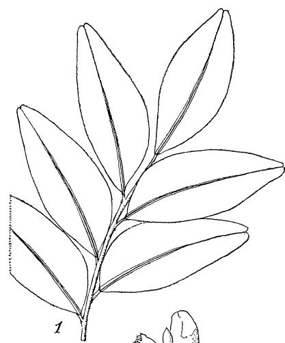

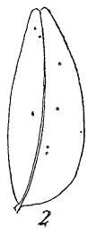

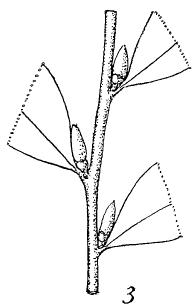

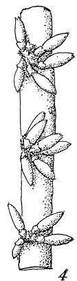

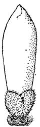

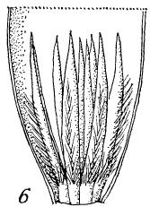

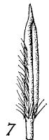

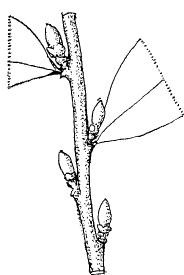  
8

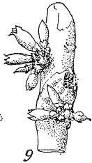

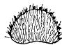

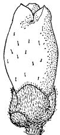

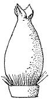

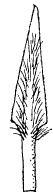

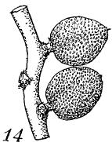

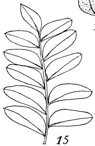

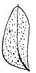

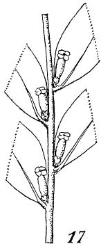

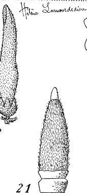

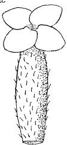  
19

[Figure 10 — see figures.md]

et de 5o cm de diametre á la base ont été signalés,peut-étre par erreur tout au moins quant au diamétre,de méme pour un diametre de 1,25 m signalé au Congo Kinshasa. Port tres caractéristique avec tige verticale et cime conique, souvent tronquée au sommet, formée de petites branches subverticillées et ramifiées dans des plans horizontaux； écorce presque lisse， gris brunätre ou noiratre,ä tranche avec couche noire,extérieurement,et rougeätre intérieurement,s'émiettant finement；bois blanc rosé avec lignes noires longitudinales；jeunes rameaux vert noirätre,finement pubescents， garnis de feuilles distiques.

Feuilles â pétiole finement pubescent de 2-3 mm，a limbe oblique-losangique, de 3-5 X 1,5-2,5 cm,avec marge un peu ondulée,base asymétrique en angle droit et sommet aigu á peine acuminé,plus rarement obtus,a pointe émarginée,parfois avec minuscule touffe de poils； limbe subcoriace，glabre,vert foncé au-dessus,vert mat au-dessous,ä nervure médiane saillante â la face supérieure et ä 3-4 paires de nervures latérales bouclées mais en regle générale totalement indistinctes, parfois fine pubescence sous la nervure médiane；sur échantillons secs, limbe de teinte mate brun foncé,plus päle au-dessous,avec surface supérieure pustuleuse et surface inférieure ridée； 3-4 glandes noires espacées au long de la nervure médiane,ä I-2 mm de celle-ci,de chaque coté.

Inflorescences axillaires ou situées au-dessous des feuilles, formées de fascicules de 1-7 fleurs,subsessiles，garnis á la base de minuscules bractées et bractéoles serrées,concaves et triangulaires,ne dépassant pas I mm，grossierement pubescentes sur le dos et sur la marge,celle-ci souvent glanduleuse.

Fleurs δ ä calice cupuliforme de 1,5 mm,bordé de 3 (-4) dents arrondies atteignant la moitié de la profondeur du calice et finement pubérulent；corolle blanc jaunätre，glabre，tubuleuse,ä sommet obtus dans le bouton puis de 6-7 mm de longueur et ne comportant au sommet que 3 petits lobes deltés de I mm；6- 9étamines insérées á la base de la corolle,á filet de o,5 mm et ä anthere linéraire-lancéolée de 4 mm,de longs poils dressés garnissant le sommet du filet et la base de l'anthére et se retrouvant

# EBENACEE

sur le connectif,cette anthere se terminant en outre par un apicule allongé;pistillode réduit a un petit massif de poils dressés.

Fleurs Ω â périanthe semblable á celui des fleurs mais ä calice plus important atteignant jusqu'a 2 mm de hauteur,plus profondément lobé avec lobes ä marge nettement ciliée,voire glanduleuse； corolle jaunätre teinté de rougeätre，plus renflée, ne dépassant guere 5-6 mm et munie de quelques poils apprimés, cpars et caducs,vers la base des lobes；4-8 staminodes a filet aplati,de o,5 mm,fixé sur la base de la corolle et ä pseudo-anthere pubescente de 2 mm;ovaire ovoide de 2-3 mm de hauteur,entouré â la base d'une collerette de poils dressés et surmonté presque directement de 2 stigmates de I mm de hauteur en languette triangulaire dressée ä marge papilleuse et a bords latéraux recourbés vers 'extérieur; 4 loges.

Fruits rouges puis noirs,ovoides ± allongés,apiculés,atteignant 2,5 × 2 cm，pubescents seulement á la base,a surface un peu verruqueuse,dressés sur le calice fort peu accru ä 3 lobes arrondis cilioles;péricarpe mince；1-4 graines de 15 × 8 × 6 mm environ.

LECTOTYPE de F.WHITE (1956) :Zenker I745,Cameroun (K；iso- BM, BR, P).

Une espéce (Diospyros Feliciana R.Let.et F. White),extré- mement voisine de celle-ci,existe en Guinée ex-frangaise dans des taches de végétation relictuelle (Jacques-Felix,de Kindia et de Benna);la présence de D.Hoyleana F.White n'est réellement reconnue qu'en Nigeria，au Cameroun，en Guinée équatoriale, au Gabon et aux deux Congo,en Angola et en Zambie；elle se cantonne dans les sous-bois de forét dense humide sempervirente ou elle est parfois tres abondante；au Cameroun elle se rencontre ainsi,aussi bien en foret biafréenne qu'en forét congolaise.

Les noms vernaculaires de “ Koadna o ou termes voisins (Kodena, Kuattna, Kotna,..） appliqués au Cameroun en langue yaoundé ä cette espece bien individualisée,et de“ Effré) utilisés par les Pahouins du Gabon,semblent parfaitement valables； des

# R.LETOUZEY & F.WHITE

confusions restent cependant possibles avec D.obliquifolia (Hiern ex Gürke) F.White et sans doute aussi avec D. Vermoesenii De Wild.

# MATERIEL CAMEROUNAIS ETUDIE :

Bates 1794,Bitya sur le Dja (fl.3); 1799,eod.loc. (fl. ).   
Brenan 9288,Banga，South.Rakundu for. res. pres Kumba (εtér.)；9309, eod.loc.(fl.♀,mars) BM,K,FHO;9471,eod.loc.(fl.,mars).   
De Wilde W.2142,5o km S.Badjob soit 6o km SW Eséka (fl.♀,mars) WAG. Endengle SRFCam 2o45,Douala (fr.).   
Fleury 33223 in herb. Chevalier,pres Douala (stér.)；s.n., pres Douala (stér.).   
Leeuwenberg 57oo,pres km 58 route Edéa-Kribi (fl.♀,mai) WAG.   
Letouzey 573，pres Bounyebel,arrondissement d'Eseka (fl.&，févr.)；3678, Eschienbot，2o km E Lomié (stér.)；Io2o9，coline Ongongondjé pres Akonékyé,15 km NW Ambam (fl.♀,mars).   
Mildbraed 499I,entre Yokadouma et Assobam (actuel Mpan) (cit.in MILD-BRAED,Wiss.Ergebn.Zweite Deutsche Zentral-Afr. Exped.2 :61 (1922); 10627,Likomba (cit.in Notizbl.Bot.Gart.Berl.10: 974 (1930).   
Onochie FHI 3o853,South.Bakundu for.res.pres Kumba (fl.&，mars) FHI, K.   
Tiku FHI 418g8,rés.for. Kembong pres Mamfe (stér.) FHI.   
White 8432 et 8565,rés.for.lac Ejaghan pres Mamfe (stér.)FHO.   
Zenker I745 (type de Maba kamerunensis Gürke)，entre Bipindi et la mer (ster.).

# MATERIEL GABONAIS ETUDIE :

Hallé N.3313,Belinga (j.fr.,nov.);3771,eod.loc. (stér.).   
Halle N.et Le Thomas I71,Bélinga (j. fl., juill.).   
Klaine 67,sin. loc. (fl.)；149,sin. loc.(fl.et j.fr.,sept.et oct.)；349,sin. loc.(fl.♀et fr.,juill.et déc.)；358,sin. loc.(fr.)；3o3o et 3o3o bis，pres Libreville (fl.♀,aout).   
Lecomte s. n., Nyanga, Fernan Vaz (stér.).   
Le Testu 84o5, Magoucou, 5o km ENE Mbigou (fl. ♀,oct.).

# 17.Diospyros iturensis (Gürke) R.Let.& F.White

Adansonia9 : 277 (1969).   
Maba iturensis GURkE,Bot. Jahrb.43 : 328 (1909).   
Maba Laurentii DE WiLD., Bull.Jard.Bot.Brux.5 : 64 (1915).   
Maba cytantha PIERRE ex A.CHEv.,Vég.ut.Afr.trop.fr.,Forét et bois du Gabon :233 (1917).   
- Maba ripicola M1LDBR., Notizbl. Bot. Gart. Berl.9:1o46 (1926).   
Maba euosmia MiLDBR.,Notizbl.Bot.Gart.Berl.9 :IO46 (1926)；Maba “ enosmia) MILDBR.sphalm.DE WILD.,Pl.Bequaert.4:6 (1926).   
- Maba Bequaerti DE WLD., Ann. Soc. Sc. Brux. 45 : I92 (1926).   
Diospyros alboflavescens(GüRkE)F.WHITE,Bull.Jard.Bot.Brux.26：241 (1956)，p.p.quoad syn.M.Laurentii DE WiLD.，M. Bequaerti DEWILD.,D.insculpta HUTCH.et DALz.- F.WHITE,FWTA ed. 2,2：14(1963)；Nigerian Trees 2:342 (1964).  
Diospyros insculpta auct.non HAMILr.(1827) :HuTcH.et DALz.,FWTA ed.1,2:4 (1931);Kew Bull.:54 (1937).

Des échantillons de cete espece figurent en divers herbiers sous les noms suivants :Diospyros Autraniana (PIERRE ms.)，Maba Autraniana (PIERRE ms.).

PL.12,1-13, P. 95,et CARTE 34，p. 175.

Cette espéce, largement représentée en Afrique centrale, offre des variations qui affectent le port de la plante,la forme des limbes,l'aspect du calice, la pubescence des étamines, la pubescence de l'ovaire,la forme du fruit，peut-étre l'écologie. Des observations in situ et un regroupement de nouveaux maté- riaux permettront sans doute de préciser certains points mal connus concernant cette espece et d'envisager des subdivisions de celles-ci.

Arbuste de quelques metres de hauteur ou petit arbre ne depassant pas 2o m de hauteur mais pouvant atteindre 3o-5o cm de diametre;tres souvent plusieurs tiges des le sol, ou fut irregulier,cannelé, bosselé,avec des branches ascendantes puis courbées vers I'extérieur en extrémité,formant une cime densément bui-

sonnante; rhytidome noir,avec de nombreuses fissures verticales superficielles；tranche de l'écorce orangé sale ä brun rougeatre intérieurement,sous le cerne noir du rhytidome; cambium jaune; aubier blanc rosé；bois de coeur noir,parfois creux au centre; rameaux glabres,lisses,ä écorce grisätre ou brunatre sur échantillons secs；tres jeunes rameaux parfois finement pubérulents semble-t-il.

Feuilles a pétiole glabre,canaliculé,de 5-1o mm de longueur; limbe largement ovale-lancéolé ou, le plus souvent elliptique ou lancéolé-elliptique et quelquefois un peu falciforme,parfois tres oblong-elliptique,atteignant(1o-） 21 × (3-）9（-11） cm，a base cunéiforme aigué ou obtuse,ä sommet acuminé avec acumen pouvant atteindre jusqu'â 2o X 5 mm,la pointe elle-méme étant arrondie；limbe coriace,glabre，garni de (4-） 5-8 (-9) paires de nervures latérales anastomosées en boucles assez loin de la marge, profondement imprimées au-dessus et proéminentes au-dessous, comme la nervure médiane mais parfois fort peu distinctes, les nervilles formant un réseau lache extrémement peu proéminent (voire invisible)a la face inférieure；sur échantillons secs teinte fauve olivacée ä brun rougeatre ;assez nombreuses glandes dispersées sous tout le limbe,entourées chacune de fines stries rayonnantes sur échantillons secs.

Inflorescences  formées de I-1o fleurs subsessiles avec bractées et bractéoles imbriquees et pubescentes， disposées en cymes contractées ä l'aisselle des feuilles et au-dessous sur les rameaux ägés. Fleurs &，blanches et parfumées，avec bouton floral peu élevé,arrondi puis légerement pointu au sommet; calice cupuliforme,voire subpatelliforme,de 2-3 mm de hauteur,glabre ou tres éparsement garni de poils appliqués,a marge tronquée garnie de 3 minuscules denticulations， parfois obscurément ciliolé，parfois un peu déchiré et paraissant alors lobé；corolle tubuleuse, campanulée a 'épanouissement，épaisse，atteignant 8-10 mm de hauteur,avec 3 lobes deltés subobtus ne dépassant guere 2-3 mm，souvent garnis extérieurement de quelques poils apprimés；(6-)9 (-12）étamines insérées sur le réceptacle,ä filet ne dépassant guére o,5 mm,á anthére de pres de 3 mm,relative-

[Figure 11 — see figures.md]

# R.LETOUZEY & F.WHITE

ment lancéolée,ä pointe courte et obtuse,pubérulente,au moins sur le connectif; pas de pistillode.

Inflorescences Ω semblables aux inflorescences  mais moins garnies de fleurs ♀；celles-ci semblables,bien qu'un peu plus grandes,aux fleurs δ；calice un peu accrescent；6 staminodes insérés pour 3 d'entre eux äla base de la corolle et pour les 3 autres autour de l'ovaire,ä pseudofilet de I mm et ä pseudoanthére lancéolée de 1,5 mm，finement pubérulente sur le dos；ovaire largement ovoide,de 2-3 mm de hauteur,glabre,pubescent vers le sommet ou entierement pubescent,ä (5-）6 loges,surmonté directement de 3 stigmates foliacés,oblongs，de 1,5-2 mm，a marge densément crénelée et ondulee.

Fruits, jaunes ou orangés,puis rouges semble-t-il, puis noirs, soit subglobuleux et un peu déprimés au sommet (avec section transversale ± hexagonale sur échantillons secs)，soit un peu ovoides,d'environ 2,5 cm，glabres,a surface finement granuléeverruqueuse sur échantillons secs；a la base calice un peu accru de I cm de diamétre, irrégulierement lobé;(5-) 6 graines,de 2 X I cm environ.

TyPE :Mildbraed 3o76,Congo Kinshasa.

Cette espece est connue en Nigeria,au Cameroun,au Gabon, aux deux Congo，en République Centrafricaine et en Angola (Lunda).Elle affectionne assez souvent semble-t-il le bord des cours d'eau mais parait se retrouver aussi communément en sous-bois de forét de terre ferme.

# MATERIEL CAMEROUNAIS ETUDIE：

De Wilde W.2161,bord du Nyong,5o km S Badjob soit 6o km SW Es éka (fl.,mars);27o6,bord du Nyong,65 km SSW Eséka (fr.,juin)；3825, 6o km SSW Eséka (fr.,nov.),omn.WAG.   
Endengle SRFCam 2O44， pres Douala (fl.δ).   
Fleury 33352 in herb.Chevalier,pres Douala (fl., juin).   
Leeuwenberg 536g,bord de 'Ouem pres de l'embouchure de la Sanaga, 5 km SW Masok (fl.δ,avr.); 5584,bord du Nyong,3o km S Edéa (fl.δ, avr.);6332,25 km NE Douala (fr.,aout),omn.WAG.

# EBENACEE

Letouzey 5i68,Io km NE Bangé (km 75 route Yokadouma - Moloundou) (fl.，mai)；9342,colline Nkolo Nanga,2o km SE Kribi (stér.)； I0073, bordure riviere Mboua pres Minkoumou,4o km SE Mvangan,Ebolowa (stér.)；1oo88,bordure du Kom,25 km E confluent Ntem-Kom (fr.,mars); 10214,coline Ongongondjé pres Akonekyé,15 km NW Ambam (j.fl., mars); 10286,colline de Zingui,2o km WSW Ebolowa (fl.,avr.)；1o338,colline Nkolémengong a 'W d'Ebianéméyong pres Nyabessan (fl. ,avr.).   
Mildbraed 5i62，(type de Maba euosmia Mildbr.)，Lomié (fl.δ,mai) HBG. Smith 3,Badshu Ahaghe pres Mamfe (stér.) FHO.   
White 8568,res.for.lac Ejaghan pres Mamfe (stér.).

# MATERIEL GABONAIS ETUDIE :

Autran 96 in herb.Heckel,Libreville (fr.).   
Hallé N. 1641, Io km SW Ndjolé, forét ripicole pres de POgoué (fl.,avr.); 4126,Bélinga Mines de fer (j.fr., juin).   
Hallé N.et Le Thomas I57,Belinga Mines de fer (fr., juill.).   
Klaine 172,Libreville (fl.δ,oct.)；375 (et 376 sphalm.) (syntype de Maba cytantha Pierre ex A. Chev.),Libreville (fr., févr.);5o4 (syntype de Maba cytantha Pierre ex A. Chev.)，Libreville (fl. ♀，sept.)； 727，sin. loc. (fr., févr.).   
Le Testu 5o67,Guidouma,5o km NW Mouila (fl.δ,nov.);7578,Lastoursville (fl.,oct.)； 75go,Lastoursville (fl. ♀,oct.);8515,Lastoursville (fl.,nov.).   
Normand s.n.,rés.for.de Zelé pres Lambaréné (stér.).   
Soyaux 226, Sibange farm (fr., févr.).

# 18.Diospyros kamerunensis Gürke

Bot.Jahrb.26:69 (1898),et 43:207,tab.3,M-O et 208 (1909).-F.WHITE, FWTA ed. 2,2:1I (1963).   
- Diospyros pallescens A. CHEv.， Explor. bot. Afr. occ. fr. : 397 (1920), nom.nud.   
- Diospyros sph&rocarpa PIERRE ex DE WILD., Pl. Bequaert. 3 : 553 (1926) syn. nov.

Des échantillons de cette espece figurent en divers herbiers sous le nom suivant :Diospyros megacarpa (GüRkE ms.) (cf. DE WILD., Pl.Bequaert.

3:548 (1926) ou D.magnacarpa (GURkE ms.) (cf.MILDBRAED, Notizbl. Bot. Gart.Berl.9:1056 (1926).

# R．LETOUZEY & F.WHITE

Arbuste á tige verticale ne dépassant guere Io (-2o) m de hauteur; écorce rugueuse; bois rose; jeunes rameaux couverts d'une pubescence veloutée de teinte roux doré puis rameaux glabres，lisses,brunatres mais souvent marbrés de verdatre et de grisatre.

Feuilles á pétiole de 1-2 cm, pubescent, ridé et plissé sur le sec； limbe lanceolé,ovale ± oblong ou elliptique,atteignant 15-20 (acumen non compris) X 5-9 cm, a base obtuse rétrécie sur le pétiole, a sommet graduellement acuminé en pointe assez longue (25 X Io mm) et tres fine en extrémité;nervure médiane un peu déprimée au-dessus, tres saillante au-dessous ainsi que les 4-6 (-8) paires de nervures latérales ascendantes, peu arquées,bouclees en extrémité； nervures tertiaires bien visibles mais nervilles peu distinctes；limbe papyracé ou subcoriace,couvert sur les 2 faces chez les tres jeunes feuilles d'une fine et dense pubescence couehée de teinte roux doré,puis limbe devenant glabre,d'abord et rapidement sur la face supérieure verte, puis sur la face infé- rieure grisatre, celle-ci étant couverte d'une tres fine poudre blanchätre minéralisée； quelques petites glandes circulaires déprimées,noires,éparses sous le limbe;marge du limbe sur échantillons secs souvent recourbée mais festonnee au-dessous.

Inflorescences  axillaires,formées de 3-6 (-2o) fleurs avec bractées et bractéoles étroitement lancéolées,voire subulées，de 2-3 mm，pubescentes；pédicelle de 2-3 mm de longueur, pubescents.Calice de 8 mm de hauteur,extérieurement couvert aussi d'une fine et dense pubescence de teinte roux doré,intérieurement d'une pubescence semblable apprimée， comportant 4 lobes étroitement triangulaires de 6 × 1-2 mm;bouton floral aigu; corolle blanche ou jaunatre, hypocrateriforme, de 18-2o mm, épaisse et coriace,encore pubescente extérieurement comme le calice,au moins longitudinalement sur le milieu des lobes,á tube d'environ 8 mm,élancé, resserré a la gorge et surmonté également de 4 lobes,ceux-ci lancéolés,aigus,de 1o-12 × 4-5 mm；12 étamines insérées sur le réceptacle,de 6 mm,avec filet ne dépassant guere o,5 mm et anthére linéaire,longuement pointue，garnie vers la base de longs poils dressés；pistillode absent.

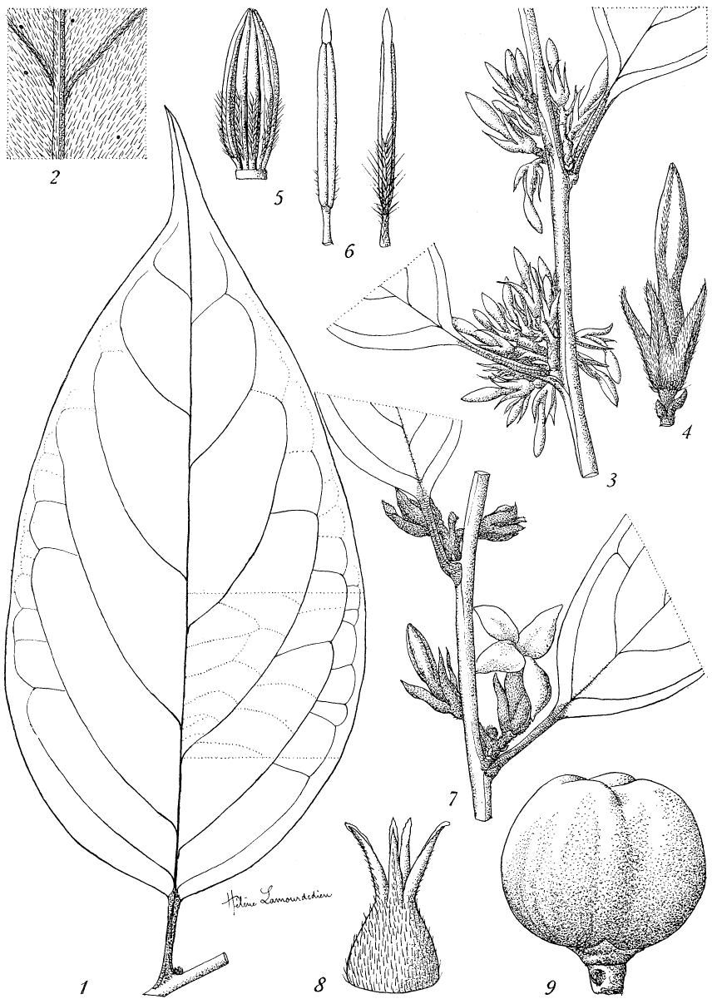  
P1.43.-- Diospyros kamerunensis Gurke :1,feuille X 2/3；2,fragment de feuille (faceinf.）×2；3,inflorescences×1;4,fleur×2;5,androcee×4;6,etamine X6；7,inflorescences×1；8,gynecee×4;9,fruitX2/3.（1-2:Letouzey9402； 46et7-8:Zenker 2269 et1806;9:Klaine712).

# R.LETOUZEY & F.WHITE

Inflorescences Ω axillaires, formées de fleurs solitaires ou de quelques unes,avec bractées et bractéoles comme pour 'inflorescence  et pédicelles semblables mais plus courts et articulées au sommet.Fleurs ♀assez analogue a la fleur  mais plus large avec calice,á peine accrescent,de 8 mm de hauteur,a 4 lobes lancéolés,aigus,de 6 mm,et corolle ä tube de 1 cm,á 4 (-5) lobes lancéolés,de 1 cm,aigus;8-12 staminodes fixés sur la base du tube, semblables aux étamines mais plus greles,de 5 mm de longueur; ovaire ovoide,de 4-5 mm de hauteur,couvert d'une dense pubescence soyeuse dressée, creusé de 8 (-1o) loges et surmonté presque directement de 4 (-5) styles dressés obliquement,de 1-2 mm, avec quelques poils sur leur face externe, la face interne stigmatifere étant allongée-lanceolee et papilleuse.

Fruits, portés sur un robuste pedicelle, articulé au sommet, de 5 mm de longueur,subglobuleux déprimés,de 4 cm de hauteur et 5 cm de diametre, rouge orangé a maturité, glabres ou encore parfois couverts ca et la de poils apprimes tres caducs,garnis de 8 (-10) graines de ± 3o × 18 X 12 mm.(Nota : I semble qu'en Afrique occidentale,le fruit soit en général ellipsoide,plus haut que large,atteignant 4 × 3,5 cm，et toujours ± apiculé； les feuilles paraissent aussi，en général, de plus petite taille. Ces caracteres ne paraissent devoir justifier la distinction de deux taxa spécifiques; au plus pourrait-on séparer une sous-espece).

TyPE : Zenker 945, Cameroun (iso- 945 b, P).

Cette espéce est connue au Liberia,en Cote d'Ivoire et au Ghana,puis ne se retrouve que dans les foréts littorales du Cameroun (Kribi-Eséka) et du Gabon (Libreville).

MATERIEL CAMEROUNAIS ETUDIE ：

Leeuwenberg 528o,Io km W Masok (fl.δ,mars) WAG.

Letouzey 9402,3o km ESE Kribi au N de Ia riviere Kienké (stér.)； 10327,

Nkolemenlong, colline W Ebianéméyong pres Nyabessan (ster.).

Mbarga 38 (= SRFCam 2022),route de Ngongos pres Eséka (j.fl., juin).

# EBENACEE

Zenker 74 (?),Bipindi (?) (fl.δ) B;945 b (type :945 a + b),Bipindi (fl.δ, mai)；18o6,eod. loc.(fl.♀,mai)；1862,Mimfia pres Bipindi (j.fr., juil.); 2269,Njebo pres Bipindi (fl.δ,mars)；2483 a et 2814,Bipindi (cit.in Bot. Jahrb.43：208 (1909)；3o6g，Mamiaca pres Bipindi (fl.，mai)；3483, Mimfia pres Bipindi (fl. &，oct.)；3563，Makao pres Bipindi (fr.，nov.) (cit.in eod.op.)；s.n.,Bipindi (fl.δ).

# MATEnIEL GADONAIЗ ETUDIE :

Klaine I27,Libreville (fl. ，sept.)；399 (type de D. spherocarpa Pierre ex De Wild.)et 7I2，mont Bouet pres Libreville (fr.，févr. et déc.)；1314, presLibreville (fr.?)；1392,Libreville (fll.et fr.in carpoth.P,févr.)；1652 et 1971,Libreville (stér.)；3248,Libreville (fll.et fr.in carpoth.P,févr.); s.n.,eod.loc.(j.fl.) *.   
Morel 143 SRF, Moum pres Libreville (j. fr., déc.).

# 19.Diospyros longiflora R. Let.& F. White

Adansonia 9 : 279 (1969).

PL.14,p. 103,et CARTE 29,p.170.

Cette espéce n'est á ce jour connue que par un échantillon camerounais avec fleurs  et par un échantillon gabonais stérile; les renseignements sur cette plante,in situ, font encore defaut et manquent de méme fleurs ♀ et fruits.

Arbuste atteignant 7 m de hauteur et 25 cm de diamétre a la base;rhytidome brun foncé a noiratre. Tres jeunes rameaux garnis de poils épars,obliques，± longs，que I'on retrouve sur

les pétioles, sous les nervures et cä et la sur la marge des jeunes feuilles， puis organes glabres； remification pseudosympodiale avec( console ) á la base des pétioles.

Feuilles a pétiole de I cm; limbe lancéolé ä oblong-lancéolé, atteignant jusqu'a 38 × 12 cm, a base obtuse ou arrondie,ä marge cartilagineuse,a sommet aigu fort peu acuminé ；nervure médiane imprimée a la face supérieure du limbe；± 5 paires de nervures latérales, tres ascendantes et largement courbées,réunies par des nervures tertiaires presque perpendiculaires á la nervure médiane；nervilles formant un réseau lache,peu visible ä l'eil nu; limbe coriace,vert foncé au-dessus et vert glauque au-dessous sur échantillons frais,vert brunätre au-dessus et vert blanchatre au-dessous,au moins pour les jeunes feuilles,sur échantillons secs； surface inférieure du limbe couverte d'un revétement épidermique minéralisé finement granuleux; quelques fines glandes déprimées surtout groupées ä l'aisselle des nervures latérales et dispersées ca et la au long de la nervure médiane.

Inflorescences δ en cymes pseudofasciculées, soit axillaires et de quelques fleurs,soit sur les rameaux agés et comportant alors jusqu'a ± Io fleurs；á la base des cymes petites bractées et bractéoles ovales-lancéolées pubescentes au moins vers la marge;pédicelles de 3-5 mm,pubescents et articulés au sommet; calice cupuliforme de 4 mm de hauteur,avec poils couchés épars, de méme intérieurement et surtout sur la marge,celle-ci étant tronquee et garnie de 4-5 tres larges dents surbaissées,mais souvent calice déchiré irrégulierement；corolle jaunätre,renflée ä la base et tres efflée au-dessus dans le bouton floral, avec quelques poils épars apprimés,formée de 4-5 lobes étroitement lancéolés,attei-gnant presque l'extréme base de la corolle, de 2,5 cm de hauteur, remarquablement épais ä la base ou,extérieurement, la préfloraison apparait comme valvaire alors qu'elle est convolutée intérieurement et dans le haut du bouton floral; I2-15 étamines insérées sur le réceptacle,â anthéres subsessiles,linéaires,de 5 mm de hauteur, strigilleuses, terminées par une courte pointe aigué cachée par les soies dressées；pas de pistillode.

Inflorescences Ω, fleurs 早 et fruits inconnus.

[Figure 12 — see figures.md]

# R．LETOUZEY & F.WHITE

TYPE : De Wilde W. 1735, Cameroun (holo-WAG).

Cette espéce n'est connue qu’au Cameroun (région d'Eséka) et qu'au Gabon (monts de Cristal).

MATERIEL CAMEROUNAIS ETUDIE：

De Wilde W.1735 (type)，5o km S Badjob,au SW d'Escka,au bord du Nyong pres du grand pont (fl.δ, janv.).

MATERIEL GABONAIS ETUDIE :

Normand s.n.,monts de Cristal, pres Mela (stér.).

# 20.Diospyros Mannii Hiern

Monogr. Eben., Trans.Camb.Phil.Soc.12 ：255 (1873)；FTA 3：524(1877).—F.WHITE,FWTA ed.2,2：II,tab.202 A，2 (1963)；NigerianTrees 2:335 (1964).  
-Diospyros aggregata GURkE,Bot.Jahrb.43: 2O4 (1909).   
-Diospyros Talbotii WERNHAM,Cat.Pl. Talbot Nigeria :57 (1913).   
-Diospyros pseudaggregata MiLDBR.， Notizbl. Bot. Gart. Berl. 9 ：1047(1926).  
Diospyros ivorensis AUBREv.et PELLEGR.,Bull. Soc.Bot.France 83： 621 (1937).

Arbre atteignant parfois pres de 3o-35 m de hauteur,â fut élancé de 2o m et plus,cannelé sur 3 m de hauteur et â section étoilée (2o-4o cm)，ä la base,chez les vieux arbres,ä branches souvent un peu pendantes au moins en extrémité；jeunes tiges verticales ä branchettes verticillées subhorizontales. Rhytidome brun rougeätre ± fendillé longitudinalement,se détachant par petites écailles,fréquemment marbré de plaques de lichens verdatres et grisätres ± foncées；écorce á tranche noire vers

[Figure 13 — see figures.md]

I'extérieur, jaune vif vers l'intérieur;aubier jaune citron, bois de coeur noir au centre. Jeunes rameaux hirsutes,couverts de longs poils roux ou jaunatres mais parfois pubescence ± apprimée et plus courte; rameaux adultes glabres,noiratres.(Nota : En Afrique occidentale, le second type de pubescence est plus fréquent que le premier,mais ce caractere ne parait devoir justifier la distinction de deux taxa spécifiques; au plus pourrait-on séparer une sous-espece).

Feuilles á pétiole, hirsute ou pubescent puis glabrescent, de 6-8 mm de longueur, a limbe elliptique, plus rarement lancéolé- elliptique,atteignant 1o-12 (-2o) × 3-5 (-7) cm (des échantillons de Nigeria mesurent jusqu'a 28 × 1o cm),ä base en coin obtus, a sommet aigu souvent muni d'un acumen assez long (1-2 cm); nervure médiane,imprimée au-dessus,hirsute ou pubescente puis glabrescente,comme les rameaux，au-dessous； de méme les 6-8 paires de nervures latérales tres ascendantes,les 2-3 paires inférieures rapprochées et paraissant ± flabellees ； nervures tertiaires subparalleles； limbe subcoriace,vert brillant á la face supérieure,grisatre á la face inférieure,celle-ci éparsement hirsute puis glabrescente entre les nervures； le limbe prend au séchage une teinte brun rougeatre foncé au-dessus et une teinte rose ou blanc grisatre au-dessous,cette face inférieure présentant un revétement épidermique minéralisé pulvérulent；quelques glandes deprimées,au voisinage de la nervure médiane, particulierement vors l'aisselle des nervures latérales et souvent situées sur des nervures tertiaires ou des nervilles.

Inflorescences  en cymes compactes, comportant jusqu'a 20- 3o fleurs,axillaires ou sur les rameaux dénudés au-dessous des feuilles,avec pédicelles de 1-2 mm,articulés au sommet,pubescents；bractées et bractéoles largement ovales,pubescentes. Calice campanuliforme de I cm de hauteur,rétréci á la base, densément garni extérieurement et interieurement d'un feutrage de poils hirsutes roux ou jaunatres puis brun noiratre,divisé presque jusqu'a la base en 5-7 lobes triangulaires；corolle blanche ou blanc rosé,brunissant tres vite pendant l'anthese,infundibuliforme, de 18 mm de hauteur,charnue,glabre sauf pour une

bande de poils au milieu des pétales,avec tube de 5 mm largement ouvert au sommet,surmonté de 5-6 grands lobes oblongs-lancéoles a sommet obtus； 15-18 étamines,visibles de I'extérieur, inégales, de 8 mm au maximum,ä tres court filet fixé en bas,au milieu ou en haut du tube de la corolle et portant une anthére linéaire densément strigueuse comme les filets; pistillode formé d'une touffe de quelques soies dressées.

Inflorescences ♀ en cymes laches de 2-3 fleurs, sur les vieux rameaux et les branches,á axes robustes,de I-2 cm，hirsutes ou pubescents, garnis á la base de bractées largement ovales, pubescentes extérieurement；pédicelles，de 1 cm，également robustes,articulés et élargis en disque au sommet. Fleurs ♀ assez semblables aux fleurs  mais un peu plus grandes,avec calice un peu accrescent de 1o-12 mm et corolle de 2o-24 mm;6-12-18 staminodes linéaires,de 4 mm, strigueux ; ovaire largement conique, de 4 mm de hauteur, densément couvert de soies dressées atteignant 3 mm de longueur,rousses ou jaunätres,facilement détachables, creusé de 1o (-12?) loges et surmonté directement de 5 stigmates dressés，tres visibles de l'extérieur,lancéolés,de 6-8 mm de hauteur,rigides,densément soyeux sur le dos,a surface interne sinueuse et glabre.

Fruits portés sur de robustes pédicelles de 1-2 (-3) cm, subglobuleux-turbinés，d'environ 5 (-9?) × 4,5 (-8?) cm，orangés, d'abord densément couverts de soies rousses irritantes,caduques, puis alors glabres,entourés ä la base par le calice accru atteignant 3 (-6?)cm de diamétre,lobé-étoilé jusqu'au milieu,et surmontés de la base du style; Io graines (qui atteindraient jusqu'a 5 × 3 X 1,5 cm environ).

TYPE: Mann 924,Gabon (iso- P).

Cette espéce se trouve en Afrique occidentale,de la Sierra Leone ä la Nigeria,ainsi qu'au Cameroun,au Gabon,en République Centrafricaine,aux deux Congo et au Cabinda. Elle fréquente les foréts denses humides,soit de type sempervirent, soit de type semi-décidu;clle a ainsi été rencontrée au Cameroun aussi

# R.LETOUZEY & F.WHITE

bien dans la région de Kribi,d'Ambam et d'Edéa que dans celle de Nkongsamba,que dans celles de Deng Deng et de Yokadouma, et au Gabon aussi bien pres de Makokou que dans la haute Ngounyé (échantillon Le Testu 544I de Toungou Toumbidi,actuellement au Congo Brazzaville) ou pres de Bitam.

# MATERIEL CAMEROUNAIS ETUDIE :

Breteler I972,Yaoundé (fr.,oct.） WAG.  
De Wilde W. 27o8,65 km SSW Eséka,pres du Nyong (j. fr., juin) WAG.   
Letouzey 5o67,2o km S Mboy I (45 km E Yokadouma) (v.fl.♀,mai)；10168, colline Nkondo pres Enyantoum, 2o km SW Ambam (stér.).   
Mildbraed 4938,Yokadouma (fl.，avr.）HBG;? 8328,Deng Deng，pres confluent Lom-Djérem (fl.♀,févr.) (cit.in Notizbl.Bot.Gart.Berl.9 ： 1047 (1926.)   
Mpom 255 (= SRFCam 2o26)，Melong pres Nkongsamba (fl. ♀,févr.) YA.   
Zenker 533,Mimfia pres Bipindi (fl.，févr.I914) P,B；3439 (type de D. aggregata Gürke),eod loc.(fl.,mai).

# MATERIEL GABONAIS ETUDIE：

Hallé N.et Le Thomas I88,Makokou (j. fr.).   
Le Testu 9045,Dwan,25 km NNE Bitam (fl.,mars)； 928o,Oyem (fl. ♀, j. fr.,sept.).   
Mann 924 (type),“ Gaboon river) (fl.δ, juill.),iso-P.

# 24.Diospyros melocarpa F. White

Bull.Jard.Bot.Brux.33:347,tab.19,J-O (1963)；FWTA ed. 2,2 ：14(1963);Nigerian Trees 2 : 34o (1964).  
Des échantillons de cette espece figurent en divers herbiers sous le nom suivant:Maba melocarpa (Louis ms.).

# PL. 26,12-20,p. 159,et CARTE 31, p. 172.

Petit arbre atteignant 15 (-3o) m de hauteur et 3o cm de diamétre,ä fut vertical,un peu cannelé ä la base；petite cime,

rameaux noiratres； rhytidome noir grisätre, s'exfoliant en de multiples petites écailles papyracées;écorce cassante ä tranche oblique verte puis noire extérieurement,orangé rosé á brune intérieurement sans cambium jaune habituel développé；bois rosé,dur,de plus en plus brunätre vers le centre avec des fentes bordées de noir.

Feuilles â pétiole atteignant 8 mm de longueur,canaliculé au-dessus； limbe largement ovale-elliptique a lanceolé-elliptique, mesurant jusqu'a 9 (acumen non compris) × 5,5 cm，a base cunéiforme ou arrondie,ä sommet caudé-acuminé； acumen étroit atteignant 15 mm de longueur,a bords paralleles,a pointe arrondie voire un peu spatulée ; nervure médiane un peu imprimée au-dessus； 3-5 paires de nervures latérales ascendantes, se réunissant en boucles peu distinctes et nervilles invisibles ; limbe glabre, garni de glandes noires éparses sur la face inférieure, souvent brun rougeätre foncé mat au-dessus,plus päle et un peu (ruminé ) au-dessous sur échantillons secs.

Inflorescences  subsessiles axillaires, ou au-dessousdes feuilles, parfois sur le vieux bois,groupant de 1-2o fleurs ä pédicelles de 1-2 mm. Calice glabre,cyathiforme,de 2,5 mm,â marge entiere ou un peu denticulee et un peu ciliolée；corolle jaunätre, coriace,conique et obtuse au sommet dans le bouton floral, glabre, tubuleuse,de 8 mm de hauteur,avec 3 lobes deltés de 1 mm; environ I2 étamines,insérées sur le réceptacle,á filet de I mm de longueur,strigueux,et á anthere de 4 mm,étroitement lancéolée,longuement (1 mm) apiculée,densément strigueuse,au moins sur la moitié inférieure du connectif； pistillode rudimentaire de o,5 mm, glabre.

# Inflorescences et fleurs  inconnues.

Fruits tres briévement pédicellés,ä pédicelle épais de 6 mm de longueur, subglobuleux， d'environ 3,2 × 3,5 cm, jaunes (puis rouges?)，glabres,renfermant 5-6 graines,et entourés á la base du calice un peu accru mais irrégulierement 3-4-lobé. Graine de 26 × 15 × I2 mm,brun foncé,transversalement rugueuse,garnie d'un albumen légerement ruminé.

# R.LETOUZEY & F.WHITE

TYPE : Gilbert Dir.for.2oo,Congo Kinshasa (BR;iso- BM, K, MO,P).

Cette espéce est connue en Nigeria,au Cameroun,ä Fernando Po,au Gabon et aux deux Congo;elle se rencontre dans les foréts dense humides sempervirentes et n'est connue au Cameroun que dans les régions de Mamfe, Douala et Kribi,au Gabon que dans la région de Lastoursville.

# MATERIEL CAMEROUNAIS ETUDIE ：

Dupasquier 33277 in herb. Chevalier, pres Ndo dans le Mungo (ster.).   
Fleury 33278,33279 et 33364 in herb.Chevalier,pres Douala (stér.);33408 id., entre Ndo et Mujuka dans le Mungo,km 59 CFNord (stér.).   
Letouzey 9359,colline Ngwon,4o km E Kribi (stér.); 9466,colline Nkolakaye pres Mbanga,km 81 route Kribi-Ebolowa pres Akom II (ster.)； 10367, colline Nkolebanga au NW d'Ebianéméyong pres Nyabessan (ster.).   
Tiku FHI 418g5,Kembong for.res. pres Mamfe (fr., déc.) (cit.in FWTA ed.2, 2 : 14 (1963).   
White 8561 et 8615,rés.for.lac Ejaghan pres Mamfe (stér.) FHO.   
Zenker 3865,Bipindi (j.fr.) (cit.in Bull. Jard.Bot.Brux.33:348 (1963).

MATERIEL GABONAIS ETUDIE:

Le Testu 8242, Mavanga, 95 km SW Lastoursville (fl.,aout).

# 22.Diospyros mespiliformis Hochst. ex A. DC.

Prodr.8:672 (1844).— HiERN,Monogr.Eben.,Trans.Camb.Phil. Soc。12:165(1873)；FTA3:518(1877).-GURKE,Bot.Jahrb.43:200,tab.I(1909).- AUBREvILLE，Fl. for. Soudano-Guinéenne ： 422，tab. 92，1-3(1950).— F.WHiTE，Systematics Association Publication 4 ：88-96,tab.8,10,II (1962);FWTA ed.2,2:12,tab.203 (1963)；Nigerian Trees 2 :331(1964).  
-Diospyros senegalensis PERR.ex A. DC.,Prodr.8:234 (1844).   
—Diospyros bicolor KLoTzscH in PETERs,Reise nach Mossamb.1:184 (1862).   
-Diospyros Holtzii GURkE,Bot.Jahrb.46:156 (19II),syn. nov.   
-Diospyros sabiensis HIERN，Journ. Linn. Soc.Bot. 40：134 (1911).- F.WHITE,For.fl.North.Rhodesia :323 (1962).

# EBENACEE

Des échantillons de cette espéce figurent en divers herbiers sous le nom suivant:Diospyros Ibo (GURkE ms.).

Arbre atteignant 3o m de hauteur et 7o cm de diametre, ä tronc droit, parfois cannelé ä la base,ä cime globuleuse ou ± en parapluie chez les arbres äges,á branches tres ramifiées，ä feuillage assez dense.Rhytidome brun foncé ou noiratre,plissé longitudinalement et se découpant en plaquettes carrées ； tranche de l'écorce noire vers l'extérieur, rose vers l'intérieur;aubier brun rosé́ päle； bois de coeur souvent presque noir ou pour le moins veiné de noir (Nota : L'ébene du Sénégal est fourni par Dalbergia melanoxylon Guill. et Perr. de la famille des Papilionacées).Rameaux recouverts d'une mince écorce grise masquant une couche brun rouge vif;； bourgeons allongés efles soyeux.

Feuilles á pétiole court atteignant au maximum 8-1o mm de longueur,a limbe elliptique-allongé ou elliptique-oblancéolé, mesurant jusqu'a 16 × 6 cm mais plus généralement ± 8 × 3 cm, base assez largement cunéiforme, a marge souvent un peu ondulée, ä sommet aigu ou légerement acuminé,la pointe elle-méme étant arrondie,parfois tronquée ou méme un peu échancrée；± 20 paires de nervures latérales obliques (45o), fort peu visibles et qui forment avec les nervilles un réseau serré légerement proeminent sur les 2 faces; tres souvent quelques petites glandes noires arrondies, de part et d'autre mais a I'écart de la nervure médiane, vers le milieu du limbe sur sa face inférieure ; limbe un peu coriace, gris vert mat au-dessus， vert jaunatre au-dessous, avec trace de poils apprimes a la face inférieure chez les vieilles feuilles, prenant une teinte rubescente au séchage.

Inflorescences  en cymes axillaires, distinctement pedonculees (5-8 mm),assez laches,groupant de 3-9 fleurs et plus avec pédicelle pubescent de 1-3 mm,articulé au sommet et garni de 1-2 bractéoles lancéolées. Calice campanulé de 3-4 mm de hauteur, densément, finement et brievement soyeux sur les 2 faces,avec 4-5 courts lobes triangulaires;corolle de 7 mm de hauteur environ,

densément soyeuse extérieurement,tubuleuse-renflée avec tube de 4 mm et 4-5 lobes de 3 mm,aigus,charnus,cette corolle étant ovoide-conique dans le bouton floral； Io-16 étamines, souvent par paires,insérées sur le réceptacle,a courts filets n'atteignant pas I mm et ä anthere de 3 mm avec quelques poils sur Ie connectif; pistillode rudimentaire pubescent,ou absent.

Inflorescences Qaxillaires formées de fleurs solitaires, rarement 2-3 ensemble,ä pédicelle pubescent de 5 mm de longueur,ces fleurs ♀,rarement triméres,étant semblables aux fleurs  mais beaucoup plus grandes,avec calice de I cm,un peu accrescent,dont les lobes cordiformes， tres profonds,ont une marge ondulée avec 2 ailes arrondies et un épaississement charnu et soyeux intérieurement,ä la base,au centre；6-12 staminodes de 4 mm, glabres,insérés a la base du tube de la corolle；ovaire ovoideconique，soyeux,creusé de 4 (-6) loges et surmonté de styles courts,soudés,avec 2 stigmates bilobés,dressés,de I mm.

Fruits subglobuleux,apiculés,de 2,5-3 cm de diametre, jaunes， un peu verruqueux, d'abord densément pubescents puis presque glabres,entourés a la base par le calice un peu accru,de I-1,2 cm de hauteur,couvert d'une pubérulence fauve, en forme de cupule étoilee avec 4-5 lobes ovales-triangulaires de 5-6 mm de hauteur, ä marge ondulée, ou au moins avec une large ondulation dans le tiers inférieur；4-6 graines de ± 15 mm de longueur,dans une pulpe sucrée comestible.

SYNTYPEs : Schimper 655 et I243,Abyssinie (iso- P).

Cette espéce est largement répandue du Sénégal ä la mer Rouge et en Arabie;vers le Sud elle atteint le Sud-Ouest africain et le Transval; dans toute cette aire elle existe seulement en dehors des zones de forét dense humide et est ainsi absente du bassin congolais,bien que se rencontrant en certaines régions de lOuest africain sur la bordure septentrionale des massifs forestiers; préférant les zones climatiques seches,elle croit aussi bien dans les galeries forestieres humides que dans les forets séches et savanes boisées, sur les inselbergs rocheux qu'au long des rivieres;elle ne

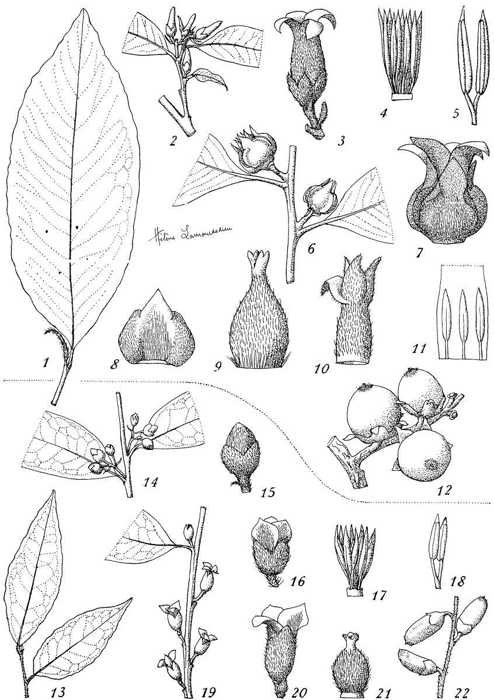  
P1.46.-Diospyros mespiliformis Hochst.ex A.DC.:1,feuille (face inf.) × 2/3; 2,inflor.δ×1;3,fl.×2;4,andr.×4;5,et.×6;6,inflor.×1；7et8, fl.et sepale(face int.）×2;9,gyn.×4；10,corolle (fl.）×2；1I,staminodes X4；12,fruits × 2/3.-Diospyros ferrea(Willd.） Bakh.:13,feuilles × 2/3; 14,inflor.×1；15et16,boutonfl.et fl.δ×2；17,andr.×4；18,et.×6； 19,inflor.×1；20,fl.×2；21,gyn.×4;22,fruits×2/3.（1,6-11et 2-5： Jacques-Felix 3719 et 3718；12:Letouzey_6639；13-18:Staudt 617；19-21； d'apres Aubréville 118,Casamance ?；22:d'apres Chevalier 13278,Guinée).

# R．LETOUZEY & F.WHITE

se rencontre au Cameroun pratiquement qu'au Nord de la Bénoué mais existe cependant au Sud, entre autre dans la région et méme sur le plateau de IAdamaoua.

# MATERIEL CAMEROUNAIS ETUDIE :

Biholong 41,2o km E Maroua (stér.).   
Bounougou 51, colline de Moutouroua, 45 km SSW Maroua (fr., aout).   
De Wilde W. 3o57 et 3o81,20 et 25 km NNW Maroua (fr., sept.) WAG.; 4757,5 km NE N'Digou,alt.I 2oo m,soit 65 km E Ngaoundéré (fr.,déc.) WAG.   
Gaston I487,rés.for.de Kalamaloué pres Goulfey (fr., févr.).   
Jacques-Felix 3517, Guider (fl. ♀,avr.);3592,Omsiki pres Mokolo (fl. ♀,avr.); 3705,Fort Foureau (fl.,juin);3718,Fort Foureau (fl.δ,mai);37I9,Fort Foureau (fl. ♀, juin)；3775,Guider (fr., mai)；844o,hosséré Godé pres Poli (fr.,sept.).   
Leeuwenberg 7577, Mogodé pres Mokolo (fr., janv.) WAG.   
Letouzey 634, Sir pres Mogodé (fl. ,avr.) YA;663g,colline de Boboyo pres Kaélé (fr.,sept.).   
Lhote s. n., Mayo Lidi (stér.).   
Malzy 395 (= SRFCam I4979), Garoua (fr., juin) YA.   
Mildbraed 8875 bis,Binder (j.fr.,juill.) et 8g36 bis,Bafilouro pres Boula Ibi (fl., juill.) (cit.in Bot.Jahrb.65:38 (1932).   
Raynal J.et A. I2813，Korré,45 km ESE Maroua (fr.，déc.)；I2918, Mogodé,3o km SW Mokolo (fr., janv.).   
SRFCam 44o8,col de Hoyo pres Poli (fl.,févr.)；44o9,entre Garoua et Maroua (fl.,mars).   
Vaillant 7o,Maroua (fl., juill.)；1148 (?),Fort Foureau (fr.,oct.).

NoTE :Diospyros Elliotii (Hiern ex Scott Elliot) F.White (Bull. Jard. Bot. Brux.26 : 243 (1956)(= Maba Mannii Hiern, non Diospyros Mannii Hiern) est une espece, répandue du Sénégal a la Nigeria，caractéristique des foréts riveraines de cours d'eau, marécageuses ou périodiquement inondées, dans les régions de savane； elle parait avoir été retrouvée en République Centrafricaine (Tisserant 2562)； sa présence au Cameroun est donc possible et tres vraisemblable.

Elle se distingue comme étant un petit arbre ne depassant pas I2 m de hauteur,a feuilles glabres, lancéolées,atteignant

# EBENACEE

12 × 5 cm,peu acuminées au sommet,celui-ci étant arrondi; 5-6 paires de nervures latérales avec nervilles â peine visibles; fleurs en glomérules axillaires ou sur les rameaux agés,avec calice de 3 mm,finement pubescent,ä 3-4 lobes arrondis et profonds；corolle de 6 mm á 3 lobes de 2 mm；fruits globuleux, de 2-2,5 cm de diametre，orangés，glabres,avec calice fructifére a peine accru garni de 3-4 lobes arrondis；graines ä albumen ruminé.

# 23.Diospyros monbuttensis Gürke

Bot.Jahrb.26:66 (1898),et 43:208 (1909).-F.WHITE,Bull. Jard.Bot. Brux.27:518-531,tab.54,55 et 57 (1957)； Systematics Association Publication 4:8o-83,tab.3 et 4(1962);FWTA ed.2,2:14 (1963); Nigerian Trees 2; 338,tab.157 (1964).

-Diospyros senensis auct.non KLorzscH :HIERn,Monogr.Eben., Trans. Camb. Phil.Soc.12: 181 (1873); FTA 3: 520 (1877),p. p.

PL.17, p. I17, et CARTE 36,p. 177.

Arbuste ne dépassant pas Io m de hauteur et 2o, rarement 3o-4o cm de diamétre a la base,á fut court,souvent tres cannelé, parfois ramifié en plusieurs tiges des la souche,a cime plutót étalée et ouverte,avec branches courbées et fréquemment des rejets verticaux. Ecorce ordinairement lisse, brun pourpre, quelquefois brun jaune ou verte, tres fine, se desquamant d'une maniere remarquable en fines pellicules papyracées,la section méme de 'écorce étant jaune pale ou jaune d'euf;aubier blanc, prenant a Iair une teinte jaune；bois blanc jaunätre.Branches et vieux rameaux，a écorce rouge-orangé,garnis de grandes pointes épineuses étendues, surtout chez les jeunes sujets ; rameaux effilés avec ramilles éparses，d'abord un peu strigilleux et de teinte fauve orangé puis glabres.

Feuilles a pétiole grele,canaliculé au-dessus,de o,5-1,5 cm de longueur,a limbe oblancéolé α obovale, de 1o-2o (-28) × 5-8

(-11) cm, ces feuilles étant en général plus grandes vers 'extrémité des rameaux,au-dessus des inflorescences ou des fruits；base cunéiforme ou obtuse et décurrente； sommet aigu ou obtus brievement subacuminé,tres rarement cuspidé；nervure médiane profondément imprimée au-dessus；± 6-8 paires de nervures latérales arquées,largement espacées, a peine saillantes au-dessus ; nervures tertiaires 士 paralleles et nervilles formant un réseau lache；indumentum des feuilles adultes épars,formé de poils raides，± obliquement couchés,tres petits, fins, droits ou sinueux, sur la face supérieure confines á la nervure médiane,sur la face inférieure plus abondants et rassemblés sur la nervure médiane et les nervures secondaires,parfois ä l'aisselle de celles-ci, plus dispersés sous le limbe;celui-ci papyracé,vert mat au-dessus, vert pale au-dessous,avec épiderme ä cellules bulleuses non contigues, avec des nervures jaunatres ou brunatres sur le frais; sur le sec brun foncé mat au-dessus,plus pale au-dessous, avec des nervures également pales sur les 2 faces; tres fréquemment présence de quelques glandes noires，au-dessous du limbe, un peu a l'écart de la nervure médiane et parallelement á celle-ci, surtout dans la moitié inférieure du limbe.

Fleurs odorantes, subsessiles， rassemblées en cymules de 3 (-5） fleurs a l'extrémité de pédoncules écartés obliquement du rameau et aplatis,de 5-18 mm de longueur,± éparsement couverts d'une pubérulence apprimée，prenant isolément naissance sur le rameau ä 2-6 mm au-dessus de l'aisselle des premieres feuilles formées de I'année,ces feuilles pouvant étre bien développées ou au contraire rudimentaires； pédicelles ne dépassant pas 2 mm de longueur,épaissis en coussinet au sommet; bractéoles ovales,de 3 X 2 mm，caduques.Calice fermé dans le bouton, ± botuliforme，atteignant jusqu'a 20 × 3-4 mm， se fendant irrégulierement au sommet en 2-4 dents superficielles, vert pale, plus clair vers le sommet mais avec une marge brune (sur le frais)，strigilleux extérieurement et intérieurement；corolle blanc créme，± hypocratériforme,á tube cylindrique de I2 mm，a 3-5 lobes de 7-1o X 4,5-6 mm avec sommet arrondi ou subaigu, glabre，sauf quelques petits poils ciliés sur la marge des lobes;

[Figure 14 — see figures.md]

environ I6-2o étamines insérées á 2 hauteurs différentes sur la base du tube de la corolle,glabres,á filets de I-2,5 mm，ä antheres de 3 mm étroitement subsagittées et apiculées; pas de pistillode.

Fleurs ? odorantes， solitaires； pédicelle presque glabre, ou couvert d'une pubérulence apprimée,de ± 1o mm de longueur， écarté obliquement du rameau, un peu aplati et élargi au sommet,prenant isolément naissance sur le rameau ä 2-6 mm au-dessus de l'aisselle des feuilles bien développées. Calice vert, accrescent，± urcéolé lorsqu'il est jeune，de Io × 8 mm，tres épais，á marge irrégulierement et légerement fendue,couvert exterieurement d'une pubescence veloutée fauve ou ferrugineuse et densément soyeux intérieurement； corolle jaunatre extérieurement dans le bouton,semblable ä celle de la fleur ;o-6 (-8?) staminodes,á pseudoanthere sessile de 2 mm de hauteur,insérés sur la base du tube de la corolle; ovaire conique de 3 X 2 mm, glabre,creusé de 8 loges et surmonté presque directement par 4 stigmates foliaces plissés et crénelés ne dépassant guere I mm de hauteur,entourés α la base d'une couronne de poils.

Fruits brievement pédicellés (± 8-1o mm)， ellipsoides, largement ovoides ou subglobuleux, de ± 3 X 2,5-4 cm, jaunes, orangés puis rouges, luisants，glabres sauf á la base persistante du style; calice fructifére accru,enserrant le fruit sur moitié de la hauteur de celui-ci, a marge tronquee et se cassant irrégulierement, a surface externe de teinte fauve, tomentelleuse et glabrescente par places,a surface interne couverte d'un tomentum fauve；2-8 graines d'environ 1,6 × o,6 × o,4 cm,a albumen légerement ruminé.

LECTOTYPE de F.WHITE (1957) : Schweinfurth 35g8,district de I'Uele au Congo Kinshasa (K);paratype :Rowland s.n., Nigeria (iso-P).

Cette espéce est répandue de la Cote d'Ivoire au Nord Est du Congo Kinshasa mais n'affectionne en réalité que les zones de foret dense humide semi-décidue；elle se retrouve ainsi au Cameroun jusque dans les galeries forestieres du plateau de PAdamaoua.

# EBENACEE

MATERIEL CAMEROUNAIS ETUDIE：

Bates1351,sin. loc.(fl.δ) BM.   
Breteler I5o4，Mendougué,5km S Yokadouma (fl.♀,juin) (+j.fr.，WAG); 1912,mont Fébé pres Yaoundé (fr.sept.);2138,I5 km N Doumé sur route Nguélémendouka (fr.,nov.); 2I94,pres Gounté, 25 km de Bertoua sur route de Bétaré Oya (fr.,déc.).   
De Wilde W. 2568 a et b,lac de Baleng pres Bafoussam (fl. ♀,j.fr.,mai) WAG. Hédin 7o9,Bompelo pres Yokadouma (fl.δ,avr.).   
Jacques-Félix 3o27，Bafoussam (fr.， janv.)；436g，entre Ngaoundéré et Meiganga (j. fr., juill.).   
Johnstone 87/31,Wum (fl.♀,mars) FHO;267/32,Bamenda,FHO.   
Letouzey 3667,SW Lomié (fl. ♀,mars)；3958,Pepo pres Abong Mbang (fl., avr.)；5227,2o km WNW Mopwo,village situé km 22 route Yokadouma-Batouri (j.fr., juin); 6II4,Meigida pres Kombo Laka,5o km ESE Meiganga (fr.,oct.)；75g5,2o km SW Dir pres Bagodo (fr., juill.);7673,riviere Badjer pres ancien Mbang Mbéré,5o km NW Meiganga (fr.,aout).   
Maitland 1634,Bambui pres Bamenda (fl.)K.   
Mildbraed 4329,Bange busch, 6o km S Yokadouma (fr. path., janv.)； 4399, eod.loc.(fl.,févr.)；4633,entre Bange et Yokadouma (fl.,mars)；5000, entre Yokadouma et Assobam (actuel Mpan) (fl.δ,avr.);omn.HBG；8903, Deng Deng (fl.δ,avr.) BM,K.   
Nana I9 (= SRFCam 2I21),pres Dimako (fl., avr.).

# 24.Diospyros obliquifolia (Hiern ex Gürke) F. White

Bull.Jard.Bot.Brux.33:364 (1963);FWTA ed.2,2:15 (1963).   
-Rhaphidanthe obliquifolia HiERN ex GüRkE，Pflanzenfam.4,1 ：165 (1891).- SrAPF in Hook.Ic.Pl.31 : tab.3o3o,A (1915).   
Rhaphidanthe Soyauxii SrAPF in Hook.Ic.PI.31 : tab.3o3o,B (1915),non Diospyros Soyauxii GURkE et K. ScHUm. (1892).   
-Diospyros Stapfiana F.WHITE,Bull. Jard.Bot.Brux.33:364 (1g63),syn. nov.

Arbuste ne dépassant guére 6 m de hauteur,á tige verticale et ä petites branches subverticillées avec rameaux étendus dans des plans horizontaux ou légerement dressés obliquement,

avec feuills remarquablement distiques ; écorce noiratre, presque lisse,a tranche noire vers 'extérieur,rouge vers l'intérieur; bois blanc creme.Jeunes rameaux graciles,couverts d'une fine pubescence fauve cendré；jeune feuillage blanchatre-rosé.

Feuilles ä pétiole pubescent ne dépassant guere 1 mm de longueur,ä limbe en forme générale de parallelogramme ou de rectangle,avec nervure médiane diagonale, parfois un peu falciforme,atteignant 1-3,5 (-5) X o,5 1,8 (-2,5) cm,mais a base du limbe,au-dessus du pétiole，asymétrique, en angle aigu ou droit,et a sommet obtus ou arrondi,mucronulé avec pointe filiforme ；nervure médiane imprimée a la face supérieure du limbe, saillante ä la face inférieure，celle-ci étant en outre couverte, comme la nervure médiane et les 2-3 paires de nervures latérales bouclées en extrémité,d'une pubescence couchée qui est ici ± abondante et courte;3-4 glandes punctiformes noires au long et un peu â l'écart de la nervure médiane,de chaque cóté de celle-ci, sous le limbe； limbe papyracé, vert foncé luisant au-dessus, vert glauque au-dessous sur échantillons frais,avec un revétement épidermique minéralisé bulleux sur la face inférieure.

Fleurs  solitaires ou groupées par 2-3 a l'aisselle des feuilles, subsessiles avec pédicelles de ± I mm，densément strigilleux. Calice subcampanulé de 1-1,5 mm de hauteur,á 3-4 lobes étroitement triangulaires aigus,s'étendant presque jusqu'a la base, un peu pubescents extérieurement et pubérulents intérieurement; corolle hypocrateériforme a tube cylindrique de 5-7 mm de hauteur, un peu et trés finement pubescent ä I'extérieur,ä 4 lobes ovales, subaigus, ne dépassant pas 2 mm de longueur; 2-3 étamines, parfois avec I staminode,sur le réceptacle,de 4-5 mm de hauteur, avec filets pubescents de I mm connés ä la base,ä antheres linéaires,apiculées de 3-4 mm de longueur avec connectif pubescent; pas de pistillode.

Fleurs Ω axillaires,solitaires ou géminées,subsessiles comme les fleurs δ et semblables â celles-ci, ä corolle plus courte (4,5 mm), sans staminodes,a ovaire oblong-lancéolé,de 3,5 mm de hauteur, pubescent avec poils dressés,a 2-3 loges et surmonté (?）d'un stigmate épais 士 aplati dans le bouton floral.

# EBENACEE

Fruits subsessiles, ä pédicelle de 1,5 mm，ovoides,un peu obliques,apiculés,d'environ 2 X 1 cm;péricarpe ± verruqueux, un peu pubescent au sommet,crustacé；3 graines au maximum d'environ 14 × 7 × 5mm.

TYPE：Mann I8oo,Guinée équatoriale (B.delet.，lecto- de F.WHITE (1963)K).

La distinction entre D.obliquifolia (Hiern ex Gurke)F.White et D. Stapfiana F.White est seulement basée sur la taille des feuilles et sur l'abondance de la pubescence á la face inférieure du limbe；cette distinction ne semble pas devoir étre dorénavant maintenue. Diospyros obliquifolia (Hiern ex Gürke) F. White est essentiellement connu au Cameroun,en Guinée équatoriale et au Gabon,en forét dense humide sempervirente；cette espéce a aussi été sporadiquement récoltée en Cote d'Ivoire (?)(Aubré- pille Io4, sans doute dans 'Ouest de ce territoire en I957)，en Nigeria orientale (Jones et Onochie FHI 17387 et Keay FHI 28186), ainsi qu'au Congo Brazzaville (Farron 4974, pres de Pointe Noire, avec limbes de grande dimension).

MATERIEL CAMEROUNAIS ETUDIE :

Brenan (leg Onochie) 93o7,9448,9449,945o,Banga,South.Bakundu for. res. pres Kumba (j.fl.et ♀,mars).

Busgen 571,sin.loc. (fr.)B.

Dinklage 83g,Batanga (stér.） HBG.

Dundas FHI 84o1,Ndifo,South.Bakundu for.rés.pres Kumba (stér.)(cit. in Bull.Jard.Bot.Brux.33:364 (1963).

Mildbraed 5891,Fenda,6o km E Kribi (stér.）HBG.

MATERIEL GABONAIS ETUDIE：

Bertin s.n.(2 échantillons?),sin.loc.(stér.).

Hallé N. 2423 et 2424,Abanga,40 km NNW Ndjolé (stér.).

Klaine I331,pres Libreville (fl. ♀,sept.).

Soyaux 238 (type de Rhaphidanthe Soyauxii Stapf), Sibange farm (fr., mars).

# 25.Diospyros physocalycina Gürke

Bot.Jahrb.26:68 (1898).—M1LDBRAED,Notizbl.Bot.Gart.Berl.9 ：1052 (1926).- F.WHITE,FWTA ed.2,2: I1 (1963); Nigerian Trees 2: 335 (1964). -Heisteria Winkleri ENGL., Bot.Jahrb.43:169 (1909).   
- Diospyros xanthochlamys GURkE,Bot. Jahrb.43 : 2I0 (1909).

Des échantillons de cette espece figurent en divers herbiers sous Ie nom suivant :Cyclostemon gubonense (PiERRE ms.)，(= Drypetes gabonensis (PIERRE） HuTcHINsoN) appliqué également á Diospyros canaliculata DE WILD.

$$
\mathrm {P L .} 1 8, \mathrm {p .} 1 2 3, \mathrm {e t C a r t e} 3 4, \mathrm {p .} 1 7 5.
$$

Arbuste atteignant Io-15 m de hauteur et 1o-2o cm de diamétre,ä rameaux effilés,de teinte grise,gergurés sur échantillons secs，et souvent garnis,comme chez D. canaliculata De Wild., de pustules liégeuses mais fines et éparses. Ecorce du tronc noir verdatre,avec de nombreuses et fines rides verticales；section noire vers ’'extérieur,créme rosé vers l'intérieur et virant rapidement au brun foncé,la couche cambiale présentant une teinte jaune brillant.

Feuilles a pétiole canaliculé au-dessus,de 士 1o mm de longueur,a limbe elliptique ou plus souvent oblong-elliptique atteignant jusqu'a 18(-25) × 7 (-9) cm,aigu ou obtus a la base et parfois un peu décurrent sur le pétiole,acuminé au sommet, l'acumen de I0-20 × 3-5 mm étant obtus en extrémité;nervure médiane imprimée au-dessus；5-8 paires de nervures latérales anastomosées en boucles,les nervilles formant un réseau tres serré,proéminent sur les 2 faces ; limbe coriace, glabre, a marge retournée sur le bord au-dessous apres séchage et prenant alors une teinte grise ou vert grisatre caractéristique,la face inférieure ayant un épiderme couvert de minéralisations punctiformes ±juxtaposées；ä noter,comme chez D.canaliculata De Wild. qui posséde une feuille extrémement semblable,la présence de glandes noires,á la jonction de nervilles,surtout dans la partie inférieure du limbe au-dessous,au voisinage de la nervure

[Figure 15 — see figures.md]

médiane comme vers la marge；de telles glandes se retrouvent souvent pres de l'acumen.

Fleurs  brievement (1-3 mm) et assez robustement pédicellées,en fascicules de I-5 et plus á l'aisselle des feuilles ou sur les vieux rameaux,accompagnés de minuscules bractées et bractéoles,triangulaires,ciliées sur la marge.Calice campanuliforme de 2-4 mm， avec marge presque tronquée munie seulement de 4 tres petites dents et garni extérieurement，parfois intérieurement，d'une pubescence courte éparse (Note : La diagnose de D. xanthochlamys Gurke mentionne “ calyce campanuliformi, fere ad medium 4-lobo,lobis late-ovatis,rotundatis,apice denticulatis o; l'examen du type Zenker I7I3 ne correspond a cette description qu'a premiere vue seulement car un examen plus attentif montre que les lobes sont en réalité formés par des déchirures en V du calice,bordées de marges cicatricielles；cette anomalie se retrouve chez plusieurs exemplaires avec fleurs  de D. physocalycina Gurke et peut amener des confusions avec l'espéce si voisine D. canaliculata De Wild.). Corolle blanc jaunätre,glabre,ä tube étroit de 8-1o × 4 mm,surmonté de 4 lobes lancéolés atteignant jusqu'ä 7 mm de hauteur. Androcee formé de 16-18 étamines insérées sur la base du tube de la corolle,ä 2 niveaux,et souvent groupées par paires,a filet pubérulent de 2-4 mm, a anthere glabre de 3-5 mm,apiculée; pas de pistillode semble-t-il.

Fleurs ♀ solitaires,brievement (1-5 mm) et assez robustement pédicellées，avec bractées et bracteoles ciliolées；calice accrescent,urceéolé-cordiforme, de ± 1o X 1o mm,a 4 lobes largement triangulaires,ne dépassant pas 3 mm de hauteur,éparsement pubérulent au dehors et en-dedans；corolle ä large tube de ±6 × 5 mm surmonté de 4 lobes elliptiques de ±6 × 4 mm, pubérulents extérieurement vers la base et au centre；o-8 petits staminodes lanceolés, fixés a la base et ä mi-hauteur sur le tube de la corolle；ovaire ovoide-conique de 2 mm de hauteur,glabre sauf parfois vers la base du style,á 4 loges,surmonté de 4 styles de 2 mm,± soudés par leur base sur I mm de hauteur, terminés par 4 stigmates capites a surface papilleuse étalee.

# EBENACEE

Fruits,portés sur des pédicelles pouvant atteindre 5 mm, ovoides,apiculés,d'environ 2,5 cm de hauteur，rouges, glabres, presque completement cachés dans le calice accru，atteignant 3 cm et plus, jaune rougeatre puis rouge foncé, urcéolé-cordiforme, la partie la plus large située juste au-dessus de la base,avec des lobes deltés beaucoup plus courts que la partie inférieure du calice; jusqu'a 4 graines (ne dépassant pas sans doute 2o mm de longueur).

TYPE : Zenker 915, Cameroun (iso- P).

Cette espéce n'existe qu'en Nigeria,au Cameroun et au Gabon. Tres voisine de D.canaliculata De Wild.，dont elle ne se distingue bien que par son calice fructifére,cette espéce semble affectionner les forets denses humides de type sempervirent, alors que l'autre rechercherait surtout les foréts de type semidécidu; I'existence d'un échantillon fructifié de D. physocalycina Gurke récolté au Cameroun pres de Yokadouma (et peut-étre d'un autre échantillon récolté en République Centrafricaine : Aubrépille 29, la Maboké (fr. ?)，réduit peut-étre la portée de la distinction écologique admise.

# MATERIEL CAMEROUNAIS ETUDIE :

Jacques-Felix 4894， Yokadouma (fr.,aout).   
Winkler 758 (type de Heisteria Winkleri Engl.),Campo pres Victoria pour ENGLER, Kampo pour MILDBRAED (fr., nov.） (cit.in Bot. Jahrb.43 :169 (1909),et in Notizbl.Bot.Gart.Berl.9:1o52 (1926).   
Zenker 93,Bipindi (fl.); 94, pres Bipindi (fl. ♀,avr.1918); 571, Bipindi (fl., avr.1914) P,B.;915 (type),Bipindi (fl. ♀,mai);1684 a,Bipindi (fl.δ)；1691 et 1713 (type de D.xanthochlamys Gürke),Bipindi (fl.,févr.et mars); 4279,Bipindi (fl. Q,fr.) K;4658,Bipindi (fr.);s.n.,Bipindi (stér.,févr.1898); s.n.,Mbiave pres Bipindi (j.fr.,juin 1911).

# MATERIEL GABONAIS ETUDIE ：

Breteler 5749,5o km SE Lambaréné (j.fr.,sept.) WAG.   
Chevalier I1299,Mayumba (fr., janv.)；267o1 et 27o8g,Mboro sur le Ramboué (fl. , fr.,oct.).

# R.LETOUZEY & F.WHITE

Estasse SRF 685,Mondah (stér.) FHO.   
Hallé N.811,cap Esterias (fl. ♀,aout); 813,eod. loc. (fl.δ,aout).   
Le Testu I4og,Mongonyanga,6o km W Tchibanga (fl.δ,oct.)；7566,Lastours" ville (fl.δ,oct.)；7644，Lastoursville (fl.,nov.)；9382，Nzec,35km W Mitzic (fl.Q,nov.);9386,eod.loc. (fl.,nov.).

# 26.Diospyros piscatoria Gurke

Bot.Jahrb.46：155(19II).—F.WHITE,Bull.Jard.Bot.Brux.26：280-288,tab.76,A-E,et 77,A-B,et 78(1956); FWTA ed.2,2:10 (1963); NigerianTrees 2: 341 (1964).  
Maba bipindensis GURKE,Bot.Jahrb.46 :I5o (19II).- MILDBRAED, Notizbl.Bot.Gart.Berl.9:Io44 (1926),non Diospyros bipindensis GURKE (1898),cf.F.WHITE,Bull. Jard.Bot.Brux.26:239 (1956).   
-Maba xylopiifolia M1LDBr., Notizbl. Bot.Gart. Berl.9:Io45 (1926).   
- Maba chrysantha KENNEDY, For. Fl. S. Nig. : I93 (1g36)，nom. nud. (descript.ling.brit.tantum).   
-Maba Mualala auct.non WELw.ex HIERN ：GREvEs,Journ. Bot.67, suppl.Gamop.:76 (1929).   
—Diospyros senegalensis auct. non A. DC.:BENTH. in HookER,Fl. Nigrit.: 442 (1949), p. p.

Des échantillons dc ccttc cspccc figurcnt cn divcrs hcrbicrs sous Ics noms suivants :Diospyros chrysantha (GüRkE ms.),Rhaphiostylis sp.

PL.19,1-II,p.127,et CARTE 33,p. 174.

Arbre atteignant 30 m de hauteur et 4o-5o cm de diametre, mais parfois arbuste fleurissant des 5 m de hauteur.Fut droit, élancé,souvent cannelé et parfois avec de tres petits contreforts a la base； petite cime conique，densément branchue.Ecorce noire，mince,s'exfoliant en écailles assez étendues;vers l'exté- rieur,section noire sur 5 mm d'épaisseur,se pulverisant sous les coups de matchette;vers l'intérieur, section jaune ou orangée, quelquefois avec bande noire au milieu, sur 2-3 mm d'épaisseur. Aubier blanc ou blanc rosé；bois de coeur souvent noir mais parfois avec des veines brun verdatre.Rameaux élancés,d'abord éparsement strigilleux avec poils fauves puis glabrescents.

[Figure 16 — see figures.md]

Feuilles a pétiole ne dépassant guere 5 mm de longueur, a limbe oblong-elliptique avec bords presque paralleles sur une assez grande longueur,mesurant jusqu'a 13 × 5 cm,avec base ± obtuse et sommet caudé-acuminé,l'acumen,a bords ± paralleles et extrémité souvent rétuse et parfois légerement spatulée, atteignant jusqu'ä 2,5 X o,3 cm；nervure médiane étroite et profondément imprimée au-dessus；I2-20 paires de nervures secondaires paraleles anastomosées a 3-5 mm de la marge; limbe papyracé,brun foncé ou noir mat sur échantillons secs; tres jeunes feuilles en bouton couvertes de soies apprimées dorées mais devenant rapidement glabres,a 'exception de quelques poils dispersés sous la nervure médiane et éparsement sous le limbe;quelques glandes de part et d'autre et pres de la nervure médiane dans sa partie inférieure,parfois plus haut et presque toujours aussi vers la base de lacumen.

Fleurs &,3-4-meres,rassemblées par 5-12 en cymes axillaires assez laches,de 士 I cm de longueur,ä axes tres brievement pubérulents ou sétuleux,disposées sur les rameaux feuillés ou sur les rameaux de 2-3 ans;pédicelles gréles de 2-3 mm,articulés au sommet,pubérulents ou sétuleux,garnis ä la base d'une bractéole subpersistante mesurant jusqu'a 2 mm de longueur, ovale et concave. Calice avec partie inférieure prolongeant le pédicelle au-dessus de l'articulation，glabre,de I mm de longueur puis scutelliforme au-dessus,de 2 mm de hauteur，glabre mais avec quelques petits cils marginaux, ä tube de I mm et á lobes (rarement 5) triangulaires,de I mm de hauteur; corolle de 5-6 mm de hauteur,aigué ou apiculée dans le bouton floral,profondement lobée,souvent jusqu'a la base avec lobes largement ovalesobtus á obovales,a marge vers le sommet d'abord recourbée, puis plats et complétement glabres；9-19 étamines,quelquefois par paires,fixées á la base du tube de la corolle,ä filets,glabres ou pubérulents,de o,5-2,5 mm,et â antheres étroitement subsagittées d'environ 2 mm,apiculees,ä bords ciliolés ;pistillode ovoide atteignant jusqu'a 4 X 1,5 mm,parfois garni de styles rudimentaires.

Fleurs ♀, également 3-4-méres， solitaires， plus rarement

# EBENACEE

par 2-3,axillaires ou a I'aisselle des cicatrices foliaires； pédicelles de 1-3 mm de longueur,ä articulation sommitale,éparsement et brievement sétuleux devenant ligneux lors de la fructification et persistants apres la chute du fruit, garni de bractéoles persistantes, largement ovales,de I mm de longueur,également sétuleuses. Calice florifere de 6 mm de hauteur,un peu accrescent glabre sauf sur les marges des lobes un peu ciliolées, divisé presque jusqu'a la base en lobes largement ovales de 4-5,5 X 3,5-4 mm, a sommet obtus parfois brievement apiculé；corolle un peu plus longue que le calice,atteignant 7 mm, glabre sauf sur les marges des lobes un peu cilioles,divisée presque jusqu'a la base en lobes largement ovales de 6 × 4 mm；o-5 staminodes semblables aux antheres et en particulier ciliolés sur la marge,mais rudimentaires et insérés ä la base du tube de la corolle; ovaire ovoide,de 3 mm, glabre，a 6 loges， surmonté presque directement par 3 petits stigmates superficiellement bilobés.

Fruits,portés par des pédicelles ligneux et persistants attei-gnant jusqu'a 8 mm de longueur, subglobuleux, de 1,2-1,5 cm de diamétre, jaunes puis rouge terne puis noirs a l'état sec, a surface presque lisse,brillante, terminés au sommet par le style persistant et entourés á la base par le calice un peu accru atteignant alors 8 mm de longueur avec lobes souvent retournes vers le bas; 6 graines au maximum, de 12 × 5 × 3 mm.

LECTOTYPE de F.WHITE (Ig56) : Zenker 3547,Cameroun (K;iso- BM, BR, E, MO, P, W).

Connue en Guinée ex frangaise et en Sierra Leone,cette espéce est ensuite répandue dans les foréts denses humides de type sempervirent,du Ghana ä 'embouchure du Congo;elle semble souvent associee aux forets remaniees ou secondaires. Morphologiquement voisine de D. abyssinica (Hiern) F. White, elle en différe assez nettement semble-t-il par ses exigences écologiques.

L'écorce et le fruit (avec calice) seraient ichthyotoxiques.

# R.LETOUZEY & F.WHITE

MATERIEL CAMEROUNAIS ETUDIE：

Annet 45o,Bidjoka pres Lolodorf (fr., juin).   
Fleury 483 (= 33281 in herb.Chevalier), Douala (fr., juin);33344 id.,Muyuka, km 59 CFNord (fr., juill.).   
Hedin 1555,So Dibanga (stér.).   
Keay FHI37472,Bambuko for.res.pres Kumba (fr.,janv.) FHO,K.   
Mildbraed 5io2,entre Assobam (actuel Mpan) et Lomié (fl. ,avr.）HBG.   
Staudt 755,Johann-Albrechtshohe (actuel Kumba)(j. fr.，déc.)(cit.in Notizbl. Bot. Gart.Berl.9:1o44 (1926).   
Zenker 16g (?),Bipindi (?) (fl.δ) B；2454 (syntype),Bipindi (fl.δ,oct.); 2633, Mimfia pres Bipindi (fr.，nov.)；3oII a (syntype de Maba bipindensis Gurke)，Bipindi (fl.δ)；3547 (syntype)，Bipindi (fl.δ，nov.)P,B；3866 (syntype de Maba bipindensis Gürke),Bipindi (fl.3)；493o,Bipindi (fl.5).

MATERIEL GABONAIS ETUDIE :

Fleury 265g5 in herb. Chevalier, environs lac Zilé pres Atsié sur l'Ogoué, région de Lambaréné (fr.)；3366o id.，pres Libreville (fr.,mai)； s.n.,pres Libreville (fr., mai).   
Halle N.et Le Thomas I23 et I55,Bélinga (fr., juill.).   
Klaine 326,sin. loc. (fr., janv.); 429,sin. loc. (fr.,sept.? ou janv.?);1776, pres Libreville (fr.,févr.); 2637,Sibang (fr.,déc.).   
Le Testu 5o49,Mouila (fl.,nov.);5o52,Mouila (fl. ♀,nov.)； 76o5,Lastoursville (fl. ♀,nov.); 7687,Moungouta,1o km S Lastoursville (fl.,nov.); 7831, Lastoursville (fl. ♀, janv.).   
Morel SRF I44,Ntoum pres Libreville (fl. ♀,déc.).   
Soyaux I13, Sibange farm (fr., aout).   
Touzet 33,Nkoulounga,55 km NE Libreville (fr., juill.).

Note : A proximité de Diospyros piscatoria Gurke se situe Diospyros soubreana F. White (Bull. Jard. Bot. Brux. 26: 288, tab. 76,M-R. et 77, E-F,et 79 (1956).

Arbuste répandu de la Cote d'Ivoire a la Nigeria en foret dense humide de type semi-décidu uniquement,ä feuilles oblancéolées,étroitement triangulaires au sommet,ä nervures laté- rales moins nombreuses (7-1o paires)，a fleurs  garnies d'une corolle moins profondément lobée,a fruits presque sessiles avec calice fructifére un peu plus grand (1o-I2 mm). La présence de cette espece au Cameroun， sur les limites septentrionales de la forét dense humide,parait possible.

# 27. Diospyros platanoides R. Let. & F.White

Adansonia9: 281 (196g). - F. WH1rE,Nigerian Trees 2 : 344 (1964) ((sp.B)).

P1. 27, 19-23, p. 167, et CARTE 31, p. 172.

Petit arbre atteignant jusqu'a 2o m de hauteur et 3o cm de diametre, a tronc distinctement cannelé； écorce en apparence lisse mais finement striée longitudinalement, grise ou pourpre foncé， se desquamant en écailles circulaires mesurant jusqu'a I2 cm de diametre；tranche de l'écorce jaune päle vers l'exté- rieur,plus foncée vers I'intérieur；bois blanc jaunätre.Jeunes rameaux, pétioles,dessous des tres jeunes feuilles garnies d'une pubescence strigilleuse appliquee ± caduque.

Feuilles a pétiole ne dépassant pas 5 mm, tres aplati et élargi a la face supérieure； limbe oblong-eliptique ou oblonglancéolé, de 7,5-11,5 × 3-4,5 cm, a base obtuse, a sommet garni d'un acumen atteignant 1o X 3 mm avec pointe arrondie; nervure médiane un peu déprimée au-dessus； 7-9 paires de nervures latérales anastomosées en boucles assez loin de la marge, avec nervures latérales accessoires et réseau de nervilles bien marquées ä la face inférieure； limbe subcoriace，glabre á 'exception du dessous des nervures garnies parfois encore de poils strigilleux, de teinte vert foncé noiratre sur échantillons secs ； 2 glandes ± constamment présentes de part et d'autre de la nervure médiane vers la base.

Inflorescences  axillaires ou au-dessous des feuilles,en cymes de 2-5 fleurs subsessles subfasciculées,avec tres petites bractées et bractéoles triangulaires，pubescentes extérieurement. Fleurs a calice d'environ 2 mm，glabre,ä 3-4 larges lobes arrondis atteignant le 1 /3 de la profondeur du calice,ä corolle urcéolée, de 6 × 3,5 mm,a 4 lobes atteignant le 1 /4 de la profondeur,glabre exté- rieurement,a l'intérieur du tube éparsement strigilleuse；environ

# R.LETOUZEY & F.WHITE

I4 étamines insérées sur la base du tube de la corolle en 2 séries irrégulieres,â filets de 1,5-2,5 mm,aplatis,a marge ± sétuleuse, a antheres de 3 /4 mm, lancéolées,apiculees,a marge sétuleuse; pistillode ovoide,de 2,5 X I mm,apiculé,glabre.

Inflorescences ♀, fleurs ♀ et fruits inconnus.

TYPE : White 855g, Cameroun (K; iso- FHO,P).

Cette espéce, tres proche de D.soubreana F.White répandu dans les foréts denses humides de type semi-décidu de la Cote d'Ivoire a la Nigeria occidentale,n'est connue dans ce dernier territoire que dans la région orientale et,ä proximité,au Cameroun occidental, dans la région de Mamfe; elle se trouve ainsi cantonnee dans ces régions a des zones de foret dense humide de type sempervirent;Diospyros platanoides R.Let.et F.White a été retrouvé aussi au Gabon pres de Lastoursville.

MATERIEL CAMEROUNAIS ETUDIE :

White 8558,lac Ejaghan pres Mamfe (ster.) FHO;855g (type),eod. loc. (fl., mars).

MATERIEL GABONAIS ETUDIE :

Le Testu 855o, Koulamotou,4o km SSW Lastoursville (fl., nov.).

# 28.Diospyros polystemon Gürke

Bot.Jahrb.43:21O (1909).-F.WHITE,FWTA ed.2,2:IO,tab.202 A,1 (1963).

Arbuste atteignant Io-15 m de hauteur,a fut légerement cannelé â la base (Nota :Les observations sur le terrain concernant cette espece sont actuellement tres sommaires)； jeunes

[Figure 17 — see figures.md]

rameaux pubérulents,de teinte brun foncé noiratre sur échantillons secs.

Feuilles ä pétiole pubérulent de 5-1o mm,á limbe lancéolé ä oblong-elliptique,de 1o-18 × 4-7 cm,avec base cuneiforme ou légerement décurrente sur le haut du pétiole,marge récurvée audessous sur échantillons secs et sommet longuement acuminé, souvent de 2 cm，et étroitement triangulaire；nervure médiane déprimée au-dessus;6-1o paires de nervures latérales évanescentes vers la marge,avec nervilles formant un réseau lache proéminent sur les 2 faces du limbe;celui-ci coriace, finement strigilleux puis rapidement glabre,ä l'exception de la base de la nervure médiane au-dessous； souvent une ou quelques petites glandes nettement au-dessus de la base pres de la marge dans la partie inférieure du limbe.

Fleurs  groupées par 2-8 en cymes laches axillaires,atteignant I cm de longueur quant á leurs axes；pédicelles,avec bractéole caduque ä la base，de 3-5 mm，finement pubescent. Calice,vert brunätre á marge de teinte creme,glabre extérieurement，avec pubescence couchée intérieurement,cyathiforme，de ± 3-4 mm,prolongé vers le bas par un faux-pedicelle de ± I mm jusqu'a l'articulation du pédicelle,a (4-） 5-6 lobes imbriqués, hémi-orbiculaires, de 2-3 mm, ciliolés sur la marge; corolle jaunätre ou ocrée, tres parfumée,rotacée et divisée presque jusqu'a la base en (4-)5 (-6) lobes ovales,a sommet obtus,de 6-7 × 4 mm;45- 120 étamines,insérées partie sur le tube de la corolle et partie sur le réceptacle,de différentes longueurs (2-6 mm,les internes les plus courtes),a filets de 1-5 mm,± garnis de longs poils hirsutes, a antheres lancéolées,aigues,tres courtes(± I mm),±pubescentes ; pistillode rudimentaire,massif et largement conique au sommet, de 2 mm de hauteur.

Fleurs ♀ semblables aux fleurs  mais un peu plus grandes, avec robustes pédicelles pubescents atteignant 5 mm，garnis de bractées et bractéoles caduques,et articulés directement sous la partie cyathiforme du calice,celui-ci un peu accrescent；nombreux petits staminodes de 2 mm fixés sur le tube de la corolle,ciliéspubescents ;ovaire paraboloide,de 4 X 3 mm, glabre,a (8?-) 1ologes,

# EBENACEE

directement surmonté semble-t-il d'une masse stigmatique conique de 8-1o stigmates charnus,± deltoides,engrenés les uns dans les autres.

Fruits subglobuleux d'environ 2 cm，glabres,entourés â la base par le calice atteignant 1,5 cm de diametre,ä 4-5 lobes hémiorbiculaires â marge ciliolee; 6-8 graines (de Io-12 mm?).

SYNTYPEs : Zenker 167I et 2993, Cameroun (iso- ?).

Cette espéce n'est connue qu'au Cameroun en foret dense humide de type sempervirent, au Congo Brazzaville et au Congo Kinshasa, ainsi qu'en Angola.

MATERIEL CAMEROUNAIS ETUDIE :

Davies FHI 29685,Kuke Boua pres Kumba (stér.) FHI.   
Leeuwenberg 52o2,Masok pres Kopongo (fl. ,mars) WAG.   
Olorunfemi FHI 3o727, South Bakundu for.res. pres Kumba (fr.,aout) FHO.   
Service forestier SRFCam I16g,Makak (fl. ♀,avr.).   
Zenker 87,vallée de la Lokundjé pres Bipindi (fl.δ,mars I918); 24o,Nkuambe pres Bipindi (fl.,mars 1913) P,B;167I et 29g3 (syntypes), Bipindi (fl.,   
févr. et avr.); 42o8,Bipindi (fl.8); 4462,Bipindi (fl.);4945,Bipindi (fl.).   
Note:Mildbraed 1o754 cit.in FWTA ed. 2,2 :1o (1963) K est en realitc D.Dendo Welw.ex Hiern.

# 29.Diospyros Preussii Gurke

Bot.Jahrb.14: 313 (1892),et 26:71 (1898).-F.WH1TE,FWTA ed.2,2: 14(1963); Nigerian Trees 2: 332 (1964).   
-Diospyros Ledermannii GURkE, Bot. Jahrb.46 : 152 (1gI1),syn. nov.   
- Diospyros Letestui PELLEGr., Bull Mus. nat. Hist. nat. 30 : 328 (1924);   
Fl. Mayombe 2 : 17,tab. 4 (1928).   
- Diospyros Klaineana DE WILD.ex PIERRE, Pl. Bequaert. 3 : 544 (1926), syn. nov.   
Des échantillons de cette espece figurent en divers herbiers sous le nom suivant : Diospyros Zenkeri (GURkE ms.); cf. Bot. Jahrb.26 : 71 (1898).

# R.LETOUZEY & F.WHITE

Arbuste atteignant jusqu'a Io (-15) m de hauteur et 20 (-3o)cm de diametre a la base,mais ne dépassant pas le plus souvent 5 m de hauteur,a rameaux élancés,verts puis brun noirätre ou grisatre,glabres.Rhytidome noir avec fissures verticales superficielles et quelques aspérités (cauliflorie)；écorce ä tranche noire vers l'extérieur; jaune pale ou rosée vers l'intérieur.

Feuilles á pétiole glabre de 5-15 mm, canaliculé au-dessus; limbe oblanccolé ou oblanceolé-elliptique,esurant jusqu'ä 46 × 16 cm；base cunéiforme arrondie sur le pétiole,exceptionnellement largement arrondie,marge individualisee 士 cartilagineuse et récurvée au-dessous,au moins sur échantillons secs,sommet brievement acuminé(1-2 cm),la pointe de l'acumen étant arrondie;nervure médiane légerement saillante et arrondie sur la face supérieure,± carénée ä la face inférieure；6-1o (-15） paires de nervures latérales arquées,au moins dans la moitié supérieure du limbe,ascendantes, discretement anastomosées pres de la marge, proéminentes,ainsi que le réseau serré de nervilles, sur les 2 faces; limbe glabre, vert luisant au-dessus,vert päle au-dessous,puis vert grisatre luisant au-dessus et brun pale grisätre au-dessous, avec épiderme minéralisé,sur échantillons secs；glandes noires éparses sur toute la surface du limbe au-dessous.

Il serait désirable de vérifier sur le terrain si cette espéce est dioique comme,semble-t-il, la totalité des autres Diospyros étudiés dans cette Flore ou,au contraire,monoique (avec fleurs et fleurs ♀ sur le méme individu).GürkE (Bot. Jahrb. 26 ：72 (18g8)mentionne que 'échantillon Zenker 852 est avec fleurs et fleurs Ω;dans l'Herbier de Paris léchantillon Le Testu 2298 groupe aussi,d'apres les dessins subsistants, fleurs  et fleurs ♀; la compétence habituelle de ces 2 récolteurs présume en faveur de la monoécie vraisemblable de cette espéce;on trouve encore fleurs et fleurs ? pour I'échantillon Latilo FHI 4I335 de Nigeria；de méme, dans l'Herbier de Wageningen, il n'est pas impossible que l'échantillon De Wilde W 1785 ait été,apres récolte,dédoublé en 1785 A (fleurs δ))et 1785 B (fleurs ♀).

Fleurs  agglomérées en cymes de 30 fleurs et plus,sur les vieux rameaux et sur le tronc,avec pédicelles gréles de 2 mn de

[Figure 18 — see figures.md]

# R.LETOUZEY & F.WHITE

longueur，articulés au sommet. Calice campanulé, enserrant étroitement la base de la corolle,de 2,5 mm,glabre,avec 4 lobes triangulaires aigus atteignant la moitié de la hauteur； corolle blanche,glabre,hypocratériforme,de 15 mm,ä 4 lobes lancéoléselliptiques obtus de 5-6 mm；(14-)16 étamines insérées sur le réceptacle, par paires,ä filets de 4-6 mm soudés sur ± 3-5 mm, avec antheres lancéoles,aigues，d'environ 3 mm，pubescentes; pistillode ovoide de 2-3 mm，± cotelé, parfois bidenté,glabre.

Fleurs ♀ tres différentes,par leur calice, des fleurs Ω mais rassemblées comme elles sur vieux rameaux et tronc,a pédicelle de 5 mm,articulé au sommet,devenant plus robuste apres la floraison. Calice accrescent,subcoriace,rougeatre,glabre,campanulé,de 8 mm de hauteur,avec 4(-5) larges lobes cordiformes de 6 mm de largeur, aigus au sommet, atteignant presque la base du calice,rapidement retournés vers l'extérieur,a marges ondulées ; corolle blanche，glabre,hypocratériforme,de Io mm，ä 4(- 5) lobes elliptiques obtus aussi longs que le tube;8 (- 1δ) staminodes subulés,de 6-8 mm，villeux；ovaire ovoide,de 5 mm，glabre,a 8 (- 1o) loges,nettement surmonté au sommet par 4(- 5） styles de 8-9 mm，soudés dans leur moitié inférieure,avec stigmates dresses，, oblongs.

Fruits, brievement pédicellés (max. 8 mm), ovoides-coniques, apiculés au sommet, de 3 X 2 cm, un peu cotelés, rouge vif puis bruns，glabres, lisses，± completement cachés par le calice accru, atteignant jusqu'a 5 cm，coriace，pourpre foncé,sans nervation visible, formé sur moitié de sa hauteur par 4 (- 5) grands lobes ä marge rédupliquée (au moins pour le jeune fruit) ondulée ； 4-8 (- 10) graines de 2o × 10 mm.

TYPE: Preuss 474, Cameroun (delet.P,lecto- de F.WHIrE (1968): Braun s. n., Cameroun (BM).

Cette espece n'est signalée en Nigeria que dans les régions orientales d'Ogoja, d'Uyo et de Calabar, puis au Cameroun, puis au Gabon; elle affectionne la foret dense humide de type sempervirent et se rencontre souvent sur des terrains bas marécageux.

# EBENACEE

MATERIEL CAMEROUNAIS ETUDIE:

Adebusuyi FHI 44oo8,rés.for.Bakundu pres Kumba (fl.♀,mai) FHO.K.   
Annet 152,Bipindi (fr., juin).   
Bates 394,Batanga (fl. )BM.   
Binuyo et Daramola FHI 35548, South.Bakundu for.res. (fl.,févr.) K.   
Brauns.n. (lectotype),sin.loc. (fr.)BM.   
Brenan 9415,Banga, South.Bakundu for res.(fl. ♀,fr.,mars) P,BM,FHO,K.   
Buchholz s.n.,pres Victoria (fl.,févr.) (cit.in Bot.Jahrb.26:72 (1898).   
De Wilde W.1785A,5 km S Badjob (fl.8,févr.);1785B,eod.loc.(fl.♀,févr.); 2190,6o km NNW Eséka (fl.δ,mars)；2766,pres Eséka (fr.,juin)；3856, 6o km SSW Eséka (fr.,nov.);omn.WAG.   
Ledermann 653 (type de D.Ledermannii Gürke)， Ilende pres Elabi, 2o km S Kribi (fl.Q,sept.) (cit.in Bot.Jahrb.46:152 (1911);delet.).   
Leeuwenberg 5268,Io km W Masok (j.fr.,mars)；53g2，pres riviere Ekem, I0 km W Masok (stér.);5573,bord du Nyong a 3o km S Edéa sur route Edéa-Kribi (fl.δ,avr.);omn.WAG.   
Letouzey 4og6,entre Fenda (6o km ESE Kribi) et riviere Kienké (fr., janv.); 9043,20 km SSE Zingui, soit 5o km SE Kribi (fr., mars).   
Maitland 3g8,Victoria (fl.δ,févr.) K.   
Motuba FHI 15o68,Buenga pres Victoria (fr.,mai) FHO.   
Mildbraed 6o22,Fenda,6o km E Kribi (fl.♀,mai-juin) HBG.   
Olorunfemi FHI 3o575,Mombo,S.Bakosi presKumba (fr.,mai) K.   
Preuss 474 (type)，Barombi-ba-Mbu pres Kumba (fr.,sept.)(cit.in Bot. Jahrb.14:313 (1892);1316,sin.loc.(fl.δ)BM,FHO.   
Raynal J.et A.13469,Njabilobé,5o km ESE Kribi (fr.,févr.).   
Smith IV,Badshu Abagbe pres Mamfe (stér.) FHO.   
Zenker 852,Bipindi (fl.,fl. Q,fr.,avr.;cf.note ci-dessus) BM,K.；4485, Bipindi (fl.δ)；4544,Bipindi (stér.)BM,K.

MATERIEL GABONAIS ETUDIE :

Hallé N.et Villiers 5193,mont Mvelakéné,5 km W Mela dans les monts de Cristal (fr., févr.).   
Klaine 184,sin.loc. (fl.8,sept.)； 562-57o (type de D.Klaineana De Wild.ex Pierre),Libreville (fl. et fl.♀,sept.).   
Le Testu 22g8 (type de D.Letestui Pellegr.), Sindara (fl.,fl. ♀,sept.; cf. note ci-dessus).   
Touzet 16,57 et 6g,Nkoulounga,55 km NE Libreville (fr.,fl.et fl. ♀,oct.)

# 30.Diospyros pseudomespilus Mildbraed

Notizbl.Bot.Gart.Berl.9:1o5o (1926). -Diospyros undabunda HIERN ex GREvEs,Journ.Bot.67,suppl.Gamop.:So (1929).—F.WHITE,FWTA ed.2,2:12(1963);For.fl.North.Rhodesia : 328 (1962); Nigerian Trees 2:332 (1964).

Cette espéce, inconnue au Gabon,parait mal représentée au Cameroun et les renseignements ci-apres concernent différents points,Nigeria et République Centrafricaine en particulier， de l'aire de cette espece :

Arbuste de (2 -) I2 m de hauteur (ou arbre atteignant 4o m), a fut droit,a cime légere,a rhytidome gris foncé ou noir, lisse, avec des fissures superficielles longitudinales； tranche de l'écorce brun jaunätre intérieurement；jeunes rameaux couverts d'une pubescence fauve, puis rameaux glabrescents,de méme le dessus des jeunes feuilles,la partie inférieure de la nervure médiane restant seule pubescente assez longtemps.

Feuilles â pétiole pubescent atteignant Io-12 mm,a limbe oblong ou oblancéolé-elliptique,mesurant en moyenne 18 × 6 cm et jusqu'a 3o X Io cm,a base cunéiforme ou obtuse,voire subcordée,mais nettement rétrécie sur le haut du pétiole,brievement acuminé au sommet avec acumen ne dépassant guere 1,5 cm de longueur； 7-l2 paires de nervures latérales obliques, peu arquées, anastomosées au sommet，imprimées au-dessus,de méme la nervure médiane, reliees par des veinules assez espacees, toute la nervation et souvent le limbe lui-méme étant,ä la face inférieure, garnis d'une pubescence de poils courts,rigides,épars, dressés ± obliquement et parfois en apparence fasciculés par 2-3；présence parfois d'une (rarement 2) large glande arrondie de chaque coté du limbe a la base,au-dessous,assez loin de la nervure médiane et parfois méme sur la marge.

[Figure 19 — see figures.md]

# R．LETOUZEY & F.WHITE

Fleurs &,á pédicelle atteignant 3 mm，par 3-5,en cymes axillaires ou sur les rameaux agés defeuilles； fleurs ♀ solitaires, ou par 2-3,également brievement mais robustement pédicellées et localisées aux mémes endroits;pédicelles densément pubescents. Calice de la fleur  de 8 mm de hauteur avec partie basale rétrécie atteignant I mm，densément couvert,extérieurement et inté- rieurement, d'une pubescence fauve,a 4-5 lobes triangulaires, profonds et étroits ；calice,accrescent, de la fleur ♀ analogue mais a lobes tres épais et largement triangulaires, bordés d'une marge onduleuse. Corolle de I2-15 mm,a tube un peu renflé et anguleux atteignant la moitié de la hauteur,a 5 lobes elliptiques de 6-7 × 4 mm，cette corolle étant extérieurement finement pubescente, méme sur la marge découverte des lobes,et étant en outre garnie, au long de l'axe des cotes du tube et des lobes d'une bande densé- ment tomentelleuse,la fine pubescence du tube n'existant cependant que chez la fleur . Androcée de 2o-25 étamines insérées sur le réceptacle,ä filet ne dépassant pas I mm,hirsute au sommet,â anthere de 4 mm environ, finement pubérulente,un peu apiculée et aussi pubérulente au sommet; pistillode rudimentaire de I-2 mm, hérissé de soies rousses. Dans les fleurs ♀ I2-16 staminodes,glabres, de 5 mm,moitié en filet,moitié en pseudo-anthere aplatie fusiforme,insérés sur la base du tube de la corolle；ovaire ovoideconique et un peu cotelé,de 3-4 mm de hauteur,couvert de soies rousses dressées masquant au sommet une courte colonnette divisée en 4-5 styles dressés de 2 mm de hauteur,terminés chacun par un appendice stigmatique en V,a 2 levres triangulaires obliquement inclinées vers 'extérieur, l'ovaire lui-méme étant creusé de 8-10 loges.

Fruits subsessiles globuleux,un peu déprimés,atteignant 4 cm de diamétre,rouges a maturité,a la longue glabrescents sauf au sommet autour de la base persistante du style,et vers la base; calice fructifere de 2,5 - 4,5 cm de hauteur, étoilé et formé de 4-5 lobes lancéolés, libres presque jusqu'a la base,pubescents, surtout dans leur partie médiane extérieurement et ä marges fortement ondulées ; 4-1o graines (atteignant 2o mm et plus?) a tégument tres dur.

# EBENACEE

TYPE :Mildbraed 6i34, Cameroun (iso- HBG).

Espéce connue en Nigeria,au Cameroun (aussi bien en forét dense humide de type sempervirent que de type semi-décidu semble-t-il),en République Centrafricaine,au Cabinda,au Congo Kinshasa,en Angola et en Zambie.

MATERIEL CAMEROUNAIS ETUDIE :

De Wilde W. 379I,mont Febé pres Yaoundé (fr., nov.) WAG.

Mildbraed 6134 (type)，Eduduma-Bidue,25 km E Grand Batanga pres Kribi (fr.,juill. delet.; iso-,stér.HBG).

# 34. Diospyros Sanza-Minika A. Chevalier

Veg. ut. Afr. trop fr. 5 : 155 (janv.I909).-F.WHITE,FWTA ed. 2,2 : 12,tab.202 B,5 (1963).   
-Diospyros nsambensis(α usambensis ）sphalm.)GURkE,Bot.Jahrb.43：  
202 (mars I909).- PELLEGR., Fl. Mayombe 2 : 19 (1928).   
— Diospyros glaucescens GURkE，Bot. Jahrb. 46 ：I5I (IgII)，syn. nov.

Arbre pouvant atteindre jusqu’a 3o-4o m de hauteur et o,6o - I m de diamétre,á fut droit,sans contreforts ä la base.Rhytidome noir， tres régulierement et profondément crevassé, excessivement dur, plus résistant â la pourriture que le bois；intérieurement écorce tendre et de couleur rosée.Bois blanc grisätre á l'état frais, rosé au coeur et souvent avec de petites marbrures noires. Cime globuleuse. Jeunes pousses glabrescentes ou parsemées de quelques poils apprimes; rameaux plus agés brun grisatre,crevassés, glabres. Tres jeunes feuilles d'un vert tres pale. rougeätres, légerement pubescentes au-dessous,surtout sur la nervure médiane (poils clairsemés,apprimés).

Feuills ä pétiole grele,glabre, canaliculé au-dessus, long de 5-10 (-15） mm； limbe lanceole-oblong ä lanceolé-elliptique, de 1 2-

# R.LETOUZEY & F.WHITE

27 × 3 - Io cm,arrondi ou cunéiforme ä la base et atténué sur le pétiole,en général aigu et insensiblement acuminé au sommet, l'acumen pouvant cependant atteindre 2o × 5 mm,subcoriace ä coriace,glabre ä létat adulte,sauf quelques tres petits poils apprimés en dessous (visibles méme sur l'échantillon Biüsgen 463 in herb. B,considéré comme ayant des feuilles glabres dans la diagnose de D. glaucescens Gürke)； surface supérieure d'un vert foncé luisant, Iinférieure pale, glaucescente et, sur le sec, surfaces respectivement brun rouge luisant et gris rosé;nervure médiane déprimée audessus;7-12 paires de nervures latérales, fines,légerement saillantes au-dessus,ainsi que les nervures tertiaires,et ramifiees bienavant la marge;petites glandes noires,déprimées,dispersées sur toute la face inférieure du limbe,celle-ci ayant un épiderme recouvert d'une fine poudre minéralisée blanchätre.

Inflorescences δ en cymes de 3-5 fleurs subfasciculées,axillaires ou sur rameaux ägés,avec pédicelles tres courts ou atteignant jusqu'a 3-5 mm，couverts d'une courte pubescence brun foncé,articulés au sommet,avec bractées et bractéoles ± caduques；bouton floral allongé，aigu. Calice cupuliforme,haut de 6-8 mm,a bord entier puis irrégulierement fendu,couvert exté- rieurement d'une pubescence peu serrée de poils courts brun foncé,intérieurement d'une pubescence analogue mais apprimee et dense;corolle, intérieurement blanche ou rosée,de 士 2o mm, densément feutrée extérieurement sur le bouton floral avec,lorsque la corolle émerge du calice,des poils apprimés réfractés vers le bas,brun foncé au-dessus du calice,argentés a l'intérieur de celuici; tube de 1o-I2 mm, resserré ä la gorge et surmonté de 4-5 lobes ovales,de 1o × 5 mm environ,charnus；2o-24 étamines insérées surle réceptacle en 4 rangées,l'extérieure soudée aussi surlextréme base du tube de la corolle,ä filet de ± I mm,ä anthére linéaire, aigué,de 4-5 mm，ces étamines étant glabres，sauf les internes munies de quelques poils noirs courbés â la base de l'anthere; pistillode représenté par une touffe de poils brun foncé dressés.

Inflorescences ♀ en fascicules de 3-5 fleurs subsessiles,insérées le long des rameaux ágés et fleurs solitaires ou rarement par plu-sieurs sur des rameaux feuillés. Calice analogue â celui de la fleur 5,

[Figure 20 — see figures.md]

# R.LETOUZEY & F.WHITE

un peu accrescent；corolle également semblable mais ä 3-5 lobes plus courts, ne dépassant pas le 1 /3 de la profondeur de la corolle; 5-6 staminodes,longs de 6-7 mm,gréles,glabres,insérés a la base du tube de la corolle;ovaire ovoide,de 4 mm de hauteur, blanchatre,tres pubescent,ä styles tres brievement soudés,également pubescents, surmontes de 3-4 stigmates dressés,de 2 mm, pubescents extérieurement et en lame foliacée glabre intérieurement, Povaire lui-méme étant creusé de 6-8 loges.

Fruits solitaires ou groupés (2-4) le long des branches déja ägées,portés sur des pédicells tres courts (4-5 mm) et tres épais (8-10 mm),ellipsoides-cylindriques ou legerement tétragones, hauts de 3-5 cm et larges de 2-4,5 cm, lisses, jaune clair, couverts de poils roussatres ou bruns quand ils sont jeunes et jusqu'a un áge avancé;péricarpe lignifié, épais de 2 mm; 4-8 graines, dans une pulpe blanche mucilagineuse， oblongues-cylindriques un peu aplaties， arrondies aux deux extrémités， longues de 2-3 cm, atteignant 7 mm de diametre,a tégument roussätre finement papilleux；calice fructifére verdatre，glabrescent extérieurement, pubescent intérieurement,de 1-5-2 cm de diametre,ä 5 lobes tronques.

TYPE : Chevalier I6284, Cote d'Ivoire (P).

Cette espéce est connue dans les forets denses humides de type sempervirent de la Sierra Leone au Gabon, mais elle n'a pas encore été signalee en Nigeria;elle se rencontrerait aussi semblet-il au Congo Brazzaville dans la région de Sibiti (Farron 4403).

# MATERIEL CAMEROUNAIS ETUDIE ：

Breteler，De Wilde,Leewenberg 26o3,4o km E Douala sur route d'Edéa (fl.δ,févr.).   
Busgen 463 (syntype de D. glaucescens Gurke)，pres Edéa (stér.) B.   
De Wilde W. 2173,5o km S. Badjob,soit 6o km SW Eseka, pres du Nyong (fl.δ,mars) WAG.   
Fleury s.n., sin. loc. (fr. seulement, juin?).   
Hedin 1556,km I2o sur chemin de fer Douala-Yaoundé (stér.).

# EBENACEE

Huckstädt 93 (syntype de D. glaucescens Gurke)，pres Manoka (ster.) B. Leeuwenberg 5233，Kopongo (fl.δ,mars) WAG.   
Letouzey SRFCam I347,pres Bonépoupa (stér.) YA；SRFCam I479,Mangombé pres Edéa (stér.) YA.   
Mpom 95 (= SRFCam 2183)，forét de Mangombé pres Edéa (fl. ♀,mai); 168 (= SRFCam 2o2I)，eod.loc.(fl.δ?,janv.).   
Zenker 3534 (type de D. nsambensis (“ usambensis  sphalm.) Gurke), Nsambi pres Bipindi (fl.δ).

MATERIEL GABONAIS ETUDIE :

De Saint Aubin SRF I975,2o km E Libreville (fl.,oct.).

Le Testu 1828,Tchibanga (fl., nov.); 8552,Mibaca,5o km SW Lastoursville (fl.,dec.).

# 32.Diospyros simulans F. White *

Bull. Jard. Bot.Brux. 33 : 358,tab. 21 (1963)； FWTA ed.2, 2 :15 (1963). - Diospyros Soyauxii auct. non GURKE et K.ScHUM.: PELLEGR., Fl. Mayombe 2:19 (1928).   
Des échantillons de cette espece figurent en divers herbiers sous le nom suivant :Thespesocarpus tiliaceus (PIERRE ms.) (=Diospyros Soyauxii GURKE et K. ScHUm.).

P1. 24, p. 149, et CARTE 29, p. 170.

Arbuste ne dépassant pas 15 m de hauteur, a rameaux étagés. Rhytidome densément sillonné; tranche de I'écorce rouge tres foncé.Rameaux juvéniles lisses,de teinte souvent brun rosé sur échantillons secs,avec extrémités finement strigilleuses.

Feuilles á pétiole atteignant 15 mm,un peu canaliculé au-

* Des rapprochements certains s'imposent entre cette espece et D. cinnabarina (n° 7).Les différences constatees (portant sur la pubescence du calice,de Ia corolle, du style,sur la dimension et la glabrescence des feuills,l'allure de la nervation,la répartition des glandes..) paraissent en définitive de peu de valeur ä l'échelon spécifique et amenent a la conclusion que le taxon D.simulans doit disparaitre au profit deD.cinnabarina prioritaire,des études sur le terrain et de répartition géographique pouvant permettre ultérieurement des distinctions infraspécifiques.

dessus,d'abord finement strigilleux; limbe ovale-elliptique,lancéolé- elliptique ou lancéolé,exceptionnellement ovale,de dimensions assez variables (cf. F. WH1TE loc. cit. : 361 (1963) comprises entre 7-24 X 3-12 (-15) cm, ä base cuneiforme ou arrondie parfois méme subtronquée,ä sommet aigu  ncttement et largement acuminé; nervure médiane un peu déprimce au-dessus, de méme les 5-7 paires de nervures latérales un peu arquées,ascendantes,± visiblement anastomosees en boucles vers la marge; nervures tertiaires et nervilles lachement réticulées, bien visibles au-dessus ； sur échantillons secs,limbe en général de teinte brun rouille ä la face supé- rieurc, plus pale,voire d'un gris rosé et,au moins pour les jeunes feuilles， finement strigilleux a la face inférieure;petites glandes cratériformes dispersées sous cette facc, souvent situees,en apparence,en bordure dc ncrvillcs ct non á la jonction dc celles-ci; dessous du limbe uniformément recouvert d'un revétement pulvérulent blanchatre, avec en plus des aggrégats punctiformes dispcrsés visibles surtout chez les jeunes feuilles.

Fleurs 5 prcsque fasciculées,en cymes de 5-10o fleurs a l'aisselle des feuilles ou， plus généralement, sur les rameaux defeuilles et souvcnt aussi sur les rameaux agés ou sur le tronc. Pedicelles éparsement pubérulents, tres courts (1-4 mm). Calice un peu charnu,glabrescent,dc 3 mm dc hauteur,ä 3 lobes étroitement triangulaires atteignant les 3/4 de la profondeur:corolle blanche,rosée en cxtrémité,coriace,étroitement conique dans le bouton floral, de 1o mm dc longueur et 2 mm de largeur a la base, a 3 lobes ne dépassant pas le I /3 de la profondeur de la corolle; 8-11 étamines insérées sur le réceptacle,de tailles inégales,a filet de 1-1,5 mm garni de longs poils dressés ä la base,á anthere glabre de 2,5-3,5 mm， prolongée par un long apicule pouvant atteindre presque I mm；pistillode absent.

Inflorescences ♀ semblables aux inflorescences&; calice également semblable ä celui dc la fleurmais de 4,5 mm,a 3-4 lobes largement triangulaires atteignant presque la base du calicc et charnus, densément garnis intérieurement d'une pubesccnce appliquee;corolle glabre,conique dans le bouton floral, de 7,5 mm de hauteur, avec 3 lobes incises jusqu'au tiers ou la moitié de la

[Figure 21 — see figures.md]

# R.LETOUZEY & F.WHITE

profondeur de la corolle； 5-6 staminodes glabres, longuement lancéolés,de ± 4 mm,insérés sur la base du tube de la corolle; ovaire étroitement conique d ovoide, de 3-4 mm de hauteur,couvert d'une fine pubescence dressée,á S loges,et surmonté de 3 styles brievement soudes a la base, dressés, de I mm de hauteur, glabres, termines chacun par un stigmate ± bilobé.

Fruits rouges, portés sur des pédoncules épais de 6-7 × 3 mm, globoides ou ovoides et en pointe vers le sommet,de 3-4,2 X 2,5-3,2 cm, a surface grumeleuse,un peu pubescents seulement au sommet; 5-6 graines atteignant 2o X 9 × 7 mm.

TYPE :Klaine 2179,Gabon (P).

Ccttc cspéce n'est connue qu'au Cameroun，au Gabon,et au Cabinda dans les forets denses humides sempervirentes voisines de la cote,mais cependant jusqu'a Lastoursville au Gabon；elle a peut-étre été retrouvee par Mildbraed (n° 5I32, non 53I2,cf. F. WHITE (1g63),sphalm.) en foret congolaise,de type également sempervirent,entre Assobam (actuel Mpan) et Lomié au Cameroun,bien que ce n° 5I32 (HBG!) aurait pu se rattacher aussi a D.cinnabarina (Gurke) F. White (cf. F.WHiTE,Bull. Jard. Bot. Brux.33 :361 (1963)； de méme a été récolté dans la région de Lomié,en forét congolaise sempervirente，un échantillon (Letouzey 3666) que I'on peut rattacher semble-t-il a cette espéce

# MATERIEL CAMEROUNAIS ETUDIE :

Binuyo et Daramola FHI 356o2，Banga，South.Bakundu for.res.pres Kumba (fl.δ,mai)FHI,FHO,K.   
Letouzey 3666,au SW de Lomié (fl.δ，mars)；9858,colline Nkolomeyan sur piste Biwong Boulou-Koungoulou Ngoe,25 km ESE Ebolowa (stér).   
(?）Zenker 3995,Bipindi (stér.)(cf.Bull.Jard.Bot.Brux.33:36o (1963).

# MATERIEL GABONAIS ETUDIE：

Aubréville 146,Azingo (fl. ♀,sept.).   
Breteler 5744 et 5766,5o km SE Lambaréné (fl.,sept.) WAG.

# EBENACEE

Hallé N. s.n.,sin. loc. (ster.).   
Hallé N.et Villiers 46i6,route de Kinguelé dans les monts de Cristal (fr., janv.).   
Inst.nat. études forestieres s.n.,foret de la Mondah pres Libreville (stér.).   
Klaine Io5,sin.loc.(fl.,oct.)；(?) 127 (cf.F.WHITE,loc.cit.:361 (1963); 369,sin. loc.(fl.，nov.)；tous échantillons ci-apres récoltés pres Libreville:426-426 bis (stér.);648 (fr.,nov.et déc.);8o8 (fr. (?)，févr.)；102I (fl.,aout)；1385,1824,2075 (fr., févr.,mars et déc.)；2179 (type) (fr., avr.);2772 et 2773 (fr.，mars)； 3095 (fl. ♀)；(?) 3247 (fr.) (cf.F.WHITE, loc. cit.:361 (1963）*.   
Le Testu 2289,Sindara (fl.，sept.)；57I2,Mimongo，Ioo km ESE Sindara (fl.，nov.)；7583,Lastoursville (fl.♀,oct.)；8524，eod.loc.(fl.,nov.). Morel I18 SRF, Ntoum pres Libreville (stér.).

NoTE :Maba tenuifolia Gürke,Bot. Jahrb. 46 ：151 (1911) a été décrit d'apres l'échantillon Ledermann g84,a présent détruit semble-t-il,provenant de la région de Kribi (Nkolebunde pres Malende,fl.  en oct.). La diagnose de cette espéce suggere des rapprochements avec Diospyros simulans F. White. Il s'agissait d'un arbuste de 6-8 m de hauteur; feuilles ä pétiole de 6-8 mm de longueur,á limbe glabre, lancéolé,de 1o-14 × 4-5 cm,avec base rétrécie sur le haut du pétiole et sommet aigu; inflorescences sur le vieux bois,en cymes fasciculées compactes；fleurs  a pédicelle de 2-3 mm；calice tres court a 3 lobes triangulaires, aigus，de 2-2,5 mm； corolle jaunatre, tubuleuse ou ventrue, de I cm,ä 3 dents étroitement triangulaires atteignant 3 mm de hauteur;9 étamines glabres,ä flet de I-2 mmet ä anthere linéaire, longuement pointue au sommet, de 4-8 mm de longueur.

* NoTe 4:Des confusions inextricables existent entre les indications du cahier de récolte de Klaine et sur les étiquettes d'herbier ou de carpotheque des collections de Paris quant aux numéros 127,127 bis,152,452 bis,457,399,411;la citation de F.WHITE(Bull.Jard.Bot.Brux.33:361 et 362 (1963)du numéro 127,comme appartenant aD.simulans F.White dune part,aD.Soyauxii Gürke et K.Schum.d'autre part,doit étre considérée comme douteuse,ce numéro 427 se rapportant de plus ä D.kamerunensis Gurke!

NoTE 2 :Les échantillons Klaine 2258 et 2331 (non“ 2231 ) cites par F.WHITE, loc.cit.:361 (1963) se rapportent a D.Soyauxii Gürke et K.Schum.et non a D. simulans F.White.

# 33.Diospyros Soyauxii Gurke & K.Schumann

Bot.Jahrb.14:312(1892)．- F.WHITE，Bull.Jard．Bot.Brux.33： 361,tab.22 (1963).

-Thespesocarpus tiliaceus PiERRE,Bull.mens.Soc. linn. Paris 2：1258 (1896)，syn.nov. (cf.PELLEGR.,Fl. Mayombe 2:I9 (1928).

Arbuste de 2-3 m de hauteur,a jeunes rameaux couverts d'une pubérulence apprimée. L'échantillon Letouzey 9o24 rattaché ä cette espéce est cependant un arbuste atteignant 2o cm de diametre, a fut vertical, avec écorce a tranche rouge et bois rouge, plus foncé vers le centre ou des fentes sont bordées de noir.

Feuilles a pétiole pubérulent atteignant jusqu'a 1,5 cm，a limbeelliptiqueoulancéolé-elliptique，mesurantjusqu'a 2I × Io cm,a base cuneiforme ou arrondie,ou légerement subcordee voire tronquée,a sommet brievement et largement acuminé, souvent mucronulé en extrémité de l'acumen; nervure médiane imprimée au-dessus avec quelques soies apprimées au moins sur les jeunes feuilles，proéminente au-dessous,de méme les 5-8 paires de nervures latérales ± visiblement anastomosées vers la marge;nervures tertiaires nombreuses, subparalleles, rapprochées ；limbe， sur échantillons secs,brun rougeätre mat et glabre ä la face supérieure，gris ou gris rosé avec revétement de poils strigilleux couchés ou 士 apprimés, surtout sous les nervures, a la face inférieure;± 3-5 relativement grosses glandes déprimées, entourées de poils,disposées en général obliquement depuis l'aisselle des nervures latérales jusque vers le milieu du limbe, suivant la bissectrice de l'angle de ces nervures avec la nervure médiane et ± ä la jonction de nervures tertiaires issues de nervures latérales voisines.

# Inflorescences et fleurs  inconnues.

Fleurs ♀ axillaires, solitaires ou en cymes de 3-9 fleurs, plus

# EBENACEE

rarement en cymes tres branchues comportant jusqu'a 5o fleurs; pédicelles de 3 ä 13 mm，avec quelques bractées et bractéoles étroitement lancéolées ä la base.Calice á peine accrescent de 3 mm，tomentelleux-strigilleux intérieurement et extérieurement, garni de (3-) 4 (-5) lobes triangulaires atteignant les 2/3 de la profondeur du calice；corolle étroitement conique dans le bouton, de 8 × 3 mm,á 4 lobes n'atteignant que le 1 /4 de la profondeur de la corolle, tomentelleuse-strigilleuse; pas de staminodes ；ovaire étroitement conique,rostré,de 4 × 2 mm，tomentelleux-strigilleux,a 4 loges,surmonté de 2 styles presque totalement soudés, chacun terminé par un stigmate tres court, glabre.

Fruits portés sur de robustes pédicelles de 1,5 cm de longueur et de o,5 cm au sommet, fusiformes ± tétragones de 5-7 × 2,5- 3 cm，jaunes (et sans doute rougeätres) â maturité,éparsement strigilleux, finement verruqueux;(3-) 4 graines de 3,5-4 × 1 X 0,8 cm.

NEOTYPE de F. WHITE (1963) : Soyaux 187, Gabon (K).

Cette espéce n'est á ce jour connue que des régions de Kribi au Cameroun et de Libreville au Gabon；ä noter que les exemplaires avec inflorescences et fleurs  font encore defaut.

MATERIEL CAMEROUNAIS ETUDIE :

Letouzey 9024,15 km SSE Zingui,soit 5o km SE Kribi (fr.,mars).

MATERIEL GABONAIS ETUDIE :

Klaine,tous échantillons ci-apres récoltés pres Libreville ： I27 (type de Thespesocarpus tiliaceus Pierre) P et I52 (celui-ci cité in Bull.Jard.Bot. Brux.33:362(1963)(fl.♀(?) et fr.，févr.et déc.)；1276,2258 et 2331 (fl.♀,juin，juill.et aout)；2675 (fr.，janv.)；2835 (fl.♀ et fr.,mars), s. n. (fl.).*

Soyaux 187 (néotype)，Sibange farm (fr.） cit.in Bull.Jard.Bot.Brux.33 ： 362 (1963);206 (type) (fr.,févr.) (cit.in Bot.Jahrb.14:312 (1892),delet.)。

* NoTE :Des confusions inextricables existent entre les indications du cahier de récolte de Klaine et sur les étiquettes d'herbier ou de carpotheque des collections de Paris quant aux numéros 127,427bis,452,452 bis,157,399,411；la citation de F.WHITE (Bull.Jard.Bot.Brux.33:361 et 362 (1963) du numéro 127,comme appartenant aD.simulans F.White d'une part,aD.Soyauxii Gürke et K.Schum.d'autre part,doit étre considéree comme douteuse,ce numéro 127 se rapportant de plus a D.kamerunensis Gürke!

# 34.Diospyros suaveolens Gurke

Bot.Jahrb.26:68(18g8).-F.WHITE，FWTA ed.2,2:II，tab.202 B,2 (1963)；Nigerian Trees 2:334 (1964).   
—Diospyros Barteri auct. non HIERN : HUTcH. et DALz.， FWTA ed. 1,   
2:4 (1931) p.p. (Mildbraed no 10522).   
Des échantillons de cette espece figurent en divers herbicrs sous le nom   
illegitime suivant : Diospyros confertiflora GURKE ex KENNEDY (cf. KENNEDY,   
For. fl. South. Nigeria : I92 (1936).

PL.25,p. 155, et CARTE 32，p. 173.

Arbre atteignant jusqu'a 3o m de hauleur et 5o cm de diamétre ä la base,avec généralement un tronc droit,cannelé vers la base,et une petite cime densément feuillée,ä branches horizontales et rameaux ± pendants,les jeunes rameaux couverts d'une pubescence parfois presque feutrée brun jaunätre puis devenant glabres,un peu anguleux,craquelés et de teinte brun pourpre foncé； tres jeunes pousses feuillées couvertes d'une pubescence dorée. Rhytidome écailleux de teinte foncée, d'un noir pourpré; tranche de lécorce noire vers l'extérieur, jaune foncé tournant â lorangé vers l'intérieur. Aubier blanc virant au jaune päle; bois de coeur rosé a jaune orangé avec raies noires.

Feuilles a court pétiole (2-5 mm),a limbe oblong ou lancéolé, ± elliptique parfois,atteignant 17,5 × 5 cm mais en général ± 8 × 3,5 cm, arrondi ou légerement cordé a la base,acuminé au sommet；environ 5 paires de nervures latérales,concentrées vers la base du limbe,se détachant tres obliquement de la nervure médiane, celle-ci souvent pubescente au-dessus dans sa partie inférieure; nervures imprimées a la face supérieure, tres proéminentes au-dessous； face inférieure garnie de poils ± couches, spécialement sous les nervures; limbe papyracé á subcoriace,vert foncé brillant au-dessus, vert grisatre bleuté au-dessous； au séchage,limbe brun rougeatre foncé au-dessus, grisatre au-dessous, avec revetement pulvérulent constellé d'aggrégats punctiformes;

[Figure 22 — see figures.md]

au-dessous du limbe， quelques glandes déprimées au voisinage de la nervure médiane,particulierement 士 5 remarquables,par leur taille et leur surface déprimée, dans l'acumen.

Inflorescences  en cymes laches,atteignant 4-6 cm de diametre, tres ramifiees et tres fleuries (environ 5o fleurs)， toujours nées sur le haut du tronc et sur les branches, jamais a l'aisselle des feuilles et exceptionnellement sur des rameaux ägés,avec axes couverts d'une pubescence apprimee et bractees ovaleslancéolées,de 2-3 mm,pubescentes;pédicelles de 8-13 mm,élargis et articulés au sommet,également pubescents avec bractéoles ± semblables aux bractées.Calice brun rouge, tomentelleux exté- rieurement,garni d'une dense pubescence appliquée intérieurement,campanulé et souvent un peu rétréci au-dessus de 'épaississement sommital du pédicelle,de 5 mm de hauteur,avec 5 lobes courts,largement triangulaires ou arrondis et 士 apiculésau sommet；corolle blanc jaunätre,ä sommet rouge dans le bouton floral,parfumée,d'environ 2 cm de hauteur,glabre,avec un tube de 6-8 mm de hauteur et 3-4 mm de largeur et (4-) 5 lobes oblongs obtus de 1o-14 X 6-8 mm;22 (-24) (-32?) étamines sur 2 rangs, ä la base du tube,avec filets de 士 2 mm et anthére linéaire de 6- 8 mm,pointue au sommet,glabre ou rarement garnie de quelques poils obliquement dressés；pistillode absent ou formé d'un mamelon un peu cötelé recouvert d'une touffe de poils dressés,le tout ne dépassant pas 2 mm de hauteur.

Inflorescences Ω semblables aux inflorescences  mais en général moins ramifiées;pédicelles de I2-15 mm;calice plus grand (6 mm) et plus évasé que dans la fleur δ,a 4-5 (-6) lobes atteignant la moitié de la profondeur du calice,un peu accrescent；corolle analogue,un peu plus grande et surtout á tube plus renflé;pas de staminodes;ovaire globoide couvert de soies dressées,le tout mesurant 6-8 mm de diamétre,cet ovaire étant surmonté d'un style de l mm, caché entre les soies, prolongé par 4 (-5?) longs stigmates étroitement lancéolés dressés,de 6 mm，soyeux á l'extérieur sur moitié de leur hauteur, glabres par ailleurs; 8-1o loges.

Fruits ovoides-coniques,d'environ 4 X 2,5 cm，densément couverts de poils courts brun chocolat et de poils longs jaunatres

# EBENACEE

irritants, toute cette pubescence étant 士 rapidement caduque; calice fructifere de 1 cm avec 4-5 (-6) lobes triangulaires presqu'aussi longs que le tube évasé; 4 (-1o?) graines allongées, un peu pointues au sommet,de 25 mm.

SYNTYPEs : Staudt 207 et Zenker 951, Cameroun (P).

Cette espéce est répandue en Nigeria,au Cameroun et au Gabon dans toutes les forets denses humides de type sempervirent, atteignant méme semble-t-il les limites de cette formation au contact des foréts de type semi-décidu.

# MATERIEL CAMEROUNAIS ETUDIE：

Aubréville 278o (= 2 Ca)，rés. for. Ototomo pres Yaoundé (fl.δ， avr.). De Wilde W. 2827,65 km SSW Eséka，pres du Nyong (fr. juill.) WAG. Hédin I554,So Dibanga (fr.,sept.)；s.n.,km 266 du chemin de fer Douala-Yaoundé (stér.).   
Keay FHI 37458,Bambuko for.res.pres Kumba (stér.) FHO. Leeuwenberg 5384，pres riviere Ekem，Io km W Masok (fl.δ,avr.) WAG. Letouzey SRFCam I564，Mangombé pres Edéa (fl.δ,avr.)；Io242，colline SE Ndengué,15 km S Ebolowa (fl.,mars).   
Mezili 78,Mbalmayo (fl.δ,avr.). Mildbraed 5429，pres Lomié dans la boucle du Dja (stér.）HBG；Io522, Likomba plantation,25 km NE Victoria (stér.） K.   
Mpom 94 (= SRFCam 203o)，Mangombé pres Edéa (ster.) YA.   
Service forestier 92, Ototomo pres Yaoundé (stér.).   
Smith II,Badshu Abagbi pres Mamfe (stér.） FHO.  
Staudt 2o7 (syntype)，Lolodorf (fl. ,avr.).   
White 857I,rés. for.lac Ejaghan pres Mamfe (stér.) FHO.   
Zenker 951 (syntype),Bipindi (fl.,mai)；2274,Bipindi (fl. ♀)；353o,Bipindi (fl.δ)BM,K；3862,Bipindi (fl.δ) P,BM,K；s.n.,Bipindi (fl. Ω).

# MATERIEL GABONAIS ETUDIE :

Fleury 266o4 in herb. Chevalier,pres Nkogo sur I'Ogoué (ster.). Le Testu 9342, Otouma,7o km SSW Mitzic (fl.δ,oct.). Touzet 92，Nkoulounga,55 km NE Libreville (fl. δ,nov.). Walker 4,sin. loc. (fl. ♀,j. fr.)； 2o4,mission Saint Martin, Haute Ngounyé (fl.早,avr.)；s.n.,eod.loc. (fr.,févr.).

# 35.Diospyros tricolor (Schum.& Thonn.） Hiern

Monogr.Eben.,Trans.Camb.Phil.Soc.12:183,tab.5,r(1873)；FTA3： 521 (1877).— GURKE,Bot.Jahrb.43:203,tab.2 (1909).— F.WHITE, FWTA ed. 2,2:12 (1963).

Noltia tricolor ScHUM. et THoNN., Beskr. Guin. Pl. : 189 (1827), in Kong. Danske Vidensk. Sel. Phys.og Mathem. Skr.3 :2o9 (1828).

Des échantillons de cette espéce figurent en divers herbiers sous le nom suivant :Euclea Warneckei (ou Warneckeana) (GüRkE ms.).

PL.26,1-II',p.I59,et CARTE 3o,p. 171.

Arbuste tres branchu de O.50 a 2 m de hauteur,quelquefois plus élevé,a tige ne dépassant pas 3 cm de diametre en général, a rameaux procombants， parfois flexueux，divergents， glabres, a feuillage dense, les jeunes rameaux en zig-zag étant couverts d'un tomentum ferrugineux ; bois blanc, tres dur.

Feuilles distiques,a court pétiole (3-5 mm) tomenteux; limbe largement elliptique ou ovale,de 3-9 X 2-5 cm,ä base obtusearrondie,á marge bordée d'un fin bourrelet cartilagineux,a sommet obtus ou un peu aigu avec parfois petit apicule formé par une touffe de poils, jamais acuminé ;nervure médiane,ainsi que les 3-5 paires de nervures latérales peu marquees au-dessus, un peu saillantes et densément couvertes de poils couchés roux au-dessous；face inférieure également garnie de poils couchés argentés et en outre couverte d'un revétement pulvérulent blanchatre visible sous la pubescence; face supérieure verte et glabre sur le frais, rougeatre foncé sur le sec；petites glandes noires dispersées sous le limbe mais particulierement vers la base ainsi qu'au voisinage de la nervure médiane；jeunes feuilles soyeuses dorées sur les 2 faces.

Fleurs , subsessiles,groupées par 3-5 a l'aisselle des feuilles avec minuscules bractées et bractéoles pubescentes； calice de 2,5mm de longueur, soyeux rougeatre extérieurement,glabre ou avec quelques soies intérieurement,sur moitié de sa hauteur

[Figure 23 — see figures.md]

formé de 4 dents triangulaires, aigues；corolle soyeuse,au moins hors du calice,tubuleuse-conique, ± tétragone,de 6 mm de hauteur, â 4 dents aigues,dressées, subvalvaires,de I mm de hauteur; étamines, insérées sur le réceptacle,au nombre de ± 8,inégales, de 2-4 mm,avec filets de o,5-2 mm，garnis vers la base de poils courbés,ä antheres lancéolées,pointues au sommet,de 1,5-2 mm, glabres；pistillode rudimentaire， conique，avec touffe de poils dressés, ne dépassant pas I mm.

Fleurs ♀, sessiles, solitaires，axillaires, avec minuscules bractées et bractéoles pubescentes；calice,ä peine accrescent, un peu plus grand(4 mm) que le calice de la fleur ,plus charnu et â lobes soyeux intérieurement；corolle semblable á celle de la fleur ,un peu plus grande (8 mm), soyeuse sur toute sa hauteur; 6-8 staminodes glabres,de 3 mm de hauteur,á filets soudés sur une grande longueur sur la base du tube de la corolle; ovaire ovoide-conique，avec soies dressées,de 3,5 mm，graduellement effilé en un style épais tres court prolongé par 2 stigmates dressés, linéaires,ä pointe obtuse,de 1,5 mm,l'ovaire étant creusé de 4 grandes loges.

Fruits(comes tibles)， ovoides-coniques,légerement tétragones, pointus-apicules au sommet，de 2,5-3 × 1,5-2 cm，orangés,a surface un peu grumeleuse,glabres ou pubescents seulement au sommet,contenant,dans un péricarpe papyracé,4 graines dans 4 loges puis rapidement dans une seule loge au sein d'une pulpe gluante; graines de 1,5-2 cm, couronnée par un petit arille pyramidal (a vérifier in pivo).

TYPE :Thonning s.n., Guinée.

Cette espéce, connue de la Cote d'Ivoire ä la Nigeria et retrouvée au Gabon，ne se rencontre que dans les fourrés arbustifs littoraux.

MATERIEL GABONAIS ETUDIE :

Chevalier 4378,cap Lopez (fl.,fl.  et fr., mais sans doute espece dioique, juill.).

# 36.Diospyros Vermoesenii De Wildeman

Arbuste ± fortement ramifié a rameaux greles courbes; jeunes rameaux pubérulents puis glabrcs (dans les Monts de Cristal, cette espece est signalée comme un arbuste de 5 cm de diamétre,ä aubier rose et bois de cour rouge avec un cylindre central noir).

Feuilles â pétiole ne dépassant pas 2 mm,pubescent,ä limbe lancéolé a elliptique,parfois un peu falciforme, de 2,5-1o × 1,5- 4 cm,cunéiforme ä la base,ä marge étroitement cartilagineuse, insensiblement acuminé au sommet,ä acumen 士 aigu terminé quelqucfois par un apicule formé d'une minuscule touffe de poils, subcoriace，glabre sur les 2 faces,sauf sur la nervure médiane munie au moins vers la base de quelques poils épars，cellc-ci un peu saillante sur le dessus du limbe,avec 4-5 paires de nervures latérales parfois pubescentes elles aussi,ct avec des nervilles peu marquées sur les 2 faces;quelques petites glandes noires éparses sous le limbe,surtout dans sa partie inférieure et a quelque distance de la nervure mediane.

Inflorescences δ en cymes tres courtes,axillaires,dont 1-3 fleurs sont développées;pédicelles ne dépassant pas I mm，avec bractées et bractéoles tres courtcs，pubescentes； calice cyathiforme,de 1,5 mm,ä 3 lobes suborbiculaires atteignant plus de la moitié de la profondeur du calice,ä pubescence éparse au dehors (abondammcnt pubescent,Monts de Cristal)，a marge ciliolée, en dedans glabre sauf un anneau de poils entourant la base du tube de la corolle;corolle botuliforme,de 8 mm de hauteur,avec

tube de 7 mm garni de quelques poils apprimés vers le sommet et de 3 lobes triangulaires,un peu aigus, de I mm ; 9 étamines fixees sur le réceptacle,a filet ne dépassant pas I mm,tres velu (ou glabrescent,Monts de Cristal),ä antheres glabres, lancéolées de 2 mm,surmontées d'un acumen pointu atteignant I mm de lon-gueur; pistillode réduit a un minuscule massif avec quelques poils.

Fleurs ♀ axillaires, solitaires ou par 2-4 en cymes tres courtes, axillaires ou â l'aisselle des cicatrices de feuilles tombées； pédicelles presque nuls avec bractées et bractéoles tres courtes,pubescentes；calice de 2 mm,ä 3 lobes largement cordes,tres obtus au sommet,glabres en dedans sauf un anneau de poils entourant la base du tube de la corolle,éparsement pubescents en dehors,ä marges ciliolées; corolle a tube un peu urcéolé, glabre sauf quelques poils apprimés vers le haut,de 4 mm de hauteur et de 3 mm de diamétre,ä 3 lobes courts,obtus ± arrondis ou un peu apiculés, hauts de I mm a peine; pas de staminodes ; ovaire ovoide-allongé, haut de 3 mm,entouré ä la base d'une collerette de poils dressés, ± pubescent, a 4 (-6?) loges et surmonté directement de 2 (-3) petites lamelles stigmatiques cordiformes.

Fruits subsessiles,ovoides,apicules,de 2,5 × 1,5 cm,± verruqueux,entourés ä la base par le calice persistant, ä peine accru; 1-3 graines de 12 × 6 mm.

TYPE :Vermoesen I597， Congo Kinshasa.

Cette espéce se localise dans le Mayombe tant gabonais (pres Tchibanga)，que congolais soit ex frangais (pres Sibiti)，soit ex belge (Bas Congo,ainsi qu'au Kasai),mais il semble qu'elle existe aussi au voisinage des Monts de Cristal au Gabon ou des formes de transition avec Diospyros Hoyleana F.White paraissent possibles.

# MATERIEL GABONAIS ETUDIE

Le Testu 185g et 186o (types  et ♀ de Maba mayombensis Pellegr.)，Tchibanga (fl.δ et fl.♀,nov.).

# EBENACEE

Touzet 61,Nkoulounga,55 km NE Libreville (fl.,oct.)；7o,eod.loc.(fl., oct.)，cet échantillon formant nettement transition avec D.Hoyleana F.White.

# 37.Diospyros viridicans Hiern

Journ.Bot.59 :129 (192I).- F.WHITE,FWTA ed.2,2 :IO (1963); Nigerian Trees 2 :34o (1964).   
-Diospyros Kekemi AUBREv.et PELLEGR.，Bull. Soc.Bot.Fr.83 ：621tab.1,1 (1937).

PL.12,14-26, p. 95,et CARTE 35, p. 176.

Arbre atteignant 2o-25 m de hauteur et 4o cm de diamétre, ä long fut vertical et cime étroitement conique ä courtes branches étalées avec jeunes rameaux pubérulents puis glabres；rhytidome noiratre,d'abord lisse puis fendillé et écailleux;écorce tres mince; bois blanc.Ramification remarquablement pseudosympodiale avec （ consolesoala base des pétioles,les rameaux étant aussi tres souvent anguleux. Les jeunes rameaux d'un des échantillons gabonais (Le Testu &oo9） sont couverts d'une pubescence rousse rapidement caduque;de méme les pétioles sont pubescents et en outre relativement courts (o,5 mm).

Feuilles a pétiole gréle de I,5-2 cm de longueur,canaliculé au moins dans sa partie supérieure, a limbe elliptique,oblongelliptique ou un peu obovale,atteignant jusqu'a 17 (-2o) X 11 cm mais souvent de taille plus réduite,cunéiforme ä la base et souvent rétréci sur le haut du pétiole,brusquement et brievement acuminé au sommet；nervure médiane déprimée sur la face supérieure du limbe； 5-8 paires de nervures latérales，arquées ascendantes, proéminentes au-dessous,réunies par un réseau, finement saillant sur les 2 faces,de nervilles paralleles, sensiblement perpendiculaires α la nervure médiane; limbe,glabre,luisant au-dessus,en général brun rougeatre ou brun olive au séchage;pas de glandes sous le limbe semble-t-il; le limbe du méme échantillon gabonais que ci-

dessus (Le Testu 8oog） est nettement pubescent au-dessous, avec poils courbés,particulierement sous les nervures.

Inflorescences  en petites cymes laches, á pédoncule pubescent de 4 mm,axillaires ou disposées sur des rameaux agés,de 12-20 fleurs；pédicelles de 2-4 mm，pubescents，articulés au sommet； bouton floral arrondi au sommet. Calice ne dépassant pas 2,5 mm de longueur, rétréci a la base，glabre sauf quelques petits poils sur la marge,divisé presque jusqu'au milieu en 4 lobes obtus ou un peu orbiculaires ; corolle de 6-8 mm de longueur, glabre, divisée en 4 lobes oblongs presque jusqu'a la base,le tube ne dépassant pas 2 mm de hauteur;20-3O étamines tres exsertes,a filets de o,5-1 mm,pubescents,soudés sur la base du tube de la corolle et entre eux par 2-3,ä antheres étroitement oblongues,de ± 3 mm, tres légerement pubescentes dorsalement；pistillode rudimentaire garni de quelques poils.

Inflorescences Ω semblables aux inflorescences  mais moins garnies de fleurs (8 fleurs et plus)； bouton floral largement aigu au sommet.Fleurs ♀ avec calice prolongé vers le bas sur I mm de hauteur et articulé sur le pédicelle, formé au-dessus de 4-5 lobes triangulaires de 3 mm,nettement convolutés,la surface extérieure du calice étant garnie d'une fine pubescence lache apprimée et la marge des lobes étant ciliee；corolle de 5 mm de hauteur â 4-5 lobes oblongs de 4 mm de hauteur; 4-5 staminodes rudimentaires a la base de la corolle et de l'ovaire； celui-ci ovoide-conique de 1,5 mm,glabre,surmonté directement de 4-5 stigmates ± oblancéolés de 1,5 mm et creusé de 8-1o loges.

Fruits,brievement pédicellés (± 5 mm)，globuleux,de 2- 3 cm de diametre,glabres, jaunes,puis rouges,puis noirs â maturité;calice fructifere avec des lobes réflechis d'environ 4-6 × 2,5- 3 mm；généralement 4 graines brunes ä surface ridée de 1o-12 X 8 mm,avec albumen ruminé.

TYPE:Gossweiler 6955,Cabinda.

Cette espéce se rencontre dans les foréts denses humides,de type sempervirent comme de type semi-décidu semble-t-il,de la

# EBENACEE

Sierra Leone, de la Cote d'Ivoire et du Ghana, de la Nigeria, du Cameroun et du Gabon, des deux Congo et du Cabinda.

MATERIEL CAMEROUNAIS ETUDIE :

Keay FHI 37422,Bambuko for.rcs.pres Kumba (ster.) FHO. Maitland 768,Victoria (fr.,nov.).

MATERIEL GABONAIS ETUDIE

Corbet 684，Bokoué (stér.)FHO. Le Testu 8oo9，Koulamotou,4o km SW Lastoursville (fl. Q,avr.). Touzet 167，Nkoulounga,55 km NE Libreville (fr.，juin).

# 38.Diospyros Zenkeri (Gürke） F. White

Bull.Jard.Bot.Brux.26:241,et 244(1956)；FWTA ed.2,2:14 (1963); Nigerian Trees 2 : 342 (1964).   
Maba ZenkeriGURkE,Bot.Jahrb.26:63 (18g8).-MILDBRAED,Notizbl. Bot.Gart.Berl.9 :1047 (1926).   
Diospyros rioularis GURkE,Bot. Jahrb.46 :153 (19II).-- MILDBRAED, loc.cit.   
Diospyros longicaudata GURkE ex HuTcH.et DALz., Kew Bull.: 54 (1937). Des échantillons de cette espece peuvent figurer en divers herbiers sous les noms erronés suivants :Isolona sp. (cf. Zenker no I7r6)；Ptychopetalum sp. (cf. Zenker no 3622).

Arbuste ou petit arbre atteignant 2o-25 m de hauteur et 20o-3o cm de diamétre. Rhytidome noir, lisse；tranche de 'écorce granuleuse，noire vers 'extérieur,rose pale ou brun rougeatre avec un cerne jaune au contact du bois,vers 'intérieur.Aubier blanc；bois de coeur parfois noir. Jeunes rameaux glabres,noirs sur échantillons secs.

Feuilles á pétiole de 5-8 mm de longueur,a limbe lancéolé ou ovale,plus rarement elliptique,atteignant 12 (-16) (acumen non

compris) X 6,5 cm,ä base cunéiforme ou souvent arrondie mais rétrécie sur le haut du pétiole,ä sommet ± caudé avec acumen bien développé atteignant jusqu'a 2,5 cm de longueur,a bords presque paralleles,de 2-3 mm de largeur,parfois spatulé vers le haut et dont 'extrémité est arrondie ；nervure médiane imprimée ä la face supérieure du limbe；2-5 paires de nervures latérales, souvent imprimees au-dessus,anastomosees en larges boucles assez loin de la marge; réseau de nervilles assez lache, bien marque ; limbe mince, subcoriace,glabre,légerement glauque au-dessous, vert noiratre ou noiratre sur échantillons secs ; quelques glandes de part et d'autre et au long de la nervure médiane.

Fleurs  subsessiles en glomerules de 1-9 fleurs a l'aisselle des feuilles, sur les vieux rameaux, les branches et les troncs；calice largement campanulé de 3 mm de hauteur,tronqué ou seulement indistinctement bordé de 4-5 lobes surbaissés，glabre；corolle blanc creme，parfumée，glabre,charnue,tubuleuse-campanulée, de 1o mm,avec 3 lobes tres courts (1 mm),deltés-arrondis,obtus; 9 étamines glabres,partie sur le réceptacle,partie sur la base du tube de la corolle,a filets presque nuls,ä anthéres lancéolées de 6 mm terminées par une pointe de o,5 mm；pistillode réduit ä un minuscule mamelon.

Fleurs Ω semblables aux fleurs δ mais en glomérules de 1- 3 fleurs avec calice de 4 mm de hauteur et corolle plus courte (6 mm) et plus large,a lobes de 2 mm mieux marqués ;6 staminodes de 3 mm sur 2 rangs,intérieurs avec long filet,extérieurs semblables aux étamines;ovaire ovoide,cotelé,de 2 mm de hauteur, glabre，surmonté de 3 stigmates dressés,n'atteignant pas I mm de hauteur, papilleux sur leurs faces interne et latérales,cet ovaire étant creusé de 6 loges.

Fruits globuleux,de 3 cm de diamétre, jaunes puis noirs, glabres,ä péricarpe rugueux,avec á la base un calice fructifere ä peine élargi;6 graines au maximum,de ± 15 mm.

TYPE ：Zenker 858,Cameroun (lecto-K；iso-BM,E,P,MO).

Cette espece est connue dans la foret dense humide de type sempervirent de la Nigeria orientale,du Cameroun，du Gabon,

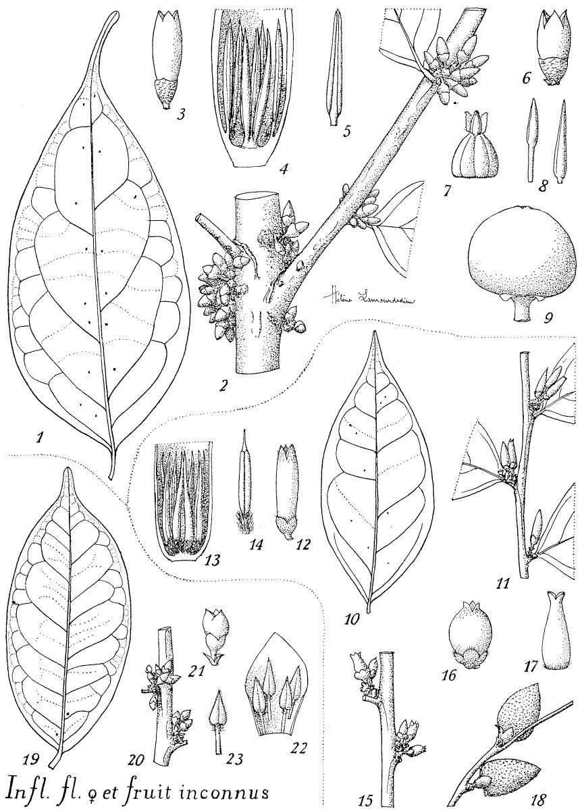  
P1.27.-Diospyros zenkeri (Gurke） F.White:1,feuille (inf.）× 2/3； 2,inflor. ×4；3,fl.×2；4et5,fragm.de cor.et d'andr.etet.×4;6,fl.×2； 7et8,gyn.et stam.X4；9,fr.X2/3.-DiospyrosVermoesenii DeWild.:10, feuille(inf.）×2/3；11,inflor.×1;12,fl.×2；13et14,fragm.de cor.et d'andr.et et.×4;15,inflor.Ω×4；16,fl.×2；17,gyn.×4;18,fr.×2/3. -DiospyrosplatanoidesR.Let.etF.White:19,feuille(inf.）×2/3；20,inflor. X1；21,fl.×2;22 et 23,fragm.de cor.et d'andr.etet.X4.(1et 2:Zenker 858 et 329;3-5:Le Testu7488;6-8:d'apresLouis3476,Congo Kinshasa; 9:Klaine2760；10,15-17et11-14:LeTestu1860et1859;18:d'apresWagemans 1407,Congo Kinshasa;19:White 8559;20-23:Le Testu 8550.)

# R．LETOUZEY & F.WHITE

du Congo Kinshasa et du Cabinda et fréquente peut-étre parfois les bords des cours d'eau.

# MATERIEL CAMEROUNAIS ETUDIE

Busgen s. n.,sin. loc. (stér.) B.   
De Wilde W. 22o8,5o km NNE Eséka,pres riviere Kélé (fl.,mars) WAG; 2806,pres du Nyong,65 km SSW Eséka (fr.，juill.) WAG.   
Endengle SRFCam 2043，pres Douala (fl.δ).   
Keay FHI 37443,Bambuko for.res.(stér.) FHO.   
Ledermann 9I2,Nkolebunde pres Kribi (fl.♀,oct.) (cit.in Notizbl.Bot. Gart.Berl.9:1047 (1926).   
Leeuwenberg 5283，Masok pres Kopongo (fl.，mars) WAG.   
Lotz 53 et 78, Edéa (cit.in Notizbl. Bot.Gart. Berl.9 : 1o47 (1926).   
Maitland 6i9，Victoria (fl.Q,fr.,avr.）K.   
Olorunfemi FHI 3o767,Bambuko for.res.(stér.) K.   
Reussner 3,Edéa (fl.δ) (cit. in Notizbl.Bot.Gart.Berl.9 :Io47 (1926).   
Staudt 943 (type de D. longicaudata Gürke ex Hutch.et Dalz.)，Johann-Albrechtshohe (actuel Kumba)(fl.δ）BM,K.   
Zenker 329,Bipindi (fl.,mars I913)P,B；858 (type),Bipindi (fl.,avr.); 2426 (type de D.rivularis Gurke)，Bipindi (fr.，aout)；3622,Bipindi (j. fr.?)；3765 et 4229,Bipindi (fl. δ)；4932,Bipindi (stér.) P,Z.

# MATERIEL GABONAIS ETUDIE ：

Fleury 33675 in herb. Chevalier,pres Libreville (ster.).   
Klaine 865,sin. loc. (fr.，mars)； 2488,sin. loc. (fl. , nov.)； 276o, Sibang (fr.,févr.)；3o29,sin.loc. (fl.).   
Le Testu 1486,Tchibanga (fl.,nov.)；7488,Lihouma，2o km ESE Lastoursville (fl.,oct.).   
Trilles 31,sin. loc.(fr.).

A cette espéce se trouvent rattachés deux échantillons de la région de Lastoursville : Le Testu 8414 (Libéla,6o km ENE Mbigou, soit env. Ioo km SSW Lastoursville, fl. &,oct.) et 8487 (Lastoursville,fl. δ,oct.） qui pourraient étre considérés comme des hybrides de D.Zenkeri(Gurke)F.White et de D.iturensis (Gürke)R.Let.et F.White car, si par leurs fleurs ils se rapprochent de la premiere espéce,par les feuilles ils se rapprocheraient plutot de la seconde;des recherches sur le terrain dans la région de Lastoursville sont donc désirables pour éclaircir cette question.

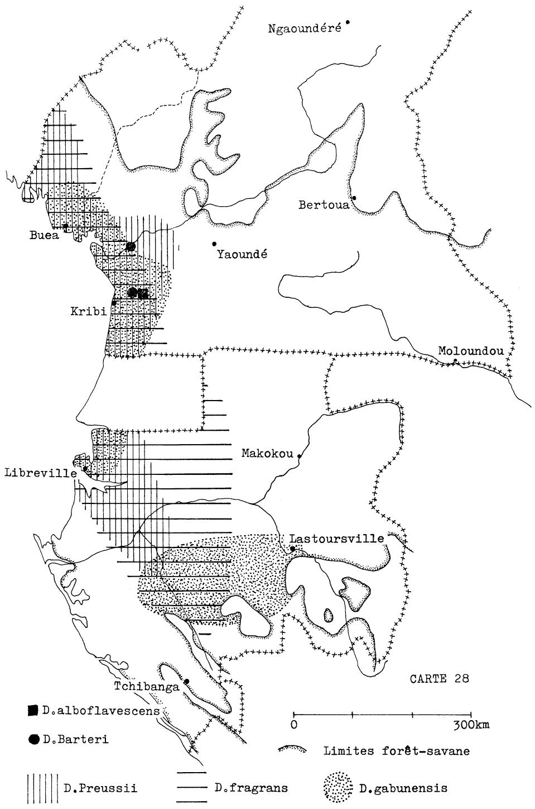

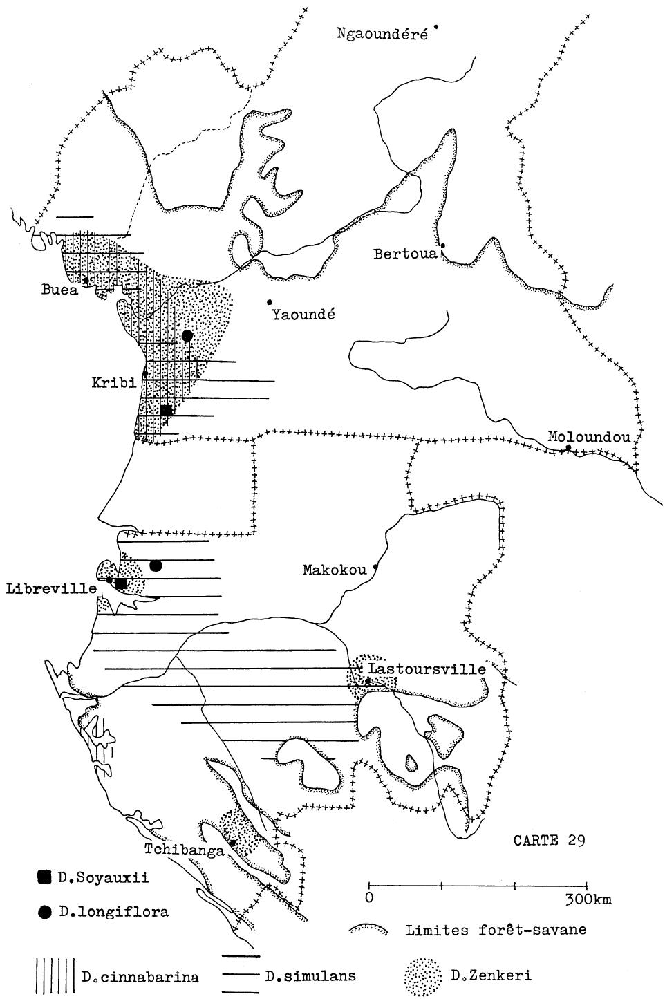

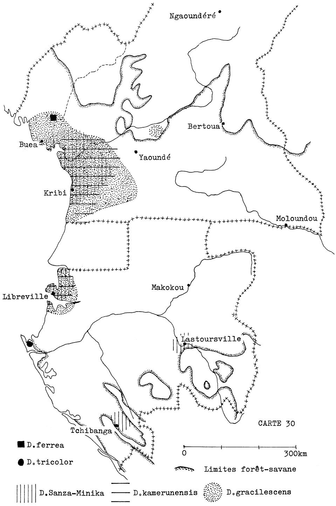

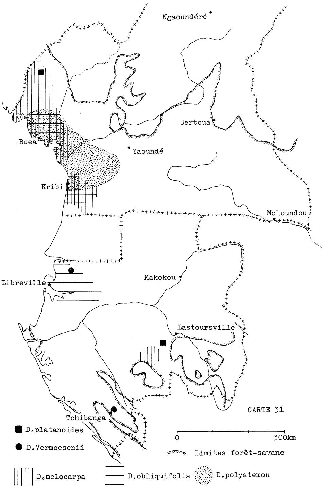

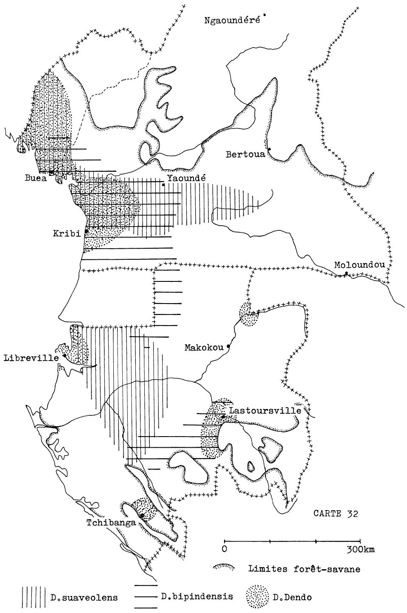

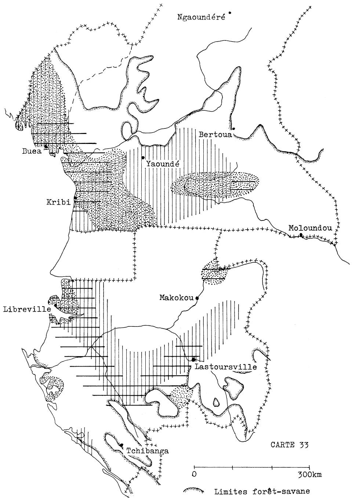

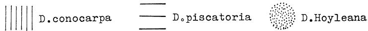

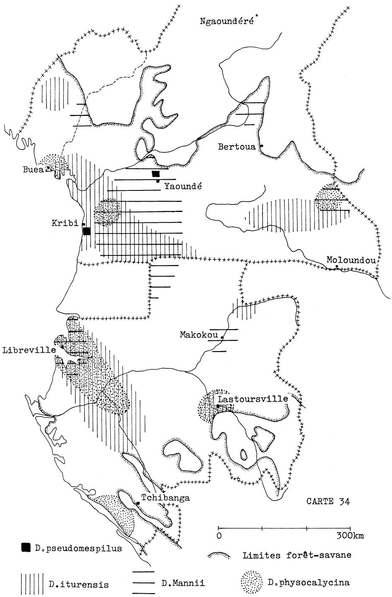

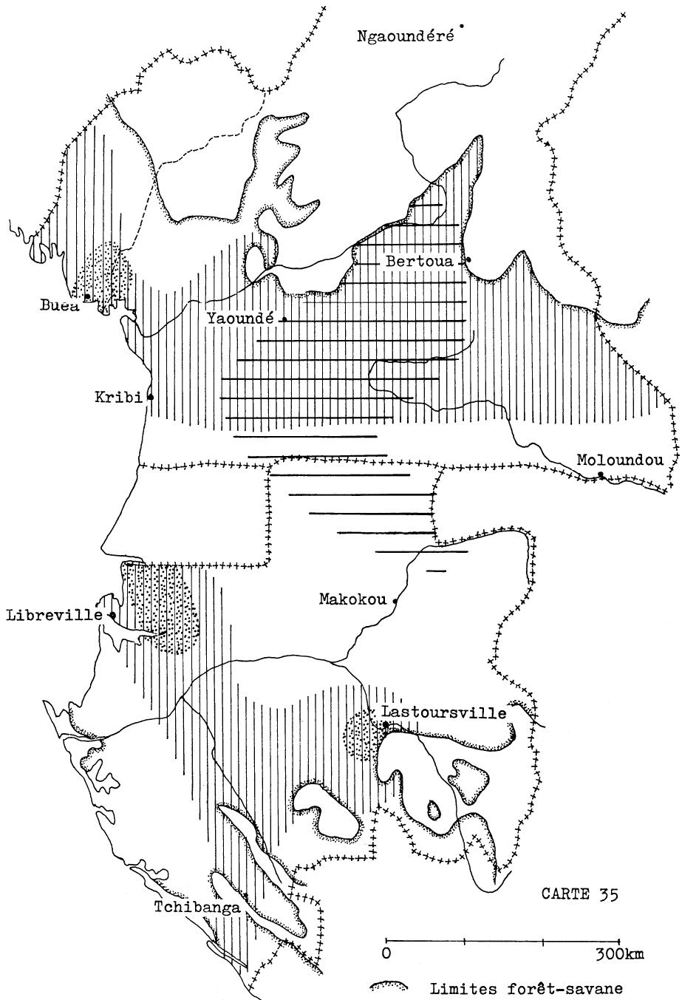

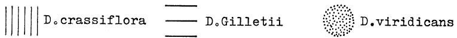

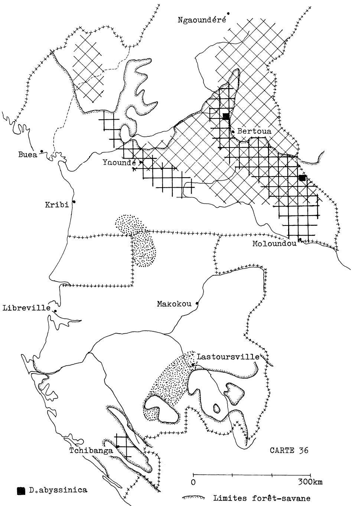

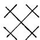

D.monbuttensis

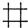

D.canaliculata

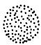

D.Boala

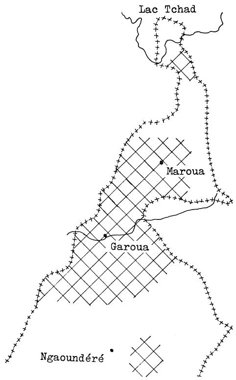

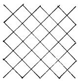  
D.mespiliformis

CARTE 37

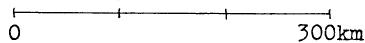

# ESPECES INTRODUITES

D'apres quelques échantillons de I'Herbier de Paris,ont été introduites et cultivées au début du siécle au Jardin de Libreville au Gabon les deux especes suivantes :

# 1. Diospyros discolor Willd., Spec. Plant. 4 : 11o8 (1805).

- D. Blancoi A. DC., Prodr.8: 237 (1844).

Espece originaire des Philippines,á fruits comestibles et fournissant aussi un bois d'ébéne (“ camagon ))，caractérisée par ses grandes feuilles oblongues (22 X 9 cm),a base arrondie, äsommet aigu，ä nombreuses nervures latérales，recouvertes au-dessous d'un feutrage dense de longues soies apprimées irritantes,garnies de glandes alignées de part et d'autre de la nervure médiane,par ses inflorescences en apparence terminales, par ses fleurs á calice et corolle pubescents et profondément découpés en 4-5 lobes,ses 24-28 étamines glabres et par son fruit densément poilu,globuleux, de 8-12 cm de diametre, renfermant 4-6 graines, avec calice peu accru.

Echantillon : Chalot s. n., ann. 1907.

# 2.Diospyros Ebenum Koenig, Physiogr. Salsk. Handl. 1 : 176 (1776).

Espéce originaire de PInde,de Malaisie et de PIndo-Malaisic, fournissant un bois d'ébéne apprécié (“ ébene Ceylan 》)，caracté- risée par ses petites feuilles oblongues (9 X 3 cm),a base cuneiforme,á sommet obtus,ä 6-8 paires de nervures latérales ascendantes peu accusées,pubérulentes au-dessous,garnies de nombreuses glandes éparses，par ses petites inflorescences pédonculees pubérulentes,par scs fleurs en bouton conique, ä calice et corolle

# R.LETOUZEY& F.WHITE

nettement découpés en 4 lobes,ses I6-32 étamines glabres et par son fruit glabre，globuleux,de 2,5 cm de diametre,avec calice assez accru.

Echantillons : Chalot 26 et 5o,ann. 1899； Klainc 2009, ann. 1900.

# ESPECES EXCLUES

1）Diospyros oblongicarpa Gurke, Bot. Jahrb. 43 : 2oo (1909).   
Ce taxon, décrit sur 'échantillon Zenker 347I du Cameroun, a été mentionné par erreur sous le nom de Maba oblongicarpa Gürke dans le Supplément 4 de lIndex Kewensis (p. 146,1913). Selon M1LDBRAED，Notizbl.Bot.Gart.Berl. 9 :1o55(1926), il s'agit en réalité d'Isolona Zenkeri Engl. (Annonacées) connu aussi au Gabon.   
2) Diospyros pachylla Gurke,Bot. Jahrb.46 :152 (1911).

Décrit d'apres l'échantillon Tessmann 72o de Guinee équatoriale，ce taxon est en réalité,d'apres MiLDBRAED,Notizbl. Bot.Gart.Berl. 9 ：1o55 (1926)，synonyme de Rhaptopetalum pachyphyllum (Gurke) Engl.(Scytopétalacées),espéce représentée au Cameroun et au Gabon.

3）Diospyros rosea Gurke in EnGLER，Wiss.Ergebn. Deutsche Zentral-Afrika Exped. 2 : 525 (1913).

Décrit d'apres un échantillon du Congo Kinshasa, ce taxon est en réalité,d'apres MiLDBRAED,Notizbl.Bot.Gart.Berl.9 ： 1055 (1926)，synonyme de Rhaptopetalum roseum (Gurke) Engl. (Scytopétalacées),espece qui parait étrc représcntee au Camcroun.

# EBENACEE

# INDEX DES ECHANTILLONS

Adebusuyi (Cam.) : FHI 44008 (29).   
Annet (Cam.) : 143 (4); 152 (29); 450 (26).   
Aubréville (Cam.) : 2779(= 1 Ca) (9); 278o(= 2 Ca) (34).-(Gab.) : 146(32).   
Autran (Gab.) :in herb.Heckel g6 (17).   
Bates (Cam.) : 394 (29); 1266 (6)； 1351 (23); 1426 (8)； 1690 (9)； 1794,1799(16)；1863 (8).  
Bertin (Gab.) : s.n. (2 éch.) (24).   
Biholong (Cam.) : 41 (22).   
Binuyo et Daramola (FHI) (Cam.) : 35548 (29);35595 (4);356o2 (32); 35629 (12);35630 (8).   
Bounougou (Cam.) : 51 (22).   
Braun (Cam.) : s.n. (29).   
Brenan (Cam.) : 9288 (16); 9307 (24);9309 (16); 9320 (7); 9405 (12); 9408 (13); 9415 (29);9418 (4); 9424 (8);9448,9449,9450 (24); 9471 (16).   
Breteler (Cam.) :1436 (14)；1504 (23)；1681 (6)；1762(14)；1912 (23)；1972 (20);2003 (14);2138 (23);2145,2146,2171 (6);2194 (23);2206 (14)；2648 (8);2844 (9).- (Gab.) : 5628,5659 (et van Raalte) (8); 5744 (32); 5749 (25); 5766 (32); 5774 (8).   
Breteler c.s. (Cam.) : 2329 (6);2603 (31).   
Buchholz (Cam.) : s. n. (29).   
Busgen (Cam.) : 157 (4); 398 (15);403 (9); 463 (31); 556 (15); 57I (24)； s. n. (38).   
Chalot(Gab.) :26& 5o (introduit)D.Ebenum；s.n. (introduit)D.discolor.   
Chevalier (Gab.) : 4378 (35); 11299,26701 (25); 26832, 27059 (8); 27089 (25).   
Corbet (Gab.) : 684 (37).   
Daramola (FHI) (Cam.) : 29804 (4);29805 (10).   
Davies (FHI) (Cam.) : 29682 (4); 29685 (28).   
De Saint Aubin (Gab.) : SRF 1975 (31).   
De Wilde W. (Cam.) : 1266 (15); 1303,1500 (4); 1735 (19);1785A g B (29); 1892,2029 (14);2050 (4);2142 (16);2161 (17)；2173 (31);2190 (29);2208 (38);2568 A & B (23); 2706 (17); 2707 A gB (13);2708 (20); 2766 (29); 2806 (38); 2827 (34); 2836 (4); 2852 (15);2862 (13);3057,3081 (22); 3791 (30);3825 (17);3850 (4);3956 (29); 4757 (22).   
Dinklage (Cam.) : 839 (24).   
Dundas (Cam.) : FHI 8401 (24).   
Dupasquier (Cam.) : in herb. Chevalier 33277 (21).   
Endengle (in herb. SRFCam.) (Cam.) : 2043 (38);2044 (17); 2045 (16)；2046 (7).

# R．LETOUZEY & F.WHITE

Estasse (Gab.) : SRF 685 (25).   
Fleury (in herb.Chevalier) (Cam.) : 33223 (16)；33278,33279 (21)；33281, 33344 (26);33352 (17); 33364 (21);33373 (15);33408 (21); s. n. (16 & 31). — (Gab.) : 26508 & bis (9); 26595 (26); 26604 (34); 33660 (26);33675 (38); s.n. (26 &10).   
Gaston (Cam.) : 1487 (22).   
Halle N (Gah) · 811,813 (25); 1641 (17); 2192 (8); 2423, 2494 (24); 3313 (16); 3962 (10);3969 (14);4126(17);8.n. (32).   
Halle N. &Le Thomas (Gab.) : 123,155 (26); 157 (17);171 (16);188 (20).   
Hallé N. & Villiers (Gab.) : 4616 (32); 5179 (8); 5193 (29).   
Hedin (Cam.) : 207,561 (9); 709 (23); 816 (9); 830 (6); 999 (9); 1428 (15); 1554 (34);1555 (26); 1556 (31);8.n. (34).   
Huckstadt (Cam.) : 93 (31);137 (12).   
Inst.nat. études forestieres (Gab.): s. n. (32).   
Jacques-Felix (Cam.) : 2519 (6); 3027 (23); 3517,3592,3705,3718,3719, 3775 (22); 4369 (23); 4603 (6);4894 (25); 4908,4913 (6); 8440 (22).   
Jeme (Cam.) : 28/38 (4).   
Johnstone (Cam.) : 87/31 & 267/32 (23).   
Keay (FHI) (Cam.) : 37422 (37); 37438 (34); 37441 (4); 37442 (9); 37443 (38); 37445 (4); 37465 (11); 37472 (26); 37473 (9); 37474 (10).   
Klaine (Gab.) :67 (16);87 (8);105 (32); 118 (10); 127 & bis (cf.18,32,33); 147 (8);149 (16); 152& bis (cf.18,32,33)； 155 (10);157 (cf.18,32,33); 172 (17)；184 (29); 229,287 (8);326 (26); 349,358 (16); 369 (32); 375 & 376 sphalm. (17);399 & 41I (cf.18,32,33);426 & bis (32);429 (26); 504 (17); 562,570 (29); 586 (10); 592 (8); 648 (32); 712 (18); 727 (17); 788 (12); 808 (32);847 (10);865 (38);1021 (32); 1231 (8);1276 (33); 1314 (18); 1331 (24)；1340,1341 (12);1385 (32);1392 (18)； 1410 (8)； 1652 (18);1688 (10); 1698(8); 1776 (26); 1818 (12)； 1824 (32); 1971 (18); 2006 (12); 2009 (intr0- duit) D.Ebenum; 2061 (8); 2075 (32); 2122 (12); 2164 (8); 2179 (32); 2258 (33 et cf.32); 2262 (8); 2331 (33 et cf.32); 2441 (8); 2488 (38); 2532 (10); 2637 (26); 2673 (15); 2675 (33); 2760 (38); 2772,2773 (32); 2800 (10); 2835 (33);2850 (10);3029 (38);3030 & bis (16);3095 (32);3103 (10);3247 (?32); 3248 (18);3525 & s. n. (10); s. n. (18 & 33).   
Lecomte (Gab.) : 2 (7); s. n. (9 & 16).   
Ledermann (Cam.) : 653 (29); 682 (12);761 (8); 912 (38);984 (Maba tenuifolia Gurke :inconnu,cf.32).   
Leeuwenberg (Cam.) : 5197 (4); 5202 (28); 521I (4); 5233 (31); 5268 (29); 5280 (18); 5283 (38); 5369 (17); 5371 (4); 5384 (34); 5392, 5573 (29); 5584 (17); 5598 (4); 5692 (10); 5697 (13); 5700 (16); 6191 (6);6332 (17); 7577 (22).   
Le Ray (Gab.) : s. n. (12).   
Le Testu (Gab.) : 1409 (25);1469 (10); 1486 (38); 1838 (31);1859,1860 (36); 2026 (6); 2126 (10); 2139 (8); 2140 (4); 2142 (9); 2159 (8); 2289 (32); 2298 (29)； 2407 bis, 2408 bis,5023,5028 (9); 5049, 5052 (26); 5067 (17); 5098

# EBENACEE

(13); 5121 (12); 5476 (13); 5478 (4); 5485 (12); 5712 (32); 6088 (9); 7177,   
7353 (10); 7479 (9); 7488 (38); 7523 (10); 7527 (9); 7555 (10); 7559 (5); 7566   
(25); 7574 (13); 7577 (8); 7578 (17); 7583 (32); 7590 (17); 7605 (26); 7629 bis   
(8); 7644 (25); 7683 (13); 7687 (26); 7759 (13); 7801 (8); 7831 (26); 7976 (5);   
8009 (37); 8039 (5); 8242 (21); 8405 (16); 8414 (cf.38); 8417 (5); 8423 (13);   
8430 (4); 8436 (10); 8438 (9); 8485 (4); 8487 (cf.38); 8514 (10); 8515 (17);   
8521 (10); 8524 (32); 8541 (8); 8550 (27); 8552 (31); 8570,8942 (8); 9045   
(20); 9134 (4); 9280 (20); 9342 (34); 9346 (12); 9382 (25); 9383 (4); 9386   
(25);9388 (12); 9486 (5); 9527 (4); 9548 (14); 9562 (4).   
Letouzey (Cam.) : 315 (14); 573 (16); 634 (22); in herb.SRFCam.: 1133 (8),   
1139 (10),1267& 1313 (4),1347 & 1479 (31), 1564 (34)； 1847 (8); 2696 (6);   
2889 (9); 2981 (1); 3666 (32); 3667 (23);3678 (16); 3713 (9); 3767 (14);   
3958 (23); 4096 (29); 4212 & bis (8); 4508 (14); 4785,4832 (9); 5067 (20);   
5070 (?1); 5168 (17); 5200 (6); 5227 (23); 5408 (6); 6114 (23); 6639 (22);   
7595, 7673 (23); 7912 (9); 8980 (13); 9024 (33); 9043 (29); 9102 (12); 9342   
(17); 9359 (21); 9402 (18); 9418 (10); 9450 (4); 9465 (15); 9466 (21); 9545,   
9857 (15); 9858 (32); 9951 (4); 10073 (17); 10085 (14); 10088 (17)； 10168   
(20);10170 (8); 10182 (4); 10207 (5); 10209 (16); 10214 (17); 10242 (34);   
10247 (8); 10286(17); 10308 (12); 10327 (18); 10338 (17); 10367 (21).   
Lhote (Cam.) : s. n. (22).   
Lotz (Cam.) : 53,78 (38).   
Maitland (Cam.) : 398 (29); 407 (9); 619 (38);768 (37); 1634 (23).   
Malzy (Cam.) : 395 (22).   
Mann (Gab.) : 924 (20).   
Mbarga (Cam.) : 14, 28 (10); 38 (18); 56 (15).   
Mezili (Cam.):78 (34).   
Mildbraed (Cam.) : 3991,4072,4110,4123 (6); 4329, 4399 (23); 4489 (9); 4529   
(6); 4633 (23);4938 (20); 4991 (16); 5000 (23); 5102 (26); 5132 (cf. 7 & 32);   
5162 (17); 5291, 5306,5385,5401 (8); 5429 (34); 5701 (9); 5765 (15); 5832   
(13); 5891 (24); 6022 (29); 6049 (12); 6134 (30); 7729 (8); 7747 (14); 8026   
(4); 8328 (?20); 8339,8474 (9); 8509 (6); 8875 bis (22); 8903 (23); 8936 bis   
(22); 10522 (34); 10531 (7); 10595 (15); 10627 (16); 10715 (7); 10754 (10).   
Morel(SRF) (Gab.) : 118 (32); 143 (18); 144 (26); s. n. (12).   
Morel & Gauchotte (Gab.) : 87 (15).   
Motuba (Cam.) : FHI 15068 (29).   
Mpom (Cam.) : 94 (34);95 (31); 96 (3);97 (15); 98 (4); 100 (9); 168 (31); 255   
(20);269 (15).   
Nana (Cam.) : 19 (23); 57 (9); 349 (6).   
Normand (Gab.) : s.n. (17 & 19).   
Olorunfemi (FHI) (Cam.) : 30575 (29); 30703 (4); 30727 (28)； 30752 (13);   
30767 (38).   
Onochie (FHI) (Cam.) : 30853 (16); 32056,32057 (15).   
Preuss (Cam.) : 474 (29); 1222 (4); 1316 (29).

# R.LETOUZEY & F.WHITE - EBENACEE

Raynal (Cam.) : 9924, 10058 (8); 12813, 12918 (22); 13469 (29).   
Reussner (Cam.): 3 (38).   
Rosevear (Cam.) : 1 /34 (9).   
SRFCam. (Cam.) : 4408,4409 (22); 15687 (4); 15688 (12).   
Service forestier (Cam.):92 (34); in herb. SRFCam.169 (28); s.n. (9).   
Smith (Cam.) : I (34);3 (17);IV (29); I1 A (10).   
Soyaux (Gab.) : 36 (13); 57 (8); 113 (26); 136 (8); 187,206 (33); 226 (17); 238 (24).   
Staudt (Cam.) : 207 (34); 273 (8); 617 (11); 755 (26); 943 (38); 958 (13).   
Surville (Cam.) : 806 (4).   
Thollon (Gab.): go & s. n. (14).   
Tiku (FHI) (Cam.) : 41895 (21); 41898 (16).   
Touzet (Gab.) : 16 (29); 33 (26);57 (29); 61 (36);69 (29); 70 (36); 92 (34); 167 (37).   
Trilles (Gab.) : 31 (38); 58 (9).   
Vaillant (Cam.) : 70, 1148 (22).   
Walker (Gab.) : 4, 204 (34); in herb.Chevalier 34822 (9); s. n. (34).   
White (Cam.) : 8432 (16); 8546 A (9); 8558,8559 (27); 8561 (21); 8565 (16); 8567 (8);8568(17); 8571 (34);8592 (10); 8615 (21); 8627 (12).   
Winkler (Cam.) : 758 (25); 1287 (7).   
Zenker (numéros de série melangés) (Cam.) : 2 (4); 32,40 (7); 49, 72 (3)； 74   
(18);87 (28);93,94 (25); 95 (13); 169 (26); 187 (13); 240 (28);329 (38); 352   
(4); 378,532 (10); 533 (20); 567 (2); 571 (25); 595 (8); 746 (4); 852 (29); 858   
(38); 864 (4); 914 (10); 915 (25); 933 (4); 945 A & B (18); 951 (34); 1154   
(10); 1668 (4)； 1671 (28); 1684 A,1691,1713 (25)； 1718 (13); 1722 (10);  
1740 (12); 1745 (16); 1756 (3); 1779B (4); 1798 (3); 1806(18); 1809 (4); 1859   
(3); 1862 (18); 1865 (4); 1888 B,1904 (10); 2269 (18); 2273 (2); 2274 (34);   
2340 (9); 2350 (10); 2355 (4); 2426 (38); 2433 (7); 2454 (26); 2483 A (18);   
2633 (26); 2814 (18); 2828 (3); 2938 (4); 2954 (13); 2993 (28);3011 A (26);   
3046 (10);3069 (18); 3224 (7); 3351 (10);3360-3361 (7);3439 (20); 3445 (10);   
3464 (2); 3466 (7); 3467 & s. n. (13);(347I : Isolona Zenkeri non Diospyros   
oblongicarpa); 3483 (18); 3530 (34); 3533 (1C); 3534 (31); 3547 (26); 3548   
(8); 3558 (3); 3563 (18); 3622 (38); 3688 (13); 3701 (4); 3701 A (8); 3746   
(10); 3765 (38); 3791 (13); 3838 (7); 3862 (34); 3865 (21); 3866 (26); 3867   
(13); 3995 (?32); 4187 (10); 4194 (4); 4208 (28); 4211 (13); 4218 (7); 4229   
(38); 4230 (10); 4279 (25); 4312 (10); 4398 (4); 4459 (10); 4462 (28); 4471   
(8); 4485 (29); 4505 (3); 4508 (10); 4520 (13); 4524 (3); 4538 (12); 4544 (29);   
4546, 4570 (4); 4658 (25); 4703 (10); 4930 (26); 4932 (38); 4945 (28); 4996   
(10);s.n. (4,10,13,18,25,34).   
Zenker & Staudt (Cam.) : 664 (8).

# INDEX

# Ebenaceae

Les synonymes sont en italique.

Les nombres en italique correspondent aux taxons cites mais non decrits.

Les chiffres gras indiquent les pages des illustrations et des cartes.

CYCLOsTEMoN gabonense Pierre ex Hutch.. 43   
gabonense auct. 43   
-gabonense (Pierre ms.).... 122   
DALBERGIA melanoxylon G.&P．1II   
DIOSPYROS L. 4   
-abyssinica (Hiern) F.White 29,127,129,177   
-aggregata Gurke...... 104   
—alboflavescens(Gurke)F. White.. 32,133,169   
- alboflavescens(Gurke)F. White p.p. . 93   
- alboflavescens (Gurke ms.). 32   
- ampullacea Gurke ...... 57   
- atropurpurea Gürke... 63   
-- Autraniana (Pierre ms.)... 93   
— Barteri Hiern .....33,73,169   
Barteri auct. 154   
BequaertiDeWild... 43   
Bequaerti var.Imbimbo De Wild. 43   
-bicolor Klotzsch ...... 48,110   
-bicolor H.Winkl. 48   
-bipindensis Gurke .. 35,37,173   
-Blancoi A. DC.. 179   
Boala De Wild....39,4l,177   
Büsgenii Gurke... 35   
-canaliculata De Wild..... ..43,45,122,177   
- castaneifolia A. Chev....77   
cauliflora De Wild... 43   
-cauliflora Blume. 43

- cauliflora Martius ex Miq.:43   
- chlamydocarpa Mildbr..... 43   
- chrysantha (Gurke ms.).... 126   
- cinnabarina De Wild.... 48   
-cinnabarina(Gurke）F.White .......48, 51,147,170  
- coccinea(Gurke ms.）.... 63   
- confertiflora Kennedy....154   
-conocarpa GürkeetK. Schum... 52,55,174   
crassiflora Hiern ..57,59,176   
- dasysepala (Pierre ms.)... 52   
-deltoidea F.White.. 77   
- Dendo Welw.ex Hiern.. 63,65,173   
-discolorWilld. 179   
- Ebenum Koenig.... 179   
Elliotti F.White.. 114   
-Evila Pierre ex Chev...... 58   
Feliciana R.Let.&F.White91   
—ferrea（Willd.）Bakh... ..29,69,113,171   
—ferrea auct...   
-flavescens Gurke.. 63   
-flavescensauct.. 58   
——flavovirens Gurke... 35  
fragrans Gurke....72,73,169   
— gabunensis Gurke.. 77, 79,169   
Gilgiana Gurke... 77   
— Gilletii De Wild...82，83,176   
Gilletii var.Sapinii De Wild. 82   
-glaucescens Gurke.. 143   
- gracilescens Gurke．5l,86,171

- Heudelotii Hiern ..... 48,86   
Heudelotii auct........ 48,86   
hirta Gürke ex H.&D.... 33   
-hispidissima (Pierre ms.). 52   
Holtzii Gürke. IIO  
Hoyleana F.White... 88,89,162,174   
hylobia Gurke.. 48   
-Ibo (Gurke ms.)... III   
incarnata Gurke... 58   
一 insculpta Hamilt... 93  
insculpta auct.. 93   
-iturensis (Gürke) R.Let.et F.White ......32, 93, 95, 175   
- ivorensis Aubrev.et Pellgr. 104   
-kamerunensis Gurke.... 88,97,99,171   
-Kekemi Aubrév.et Pellegr. 163   
- Kimba-Kimba De Wild. .43   
Klaineana De Wild.ex Pierre 135   
--Lecomtei (Pierre ms.)..... 58   
- Ledermannii Gurke....... 135   
-Letestui Pellegr... 135   
- longicaudata Gürke ex H. etD. 165   
-longifloraR.Let.etF.White 101,103,170   
-Lotus Linn. 7   
-Lujae De Wild.. 77   
magnacarpa (Gurke ms.)..97   
- mamiacensis Gurke....... 77   
- Mannii Hiern I04,105 114,175   
- mayumbensis Exell.... 43,161   
- megacarpa (Gurke ms.).97   
-megaphylla Gürke...... 77   
-melocarpa F.White 1o8,159,172   
-mespiliformis Hochst.ex A.DC. 110,113,178   
-mimfiensis Gurke..... 63   
- molundensis Mildbr........ 43   
monbuttensis Gürke I15,Il7,177   
一 mucronata (Pierre ms.).... 72

-nigericaF.White.. 86   
-nsambensis Gurke.... 143   
nutans King et Gamble.... 43   
-nyangensis Pellegr.... 53   
-obliquifolia (Hiern ex Gürke) F.White .....89,.92,119,172   
- oblongicarpa Gurke....... 180   
-pachyphylla Gurke....... 180   
—— pallescens A. Chev...... 97  
一physocalycina Gurke.....47，122,123,175  
一 piscatoria Gurke 29,126 127,174  
-piscatoria auct.. 29   
-platanoides R.Let.et F. White... 131,167,172   
— polystemon Gürke 132,133,172   
一 potamophila Mildbr..... 82  
—Preussii Gurke ..135,137,169   
- pseudaggregata Mildbr..... 104   
-pseudomespilus Mildbr... 140,141,175   
rivularis Gurke.. 165   
-rosea Gurke.. 180   
rubicunda Gürke... 33   
-sabiensis Hiern. II0   
-Sanza-Minika A.Chev..... 143,145,170   
- senegalensis Perr.ex A.DC. I10,126   
一 senegalensis auct.... 126  
-senensis Klotzsch..... 115   
-senensis auct. 115   
setigera Mildbr... 52   
一simulans F.White... ...48,147,149,170   
一 soubreana F.White .. 130,132  
-Soyauxii GürkeetK.Schum. 83,119,147,152,170   
- Soyauxii auct..... 147   
-spherocarpa Pierre ex De Wild. 97   
Stapfiana F.White....... 119   
Staudtii Gürke.. 52

-suaveolens Gürke154,155,173   
- subcanescens Gurke........ 48   
- Talbotii Wernham........ 104   
temvoensis De Wild...... 63   
- tricolor (Schum.et Thonn.) Hiern. 158,159,171   
- ubanghensis A. Chev. .... 29   
- undabunda Hiern ex Greves140   
usambensis Gürke........ 143   
Vermoesenii De Wild..... · 92 161,167,172   
- viridicans Hiern... 95,163,176   
-Welwitschii Hiern.. 29   
WinkleriGurke. 48   
- xanthochlamys Gurke...... 43   
- xanthochlamys auct．.： 43，122  
—Zenkeri (Gürke)F.White 165,167, 170   
- Zenkeri (Gurke ms.)..... 135   
DRYPETEs gabonensis (Pierre) Hutch... 122   
EBENACEE 3   
Ebenus abyssinica (Hiern) O. Kuntze . 29   
Ehretia ferrea Willd. 69   
EuCLEA Warneckei(Gurke ms.). 158   
- Warneckeana (Gurke ms.）. 158   
Heisteria Winkleri Engl...... 122   
Isolona Zenkeri Engl..... 180   
— sp. . 165   
Maba abyssinica Hiern... 29   
- alboflavescens Gurke...... 32   
Autraniana (Pierre ms.)..93   
Bequaerti De Wild..... 93   
bicolor Mildbr．. 48   
-bipindensis Gurke......... 126   
- buxifolia(Rottb.)A.L.Juss.88   
-buxifolia Pers... 69   
- chrysantha Kennedy ...... 126   
-cinnabarina Gürke... 48

-coriacea Cummins. 43   
- cytantha Pierre ex A. Chev.. 93   
-enosmia Mildbr. 93   
-euosmia Mildbr. 93   
- fragrans Hiern ex Greves..72   
guineensis A.DC. 69   
-iturensis Gurke... 93   
kamerunensis Gurke.. 88   
-Klaineana (Pierre ms.).... 88   
-lancea auct.non Hiern....   
Laurentii De Wild.... 93   
-Lujae De Wild.... 77   
Mannii Hiern.. 114   
- mayombensis Pellegr... 43,161   
- melocarpa (Louis ms.)..... 108   
-Mualala Welw.ex Hiern 29,126   
Mualala auct.... 126   
-nutans Hiern 43   
- oblongicarpa Gurke....... 180   
-ripicola Mildbr.... 93   
-secundiflora Hutch..   
- Smeathmannii A. DC...... 70   
tenuifolia Gürke.. 151   
-ubanghensis A.Chev...... 29   
Warneckei Gurke... 29   
- xylopiifolia Mildbr. ......126   
Zenkeri Gurke.. 165

Noltia tricolor Schum.et Thonn. 158   
Ptychopetalum sp...... 165   
Rhaphidantheobliquifolia Hiern ex Gurke.. 119   
Rhaphidanthe Soyauxii Stapf .. 119   
Rhaphiostylis sp.... 126   
RHAPTOPETALUMpachyphyllum (Gürke) Engl.... 180   
-roseum (Gürke) Engl......180   
StrombosiopsisbuxifoliaS. Moore 88   
Thespesocarpus tiliaceus Pierre 147,152

# FLORE DU GABON

# Volume parus

I．A．AUBREVILLE Sapotacees 1961   
2.N. HALLE Sterculiacees 1961   
3．A．AUBREVILLE Irvingiacees, Simaroubacees, Burseracees 1962   
4.N.HALLE Melianthacees, Balsaminacees, Rhamnacees 1962   
5.J.KECHLIN Graminees 1962   
6. R. LETOUZEY Rutacees,Zygophyllacees,Balanitacees 1963   
7. A. CAVACO Polygonacées， Chenopodiacées, Amaranthacees， Nyctaginacées，Phytolaccacees，Aizoacées，Portulacacees， Caryophyllacees 1963   
8.M.L. TARDIEU-BLoTPteridophytes 1964   
9. J.KECHLIN Musacees， Strelitziacees, Zingihéracées，Cannacees，Marantacees 1964   
Io.R.FOUILLOY Lauracees，Myristicacees,Monimiacees 1965   
I1.G.J.H.AMSHOFF Myrtacees G.AYMONIN Thymeleacees 1966   
12.N. HALLE Rubiacées (Ire partie) 1966   
13.H.HEINE Acanthacees 1966   
14.B.DEsCOINGS Vitacees， Leeacees 1968   
15．A．AUBREVILLE Legum. Caesalpinioidees 1968   
16.A LE THOMAS Annonacees 1969  
17.N. HALLE Rubiacées (ze partie) 1970   
18.R.LETOUZEYet F.WHITE Ebenacees 1970

ImpriméenFrance

IMPRIMERIE FIRMIN-DIDOT.- PARIS- MESNIL - IVRY - 5532

Dépot légal:4e trimestre 1970