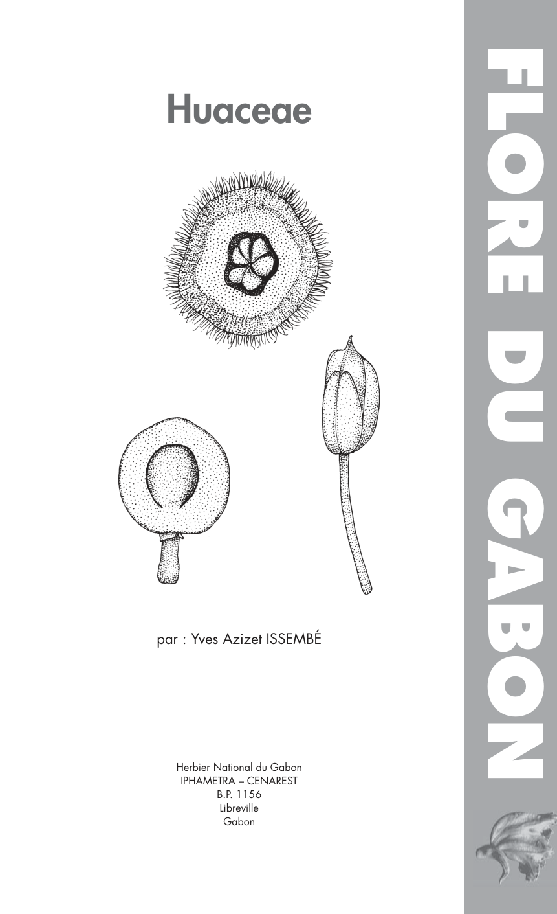
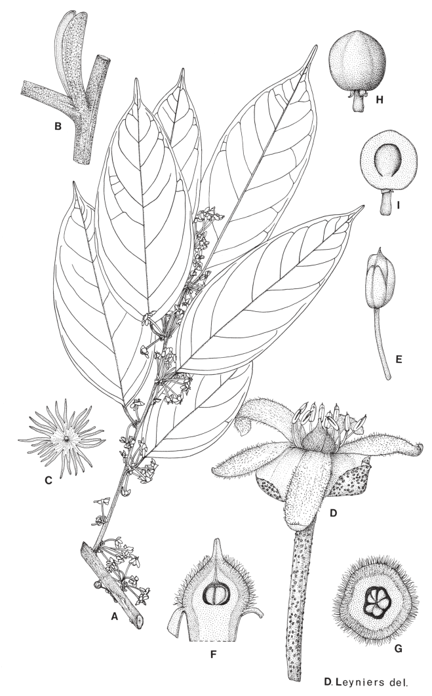
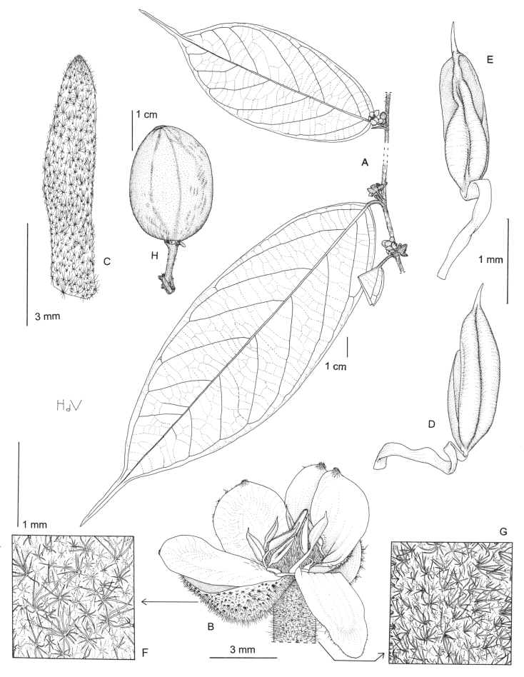
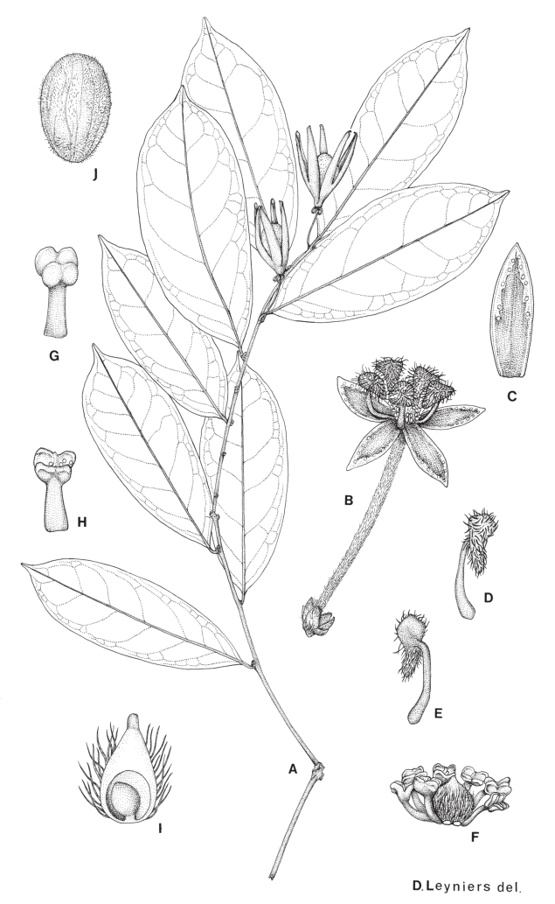

## Figure 17 (page 25)

*Caption:* (no caption)

---

## Figure 18 (page 29)

*Caption:* Planche 5. Afrostyrax lepidophyllus : A. Rameau florifère. – B. Stipules. – C. Écaille étoilée de la feuille. – D. Fleur. – E. Étamine. – F. Gynécée, coupe longitudinale. – G. Gynécée, coupe transver- sale. – H. Fruit. – I. Fruit, coupe longitudinale. Reproduite avec la permission du Jardin botanique national de Belgique (©), à partir de A. Robyns (1976) l.c.

---

## Figure 19 (page 31)

*Caption:* Planche 6. Afrostyrax macranthus : A. Rameau florifère. – B. Fleur. – C. Stipule. – D. Étamine, vue de dos. – E. Étamine, vue de ventre. – F. Pilosité du sépale. – G. Pilosité du pédicelle. – H. Fruit. (A-C, F-G : G. Touzet 60 ; D-E: J.J. Bos 6751 ; H: J.J.F.E de Wilde 8347A ). Dessin par Hans de Vries (©), Herbier National des Pays-Bas – Wageningen branche.

---

## Figure 20 (page 33)

*Caption:* Planche 7. Hua gabonii : A. Rameau avec capsules ouvertes. – B. Fleur. – C. Sépale, face interne. – D. Pétale, face interne. – E. Pétale, face externe. – F. Androcée (2 étamines ôtées) et gynécée. – G.

---
