## Figure 46 (page 28)
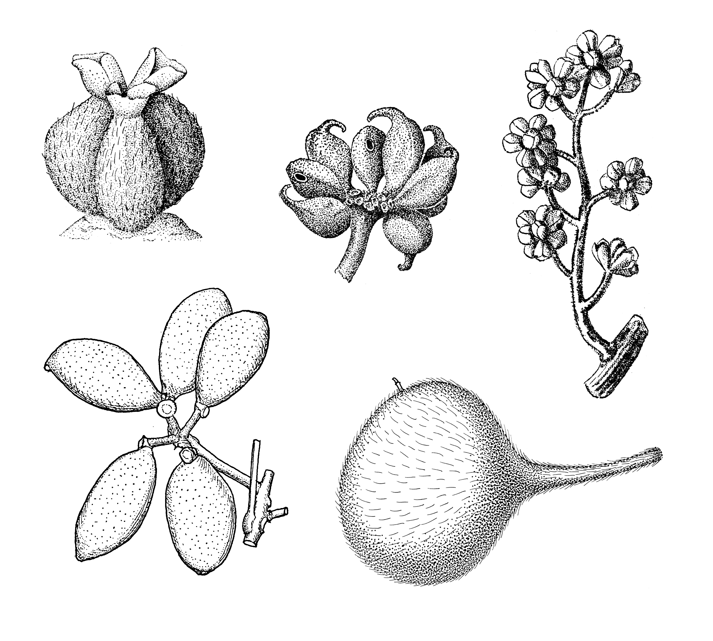
*Caption:* (no caption)

---

## Figure 47 (page 33)

*Caption:* Planche 6 . Albertisia mouilaensis : 1. Tige feuillée. – 2. Feuille, face inférieure. – 3. Jeune méricarpe. (1-3 : Breteler et al. 7787 ). Dessin par Esmée Winkel, Naturalis Biodiversity Center (©).

---

## Figure 48 (page 34)
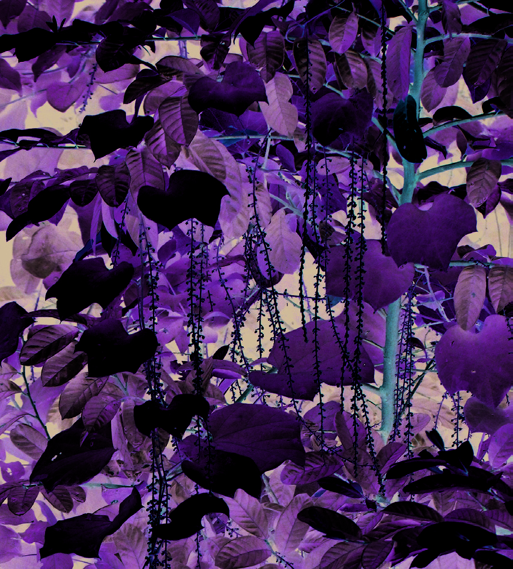
*Caption:* Figure 4 . Albertisia badia : A, B. Tige fructifère. – Chasmanthera dependens : C. Tiges florifères ; D.

---

## Figure 49 (page 34)
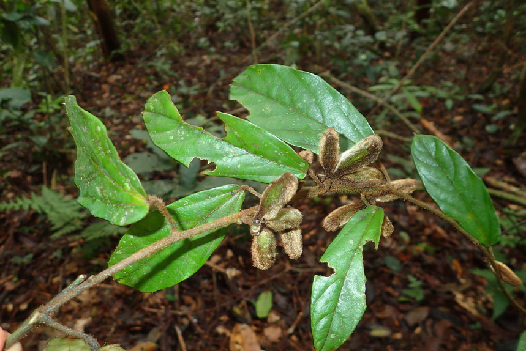
*Caption:* (no caption)

---

## Figure 50 (page 34)
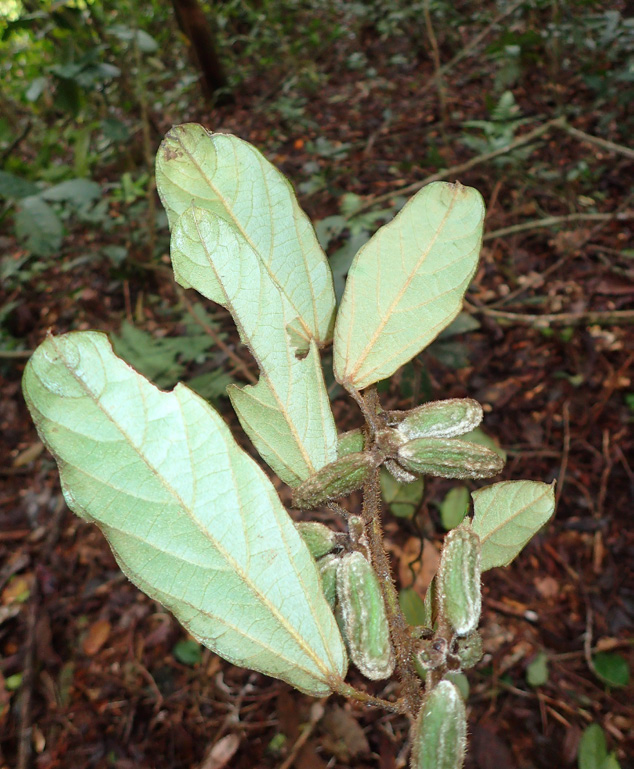
*Caption:* (no caption)

---

## Figure 51 (page 34)
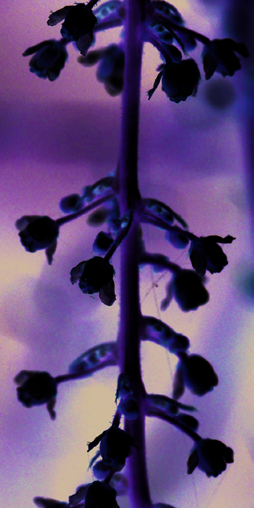
*Caption:* (no caption)

---

## Figure 52 (page 34)
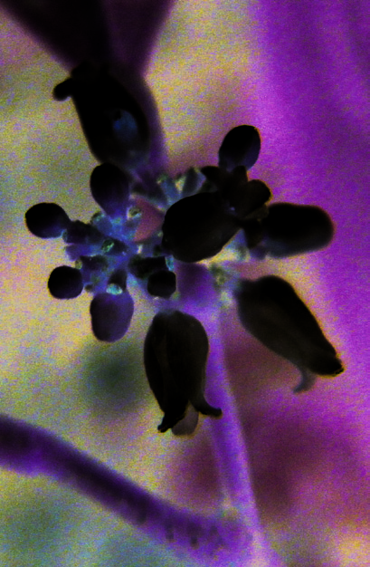
*Caption:* (no caption)

---

## Figure 53 (page 34)
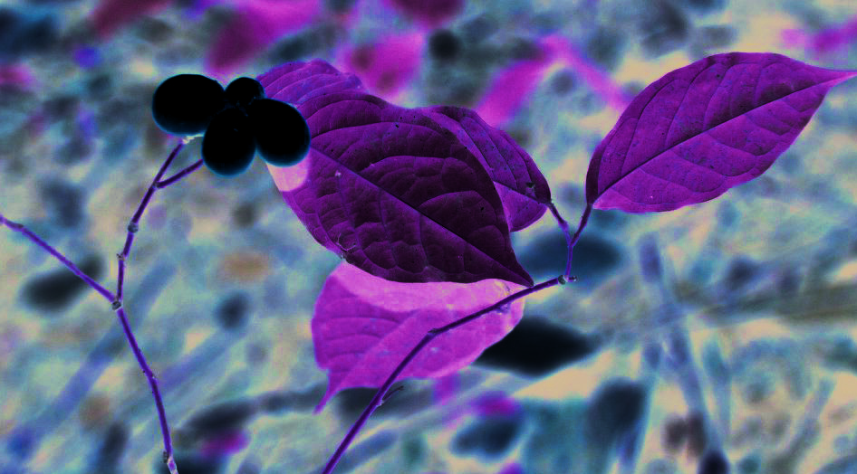
*Caption:* (no caption)

---

## Figure 54 (page 34)
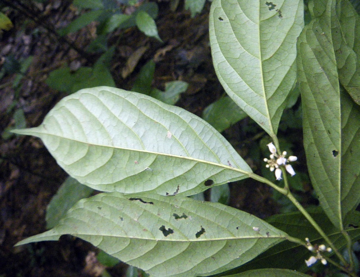
*Caption:* (no caption)

---

## Figure 55 (page 36)
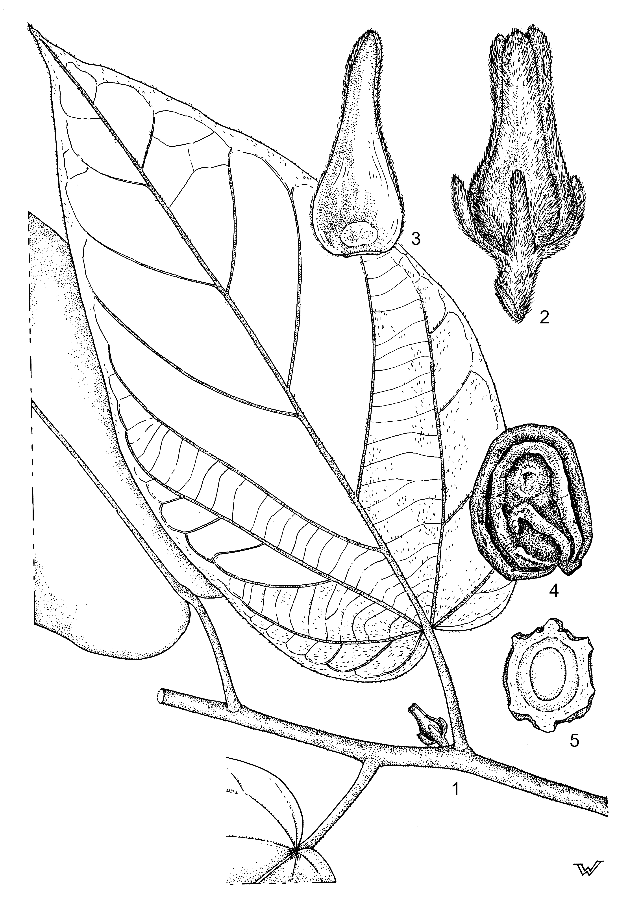
*Caption:* Planche 7 . Albertisia porcata : 1. Tige florifère (× ¾). – 2. Fleur (× 3½). – 3. Sépale interne, face inté - rieure (× 3½). – 4. Fruit (× ¾). – 5. Idem, section transversale (× ¾). (1-5 : Breteler et al. 10.000 ). Dessin par Wil Wessel-Brand, Naturalis Biodiversity Center (©), reproduit avec permission à partir de Breteler (1990).

---

## Figure 56 (page 39)
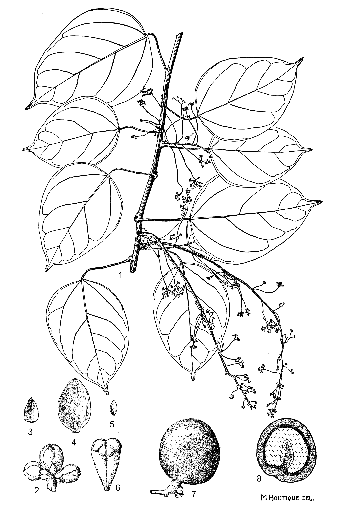
*Caption:* Planche 8 . Beirnaertia cabindensis : 1. Rameau florifère mâle (× ½). – 2. Cymule de fleurs mâle (× 5). – 3. Sépale externe de la fleur mâle (× 10). – 4. Sépale interne de la fleur mâle (× 10). – 5. Pétale de la fleur mâle (× 10). – 6. Étamines, face intérieure (× 10). – 7. Méricarpe (× ½). – 8. Idem, coupe longitudinale (× ½). (1-6 : J. Louis 3183 ; 7, 8 : J. Louis 3967 ). Dessin par M. Boutique, Jardin botanique de Meise (©), reproduit à partir de Troupin (1962).

---

## Figure 57 (page 41)
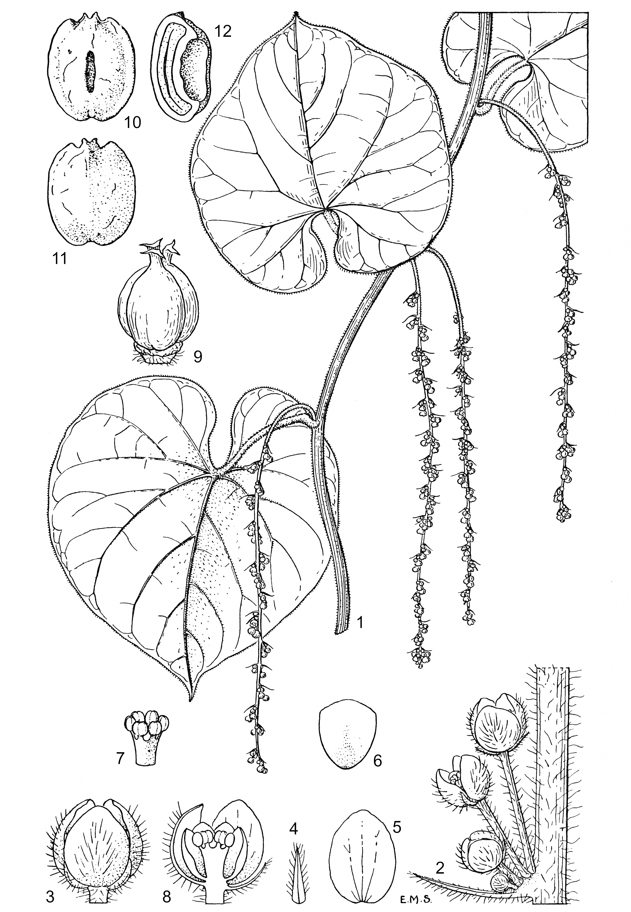
*Caption:* Planche 9 . Chasmanthera dependens : 1. Rameau florifère mâle (× ½). – 2. Cymule mâle (× 4). – 3.

---

## Figure 58 (page 43)
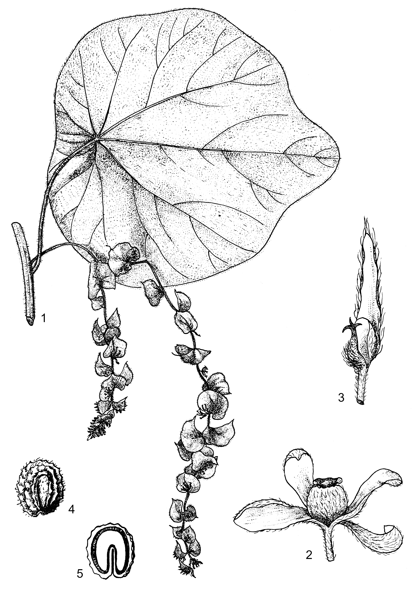
*Caption:* Planche 10 . Cissampelos owariensis : 1. Tige florifère femelle (× 1). – 2. Fleur mâle (× 20). – 3. Fleur femelle (× 20). – 4. Graine. – 5. Idem, coupe longitudinale. Dessin par Evangelina Benvenuto (1-3),

---

## Figure 59 (page 45)

*Caption:* Planche 11 . Dialytheca gossweileri : 1. Tige florifère mâle. – 2. Fleur mâle. – 3. Idem, tous les sépales en - levés, sauf un externe. (1-3 : Bissiengou 371 ). Dessin par Esmée Winkel, Naturalis Biodiversity Center (©).

---

## Figure 60 (page 47)
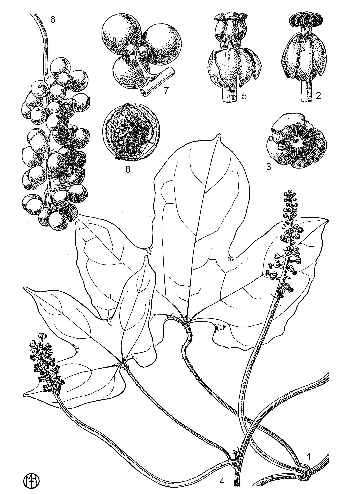
*Caption:* Planche 12 . Dioscoreophyllum volkensii : 1. Tige florifère mâle (× 1). – 2. Fleur mâle (× 7). – 3. Idem, vue apicale (× 7). – 4. Tige florifère femelle (× 1). – 5. Fleur femelle (× 7). – 6. Infrutescence (× 1). – 7.

---

## Figure 61 (page 48)
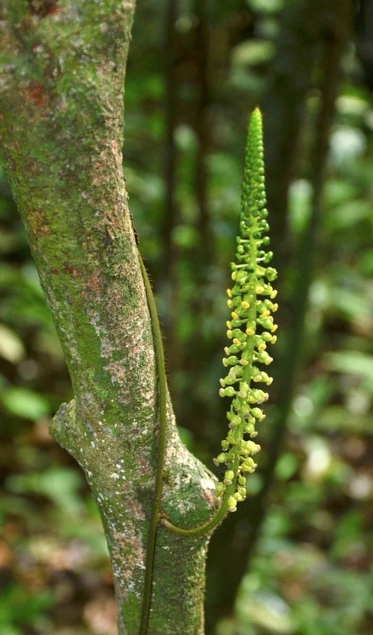
*Caption:* Figure 5 . Dioscoreophyllum volkensii : A. Inflorescence ; B : Fleurs mâles. – Jateorhiza macrantha : C.

---

## Figure 62 (page 48)
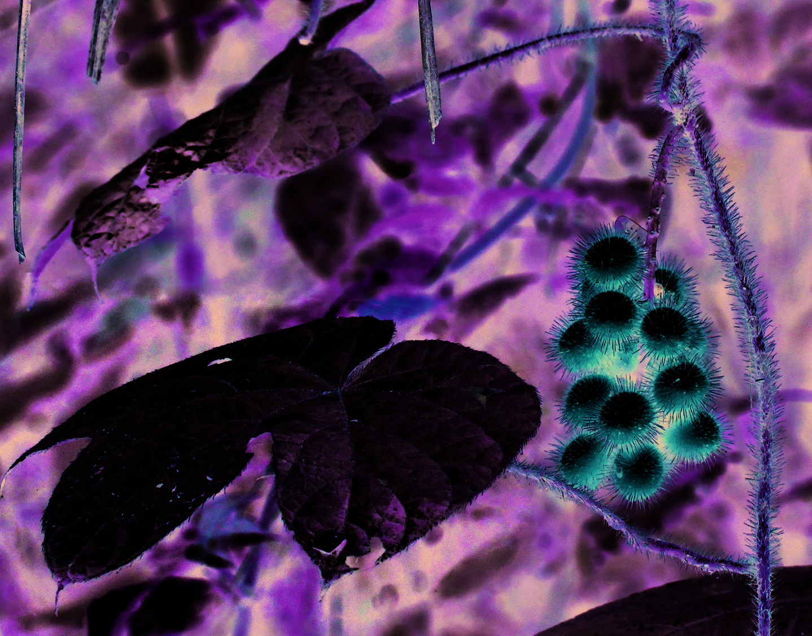
*Caption:* (no caption)

---

## Figure 63 (page 48)
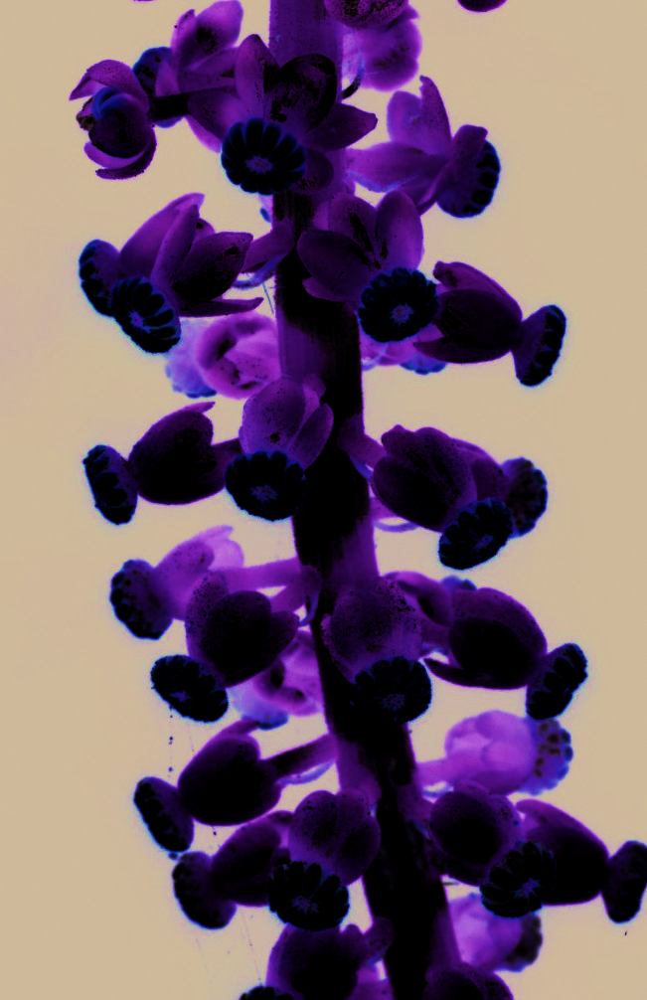
*Caption:* (no caption)

---

## Figure 64 (page 48)
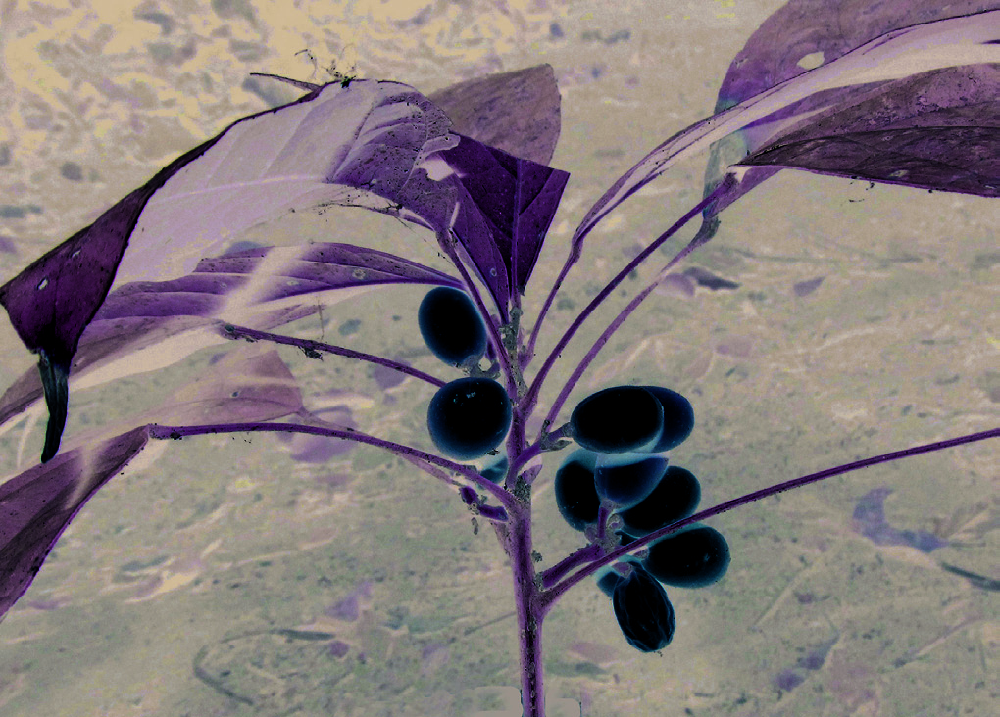
*Caption:* (no caption)

---

## Figure 65 (page 50)

*Caption:* Planche 13 . Jateorhiza macrantha : 1. Tige florifère mâle (× ½). – 2. Inflorescence femelle (× ½). – 3.

---

## Figure 66 (page 52)

*Caption:* Planche 14 . Kolobopetalum auriculatum : 1-3. Variation des feuilles. – 4. Tige feuillée. – 5. Inflorescence mâle. – 6. Inflorescence femelle. – 7. Fleur mâle. – 8. Androcée. – 9. Étamines, vues ventrale et latérale. – 10. Gynécée. – 11. Sépale interne, pétale interne et staminode, vues latérale et ventrale. – 12. Infrutes - cence. – 13. Méricarpe, coupe longitudinale. Dessin par Hans de Vries (1-3), Jardin botanique de Meise (©), et par dessinateur inconnu (4-13), respectivement reproduit à partir de Breteler (2021) et Diels (1910).

---

## Figure 67 (page 54)

*Caption:* Planche 15 . Kolobopetalum synsepalum : 1. Tige florifère mâle. – 2. Partie d’une inflorescence mâle. – 3.

---

## Figure 68 (page 56)
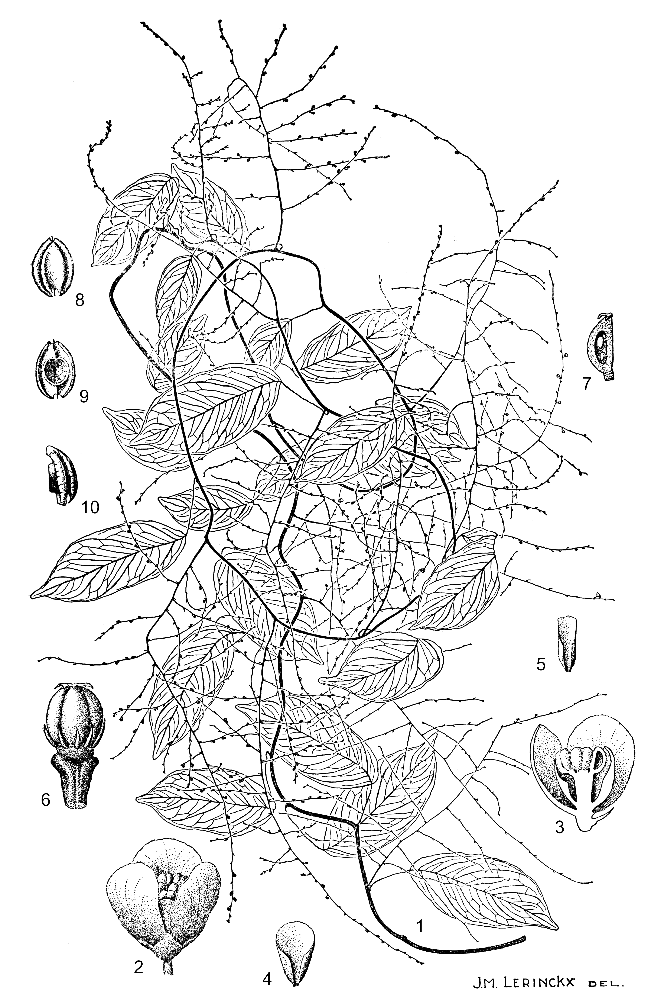
*Caption:* Planche 16 . Leptoterantha mayumbensis : 1. Tige florifère mâle (× ⅓). – 2. Fleur mâle (× 7). – 3. Idem, coupe longitudinale (× 7). – 4. Pétale externe de la fleur mâle (× 7). – 5. Pétale interne de la fleur mâle (× 7). – 6. Gynécée et staminodes (× 7). – 7. Carpelle, coupe longitudinale (× 7). – 8. Endocarpe, face dorsale (× ½). – 9. Idem, face ventrale (× ½). – 10. Idem, vu de profil (× ½). (1-5 : Staner 1569 ; 6, 7 :

---

## Figure 69 (page 58)
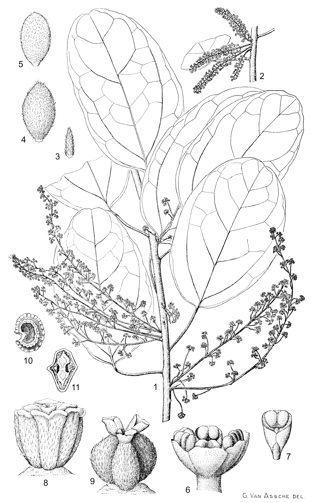
*Caption:* Planche 17 . Limaciopsis loangensis : 1. Tige florifère mâle (× ½). – 2. Idem, femelle (× ½). – 3. Bractée de la fleur mâle (× 10). – 4. Sépale externe de la fleur mâle (× 10). – 5. Idem, sépale interne (× 10). – 6.

---

## Figure 70 (page 60)
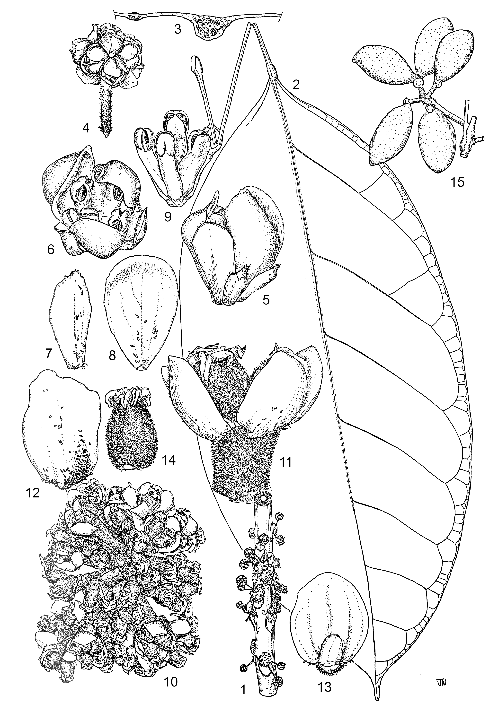
*Caption:* Planche 18 . Penianthus longifolius : 1. Inflorescences mâles (× ⅔). – 2. Feuille (× ⅔). – 3. Limbe foliaire, section transversale montrant la nervure principale et une latérale (× 4). – 4. Capitule mâle (× 3). – 5.

---

## Figure 71 (page 62)
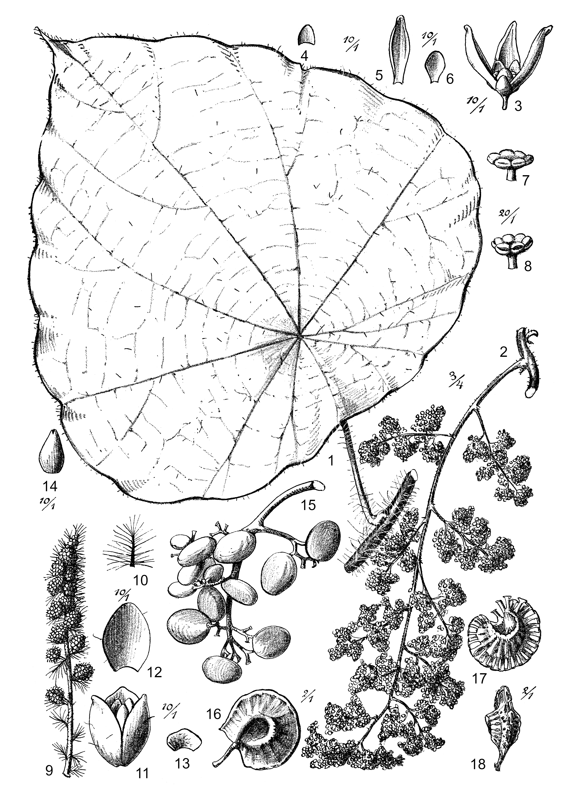
*Caption:* Planche 19 . Perichasme laetificata : 1. Feuille. – 2. Inflorescence mâle. – 3. Fleur mâle. – 4. Sépale externe de la fleur mâle. – 5. Idem, sépale interne. – 6. Pétale de la fleur mâle. – 7, 8. Synandrie. – 9.

---

## Figure 72 (page 64)

*Caption:* Planche 20 . Rhigiocarya racemifera : 1. Feuille avec détail de la base du limbe, face inférieure. – 2.

---

## Figure 73 (page 65)
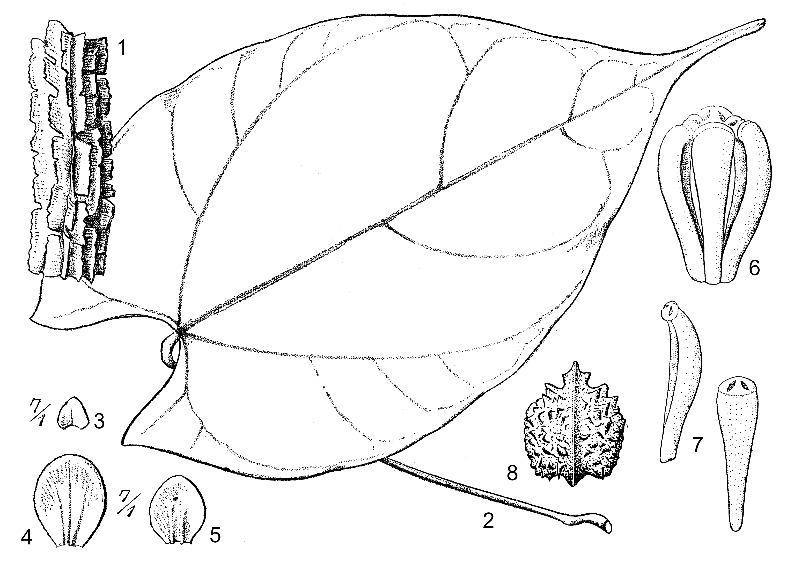
*Caption:* Planche 21 . Sarcolophium suberosum : 1. Partie d’un rameau subéreux. – 2. Feuille. – 3. Sépale externe de la fleur mâle. – 4. Idem, sépale interne. – 5. Pétale de la fleur mâle. – 6. Androcée. – 7. Étamines, vue frontale et latérale. – 8. Endocarpe. Dessin par un dessinateur inconnu, reproduit à partir de Diels (1910 ; 1-5) et de Troupin (1960 ; 6-8).

---

## Figure 74 (page 67)

*Caption:* Planche 22 . Stephania dinklagei : 1. Tige feuillée. – 2. Inflorescence mâle. – 3. Fleur mâle. – 4. Idem, 3 sépales enlevés. – 5. Fruit séché montrant la forme de l’endocarpe à l’intérieur. (1, 5 : Leeuwenberg 9672 ; 2-4 : van Andel et al. 3681 ). Dessin par Esmée Winkel, Naturalis Biodiversity Center (©).

---

## Figure 75 (page 69)

*Caption:* Planche 23 . Synclisia oligogyna : 1. Tige feuillée. – 2. Feuille, face inférieure. – 3. Fleur femelle. (1-3 :

---

## Figure 76 (page 71)
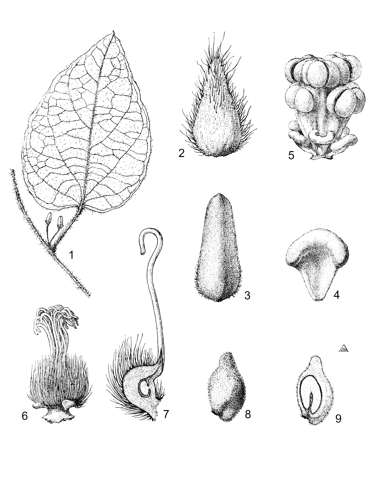
*Caption:* Planche 24 . Synclisia scabrida : 1. Tige florifère mâle (× ½). – 2. Sépale externe de la fleur mâle (× 20). – 3. Idem, sépale interne (× 7). – 4. Pétale de la fleur mâle, face intérieure (× 25). – 5. Pétales et androcée (× 15). – 6. Gynécée (× 8). – 7. Carpelle, coupe longitudinale (× 15). – 8. Méricarpe (× 1⅓). – 9. Idem, coupe longitudinale (× 1⅓). (1-5 : Germain 4895 ; 6, 7 : Germain 4598 ; 8, 9 : J. Léonard 1675 ). Dessin par G. Van Assche, Jardin botanique de Meise (©).

---

## Figure 77 (page 73)
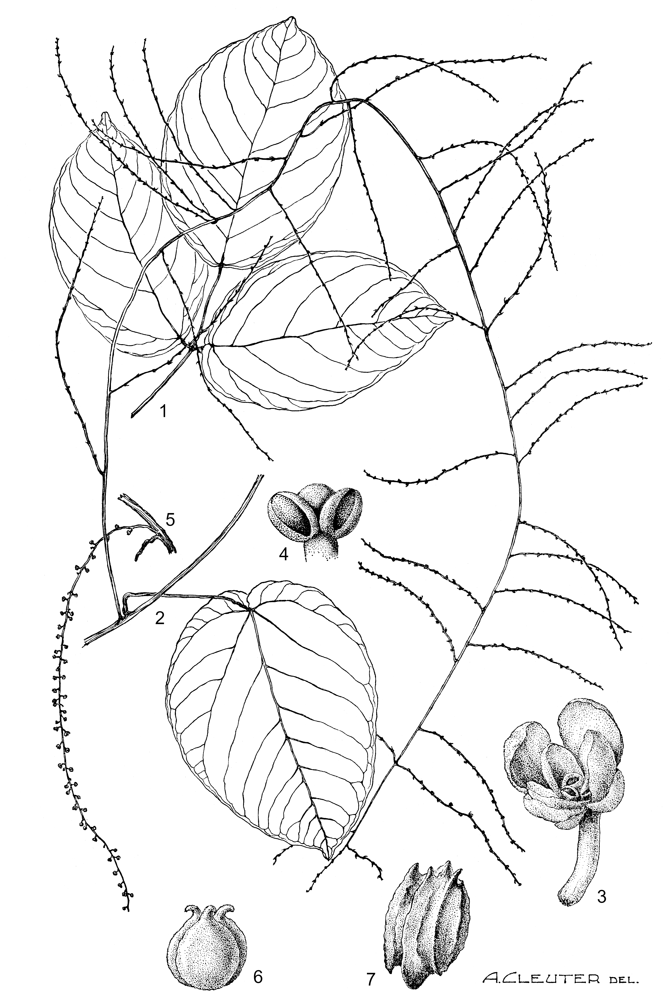
*Caption:* Planche 25 . Syntriandrium preussii : 1. Feuille trifoliolée (× ½). – 2. Tige florifère mâle (× ½). – 3. Fleur mâle (× 15). – 4. Étamines (× 40). – 5. Inflorescence femelle (× ½). – 6. Carpelles (× 40). – 7. Endocarpe (× 1⅔). (1-4 : J. Louis 2267 ; 5, 6 : J. Louis 2748 ; 7 : J. Louis 7696 ). Dessin par A. Cleuter, Jardin bota - nique de Meise (©), reproduit à partir de Troupin (1962).

---

## Figure 78 (page 75)
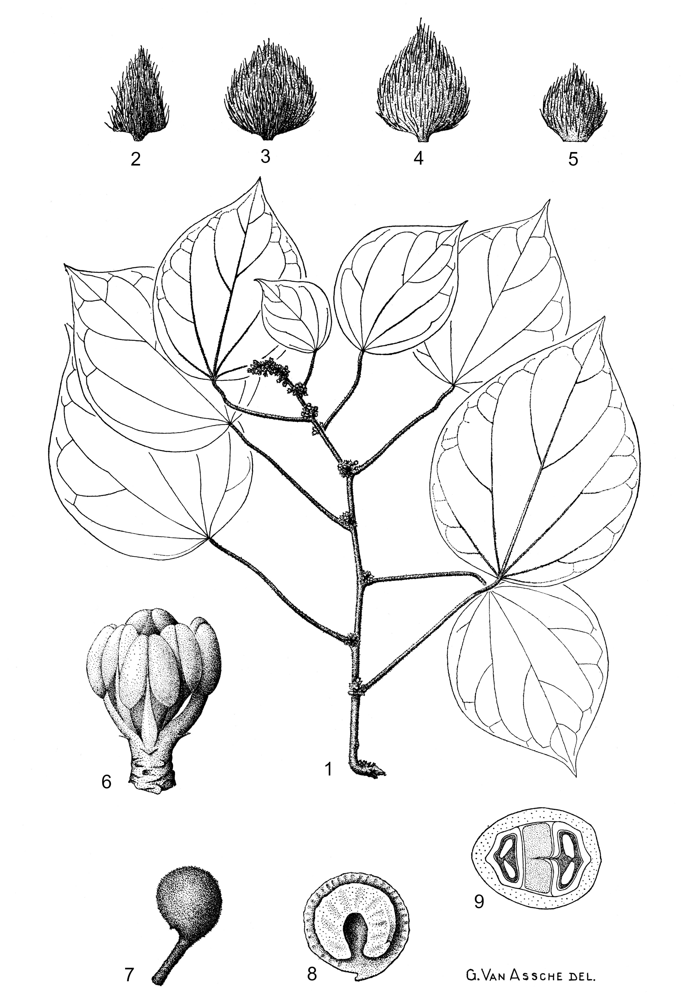
*Caption:* Planche 26 . Syrrheonema fasciculatum : 1. Tige florifère mâle (× ½). – 2-5 : Sépales de la fleur mâle, resp. des premier, deuxième, troisième ou quatrième et cinquième verticilles (× 10). – 6. Androcée (× 15). – 7. Méricarpe (× 1). – 8. Idem, coupe longitudinale (× 2). – 9. Idem, coupe transversale (× 2). (1 : De

---

## Figure 79 (page 77)
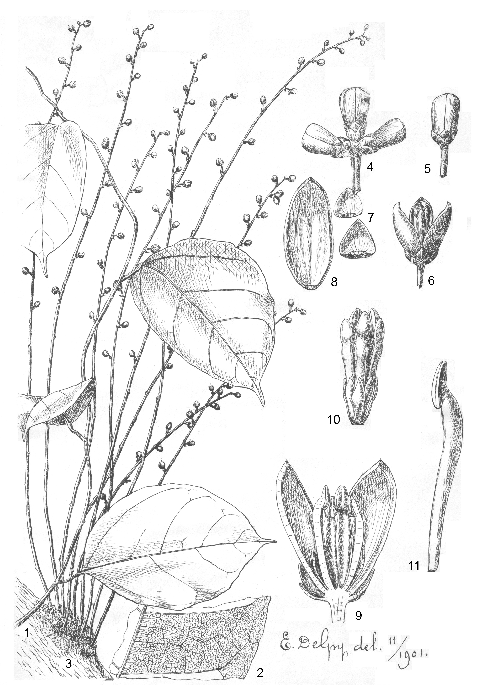
*Caption:* Planche 27 . Tiliacora klaineana (plante mâle) : 1. Tige feuillée. – 2. Détail de la nervation tertiaire. – 3.

---

## Figure 80 (page 78)
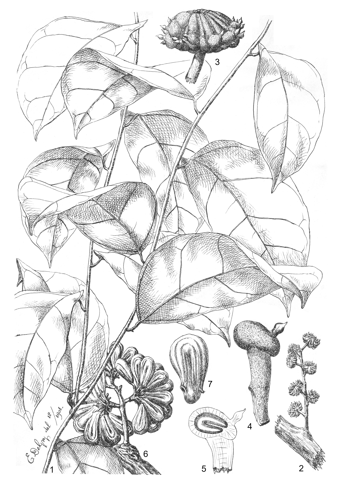
*Caption:* Planche 28 . Tiliacora klaineana (plante femelle) : 1. Tige feuillée. – 2. Inflorescence. – 3. Fleur. – 4.

---

## Figure 81 (page 80)
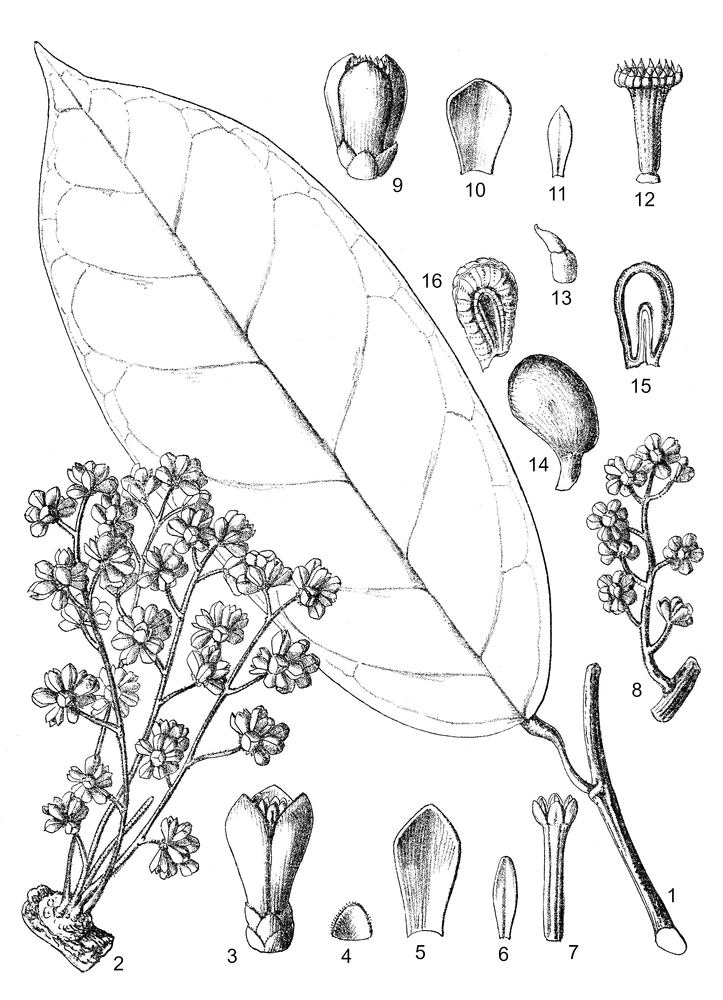
*Caption:* Planche 29 . Tiliacora macrophylla : 1. Feuille (× ½). – 2. Inflorescences mâles (× ½). – 3. Fleur mâle (× 5). – 4. Idem, sépale externe (× 5). – 5. Idem, sépale interne. – 6. Idem, pétale (× 5). – 7. Androcée (× 5). – 8. Inflorescence femelle (× ½). – 9. Fleur femelle (× 5). – 10. Idem, sépale interne (× 5). – 11.

---

## Figure 82 (page 82)

*Caption:* Planche 30 . Tinospora penninervifolia : 1. Tige florifère mâle. – 2. Inflorescence mâle. – 3. Fleur mâle. – 4. Idem, un sépale et deux pétales enlevés. (1-4 : Jongkind 5903 ). Dessin par Esmée Winkel, Naturalis

---

## Figure 83 (page 84)
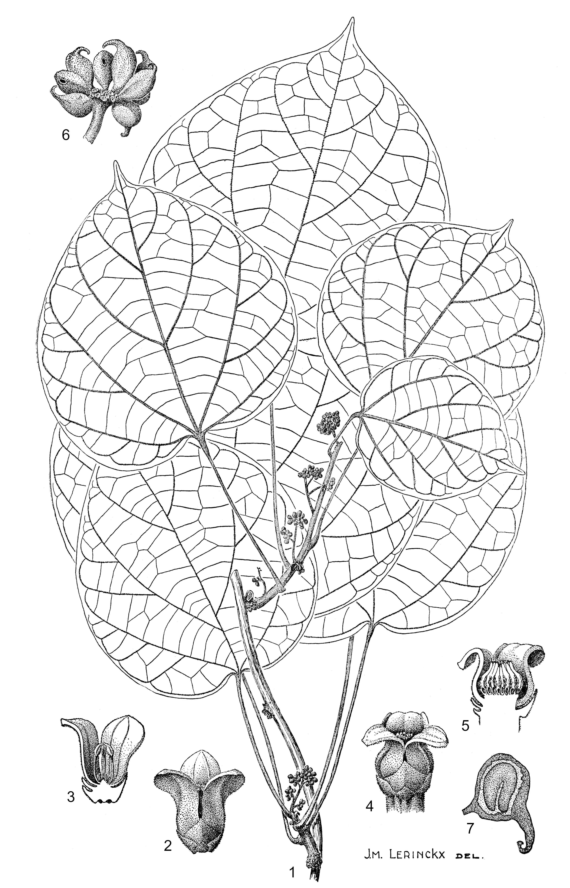
*Caption:* Planche 31 . Triclisia dictyophylla : 1. Tige florifère mâle (× ½). – 2. Fleur mâle (× 4). – 3. Idem, coupe longitudinale (× 4). – 4. Fleur femelle (× 4). – 5. Idem, coupe longitudinale (× 4). – 6. Fruit (× ½). – 7.

---

## Figure 84 (page 86)
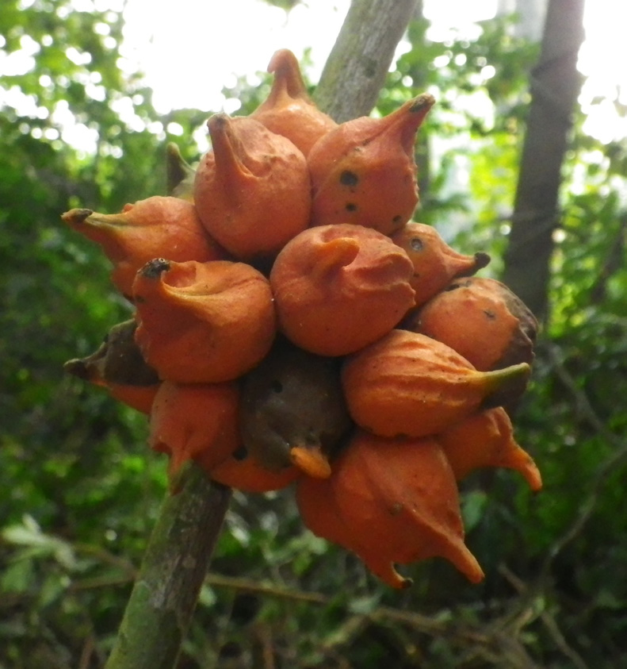
*Caption:* Figure 6 . Triclisia dictyophylla : A. Fruits. – Triclisia gabonensis : B. Plantule ; C. Cotylédons et testa séparés ; D. Pilosité à la base de la plantule. – Triclisia megacarpa : E. Fruits. Photos par Xander van der Burgt (A : Rép. dém. Congo, Ituri, colline Asongo), H.C.D. de Wit (B-D : Pays-Bas, Wageningen, en culture) et Carel Jongkind (E : Guinée, Monts Nimba).

---

## Figure 85 (page 86)
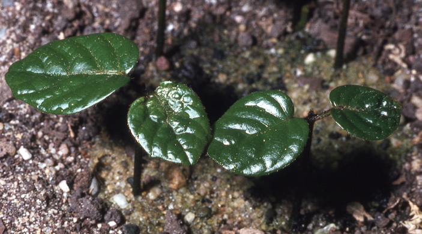
*Caption:* (no caption)

---

## Figure 86 (page 86)
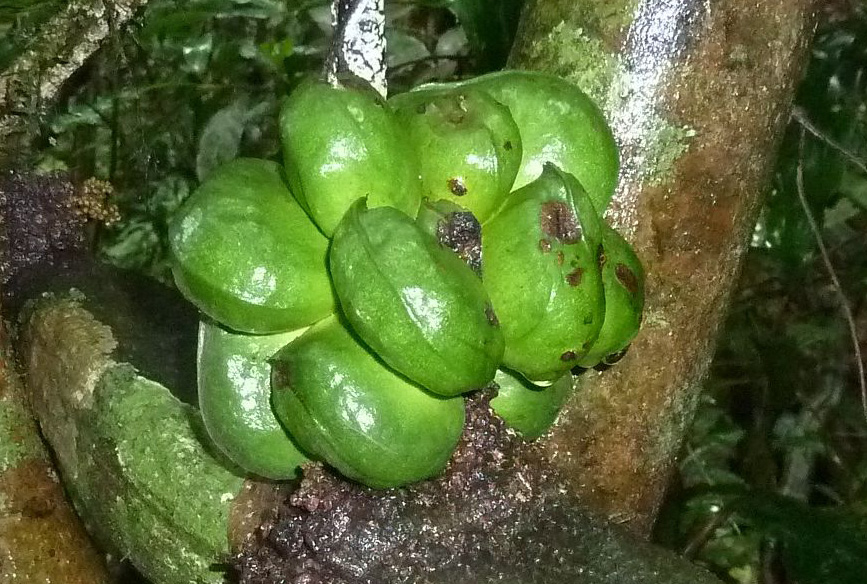
*Caption:* (no caption)

---

## Figure 87 (page 86)
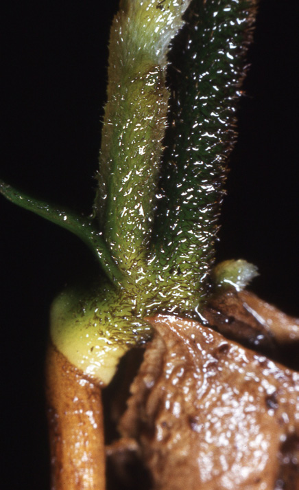
*Caption:* (no caption)

---

## Figure 88 (page 86)
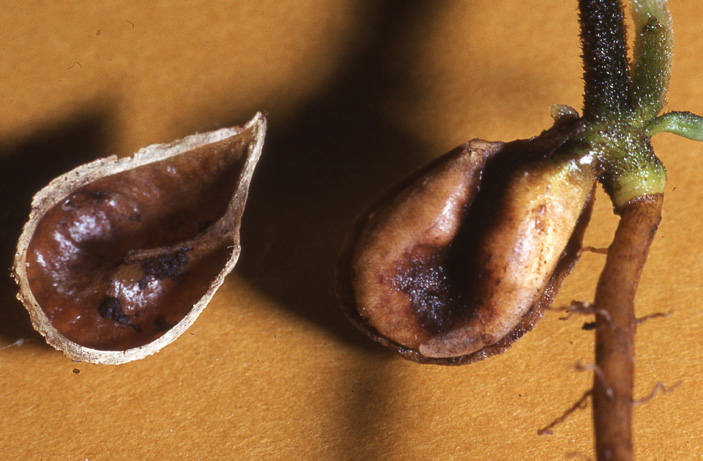
*Caption:* (no caption)

---

## Figure 89 (page 87)

*Caption:* Planche 32 . Triclisia gabonensis : 1. Tige feuillée. – 2. Feuille, face inférieure. – 3. Jeune infrutescence. – 4. Détail de la jonction du pétiole et du limbe, face inférieure. – 5. Fleur femelle. – 6. Idem, quelques sépales enlevés. – 7. Carpelle. – 8. Méricarpe. – 9. Endocarpe jeune, vue du dessous et du dos. – 10. Idem, vue latérale. – 11, 12. Endocarpe mûr, vue latérale. (1, 8, 9 : Bissiengou 407 ; 2-4, 10 : Breteler 6993 ; 5-7, 11 : A.M. Louis, Breteler & de Bruijn 638 ; 12 : J.J. de Wilde 8936 ). Dessin par Esmée Winkel, Naturalis

---

## Figure 90 (page 89)

*Caption:* Planche 33 . Triclisia megacarpa : 1. Feuille, face inférieure. – 2. Idem, détail de la pilosité. 3. – Mé - ricarpe. (1 : Wieringa 5115 ; 2, 3 : Jongkind 6450 ). Dessin par Esmée Winkel, Naturalis Biodiversity

---
