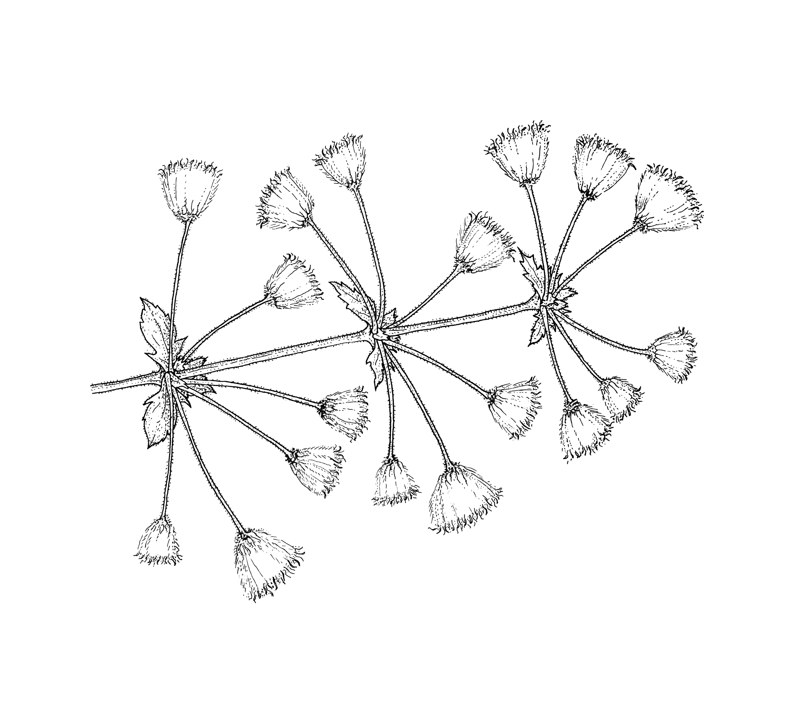
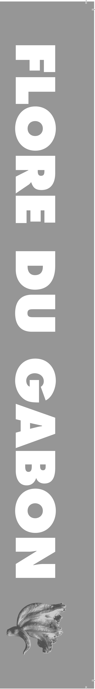
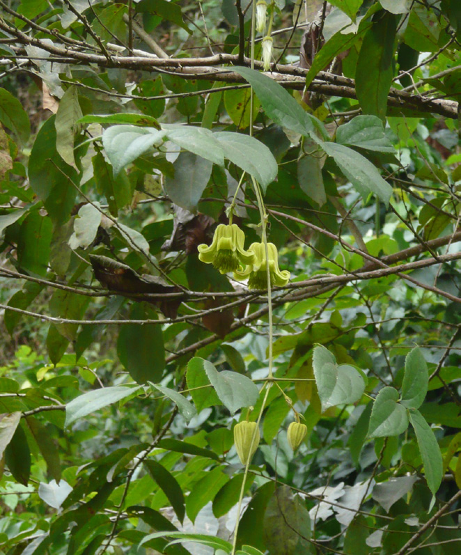
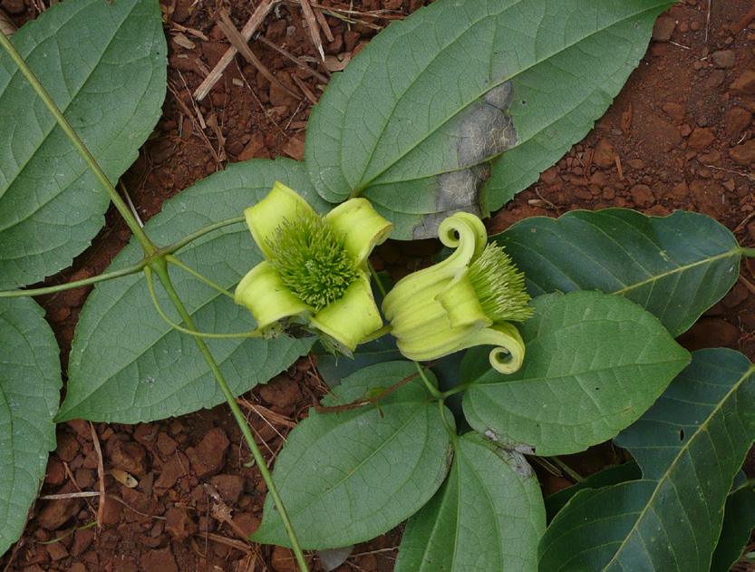
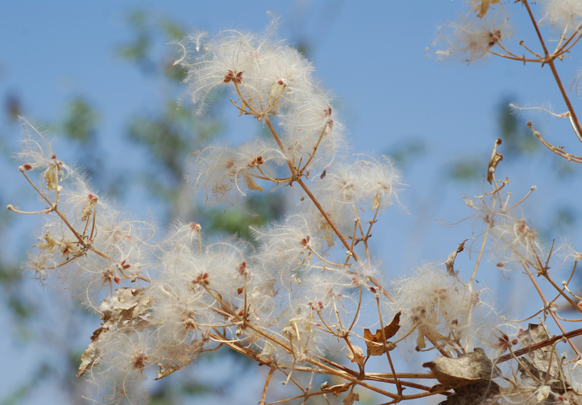
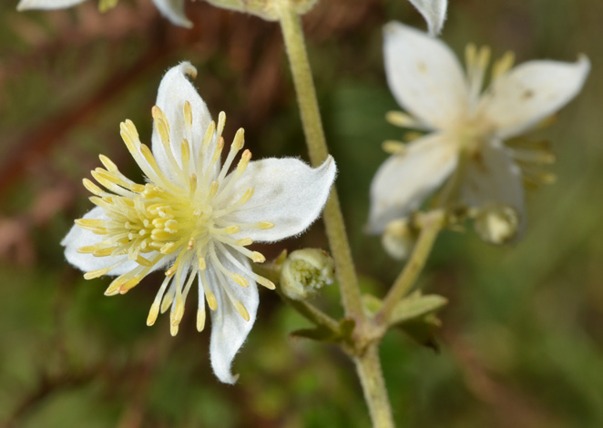
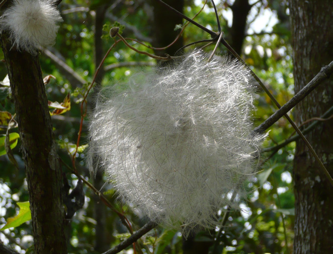
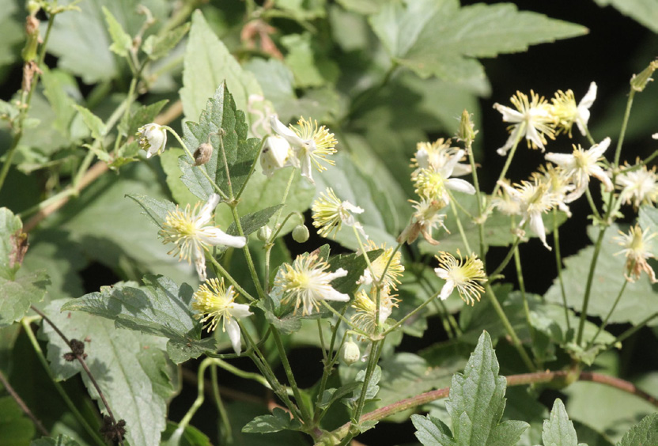

## Figure 91 (page 90)

*Caption:* (no caption)

---

## Figure 92 (page 90)

*Caption:* (no caption)

---

## Figure 93 (page 94)

*Caption:* Figure 7 . Clematis grandiflora : A. Tige florifère ; B. Fleurs et folioles vues du dessous ; C. Infrutescence. – Clematis hirsuta : D. Inflorescence ; E. Fleur ; F. Infrutescence. Photos par Carel Jongkind (A-C :

---

## Figure 94 (page 94)

*Caption:* (no caption)

---

## Figure 95 (page 94)

*Caption:* (no caption)

---

## Figure 96 (page 94)

*Caption:* (no caption)

---

## Figure 97 (page 94)

*Caption:* (no caption)

---

## Figure 98 (page 94)

*Caption:* (no caption)

---

## Figure 99 (page 95)

*Caption:* Planche 34 . Clematis hirsuta var. hirsuta : 1. Tige florifère (× ⅔). – 2. Jeune infrutescence (× ⅔). – 3.

---

## Figure 100 (page 104)

*Caption:* (no caption)

---

## Figure 101 (page 104)

*Caption:* (no caption)

---

## Figure 102 (page 104)

*Caption:* (no caption)

---

## Figure 103 (page 104)

*Caption:* (no caption)

---

## Figure 104 (page 104)

*Caption:* (no caption)

---

## Figure 105 (page 104)

*Caption:* (no caption)

---
