## Figure 0 (page 2)

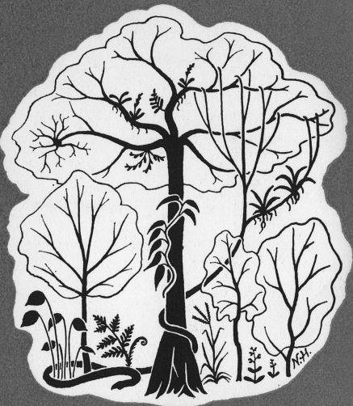

*Caption:* *(no caption detected)*

---

## Figure 1 (page 4)

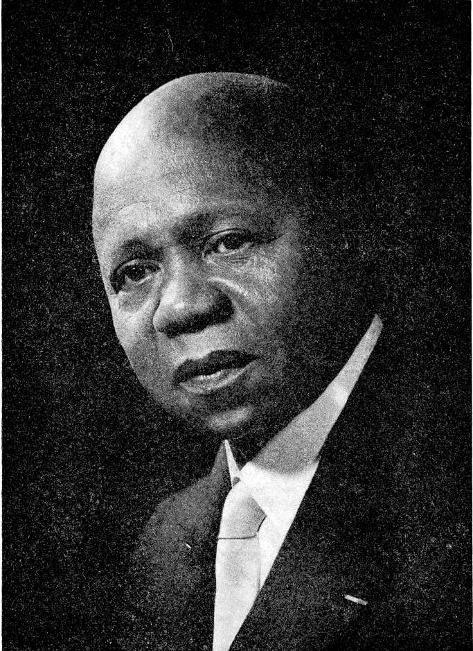

*Caption:* *(no caption detected)*

---

## Figure 2 (page 5)

*Caption:* *(no caption detected)*

---

## Figure 3 (page 13)

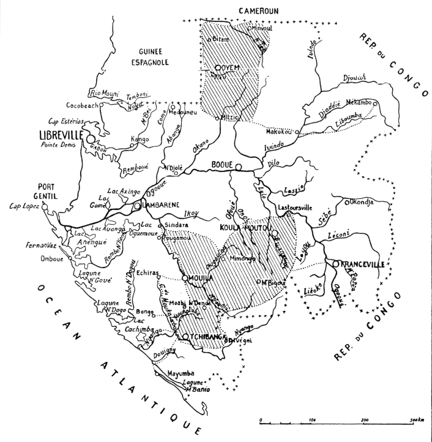

*Caption:* *(no caption detected)*

---

## Figure 4 (page 33)

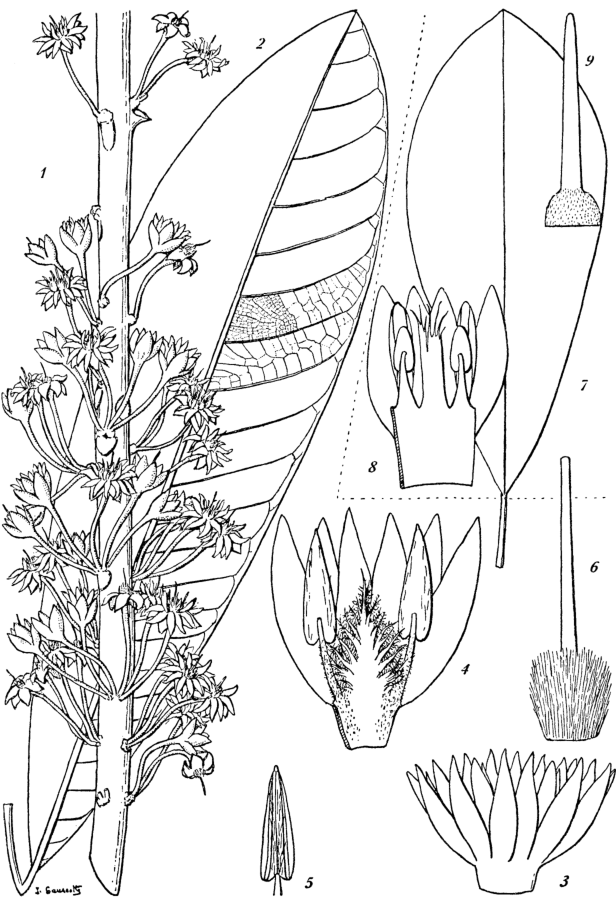

*Caption:* PL. I. — Manilkara Le-Testui Aubr. et Pellegr. : 1, rameau florifère × 2/3; 2, feuille × 1/2; 3, corolle (fleur jeune) × 3; 4, fragment de corolle × 5; 5, anthère × 5; 6, pistil × 5. — Manilkara Fouilloyana Aubr. et Pellegr. : 7, feuille × 2/3; 8, fragment de corolle × 5; 9, pistil × 5.

---

## Figure 5 (page 39)

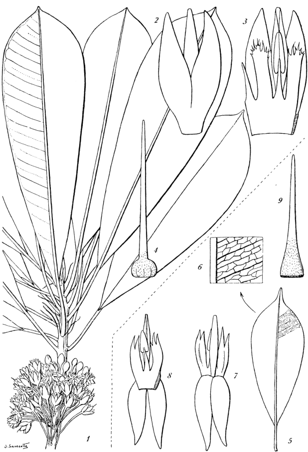

*Caption:* PL. II. — Manilkara Pellegriniana Tisserant et Sillans : 1, rameau florifère × 2 /3; 2, fragment de corolle vu de l'extérieur × 6; 3, fragment de corolle vu de l'intérieur × 6; 4, pistil × 6. — Manilkara microphylla Aubr. et Pellegr. : 5, feuille × 2 /3; 6, détail de la nervation; 7, fragment de corolle vu de l'extérieur × 6; 8, fragment de corolle vu de l'intérieur × 6; 9, pistil × 6.

---

## Figure 6 (page 43)

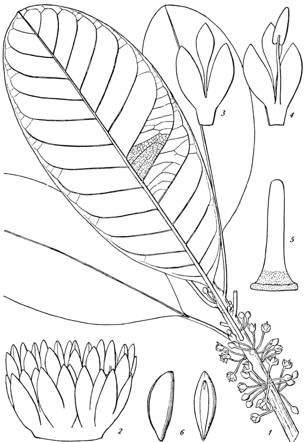

*Caption:* PL. III. — Letestua durissima H. Lec. : 1, rameau florifère × 2/3; 2, corolle × 8; 3, fragment de corolle vu de l'extérieur × 8; 4, fragment de corolle vu de l'intérieur × 8; 5, pistil × 8.

---

## Figure 7 (page 45)

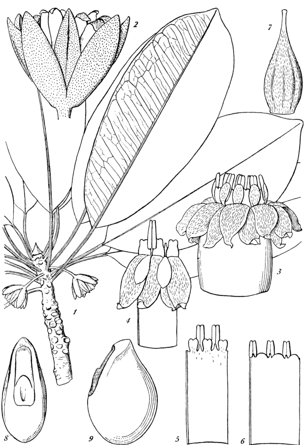

*Caption:* PL. IV. — Autranella congolensis (De Wild.) A. Chev.: 1, rameau florifière × 2 /3; 2, fleur × 3; 3, corolle × 4; 4, fragment de corolle vu de l'extérieur × 4; 5, fragment de corolle vu de l'intérieur (n° 1071) × 4; 6, fragment de corolle vu de l'intérieur (n° 6502) × 4; 7, pistil × 4; 8, graine de face × 2 /3; 9, graine de profil × 2 /3.

---

## Figure 8 (page 51)

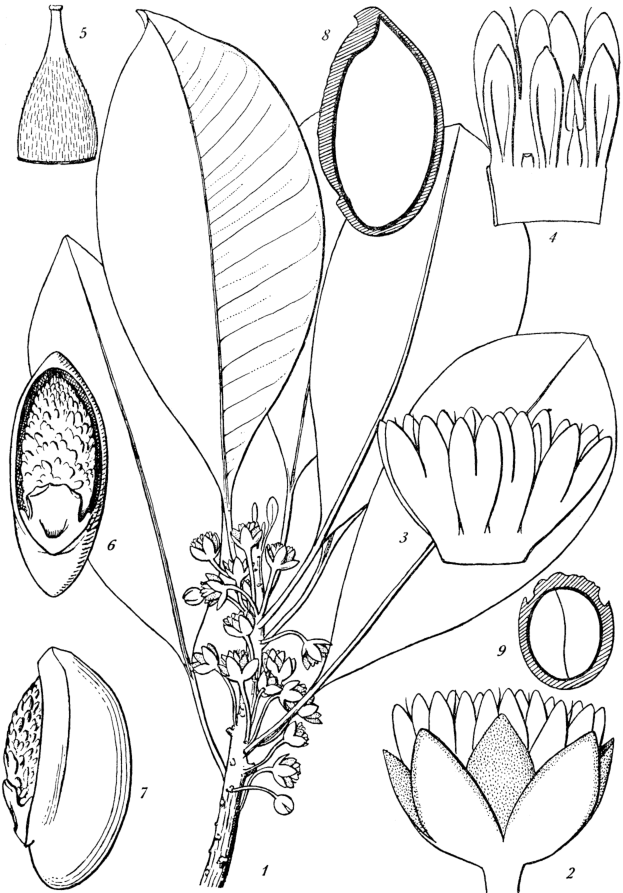

*Caption:* PL. V. — Tieghemella africana Pierre : 1, rameau florifère; 2, fleur × 4; 3, corolle × 4; 4, fragment de corolle × 6; 5, pistil × 6; 6, graine de face × 2/3; 7, graine, de profil × 2/3; 8, coupe longitudinale × 2/3; 9, coupe transversale × 2/3.

---

## Figure 9 (page 53)

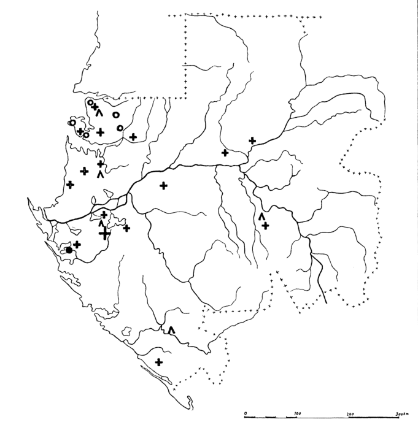

*Caption:* CARTE 2

---

## Figure 10 (page 57)

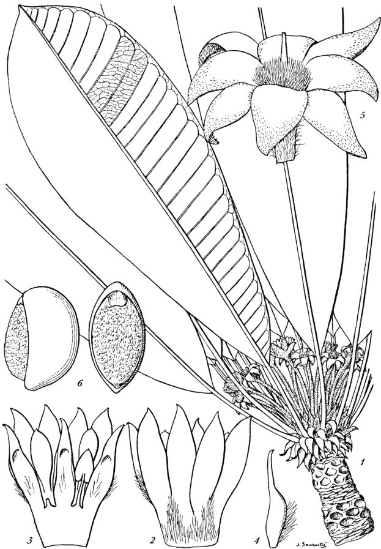

*Caption:* PL. VI. — Baillonella toxisperma Pierre : 1, rameau florifère × 2/3; 2, fragment de corolle vu de l'extérieur × 5; 3, fragment de corolle vu de l'intérieur × 5; 4, stamineode de profil; 5, calice et pistil × 4; 6, graine de face et de profil × 2/3.

---

## Figure 11 (page 63)

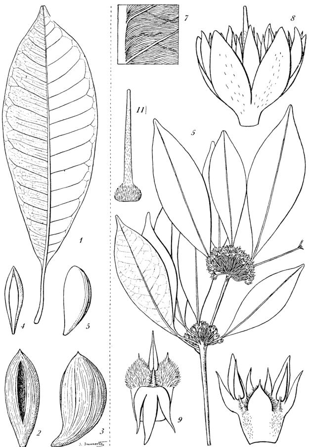

*Caption:* PL. VII. — Lecomtedoxa Klaineana Pierre : 1, feuille × 2 /3; 2, fruit de face × 1; 3, fruit de profil × 1; 4, graine de face × 1; 5, graine de profil × 1; Neolemonniera ogouensis (Pierre) Heine : 6, rameau florifère × 2 /3; 7, striations très grossies d'une feuille; 8, fleur × 8; 9, fragment de corolle vu de l'extérieur × 8; 10, fragment de corolle vu de l'intérieur × 8; 11, pistil × 8.

---

## Figure 12 (page 67)

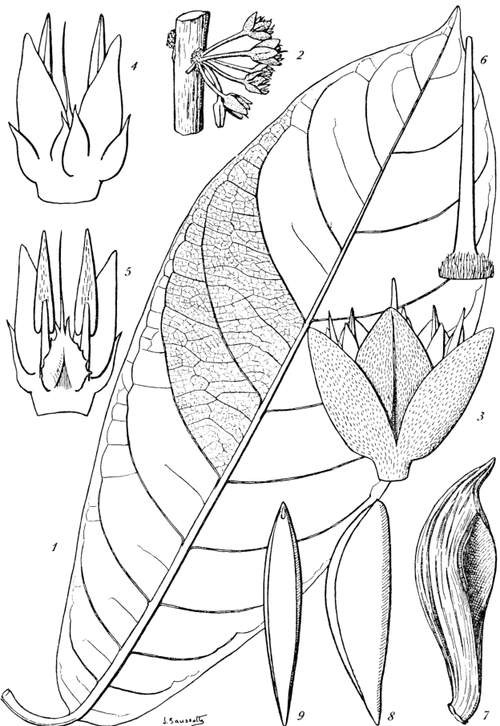

*Caption:* PL. VIII. — Lecomtedoxa Nogo (A. Chev.) Aubr. et Pellegr. : 1, feuille × 2/3; 2, inflorescence × 2/3; 3, fleur × 3; 4, fragment de corolle vu de l'extérieur × 4; 5, fragment de corolle vu de l'intérieur × 4; 6, pistil × 4; 7, fruit × 2/3; 8, graine de profil × 2/3; 9, graine de face × 2/3.

---

## Figure 13 (page 71)

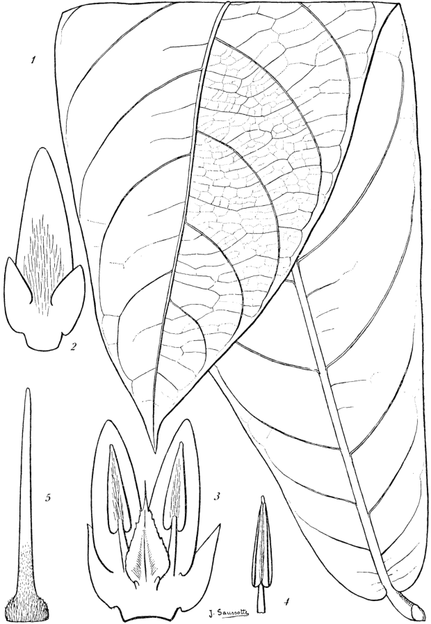

*Caption:* PL. IX. — Lecomtedoxa Biraudii Aubr. et Pellegr. : 1, feuille - × 2/3; 2, pétale et ses appendices vus de l'extérieur × 3; 3, fragment de corolle vu de l'intérieur × 3; 4, anthère face externe; 5, pistil × 3.

---

## Figure 14 (page 77)

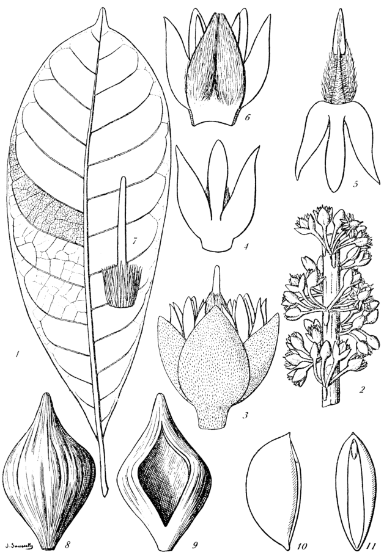

*Caption:* PL. X. — Gluema ivorensis Aubr. et Pellegr. : 1, feuille × 2/3; 2, fragment de rameau fleuri × 2/3; 3, fleur × 4; 4, fragment de corolle vu de l'extérieur × 4; 5, fragment de corolle vu de l'extérieur le pétale rabattu × 4; 6, fragment de corolle vu de l'intérieur × 4; 7, pistil × 4; 8-9, fruit de profil et de face × 2/3; 10-11, graine de profil et de face × 2/3.

---

## Figure 15 (page 81)

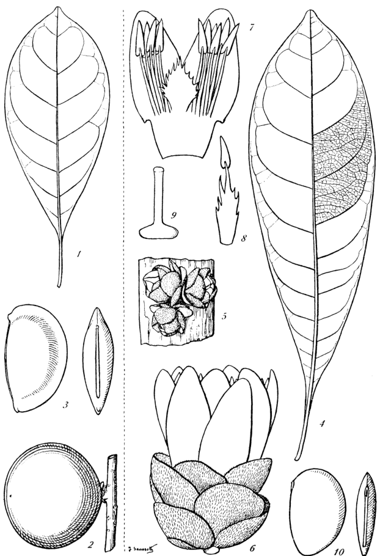

*Caption:* PL. XI. — Tridemostemon congoense (A. Chev.) Aubr. et Pellegr. : 1, feuille × 2 /3; 2, fruit × 2 /3; 3, graine de face et de profil × 2 /3. — Omphalocarpum procerum P. Beauv. : 4, feuille × 2 /3; 5, inflorescence × 2 /3; 6, fleur × 2; 7, fragment de corolle × 2; 8, staminode exceptionnel × 2; 9, pistil × 2; 10, graine de face et de profil × 2 /3.

---

## Figure 16 (page 85)

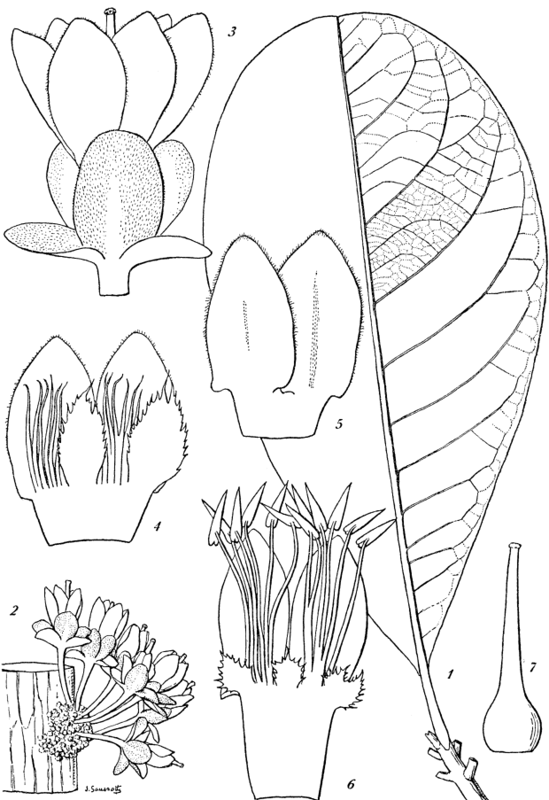

*Caption:* PL. XII. — Omphalocarpum Le-Testui Aubr. et Pellegr. : 1, feuille × 2 /3; 2, inflo-rescence × 2 /3; 3, fleur × 2; 4, fleur ♀ fragment de corolle vu de l'intérieur × 2; 5, fleur ♀ fragment de corolle vu de l'extérieur × 2; 6, fleur ♂, fragment de corolle vu de l'intérieur × 2; 7, pistil × 2.

---

## Figure 17 (page 87)

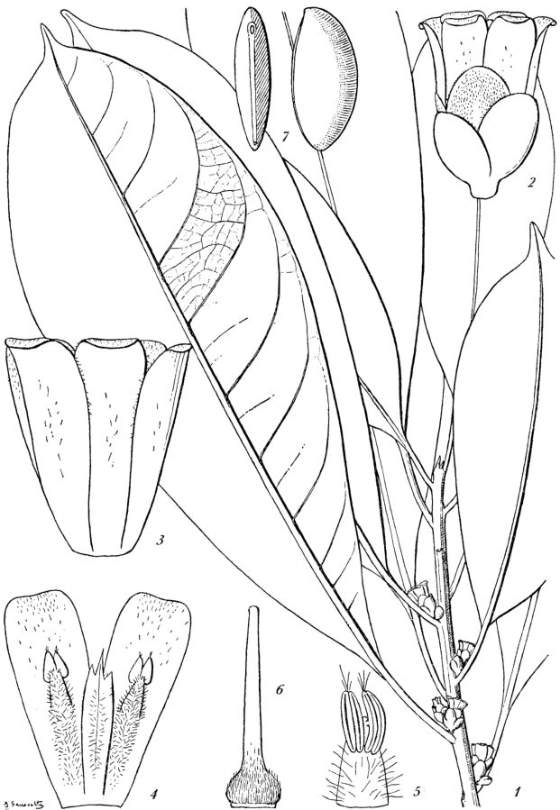

*Caption:* PL. XIII. — Tridemostemon omphalocarpoides Engl. : 1, rameau florifère × 2/3; 2, fleur × 3; 3, corolle × 4; 4, fragment de corolle × 4; 5, 2 anthères vues de l'extérieur, grossies; 6, pistil × 4; 7, graine de face et de profil × 2/3.

---

## Figure 18 (page 93)

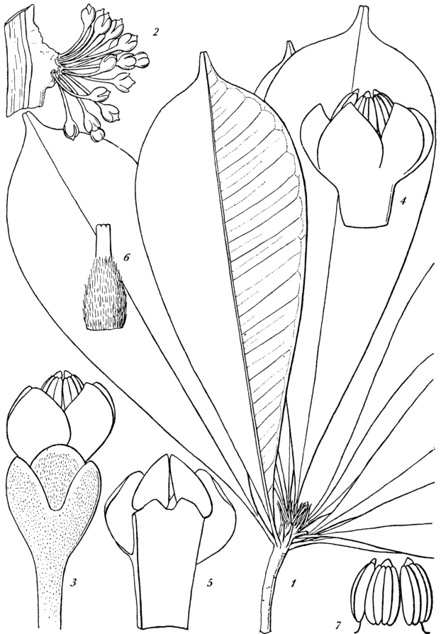

*Caption:* PL. XIV. — Englerophytum Hallei Aubr. et Pellegr. : 1, rameau feuillé × 2/3; 2, inflorescence × 2/3; 3, fleur × 4; 4, corolle × 4; 5, fragment de corolle vu de l'intérieur × 5; 6, pistil × 5; 7, détail de l'androcée.

---

## Figure 19 (page 97)

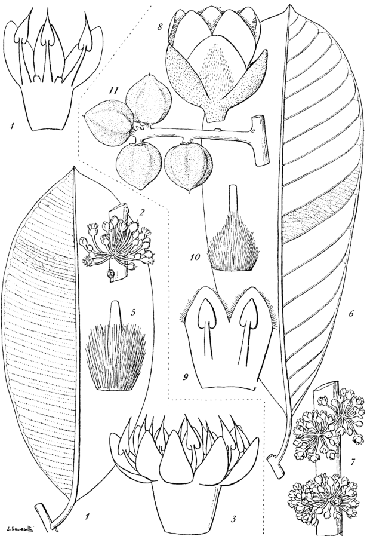

*Caption:* PL. XV. — Wildemaniodoxa Laurentii (De Wild.) Aubr. et Pellegr. : 1, feuille × 2/3; 2, inflorescence × 2/3; 3, corolle × 6; 4, fragment de corolle (vu de l'intérieur) × 6; 5, pistil × 6. — Gambeya boukokoensis Aubr. et Pellegr.: 6, feuille × 2/3; 7, inflorescences × 2/3; 8, fleur × 6; 9, fragment de corolle × 6; 10, pistil × 6; 11, fruits × 2/3.

---

## Figure 20 (page 99)

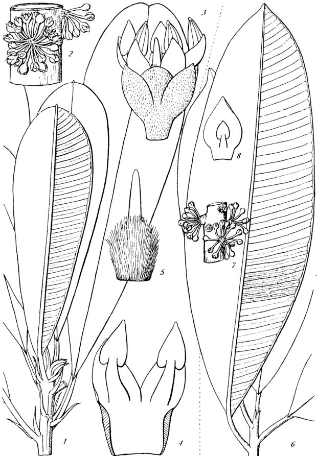

*Caption:* PL. XVI. — Zeyherella Le-Testui Aubr. et Pellegr. : 1, rameau feuillé × 2/3; 2, inflorescences × 2/3; 3, fleur × 4; 4, fragment de corolle × 6; 5, pistil × 6. — Zeyherella longepedicellata (De Wild.) Aubr. et Pellegr. : 6, rameau feuillé × 2/3; 7, inflorescences × 2/3; 8, fragment de corolle × 6.

---

## Figure 21 (page 101)

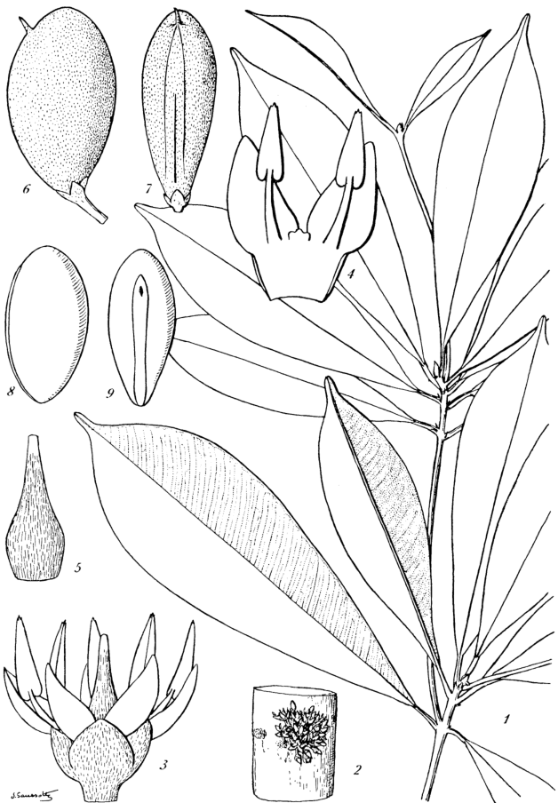

*Caption:* PL. XVII. — Zeyherella mayombense (Greves) Aubr. et Pellegr. : 1, rameau feuillé × 2/3; 2, inflorescence × 2/3; 3, fleur × 8; 4, fragment de corolle × 8; 5, pistil × 8; 6, fruit, de face × 2; 7, fruit de profil × 2; 8, graine de face × 2; 9, graine de profil × 2.

---

## Figure 22 (page 107)

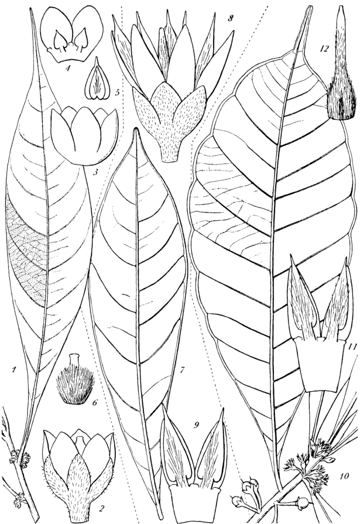

*Caption:* PL. XVIII. — Tulestea tomentosa Aubr. et Pellegr. : 1, rameau florifère × 2/3; 2, fleur × 6; 3, corolle × 6; 4, fragment de corolle × 6; 5, anthère, face externe × 10; 6, pistil × 6. — Tulestea gabonensis Aubr. et Pellegr. : 7, feuille × 2/3; 8, fleur × 6; 9, fragment de corolle × 6. — Tulestea koulamoutouensis Aubr. et Pellegr. : 10, rameau florifère × 2/3; 11, fragment de corolle × 6; 12, pistil × 6

---

## Figure 23 (page 111)

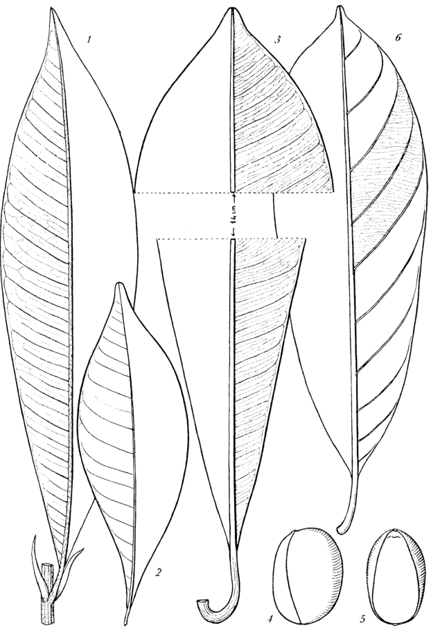

*Caption:* PL. XIX. — Englerophytum kouloungense Aubr. et Pellegr.: 1, feuille × 2/3. — Afrosersalisia Afzelii (Engl.) Aubr.: 2, feuille × 2/3; — Englerophytum Le-Testui Aubr. et Pellegr.: 3, fragments de la feuille × 2/3; 4, graine de profil; 5, graine de face. — Pachystela buluensis (Greves) Aubr. et Pellegr.: 6, feuilles × 2/3.

---

## Figure 24 (page 121)

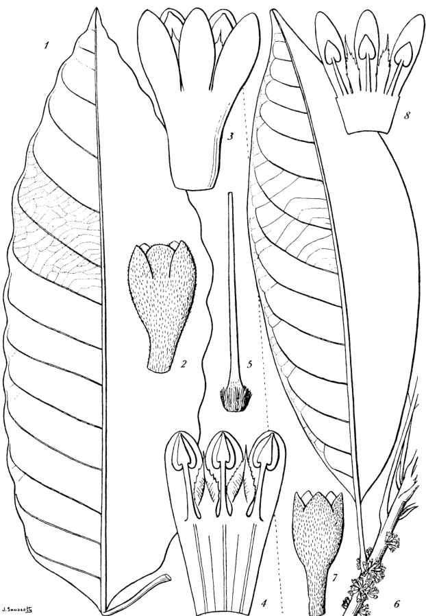

*Caption:* PL. XX. — Synsepalum Le-Testui Aubr. et Pellegr. : 1, feuille × 2/3; 2, calice × 6; 3, corolle × 6; 4, fragment de corolle vu de l'intérieur × 6; 5, pistil × 6; — Synsepalum Zenkeri Aubr. et Pellegr. : 6, rameau florifère × 2/3; 7, calice × 6; 8, fragment de corolle vu de l'intérieur × 6.

---

## Figure 25 (page 123)

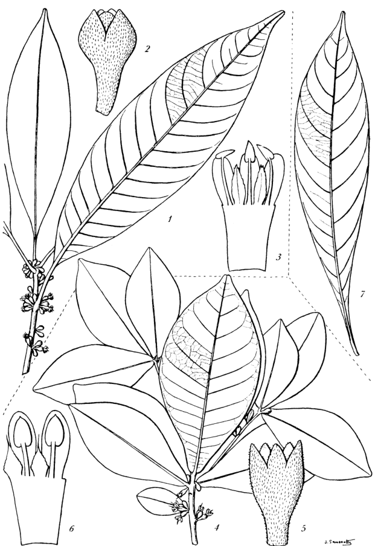

*Caption:* PL. XXI. — Synsepalum longecuneatum De Wild.: 1, rameau florifère × 2/3; 2, calice × 6; 3, fragment de corolle × 6. — Synsepalum dulcificum Daniell: 4, rameau florifère × 2/3; 5, calice × 6; 6, fragment de corolle × 6. — Synsepalum Fleuryanum A. Chev.: 7, feuille × 2/3.

---

## Figure 26 (page 127)

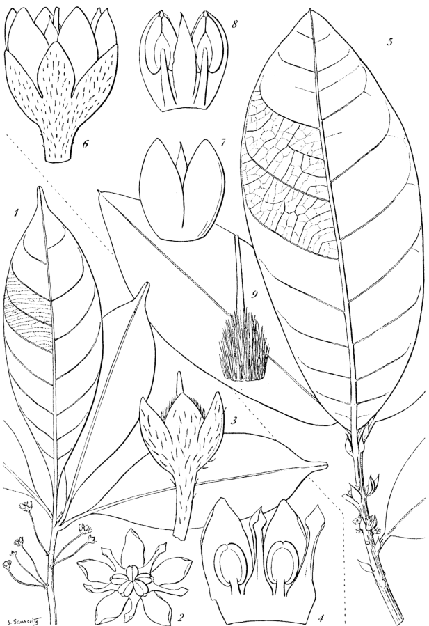

*Caption:* PL. XXII. — Vincentella ogouensis Aubr. et Pellegr. : 1, rameau florifère × 2 /3; 2, corolle × 4; 3, calice et pistil × 10; 4, fragment de corolle × 10. — Vincentella ocatostipulata (De Wild.) Aubr. et Pellegr. : 5, rameau florifère × 2 /3; 6, fleur × 10; 7, fragment de corolle vu de l'extérieur × 10; 8, fragment de corolle vu de l'intérieur × 10; 9, pistil × 10.

---

## Figure 27 (page 131)

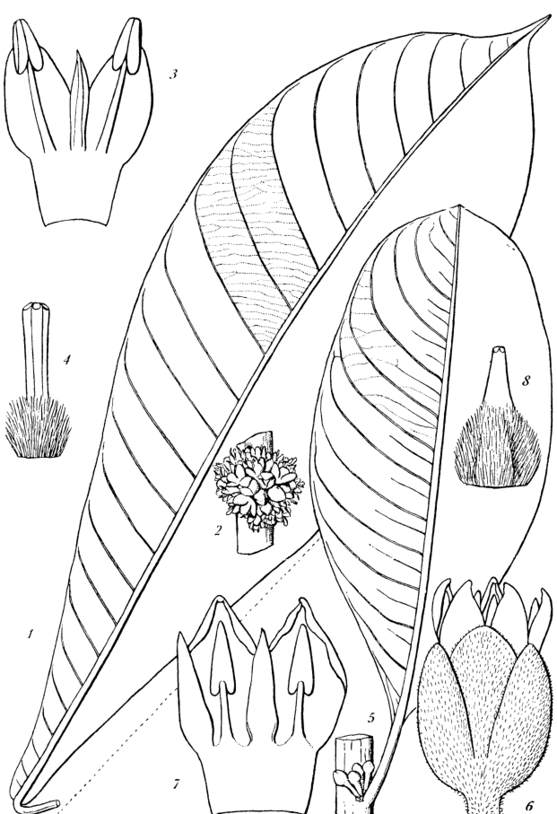

*Caption:* PL. XXIII. — Pseudopachystela lastoursvillensis Aubr. et Pellegr.: 1, feuille × 2/3; 2, inflorescence × 2/3; 3, fragment de corolle × 5; 4, pistil × 5. — Pseudopachystela oyemensis Aubr. et Pellegr.: 5, feuille et boutons floraux × 2/3; 6, fleur × 4; 7, fragment de corolle × 5; 8, pistil × 5.

---

## Figure 28 (page 141)

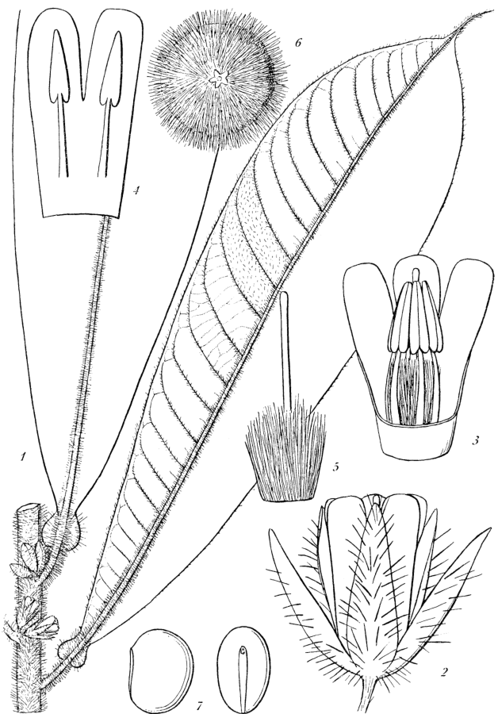

*Caption:* PL. XXIV. — Delpydora macrophylla Pierre : 1, rameau florifère × 2/3; 2, fleur × 3; 3, fleur avec 2 pétales enlevés pour montrer l'androcée × 4; 4, fragment de corolle × 4; 5, pistil × 4; 6, fruit × 1; 7, graine de profil et de face × 1.

---

## Figure 29 (page 147)

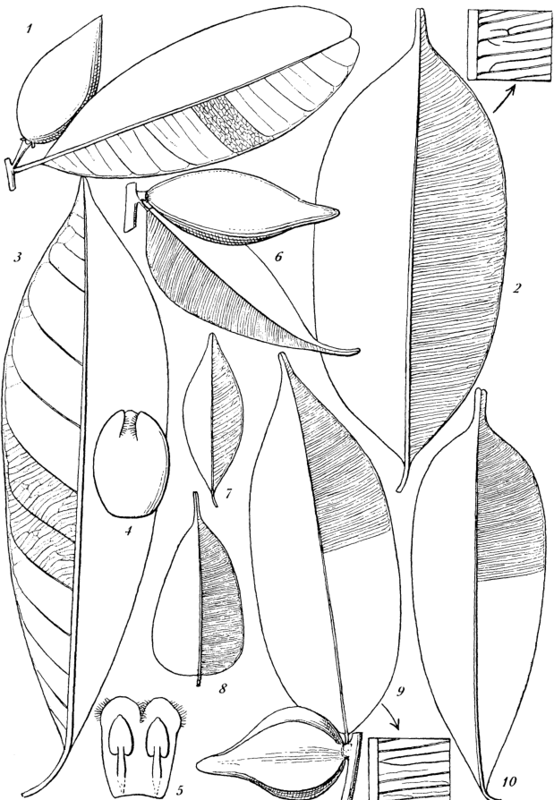

*Caption:* *(no caption detected)*

---

## Figure 30 (page 155)

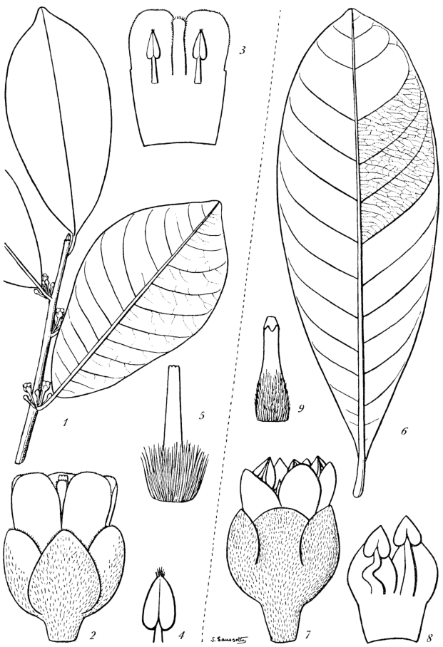

*Caption:* PL. XXVI. — Aningueria altissima (A. Chev.) Aubr. et Pellegr. : 1, rameau florifère × 2/3; 2, feuille × 8; 3, fragment de corolle × 8; 4, anthère × 16; 5, pistil × 8. — Gambeya nyangensis Pellegrin : 6, feuille × 2/3; 7, fleur × 8; 8, fragment de corolle × 8; 9, pistil × 8.