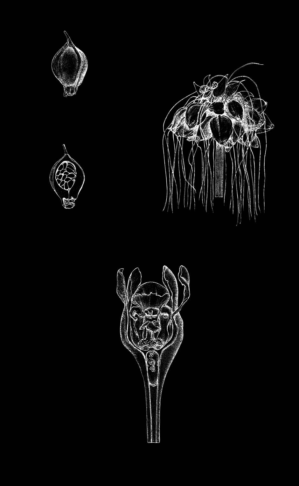
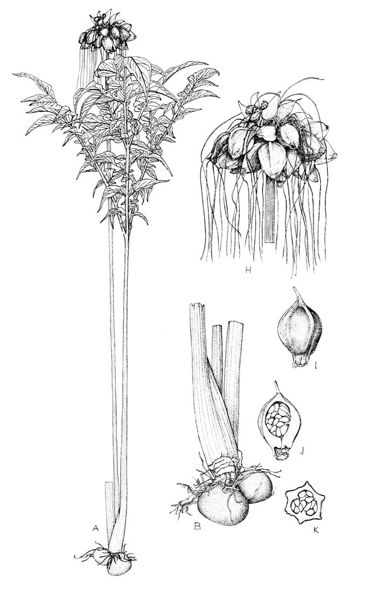
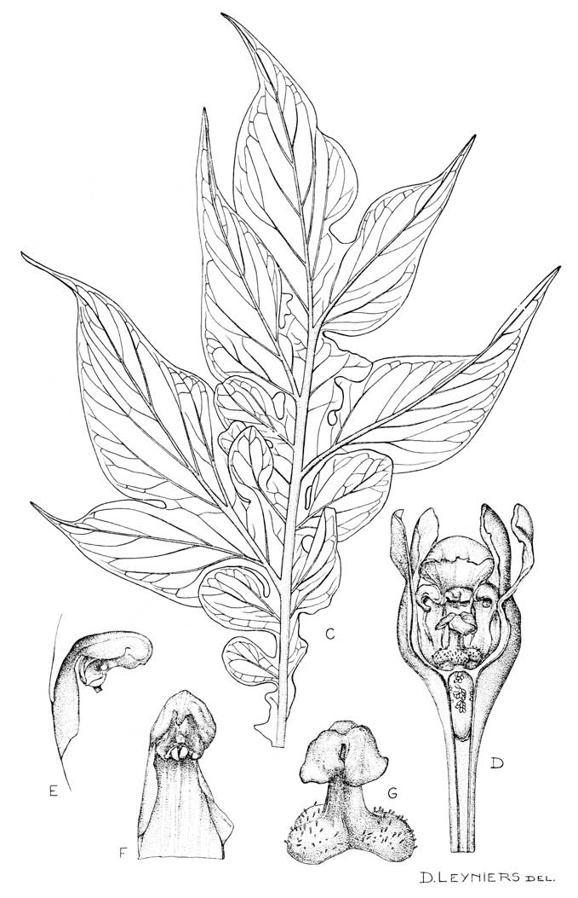

## Figure 32 (page 59)

*Caption:* (no caption)

---

## Figure 33 (page 62)

*Caption:* Planche 13. Tacca leontopetaloides : A. Plante entière. – B. Rhizome tubéreux et base de la plante. – C. Partie supérieure de la feuille. – D. Fleur, coupe longitudinale. – E. Étamine, vue de profil. – F.

---

## Figure 34 (page 63)

*Caption:* (no caption)

---
