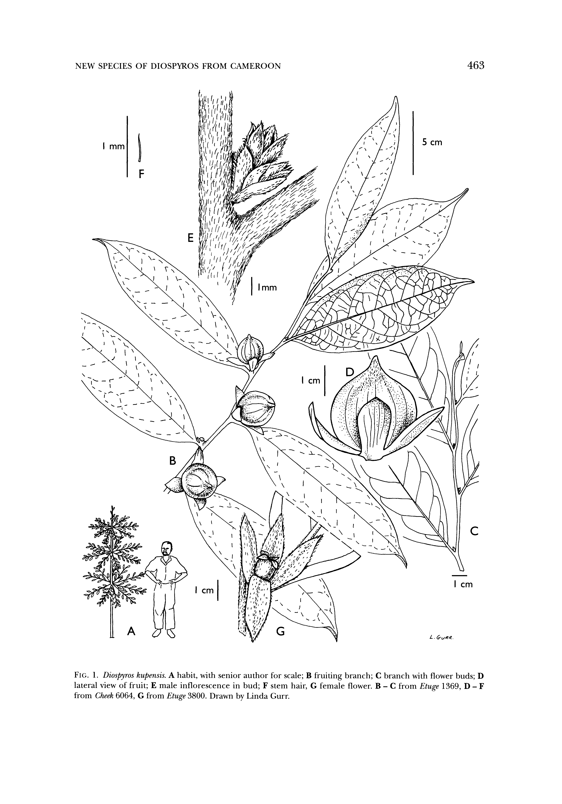

## Figure 0 (page 4)

*Caption:* FIG. 1. Diospyros kupensis. A habit, with senior author for scale; B lateral view of fruit; E male inflorescence in bud; F stem hair, G from Cheek 6064, G from Etuge 3800. Drawn by Linda Gurr.

---
