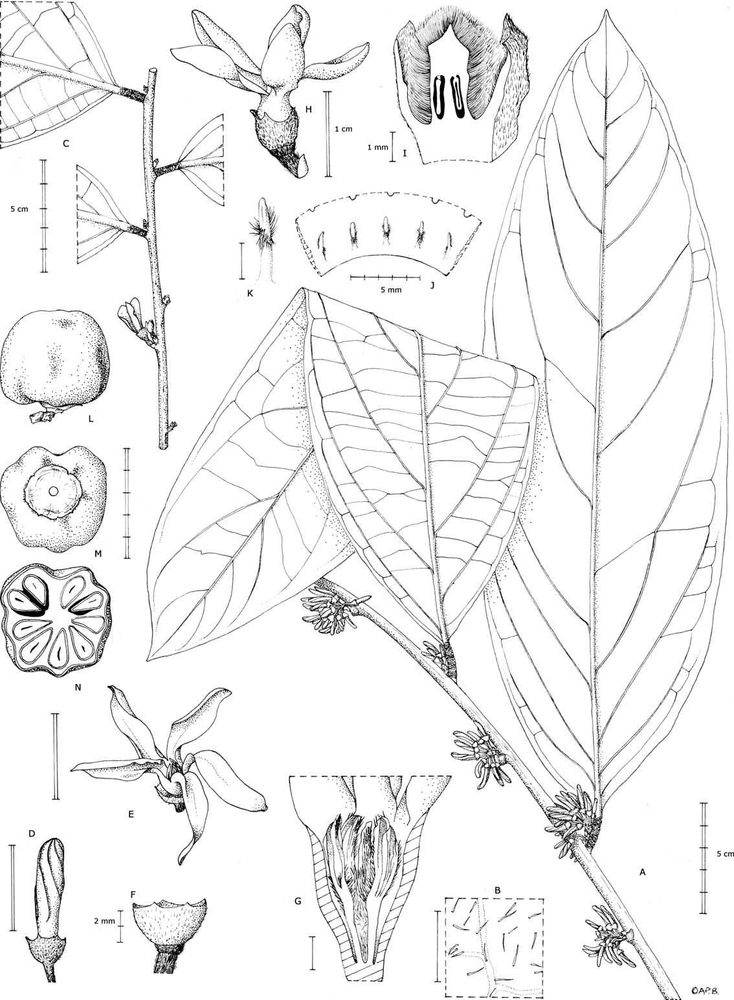
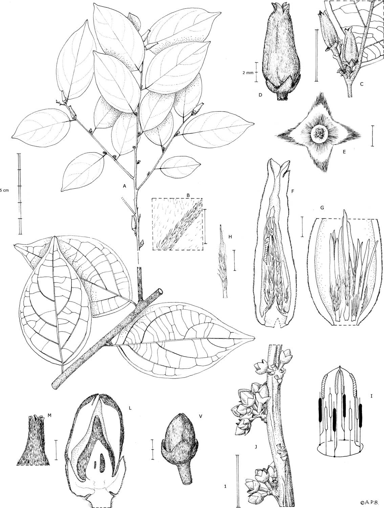
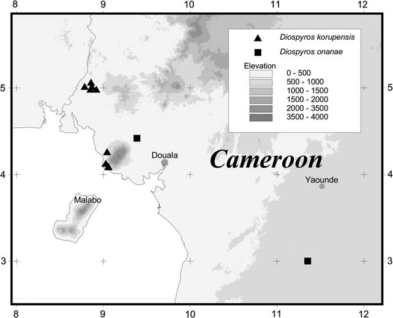

## Figure 0 (page 2)

*Caption:* Figure 1. Diospyros korupensis sp. nov. (A) habit, male plant, (B) abaxial leaf indumentum, (C) female branch. (D) (G) male ßower, (D) bud, (E) open, (F) calyx, (G) section, stamens united at base. (H) (K) female ßower, (H) lateral view, (I) section with corolla removed, (J) schematic dissection of base of corolla showing staminodes, (K) inner face of staminode. (L) (N) dried fruit, (L) lateral view, (M) basal view, (N) transverse section. (A) (B), (D) (F) from Thomas 10285, (C), (H), (J) (K) from Thomas 10518, (G), (I) from Moses 1855, (L), (N) from Moses 1988. All drawn by Andrew Brown. lens; chartaceous, adaxial surface olive-green, abaxial surface Flowers strongly scented, corollas white, drying black. markedly glaucous, with a smooth whitish to greenish Male flowers in fascicles of 30 50 flowers on old branches; yellow waxy epidermis, abaxial surface and midrib glabres- floral bracts round, 0.5 mm in diameter, glabrescent at cent with short fine white appressed hairs. base of pedicels, pedicels 2 4 mm long, pedicels and calices

---

## Figure 1 (page 5)

*Caption:* Figure 2. Diospyros onanae sp. nov. (A) (I) male plant, (A) habit, A1 adaxial leaf surfaces, A2 abaxial leaf surfaces, (B) leaf indumentum, abaxial surface with primary vein, (C) in ß orescence, (D) ß ower, (E) inner surface of calyx after corolla fallen, (F) ß ower section, (G) with corolla removed showing stamens, (H) shorter stamen, (I) diagram of androiceum showing four longer stamens in inner ring with connectives joined and 8 shorter stamens in outer ring. (J) (M) female ß ower, (J) in ß orescences, (K) bud, (L) lateral section of bud, (M) style and exposed stigmatic surfaces. (A) (H) from de Wilde 8273, (J) (M) from Thomas 4889. All drawn by Andrew Brown.

---

## Figure 2 (page 6)

*Caption:* Figure 3. Distribution of specimens of D. korupensis and

---
