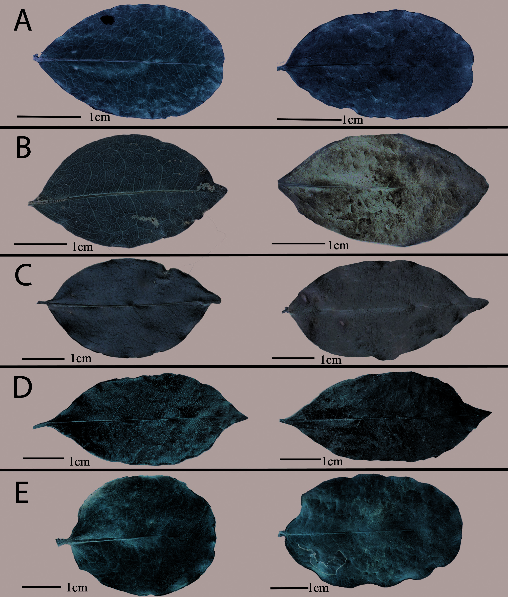
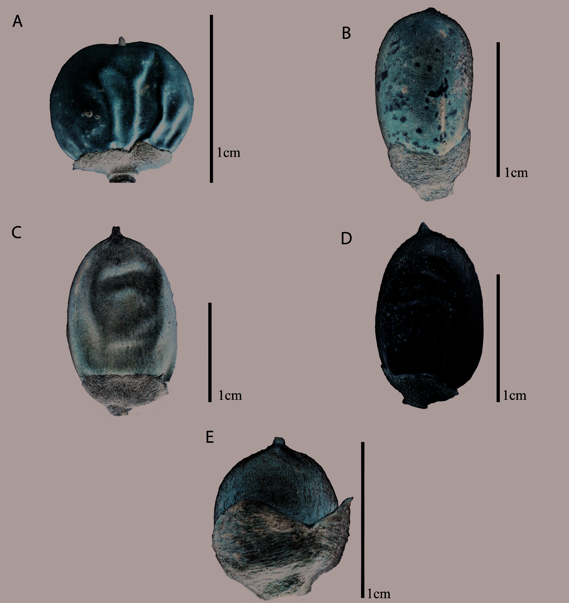
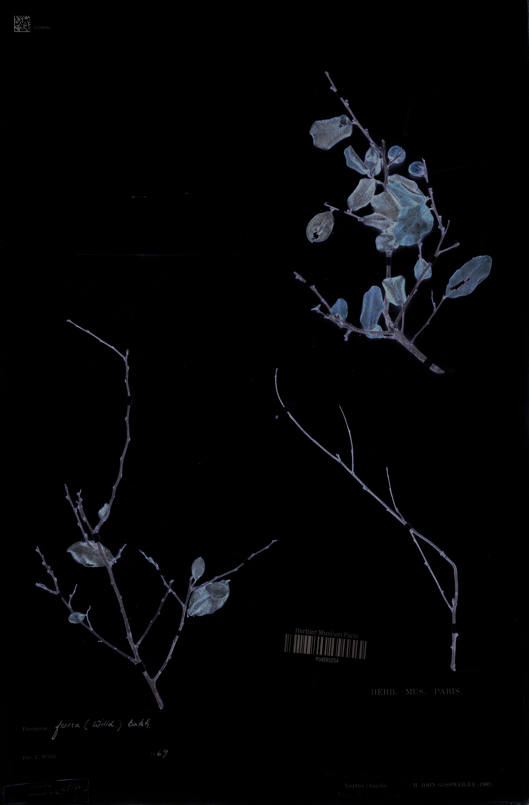
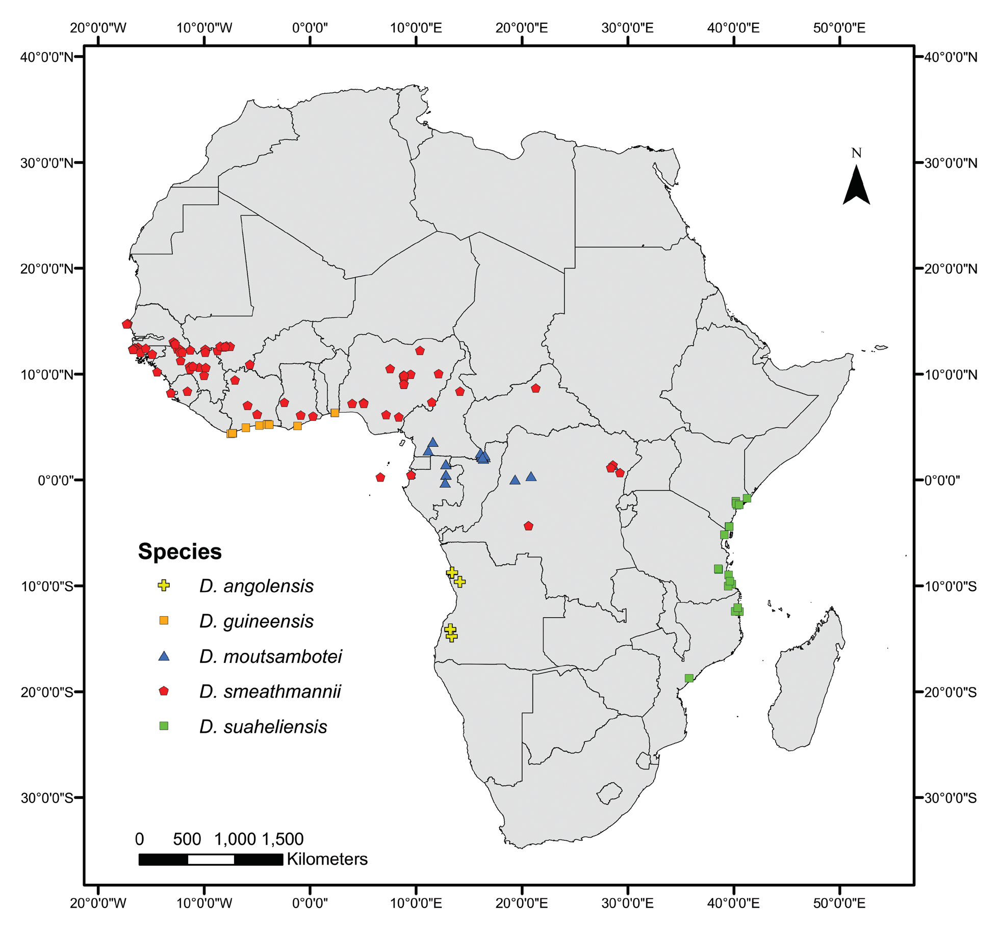
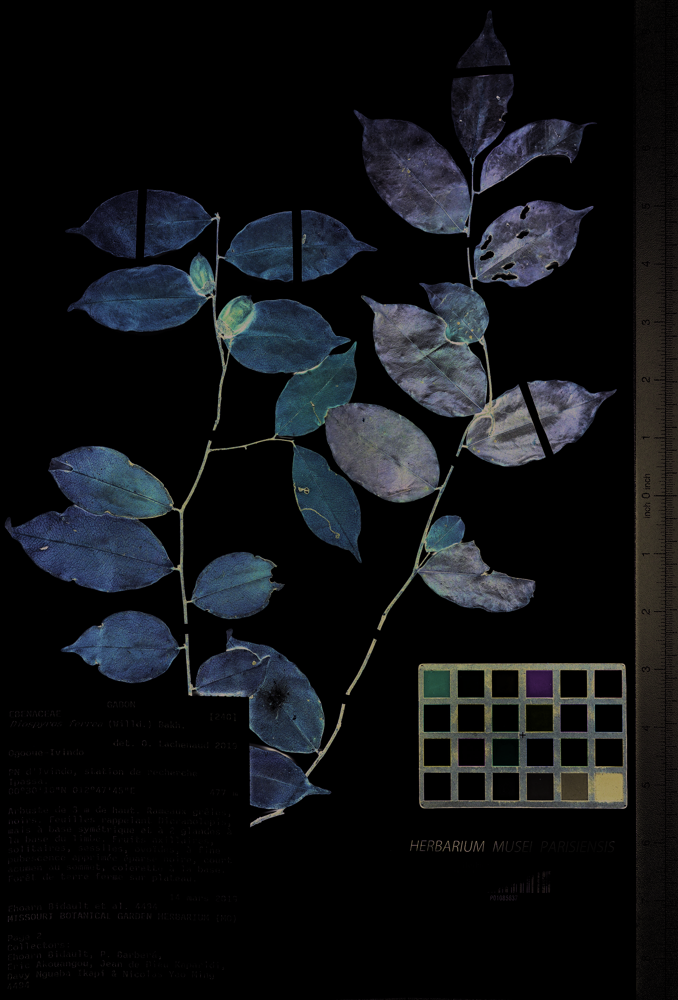
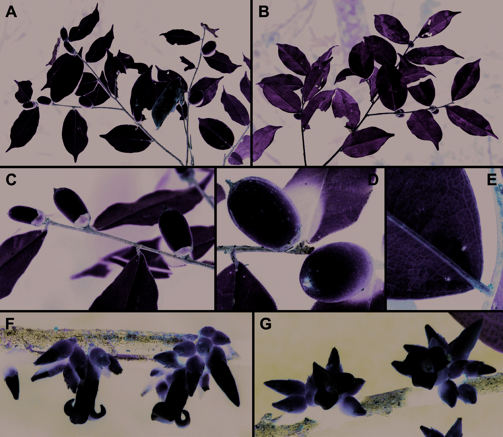
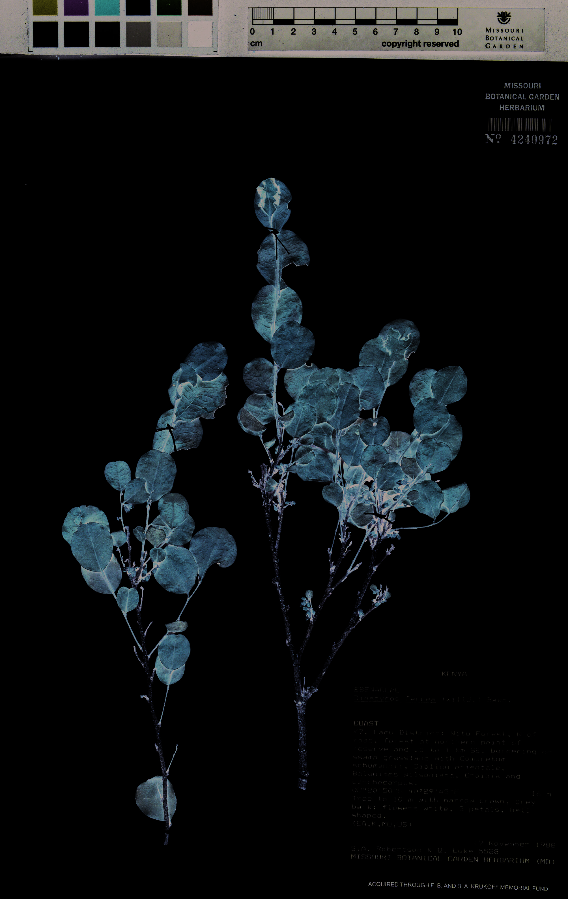

## Figure 0 (page 4)

*Caption:* Figure 1. Leaves of Diospyros depicting abaxial (le) and adaxial (right) surfaces. A . D. angolensis ( Gossweiler 9182 , K001561021). B .

---

## Figure 1 (page 6)

*Caption:* Figure 2. Fruits of Diospyros . A . D. angolensis (holotype, Gossweiler 789 , P04595254). B . D. guineensis ( Aubréville 903 , P04595333). C .

---

## Figure 2 (page 7)

*Caption:* Figure 3. Holotype of Diospyros angolensis ( Gossweiler 789 , P04595254).

---

## Figure 3 (page 8)

*Caption:* Figure 4. Distribution map in Africa of the ve species recognized among the African material previously included in Diospyros ferrea .

---

## Figure 4 (page 10)

*Caption:* Figure 5. Isotype of Diospyros moutsambotei ( Bidault et al. 4494 , P01085637).

---

## Figure 5 (page 11)

*Caption:* Figure 6. Photos of Diospyros moutsambotei in the eld. A . Lower surface of branch with fruits. B . Upper surface of same branch. C .

---

## Figure 6 (page 16)

*Caption:* Figure 7. Holotype of Diospyros suaheliensis ( Robertson & Luke 5528 , MO-4240972)

---
